# Black Hole Orbits: A Detailed Physics Guide

> What it means for an orbit to live near a black hole — and why stable orbits stop at 3 rₛ.

*Originally published at [profoundphysics.com](https://profoundphysics.com/black-hole-orbits/).*

---

To me, black holes have always been some of the most interesting phenomena in modern physics. One of the ways black holes differ from planets, for example, is that orbits around them can be much more intricate and complicated.

Now, can you actually orbit a black hole in the first place?

**It is possible to orbit a black hole. However, these orbits can be extremely complicated and they can only occur at distances greater than the innermost bound circular orbit (IBCO). At distances less than the IBCO, any orbiting body will inevitably spiral into the black hole due to gravity being too strong.**

In this article we’ll be discussing all kinds of details about orbits around black holes, such as **what kinds of orbits are possible** (they can be very different from what we typically see when observing planetary orbits).

We’ll also look at **how different types of black holes affect these orbits** (such as how orbits look like around charged and rotating black holes).

In case you’d want an **ad-free PDF version of this article** (an my other general relativity articles), you’ll find it [here](https://courses.profoundphysics.com/p/general-relativity-bundle), available as part of my full General Relativity Bundle.

Table of Contents

Toggle

## How General Relativity Explains Orbits

The first thing we’ll cover is how exactly **general relativity** explains orbits of objects under the influence of gravity.

Orbits around black holes generally require the use of general relativity (as opposed to Newtonian gravity) due to the extremely strong gravitational fields of black holes. So, how exactly does general relativity explain orbits?

**General relativity explains orbits as paths through spacetime along which there are no external forces. These are called geodesics. Any object moving along a geodesic will follow the curvature of spacetime, resulting in an apparent gravitational force that then allows the object to undergo orbital motion.**

The idea of *spacetime curvature* is sometimes a little misunderstood.

The problem with it comes from the fact that it is not something we can just intuitively imagine.

This is why the whole geometric picture of general relativity is quite abstract in many cases and should not be taken too literally (like we sometimes see with awkward rubber sheet and billiard ball analogies of curved spacetime).

However, what does work objectively and give correct predictions is the mathematics of general relativity.

For this article, you won’t really need much math, but if you’re interested, I have an **[introductory article on general relativity](https://profoundphysics.com/general-relativity-for-dummies/)** that covers all the underlying principles of the theory as well as how these are described by the sometimes complicated mathematics of general relativity.

You may also wish to check out my **[guide on learning general relativity on your own](https://profoundphysics.com/how-to-learn-general-relativity-a-step-by-step-guide/)**, which aims to give you a step-by-step approach on how you can learn general relativity by yourself without any kind of formal education.

Anyway, the main point that you need to understand about general relativity for this article is that **general relativity describes gravity from a different perspective than Newtonian gravity with different (and more accurate) predictions**.

In the Newtonian picture, **gravity is an attractive force between any objects with mass**, to put it simply.

In general relativity, on the other hand, **gravitational forces are viewed as changes in the geometry of spacetime** (curvature) due to energy being present (including mass) and all objects simply follow their natural paths in this curved geometry (geodesics).

Now, the important thing is that general relativity is only necessary to describe gravitational fields that are **extremely strong** (such as in the case of orbits around black holes).

In these cases, the predictions given by general relativity are quite different than those given by Newtonian gravity. We’ll look at exactly this next in the context of orbits.

### Kepler Orbits vs Relativistic Orbits

In **Newtonian gravity**, which is more or less the usual theory of gravity as a force between massive objects, all orbits under the influence of gravity are **conic sections**.

Note that in the context of this article, we’ll be mostly discussing orbits in which one object orbits a central mass that is stationary (unless stated otherwise).

Conic sections are basically a geometric class of curves that include **circles, ellipses, parabolas and hyperbolas**. The name “conic section” comes from the fact that all the above curves can be formed as intersections of a cone with a plane.

Anyway, these types of orbits (which trace out curves that are conic sections) are called **Kepler orbits**. To put it simply, **Kepler orbits are orbits of objects under a gravitational force that obeys Newton’s inverse square law** (F∼1/r2).

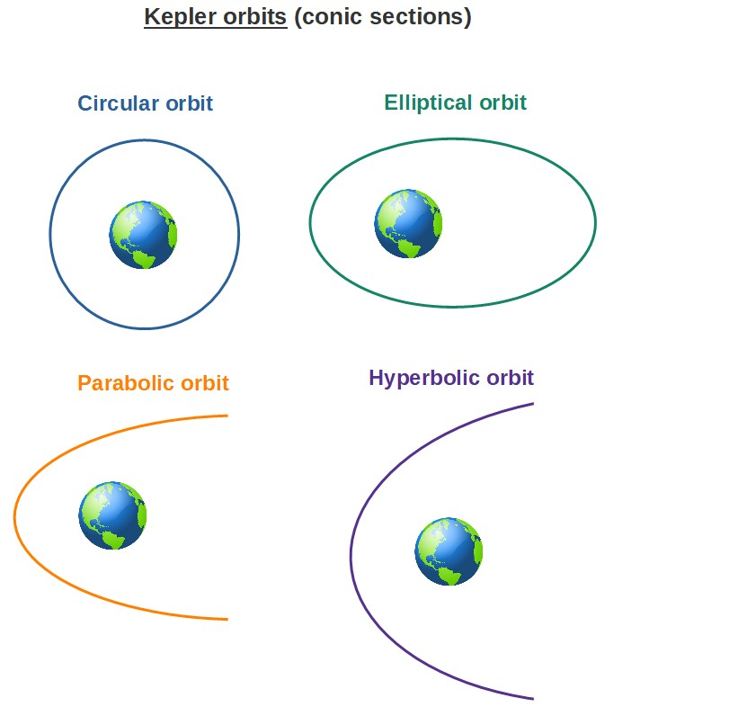 

The circular and elliptical orbits are both *bound orbits*, which means that the orbiting object returns to its starting point after a full period. The parabolic and hyperbolic orbits, on the other hand, are *unbound orbits*, meaning that the trajectory of the object only gets deflected before escaping from the gravitational pull of the central mass.

All Kepler orbits are described by an equation known as the **orbit equation**, which gives the radius r (distance to the central mass) as a function of the angular position of the particle in orbit (φ):


Here, p is a length parameter called the semi-latus rectum (essentially just a constant with dimensions of length) and e is the eccentricity (a dimensionless constant, which in a sense, describes how much a conic section differs from being a circle which would have e=0).

The orbit equation essentially gives the *shape* of the orbit traced out by a particle orbiting around a central mass.

Anyway, the point here isn’t to indulge in the mathematics of orbital mechanics, but rather to highlight the following key points:

- **All orbits in Newtonian physics** (also called Kepler orbits, which obey the inverse square force law for gravity) **are conic sections**.
- This means that the **possible orbits allowed by Newton’s laws are circles, ellipses, parabolas or hyperbolas**. These are all described by the **orbit equation**.
- **No other types orbits can exist in Newtonian gravity** (at least for one orbiting object around a stationary “central mass”).

For the rest of the article, I suggest keeping in mind these details. Now, what happens when **general relativity** is taken into account?

First of all, the inverse square law of gravity becomes inaccurate for **strong gravitational fields** (such as near black holes).

In general relativity, there isn’t really a clear notion of a “force law for gravity”, however, in principle, it is possible to derive an equation that resembles Newton’s gravitational force law. This has the following (schematic) form:


In contrast, the Newtonian law of gravity would only have this first term, which gives the usual inverse square law. This second term is an inverse cubic correction induced by general relativity. Notice, however, that due to this factor of c2 (the speed of light, which is a rather large numerical constant) in the denominator, this inverse cubic term only comes into play at small distances (when 1/r3 is large).

At large radii, this 1/r3c2 -correction term is quite small, but it is still enough to account for some of the interesting orbital phenomena in general relativity such as the *precession of elliptical orbits* (which we’ll talk about later).

However, at **small distance scales** when gravity is very strong (close to a black hole, for example), these 1/r3 -corrections become very significant and generally, orbits can become extremely complicated (they’ll exhibit so-called *zoom-whirl behavior* as we’ll see later on).

Another noteworthy point is that in Newtonian gravity, objects can, in principle, have arbitrarily large orbital velocities. This also means that orbits can exist arbitrarily close to the central mass (since a larger orbital velocity allows an object to orbit within a smaller radius).

In general relativity, however, the orbital velocity of an object is limited by the speed of light, meaning that there are actually **limits on how close an object can orbit**, for example, a black hole. We’ll also discuss these later.

|  | Kepler orbits | Relativistic orbits |
| --- | --- | --- |
| Types of orbits | Conic sections (circles, ellipses, parabolas or hyperbolas) | Conic sections + some additional types of orbits (precessing ellipses, zoom-whirl orbits and spiral fall orbits, for example) |
| Mathematical formula | The orbit equation: r\left(\varphi\right)=\frac{p}{1+e\cos\varphi} | No general formula describing all of the orbit types |
| Limitations on possible orbits | Orbit has to be a conic section | Orbital velocity is limited to the speed of light + circular orbits are limited to a radius of r > 1.5 rs |
| Orbit stability | Bound orbits are generally stable | Bound orbits are unstable within a certain region (r < 3 rs) + orbits can intrinsically “decay” due to gravitational radiation |

Here, rs is a length-scale associated with the mass of a black hole called the Schwarzschild radius. It also gives the location of the event horizon, the “point of no return”.

All of this may seem like a lot, but if there is one thing to take away from this section, it would be the following; **Kepler orbits are (approximately) accurate when far away from the central mass or in a weak gravitational field**.

However, when looking at special cases of extremely strong gravity (like black holes, which is the topic of this article), corrections from general relativity become more prominent and new types of orbital phenomena will occur.

It is possible for these relativistic corrections to also take place in weak gravitational fields, but this requires a sufficiently long period of time. An example of this is the famous precession of Mercury’s perihelion, which is explained later.

### Using The Effective Potential To Analyze Orbits

There is an extremely useful tool we can use to analyze different types of orbits called the **effective potential**. By graphing the effective potential, we can easily visualize properties of different orbits without using much math. But, what is the effective potential?

**In short, the effective potential is a function that combines effects of the gravity well of a central mass with the angular momentum of a body orbiting the central mass. The effective potential thus describes the balance between the centrifugal and gravitational force and can be used for analyzing orbits.**

Let’s briefly look at how the effective potential in Newtonian gravity describes the Keplerian orbits we discussed earlier.

This helps us understand how we can use the effective potential in general relativity to describe the orbits around a black hole and how exactly these differ from the Keplerian orbits.

Now, the **effective potential function in Newtonian gravity** is given by:


The first term is just the Newtonian gravitational potential, while the second term can be thought of as the potential energy arising from the centrifugal force due to the orbiting body possessing a non-zero angular momentum. The parameters here are; M=the central mass (such as the mass of a black hole), m=mass of the orbiting body (small compared to M) and L=angular momentum of the orbiting body. The variable r is the radial distance from the center.

We can plot this as a function of r, which gives us a graph that looks as follows:

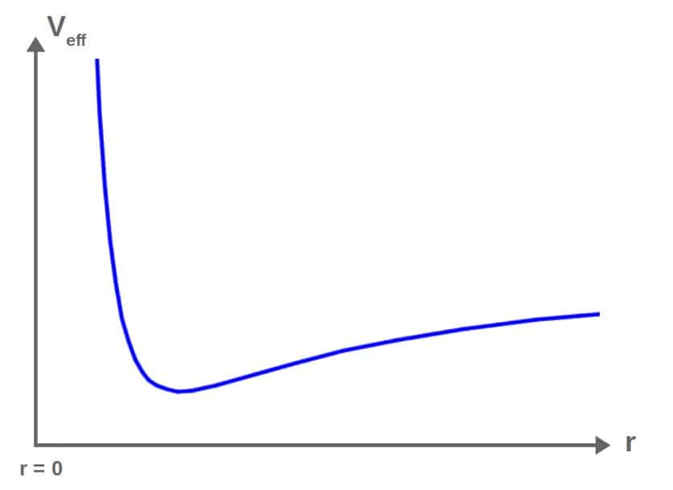 

Note; in reality, part of the potential graph should go under the r-axis, meaning that Veff should also have negative values. For our qualitative analysis, I’ve simply shifted the potential graph above the r-axis to avoid any extra clutter, but this will not make any difference for us.

Now, how can we understand orbits from this? Essentially, you can imagine that a particle under the influence of this effective potential is like a “ball” rolling along this curve as if it were a hill.

So, if this particle starts of at some particular “height” (corresponding to some total energy), you can think of it trying to “roll down” the potential well to a lower height (minimizing its effective potential).

Depending on the total energy of the particle (how much kinetic and potential energy it has), it will roll down this hill, corresponding to a certain type of orbit.

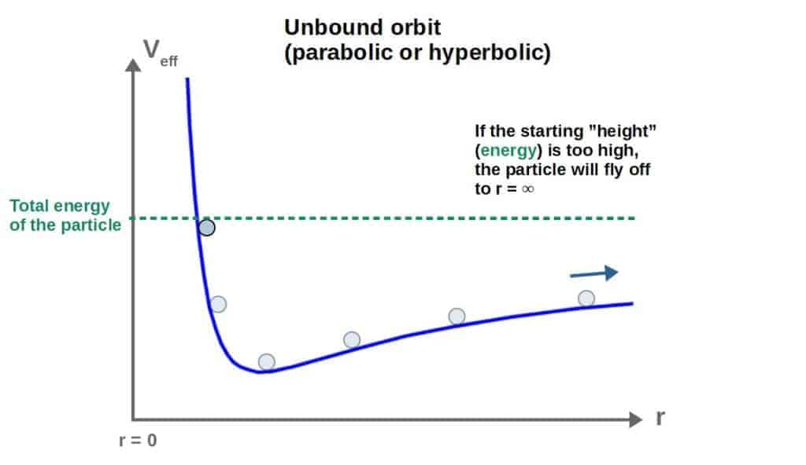 

Unbound orbits (which can either be parabolic or hyperbolic) occur if the particle has too much energy (or velocity). In these cases, it may get deflected by the gravity of the central mass and then fly off, but it won’t stay in a bound orbit.

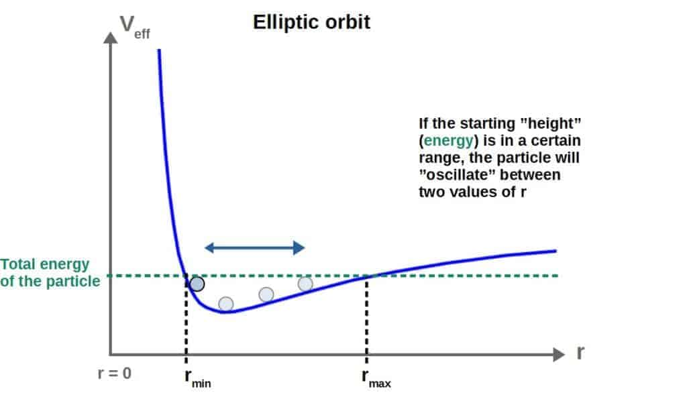 

Elliptic orbits can occur if the particle has a “moderate” energy, meaning it doesn’t have too much kinetic energy (its velocity is not too large). In these cases, the particle will enter a bound orbit, which has a maximum and minimum distance (which defines an ellipse.)

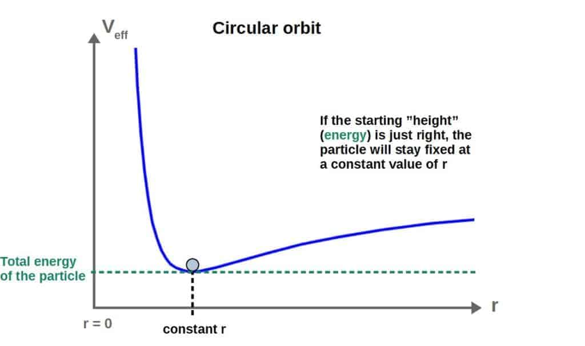 

Circular orbits can occur at exactly one value of the energy, which corresponds to the minimum of the effective potential. In this case, the particle will simply orbit at a constant radius (which is the defining feature of a circle). In contrast, we will discover that in a black hole orbit, there are two possible radii for a circular orbit.

There are a few additional noteworthy details about this Newtonian effective potential:

- **The Newtonian effective potential increases to infinity as r goes to zero**. This means that getting to arbitrarily small r would require infinite energy and thus, it is not physically possible.
- Therefore, **in Newtonian gravity, it is not possible for an object to “plunge” into the central mass**.
- **The Newtonian effective potential does not have a maximum** (only a minimum, which corresponds to a *stable* circular orbit).

Now, in **general relativity**, the effective potential function has the following form (as a technical detail, this is the effective potential for the **Schwarzschild metric**, which describes the spacetime around a spherical object like a black hole):


Notice the similarity of this to the Newtonian effective potential; the only difference is this 1/r3 -correction term, which is negligible far away (at large r) and when gravity is not too strong (M is small).

Graphing this as a function of r, it looks as follows:

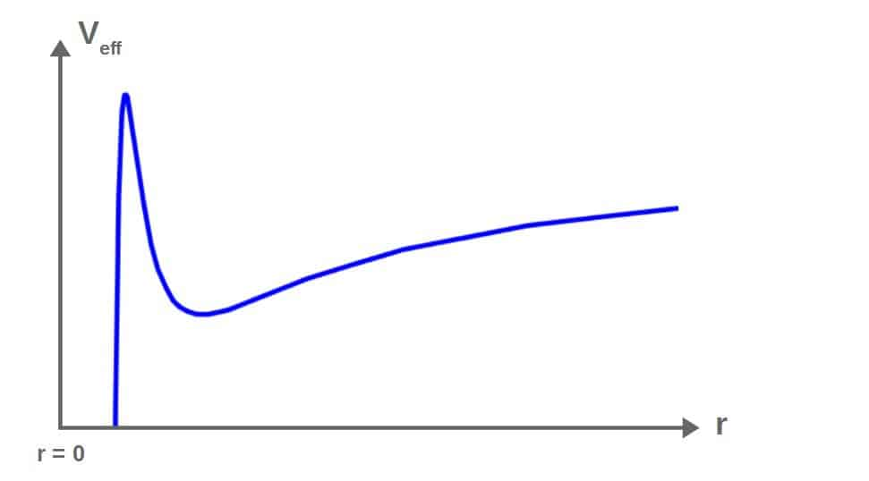 

Notice that this potential has a maximum, which actually corresponds to an *unstable* circular orbit as we’ll see later. Notice also that far away at large r, the graph looks more or less similar to the Newtonian potential (although it is still, even at large r, slightly different from the Newtonian potential, which explains for example, the phenomenon of perihelion precession).

Later in this article, we’ll use this effective potential to analyze the different orbit types that are possible around a black hole. It will turn out to be an extremely useful tool for getting a deep understanding of these orbits.

## Different Types Of Orbits Around A Black Hole

In this section, we’ll look in detail into **what kinds of different orbits are possible around a black hole**. The differences are actually quite drastic to the basic elliptical orbits in Newtonian gravity.

**When orbiting around a black hole sufficiently far away, orbits resembling typical Kepler orbits are possible. When orbiting close to a black hole, however, Keplerian orbits are not possible. In this strong-field regime, an object will enter a complex zoom-whirl orbital pattern or spiral into the black hole.**

In the following sections, I’ll explain what these different orbital patterns are and we’ll look at all of the different types of orbits that can exist around a black hole.

Now, it’s worth noting here that we will only be looking at so-called “idealized” orbits, meaning that these are orbits of a *test particle* (a point particle whose own features does not significantly influence the gravitational fields at play here) around a stationary central mass.

In real-world orbital mechanics, there can certainly be outside influences that affect the shapes of realistic orbits (like the gravity or tidal forces of other massive bodies nearby), but we will neglect these here.

So, for the analysis of these different orbits, just keep in mind that **they are valid for a small object** (think of a satellite, for example) orbiting around a large object (in this case, a black hole) and **without any external forces**.

Also, these orbits we discuss will be around so-called **Schwarzschild black holes**, which are uncharged, non-rotating and spherically symmetric black holes. Later we will talk about *rotating* black holes and what kinds of orbits are possible around them.

Anyway, here’s a table summarizing the possible orbits around a Schwarzschild black hole as well as the ranges in which these orbits occur in (all the terminology in this table is explained as you read further):

| Orbit type | Distance range |
| --- | --- |
| Circular orbit | Unstable between the IBCO and ISCO and stable outside of the ISCO |
| Precessing elliptical orbit | Outside of the ISCO |
| Zoom-whirl orbit | Between the IBCO and ISCO |
| Spiral fall orbit | Inside of the IBCO |
| Unbound orbit | Outside the ISCO |

### Circular Orbits

We’ll start our discussion of black hole orbits by talking about the simplest orbits a particle can have around a black hole; **circular orbits**.

**In Newtonian gravity** (recall from the section on effective potentials), we established that **there is exactly one possible circular orbit** for any given central mass and angular momentum. These occur at the *minimum* of the effective potential.

However, a circular orbit can also occur at the *maximum* of the effective potential. In the Newtonian effective potential, there does not exist a maximum value, but in general relativity there does indeed.

So, in fact, around a black hole, there exists **two possible circular orbits** (characterized by a constant radius from the center as you might expect for a circle); **one at the minimum of the effective potential and one at the maximum**.

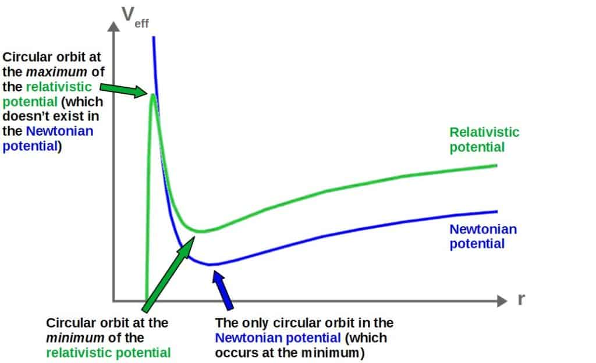 

There are, however, differences between these two circular orbits:

- Circular orbit at the minimum of the potential corresponds to a **stable circular orbit**.
- A small perturbation in this stable orbit will cause the particle to simply “oscillate” around the stable orbit, but won’t significantly change the orbit.
- Circular orbit at the maximum of the potential corresponds to an **unstable circular orbit**.
- A small perturbation in this unstable orbit will cause the particle to either “plunge” into the black hole or fly off to larger radii.

For any given angular momentum of the orbiting particle, these two circular orbits will be located at different radii (for some values, it’s possible only one or neither of these exist), however, there are **limits as to how close these circular orbits can exist to the black hole**.

The smallest possible radii at which these two types of circular orbits can occur are called the **innermost stable circular orbit (ISCO)**, which is the a stable orbit and the **innermost bound circular orbit (IBCO)**, which is the unstable (though still a bound) orbit.

Mathematically, the IBCO and ISCO are given by (rs here is the Schwarzschild radius or event horizon of the black hole, given by rs=2GM/c2):


There are a few noteworthy points about the above values:

- **The ISCO is the limit beyond which there does not exist any stable circular orbits**. So, it is possible to have stable circular orbits at r ≥ rISCO.
- **The IBCO is the limit beyond which there does not exist any circular orbits anymore, not even unstable ones**. So, a particle orbiting at a radius less than rIBCO will inevitably fall to the event horizon and into the black hole (unless using powerful rockets or something).
- This is because **beyond the IBCO, a circular orbit would require an orbital velocity greater than the speed of light**, which is not possible.
- **The IBCO is, in fact, the point at which orbiting is only possible at exactly the speed of light**. Therefore, no massive particle can have an orbit at the IBCO, only light can. This is why it is sometimes called the **photon sphere**.
- **Between the IBCO and the ISCO** (rIBCO < r < rISCO), **no stable circular orbits can occur, but unstable circular orbits can**.

```
Sidenote; I have a full article on orbits of light around a black hole. In this article, I explain what the photon sphere is, what kinds of different orbits light can have around as well as derive these orbits mathematically using concepts of general relativity.
```

Here’s a schematic picture of these different regions that circular orbits can or cannot exist in:

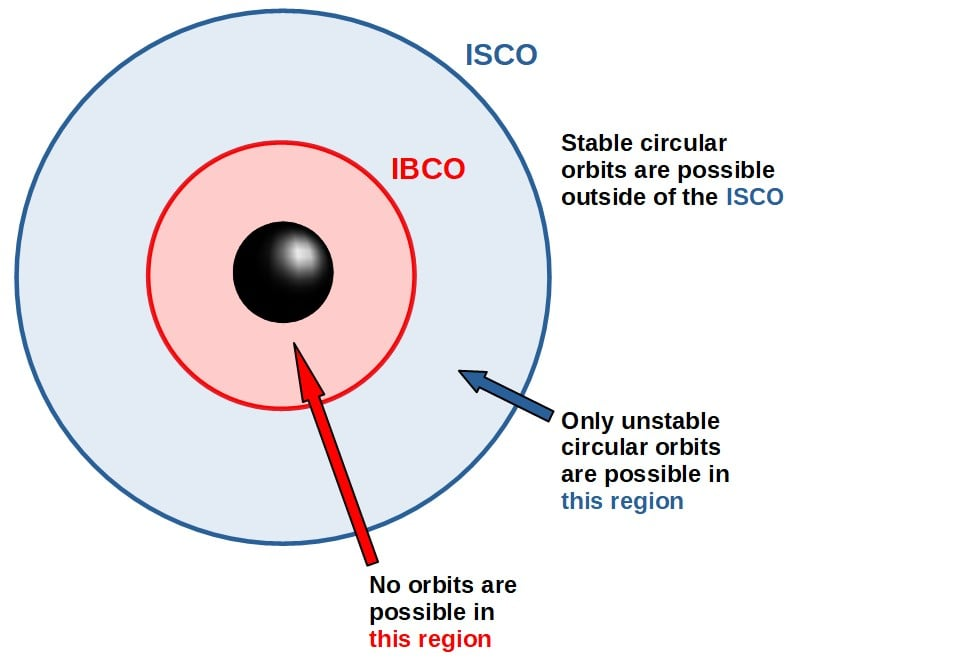 

Another important detail is that there exists a **minimum angular momentum** for a particle to have an orbit in the first place. The value of this is given by:


Any particle with angular momentum less than this critical value will inevitably spiral into the black hole.

In contrast, **there is no minimum angular momentum in Newtonian gravity**. There exists a **stable** orbit for any value of the angular momentum (all circular orbits in Newtonian gravity are stable).

In fact, in Newtonian gravity, no particle that has a non-zero angular momentum will ever be able to “fall” into the central mass.

This may seem unintuitive since in the real world, there are definitely things like meteorites that do fall onto the surface of Earth.

However, this is due to factors like real objects not being perfectly symmetric “point masses” and the Earth having an atmosphere, for example (which can cause objects to lose energy and angular momentum).

Now, circular orbits around a black hole are quite rare in reality (actually, no orbit is *perfectly* circular). A more realistic model is that of a **precessing elliptical orbit**.

The useful thing about these circular orbit ranges (ISCO and IBCO) is that they act as **limits** that tell us how close to a black hole certain orbital trajectories are possible. This will become clear as you read further.

### Elliptical Orbits & Orbital Precession

**In Newtonian gravity, all bound orbits are ellipses** (the circular orbit is actually a special case of an elliptical orbit). The key thing about this is that these elliptical orbits are *perfectly* elliptical.

**In general relativity, on the other hand, elliptical orbits do not exist**. *Perfectly* elliptical orbits, at least. This is because elliptical orbits in general relativity exhibit a behavior known as **perihelion precession**.

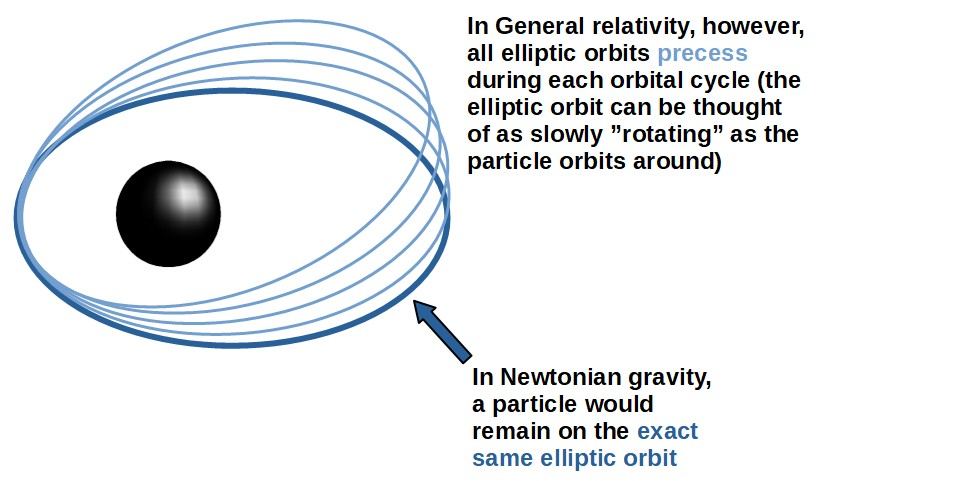 

Now, orbits that are very close to perfect ellipses are still possible. This is seen, for example, in the solar system where the gravity of the Sun of somewhat weak for most of the planets.

The same applies far away from a black hole. **Far away, all orbits look very similar to Keplerian orbits**, so they might seem almost perfectly elliptical (since the relativistic precession is so small far away).

When you get somewhat close to the black hole, this precession starts becoming more noticeable.

In fact, beyond the ISCO, relativistic effects become so strong that the **precessing elliptical orbit is not even possible anymore** (this is when orbits really get quite crazy, which we’ll explore in the next section).

Now, why exactly does this orbital precession occur? **The simple answer is that the mathematics of general relativity predict so**.

This can actually be traced back to the fact that the force law of gravity doesn’t have a perfect 1/r2-dependence, but rather has this 1/c2r3-correction term (as explained earlier).

The **relativistic correction term** is enough to explain the precession of typical Keplerian orbits (ellipses).

We can understand this again by simply looking at the **relativistic effective potential** and comparing that to the Newtonian one.

Elliptical orbits, in the effective potential graph, occur when the orbiting particle is “oscillating” between a **minimum** and a **maximum radius** (as we discussed earlier in the article).

The same is true for the relativistic potential graph, except for the fact that this potential has a **slightly different shape** than the Newtonian potential graph.

This may not seem too important, but it’s exactly this difference in shape that explains the precession of elliptical orbits.

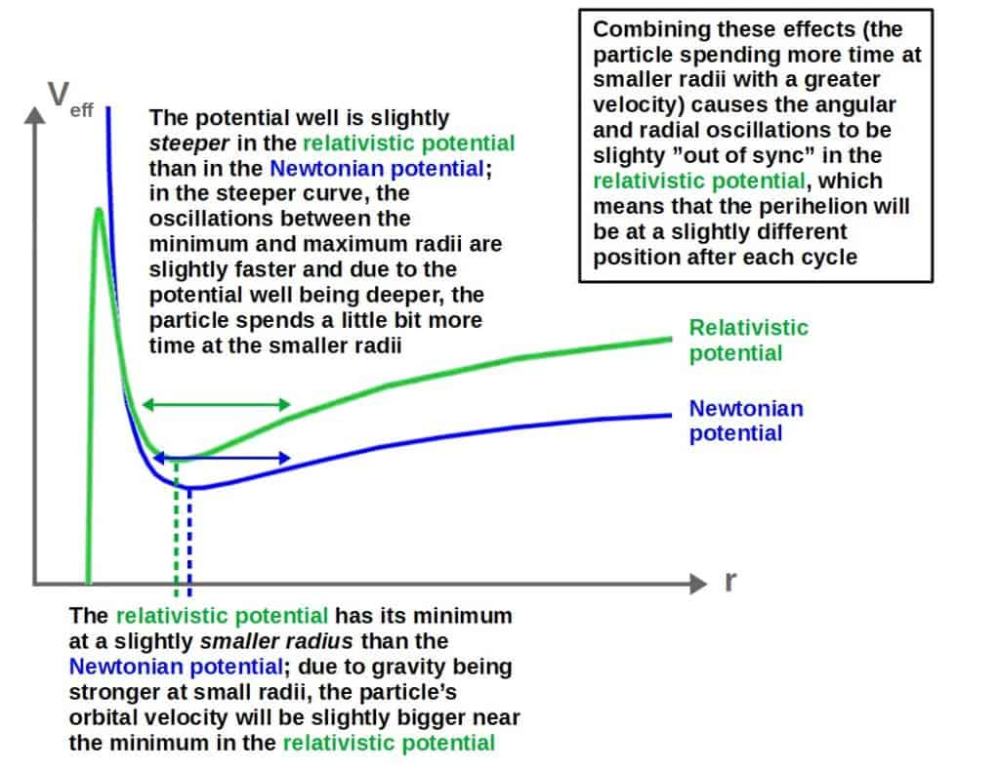 

This can also be explained in a more mathematical way; it’s possible to derive an “orbit equation” for general relativity, though this is just an approximation that is only valid when gravity is not too strong (generally outside the ISCO).

|  |  |
| --- | --- |
| Orbit equation for Kepler orbits: r\left(\varphi\right)=\frac{p}{1+e\cos\varphi} | Orbit equation for relativistic orbits (valid only for weak to moderate gravity): r\left(\varphi\right)=\frac{p}{1+e\cos\left(\varphi-\frac{3GM}{c^2p}\varphi\right)} |
| For bound orbits, this describes perfect elliptical orbits | For bound orbits, this describes elliptical orbits that *precess* during each orbital cycle. The precession angle is given by: \delta\varphi=\frac{6\pi GM}{c^2p} |
| Elliptical orbits are, in principle, possible at any radius | (Precessing) elliptical orbits are possible outside the ISCO |

Now, even though this orbital precession is only really noticeable when gravity is somewhat strong, it’s still possible to see this phenomenon in weak gravitational fields.

The catch here is that this can only be noticed over a **long period of time**. This is because no matter how small the precession angle, if given enough time, the precession effects will “accumulate” to a noticeable difference over a very long period.

An example of this is with the **orbit of Mercury** (which is also one of the most famous tests of general relativity), in which the perihelion precession accumulates (due to relativistic effects that nothing in Newtonian gravity could explain) to an angle of about 0.012° over 100 years. This may seem like a tiny number, however, it is still a measurable effect.

The same phenomenon of perihelion precession does happen to other planets in the solar system as well, so in this sense, there isn’t really anything special about Mercury. The numerical values of this effect for other planets are just much much smaller.

This is because Mercury simply happens to be closest to the Sun (where gravity is strongest relative to the other planets), so the effect is much more noticeable.

### Zoom-Whirl Orbits

So far, we’ve only discussed orbits that are quite similar to the familiar Keplerian orbits. These are the **circular orbits** (unstable and stable) as well as the **elliptical orbits** with a small relativistic correction resulting in a precessing ellipse.

We’ve also established that the **precessing ellipse is a very good approximate model for orbits outside of the ISCO**. But what happens to orbits inside of the ISCO? This is when things get really interesting with orbits requiring full-blown general relativity to describe them.

Now, one of the possible orbits inside of the ISCO is the **unstable circular orbit**, which we discussed earlier. The other possibility is a complicated orbital pattern called a **zoom-whirl orbit**, which is a new type of orbit that doesn’t exist in Newtonian gravity.

These zoom-whirl orbits are complicated in the sense that they don’t really have a simple general “shape” like the elliptical and circular orbits do. In fact, these orbits require a whole classification system to fully describe them.

But first of all, why are these called zoom-whirl orbits? Essentially, this name comes from the fact that these orbits can have both “small loops” (**whirls**) and “large loops” (**zooms**) around the black hole.

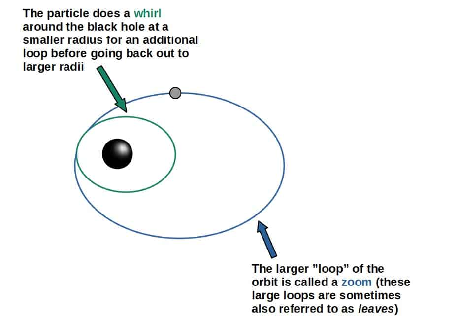 

The interesting thing about these orbits is that they can, in principle, have any number of whirls (small loops) and zooms (the “leaves” or larger loops).

This makes for some extremely unique but also complicated orbital patterns. Luckily, there is a neat way to classify these orbits and their general shape. This classification system is referred to as the **periodic table of black hole orbits**.

What I’m going to talk about next that will help us understand these complicated orbits is largely based on a paper called [A Periodic Table for Black Hole Orbits](https://arxiv.org/abs/0802.0459) (link to arXiv), that introduces this system of classifying black hole orbits.

In this system, **each orbit is characterized by three numbers**, (z,w,v). These stand for **zooms**, **whirls** and **vertices** or more accurately, vertex sequence.

Okay, what do these numbers mean exactly? Here’s a little summary of how this classification system works:

- **The integer z stands for the number of zooms or leaves in the orbit**; this is the number of “large loops” the orbiting particle traces out before returning back to its starting position at the apastron (largest distance from the black hole).
- **The integer w stands for the number of whirls in the orbit**; this is the number of “small loops” the orbiting particle traces out around the black hole before returning to the apastron.
- **The integer v stands for the sequence of vertices in the orbit**; this describes the order in which the orbiting particle moves from one vertex (= zoom or leaf) to another. In particular, v gives the next vertex the particle will move to from its starting vertex.

Let’s look at an example of exactly how this works. Down below we have a (3,1,1) -orbit. This means that the orbit has a z-value of 3, a w-value of 1 and a v-value of 1.

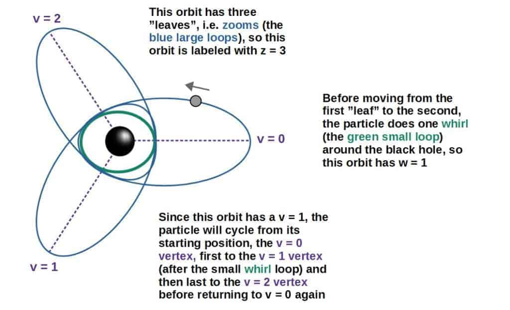 

Note; the value of v doesn’t directly impact the shape of the orbit, only the order in which the particle does these “loops”. By convention, the starting position (vertex) is always labeled by v = 0 and the other vertices are counted clockwise (however, if the black hole is rotating, the vertex sequence will depend on whether the orbit is prograde or retrograde). The v-value of the *orbit itself* depends specifically on the first vertex the particle moves to; in a v = 1 orbit, the particle will cycle to the v = 1 vertex after the v = 0 loop, but in a v = 2 orbit, the particle would instead cycle to the v = 2 loop first.

It’s also worth noting that not all orbits are perfectly periodic as the one shown above. In fact, **these zoom-whirl orbits can also precess**, similarly to the elliptical orbits discussed earlier.

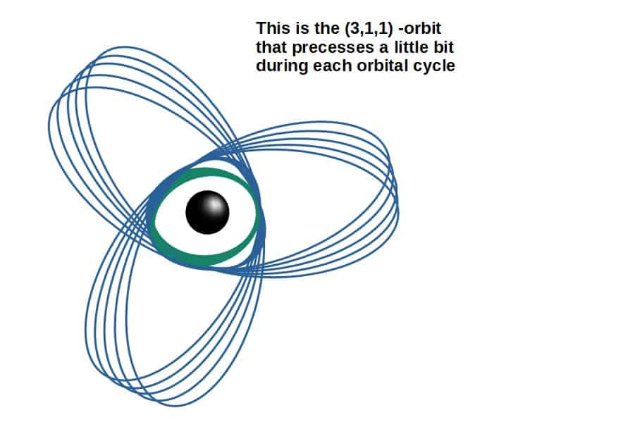 

Interestingly, these more complicated orbits that are *aperiodic* (the particle doesn’t return to exactly the same point after each orbital cycle) can be approximated as precessions of the exactly periodic counterpart orbits (in this case, the (3,1,1) -orbit), thus allowing us to describe ALL black hole orbits using this “periodic table” classification system. This is discussed in detail in the paper linked above.

Now pair this up with the zoom-whirl behaviour that induces these small and large loops in the orbit and the possible orbits one can have near a black hole are radically different from those seen in Newtonian gravity.

There is also a nice website (which you’ll find [here](https://www.fourmilab.ch/gravitation/orbits/)) that allows you to explore these orbits visually and you’ll be able to see how these zoom-whirls as well as the orbital precession phenomenon combine to produce some pretty weird-looking orbital shapes.

There is one more important and insightful detail about these zoom-whirl orbits and that is **how they can be described using the effective potential function**.

To understand this, let’s note that these zoom-whirl orbits occur only at relatively small radii (generally at r < rISCO). Now, recall again the **effective potential in general relativity**:

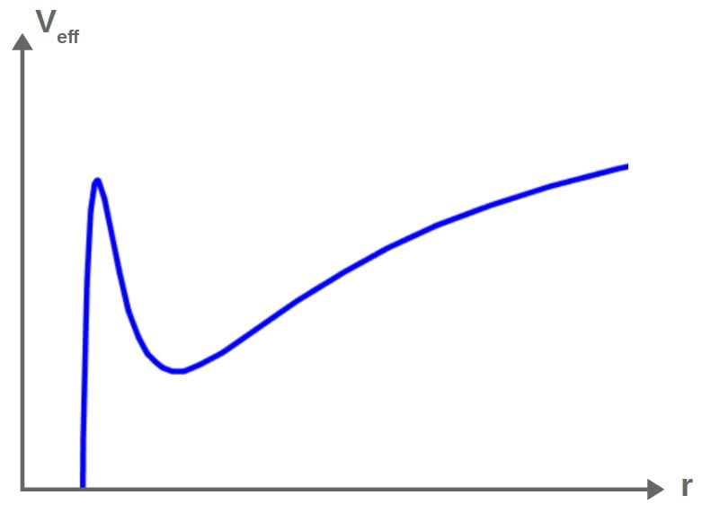 

The effective potential has this **large peak at the maximum of the potential** (which occurs at rIBCO, the smallest radius a freely orbiting particle can be at, otherwise it will fall into the black hole).

This means that **zoom-whirl orbits always happen close to this peak in the potential**. In fact, the larger this peak, the more of this zoom-whirl behavior the orbiting particle will exhibit.

This can happen if the particle has a large enough angular momentum to orbit very close to the black hole (at small r and thus, close to the potential peak), but without falling in.

Since there is a stationary point in the potential, although unstable, at this peak (the IBCO), **the particle will spend slightly more time near this stationary point** before returning to larger radii again.

You can think of the particle “wanting” to remain at a stationary point of the potential (thus spending more time at that radius), but since it’s angular momentum is not exactly right for remaining in a circular orbit at the IBCO, it will oscillate between this peak and some maximum radius.

Since the particle **remains slightly longer near this peak** and it also has a **larger orbital velocity near the peak**, it can actually “loop” multiple times around the black hole (these are the “whirls”) before going further out again and doing a “loop” at larger radius (this is the “zoom” part of the orbit).

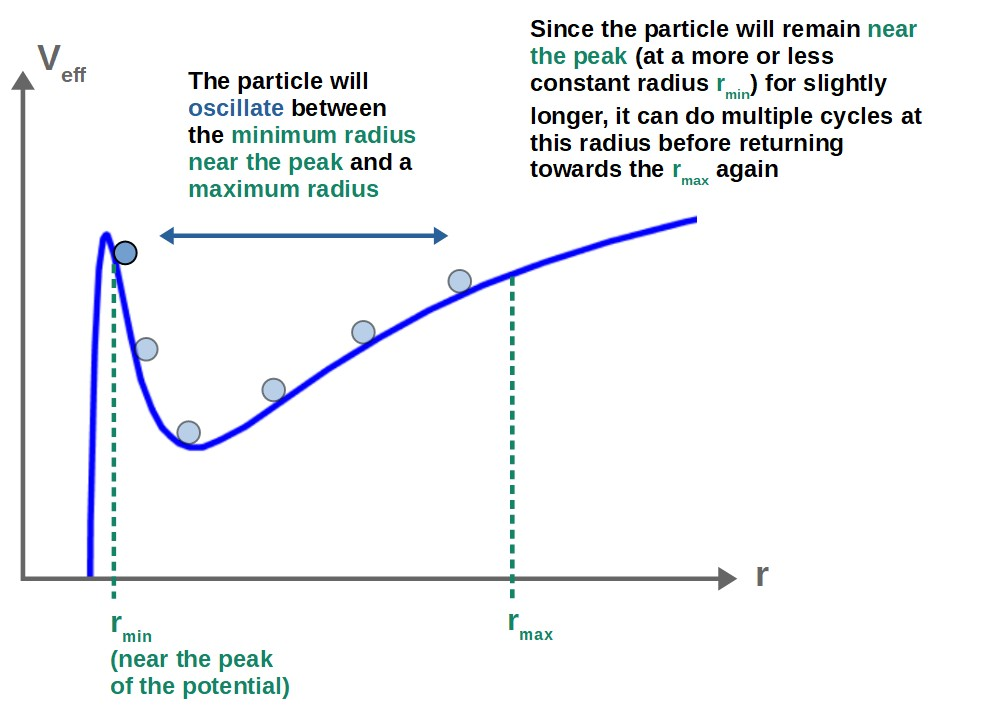 

Now, if the energy of the particle is not high enough, it may not reach near the peak of the potential (in other words, it cannot get very close to the black hole).

In these cases, the zoom-whirl behavior of the orbit will be somewhat weak, and often the particle will not actually be able to do a full “whirl” loop around the black hole.

In other words, **these whirls only occur at small radii and at sufficiently high energies** (and high angular momenta).

```
As a sidenote, there does not seem to be a single, widely used term for these types of orbits in the current literature on black hole orbits (which is somewhat lacking also). I've been calling them zoom-whirl orbits as this sounds like the most descriptive term for them.

Other terms you may encounter if you wish to explore this area of research more are knife edge orbits (which presumably comes from the fact that there is a "knife edge" peak in the effective potential) and Rosetta orbits (which appear to be specifically used for the "flowery"-looking orbital shapes).
```

I understand that there may be a lot to unpack here at once, so here’s a quick summary of the key points discussed in this section:

- **Orbits under sufficiently strong gravity and small radii (between the IBCO and ISCO) exhibit zoom-whirl behaviour**. This means that an orbiting particle can have multiple small loops (whirls) and large loops (zooms) at different radii in its orbit.
- **These zoom-whirl orbits require a periodic table to describe them**. In this classification system, each orbit is described by three numbers; z (zooms), w (whirls) and v (vertex sequence).
- **Zoom-whirl orbits can also precess**. This means that the apastra of the orbit “rotate” during each orbital cycle.
- **Zoom-whirl orbits occur when the energy and angular momentum of the orbiting particle is sufficiently large**, allowing it to get close to the black hole.
- **In these cases, there is a sharp peak in the effective potential**, which explains why these orbits are so different from the ones in Newtonian gravity.

So far, we’ve only looked at orbits that are **bound**, in other words, orbits that have just enough energy and angular momentum to not fall into the black hole or fly off to outer space.

Next, we will look at what happens if this is not the case. Here we’ll discover some surprising things once again that are way different from the familiar Keplerian orbits.

### Unbound Orbits & Spiral Fall Trajectories

First of all, what happens in the case of an orbiting particle having **too much energy** (too high of an orbital velocity)? If this is the case, pretty much the same thing happens as would happen in Newtonian gravity; **the particle takes on a parabolic orbit**.

These orbits are called parabolic since they have a shape similar to a parabola (these may not always be exactly parabolic curves, but a commonly used general term for these unbound orbits that escape the black hole’s gravity is “parabolic orbit”).

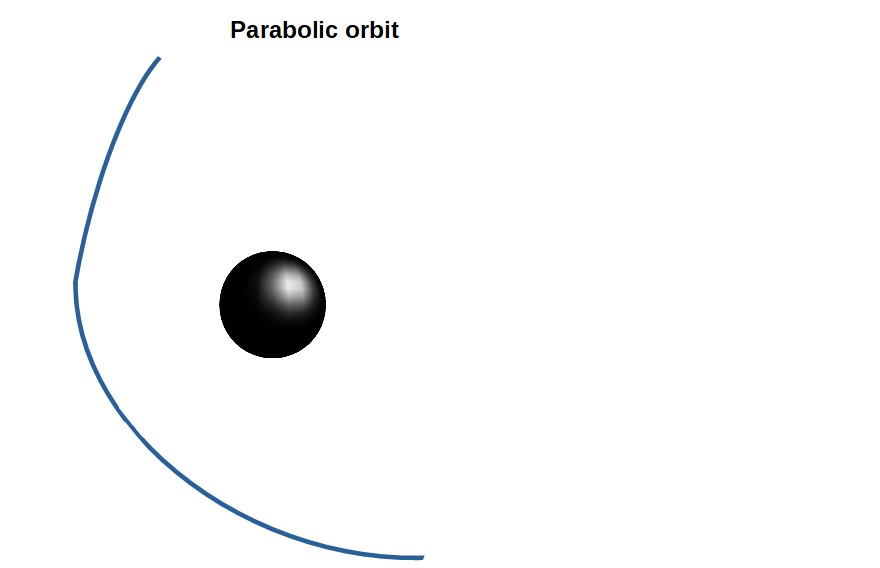 

The parabolic orbits are **unbound orbits**, which simply means that the particle won’t stay in orbit around the black hole, but it will instead just come in somewhere in the vicinity of the black hole, get deflected in some way and then fly off.

An example of this is with a beam of light, which can actually get deflected (“bend”) as it passes a massive object. This results in the effect of **gravitational lensing**, which serves as a useful tool in astronomy.

Note, however, that around a black hole, it’s also possible for a particle to **loop around the black hole, even a few times and then fly off**. This does not happen in Newtonian gravity.

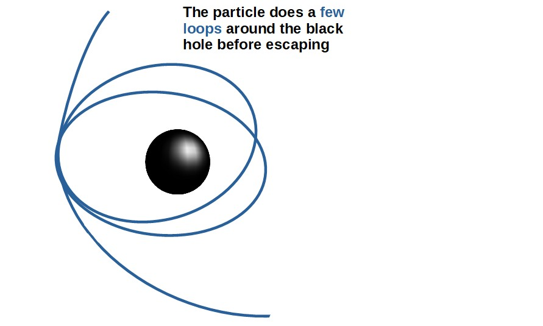 

Another type of orbit, which is actually completely unique to general relativity, is the **spiral fall trajectory**.

These occur when the orbiting particle does not have enough angular momentum to stay in orbit, which causes the particle to “spiral” into the black hole. The **minimum angular momentum** value is given by Lmin=√3rsmc.

**This can happen in two ways**; the first way is that a particle comes in from somewhere far away with less angular momentum than the minimum value and thus, spirals into the black hole.

The second way is by **loss of angular momentum in an already existing bound orbit**.

For example, a particle could collide with other particles, losing some angular momentum in the process; if the particle loses too much of its angular momentum, such that it now has less than the minimum required value, it will fall into the black hole.

Again, it’s also possible for a particle to do **multiple cycles around the black hole before spiraling in**. This happens if the angular momentum is very close to Lmin, but just slightly less.

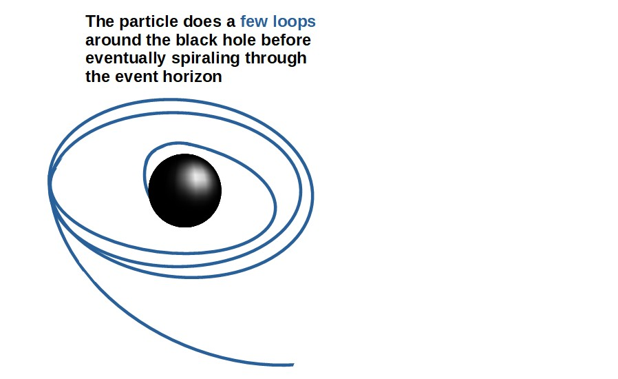 

Now, the most interesting thing about these spiral fall trajectories is that **they are not possible in Newtonian gravity**.

In Newtonian gravity, any particle with even just a little bit of angular momentum will never fall into the central mass. It will always keep orbiting around (unless energy is lost due to some external factors).

But, in a strong gravitational field (where general relativity is required), a particle with angular momentum CAN fall into the central mass.

This can, once again, be explained by analyzing the effective potential. In Newtonian gravity, the effective potential **keeps increasing with no limits as the radius decreases**.

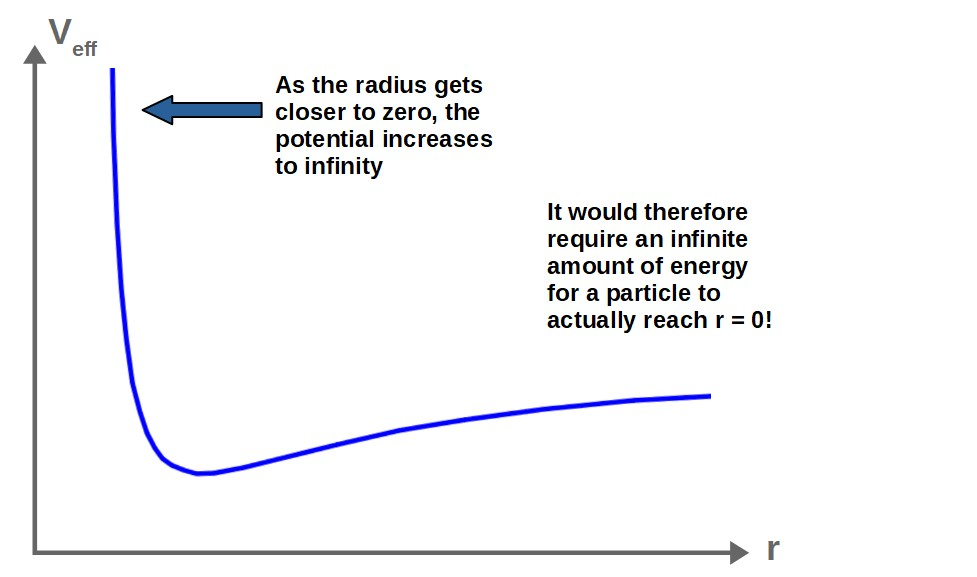 

This means that at r=0, the potential goes to infinity, requiring **infinite energy** to actually reach this point. This, as you may expect, is not physically possible for any orbiting particle and therefore, nothing will reach the center point at r=0.

Of course, it’s possible that a particle has exactly zero angular momentum to begin with; in this case, it would just fall radially into the central mass along a straight line. The same would be true in general relativity as well.

Now, in general relativity, the effective potential has a maximum (this occurs at r=rIBCO). After the maximum, **as the radius keeps decreasing, the potential also decreases**.

This means that, actually, after a certain point (the IBCO), an orbit closer to the central mass requires *less* energy.

Again, with the effective potential setup, we think of particles always naturally “rolling” to a lower value of the potential if possible, which explains (visually) **why a particle will inevitably fall into the black hole after the IBCO**:

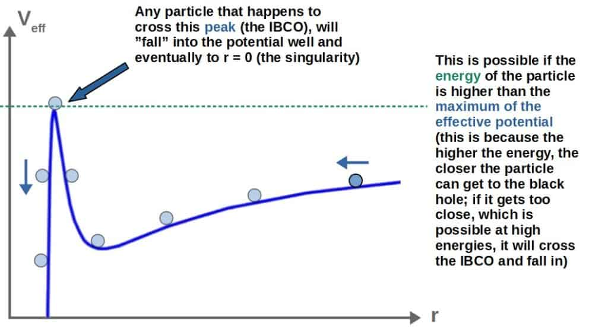 

Therefore, any particle that “crosses” the peak of the potential (in other words, crosses the IBCO) will keep falling towards smaller radius (unless using rockets or some other external force), eventually reaching the event horizon to never return.

With small angular momentum of the orbiting particle, the maximum peak in the effective potential gets smaller (generally, for different values of angular momenta, the shape of the potential graph will look different).

If the angular momentum hits *exactly* the minimum value, the peak disappears completely; **any particle with less than the minimum value of angular momentum will keep falling towards smaller radius and fall into the black hole**.

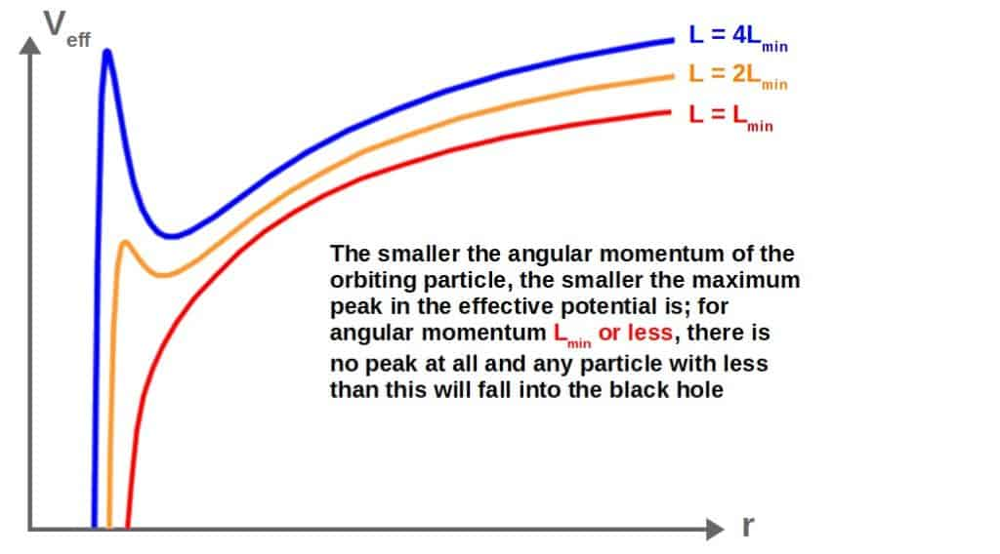 

Here, I’ve plotted the effective potential for some example values of the angular momentum. Hopefully from this it’s clear why for L<Lmin, a particle will fall arbitrarily far down the effective potential as there is no “peak” to prevent it from getting to smaller r.

We’ve now covered all of the orbit types that are possible around a stationary black hole. Things do change a little bit if the black hole is *rotating* (a lot of things in this section still apply, though), which is what we’ll discuss next.

## Orbits Around Rotating and Charged Black Holes

Black holes, in addition to their mass, can have two properties; **electric charge** and **spin**. In the context of this article, we will now discuss how these affect orbits around the black hole.

A black hole with **mass and electric charge** is called a **Reissner-Nordström black hole**. This comes from the fact that these types of black holes are described by the Reissner-Nordström spacetime metric in general relativity (which, on the other hand, is named by the people who first derived it).

A black hole with **mass and spin** (due to the black hole rotating) is called a **Kerr black hole**. As you might guess, this is described by the Kerr metric in general relativity.

You won’t, however, need to know much about these metrics nor about general relativity to understand the orbits that we’ll discuss next.

It’s worth noting here that the **periodic table of black hole orbits** discussed earlier is also valid for both of these types of black holes.

### Orbits In The Reissner-Nordström Spacetime

A Reissner-Nordström black hole has both a mass and an electric charge (in some theoretical considerations, it can also have a magnetic charge but this has never been observed in nature).

The interesting thing about these black holes is that **the presence of electric charge matters even if the orbiting particle is neutral**.

This is explained by the fact that an electric field (created by the black hole’s charge) holds some energy and, as Einstein told us with his field equations of general relativity, **all forms of energy cause gravity**.

So, even though the electric field itself of the black hole does not necessarily affect an orbiting particle (if it’s neutral), the energy contained in this electric field does contribute to the gravitational field around the black hole, which then has an effect on the orbits of the particle.

This can be seen from the fact that there is some additional terms in the effective potential due to the electric charge of the black hole:

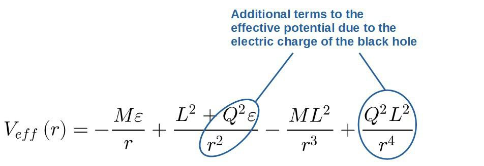 

Here, M is the mass of the black hole and Q is its charge, L is the angular momentum of the orbiting particle and ε is a parameter that is 1 for massive particles and 0 for massless particles (light or photons). I’ve also cleaned up some of these terms by setting the constants c=G=1 and ignoring the mass of the orbiting particle (which plays no role in the shape of the orbits or the potential, since we’re considering the black hole to be stationary and not effected by the gravity of the orbiting particle).

These additional terms in the effective potential contribute specifically to the **repulsive parts of the gravitational force** that an orbiting particle would experience (terms with a plus-sign in the effective potential make up the repulsive forces, so in this case, the 1/r2 and 1/r4 terms).

These stronger repulsive forces have the effect of **allowing orbits to be slightly closer** to the charged black hole than to an uncharged one.

This can be understood by the fact that these extra repulsive forces add another contribution to balance out the attractive gravitational forces (which is needed for maintaining an orbit) besides the typical centrifugal force (a force arising from the orbiting particle’s angular momentum), thus allowing any given orbit to be maintained with a *smaller* centrifugal force.

A smaller centrifugal force, on the other hand, requires a smaller angular momentum and thus, **all bound orbits around a charged black hole require a smaller angular momentum for a particle to remain in orbit**.

**An object with a certain amount of angular momentum can therefore take on an orbit of smaller radius than would be possible near the uncharged black hole**. The larger the charge of the black hole, the closer these orbits can also be to the black hole.

Now, in terms of the types of orbits a particle could have around a charged black hole, surprisingly, these are actually **very similar to the uncharged case**. We can see this by plotting the effective potential graph again (note that the graph only looks like this for very specific values of M, L and Q):

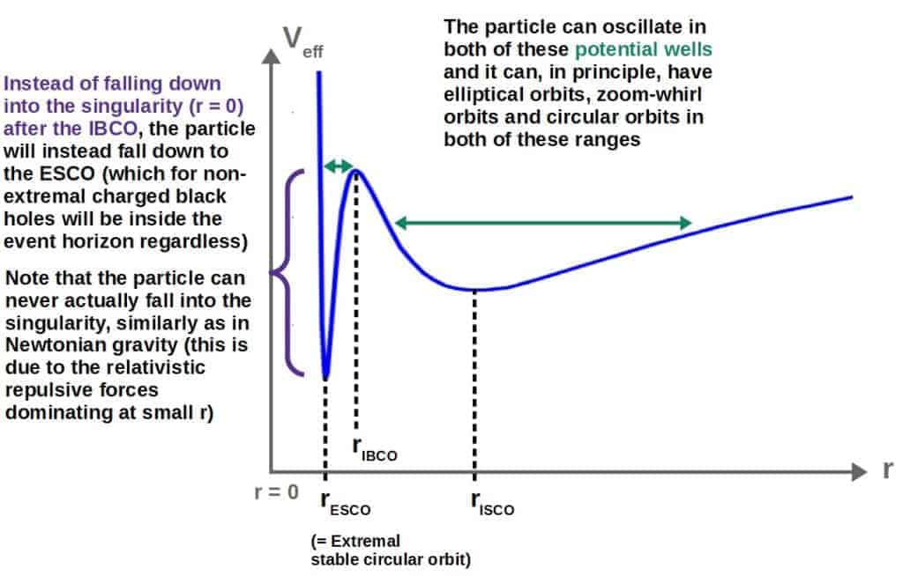 

The ESCO is a third (theoretically) possible stable circular orbit, unique to charged black holes. However, for realistic black holes, the rESCO-radius is located inside the event horizon, which makes it not really physically interesting. Only in the extremal case (hence the name *extremal* stable circular orbit), the ESCO will be located exactly at the horizon where a particle could, in principle, have an orbit at.

Notice that the graph for r > rIBCO looks very similar to the effective potential for the Schwarzschild (uncharged) black hole, meaning that the same types of orbits are also possible.

However, all the ranges of the orbits in the above picture occur at **smaller radii**, although you cannot really see that from the graph.

The main exception of this potential for the charged black hole is that **instead of falling into the singularity after the IBCO, the particle can actually take on a stable circular orbit** (the ESCO, which is a term I came up based on [this research paper](https://arxiv.org/pdf/1001.0359.pdf)).

The location of the ESCO depends on the charge of the black hole (the smaller the charge, the closer this minimum is to r=0), but **if the charge is actually anything *less* than its maximum allowed value** (for a given mass) according to general relativity, **the ESCO will be inside the event horizon**.

For the maximally charged black hole, there is only one event horizon (typically there is the event horizon and a second horizon known as the Cauchy horizon) and **the ESCO is located exactly at the event horizon** (which in the extremal case, is at r = rs/2).

The interesting thing about this ESCO-radius is that it is a **stable orbit, *which even light can have*** (although, for light or massless particles, the ESCO does not actually exist for non-extremal black holes, not even inside the horizon).

This makes it vastly different from the uncharged black hole, around which only an unstable orbit can exist for light (note, however, that extremal black holes probably aren’t quite physically realistic, but they are useful for many theoretical purposes).

If you’re interested, I discuss **orbits of light around a black hole** more in [this article](https://profoundphysics.com/can-light-orbit-a-black-hole-the-physics-explained/) as well as mathematically derive the orbits using general relativity and the effective potential.

There are a lot of interesting things to discuss about charged black holes, but for the purposes of this article and for black hole orbits, the **main points of this section** are as follows:

- **Around a charged black hole, the possible orbits are very similar to the uncharged case** (with precessing ellipses, zoom-whirl orbits, the ISCO and IBCO), however, these orbits occur at slightly **smaller radii**.
- **For a black hole with the maximum allowed charge, there exists a third circular orbit** (the ESCO). This is a *stable* orbit that is located exactly at the event horizon, which even light could orbit.
- **For black holes that are NOT maximally charged** (more “realistic” black holes), **the ESCO does not exist for *massless* particles** (light) and is located **inside the event horizon for *massive* particles**, making it physically unrealistic.

Now, electrically charged black holes are predicted to be quire rare with the charge typically being very close to zero (compared to its mass, at least).

A more realistic model is that of a **rotating black hole** and the orbits around these can be much more complicated. This is what we’ll discuss next.

### Orbits In The Kerr Spacetime

**Black holes that rotate around a particular axis are called Kerr black holes**. These black holes have both a mass and an *intrinsic* angular momentum (due to the spin of the black hole).

The aspect that makes these Kerr black holes so complicated is that they (and the spacetime around them) are *not symmetric* in the same way as their non-rotating counterparts.

So far in all of our discussion about black hole orbits, there has been an implicit symmetry that I haven’t explained in detail; **spherical symmetry**. This means that the spacetime around the black hole “looks the same” from every direction.

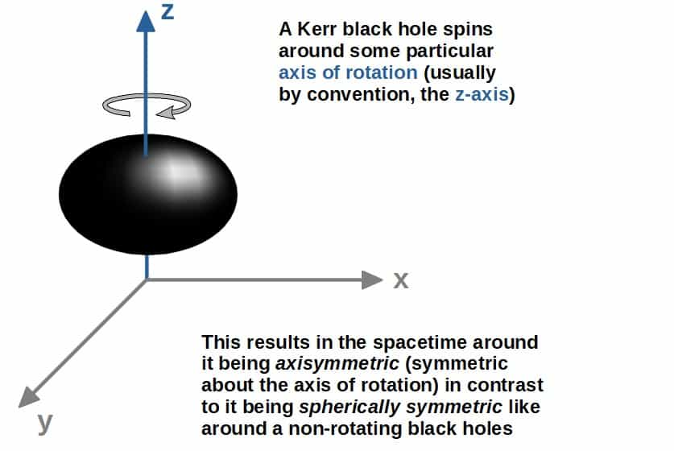 

Note that the Kerr black hole has this oblate kind of shape, resulting from its axisymmetry.

Spherical symmetry also has an important consequence in terms of orbits, which is that **all orbits around a non-rotating black hole lie in a single plane**.

In other words, all orbits can be pictured nicely by simple 2-dimensional orbits and the specific orbital plane does not matter; due to spherical symmetry, **all orbital planes are equivalent**.

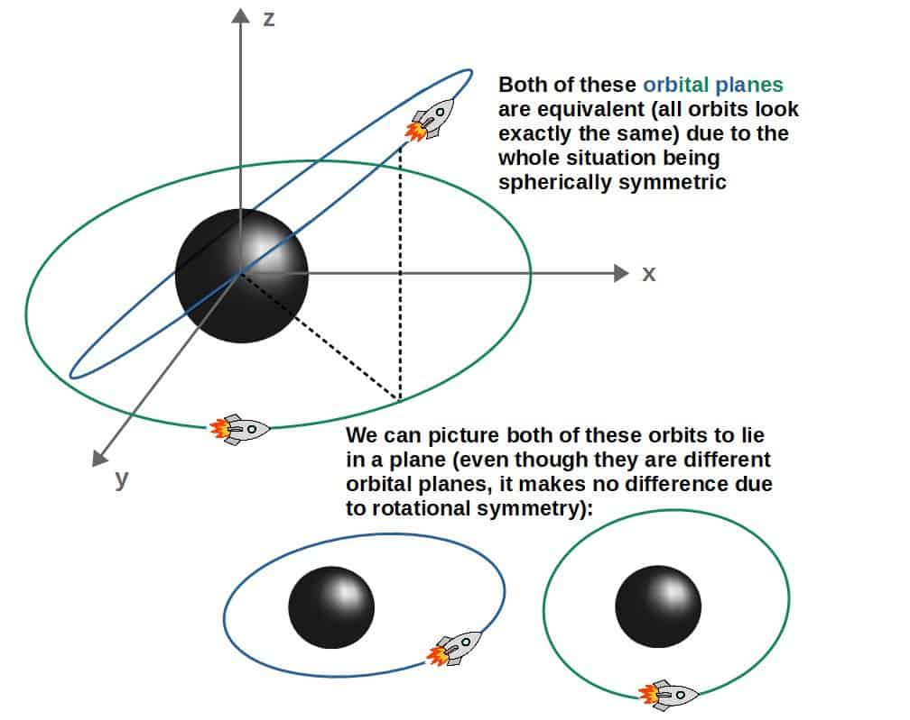 

These are depictions of orbits around a black hole that does not spin. If the black hole spins, this scenario of rotational symmetry is no longer true (as we’ll talk about in this section).

Now, in the Kerr spacetime (around a rotating black hole), this symmetry breaks down. This means that in the general case, **orbits can no longer be described as being constrained to a single plain**.

This ultimately has to do with a phenomenon known as **frame dragging** (I’ll explain this shortly).

In fact, around a rotating Kerr black hole, orbits of particles can have **fully 3D dynamics**, which is exactly the reason why they are much more complicated than anything else we’ve discussed previously.

There is, however, a special case of orbits that are much simpler to analyze; **equatorial orbits**. These are actually quite similar to the orbits we’ve already talked about, so we’ll look at these first.

**Equatorial orbits are essentially orbits that lie in the equatorial plane**, which is characterized by the angle θ = π/2 as measured relative to the z-axis (see picture below!).

However, a more intuitive picture for our case is that equatorial orbits are simple orbits that “rotate” in the same direction (or in the exactly opposite direction) as the black hole’s spin. The point is that these orbits lie in a single plane, which makes them qualitatively quite similar to the orbits we’ve talked about prevously.

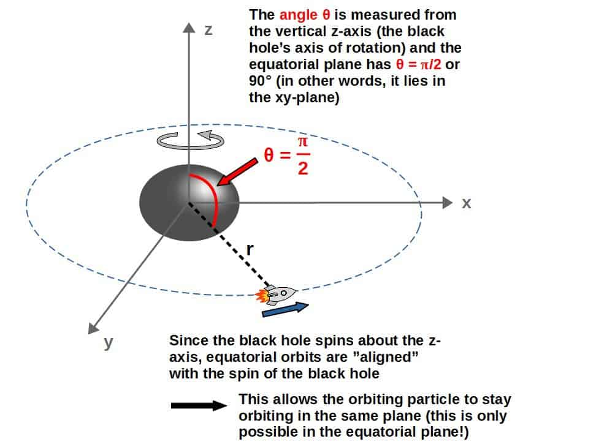 

Since the orbiting happens exclusively in the xy-plane (the equatorial plane), we could as well picture the same situation in two dimensions (you can imagine looking at the situation from exactly above and it would look like this):

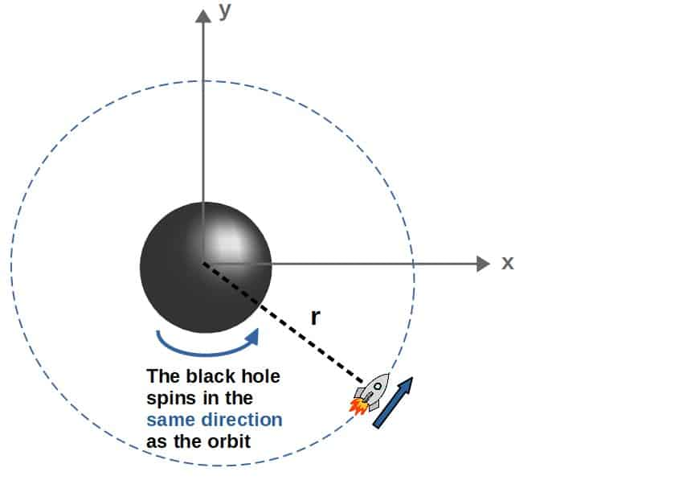 

Note that this picture depicts a circular orbit, but we could very well have precessing elliptical orbits or zoom-whirl orbits that lie in the equatorial plane.

Since these equatorial orbits are planar (they lie in a single plane), they are pretty much **similar to those around a Schwarzschild or non-rotating black hole**. In fact, these orbits look exactly the same, except for one thing; the effect of frame dragging.

Now, what is frame dragging? Essentially, **frame dragging is a gravitational effect arising from the fact that the black hole is spinning**.

You can think of this effect as the black hole “dragging” the geometry of spacetime along with it in the direction of its rotation.

Practically, **the effect of frame dragging to orbital motion is similar to there being an additional gravitational “force” that pulls the particle in the direction of the black hole’s rotation**.

Since we’re still talking about equatorial orbits, there are two possible ways that the particle can orbit in (here we’re talking about how the orbits look as seen from somewhere far away; the orbiting particle itself doesn’t really “experience” anything special during its orbital motion):

- **The particle can orbit in the same direction as the black hole spins in**. These are called **prograde orbits**.
- In a prograde orbit, the effect of frame dragging can be thought of as an extra force that “pushes” the particle to **orbit around faster** (since the frame dragging effect occurs in the same direction as the orbital motion).
- **The particle can also orbit in exactly the opposite direction to the black hole’s spin**. These are called **retrograde orbits**.
- In a retrograde orbit, the effect of frame dragging is in the opposite direction to the particle’s orbital motion, resulting in a “force” that **slows down** the particle in its orbit.

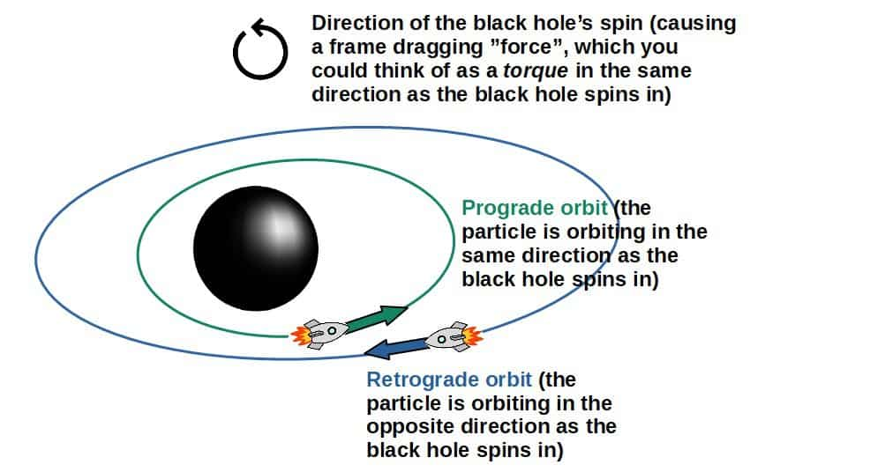 

Now, the most significant effect of frame dragging in terms of orbits is that the ISCO and IBCO are located at different radii depending on whether the orbit is prograde or retrograde. Around a non-rotating black hole, this does not matter since the whole situation is symmetric from all directions.

In particular, **both the ISCO and IBCO are located much closer to the black hole in prograde orbital motion than in retrograde motion**.

For some reference, below is a table of the radii of different circular orbit limits for a ***maximally* rotating black hole** (its intrinsic angular momentum is as large as is allowed by general relativity). If the black hole is not maximally rotating, things get a bit more complicated mathematically.

| Orbit | Prograde motion | Retrograde motion |
| --- | --- | --- |
| ISCO | r = GM/c2 | r = 9GM/c2 |
| IBCO (also the only circular orbit for light) | r = GM/c2 | r = 4GM/c2 |

Here, G and c are constants (gravitational constant and speed of light) and M is the mass of the black hole. A noteworthy point about the values above is that the ISCO and IBCO are located at the same radius for a prograde orbit, which also happens to be at the event horizon of the rotating black hole (which is at r = GM/c2). As a reminder, the event horizon of a non-rotating black hole is at r = 2GM/c2, while the ISCO and IBCO are at 6GM/c2 and 3GM/c2.

Other types of possible orbits **in the equatorial plane** are very much similar to the case of a non-rotating black hole (the possible orbit types are precessing ellipses, zoom-whirl orbits etc.). This is because the effective potential (again, only in the equatorial plane) is similar to the Schwarzschild case (an inverse cubic polynomial of r):


For massless particles (light), the first term does not exist as is the case for a non-rotating black hole also.

The only thing that changes is that the ranges of possible orbits depend on whether the orbit is pro- or retrograde. **Prograde orbits can exist closer to the black hole, while retrograde orbits are much further away**.

Well, actually there does exist a new kind of orbit that does not exist in the Schwarzschild or Reissner-Nordström spacetimes, which I’m going to call the **turn-around orbit**.

In these orbits, the particle is first orbiting in one direction, but slows down due to frame dragging and at some point, turns around in the opposite direction. However, these orbits are **only possible for retrograde motion**.

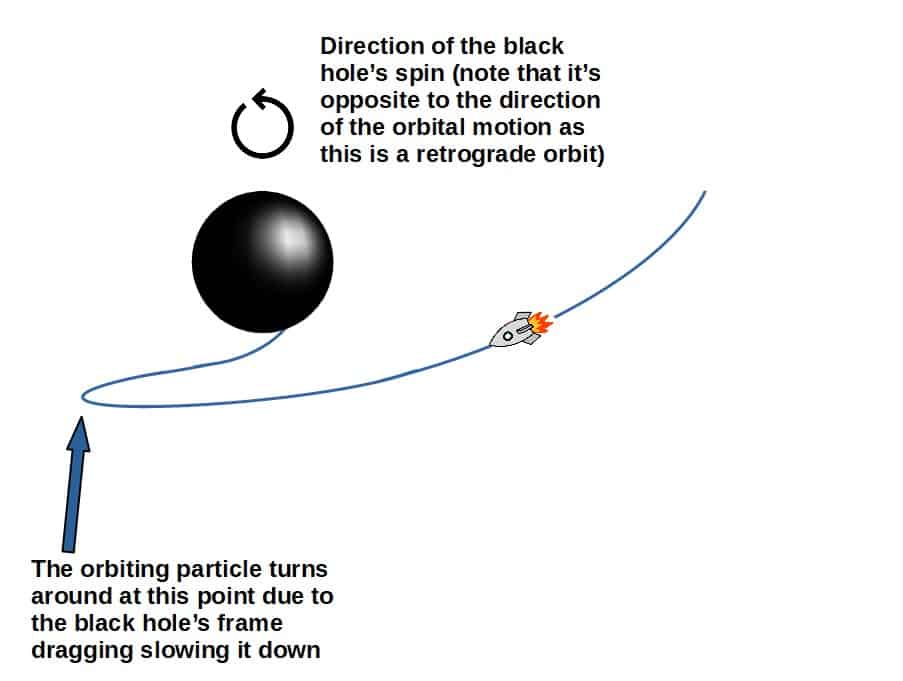 

If the particle gets close enough to the black hole (in a retrograde orbit), the effect of frame dragging may get strong enough to reverse its orbital direction. After turning around, the orbiting particle (it’s a spaceship in the picture but in physics, it’s typical to just call everything a particle) spirals into the black hole if its velocity is not enough to maintain an orbit.

Now, the problem is that if we want to describe orbits around a rotating black hole in the most general way, we cannot simply choose the orbit to lie in the equatorial plane. This is because **the spacetime around a Kerr black hole does NOT have spherical symmetry, so not all orbital planes are equivalent**.

You may now ask, what happens in the general case then? What happens when the orbit does not necessarily lie in the equatorial plane? Well, let’s just say that things get really complicated.

In a **non-equatorial orbit**, the direction of the frame dragging effect (which you can sort of think of as a “force” acting in the direction of the black hole’s spin) and the direction of the particle’s orbital motion are not aligned like they were in the case of an equatorial orbit.

This practically has the effect of ***rotating the orbital plane*** (see the picture below), causing the direction of the particle’s motion to change in some pretty strange-looking ways.

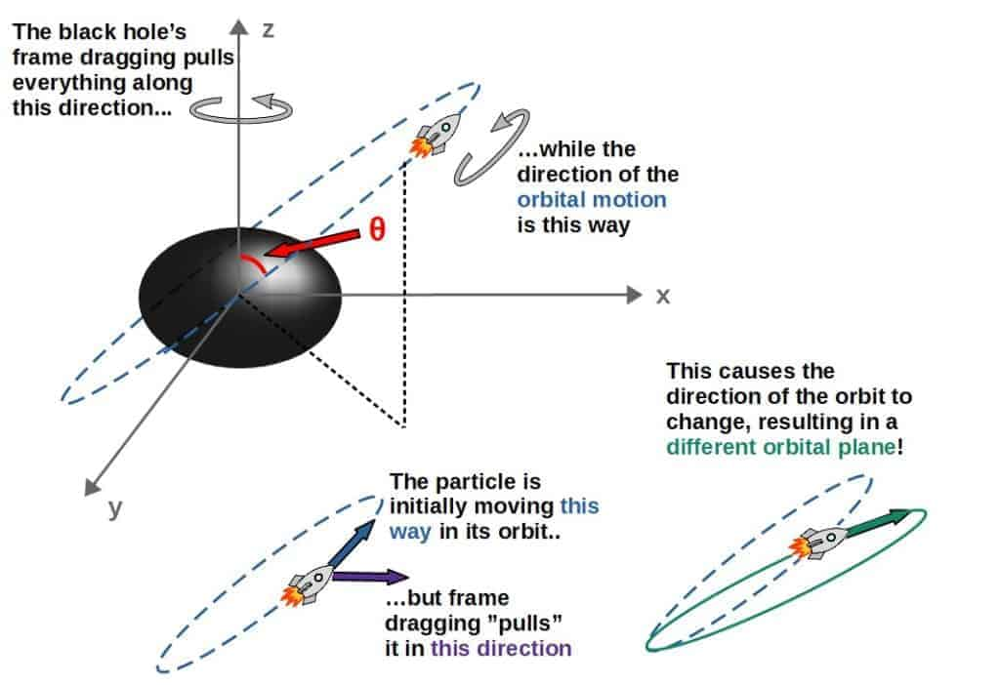 

We now have have a situation where the particle’s orbital motion is completely 3-dimensional; its orbital motion is basically 2-dimensional in a plane, **but the orbital plane itself is rotating in another direction**. The particle has fully 3D orbital dynamics!

Now, the theme of this article has been to analyze orbital motion by using the effective potential. The problem with this approach in the Kerr spacetime is that the **effective potential actually depends on two coordinates, r and θ** (i.e. the radial distance as well as the angle of the orbital plane).

The effective potential also has a fairly ugly looking and complicated form:

![V_{eff}\left(r{,}\theta\right)\sim\frac{1-r+r^2}{r^2+\cos^2\theta}+\frac{r-r^2+r^3}{\left(r^2+\cos^2\theta\right)^2}-\frac{\left(r^2-r^3+r^4\right)\sin^2\theta}{\left(r^2+\cos^2\theta\right)\left(\left(r^2-r+\cos^2\theta\right)\left(1+r^2\right)^2+\left(\left(1+r^2\right)\left(r-r^2\right)+r^3-\left(1-r+r^2\right)\cos^2\theta\right)\sin^2\theta\right)}-\frac{1}{2}\frac{\frac{r^2-r^3+r^4}{r^2+\cos^2\theta}-\frac{r^3-r^4+r^5}{\left(r^2+\cos^2\theta\right)^2}-\left(1-r+r^2\right)\left(\frac{r^4+r^2}{\sin^2\theta}+\left(1+r^2\right)\cot^2\theta+r\right)\left(r\sin^2\theta+r^2-r+\cos^2\theta\right)^2}{\left(\left(r^2-r+\cos^2\theta\right)\left(1+r^2\right)^2+\left(1+r^2\right)\left(r-r^2\right)\sin^2\theta+r^3\sin^2\theta-\left(1-r+r^2\right)\cos^2\theta\sin^2\theta\right)^2}](../assets/images/black-hole-orbits/img_86.svg)

Note; this is only a schematic form of Veff (meaning that I’ve set all constants and parameters equal to 1) to give you a rough idea of how complicated the r- and θ-dependence would be.

Most often we’d like to construct an effective potential that only depends on one variable, such as r, as this allows us to easily analyze, for example, circular orbits and their stability.

However, nothing stops us from also **constructing a potential that depends on two variables** since the whole concept of an effective potential is somewhat arbitrary in the first place (although useful).

While this may not be very useful for visualizing the possible orbits like we’ve done in earlier sections of this article (simply because the potential is way too complicated), we can still get some insights from constructing such a potential.

The key thing about this is to remember that **potentials are closely related to forces**.

In particular, since the effective potential depends on both the r and θ coordinates, this suggests that the “effective force” causing this potential should consist of two parts; a **radial force** (related to the r-coordinate) as well as a **force related to the coordinate θ**.

Mathematically, these forces would be given by the gradients of the effective potential with respect to the coordinates, in other words, ∂Veff/∂θ and ∂Veff/∂r. The exact form of these forces is not really important for us, however.

Now, the radial forces we are more or less familiar with; these are simply the “usual” **gravitational forces that allow a particle to maintain an orbit**.

The interesting things are these new forces related to the angle of the orbital plane, θ. In fact, this “force” is simply the **effect of frame dragging that causes the orbital plane to rotate**, i.e. causes the θ-coordinate to change.

This force is just a result of the fact that **the particle’s orbit is not exactly aligned with the black hole’s axis of symmetry**. This then causes frame dragging effects to take place in a way that the particle is “dragged” around the black hole in all sorts of complicated (and 3-dimensional) ways.

It’s worth noting that this concept of “forces” should not really be taken too literally, since we’re usually not talking about gravitational effects as forces in general relativity, but rather as effects of the geometry of spacetime.

If this has seemed complicated so far, I’m going to warn you that these orbital dynamics can get even more complicated.

This is because **it is also possible for orbits around a Kerr black hole to exhibit perihelion precession and even zoom-whirl behavior**.

In other words, think of everything we’ve talked about in the earlier sections of this article; now imagine all of those effects in 3 dimensions. This is really the reason why these orbits are so complicated and in most cases, require some sort of computer simulations.

```
If you're interested, there is a cool simulation of these orbits on the Wolfram Demonstrations website, where you can play around with the different orbital parameters and see how different types of orbits look like around a rotating black hole.
```

---

*← [Back to the full archive](../index.html)*
