# Can Light Orbit A Black Hole? The Physics Explained

> Even light, the fastest thing in the universe, can be bent into a circular path by gravity.

*Originally published at [profoundphysics.com](https://profoundphysics.com/can-light-orbit-a-black-hole-the-physics-explained/).*

---

Black holes are objects, which even light cannot escape from. More precisely, light cannot escape from *inside* a black hole. However, could light orbit a black hole outside of it?

**Light can orbit a black hole. However, this is possible at exactly one radii, the innermost bound circular orbit (IBCO). The only possible orbit for light is therefore an unstable circular orbit. The possible orbital planes of light at the IBCO form a sphere around the black hole called the photon sphere.**

In this article, we’ll be going over exactly what the **IBCO** and the **photon sphere** are and why these are the only possible orbits for light.

We’ll also look at **how exactly general relativity** (the theory needed for understanding and describing black holes) **predicts how light moves around a black hole**.

We’ll discover that there are ***exactly* three possible types of trajectories** a light ray can take near a black hole.

There are also plenty of other interesting phenomena related to orbits of light around a black hole, which will all be explained as you read further.

If the content of this article seems interesting, you may also enjoy my **[article on black hole orbits](https://profoundphysics.com/black-hole-orbits/)**. This is a **complete guide** on everything you’d want to know about **possible orbits around black holes** (which are fascinatingly more interesting than typical planetary orbits) and how **different types of black holes** (electrically charged and spinning) affect these orbits.

In case you’re interested, you can also get this article (and my other general relativity articles) in **downloadable PDF form** [here](https://courses.profoundphysics.com/p/general-relativity-bundle).

## How Light Moves Around a Black Hole (According To General Relativity)

**Around a black hole, light moves along null geodesics. These are trajectories through spacetime that have a total length of exactly zero. Around a black hole and along these null geodesics, light can trace out parabolic trajectories, circular orbits or trajectories that end up spiraling into the black hole.**

Before we can understand what these *null geodesics* are, we need to take a step back and understand where exactly these concepts come from in the first place.

First of all, black holes are described by Einstein’s **general relativity** and so is the motion of objects around black holes.

Everything we’re going to discuss in this section about general relativity is covered in much greater detail in my **[introductory article on general relativity](https://profoundphysics.com/general-relativity-for-dummies/)**. The article is aimed at beginners who wish to learn the depths of the mathematics and physics of general relativity (without requiring much previous knowledge).

Now, in general relativity, all the physics that happens will take place in ***spacetime***. You can think of spacetime as essentially just combining both space and time into a single description of events.

**How objects move in spacetime will depend on the geometry of the spacetime**. The big idea behind general relativity is that the energy content (such as mass) in a particular spacetime dictates how the geometry of that spacetime gets “curved”.

The effects of this curvature of spacetime are then *observed* as gravity. This means that **objects under the influence of gravity move along the geometric structure of spacetime** and the paths these objects trace out are called **geodesics**.

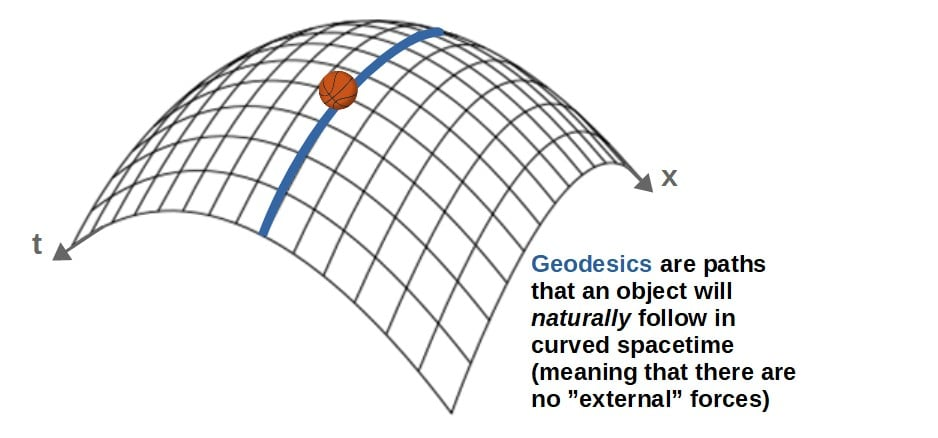

The key idea summarized is therefore that **objects under the influence of gravity will naturally move along geodesics through spacetime**.

Now, this idea applies to black holes and light as well; **light moves along a geodesic under the influence of the gravity of a black hole**.

These specific geodesics through spacetime that *only light* (or other massless particles) can move along are called **null geodesics**.

You’ll find a detailed explanation of what these null geodesics are down below, however, the key point here is that **light always moves on null geodesics, around a black hole as well**.

Now, if you’re wondering how light or photons can be affected by gravity, even though they are **massless**, I suggest reading [this article](https://profoundphysics.com/how-are-photons-affected-by-gravity-if-they-have-no-mass/). In there, I cover exactly this issue.

What Are Null Geodesics?

The term *null geodesic* comes from the fact that the “spacetime length” of these geodesics (or *worldlines*) happens to be exactly zero. Mathematically, this corresponds to the **line element of the metric tensor** (ds2) being zero:

$$ds^2=g_{\mu\nu}dx^{\mu}dx^{\nu}=0$$

Here, gµν is the metric tensor, which describes the geometry of any given spacetime. These dx’s are spacetime coordinate displacements (so, essentially they give the distances in any given coordinate direction; for example, if we were to define one of our coordinates as y, then dy would give the displacement in the y-direction). The dxµ and dxν are just convenient ways to label all of the coordinates we have in a given spacetime as the equation above contains an “implicit” summation over both the µ and ν indices.

This equation for the metric line element may be unfamiliar to some of you, but it is one of the most commonly used equations used in general relativity (I explain this in more detail in [this article](https://profoundphysics.com/general-relativity-for-dummies/), as well as how it is actually used in practice).

Now, the idea of a null geodesic may be a bit weird, however, it’s worth noting that while these trajectories have a *spacetime* length of zero, the actual *spacial* length of the trajectory may not be zero.

These null geodesics have also a *temporal* part (so, both a spacial and a temporal part), which basically describes how time passes in a given spacetime. For example, near a black hole, this temporal part of the geodesics would account for things like time dilation. I discuss this more in [my article on why time slows down near a black hole](https://profoundphysics.com/why-time-slows-down-near-a-black-hole/).

For this article, since we’re interested in the spacetime around a black hole, we need to know the metric tensor describing such a spacetime. We will use the Schwarzschild metric, which describes the spacetime around an electrically neutral, non-rotating black hole:

$$g_{\mu\nu}=\begin{pmatrix}-\left(1-\frac{r_s}{r}\right)&0&0&0\\0&\left(1-\frac{r_s}{r}\right)^{-1}&0&0\\0&0&r^2&0\\0&0&0&r^2\sin^2\theta\end{pmatrix}$$

These are the components of the Schwarzschild metric, represented as a matrix. The indices µ and ν both run from 0 to 3 (for example, g00 corresponds to the component -(1-rs/r) and so on). The parameter rs is the Schwarzschild radius of the black hole, while r and θ are spacetime coordinates describing the radial distance from the center of the black hole (r) and the angle of the orbital plane (θ).

The line element written in full detail with this metric is as follows (note that our spacetime coordinates are t, r, θ and φ and the coordinate displacements are denoted as dt, dr, dθ and dφ):

$$ds^2=-\left(1-\frac{r_s}{r}\right)dt^2+\frac{dr^2}{1-\frac{r_s}{r}}+r^2d\theta^2+r^2\sin^2\theta d\varphi^2$$

Note; for the rest of this article, I’ll be using the so-called “natural units”, in which c=1. This, however, does not change any of the results we get.

Around a non-rotating black hole, the spacetime has spherical symmetry; this simply means that everything “looks the same” from all directions. We can therefore choose the plane of orbit as anything we wish, so we will set it to θ=π/2, so that sinθ=1 and dθ=0.

Moreover, since we’re interested in **null geodesics** (which are defined by ds2=0), we get the following equation:

$$-\left(1-\frac{r_s}{r}\right)dt^2+\frac{dr^2}{1-\frac{r_s}{r}}+r^2d\varphi^2=0$$

This equation fully describes orbits of light around the black hole. Later we will use this to derive quantities like energy and angular momentum. We’ll then end up with a formula for the **effective potential** for a photon, which allows us to actually visualize how these orbits of light look like.

Now, how do these null geodesics actually look like around a black hole? In other words, what are the actual ***trajectories in space*** that a light ray or a photon will move along near a black hole?

The answer to this comes from looking at the so-called **effective potential for a photon** (light of course being made out of photons).

The formula describing this is as follows:

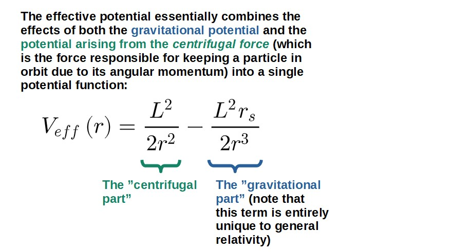

Here, L is the photon’s angular momentum, rs is a parameter called the Schwarzschild radius (this is the radius of the black hole’s *event horizon*) and r is the radial coordinate of the photon (distance from the center of the black hole).

Where Does The Effective Potential Come From? (Full Derivation)

Our starting point will be the equation we derived earlier that describes the null geodesics of light around a black hole:

$$-\left(1-\frac{r_s}{r}\right)dt^2+\frac{dr^2}{1-\frac{r_s}{r}}+r^2d\varphi^2=0$$

We’ll now divide both sides by an *affine parameter* dλ2, which basically defines the rate of change of these spacetime coordinates along the trajectory of the light ray, giving us:

$$-\left(1-\frac{r_s}{r}\right)\left(\frac{dt}{d\lambda}\right)^2+\frac{1}{1-\frac{r_s}{r}}\left(\frac{dr}{d\lambda}\right)^2+r^2\left(\frac{d\varphi}{d\lambda}\right)^2=0$$

You can think of the affine parameter as playing the same role as time does in ordinary mechanics; it defines the rates of change of things like position, which then gives us the velocity). In relativity, we use an affine parameter instead of time since time itself is one of our spacetime coordinates (the most commonly used affine parameter is called *proper time*, however, this is not defined for particles moving at the speed of light, so we cannot use it here).

These dt/dλ, dr/dλ and dφ/dλ are essentially the *spacetime velocities* or rates of change of our spacetime coordinates. We’ll denote these by putting a dot above the coordinate in question, so the equation then becomes:

$$-\left(1-\frac{r_s}{r}\right)\dot{t}^2+\frac{1}{1-\frac{r_s}{r}}\dot{r}^2+r^2\dot \varphi^2=0$$

So far, what we’ve done may seem a little random. The goal with this is to end up with an equation that resembles the **total energy** of light in a familiar form. This will allows us to define the effective potential (since the total energy E will be of the form E=”radial” kinetic energy+effective potential).

Now, the tools we’re going to use are the **Lagrangian** as well as the **Euler-Lagrange equations**. If you don’t know what these are, I highly recommend reading **[this introductory article to Lagrangian mechanics](https://profoundphysics.com/lagrangian-mechanics-for-beginners/)**.

Also, I go over an extremely useful “trick” to find the Lagrangian instantly from any metric line element (the ds2-thing we had earlier) in [this article](https://profoundphysics.com/christoffel-symbols-a-complete-guide-with-examples/). We can then, using this method, instantly deduce that our Lagrangian will be:

$$L=-\frac{1}{2}\left(1-\frac{r_s}{r}\right)\dot{t}^2+\frac{1}{2}\frac{1}{1-\frac{r_s}{r}}\dot{r}^2+\frac{1}{2}r^2\dot{\varphi}^2$$

Notice the similarity between this and the line element formula. Essentially, the “trick” is that to find the Lagrangian, you have to just replace the coordinate displacements in the line element with these coordinate velocities (things with the dots above them) as well as divide everything by 2.

Now, using this Lagrangian we can notice two things; the Lagrangian only depends on the coordinate r, but not the coordinates t and φ (the Lagrangian DOES depend on t-dot and φ-dot, but NOT on t and φ themselves).

If you’re familiar with Lagrangian mechanics, specifically Noether’s theorem (which I cover more in [this article](https://profoundphysics.com/is-lagrangian-mechanics-useful-9-key-reasons-why-it-absolutely-is/)), this means that there exists **conserved quantities** associated with both of these coordinates (t and φ).

We can derive these quantities by writing out the Euler-Lagrange equations for both of these coordinates:

$$\frac{d}{d\lambda}\frac{\partial L}{\partial\dot{t}}=\frac{\partial L}{\partial t}$$

$$\frac{d}{d\lambda}\frac{\partial L}{\partial\dot{\varphi}}=\frac{\partial L}{\partial\varphi}$$

From these equations, we get by inserting the Lagrangian (notice that the right-hand side on both of these is automatically zero as the Lagrangian does not depend on t or φ at all, and therefore ∂L/∂t=0 and ∂L/∂φ=0):

$$\frac{d}{d\lambda}\left(\left(1-\frac{r_s}{r}\right)\dot{t}\right)=0$$

$$\frac{d}{d\lambda}\left(r^2\dot{\varphi}\right)=0$$

Now let’s think about what it means for the derivative (with respect to the affine parameter λ in this case) of something to be zero as we have here; it means that the quantity has to be a **constant**.

So, we then get two constants of motion from the above equations (the first one is the energy E and the second is the angular momentum L; these both arise from Noether’s theorem), which allows us to express the coordinate velocities in terms of these constants:

$$\left(1-\frac{r_s}{r}\right)\dot{t}=E\ \ \Rightarrow\ \ \dot{t}=\frac{E}{\left(1-\frac{r_s}{r}\right)}$$

$$r^2\dot{\varphi}=L\ \ \Rightarrow\ \ \dot{\varphi}=\frac{L}{r^2}$$

Now remember the equation for the null geodesics we had earlier:

$$-\left(1-\frac{r_s}{r}\right)\dot{t}^2+\frac{1}{1-\frac{r_s}{r}}\dot{r}^2+r^2\dot \varphi^2=0$$

We can insert the expressions for t-dot and φ-dot into this and get:

$$-\frac{E^2}{\left(1-\frac{r_s}{r}\right)}+\frac{1}{1-\frac{r_s}{r}}\dot{r}^2+\frac{L^2}{r^2}=0$$

Now we rearrange this a little bit (and also divide everything by 2):

$$\frac{E^2}{2}=\frac{1}{2}\dot{r}^2+\left(1-\frac{r_s}{r}\right)\frac{L^2}{2r^2}$$

Here we essentially have a formula for the total energy (at least qualitatively) in the form of “kinetic energy+potential energy” as follows:

$$E_{tot}\sim E_{kin}\left(\dot{r}^2\right)+V_{eff}\left(r\right)$$

Notice the similarity of this with the usual total energy you see in basic Newtonian mechanics with the kinetic energy being a function of “velocity squared” and the potential being a function of position.

We therefore *define* (this is really only a definition, however, it turns out to be an extremely useful definition) the effective potential as:

$$V_{eff}\left(r\right)=\left(1-\frac{r_s}{r}\right)\frac{L^2}{2r^2}=\frac{L^2}{2r^2}-\frac{L^2r_s}{2r^3}$$

The useful thing about the effective potential is that it allows us to **visualize orbital motion** by simply looking at the graph of the potential, which in this case, looks as follows:

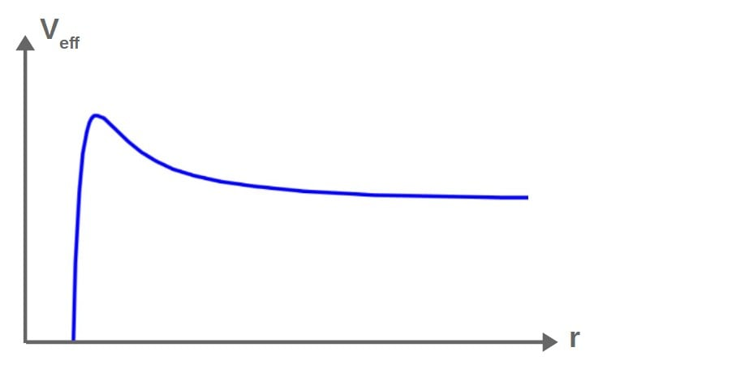

Notice the peak in this potential; this turns out to correspond to an unstable circular orbit called the IBCO or the photon sphere. No such peaks (maxima of the potential), or unstable orbits, exist in Newtonian gravity.

The key idea in visualizing orbits using this is that we essentially imagine this **potential graph as being a hill**, which the orbiting particle rolls along just like a **ball would roll on a hill**. I discuss this concept in more detail and how it applies to different potentials in my [guide to black hole orbits](https://profoundphysics.com/black-hole-orbits/).

This then allows us to see **how the radius r changes as the particle moves in this potential** (“rolls along the hill”). This essentially gives us a visual picture of how the orbit will look like without having to solve a single equation!

In this case, we’ll look at a photon that comes in from a *large radius* from somewhere (so all the way from the right side of the graph).

The **energy of the photon** (essentially its initial velocity) will determine at what “height” on the hill the photon can climb up to. We essentially have **three cases**:

- **The energy of the photon is too low to get close to the black hole**; the photon will simply come in, get deflected and fly out again.
- **The energy of the photon is exactly perfect to remain at the maximum of the potential**; the photon will stay at a constant radius in an unstable circular orbit.
- **The energy of the photon is too high**; the photon will come in, cross the peak of the potential and spiral into the black hole.

Let’s see how the first case looks like on our potential graph:

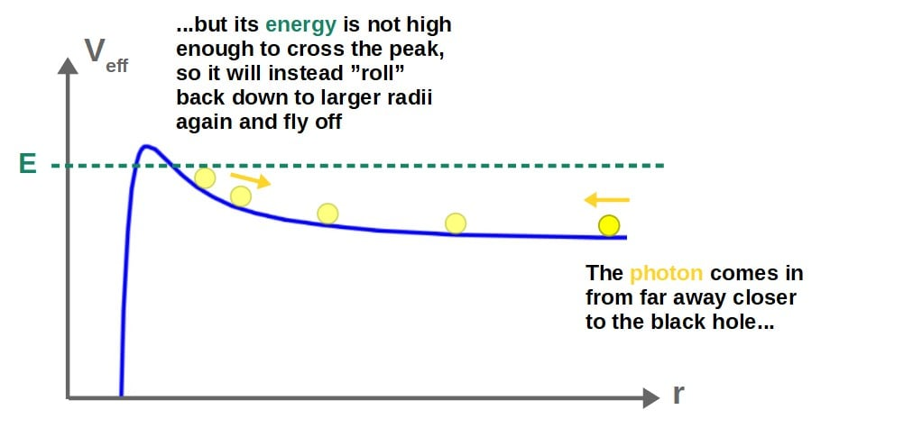

Based on this, we can visualize how the actual **physical orbit in space** will look like (note that this graph only tells us the behavior of the radius of the orbit, but the photon’s orbital angle will also change).

In this case, we have something called a **parabolic orbit** (as it kind of looks like a parabola):

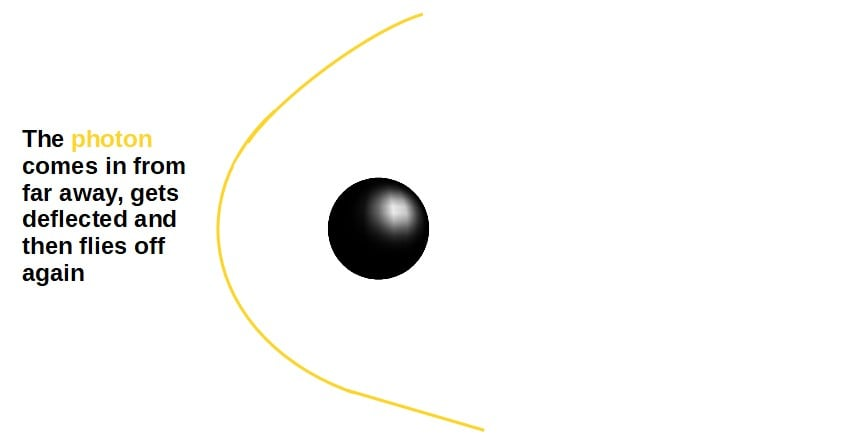

This type of bending of a light ray around a massive body (it doesn’t necessarily have to be a black hole) can actually be used as experimental evidence for general relativity by measuring the *deflection angle* and comparing it to the result predicted by the mathematics of general relativity (δφ=2rs/b, where b is the *impact parameter* of the photon).

In the second case, the energy of the photon is just right so that it is able to “climb up” to this peak and stay there:

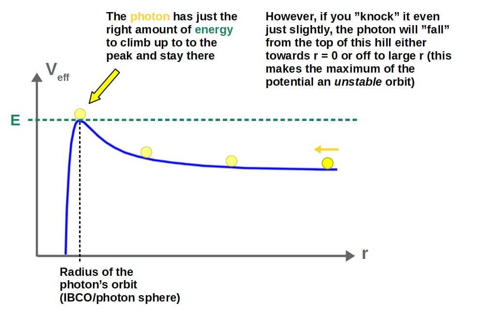

This corresponds to a **circular orbit around the black hole** (since the photon is staying at the same radius at the peak and a circle, of course, is defined by having a constant radius):

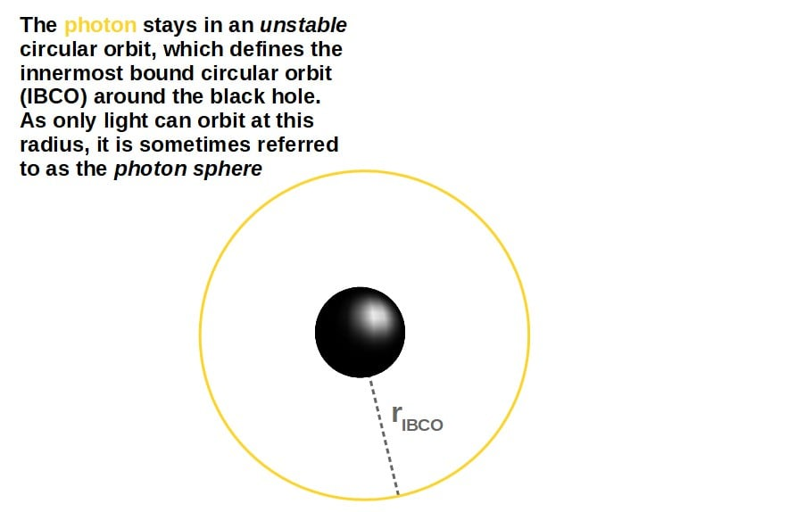

As I discuss in my guide to black hole orbits (linked above), the IBCO defines a *limit for possible bound orbits* any particle (a massless particle as well) can have around a black hole.

Later in this article, we’ll derive the actual value of this radius from the effective potential. I’ll also discuss some very interesting possibilities of *stable* circular orbits for light.

Anyway, the third possible orbit is one where the energy is too high, such that the photon is able to “climb over” this potential peak and thus, fall into the black hole:

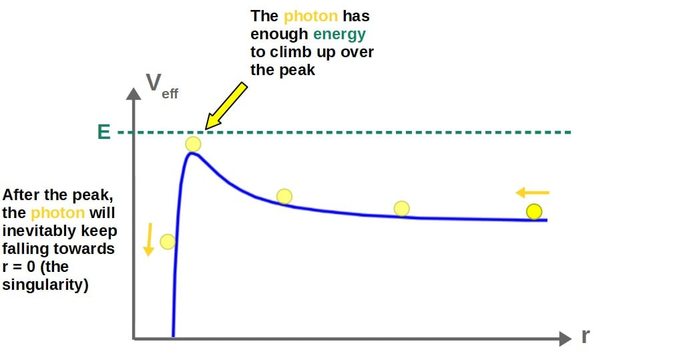

This corresponds to a physical orbital trajectory where the photon **spirals into the black hole**:

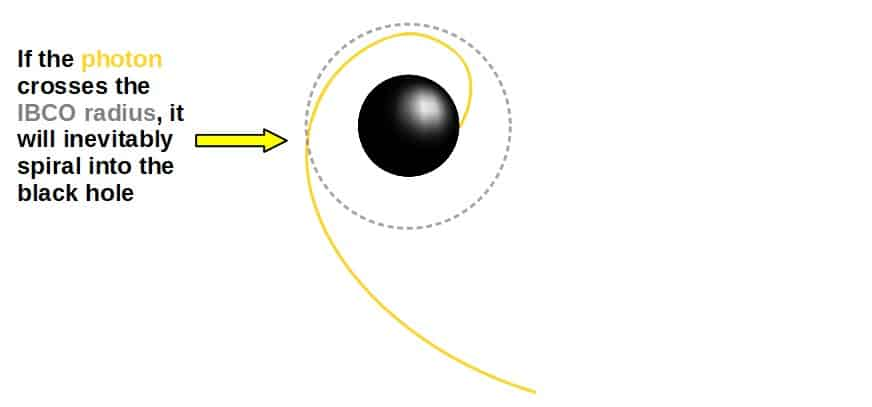

These three types of orbits encompass all the possible trajectory types that light can move in around a (Schwarzschild) black hole.

In the next section, we’ll dive deeper into orbits of light around a black hole, specifically ***bound* orbits**. I’ll also explain what the IBCO (the photon sphere) really is and where it comes from.

**Quick tip**: Learning general relativity and its applications is very difficult without first building a solid understanding of the mathematics nearly all of general relativity is built upon. For this purpose exactly, I’ve created my own **[Mathematics of General Relativity: A Complete Course](https://courses.profoundphysics.com/p/mathematics-of-general-relativity)** (link to find out more).  
  
This course is ideal **for beginners** (for both self-studying and students) **who want to get deeper into general relativity and *actually* learn it at a deeper level, but don’t know *exactly* where to start**. You will learn everything you need to know about tensors, differential geometry and many more crucial topics through **clear and concise explanations** and LOTS of **practical examples**.

## The Photon Sphere Explained

Bound orbits are orbits in which a particle essentially stays in orbit without escaping. For light around a black hole, these bound orbits are particularly simple. But where exactly does light orbit a black hole?

**Light orbits a black hole at the photon sphere, which occurs at a distance of 1.5 Schwarzschild radii from the black hole. The photon sphere is the only possible radius at which a particle moving with exactly the speed of light, such as a photon, can orbit at.**

Let’s think about why this is exactly. A circular orbit is characterized by a **constant orbital radius** (as we’d expect for a circle) and also a **constant orbital velocity**.

In other words, any particle orbiting in a circular orbit maintains the exact same velocity throughout its orbital period.

But, the same can be said in a different way; **any particle moving at a constant velocity can only be in a circular orbit**. Since a photon always moves at the speed of light, it can only have a circular orbit around a black hole.

The constant radius at which this circular orbit occurs at is 1.5 Schwarzschild radii and it is referred to as the **innermost bound circular orbit** (IBCO). We’ll discuss the exact value of this radius and what it means soon.

This name comes from the fact that this orbit is the **closest possible circular orbit that any particle could have**, since orbiting at this radius requires moving at the speed of light.

An orbit any closer to the black hole would require moving at a speed greater than the speed of light, which isn’t possible. Therefore, any orbital trajectory that crosses the IBCO will fall into the black hole (as we discussed earlier).

Now, the circular orbits for light always occur in a plane. But this orbital plane can be at any angle, so really, **the possible circular orbits of light form a sphere around the black hole** (the radius of the sphere being 1.5 rs). This is called the **photon sphere**.

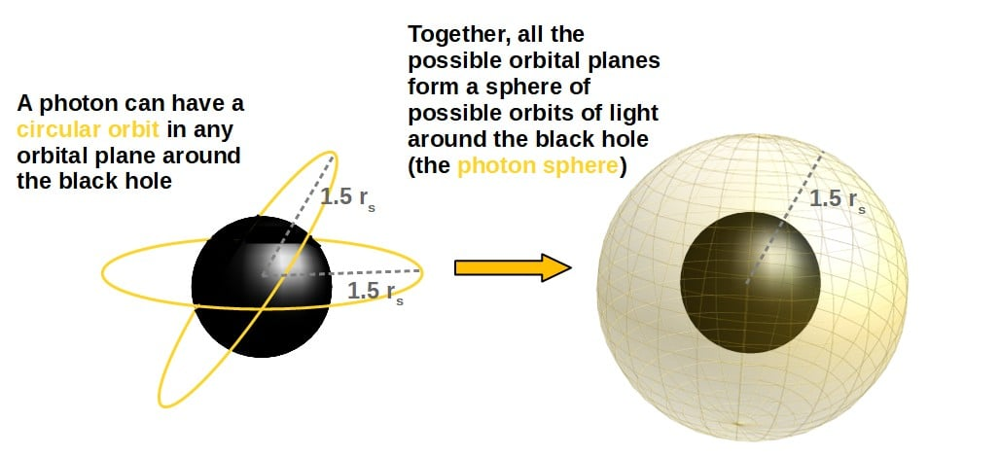

But where exactly does this value of 1.5 Schwarzschild radii come from? And what is the Schwarzschild radius anyway? This is what we’ll look at next.

### How To Find The Radius of The Photon Sphere (Step-By-Step Derivation)

**The radius of the photon sphere can be found from the extremal points in the effective potential function for a photon in the Schwarzschild spacetime. In particular, the radius of the photon sphere occurs at the maximum of the potential, which can be calculated by differentiating the potential function.**

The full mathematical derivation of this can be found down below. The answer (not very surprisingly by now) is exactly 3rs/2 (i.e. 1.5 rs).

In terms of visualizing this from the potential graph, the picture is quite simple:

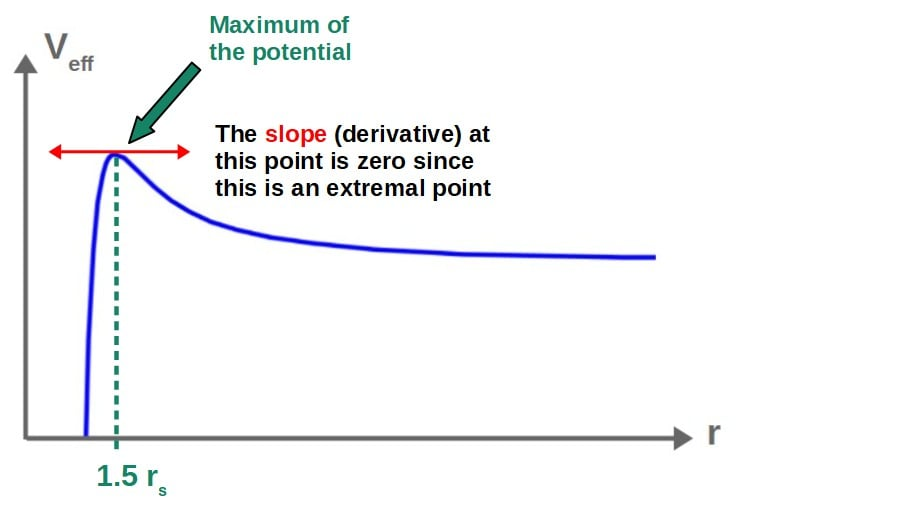

Mathematically, the value of the radius at the maximum of the potential can be found, based on this, by taking the derivative of the potential (which gives us the slope at any point), setting it equal to zero (since the slope is zero at the maximum) and then solving for r.

Derivation of The Photon Sphere Radius

Our starting point will be the effective potential for a photon in the Schwarzschild spacetime (we derived this earlier):

$$V_{eff}\left(r\right)=\frac{L^2}{2r^2}-\frac{L^2r_s}{2r^3}$$

The maximum of the potential ca be found by taking the derivative of the potential (with respect to r) and setting it equal to zero:

$$\frac{dV_{eff}}{dr}=0$$

By doing this, we get an equation which we can solve for the radius r:

$$-\frac{L^2}{r^3}+\frac{3}{2}\frac{L^2r_s}{r^4}=0\ \ \Rightarrow\ \ r=\frac{3}{2}r_s$$

Therefore, the radius of the photon sphere (IBCO) is 1.5 rs, as expected.

There is, however, one more thing to explain and that is the Schwarzschild radius. **The Schwarzschild radius is simply a distance scale associated with a black hole**.

The Schwarzschild radius therefore gives a neat way to **express distances** (radii) around a black hole in a consistent way.

We can express any radius by indicating how many Schwarzschild radii this radius is away from the black hole (for example, the IBCO or the photon sphere lies at 1.5 rs).

In terms of the physical meaning of the Schwarzschild radius, it corresponds to the **event horizon of the black hole** (” the point of no return”). The event horizon is located at exactly rs.

The Schwarzschild radius depends on the mass of the black hole (M) and can be calculated as follows:

$$r_s=\frac{2GM}{c^2}$$

Here, c is the speed of light and G is the gravitational constant (both constants of nature). In Newtonian gravity, the *escape velocity* of a massive body (the velocity needed to escape the gravitational pull of the massive body) is vesc=√(2GM/r), so the Schwarzschild radius has the nice interpretation of being the radius at which the escape velocity becomes greater than the speed of light (by setting vesc=c and solving for r), which of course defines the event horizon of a black hole.

### Is The Photon Sphere Stable?

**The photon sphere is not stable. This is because the photon sphere occurs at the maximum of the effective potential for a photon orbiting a black hole. Maxima of the effective potential always correspond to unstable orbits, meaning that all orbits at the photon sphere are unstable.**

Since the photon sphere is also the only possible circular orbit for light, this means that light can only have an *unstable* circular orbit.

In contrast, a massive particle would be able to have both a *stable* and an *unstable* circular orbit.

Now, to understand why the photon sphere really corresponds to an **unstable orbit**, we’ll need to understand what actually makes an orbit unstable.

**An orbit is always unstable if it occurs at a maximum of the effective potential. This is because any slight perturbation to an orbit at the maximum of the potential will cause the particle to permanently fall to a lower value of the potential, indicating that the orbit is unstable.**

We can understand this quite intuitively from the effective potential graph (through our “ball rolling on a hill” -analogy):

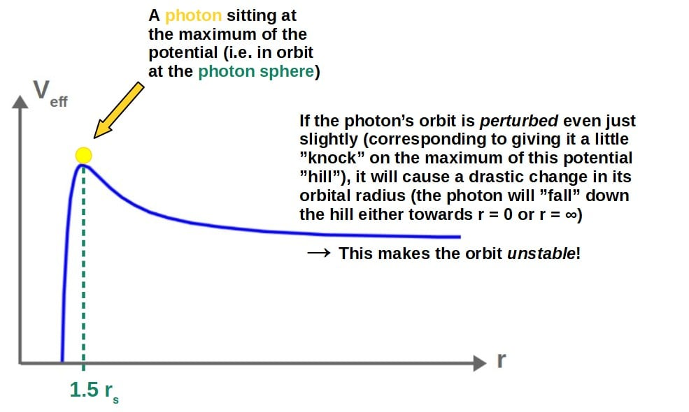

In contrast, if a particle were in orbit at a *minimum* of the potential (imagine, for example, the bottom of a parabola), a slight perturbation would only cause very small oscillations around the minimum (i.e. the radius of the orbit changes very slightly). This would correspond to a *stable* orbit.

Mathematically, the stability of orbits can be analyzed by looking at the **second derivative** of the effective potential. In particular, **if the second derivative is negative, then the orbit is unstable and if it’s positive, the orbit is stable**.

This is because second derivatives naturally describe the *concavity* of a function’s graph.

The **second derivative being negative corresponds to the graph being concave down**, which means that if at an extremal point (which, in our case, corresponds to a circular orbit), the second derivative is negative, the point must be a **maximum** (which is an unstable point).

So, **the condition for an unstable orbit** is therefore:

$$\frac{d^2V_{eff}}{dr^2}<0$$

You’ll find a proof down below for why the photon sphere is unstable using exactly this condition.

Why The Photon Sphere Is Unstable (Mathematical Proof)

The first thing we have to do is find the second derivative of the effective potential (with respect to r). I’ll denote the derivatives by a prime-symbol (so, dV/dr = V’ and d2V/dr2 = V”).

Differentiating the potential twice gives us:

$$V_{ }\left(r\right)=\frac{L^2}{2r^2}-\frac{L^2r_s}{2r^3}$$

$$V'\left(r\right)=-\frac{L^2}{r^3}+\frac{3}{2}\frac{L^2r_s}{r^4}$$

$$V''\left(r\right)=\frac{3L^2}{r^4}-\frac{6L^2r_s}{r^5}$$

We now have a function, V”(r), to which we can plug in any value of r and it will tell us whether this r corresponds to a stable or unstable point. So, let’s plug in the photon sphere radius 3rs/2 to get:

$$V''\left(\frac{3}{2}r_s\right)=\frac{16L^2}{27r_s^4}-\frac{64L^2}{81r_s^4}=-\frac{16L^2}{81r_s^4}$$

Since the value of the second derivative is **negative** at this point, it means that this has to be a **maximum** and therefore an **unstable** orbit, which proves why the photon sphere is unstable.

## Could Light Enter a Stable Orbit Around a Black Hole?

**Light cannot enter a stable orbit around a black hole as the only possible orbit for light is an unstable circular orbit. However, around an extremal charged black hole, there could theoretically exist a possible stable circular orbit for light at exactly the event horizon.**

Now, first of all, what is an *extremal* charged black hole? Simply put, this is an **electrically charged black with the maximum charge-to-mass ratio allowed by general relativity** (in other words, for a given black hole mass, its electric charge is as big as possible for that given mass).

The interesting thing is that even though a photon is an *electrically neutral* particle (it isn’t affected by the electric forces created by the black hole), the electric field of the black hole’s charge itself causes an additional *gravitational effect* on the photon.

The idea behind this is that the black hole’s **electric field contains energy** and therefore, it will cause some **curvature** in the geometry of spacetime.

This is then seen as an additional “gravitational force” that would not exist around an uncharged black hole. I discuss this and a lot more about **orbits around charged black holes** in my [guide on black hole orbits](https://profoundphysics.com/black-hole-orbits/).

Now, this additional gravitational effect can be seen in the **effective potential for a photon around a charged black hole** (the spacetime around a charged black hole is called the Reissner-Nordström spacetime):

Schematically, the effective potential has the following form (here I’ve set all the parameters equal to 1 except the electric charge of the black hole, Q, to clean up the expression):

$$V_{eff}\left(r\right)\sim\frac{1}{r^2}-\frac{1}{r^3}+\frac{Q^2}{r^4}$$

Note that in the Schwarzschild spacetime, the 1/r4 -term does not exist since Q=0.

The extra 1/r4 -term here actually leads to **two possible solutions** for circular orbits, one corresponding to a **minimum** (stable orbit) and one to a **maximum** (unstable orbit). We can see this from the potential graph:

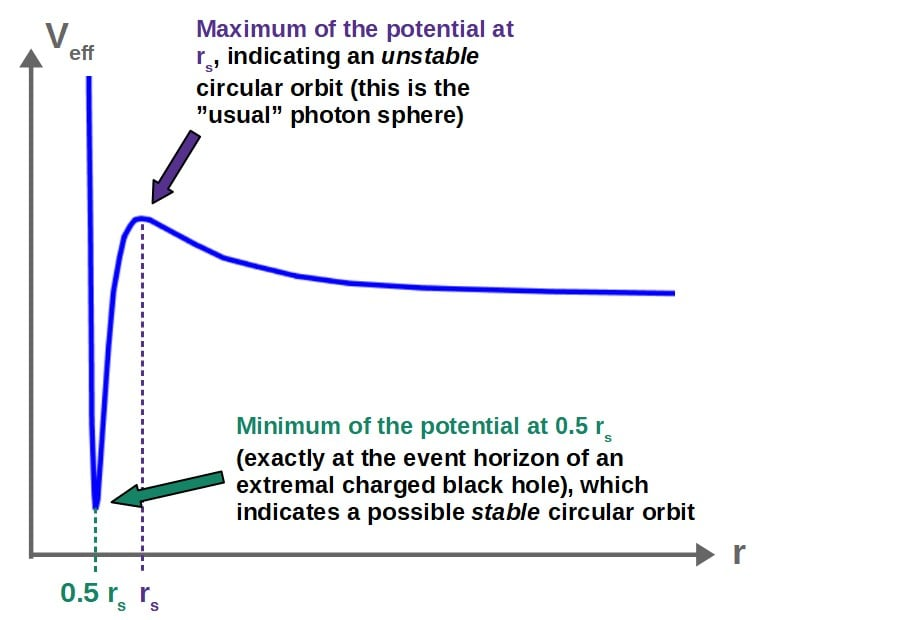

Note; for an *extremal* charged black hole, the event horizon is located at rs/2, while the unstable photon sphere is at rs. This is because due to the extra gravitational forces resulting from the electric field of the black hole, all orbits exist slightly closer to the black hole than they would in the case of an uncharged black hole.

The catch here, however, is that **unless the black hole is *extremal*** (its charge is as big as is allowed by general relativity), **this minimum does not exist**. So, **a stable photon orbit is only possible if the black hole is *maximally* charged**.

If this is indeed the case, **the stable photon sphere lies at exactly the event horizon** of the black hole (which, for the extremal black hole, is at r = 0.5 rs).

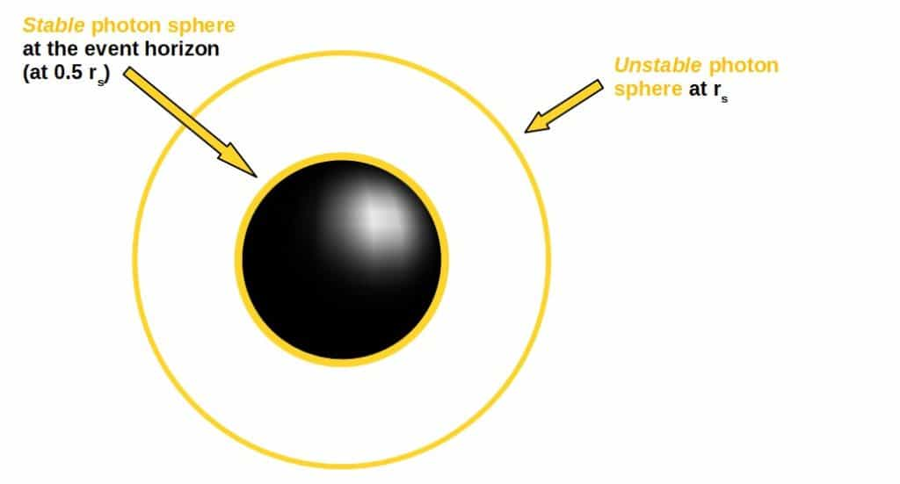

---

*← [Back to the full archive](../index.html)*
