# Christoffel Symbols: A Complete Guide With Examples

> Connection coefficients of the Levi-Civita connection — they encode fictitious forces in curved coordinates.

*Originally published at [profoundphysics.com](https://profoundphysics.com/christoffel-symbols-a-complete-guide-with-examples/).*

---

**Christoffel symbols** are one of the most important mathematical objects used in **general relativity** as well as in **Riemannian geometry**. They are particularly useful for practical calculations in general relativity, but what do the Christoffel symbols actually represent?

**In short, Christoffel symbols represent the connection coefficients of the Levi-Civita connection. In a geometric sense, they describe changes in basis vectors throughout a given coordinate system. Physically, the Christoffel symbols represent fictitious forces induced by a non-inertial reference frame.**

In this article, we’ll be discussing everything you’d possibly need to know about Christoffel symbols.

This includes their **geometric and physical meaning** as well as some methods to actually **calculate and use them in practice** as efficiently as possible.

Now, to understand the Christoffel symbols as **connection coefficients for the Levi-Civita connection**, we need to dive a bit deeper into differential geometry. This is what we’ll discuss first.

In case you’d want an **ad-free PDF version of this article** (an my other general relativity articles), you’ll find it [here](https://courses.profoundphysics.com/p/general-relativity-bundle), available as part of my full General Relativity Bundle.

**Quick tip**: For building a deep, practical understanding of topics like Christoffel symbols, I would highly recommend checking out my **[Mathematics of General Relativity: A Complete Course](https://courses.profoundphysics.com/p/mathematics-of-general-relativity)** (link to the course page).  
  
This course aims to give you all the **mathematical tools** you need to understand general relativity – including Christoffel symbols, the topic of this article. Inside the course, you’ll learn topics like tensor calculus in an **intuitive**, **beginner-friendly** and **highly practical** way that can be directly applied to understand general relativity.

Table of Contents

Toggle

## Connection Coefficients: What Are They Intuitively?

Christoffel symbols are mathematically classified as **connection coefficients for the Levi-Civita connection**. But what exactly are these connection coefficients?

**Connection coefficients, also called Christoffel symbols, are coordinate-dependent coefficients that are needed to specify the Levi-Civita connection. The connection coefficients therefore define a notion of differentiation on an arbitrary Riemannian manifold.**

Let’s try to understand this in a bit more detail.

In differential geometry, the basic idea we’re usually interested in is **geometry on arbitrary** (curved or not) **manifolds or coordinate systems**. A manifold you can simply think of as a smooth “surface”, on which everything takes place.

Now, each smooth manifold we study in differential geometry has an **affine connection** associated with it. An affine connection is a somewhat abstract geometric object, which basically **connects tangent spaces on the manifold**.

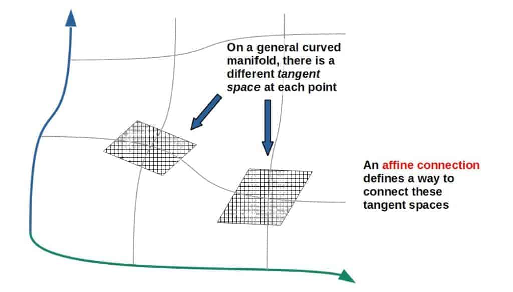

This, on the other hand, allows us to define a **notion of differentiation of functions *on the manifold***.

This is because derivatives “live” on the tangent space of the manifold; the simplest way to see this is that the “ordinary” derivative of a function gives the slope of its *tangent* line at that point.

In Riemannian or pseudo-Riemannian geometry (this is the field of differential geometry that general relativity is based on), each manifold is characterized by a **metric tensor**.

These types of manifolds, which have a metric tensor, are called **Riemannian manifolds** (as expected).

Now, these Riemannian manifolds also have an affine connection, and these affine connections are called **Levi-Civita connections**. So, the Levi-Civita connection is a “special case” of an affine connection; namely, it is the **affine connection for a manifold with a metric**.

There is also an additional requirement for the Levi-Civita connection to be “torsion-free”, which we’ll talk more about later.

In a technical sense, the Levi-Civita connection refers to the **covariant derivative,** usually denoted by ∇ (which is because it connects tangent spaces, as all affine connections do).

Now, you may ask, what does all of this have to do with the Christoffel symbols (or connection coefficients)?

Well, the answer is that once you specify a certain coordinate system on the manifold, the Levi-Civita connection (the covariant derivative) can then be completely expressed through a set of **connection coefficients** or as they are usually called, **Christoffel symbols**.

These connection coefficients (Christoffel symbols) can then be calculated from the metric of that given manifold. Now, a noteworthy thing is that these connection coefficients are *coordinate-dependent*.

A nice intuitive way to think about these connection coefficients is to think of them as **corrections to an ordinary derivative** resulting from the fact that you may have a “curved” manifold or coordinate system (in other words, a coordinate system or manifold in which the basis vectors are not constant).

This can be seen from the definition of the Levi-Civita connection (i.e. the covariant derivative):

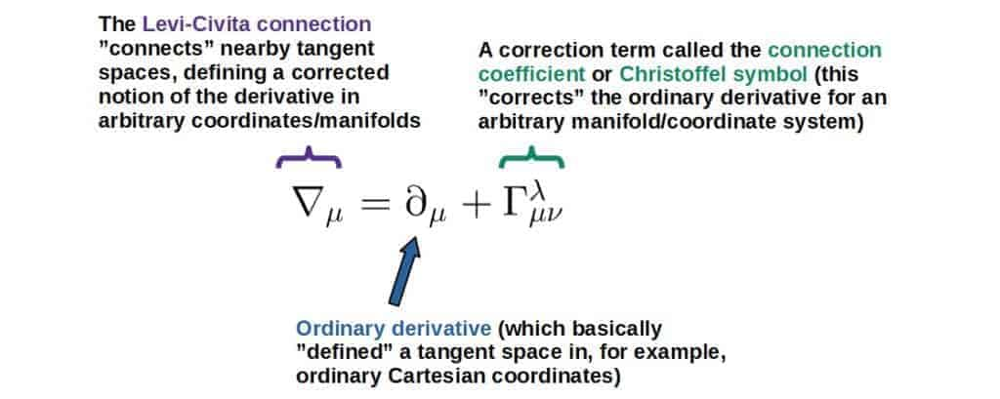 

Note; the indices here don’t really make sense as expressed like this. This is because the covariant derivative is an *operator* that needs to act on something.

## Geometric Interpretation of The Christoffel Symbols

The Christoffel symbols define the connection coefficients for the Levi-Civita connection, but do they themselves have some kind of geometric meaning? In other words, **how could the meaning of the Christoffel symbols be interpreted geometrically?**

**Geometrically, Christoffel symbols can be interpreted as describing how basis vectors change throughout a given coordinate system. The basis vectors may change due to the coordinate system being curvilinear or due to the geometry of the space itself being curved, and the Christoffel symbols describe both of these.**

Let’s try to understand this in more detail. The Christoffel symbols are essentially *defined* as the **derivatives of basis vectors**:

$$\Gamma_{\mu\nu}^{\lambda}=\frac{\partial \vec e_{\mu}}{\partial x^{\nu}}\cdot \vec e^{\lambda}$$

You’ll find a “derivation” of this down below (it’s not really a derivation, but rather just a way to see where this definition comes from).

Why Do The Christoffel Symbols Represent Derivatives of Basis Vectors?

Let’s begin by thinking of how vectors are generally represented. Any vector (let’s call it V) can be represented as a sum of the vector components and the basis vectors (i.e. a linear combination):

$$\vec{V}=V^0\vec{e}_0+V^1\vec{e}_1+V^2\vec{e}_2+V^3\vec{e}_3$$

I’m taking this vector to have four components, which go from 0 to 3 (this is common in general and special relativity).

We can represent this more compactly as:

$$\vec{V}=V^{\lambda}\vec{e}_{\lambda}$$

Take note that whenever you see an index repeated in both the upstairs and downstairs position (like λ here), it generally means a sum over that index. This is called *Einstein’s summation convention*.

Now let’s take the derivative of this with respect to some coordinate xµ (if we account for the fact that the basis vectors may change from point to point, we have to actually use the product rule):

$$\frac{\partial\vec{V}}{\partial x^{\mu}}=\frac{\partial}{\partial x^{\mu}}\left(V^{\lambda}\vec{e}_{\lambda}\right)=\left(\frac{\partial}{\partial x^{\mu}}V^{\lambda}\right)\vec{e}_{\lambda}+V^{\lambda}\left(\frac{\partial}{\partial x^{\mu}}\vec{e}_{\lambda}\right)$$

Since the right-hand side is a vector, ideally we’d like to express the left-hand side clearly as a vector too, which has the form of a coefficient multiplied (and summed over) by a basis vector.

The first term on the left already has this form, but the right hand-side does not (at least not explicitly). To get it into that form, we simply make the following **definition**:

$$\partial_{\mu}\vec{e}_{\lambda}=\Gamma_{\mu\lambda}^{\alpha}\vec{e}_{\alpha}$$

Again, this is simply a definition, meaning that the Christoffel symbol is defined as whatever the *coefficient* you get when acting with the derivative on the basis vector.

With this, you can check that the expression above takes the form (with a little bit of index relabeling) of a linear combination of some coefficients with the basis vectors:

$$\frac{\partial\vec{V}}{\partial x^{\mu}}=\left(\partial_{\mu}V^{\lambda}+\Gamma_{\mu\alpha}^{\lambda}V^{\alpha}\right)\vec{e}_{\lambda}$$

If you recognize it, the thing inside the parentheses is indeed the covariant derivative acting on the vector components (∇µVλ).

Now, for our purposes, the more interesting thing is the definition we made above:

$$\partial_{\mu}\vec{e}_{\lambda}=\Gamma_{\mu\lambda}^{\alpha}\vec{e}_{\alpha}$$

We can “solve” for the Christoffel symbol here by multiplying both sides by eα:

$$\vec{e}^{\alpha}\cdot\partial_{\mu}\vec{e}_{\lambda}=\Gamma_{\mu\lambda}^{\alpha}\vec{e}_{\alpha}\cdot\vec{e}^{\alpha}\ \ \Rightarrow\ \ \Gamma_{\mu\lambda}^{\alpha}=\vec{e}^{\alpha}\cdot\partial_{\mu}\vec{e}_{\lambda}$$

Here, I’ve used the fact that eα\*eβ=δαβ (this is the definition of a “dual basis”), which means that eα\*eα=1.

Now, let’s dissect what the Christoffel symbols really mean geometrically.

In an arbitrary curved space or coordinate system, the basis vectors may change from point to point. Locally (at every point), **the Christoffel symbols tell you how the basis vectors are changing** (this is what the derivative represents):

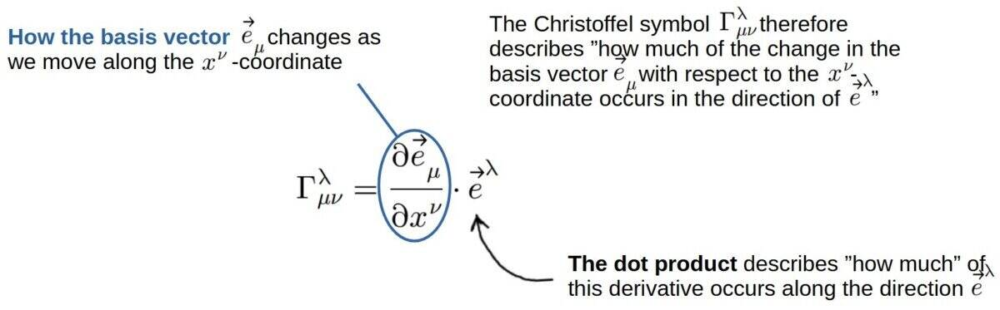

From this definition, it’s also easy to see why the Christoffel symbols are coordinate-dependent (they depend on which coordinate system you happen to be using). This means that they are actually not tensors, which we’ll talk about later.

There is actually a nice visual way to see what these different Christoffel symbol *components* represent.

Let’s say we have some **curved coordinate system with the coordinate axes x1 and x2** (these could be x and y, for example; just note that the coordinate axes don’t necessarily have to be perpendicular to each other) **with the basis vectors in these directions labeled e1 and e2**.

Now imagine you move **along the x1-axis and see how the basis vector e2 changes** (along this x1-axis). A small change in a vector along a coordinate axis is simply the (partial) derivative with respect to that particular coordinate.

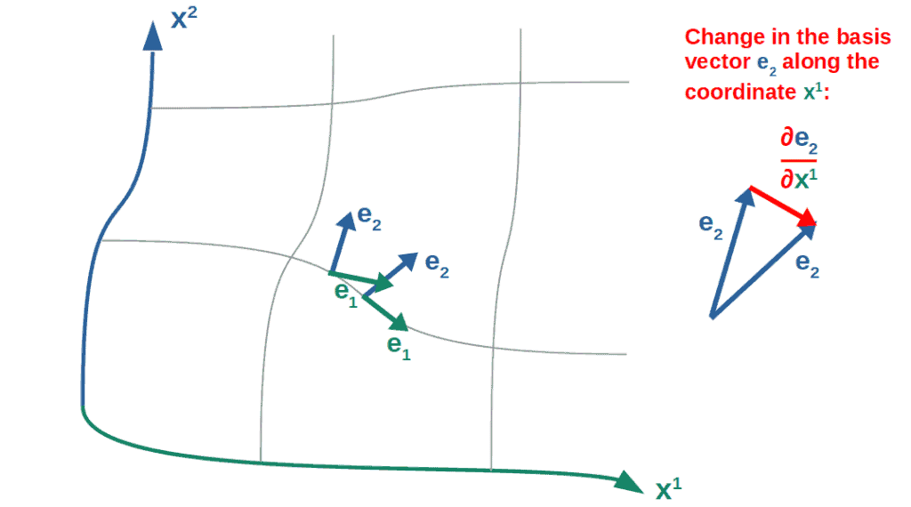

To avoid clutter, I’ve dropped the vector signs above these basis vectors.

This derivative vector (the red vector in the picture) can also **be divided into its components along the x1 and x2 axes**.

This is done by **taking the dot product of this red vector with the different basis vectors** (in general, any single component of a vector can be calculated like this; for example, the y-component of an ordinary velocity vector is the dot product of the total velocity vector with the unit vector in the y-direction).

This is, in a rough sense, what the **components of the Christoffel symbols represent** (don’t pay attention to the index placement; the point is to just give some geometric intuition):

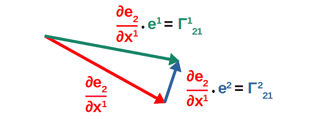

Note; I discuss the dot product and its physical meaning in [this article](https://profoundphysics.com/dot-product-in-physics-what-is-the-physical-meaning-of-it/). In there, I also explain how the dot product can be interpreted in curved spacetime by using a metric tensor.

In other words, **Christoffel symbols geometrically represent different components of the derivatives of basis vectors**.

Another way to say it is that if you were to take the derivative of a basis vector (i.e. see how the basis vector changes along some coordinate), this would give you another vector. The Christoffel symbols then represent the different components of this new vector.

An easy way to see this is to write the definition of the Christoffel symbol in another way:

$$\Gamma_{\mu\nu}^{\lambda}=\vec{e}^{\lambda}\cdot\partial_{\nu}\vec{e}_{\mu}\ \ \Rightarrow\ \ \partial_{\nu}\vec{e}_{\mu}=\Gamma_{\mu\nu}^{\lambda}\vec{e}_{\lambda}$$

Here, I’ve simply multiplied by eλ on both sides and used the definition that eλeλ=1.

We’ll then sum over the index λ here, since it’s a summation index (we’ll take it to run from 0 to 3 here, which is common in general relativity):

$$\partial_{\nu}\vec{e}_{\mu}=\Gamma_{\mu\nu}^0\vec{e}_0+\Gamma_{\mu\nu}^1\vec{e}_1+\Gamma_{\mu\nu}^2\vec{e}_2+\Gamma_{\mu\nu}^3\vec{e}_3$$

In general, any vector can be expressed as a *linear combination* of basis vectors and some *coefficients* (also known as vector components). This is what we have on the right-hand side.

From this, we can clearly see that these Christoffel symbols indeed represent **different components of a vector** (namely, components of the vector ∂νeµ).

This also gives some insight into why they’re called *connection coefficients*, which is that they are coefficients (i.e. components) of these basis vectors for this derivative vector.

Now, the key point here is that **the Christoffel symbols represent how the basis vectors change throughout a given Riemannian manifold** (actually, they also represent how basis vectors may change in some arbitrary coordinate system in Euclidean space).

Also, since Christoffel symbols are quite common in general relativity, they have a lot to do with **gravity**. This is what we’ll explore soon, but first, we need to discuss another way of representing the Christoffel symbols mathematically.

 

My **Mathematics of General Relativity** -course will teach you all the math you need for a deep understanding of general relativity. You’ll find more information [here](https://courses.profoundphysics.com/p/mathematics-of-general-relativity).

## Christoffel Symbols In Terms of The Metric (Step-By-Step Derivation)

One of the key mathematical objects in differential geometry (and in general relativity) is the **metric tensor**.

**The metric tensor, to put it simply, is used to define different geometric concepts in arbitrary coordinate systems or spaces** (such as length, volume, the dot product etc.). So, it is central for describing the geometry of, for example, a Riemannian manifold.

The metric is typically denoted by a two-index tensor gµν (in this article, I’m using mostly Greek indices since they are more common in general relativity).

**Recommendation**: If you’re not familiar with the metric tensor, definitely check out my [full article](https://profoundphysics.com/metric-tensor-a-complete-guide-with-examples/) covering everything you need to know about it. You’ll learn about both the geometry behind the metric as well as its uses in general relativity.

Now, **the Christoffel symbols in terms of the metric** is defined in the following way:

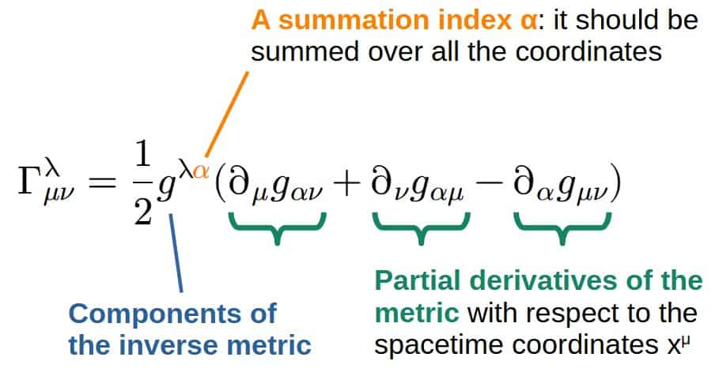

Note; the components of the inverse metric can be obtained directly as inverses of the original metric if the metric is *diagonal*.

You’ll find a **derivation** of this formula down below, which uses the geometric definitions of the Christoffel symbols and the metric.

Derivation of The Christoffel Symbol Formula In Terms of The Metric

The starting point for this derivation will be the geometric definition of the Christoffel symbols in terms of basis vectors:

$$\vec{e}_{\lambda}\Gamma_{\mu\nu}^{\lambda}=\partial_{\mu}\vec{e}_{\nu}$$

We discussed the geometric meaning of this formula earlier in this article.

Next, we’ll write this right-hand side in a little bit of a different way (you’ll see why shortly). To do this, let’s consider the derivative of the dot product of two basis vectors:

$$\partial_{\alpha}\left(\vec{e}_{\mu}\cdot \vec{e}_{\nu}\right)=\vec{e}_{\nu}\cdot\partial_{\alpha}\vec{e}_{\mu}+\vec{e}_{\mu}\cdot\partial_{\alpha}\vec{e}_{\nu}\ \ \Rightarrow\ \ \vec{e}_{\mu}\cdot\partial_{\alpha}\vec{e}_{\nu}\ =\partial_{\alpha}\left(\vec{e}_{\mu}\cdot \vec{e}_{\nu}\right)-\vec{e}_{\nu}\cdot\partial_{\alpha}\vec{e}_{\mu}$$

In the first step, I’ve used the product rule and in the second step, simply rearranges the terms.

Let’s then insert the definition of the Christoffel symbol (∂µeν=eλΓλµν) into this equation to get:

$$\vec{e}_{\mu}\cdot\vec{e}_{\lambda}\Gamma_{\alpha\nu}^{\lambda}\ =\partial_{\alpha}\left(\vec{e}_{\mu}\cdot\vec{e}_{\nu}\right)-\vec{e}_{\nu}\cdot\vec{e}_{\lambda}\Gamma_{\alpha\mu}^{\lambda}$$

$$\vec{e}_{\mu}\cdot\vec{e}_{\lambda}\Gamma_{\alpha\nu}^{\lambda}\ =\partial_{\alpha}\left(\vec{e}_{\mu}\cdot\vec{e}_{\nu}\right)-\vec{e}_{\nu}\cdot\vec{e}_{\lambda}\Gamma_{\alpha\mu}^{\lambda}$$

The next step may seem a little out of the blue, but bare with me here. What we’ll do is construct three different “permutations” of this equation above (it’s simply just the same equation but with the indices swapped around in different ways):

$$\vec{e}_{\mu}\cdot\vec{e}_{\lambda}\Gamma_{\alpha\nu}^{\lambda}=\partial_{\alpha}\left(\vec{e}_{\mu}\cdot\vec{e}_{\nu}\right)-\vec{e}_{\nu}\cdot\vec{e}_{\lambda}\Gamma_{\alpha\mu}^{\lambda}\ \ \ \left(1\right)$$

For convenience, I’ve labeled these equations by 1, 2 and 3.

$$\vec{e}_{\alpha}\cdot\vec{e}_{\lambda}\Gamma_{\nu\mu}^{\lambda}\ =\partial_{\nu}\left(\vec{e}_{\alpha}\cdot\vec{e}_{\mu}\right)-\vec{e}_{\mu}\cdot\vec{e}_{\lambda}\Gamma_{\nu\alpha}^{\lambda}\ \ \ \left(2\right)$$

$$\vec{e}_{\alpha}\cdot\vec{e}_{\lambda}\Gamma_{\mu\nu}^{\lambda}\ =\partial_{\mu}\left(\vec{e}_{\alpha}\cdot\vec{e}_{\nu}\right)-\vec{e}_{\nu}\cdot\vec{e}_{\lambda}\Gamma_{\mu\alpha}^{\lambda}\ \ \ \left(3\right)$$

Now we’ll add the first two equations together and subtract the third one (the reason for this is that this combination will simplify into a nice form). So, from (1) + (2) – (3), we get:

$$\vec{e}_{\mu}\cdot\vec{e}_{\lambda}\Gamma_{\alpha\nu}^{\lambda}+\vec{e}_{\alpha}\cdot\vec{e}_{\lambda}\Gamma_{\nu\mu}^{\lambda}\ -\vec{e}_{\alpha}\cdot\vec{e}_{\lambda}\Gamma_{\mu\nu}^{\lambda}=\partial_{\alpha}\left(\vec{e}_{\mu}\cdot\vec{e}_{\nu}\right)-\vec{e}_{\nu}\cdot\vec{e}_{\lambda}\Gamma_{\alpha\mu}^{\lambda}+\partial_{\nu}\left(\vec{e}_{\alpha}\cdot\vec{e}_{\mu}\right)\\-\vec{e}_{\mu}\cdot\vec{e}_{\lambda}\Gamma_{\nu\alpha}^{\lambda}-\partial_{\mu}\left(\vec{e}_{\alpha}\cdot\vec{e}_{\nu}\right)+\vec{e}_{\nu}\cdot\vec{e}_{\lambda}\Gamma_{\mu\alpha}^{\lambda}$$

We’ll now make use of the *torsion-free symmetry* of the Christoffel symbols (the two lower indices can be exchanged freely, meaning Γλµν=Γλνµ).

This then means that the **second and third terms on the left-hand side cancel one another** (one has a plus sign and the other a minus sign). **On the right-hand side, the second and last terms will cancel one another**. After these simplifications, we’re left with:

$$\vec{e}_{\mu}\cdot\vec{e}_{\lambda}\Gamma_{\alpha\nu}^{\lambda}=\partial_{\alpha}\left(\vec{e}_{\mu}\cdot\vec{e}_{\nu}\right)+\partial_{\nu}\left(\vec{e}_{\alpha}\cdot\vec{e}_{\mu}\right)-\vec{e}_{\mu}\cdot\vec{e}_{\lambda}\Gamma_{\nu\alpha}^{\lambda}-\partial_{\mu}\left(\vec{e}_{\alpha}\cdot\vec{e}_{\nu}\right)$$

Now we’ll move the Christoffel symbol term from the right-hand side to the left-hand side. By doing this, we get a factor of two on the left (since the terms are the same by the symmetry of the C-symbols):

$$2\vec{e}_{\mu}\cdot\vec{e}_{\lambda}\Gamma_{\alpha\nu}^{\lambda}=\partial_{\alpha}\left(\vec{e}_{\mu}\cdot\vec{e}_{\nu}\right)+\partial_{\nu}\left(\vec{e}_{\alpha}\cdot\vec{e}_{\mu}\right)-\partial_{\mu}\left(\vec{e}_{\alpha}\cdot\vec{e}_{\nu}\right)$$

Let’s now divide by this factor of 2 and also multiply both sides by a factor of eµ\*eρ. We then have:

$$\left(\vec{e}^{\mu}\cdot\vec{e}^{\rho}\right)\left(\vec{e}_{\mu}\cdot\vec{e}_{\lambda}\right)\Gamma_{\alpha\nu}^{\lambda}=\frac{1}{2}\vec{e}^{\mu}\cdot\vec{e}^{\rho}\left(\partial_{\alpha}\left(\vec{e}_{\mu}\cdot\vec{e}_{\nu}\right)+\partial_{\nu}\left(\vec{e}_{\alpha}\cdot\vec{e}_{\mu}\right)-\partial_{\mu}\left(\vec{e}_{\alpha}\cdot\vec{e}_{\nu}\right)\right)$$

We can now “solve” for the Christoffel symbol by making use of the following mathematical fact:

$$\left(\vec{e}^{\mu}\cdot\vec{e}^{\rho}\right)\left(\vec{e}_{\mu}\cdot\vec{e}_{\lambda}\right)=\delta_{\lambda}^{\rho}$$

We then get for the Christoffel symbol:

$$\delta_{\lambda}^{\rho}\Gamma_{\alpha\nu}^{\lambda}=\Gamma_{\alpha\nu}^{\rho}=\frac{1}{2}\vec{e}^{\mu}\cdot\vec{e}^{\rho}\left(\partial_{\alpha}\left(\vec{e}_{\mu}\cdot\vec{e}_{\nu}\right)+\partial_{\nu}\left(\vec{e}_{\alpha}\cdot\vec{e}_{\mu}\right)-\partial_{\mu}\left(\vec{e}_{\alpha}\cdot\vec{e}_{\nu}\right)\right)$$

Now, here we can see that each term on the right contains a dot product of two basis vectors, which is exactly what we want. This is because the metric tensor is geometrically defined as the dot product between basis vectors:

$$g_{\mu\nu}=\vec{e}_{\mu}\cdot \vec{e}_{\nu}$$

Also, the inverse metric is defined as gµν=eµ\*eν.

Inserting this definition of the metric, we get the formula for the Christoffel symbols in terms of the metric:

$$\Gamma_{\alpha\nu}^{\rho}=\frac{1}{2}g^{\mu\rho}\left(\partial_{\alpha}g_{\mu\nu}+\partial_{\nu}g_{\alpha\mu}-\partial_{\mu}g_{\alpha\nu}\right)$$

An important property of the Christoffel symbols that the derivation takes advantage of is the requirement of a ***torsion-free connection***.

We will talk about this in more detail later, but for our purposes, all it really implies is that the Christoffel symbols are **symmetric** in the two lower indices:

$$\Gamma_{\mu\nu}^{\lambda}=\Gamma_{\nu\mu}^{\lambda}$$

**Sidenote**; if you’re interested to see some examples of **how Christoffel symbols are used in practice**, you can check out [this article](https://profoundphysics.com/derivation-of-einstein-field-equations/). In there, we **derive the Einstein field equations** in two different ways and more related to this article, we also calculate the **weak-field limit of Einstein’s equations**, including the Christoffel symbols in this limit.

## Physical Interpretation of The Christoffel Symbols

Christoffel symbols play a key role in the mathematics of general relativity, but do they have some kind of physical interpretation as well?

**Physically, Christoffel symbols can be interpreted as describing fictitious forces arising from a non-inertial reference frame. In general relativity, Christoffel symbols represent gravitational forces as they describe how the gravitational potential (metric) varies throughout spacetime causing objects to accelerate.**

To understand this a little better in the context of gravity, we need to first think of how a gravitational field is *defined* or how its effects can be measured in the first place.

**A gravitational field is described by the acceleration (or force) an object would experience if it were to be placed in the field**.

Now, Christoffel symbols, on the other hand, describe changes in basis vectors throughout a given coordinate system (as discussed earlier).

Physically, this actually corresponds to what are called **fictitious forces** (these are simply “forces” or acceleration effects that can only be observed in a specific frame of reference or coordinate system).

The interesting thing about this is that actually, **gravity is a “fictitious force” in general relativity**, which is caused by *spacetime itself* being curved in the presence of matter and energy. This is explained in more detail in my [introductory article on general relativity](https://profoundphysics.com/general-relativity-for-dummies/).

Since the Christoffel symbols describe these “fictitious forces” (which are simply just the effect of a basis not being constant in some coordinate system), this means that, **in general relativity, Christoffel symbols play the role of describing how objects accelerate in a curved spacetime**.

This indeed corresponds to the Christoffel symbols actually describing gravitational fields in general relativity. In fact, **Christoffel symbols *are* gravitational fields in general relativity**.

Now, why is this actually the case? In my opinion, the easiest way to see this is by comparing the definition of the **Christoffel symbols in terms of the metric tensor** to the definition of a *gravitational field in Newtonian physics*.

In Newtonian gravity, the gravitational field (i.e. gravitational acceleration at each point in the field) is represented by a **vector field g**. This g is defined as the *negative gradient of the gravitational potential*:

$$\vec{g}=-\vec{\nabla}\Phi=-\partial_x\Phi \vec{e}_x-\partial_y\Phi \vec{e}_y-\partial_z\Phi \vec{e}_z$$

Here, I’ve written out the gradient vector and the e’s denote the basis vectors in each direction (x,y,z).

Let’s now compare this to the definition of the Christoffel symbol in terms of the metric. The key idea here is to note that **the metric itself represents the gravitational potential in general relativity**.

To learn more about the idea of the metric representing **gravitational potentials**, you can read [this article](https://profoundphysics.com/metric-tensor-a-complete-guide-with-examples/).

The link between the Christoffel symbols and the Newtonian gravitational field is the **weak-field limit**, in which the Christoffel symbols actually reduce pretty much exactly to the **Newtonian gravitational field**.

This can be seen nicely by looking at the geodesic equation (for the radial coordinate) in the weak-field limit and comparing that to the equation for a Newtonian gravitational field.

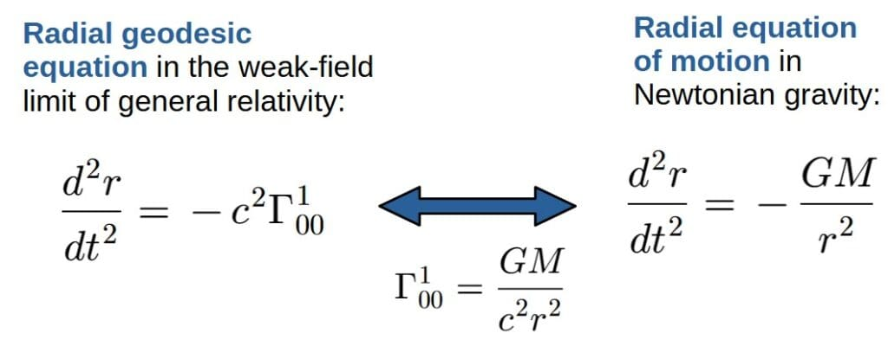

I discuss where this comes from later in the article, where you’ll also find a bunch more examples of different Christoffel symbols.

This really makes explicitly clear the connection of the Christoffel symbols to the gravitational field itself (or gravitational acceleration).

It’s not quite so clear in cases where the metric is more complicated, but the basic idea still applies; **Christoffel symbols represent gravitational acceleration in general relativity**.

Also, another way to see why the Christoffel symbols describe the acceleration caused by gravity is that they show up in the **geodesic equation**, which describes, as expected, acceleration caused by gravity (curved spacetime). You can read more about it in [this article](https://profoundphysics.com/general-relativity-for-dummies/).

Now, you may still be wondering about one thing; *if Christoffel symbols are coordinate-dependent, how can they represent something physical*?

This idea is indeed quite puzzling, but essentially the answer is that **in general relativity, gravity itself is a coordinate-dependent phenomenon** (i.e. a “fictional force”), but it still does have a physical meaning and so do the Christoffel symbols.

You’ll find more on this concept below.

How Can Christoffel Symbols Represent Gravitational Fields Even Though They Are Coordinate-Dependent?

The important point here is that “coordinate-dependent” does not necessarily imply “non-physical”.

Now, the laws of physics themselves should be constructed out of **coordinate-independent** things (because they have to be the same for everyone, always, no matter in which coordinate system we decide to use).

However, certain physical phenomena (in particular, *how those phenomena are observed*), can appear and be different in different coordinate systems (or in more physical terms, they can depend on who is observing them).

As an example, in relativity, **time is relative** like you’ve probably heard before, yet it still certainly has a “physical meaning”. It just doesn’t have a universal definition and different observers may observe it differently (i.e. it is coordinate-dependent).

The same goes for the Christoffel symbols. They can indeed represent a physical gravitational field, but we just have to keep in mind that **different observers may observe the gravitational field differently** (this is true even in Newtonian physics).

This is actually fairly simple to understand. Let’s say we were to observe a given gravitational field from a **freely-falling reference frame** (coordinate system).

You can think of this coordinate system as simply the coordinate system, which someone falling freely towards the Earth, for example, would use (by free-fall, I’m referring to something being only influenced by gravity and no other forces).

Now, this observer in the freely-falling frame would actually **not observe a gravitational force at all** (if you’re just falling to the ground, you don’t *feel* any force acting on you; gravity is only felt through the effect of the normal force of the ground pushing you *against* gravity).

Thus, **in the *free-fall* coordinate system there would not even appear to be a gravitational field present** (these freely-falling coordinate systems, or more accurately, trajectories in these freely-falling coordinate systems are called *geodesics*).

On the other hand, someone standing on the ground would certainly observe the person falling towards the Earth to be in accelerated motion and they would observe there being a gravitational field of some sort.

So, here we see a clear example of **gravity as a fictitious force** (a force caused by a particular reference frame). Namely, someone moving along a geodesic through spacetime would not observe a gravitational field, but someone else in some other coordinate system would observe the first observer being accelerated in a gravitational field.

The bottom line here is that **different observers may describe a gravitational field (Christoffel symbols) differently depending on the particular coordinate system they use**. The gravitational field is still a physical thing, it just does not have a universal meaning for everyone.

Now, there are actually universal effects of gravity that are NOT coordinate-dependent and these distinguish a gravitational field from just simple acceleration. These effects are called **tidal forces**.

In general relativity, **tidal forces are equated to the curvature of spacetime** and the curvature of a space is a coordinate-independent thing. Therefore, while a gravitational field (the Christoffel symbols) can vanish in some coordinate system, the curvature of spacetime (tidal forces) cannot.

Curvature and thus, tidal forces are described by different kinds of **curvature tensors**, which are built out of the metric and the Christoffel symbols.

One particularly important curvature tensor (which also appears in the Einstein field equations) is the **Ricci tensor**, which in some sense, describes **changes in an object’s volume due to gravitational tides**. You can read more about it in [this article](https://profoundphysics.com/the-ricci-tensor/).

Now, it’s worth noting that you shouldn’t take this idea too literally all of the time. In many cases, especially in *flat spacetimes,* the Christoffel symbols won’t necessarily represent anything to do with gravity.

In these cases, the Christoffel symbols will generally represent some kind of **fictitious forces** induced by a non-inertial coordinate system.

For example, in a *rotating* coordinate system (but in flat spacetime), the Christoffel symbols actually have the physical interpretation of the **centrifugal force and the Coriolis force**, but nothing to do with gravity.

It is only in **curved spacetime** that the Christoffel symbols MAY happen to have a nice interpretation of a gravitational force.

In case this section involving general relativity seemed intriguing to you, you can check out my article **[General Relativity For Dummies: An Intuitive Introduction](https://profoundphysics.com/general-relativity-for-dummies/)**. This is, by far, my longest and most in-depth article ever, which aims to cover all the basic ideas of general relativity in an intuitive way.  
  
You may also find my **[complete guide on learning general relativity on your own](https://profoundphysics.com/how-to-learn-general-relativity-a-step-by-step-guide/)** helpful. In there, I give some of my recommended resources for self-studying general relativity as well as what to expect.

## How Do You Actually Read Christoffel Symbols? (A Visual Example)

**The Christoffel symbols Γkij can be read as follows; the two lower indices, i and j, describe the change in the i:th basis vector caused by a change in the j:th coordinate. The upper index k then gives the specific direction in which this change occurs in.**

A nice visual way to see how these Christoffel symbols can be interpreted is by considering the **Christoffel symbols in polar coordinates**.

In a polar coordinate system, there are *two coordinate-axes*, r and θ (r being the “radial” axis and θ the “angular” axis) and every point can be labeled by an r-coordinate and a θ-coordinate. Both directions also have their corresponding basis vectors, which are always orthogonal but change direction from point to point.

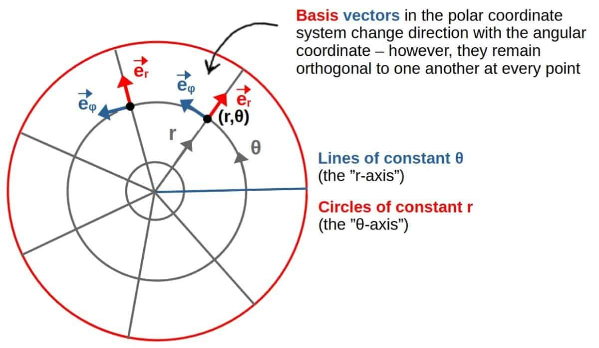

Now consider the following two Christoffel symbols in these coordinates (the calculation of these can be found later in the article):

$$\Gamma_{r\theta}^{\theta}=\frac{1}{r}$$

$$\Gamma_{r\theta}^r=0$$

To interpret the meaning of these, let’s look at a small change in the θ-coordinate. Then, consider how the basis vector in the r-direction (er) changes due to the change in this θ-coordinate.

The Christoffel symbols essentially describe **how much of this change occurs in both the r- and the θ-directions** (i.e. they are the *components* of this derivative of a basis vector).

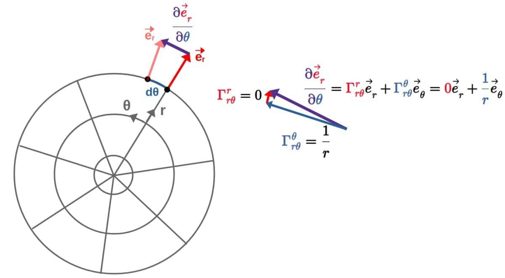

Here, the red vector component Γrrθ is drawn as a “small arrow” even though it should be exactly zero – this is just for illustration purposes and to avoid making the picture cluttered.

Hopefully you can see the meaning of the Christoffel symbols from this example.

Essentially, **the Christoffel symbol Γrrθ=0 tells you that this er-basis vector does not change in the r-direction due to a change in the θ-coordinate**. This is what it means for this symbol to be zero.

On the other hand, **Γθrθ=1/r tells you that the er-basis vector changes in the θ-direction (due to a change in the θ-coordinate) as inversely proportional to the radial distance from the origin** (the r-coordinate).

This makes sense intuitively as well; the further away you are from the origin (the greater r is), the smaller a change in the basis vector er will be for a given change in the θ-coordinate.

This can be seen from the fact that the “curvature” of the circles is smaller the further away you go, so for a given change in θ, the change in the er-vector won’t be as drastic for a larger r compared to a smaller r. That’s what this Christoffel symbol (Γθrθ=1/r) is essentially telling you.

Now, the point of this example was to show you a nice visual interpretation of these Christoffel symbols.

If the Christoffel symbols happen to be much more complicated, there won’t be such a simple geometric interpretation of them.

In these cases, they are simply just used as **calculational tools** without too much of a deeper meaning (like it’s often done especially in general relativity).

However, there is one case where the Christoffel symbols do have a nice and simple geometric interpretation, which is when one of them happens to be zero.

**Generally, whenever a Christoffel symbol Γkij is zero, it means that the i:th basis vector remains constant in the k:th direction with respect to a change in the j:th coordinate.**

## Are Christoffel Symbols Tensors?

Christoffel symbols seem quite similar to tensors, at least in the sense that they seem to have upper and lower indices similar to those of tensors. However, are Christoffel symbols actually tensors or not?

**In short, Christoffel symbols are not tensors because the transformation rules of Christoffel symbols are different from the transformation rules of tensors. Since tensors are characterized by how they transform, this means that Christoffel symbols are not tensors as they do not transform as tensors.**

This can be understood by essentially just looking at the transformation law for the Christoffel symbols and then comparing that to how a tensor *should* transform.

### Transformation Law For Christoffel Symbols (Why They’re Not Tensors!)

It is, first of all, worth stating what we really mean by a transformation here.

Essentially, we’re just talking about **coordinate transformations**, which are simply a mathematical process that takes you from one set of spacetime coordinates (xµ) to another set of spacetime coordinates (x̄µ).

When applying these types of coordinate transformations on tensor, the rule is simple; you just **transform each tensor index** by a “transformation coefficient” which is the partial derivative of the new coordinates with respect to the old coordinates (or vice versa).

In particular, a **tensor with one upper and two lower indices** would transform according to the following rule:

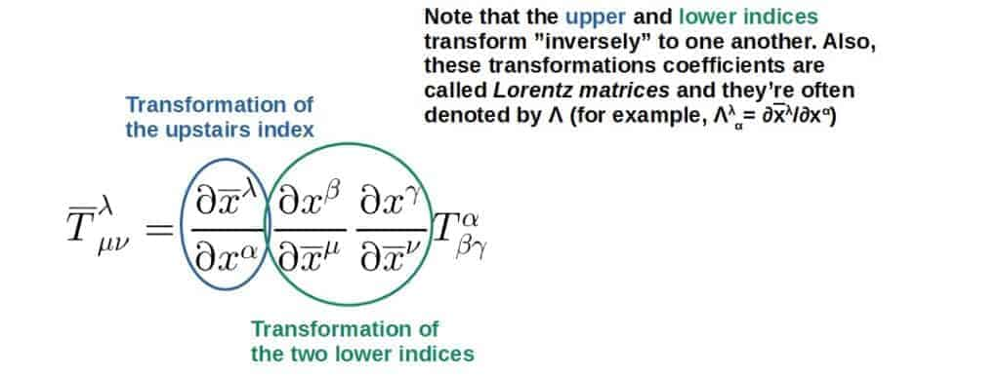 

It’s worth noting that a tensor itself is an object that is invariant under coordinate transformations. However, it’s components may change (I discuss this and its usefulness more in my [general relativity article](https://profoundphysics.com/general-relativity-for-dummies/)), which is what this transformation rule tells you; this rule allows you to calculate how the components of this tensor change as you go from the xµ-coordinates to the x̄µ-coordinates.

The above transformation property is actually often taken to be the ***definition of a tensor***. So, a tensor, in a simple sense, is just a **mathematical object that transforms under coordinate transformations according to the rule given above**.

Now, if you work out the **transformation rule for the Christoffel symbols** (this can be done by applying the transformation rule above to the metric tensor and writing the transformed Christoffel symbols in terms of these transformed metrics), you’ll discover something a little more complicated:

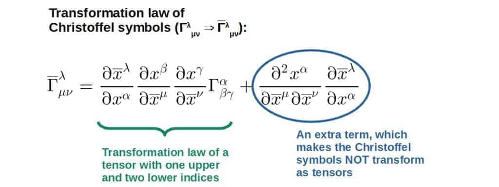

If the Christoffel symbols were indeed tensors, the first term would be all there is.

However, due to the second term, they do not satisfy the transformation rule of a tensor with one upper and two lower indices, and therefore, **the Christoffel symbols are NOT tensors**.

Now, since the Christoffel symbols are not tensors, perhaps they can be classified as something else.

Really, the right answer is that they are **connection coefficients**, not necessarily scalars, vectors or any other type of geometric object. They are simply connection coefficients and that’s it.

## Important Properties of Christoffel Symbols

In this section, we’ll be exploring some of the **most important (mathematical) properties of the Christoffel symbols**, which includes things like the symmetricity of the Christoffel symbols and an extremely useful identity for a special case of the Christoffel symbols.

We’ll also talk about the two different “versions” of the Christoffel symbols and how these are related; **Christoffel symbols of the first and of the second kind**.

### Are Christoffel Symbols Symmetric (And Why)?

**In short, Christoffel symbols are symmetric in the two lower indices, meaning that these indices can be interchanged freely (Γλµν=Γλνµ). This is due to the fact that Christoffel symbols are defined as connection coefficients for a torsion-free connection, which requires them to be symmetric.**

To understand what the **torsion-free requirement** means, we need to understand what **torsion** itself means in the context of differential geometry.

To put it simply, if a manifold has torsion, it would mean that a frame would experience a “twisting” effect as it is moved along some geodesic on this manifold.

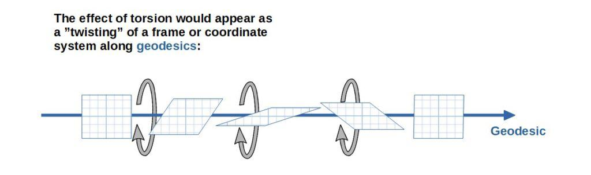 

You can kind of imagine this effect as inducing a torque force (hence the name *torsion*) on this frame, which causes it to spin about its direction of motion along the geodesic. Note that I’ve drawn the geodesic as just a straight line here, but the same concept applies for any kind of geodesic curve.

Intuitively, you can picture the same effect by throwing an american football up in the air. American footballs are notorious for spinning in a funny way around their *spin axis* as they fly through the air.

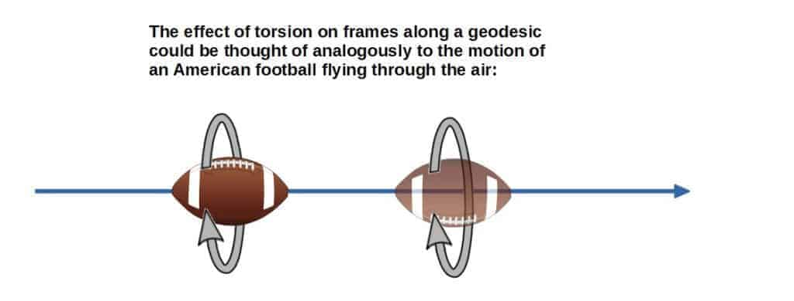 

In reality, torsion is a much more abstract concept than what is presented here, partly because it is measured *infinitesimally*, but also because the mathematics describing torsion is highly abstract and hard to give a precise geometric picture of. So, you should really take the geometric picture given here about torsion as just an intuitive way to see what is going on.

Now, what does all of this really have to do with the Christoffel symbols? Well, mathematically torsion is described by an object called the **torsion tensor** and its components are defined in terms of the connection coefficients as:

$$\tau_{\mu\nu}^{\lambda}=\Gamma_{\mu\nu}^{\lambda}-\Gamma_{\nu\mu}^{\lambda}$$

In **Riemannian geometry**, by assumption we do NOT include these torsion effects.

The only real content of this is to just say that Riemannian geometry is the special case of differential geometry in which there is no torsion. Other areas of geometry may very well include torsion.

Now, if there is no torsion, **the torsion tensor must be zero** and we have:

$$\tau_{\mu\nu}^{\lambda}=\Gamma_{\mu\nu}^{\lambda}-\Gamma_{\nu\mu}^{\lambda}=0\ \ \Rightarrow\ \ \Gamma_{\mu\nu}^{\lambda}=\Gamma_{\nu\mu}^{\lambda}$$

So, therefore, if we assume that torsion is zero, the connection coefficients or Christoffel symbols **must be symmetric**.

Physically (in general relativity), the assumption of zero torsion also makes sense as there isn’t really any experimental evidence that spacetime and gravity would have non-zero torsion.

Some physical theories, such as the **Einstein-Cartan theory**, however, DO consider non-zero torsion. In these theories, torsion does actually have some interesting interpretations, namely in regards to the spin of elementary particles.

### Contraction of The Christoffel Symbol: A Useful Identity (With Proof)

When doing calculations with the Christoffel symbols, one particularly useful identity you’ll often come across is the formula for the **contracted Christoffel symbols**:

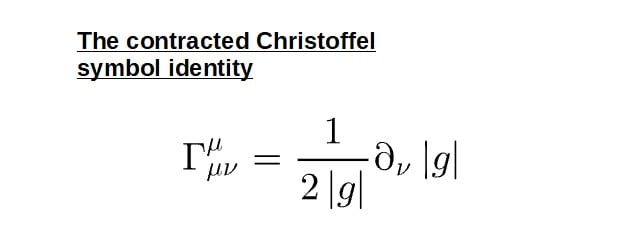

Now, what do each of these terms here mean? Let’s dissect this formula a little bit:

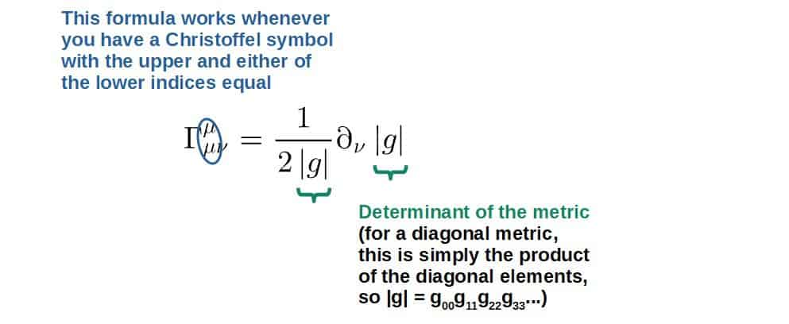

The **mathematical proof** of where this identity comes from can be found down below. It uses a little bit of tensor calculus as well as linear algebra.

Also, quite often you’ll see this identity being written in the following form:

$$\Gamma_{\mu\nu}^{\mu}=\partial_{\nu}\ln\sqrt{\left|g\right|}$$

You can quite easily verify that this is indeed equivalent to the formula given above by using a few properties of the natural logarithm:

$$\partial_{\nu}\ln\sqrt{\left|g\right|}=\frac{1}{2}\partial_{\nu}\ln\left|g\right|=\frac{1}{2\left|g\right|}\partial_{\nu}\left|g\right|$$

Mathematical Proof of The Contracted Christoffel Symbol Identity

The first step here will be to simplify the expression of the Christoffel symbol when we contract its upper index with one of the lower indices:

$$\Gamma_{\mu\nu}^{\mu}=\frac{1}{2}g^{\mu\alpha}\left(\partial_{\mu}g_{\alpha\nu}+\partial_{\nu}g_{\mu\alpha}-\partial_{\alpha}g_{\mu\nu}\right)$$

Here I’ve simply used the definition of the Christoffel symbol and set the upper and lower indices equal.

Now we’ll take advantage of the fact that both the α- and µ -indices here are *summation indices* (or sometimes called dummy indices). In other words, we can relabel them however we wish.

Here we’ll relabel the µ-index on the first term inside the parentheses to an α and the α-index to a µ (in other words, we’ve essentially just swapped the µ- and α -indices, which is completely valid since they are both dummy indices).

Doing this, we get that the first and the third term are now the same (with opposite sign) and they cancel and we’re left with just the second term:

$$\Gamma_{\mu\nu}^{\mu}=\frac{1}{2}g^{\mu\alpha}\partial_{\nu}g_{\mu\alpha}$$

The next step is to take advantage of a useful formula from linear algebra, which is that the logarithm of the determinant of a matrix is the trace of the logarithm of that matrix:

$$\ln\left(\det M\right)=Tr\left(\ln M\right)\ \ \ \ \ \left(1\right)$$

For now, this may seem somewhat out of the blue but it will turn out useful very soon (since the metric, after all, can be thought of as a matrix).

If we now take the derivative of both sides of the above matrix equation, we get on the left-hand side:

$$\partial_{\nu}\ln\left(\det M\right)=\frac{1}{\det M}\partial_{\nu}\det M$$

Here I’ve used the fact that $d\left(\ln x\right)/dx=1/x$.

On the right-hand side, we’ll have:

$\partial_{\nu}Tr\left(\ln M\right)=Tr\left(\partial_{\nu}\ln M\right)=Tr\left(M^{-1}\partial_{\nu}M\right)$

Here I’ve again used the fact that $d\left(\ln x\right)/dx=1/x$, where basically replacing x by the matrix M, we get it’s *inverse matrix*, M-1. Note that I’ve made some implicit assumptions here, such as the matrix M being differentiable and invertible (its inverse exists).

Now, equating both of these results in equation (1), we get:

$$\frac{1}{\det M}\partial_{\nu}\det M=Tr\left(M^{-1}\partial_{\nu}M\right)$$

Here comes the relevant part for the metric. If we think of the metric itself as a matrix (which it basically is, or more accurately, the “matrix elements”, which are denoted by the indices), we can apply this result directly to the metric.

To do this, we’ll simply replace M by the metric gαµ and its inverse will be the metric with upstairs indices, gαµ. Also, the determinant of the metric is denoted by |g|. We then have:

$$\frac{1}{\left|g\right|}\partial_{\nu}\left|g\right|=g^{\alpha\mu}\partial_{\nu}g_{\alpha\mu}$$

Here you may wonder what happened to the right-hand side. The answer is that the contraction of both of these indices α and µ IS already the trace of this quantity, since the trace of a matrix is defined by summing over all of the diagonal “components” or matrix elements, which is exactly what the index contraction here does (note that this only works since the metric is symmetric by definition). Therefore, no need to write the Tr() -thing explicitly.

The last thing to do is to notice that the right-hand side here is exactly what we had in the contracted Christoffel symbol formula earlier (up to a factor of 1/2). So, we then get:

$$\Gamma_{\mu\nu}^{\mu}=\frac{1}{2}g^{\mu\alpha}\partial_{\nu}g_{\mu\alpha}\ \ \Rightarrow\ \ \Gamma_{\mu\nu}^{\mu}=\frac{1}{2\left|g\right|}\partial_{\nu}\left|g\right|$$

### How Many Christoffel Symbols Are There In Total?

**For a general N-dimensional space, there are N2(N+1)/2 possible independent Christoffel symbols. This number comes from the fact that the Christoffel symbols, Γλµν, have three indices that can all take on N values and the two lower indices are symmetric.**

Note that the number of independent components for an object with three indices should generally be N3, but in the case of the Christoffel symbols, since they are symmetric in the lower indices, this number is slightly lower.

**Number of independent Christoffel symbols for a given dimensionality of a space:**

- **0-dimensional space**: no Christoffel symbols.
- **1-dimensional space**: only 1 Christoffel symbol.
- **2-dimensional space**: 6 independent Christoffel symbols.
- **3-dimensional space**: 18 independent Christoffel symbols.
- **4-dimensional space**: 40 independent Christoffel symbols.
- **General N-dimensional space**: N2(N+1)/2 independent Christoffel symbols.

It’s worth noting that these numbers indicate the *maximum* number of possible independent Christoffel symbols for a given space.

So, these do not tell you how many non-zero Christoffel symbols you may have. In other words, these numbers also include the Christoffel symbols that happen to be zero and in general, **it’s impossible to say exactly how many non-zero Christoffel symbols there are for a given space**.

This is simply due to the fact that the Christoffel symbols are **coordinate-dependent**; in one coordinate system, you may, for example, have 4 non-zero Christoffel symbols and in some other coordinate system (which keep in mind, is still the exact same geometry you’re describing), you may have 17 non-zero C-symbols.

Also, a useful special case is when the metric happens to be diagonal in some particular coordinate system.

Generally, a **diagonal metric** will have N components (in an N-dimensional space), and therefore, there will be only N2 possible independent Christoffel symbols in this case.

### Christoffel Symbols of The First Kind vs The Second Kind

Generally, there are two different but somewhat related kinds of Christoffel symbols; Christoffel symbols of the first kind and Christoffel symbols of the second kind.

**The main difference between Christoffel symbols of the first and second kind is that the second kind gives the change in a basis vector expressed in the ordinary basis, while the first kind gives the same change but expressed in the dual basis. For most applications, the second kind are typically more useful.**

To understand this, let’s remember what we discussed earlier.

We noted that the derivative of a basis vector gives another vector, and the components or coefficients of this vector are the Christoffel symbols (specifically Christoffel symbols of the **second kind**).

This vector (the derivative of a basis vector) can be expressed as a linear combination of basis vectors:

$$\partial_{\mu}\vec e_{\nu}=\Gamma_{\mu\nu}^{\lambda}\vec e_{\lambda}$$

However, we could equivalently express the same thing in terms of the Christoffel symbols of the **first kind**, which would have a basis vector with an upstairs index:

$$\partial_{\mu}\vec{e}_{\nu}=\Gamma_{\lambda\mu\nu}\vec{e}^{\lambda}$$

Basis vectors with upstairs indices are called dual basis vectors and they are related to the “ordinary” basis vectors by the equation eµ\*eν=δνµ. The dual basis vectors are therefore always orthogonal to the “ordinary” basis vectors, which makes them somewhat more abstract.

In other words, it’s possible to **express the change in a basis vector both in terms of the “ordinary” basis and the dual basis**.

The Christoffel symbols of the first kind would then describe these changes in the dual basis, while Christoffel symbols of the second kind describe these changes in the “ordinary” basis.

Mathematically, Christoffel symbols of the first and of the second kind are related by a factor of the metric:

$$\Gamma_{\mu\nu}^{\lambda}=g^{\lambda\alpha}\Gamma_{\alpha\mu\nu}$$

If you write out these Christoffel symbols in terms of the metric, they both have very similar looking formulas, which only differ by a factor of an inverse metric:

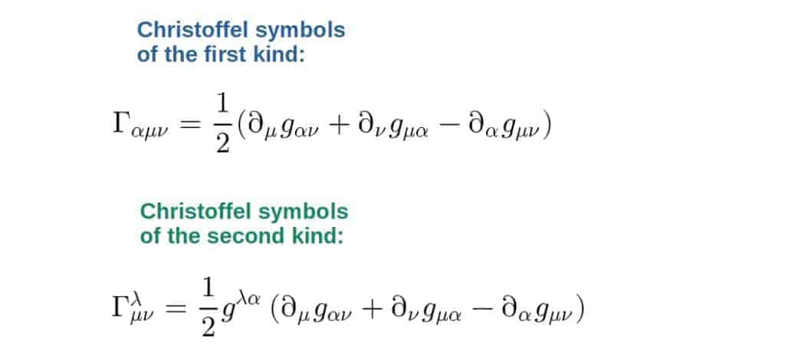

## How To Calculate Christoffel Symbols (Step-By-Step Methods)

So far, we’ve talked a lot about the properties and interpretations of the Christoffel symbols. However, in order to actually **use them in practice**, you need to be able to calculate them first. So, how are the Christoffel symbols actually calculated?

**In short, Christoffel symbols can be calculated in two ways: either directly from the metric tensor and its partial derivatives or from a specific Lagrangian by using the Euler-Lagrange equation and the geodesic equation. Typically, the second way is much more efficient.**

**The first method** is more or less the usual way to calculate them; you plug in the metric into the formula for the Christoffel symbols and repeat the same for all the possible Christoffel symbols.

**The second method**, however, is a little less commonly known and it is actually much, much more efficient. Once you get the hang of this method, you’ll be able to almost read off the Christoffel symbols without doing many calculations at all.

Down below, I’ve included the **exact steps** for both of these methods as well as an example of **how to actually do the calculation in practice**.

**Sidenote**: in case this article has been helpful so far and you’d like to download it as a PDF for yourself (or even print out), you can get a **PDF version** of this article [here](https://profoundphysics.gumroad.com/l/christoffel-symbols).

### Calculating Christoffel Symbols From The Metric

The first method is pretty much the standard way of calculating the Christoffel symbols.

This method is based on using the formula for the Christoffel symbols in terms of the metric and it works basically just by plugging in the metric components into the formula:

$$\Gamma_{\mu\nu}^{\lambda}=\frac{1}{2}g^{\lambda\alpha}\left(\partial_{\mu}g_{\alpha\nu}+\partial_{\nu}g_{\mu\alpha}-\partial_{\alpha}g_{\mu\nu}\right)$$

There are generally different ways to go about doing the calculation, but the **most efficient and fastest way** I’ve found goes by more or less the following steps:

1. **Define a set of coordinates xµ**. Typically you’ll have as many coordinates as there are dimensions in your space.
2. **Write down the components of a specific metric, gµν, or equivalently, its line element, ds2, in these coordinates**. You’ll also need the inverse metric components.
3. **Write down the formulas for the Christoffel symbols, Γλµν, in terms of the metric for each value of the index λ separately** (the upper index). You should have, in total, as many equations as there are coordinates.
4. **Based on the properties of the given metric, simplify the Christoffel symbol formulas as much as possible**.
5. **Determine which coordinates the metric depends on**. By doing this, you’ll be able to tell which derivatives of the metric are zero and in many cases, directly tell which Christoffel symbols have to be zero.
6. **Plug in the different components of the metric and its inverse into each of the Christoffel symbol formulas**.
7. **Calculate the different partial derivatives of the metric and simplify**.

Down below, you’ll find an example of calculating the Christoffel symbols exactly by these steps.

Example: Christoffel Symbol Calculation In Polar Coordinates Using The Metric

The first thing we do is define a set of coordinates. In polar coordinates, these will be the coordinates r and θ. Note that polar coordinates are basically defined in two dimensions (the equivalent of this in 3D would be spherical coordinates), so we have two coordinates:

$$x^1=r{,}\ x^2=\theta$$

The line element, in this case, will be:

$$ds^2=dr^2+r^2d\theta^2$$

We could equivalently write the metric components in matrix form:

$$g_{ij}=\begin{pmatrix}1&0\\0&r^2\end{pmatrix}$$

Here I’m using Latin indices, since we’re not talking about spacetime in this example, only the spacial coordinates.

The inverse metric components are:

$$g^{ij}=\begin{pmatrix}1&0\\0&\frac{1}{r^2}\end{pmatrix}$$

Now we’ll write the Christoffel symbols for each value of the upper index (we only have two in this case). The first one will be for the upper index equal to 1:

$$\Gamma_{ij}^1=\frac{1}{2}g^{1k}\left(\partial_ig_{jk}+\partial_jg_{ik}-\partial_kg_{ij}\right)$$

Here we have an implicit sum over the index k (which runs from 1 to 2). So, let’s write that out:

$$\Gamma_{ij}^1=\frac{1}{2}g^{11}\left(\partial_ig_{j1}+\partial_jg_{i1}-\partial_1g_{ij}\right)+\frac{1}{2}g^{12}\left(\partial_ig_{j2}+\partial_jg_{i2}-\partial_2g_{ij}\right)$$

Let’s simplify this thing a bit. We now that the metric is diagonal in this case, so the inverse metric g12=0. The second term therefore goes away and we have:

$$\Gamma_{ij}^1=\frac{1}{2}g^{11}\left(\partial_ig_{j1}+\partial_jg_{i1}-\partial_1g_{ij}\right)$$

We can simplify this formula a bit more by basically splitting it into two equations, one for i=1 and one for i=2:

$$\Gamma_{1j}^1=\frac{1}{2}g^{11}\left(\partial_1g_{j1}+\partial_jg_{11}-\partial_1g_{1j}\right)$$

$$\Gamma_{2j}^1=\frac{1}{2}g^{11}\left(\partial_2g_{j1}+\partial_jg_{21}-\partial_1g_{2j}\right)$$

In this first equation, all of the terms inside the parentheses are zero for all values of j. This is because our metric is diagonal, so the only non-zero possibility for any of these terms could be g11 (the cross-terms vanish). But, g11=1 (it’s a constant), so it’s derivatives are all zero.

In the second equation, the first and second terms also have to vanish based on the same logic. In the last term, the only non-zero possibility is j=2, since g22 is non-zero and it’s not a constant either.

So, here we’ve concluded that the only non-zero Christoffel symbol out of these has to be Γ122. Let’s calculate what it is by using the second formula and plugging in the metric components:

$$\Gamma_{22}^1=\frac{1}{2}g^{11}\left(\partial_2g_{21}+\partial_2g_{21}-\partial_1g_{22}\right)=-\frac{1}{2}g^{11}\partial_1g_{22}$$

$$g^{11}=1{,}\ \partial_1=\partial_r{,}\ g_{22}=r^2\ \ \Rightarrow\ \ \Gamma_{22}^1=-\frac{1}{2}\partial_rr^2=-r$$

For clarity, here ∂1 is the derivative with respect to the first coordinate, which in our case is r.

Now let’s repeat the same steps for the Christoffel symbols with upper index equal to 2:

$$\Gamma_{ij}^2=\frac{1}{2}g^{2k}\left(\partial_ig_{jk}+\partial_jg_{ik}-\partial_kg_{ij}\right)$$

Again, let’s do the sum over k:

$$\Gamma_{ij}^2=\frac{1}{2}g^{21}\left(\partial_ig_{j1}+\partial_jg_{i1}-\partial_1g_{ij}\right)+\frac{1}{2}g^{22}\left(\partial_ig_{j2}+\partial_jg_{i2}-\partial_2g_{ij}\right)$$

$$\Rightarrow\ \ \Gamma_{ij}^2=\frac{1}{2}g^{22}\left(\partial_ig_{j2}+\partial_jg_{i2}-\partial_2g_{ij}\right)$$

Here I’ve used the fact that g21=0 (diagonality of the metric).

Now, here comes one of the key simplification “techniques” that you can take advantage of pretty much in all Christoffel symbol calculations. It is to look at which coordinates the metric depends on (step #5).

We now that none of the metric components depend on the coordinate θ. Therefore, any derivatives with respect to θ (so things with ∂2) are zero and we conclude that the last term in the Christoffel symbol has to be zero for all values of i and j, so we’re left with:

$$\Gamma_{ij}^2=\frac{1}{2}g^{22}\left(\partial_ig_{j2}+\partial_jg_{i2}\right)$$

Let’s now again split this into two equations, one for i=1 and one for i=2:

$$\Gamma_{1j}^2=\frac{1}{2}g^{22}\left(\partial_1g_{j2}+\partial_jg_{12}\right)=\frac{1}{2}g^{22}\partial_1g_{j2}$$

Here, g12=0 based on the diagonality of the metric.

$$\Gamma_{2j}^2=\frac{1}{2}g^{22}\left(\partial_2g_{j2}+\partial_jg_{22}\right)=\frac{1}{2}g^{22}\partial_jg_{22}$$

Here I’ve again used the fact that the metric does not depend on θ, so all ∂2-derivatives have to automatically be zero.

In the first equation, the only non-zero possibility is j=2, since j=1 would give g12, which is zero. So, we have the Christoffel symbol Γ212, which is non-zero.

In the second equation, the only non-zero possibility is j=1 since j=2 would give a derivative with respect to θ, which is zero. So, we’d have Γ221. But, based on the symmetry of the Christoffel symbols, this is the same as from the first equation, namely Γ221=Γ212.

So, we then have two non-zero Christoffel symbols here, which are (plugging in the metric):

$$\Gamma_{12}^2=\Gamma_{21}^2=\frac{1}{2}g^{22}\partial_1g_{22}=\frac{1}{2}\frac{1}{r^2}\partial_rr^2=\frac{1}{r}$$

As a reminder, the metric components are g22=1/r2 and g22=r2.

We’ve now calculated all of the Christoffel symbols. In particular, we have 3 non-zero symbols and the other are zero:

$$\Gamma_{22}^1=-r{,}\ \Gamma_{12}^2=\Gamma_{21}^2=\frac{1}{r}$$

A nice way to represent these is to collect them into two matrices with the upper index labeling which matrix we’re talking about:

$$\Gamma_{ij}^1=\begin{pmatrix}0&0\\0&-r\end{pmatrix}$$

$$\Gamma_{ij}^2=\begin{pmatrix}0&\frac{1}{r}\\\frac{1}{r}&0\end{pmatrix}$$

These are indeed the Christoffel symbols in polar coordinates.

Now, this example was fairly simple, but essentially the same process applies to ANY Christoffel symbol calculation; you first define your coordinates, metric etc. and then try to simplify as much as possible so that the calculations are as simple as possible.

I purposefully went quite slow in this example, but once you get used to doing these calculations, they get very repetitive and you’ll be able to do the simplifications a lot faster.

Calculating the Christoffel symbols by this method is a great exercise the first few times you do it, but after a while it starts getting quite tedious and repetitive.

Luckily, there is a way to calculate Christoffel symbols much faster, which is by using a **Lagrangian** and the **geodesic equation**.

### Calculating Christoffel Symbols From The Geodesic Equation

This second method is a bit more non-standard, but is an extremely powerful and efficient way to calculate Christoffel symbols.

Essentially, this method uses a **Lagrangian** (L) constructed out of the metric and a bunch of velocities:

$$L=\frac{1}{2}g_{\mu\nu}\dot x^{\mu}\dot x^{\nu}$$

Here, the xλ with a dot above it denotes the *proper time derivative* of the coordinates, i.e. “velocity”, dxλ/dτ.

The Lagrangian is then plugged into the **Euler-Lagrange equation**, which is then equated with the **geodesic equation** and the Christoffel symbols can be *read off* directly by comparing coefficients:

$$\frac{d}{d\tau}\frac{\partial L}{\partial\dot{x}^{\lambda}}=\frac{\partial L}{\partial x^{\lambda}}\ \ \Leftrightarrow\ \ \ddot{x}^{\lambda}+\Gamma_{\mu\nu}^{\lambda}\dot{x}^{\mu}\dot{x}^{\nu}=0$$

Here, the xλ with two dots denotes the “acceleration”, d2xλ/dτ2. Note that this works for any *affine parameter* and the proper time is just a convenient choice.

If you’re not familiar with **Lagrangians** and the **Euler-Lagrange equation**, I’d recommend checking out my **[introductory article on Lagrangian mechanics](https://profoundphysics.com/lagrangian-mechanics-for-beginners/)**, which covers the basics of both of these as well as much more.  
  
I also discuss the **geodesic equation** in detail in my **[introduction to general relativity](https://profoundphysics.com/general-relativity-for-dummies/)**, which I’d recommend reading if you wish to know more about what the geodesic equation is exactly and why it works (it can actually be thought of as describing the *shortest distance between two spacetime points*, which is the trajectory an object would follow in a gravitational field in general relativity).

Now, the steps for this method are more or less as follows:

1. **Define a set of coordinates xµ**. Typically you’ll have as many coordinates as there are dimensions in your space.
2. **Write down the components of a specific metric, gµν, or equivalently, its line element, ds2, in these coordinates**. It’s often easier to write down the line element.
3. **Write down the Lagrangian in terms of the metric components and the derivatives of the coordinates** (velocities).
4. **Calculate the Euler-Lagrange equations for your Lagrangian for each coordinate**. Generally, you’ll have as many equations as there are coordinates.
5. **Write down the geodesic equations in full for each coordinate**. This is done by explicitly writing out the sum in each geodesic equation.
6. **Compare coefficients in front of the velocity terms in the Euler-Lagrange equation with the terms in the geodesic equation**. These coefficients are the Christoffel symbols.

Now, these steps may seem complicated, but once you actually get the hang of it, this method is incredibly efficient and easy.

The main advantage of this method is that you only have to do a few calculations and the rest is basically just looking at the equations and reading off the Christoffel symbols.

You’ll also be able to **determine multiple Christoffel symbols at the same time from just one equation**.

In fact, from one Euler-Lagrange equation (and its corresponding geodesic equation) for a particular value of the index λ, you’ll get ALL the Christoffel symbols, Γλµν, for a given value of λ.

Down below, you’ll find an example of exactly how to use this method.

If you’re interested, you’ll also find an actual practical example of **using the Lagrangian to derive orbits of light around a black hole** in [this article](https://profoundphysics.com/can-light-orbit-a-black-hole-the-physics-explained/). I also use this Lagrangian method [in this article](https://profoundphysics.com/how-are-photons-affected-by-gravity-if-they-have-no-mass/) to derive **trajectories of light passing by a star**, leading to the famous result of **light deflection**.

Example: Christoffel Symbols In Polar Coordinates Using The Geodesic Equation

It’s instructive to calculate the same Christoffel symbols as we did earlier but now using this geodesic method. So, we will again have polar coordinates and the line element of the metric:

$$x^1=r{,}\ x^2=\theta$$

$$ds^2=dr^2+r^2d\theta^2$$

If you wish, the metric components can also be written in matrix form:

$$g_{ij}=\begin{pmatrix}1&0\\0&r^2\end{pmatrix}$$

Note; by using this method, we won’t need the inverse metric components.

We now write down our Lagrangian by using the following formula:

$$L=\frac{1}{2}g_{ij}\dot{x}^i\dot{x}^j=\frac{1}{2}g_{11}\dot{x}^1\dot{x}^1+\frac{1}{2}g_{22}\dot{x}^2\dot{x}^2$$

Here, the sum reduces to just two terms since the metric only has two non-zero components.

Plugging in the metric components and the coordinate velocities, we have:

$$\dot{x}^1=\dot{r}{,}\ \dot{x}^2=\dot{\theta}{,}\ g_{11}=1{,}\ g_{22}=r^2$$

$$\Rightarrow\ \ L=\frac{1}{2}\dot r^2+\frac{1}{2}r^2\dot \theta^2$$

The next step is to calculate the Euler-Lagrange equations for each coordinate by using this Lagrangian. Since we have two coordinates, we’ll have two Euler-Lagrange equations, one for r and one for θ:

$$\frac{d}{d\tau}\frac{\partial L}{\partial\dot{r}}-\frac{\partial L}{\partial r}=0$$

$$\frac{d}{d\tau}\frac{\partial L}{\partial\dot{\theta}}-\frac{\partial L}{\partial\theta}=0$$

Plugging in the Lagrangian, we get from the first equation:

$$\frac{d}{d\tau}\frac{\partial}{\partial\dot{r}}\left(\frac{1}{2}\dot{r}^2+\frac{1}{2}r^2\dot{\theta}^2\right)-\frac{\partial}{\partial r}\left(\frac{1}{2}\dot{r}^2+\frac{1}{2}r^2\dot{\theta}^2\right)=0$$

$$\frac{d}{d\tau}\dot{r}-r\dot{\theta}^2=0\ \ \Rightarrow\ \ \ddot{r}-r\dot{\theta}^2=0$$

From the second equation, we get:

$$\frac{d}{d\tau}\frac{\partial}{\partial\dot{\theta}}\left(\frac{1}{2}\dot{r}^2+\frac{1}{2}r^2\dot{\theta}^2\right)-\frac{\partial}{\partial\theta}\left(\frac{1}{2}\dot{r}^2+\frac{1}{2}r^2\dot{\theta}^2\right)=0$$

Note; the Lagrangian does not depend on θ at all, so all θ-derivatives are zero. This is indeed due to the metric being independent of θ, which we used to our advantage in the first method.

$$\frac{d}{d\tau}\left(r^2\dot{\theta}\right)=0$$

Since both r and $\dot{\theta}$ here depend on τ, we have to use the product rule:

$$r^2\frac{d\dot{\theta}}{d\tau}+\dot{\theta}\frac{dr^2}{d\tau}=0\ \ \Rightarrow\ \ \ddot \theta+\frac{2}{r}\dot{\theta}\dot{r}=0$$

Here, I used the chain rule on the derivative of r2, which gives $2r\dot{r}$ and then divided everything by the factor of r2.

So, we have from our Euler-Lagrange equations:

$$\frac{d}{d\tau}\frac{\partial L}{\partial\dot{r}}-\frac{\partial L}{\partial r}=0\ \ \Rightarrow\ \ \ddot{r}-r\dot{\theta}^2=0$$

$$\frac{d}{d\tau}\frac{\partial L}{\partial\dot{\theta}}-\frac{\partial L}{\partial\theta}=0\ \ \Rightarrow\ \ \ddot{\theta}+\frac{2}{r}\dot{r}\dot{\theta}=0$$

Now, we’ll write out the geodesic equations (we’ll have two geodesic equations, one for k=1 and one for k=2):

$$\ddot{x}^k+\Gamma_{ij}^k\dot{x}^i\dot{x}^j=0$$

$$\ddot{x}^1+\Gamma_{11}^1\dot{x}^1\dot{x}^1+\Gamma_{12}^1\dot{x}^1\dot{x}^2+\Gamma_{21}^1\dot{x}^2\dot{x}^1+\Gamma_{22}^1\dot{x}^2\dot{x}^2=0$$

This is the geodesic equation for k=1, where I’ve written the sum over i and j in full (since there are two coordinates, we have four terms).

$$\ddot{x}^2+\Gamma_{11}^2\dot{x}^1\dot{x}^1+\Gamma_{12}^2\dot{x}^1\dot{x}^2+\Gamma_{21}^2\dot{x}^2\dot{x}^1+\Gamma_{22}^2\dot{x}^2\dot{x}^2=0$$

This is the geodesic equation for k=2, where I’ve once again written the sum over i and j in full.

We can now plug in our coordinates (x1=r and x2=θ). Also, by symmetry of the Christoffel symbols, we can combine the cross-terms and get a factor of 2:

$$\ddot{x}^1+\Gamma_{11}^1\dot{x}^1\dot{x}^1+2\Gamma_{12}^1\dot{x}^1\dot{x}^2+\Gamma_{22}^1\dot{x}^2\dot{x}^2=0$$

$$\Rightarrow\ \ \ddot r+\Gamma_{11}^1\dot r^2+2\Gamma_{12}^1\dot r\dot \theta+\Gamma_{22}^1\dot \theta^2=0$$

$$\ddot{x}^2+\Gamma_{11}^2\dot{x}^1\dot{x}^1+2\Gamma_{12}^2\dot{x}^1\dot{x}^2+\Gamma_{22}^2\dot{x}^2\dot{x}^2=0$$

$$\Rightarrow\ \ \ddot \theta+\Gamma_{11}^2\dot{r}^2+2\Gamma_{12}^2\dot{r}\dot{\theta}+\Gamma_{22}^2\dot{\theta}^2=0$$

Here comes the most important part. Now we take our Euler-Lagrange equations and our geodesic equations and we basically compare the coefficients in front of the velocity terms.

So, first let’s take the Euler-Lagrange equation for the coordinate r (i.e. x1) and the corresponding geodesic equation (the one for r or x1) and compare these two:

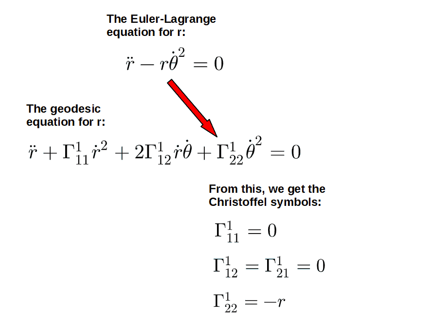 

Another way to get these Christoffel symbols (rather than just by looking at the two equations) would be to simply set both the Euler-Lagrange and the geodesic equation *equal* to one another (since they are really the same equation in disguise), move every term to one side, do some factoring and then conclude what the coefficients must be in order for the whole thing to be zero.

We can do the same thing to the equations for θ:

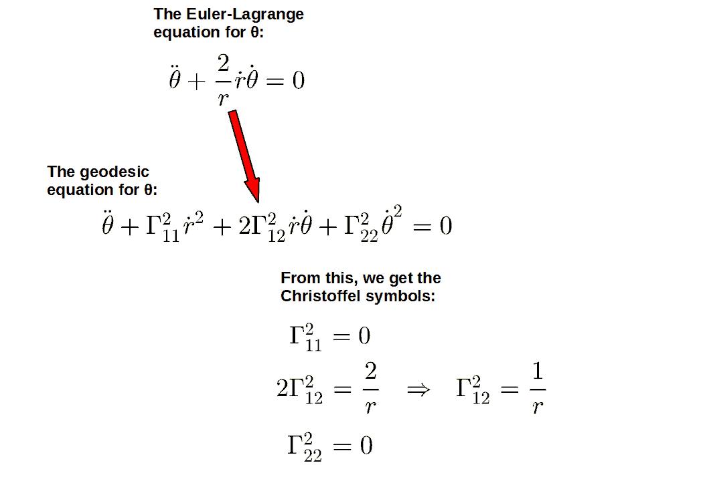

And just like that, we’ve determined all of our Christoffel symbols from just a few equations! The beauty of this is that we basically get all the Christoffel symbols for a given coordinate at one go, so we immediately know which Christoffel symbols are zero and which non-zero.

The first time you see this method, it may seem like some sort of magic, but it’s really not. This actually works because the Euler-Lagrange equation and the geodesic equation are the *same thing* in disguise (for the particular Lagrangian given earlier). I explain this more later.

**Quick tip**: there is an incredibly fast way to obtain the corresponding Lagrangian if you are given the line element of a metric, ds2.

Simply take your ds2, divide it by dτ2 (and also add a factor of 1/2) and there you have your Lagrangian. For example, in the case of polar coordinates, this would go as follows:

$$L=\frac{1}{2}\frac{ds^2}{d\tau^2}=\frac{1}{2}\frac{dr^2}{d\tau^2}+\frac{1}{2}r^2\frac{d\theta^2}{d\tau^2}=\frac{1}{2}\dot{r}^2+\frac{1}{2}r^2\dot{\theta}^2$$

If you notice the pattern here, the Lagrangian is generally going to be the same as your metric line element (up to a factor of 1/2) but with the coordinate displacements replaced by the velocities. In fact, you don’t even have to do this calculation; the Lagrangian can be read off directly from the line element.

Why Exactly Does This Method Work?

If you’ve seen the geodesic equation before and how it can be derived from a variational principle, it may not be surprising why this method works so well.

The key idea here is that a geodesic is a path, which can be thought of as minimizing (or actually extremizing) the distance between any two points in spacetime.

These kinds of problems where something should be minimized are very suggestive of the **Euler-Lagrange equation**. Indeed, the geodesic equation CAN be derived by varying a **specific Lagrangian** using the Euler-Lagrange equation.

Now, what is this Lagrangian that leads to the geodesic equation? Well, as you might guess, it’s exactly the one we used before:

$$L=\frac{1}{2}g_{\mu\nu}\dot{x}^{\mu}\dot{x}^{\nu}$$

If you plug this Lagrangian (in this general form) into the Euler-Lagrange equation, you will end up with the geodesic equation after a number of steps:

$$\frac{d}{d\tau}\frac{\partial L}{\partial\dot{x}^{\lambda}}=\frac{\partial L}{\partial x^{\lambda}}\ \ \Rightarrow\ \ \ddot{x}^{\lambda}+\Gamma_{\mu\nu}^{\lambda}\dot{x}^{\mu}\dot{x}^{\nu}=0$$

So, actually the Euler-Lagrange equation is the *exact* same equation as the geodesic equation (for the Lagrangian given above). Really we’re just looking at the same equation from two different perspectives and based on that, we deduce what the Christoffel symbols HAVE to be.

In some sense, this makes the method we used earlier almost trivial. We’re just calculating an equation and setting it equal to itself.

It sounds funny when put this way, but the beauty of this method is that it is *guaranteed* to work (and work MUCH more efficiently), since it’s so trivial in a way.

 

My **Mathematics of General Relativity** -course will teach you all the math you need for a deep understanding of general relativity. You’ll find more information [here](https://courses.profoundphysics.com/p/mathematics-of-general-relativity).

## Christoffel Symbol Examples: A Complete List For Different Metrics

In this section, we’ll cover some **examples of Christoffel symbols**. These are all the most commonly used Christoffel symbols you’ll often see in especially general relativity.

The calculation of all of these can be done using the exact steps outlined earlier, however, I haven’t included the explicit calculations here.

This section is meant to be more of a **reference resource**, where you’ll be able to pick the Christoffel symbols for a given metric from. I suggest saving the link to this page, so you can come back to it later, if you need some particular set of Christoffel symbols.

Also, if you’re looking for a similar resource on different Ricci tensors for different metrics, you can check out [this article](https://profoundphysics.com/the-ricci-tensor/).

### Christoffel Symbols In Cartesian Coordinates

The first example is especially simple; the usual Cartesian coordinate system. In this, the line element is given by simply the standard 3-dimensional Pythagorean theorem:

$$ds^2=dx^2+dy^2+dz^2$$

The metric is therefore just a bunch of 1’s or, in other words, the Kronecker delta, which can be written in matrix form as:

$$g_{ij}=\delta_{ij}=\begin{pmatrix}1&0&0\\0&1&0\\0&0&1\end{pmatrix}$$

Note; here I’m using Latin indices instead of Greek ones since we’re in 3 dimensions, not 4 spacetime dimensions.

Since the metric is constant, all Christoffel symbols are zero:

$$\Gamma_{ij}^k=0$$

### Christoffel Symbols In Polar Coordinates

In polar coordinates, all points are described by two coordinates (since polar coordinates, by definition, are a two-dimensional coordinates system), **r and θ**. A polar coordinate system still corresponds to flat space, not a curved one, it is just a different set of coordinates.

The line element in polar coordinates is given by:

$$ds^2=dr^2+r^2d\theta^2$$

The metric components, therefore, written in matrix form are:

$$g_{ij}=\begin{pmatrix}1&0\\0&r^2\end{pmatrix}$$

The Christoffel symbols can be written as two matrices, characterized by the value of the upper index:

$$\Gamma_{ij}^1=\begin{pmatrix}0&0\\0&-r\end{pmatrix}$$

$$\Gamma_{ij}^2=\begin{pmatrix}0&\frac{1}{r}\\\frac{1}{r}&0\end{pmatrix}$$

Also, note that we calculated exactly these Christoffel symbols in two different ways already in the examples of the two different Christoffel symbol calculation methods earlier.

### Christoffel Symbols In Spherical Coordinates

The spherical coordinates system is another example of a *flat space*, which is simply represented in different coordinates than the typical Cartesian system.

Spherical coordinates are the analogue of polar coordinates, but in two dimensions. All points in the spherical system are described by **three coordinates, r, θ and φ**. The line element is given by:

$$ds^2=dr^2+r^2d\theta^2+r^2\sin^2\theta d\varphi^2$$

The metric components are therefore:

$$g_{ij}=\begin{pmatrix}1&0&0\\0&r^2&0\\0&0&r^2\sin^2\theta\end{pmatrix}$$

In this case, we have three different Christoffel symbol matrices, each again characterized by the value of the upper index:

$$\Gamma_{ij}^1=\begin{pmatrix}0&0&0\\0&-r&0\\0&0&-r\sin^2\theta\end{pmatrix}$$

$$\Gamma_{ij}^2=\begin{pmatrix}0&\frac{1}{r}&0\\\frac{1}{r}&0&0\\0&0&-\sin\theta\cos\theta\end{pmatrix}$$

$$\Gamma_{ij}^3=\begin{pmatrix}0&0&\frac{1}{r}\\0&0&\cot\theta\\\frac{1}{r}&\cot\theta&0\end{pmatrix}$$

### Christoffel Symbols In Cylindrical Coordinates

The cylindrical coordinate system is equivalent to the spherical system, in the sense that both describe space in three dimensions using three coordinates. In the case of cylindrical coordinates, however, we have the coordinates r, φ and z.

The line element is given by:

$$ds^2=dr^2+r^2d\varphi^2+dz^2$$

The metric components are:

$$g_{ij}=\begin{pmatrix}1&0&0\\0&r^2&0\\0&0&1\end{pmatrix}$$

Again, as in the case of all three dimensional coordinate systems, we will have three different Christoffel symbol matrices:

$$\Gamma_{ij}^1=\begin{pmatrix}0&0&0\\0&-r&0\\0&0&0\end{pmatrix}$$

$$\Gamma_{ij}^2=\begin{pmatrix}0&\frac{1}{r}&0\\\frac{1}{r}&0&0\\0&0&0\end{pmatrix}$$

$$\Gamma_{ij}^3=\begin{pmatrix}0&0&0\\0&0&0\\0&0&0\end{pmatrix}$$

### Christoffel Symbols On a Sphere

This example will be the Christoffel symbols for a three-dimensional sphere or more accurately, a 2-sphere, which is the *2-dimensional surface* of a 3-dimensional sphere.

Since this is a sphere we’re describing and a sphere is characterized by some constant radius from the origin, the 2-sphere actually has the same metric as in spherical coordinates, but with r taken as a constant, NOT a coordinates:

$$ds^2=r^2d\theta^2+r^2\sin^2\theta d\phi^2$$

We therefore have only two metric components (since there are only two coordinates, the angles θ and φ):

$$g_{ij}=\begin{pmatrix}r^2&0\\0&r^2\sin^2\theta\end{pmatrix}$$

The Christoffel symbols are, in matrix form:

$$\Gamma_{ij}^1=\begin{pmatrix}0&0\\0&-\sin\theta\cos\theta\end{pmatrix}$$

$$\Gamma_{ij}^2=\begin{pmatrix}0&\cot\theta\\\cot\theta&0\end{pmatrix}$$

### Christoffel Symbols On a Torus

A torus is quite a peculiar geometric shape, which can be characterized by **two coordinates, u and v**, and **two constant parameters, the major radius R and the minor radius r** (for a visual picture of what these represent, you can check out [this paper](http://www.rdrop.com/~half/math/torus/torus.geodesics.pdf)). Also, note that this example will only describe the so-called ring torus.

The line element using these coordinates and parameters is given by:

$$ds^2=\left(R+r\cos v\right)^2du^2+r^2dv^2$$

The metric components are:

$$g_{ij}=\begin{pmatrix}\left(R+r\cos v\right)^2&0\\0&r^2\end{pmatrix}$$

The Christoffel symbols are:

$$\Gamma_{ij}^1=\begin{pmatrix}0&-\frac{r\sin v}{R+r\cos v}\\-\frac{r\sin v}{R+r\cos v}&0\end{pmatrix}$$

$$\Gamma_{ij}^2=\begin{pmatrix}\frac{R}{r}\sin v+\sin v\cos v&0\\0&0\end{pmatrix}$$

### Christoffel Symbols For The Schwarzschild Metric

The Schwarzschild metric is perhaps the most famous solution to the Einstein field equations of general relativity and it describes the spacetime around a static, spherically symmetric mass (for example a planet or even a black hole).

As a sidenote, if you’re interested in **applications of the Schwarzschild metric**, I discuss how this metric is applied to analyze **time dilation near a black hole** in [this article](https://profoundphysics.com/why-time-slows-down-near-a-black-hole/). The Schwarzschild metric can also be used to construct a so-called **effective potential** to analyze **orbital mechanics around black holes**, which I cover in [this article](https://profoundphysics.com/black-hole-orbits/).

The most common way to represent the Schwarzschild metric is by using the so-called **Schwarzschild coordinates** (ct, r, θ and φ). In these coordinates, the line element is given by:

$$ds^2=-\left(1-\frac{r_s}{r}\right)c^2dt^2+\left(1-\frac{r_s}{r}\right)^{-1}dr^2+r^2d\theta^2+r^2\sin^2\theta d\varphi^2$$

Here, rs is a parameter called the Schwarzschild radius and it is given by:

$$r_s=\frac{2GM}{c^2}$$

Here, G is the gravitational constant, M is the mass of the central body causing the gravitational field and c is the speed of light.

The metric components can also be written in matrix form as:

$$g_{\mu\nu}=\begin{pmatrix}-\left(1-\frac{r_s}{r}\right)&0&0&0\\0&\left(1-\frac{r_s}{r}\right)^{-1}&0&0\\0&0&r^2&0\\0&0&0&r^2\sin^2\theta\end{pmatrix}$$

The Christoffel symbols can, once again, be represented as matrices, which in this case, there are four of:

$$\Gamma_{\mu\nu}^0=\begin{pmatrix}0&\frac{1}{2}\frac{r_s}{r^2-rr_s}&0&0\\\frac{1}{2}\frac{r_s}{r^2-rr_s}&0&0&0\\0&0&0&0\\0&0&0&0\end{pmatrix}$$

$$\Gamma_{\mu\nu}^1=\begin{pmatrix}\frac{1}{2}\left(\frac{r_s}{r^2}-\frac{r_s^2}{r^3}\right)&0&0&0\\0&\frac{1}{2}\frac{r_s}{rr_s-r^2}&0&0\\0&0&r_s-r&0\\0&0&0&\left(r_s-r\right)\sin^2\theta\end{pmatrix}$$

$$\Gamma_{\mu\nu}^2=\begin{pmatrix}0&0&0&0\\0&0&\frac{1}{r}&0\\0&\frac{1}{r}&0&0\\0&0&0&-\sin\theta\cos\theta\end{pmatrix}$$

$$\Gamma_{\mu\nu}^3=\begin{pmatrix}0&0&0&0\\0&0&0&\frac{1}{r}\\0&0&0&\cot\theta\\0&\frac{1}{r}&\cot\theta&0\end{pmatrix}$$

### Christoffel Symbols For The Kerr Metric

The Kerr metric is another solution to the Einstein field equations, which describes the same type of spacetime as the Schwarzschild metric, except that the Kerr metric allows for the central mass to be rotating. So, the Kerr metric is a more general metric for describing planets and black holes, for example.

The line element for this metric can be written in **Boyer-Lindquist coordinates** (a form of spherical coordinates with the coordinates ct, r, θ and φ) as:

$$ds^2=-\left(1-\frac{r_sr}{\Sigma}\right)c^2dt^2-\frac{2r_sra\sin^2\theta}{\Sigma}cdtd\varphi+\frac{\Sigma}{\Delta}dr^2+\Sigma d\theta^2+\left(\mu+\frac{r_sra^2\sin^2\theta}{\Sigma}\right)\sin^2\theta d\varphi^2$$

A noteworthy point about this metric is the *cross-term* between the time-coordinate ct and the angular coordinate φ; this is due to the fact that a rotating mass causes a so-called *frame dragging* effect in the spacetime around it. This, on the other hand, causes an additional time dilation effect, which can be seen from this coupling term between the angular displacement, dφ and the “displacement in time, dt”. I actually discuss frame dragging and its effects on time dilation in [this article](https://profoundphysics.com/why-time-slows-down-near-a-black-hole/).

These various letters you see here are length scales (they all have units of length) defined by (with rs being the usual Schwarzschild radius 2GM/c2):

$$a=\frac{J}{Mc}\ \mu=r^2+a^2\ \Sigma=r^2+a^2\cos^2\theta\ \Delta=r^2+a^2-r_sr$$

The metric components can also be represented as:

$$g_{\mu\nu}=\begin{pmatrix}-\left(1-\frac{r_sr}{\Sigma}\right)&0&0&-\frac{r_sra\sin^2\theta}{\Sigma}\\0&\frac{\Sigma}{\Delta}&0&0\\0&0&\Sigma&0\\-\frac{r_sra\sin^2\theta}{\Sigma}&0&0&\left(\mu+\frac{r_sra^2\sin^2\theta}{\Sigma}\right)\sin^2\theta\end{pmatrix}$$

Note that the metric is not diagonal in this case, which makes calculations quite a bit more complicated.

The Christoffel symbols are all as follows (notice how complicated these are; this leads to the equations of motion in this Kerr spacetime being horrendously complicated and difficult to solve):

$$\Gamma_{\mu\nu}^0=\begin{pmatrix}0&\frac{r_s\mu\left(r^2-a^2\cos^2\theta\right)}{2\Sigma^2\Delta}&-\frac{r_sra^2\sin\theta\cos\theta}{\Sigma^2}&0\\\frac{r_s\mu\left(r^2-a^2\cos^2\theta\right)}{2\Sigma^2\Delta}&0&0&\frac{r_sa\sin^2\theta\left(\Sigma\left(a^2-r^2\right)-2\mu r^2\right)}{2\Sigma^2\Delta}\\-\frac{r_sra^2\sin\theta\cos\theta}{\Sigma^2}&0&0&\frac{r_sra^3\sin^3\theta\cos\theta}{\Sigma^2}\\0&\frac{r_sa\sin^2\theta\left(\Sigma\left(a^2-r^2\right)-2\mu r^2\right)}{2\Sigma^2\Delta}&\frac{r_sra^3\sin^3\theta\cos\theta}{\Sigma^2}&0\end{pmatrix}$$

$$\Gamma_{\mu\nu}^1=\begin{pmatrix}\frac{r_s\Delta\left(r^2-a^2\cos^2\theta\right)}{2\Sigma^3}&0&0&-\frac{\Delta r_sa\sin^2\theta\left(r^2-a^2\cos^2\theta\right)}{2\Sigma^3}\\0&\frac{2ra^2\sin^2\theta-r_s\left(r^2-a^2\cos^2\theta\right)}{2\Sigma\Delta}&-\frac{a^2\sin\theta\cos\theta}{\Sigma}&0\\0&-\frac{a^2\sin\theta\cos\theta}{\Sigma}&-\frac{r\Delta}{\Sigma}&0\\-\frac{\Delta r_sa\sin^2\theta\left(r^2-a^2\cos^2\theta\right)}{2\Sigma^3}&0&0&\frac{\Delta\sin^2\theta\left(r_sa^2\sin^2\theta\left(r^2-a^2\cos^2\theta\right)-2r\Sigma^2\right)}{2\Sigma^3}\end{pmatrix}$$

$$\Gamma_{\mu\nu}^2=\begin{pmatrix}-\frac{r_sra^2\sin\theta\cos\theta}{\Sigma^3}&0&0&\frac{\mu r_sra\sin\theta\cos\theta}{\Sigma^3}\\0&\frac{a^2\sin\theta\cos\theta}{\Sigma\Delta}&\frac{r}{\Sigma}&0\\0&\frac{r}{\Sigma}&-\frac{a^2\sin\theta\cos\theta}{\Sigma}&0\\\frac{\mu r_sra\sin\theta\cos\theta}{\Sigma^3}&0&0&-\frac{\mu r_sr\sin\theta\cos\theta}{\Sigma^3}\left(\frac{\Sigma^2}{r_sr}+\left(1+\frac{\Sigma}{\mu}\right)a^2\sin^2\theta\right)\end{pmatrix}$$

$$\Gamma_{\mu\nu}^3=\begin{pmatrix}0&\frac{r_sa\left(r^2-a^2\cos^2\theta\right)}{2\Sigma^2\Delta}&-\frac{r_sra\cot\theta}{\Sigma^2}&0\\\frac{r_sa\left(r^2-a^2\cos^2\theta\right)}{2\Sigma^2\Delta}&0&0&\frac{r_sa^4\sin^2\theta\cos^2\theta-r_sr^2\left(\mu+\Sigma-\frac{2\Sigma^2}{r_s}\right)}{2\Sigma^2\Delta}\\-\frac{r_sra\cot\theta}{\Sigma^2}&0&0&\frac{\cot\theta\left(\Sigma^2+r_sra^2\sin^2\theta\right)}{\Sigma^2}\\0&\frac{r_sa^4\sin^2\theta\cos^2\theta-r_sr^2\left(\mu+\Sigma-\frac{2\Sigma^2}{r_s}\right)}{2\Sigma^2\Delta}&\frac{\cot\theta\left(\Sigma^2+r_sra^2\sin^2\theta\right)}{\Sigma^2}&0\end{pmatrix}$$

### Christoffel Symbols For The Reissner-Nordström Metric

The Reissner-Nordström metric is another solution to the Einstein field equations, belonging to the same “class” of metrics as the Schwarzschild and Kerr metrics (by “class”, I mean the different black hole type solutions of general relativity).

This metric describes a spherically symmetric and electrically charged (but non-rotating) mass. The line element can be written as (using the coordinates ct, r, θ and φ):

$$ds^2=-\left(1-\frac{r_s}{r}+\frac{r_Q^2}{r^2}\right)c^2dt^2+\left(1-\frac{r_s}{r}+\frac{r_Q^2}{r^2}\right)^{-1}dr^2+r^2d\theta^2+r^2\sin^2\theta d\varphi^2$$

Here, rs is again the Schwarzschild radius and $r_Q^2$ is a parameter describing the charge of this mass:

$$r_Q^2=\frac{Q^2G}{4\pi\varepsilon_0c^4}$$

Here, Q is the charge of this mass, G is the gravitational constant, c is the speed of light and ε0 is the vacuum permittivity (another constant).

The metric components are:

$$g_{\mu\nu}=\begin{pmatrix}-\left(1-\frac{r_s}{r}+\frac{r_Q^2}{r^2}\right)&0&0&0\\0&\left(1-\frac{r_s}{r}+\frac{r_Q^2}{r^2}\right)^{-1}&0&0\\0&0&r^2&0\\0&0&0&r^2\sin^2\theta\end{pmatrix}$$

And the Christoffel symbols are:

$$\Gamma_{\mu\nu}^0=\begin{pmatrix}0&\frac{1}{2}\frac{r_sr-2r_Q^2}{r^3-r_sr^2+r_Q^2r}&0&0\\\frac{1}{2}\frac{r_sr-2r_Q^2}{r^3-r_sr^2+r_Q^2r}&0&0&0\\0&0&0&0\\0&0&0&0\end{pmatrix}$$

$$\Gamma_{\mu\nu}^1=\begin{pmatrix}\frac{1}{2}\frac{\left(r^2-r_sr+r_Q^2\right)\left(r_sr-2r_Q^2\right)}{r^5}&0&0&0\\0&-\frac{1}{2}\frac{r_sr-2r_Q^2}{r^3-r_sr^2+r_Q^2r}&0&0\\0&0&-r\left(1-\frac{r_s}{r}+\frac{r_Q^2}{r^2}\right)&0\\0&0&0&-r\sin^2\theta\left(1-\frac{r_s}{r}+\frac{r_Q^2}{r^2}\right)\end{pmatrix}$$

$$\Gamma_{\mu\nu}^2=\begin{pmatrix}0&0&0&0\\0&0&\frac{1}{r}&0\\0&\frac{1}{r}&0&0\\0&0&0&-\sin\theta\cos\theta\end{pmatrix}$$

$$\Gamma_{\mu\nu}^3=\begin{pmatrix}0&0&0&0\\0&0&0&\frac{1}{r}\\0&0&0&\cot\theta\\0&\frac{1}{r}&\cot\theta&0\end{pmatrix}$$

### Christoffel Symbols For The Weak-Field Metric

The weak-field metric is a solution of general relativity in the limit that gravity is not “too strong” (more formally, that the metric only deviates slightly from the flat spacetime Minkowski metric; by slightly, I mean that the deviations only count to *linear order*).

Another important aspect of this limit is that we also assume that velocities are relatively small (this means that the ratio v/c can be approximated as zero and dt/dτ≈1).

Anyway, the line element can be written (here I’m writing it in spherical coordinates, although you may often see it written in the usual Cartesian coordinates):

$$ds^2=-\left(1+\frac{2\Phi}{c^2}\right)c^2dt^2+\left(1-\frac{2\Phi}{c^2}\right)dr^2+\left(1-\frac{2\Phi}{c^2}\right)r^2d\theta^2+\left(1-\frac{2\Phi}{c^2}\right)r^2\sin^2\theta d\varphi^2$$

Here, Φ is the usual Newtonian gravitational potential given by $\Phi=-\frac{GM}{r}$.

The metric can also be written in the matrix form:

$$g_{\mu\nu}=\begin{pmatrix}-\left(1+\frac{2\Phi}{c^2}\right)&0&0&0\\0&1-\frac{2\Phi}{c^2}&0&0\\0&0&\left(1-\frac{2\Phi}{c^2}\right)r^2&0\\0&0&0&\left(1-\frac{2\Phi}{c^2}\right)r^2\sin^2\theta\end{pmatrix}$$

The Christoffel symbols are then given by:

$$\Gamma_{\mu\nu}^0=\begin{pmatrix}0&\frac{1}{c^2}\frac{\partial\Phi}{\partial r}&0&0\\\frac{1}{c^2}\frac{\partial\Phi}{\partial r}&0&0&0\\0&0&0&0\\0&0&0&0\end{pmatrix}$$

$$\Gamma_{\mu\nu}^1=\begin{pmatrix}\frac{1}{c^2}\frac{\partial\Phi}{\partial r}&0&0&0\\0&-\frac{1}{c^2}\frac{\partial\Phi}{\partial r}&0&0\\0&0&\left(\frac{r}{c^2}\frac{\partial\Phi}{\partial r}-1\right)r&0\\0&0&0&\left(\frac{1}{c^2}\frac{\partial\Phi}{\partial r}r-1\right)r\sin^2\theta\end{pmatrix}$$

$$\Gamma_{\mu\nu}^2=\begin{pmatrix}0&0&0&0\\0&0&\left(1-\frac{r}{c^2}\frac{\partial\Phi}{\partial r}\right)\frac{1}{r}&0\\0&\left(1-\frac{r}{c^2}\frac{\partial\Phi}{\partial r}\right)\frac{1}{r}&0&0\\0&0&0&-\sin\theta\cos\theta\end{pmatrix}$$

$$\Gamma_{\mu\nu}^3=\begin{pmatrix}0&0&0&0\\0&0&0&\left(1-\frac{r}{c^2}\frac{\partial\Phi}{\partial r}\right)\frac{1}{r}\\0&0&0&\cot\theta\\0&\left(1-\frac{r}{c^2}\frac{\partial\Phi}{\partial r}\right)\frac{1}{r}&\cot\theta&0\end{pmatrix}$$

An important approximation when calculating these is that 2Φ**≪**c2 (this is simply the assumption of a “weak” gravitational field). Using this approximation, all terms of the form 1/(2Φ±c2)≈1/c2.

Interestingly, these ∂Φ/∂r- factors you see here are related to the **Newtonian inverse-square gravitational force**:

$$\frac{\partial\Phi}{\partial r}=\frac{\partial}{\partial r}\left(-\frac{GM}{r}\right)=\frac{GM}{r^2}$$

This also gives you some insight into why the Christoffel symbols are closely related to gravitational forces in general relativity.

### Christoffel Symbols For The Robertson-Walker (FRW) Metric

The Robertson-Walker metric (usually just called the FRW metric) describes what is called a maximally symmetric spacetime (one that is both homogeneous and isotropic).

This metric can, for example, describe our universe on a large scale and it, in fact, predicts the expansion of the universe.

I discuss the FRW metric, its associated Friedmann equations and their predictions more in [this article](https://profoundphysics.com/the-friedmann-equations-explained-a-complete-guide/), in case you’re interested.

The line element for the FRW metric is (in spherical coordinates):

$$ds^2=-c^2dt^2+\frac{a^2\left(t\right)}{1-kr^2}dr^2+a^2\left(t\right)r^2d\theta^2+a^2\left(t\right)r^2\sin^2\theta d\phi^2$$

Here, k is a curvature parameter that can take on the values -1, 0 or 1, depending on the geometry of the spacetime (to describe a flat universe, k=0, for example). The a(t)-parameter is called the scale factor and it is a function of time that holds information about the expansion of the universe (or whatever space this metric happens to be describing).

This metric has the matrix form:

$$g_{\mu\nu}=\begin{pmatrix}-1&0&0&0\\0&\frac{a^2}{1-kr^2}&0&0\\0&0&a^2r^2&0\\0&0&0&a^2r^2\sin^2\theta\end{pmatrix}$$

The Christoffel symbols are:

$$\Gamma_{\mu\nu}^0=\begin{pmatrix}0&0&0&0\\0&\frac{a\dot{a}}{c\left(1-kr^2\right)}&0&0\\0&0&\frac{1}{c}a\dot{a}r^2&0\\0&0&0&\frac{1}{c}a\dot{a}r^2\sin^2\theta\end{pmatrix}$$

Here, $\dot{a}$ denotes da/dt (a being a function of time) and c is the speed of light.

$$\Gamma_{\mu\nu}^1=\begin{pmatrix}0&\frac{\dot{a}}{ca}&0&0\\\frac{\dot{a}}{ca}&\frac{kr}{1-kr^2}&0&0\\0&0&-r\left(1-kr^2\right)&0\\0&0&0&-r\sin^2\theta\left(1-kr^2\right)\end{pmatrix}$$

$$\Gamma_{\mu\nu}^2=\begin{pmatrix}0&0&\frac{\dot{a}}{ca}&0\\0&0&\frac{1}{r}&0\\\frac{\dot{a}}{ca}&\frac{1}{r}&0&0\\0&0&0&-\sin\theta\cos\theta\end{pmatrix}$$

$$\Gamma_{\mu\nu}^3=\begin{pmatrix}0&0&0&\frac{\dot{a}}{ca}\\0&0&0&\frac{1}{r}\\0&0&0&\cot\theta\\\frac{\dot{a}}{ca}&\frac{1}{r}&\cot\theta&0\end{pmatrix}$$

**Quick tip**: If building a stronger mathematical foundation for general relativity is of interest to you, I think you would find my **[Mathematics of General Relativity: A Complete Course](https://courses.profoundphysics.com/p/mathematics-of-general-relativity)** (link to the course page) extremely useful.  
  
This course aims to give you all the **mathematical tools** you need to understand general relativity – and any of its applications. Inside the course, you’ll learn topics like tensor calculus in an **intuitive**, **beginner-friendly** and **highly practical** way that can be directly applied to understand general relativity.

---

*← [Back to the full archive](../index.html)*
