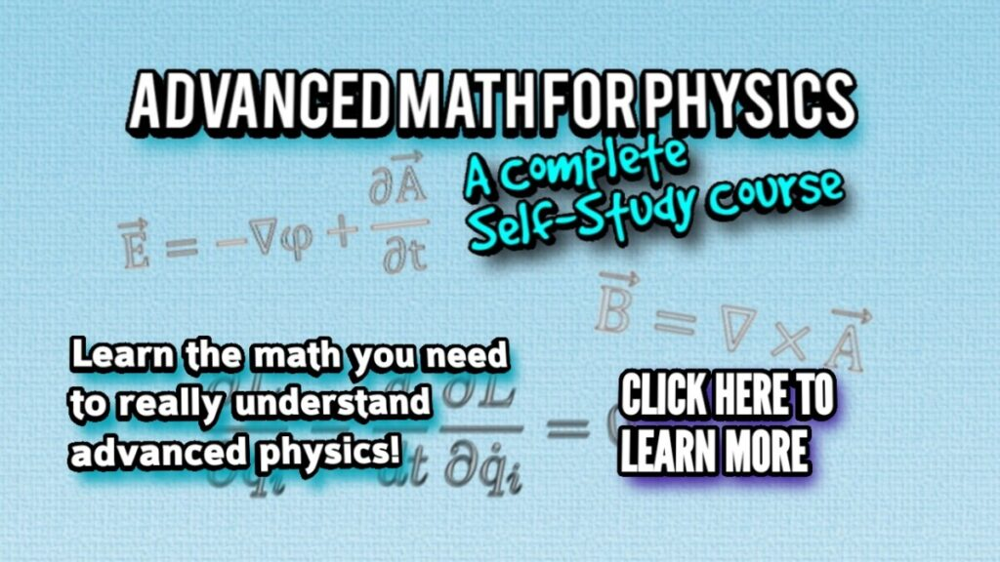
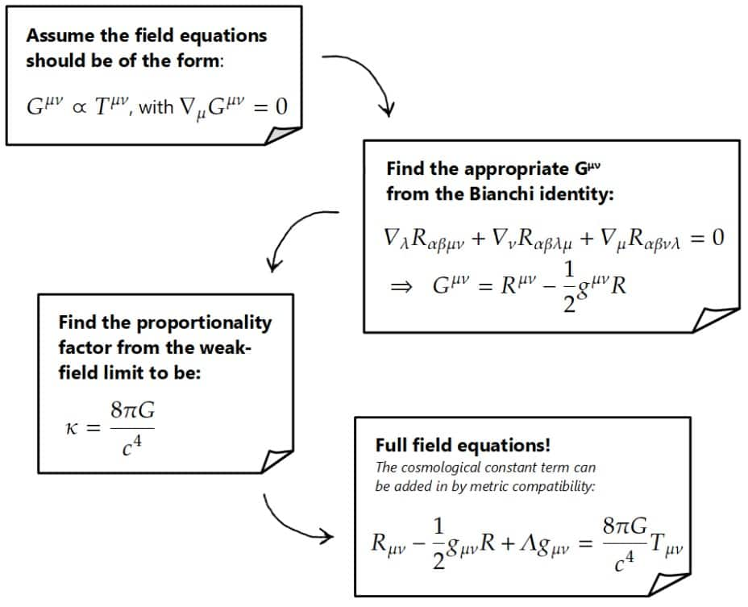
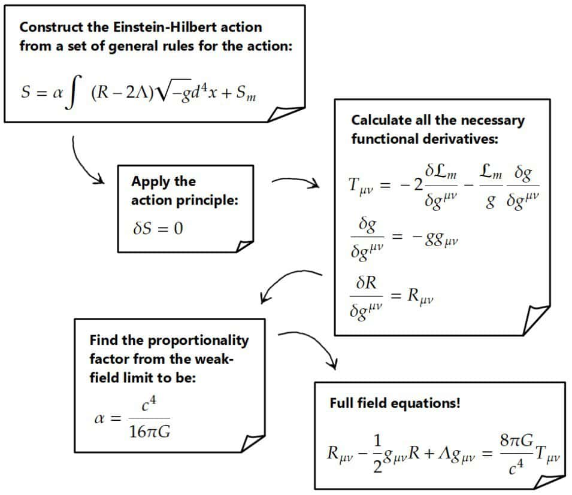

# Einstein Field Equations: A Step-By-Step Derivation (Two Methods)

> How the Einstein–Hilbert action leads to the field equations — variation, step by step.

*Originally published at [profoundphysics.com](https://profoundphysics.com/derivation-of-einstein-field-equations/).*

---

In this article, we’ll derive the Einstein field equations with all calculations done in a step-by-step manner.

**The Einstein field equations can be derived from the Bianchi identity by postulating that curvature and matter should be related. However, a more modern approach for deriving the field equations is from the Einstein-Hilbert action by using the principle of least action**.

We’ll look at both of these ways for deriving the Einstein field equations and every step will be explained along the way as we do each calculation.

Before we get started, I’d highly recommend you read my [introductory article on general relativity](https://profoundphysics.com/general-relativity-for-dummies/) as this article will explain all the important physics and math behind general relativity.

In case you’re interested, you can also get this article in **downloadable PDF form** [here](https://profoundphysics.gumroad.com/l/einstein-field-equations).

Table of Contents

Toggle

## Derivation From The Bianchi Identity

The first way we’re going to derive the Einstein field equations is by postulating that there is a **relation between curvature and matter** (the energy-momentum tensor).

This derivation, in a sense, is not as elegant as the second one we will see as this one is mostly just a guess.

Also, this derivation relies on an important identity in tensor calculus known as the **differential Bianchi identity**.

The fundamental assumptions this derivation of the Einstein field equations relies on are more or less the following:

- **The field equations should be tensor equations**. This is because all laws of physics should be coordinate-independent and the only way to achieve this is to construct them out of tensor quantities.
- **The field equations should relate curvature to matter**. The motivation for this comes from the relation between curvature and tidal forces and the equivalence principle, which you can read more about [here](https://profoundphysics.com/general-relativity-for-dummies/).
- **In an appropriate limit, the field equations should reduce to those of Newtonian gravity** (Poisson’s equation), which we know to be valid for “weak” gravitational fields.
- **The field equations should obey the (local) conservation of energy and momentum**.

Based on these assumptions, some mathematical identities and making a few educated guesses, we can derive the Einstein field equations. Let’s begin!

### Step 1: Assume a Relation Between Curvature and Matter

This method of deriving the Einstein field equations is mostly about finding a generalization to **Poisson’s equation**, which is a **field equation for Newtonian gravity**. It relates the Newtonian gravitational potential (Φ) to a mass/energy density (ρ):

$$\nabla^2\Phi=4\pi G\rho$$

This ∇2-operator here is the **Laplacian**, one of the most important things you will learn about in vector calculus. If you’re interested in this, you may want to check out my [Advanced Math For Physics: A Complete Self-Study Course](https://courses.profoundphysics.com/p/advanced-math-for-physics-a-complete-self-study-course).

Anyway, if we want to generalize Poisson’s equation, we should first note that the right-hand side of whatever our field equation is has to involve the **energy-momentum tensor** (Tµν) because this is how we describe all energy and matter, generally speaking.

The left-hand side, on the other hand, should be something that involves the **curvature of spacetime** (which, of course, also describes gravity) – this is the assumption we make in this derivation.

This comes from the equivalence principle and for more motivation for this statement, I highly recommend reading my [introduction to general relativity](https://profoundphysics.com/general-relativity-for-dummies/).

Moreover, since the right-hand side involves a two-index tensor (the energy-momentum tensor Tµν), the left-hand side should therefore involve some kind of **two-index curvature tensor**. This has to be a two-index tensor that is constructed out of the **Riemann tensor** and its contractions in some way, as the Riemann tensor is what describes curvature.

The first guess you may have is the **Ricci tensor** as this is a two-index tensor built out of the Riemann tensor (Rαµλν) as follows:

$$R_{\mu\nu}=R_{\mu\lambda\nu}^{\lambda}=g^{\lambda\alpha}R_{\alpha\mu\lambda\nu}$$

You could therefore guess that the field equations would have the following form:

$$R^{\mu\nu}\propto T^{\mu\nu}$$

Note that I’ve expressed this as an equation with upstairs indices. It really doesn’t matter, however, whether you want to express this with upstairs or downstairs indices.

The problem with this is that it doesn’t respect our assumption of the **local energy-momentum conservation**. In general relativity, this conservation law is equivalent to the statement that the (covariant) **divergence of the energy-momentum tensor is zero**:

$$\nabla_{\mu}T^{\mu\nu}=0$$

Clearly the left-hand side of our field equation then cannot be just the Ricci tensor, because the divergence of the Ricci tensor is generally not zero.

The left-hand side should therefore involve a two-index curvature tensor that is also **divergence-free**. This turns out to be the Einstein tensor, which we’ll derive soon.

So, let’s then postulate that the field equations should have the form of a **two-index, divergence-free curvature tensor** (which we will call Gµν) being **proportional to the energy-momentum tensor**:

$$G^{\mu\nu}\propto T^{\mu\nu}\ {,}\ \ \nabla_{\mu}G^{\mu\nu}=0$$

Now, you could ask why we assume “direct” proportionality here instead of something more complicated like:

$$G^{\mu\nu}\propto T^{\mu\lambda}T_{\lambda}^{\nu}\ ?$$

Well, in principle, I suppose you could assume this form, but the real reason why we assume “direct” proportionality between this Gµν-tensor and the energy-momentum tensor is because it’s the **simplest possible field equation** we could have.

We typically always want to express laws of physics in the simplest possible form we can. So, we’ll just go with this assumption (Gµν∝Tµν) and see what we get with it.

### Step 2: Find a Divergence-Free Curvature Tensor From The Bianchi Identity

Our next step is to actually find the divergence-free, two-index curvature tensor for our field equations. The way to do this is by applying an important result in tensor calculus called the **differential Bianchi identity**.

The differential Bianchi identity is essentially an equation involving a bunch of **covariant derivatives** of various index combinations of the (four-index) **Riemann tensor**:

$$\nabla_{\lambda}R_{\alpha\beta\mu\nu}+\nabla_{\nu}R_{\alpha\beta\lambda\mu}+\nabla_{\mu}R_{\alpha\beta\nu\lambda}=0$$

After manipulating this equation, we end up with the following expression (the full derivation of this is found below):

$$\nabla_{\mu}\left(R^{\mu\nu}-\frac{1}{2}g^{\mu\nu}R\right)=0$$

Full Derivation of This Equation

First things first, we’re going to swap the indices λ and µ on the second term in the Bianchi identity equation exchange for a minus sign (since by the symmetries of the Riemann tensor, Rαβλµ=-Rαβµλ). We will also multiply everything by the metric gαµ to get:

$$\nabla_{\lambda}R_{\alpha\beta\mu\nu}+\nabla_{\nu}R_{\alpha\beta\lambda\mu}+\nabla_{\mu}R_{\alpha\beta\nu\lambda}=0$$

$$\Rightarrow\ \ g^{\alpha\mu}\nabla_{\lambda}R_{\alpha\beta\mu\nu}-g^{\alpha\mu}\nabla_{\nu}R_{\alpha\beta\mu\lambda}+g^{\alpha\mu}\nabla_{\mu}R_{\alpha\beta\nu\lambda}=0$$

Now, in general relativity, the metric has a property known as metric compatibility. Metric compatibility can kind of be thought of as a mathematical statement that the laws of special relativity should apply *locally.* I discuss this in detail [in this article](https://profoundphysics.com/general-relativity-for-dummies/) on the equivalence principle -section.

Anyway, the mathematical statement of metric compatibility is simply that the covariant derivative of the metric tensor is always zero (∇λgαµ=0). We can therefore bring the metric inside of the covariant derivatives (since the metric is basically a constant with respect to the covariant derivative):

$$\nabla_{\lambda}g^{\alpha\mu}R_{\alpha\beta\mu\nu}-\nabla_{\nu}g^{\alpha\mu}R_{\alpha\beta\mu\lambda}+\nabla_{\mu}g^{\alpha\mu}R_{\alpha\beta\nu\lambda}=0$$

These metrics here have the effect of raising the α-indices on each term and changing them to a µ. On the first two terms, this is done to the Riemann tensors and on the third term, the metric simply raises the µ-index of the covariant derivative and changes it to an α:

$$\nabla_{\lambda}g^{\alpha\mu}R_{\alpha\beta\mu\nu}-\nabla_{\nu}g^{\alpha\mu}R_{\alpha\beta\mu\lambda}+\nabla_{\mu}g^{\alpha\mu}R_{\alpha\beta\nu\lambda}=0$$

$$\Rightarrow\ \ \nabla_{\lambda}R_{\beta\mu\nu}^{\mu}-\nabla_{\nu}R_{\beta\mu\lambda}^{\mu}+\nabla^{\alpha}R_{\alpha\beta\nu\lambda}=0$$

Here, Rµβµν (i.e. contraction of the Riemann tensor’s first and third indices) is just the definition of the Ricci tensor Rβν (if you’re not familiar with this, you can read more about it [here](https://profoundphysics.com/the-ricci-tensor/)), so we have:

$$\nabla_{\lambda}R_{\beta\nu}-\nabla_{\nu}R_{\beta\lambda}+\nabla^{\alpha}R_{\alpha\beta\nu\lambda}=0$$

Now let’s multiply everything again by the metric gβν and move it inside the covariant derivatives by metric compatibility (again, this metric has the effect of raising the β-index and changing it to a ν-index on each term):

$$\nabla_{\lambda}g^{\beta\nu}R_{\beta\nu}-\nabla_{\nu}g^{\beta\nu}R_{\beta\lambda}+\nabla^{\alpha}g^{\beta\nu}R_{\alpha\beta\nu\lambda}=0$$

$$\Rightarrow\ \ \nabla_{\lambda}R_{\nu}^{\nu}-\nabla_{\nu}R_{\lambda}^{\nu}+\nabla^{\alpha}g^{\beta\nu}R_{\alpha\beta\nu\lambda}=0$$

Note that I haven’t raised the indices on the last term yet. This is because I want to first interchange the α and β -indices on the Riemann tensor, which gives a minus sign (since Rαβνλ=-Rβανλ). Moreover, the first term (contraction of the Ricci tensor) is just the definition of the Ricci scalar (Rνν=R). So, we then have:

$$\nabla_{\lambda}R_{\nu}^{\nu}-\nabla_{\nu}R_{\lambda}^{\nu}+\nabla^{\alpha}g^{\beta\nu}R_{\alpha\beta\nu\lambda}=0$$

$$\Rightarrow\ \ \nabla_{\lambda}R-\nabla_{\nu}R_{\lambda}^{\nu}-\nabla^{\alpha}g^{\beta\nu}R_{\beta\alpha\nu\lambda}=0$$

Now we can raise the indices on the last term (raise the β-index to become a ν), which gives us another Ricci tensor here:

$$\nabla_{\lambda}R-\nabla_{\nu}R_{\lambda}^{\nu}-\nabla^{\alpha}R_{\alpha\nu\lambda}^{\nu}=0$$

$$\nabla_{\lambda}R-\nabla_{\nu}R_{\lambda}^{\nu}-\nabla^{\alpha}R_{\alpha\lambda}=0$$

We can express this covariant derivative with an upper index as:

$$\nabla^{\alpha}=g^{\alpha\rho}\nabla_{\rho}$$

Inserting this (and again moving the metric inside the covariant derivative), we have:

$$\nabla_{\lambda}R-\nabla_{\nu}R_{\lambda}^{\nu}-\nabla^{\alpha}R_{\alpha\lambda}=0$$

$$\Rightarrow\ \ \nabla_{\lambda}R-\nabla_{\nu}R_{\lambda}^{\nu}-g^{\alpha\rho}\nabla_{\rho}R_{\alpha\lambda}=0$$

$$\Rightarrow\ \ \nabla_{\lambda}R-\nabla_{\nu}R_{\lambda}^{\nu}-\nabla_{\rho}g^{\alpha\rho}R_{\alpha\lambda}=0$$

This metric here just raises the α-index to a ρ on the Ricci tensor, giving us:

$$\nabla_{\lambda}R-\nabla_{\nu}R_{\lambda}^{\nu}-\nabla_{\rho}R_{\lambda}^{\rho}=0$$

Now, since this ρ here is just a dummy/summation index, we can freely relabel it to a ν, such that the second and third terms combine:

$$\nabla_{\lambda}R-\nabla_{\nu}R_{\lambda}^{\nu}-\nabla_{\nu}R_{\lambda}^{\nu}=0\ \ \Rightarrow\ \ \nabla_{\lambda}R-2\nabla_{\nu}R_{\lambda}^{\nu}=0$$

We’re almost there. Let’s now again multiply everything by the metric gµλ and bring it inside the covariant derivatives:

$$\nabla_{\lambda}g^{\mu\lambda}R-2\nabla_{\nu}g^{\mu\lambda}R_{\lambda}^{\nu}=0$$

On the second term, the metric raises the λ-index and turns it into a µ, so we have:

$$\nabla_{\lambda}g^{\mu\lambda}R-2\nabla_{\nu}R^{\mu\nu}=0$$

We’re free to relabel the dummy index λ on the first term to a ν, so that we get:

$$\nabla_{\nu}g^{\mu\nu}R-2\nabla_{\nu}R^{\mu\nu}=0\ \ \Rightarrow\ \ \nabla_{\nu}\left(R^{\mu\nu}-\frac{1}{2}g^{\mu\nu}R\right)=0$$

To get to the final form, I’ve multiplied everything by -1/2 and factored out the same covariant derivative from both terms.

Inside the parentheses of the above expression, we have exactly a **two-index divergence-free curvature tensor** thing (this is called the Einstein tensor):

$$\nabla_{\mu}G^{\mu\nu}=0\ {,}\ \ G^{\mu\nu}=R^{\mu\nu}-\frac{1}{2}g^{\mu\nu}R$$

This is exactly the object we were looking for! We can then conclude that based on our postulates, the Einstein field equations should have the form:

$$R^{\mu\nu}-\frac{1}{2}g^{\mu\nu}R\propto T^{\mu\nu}$$

 

My **Mathematics of General Relativity** -course will teach you all the math you need for a deep understanding of general relativity. You’ll find more information [here](https://courses.profoundphysics.com/p/mathematics-of-general-relativity).

### Step 3: Take The Newtonian Limit of The Field Equations

The next step is going to be to find the *exact* relation, meaning that we have to find the **proportionality factor** between the left- and right-hand sides we currently have. We’ll call this constant κ:

$$R^{\mu\nu}-\frac{1}{2}g^{\mu\nu}R=\kappa T^{\mu\nu}$$

Now, since I like the lower-index form of the field equations better, I’ll write this as:

$$R_{\mu\nu}-\frac{1}{2}g_{\mu\nu}R=\kappa T_{\mu\nu}$$

Note that this is a completely equivalent form of writing the Einstein field equation to the one with upstairs indices and there really isn’t any content in doing this.

Now, the way to find what this constant κ should be is by considering **the weak-field (Newtonian) limit** of this equation and demand that it matches **Poisson’s equation for gravity** that we know to be correct for Newtonian gravity:

$$\nabla^2\Phi=4\pi G\rho$$

So, let’s begin constructing the weak-field limit of our field equations.

In **Newtonian gravity**, the only source of gravity is mass or **energy density**, which corresponds to the T00-component of the energy-momentum tensor (in particular, T00=ρc2). We’ll therefore assume an energy-momentum tensor of the form:

$$T_{\mu\nu}=\begin{pmatrix}\rho c^2&0&0&0\\0&0&0&0\\0&0&0&0\\0&0&0&0\end{pmatrix}$$

The nice thing is that for just finding the constant κ, we only need one equation. Therefore, it’s enough for us to just look at the 00-equation of these weak-field equations:

$$R_{00}-\frac{1}{2}g_{00}R=\kappa T_{00}$$

For this, however, we still need to find the **Ricci tensor** and **Ricci scalar in this Newtonian limit**. The metric in this limit (in Cartesian coordinates) is given by:

$$g_{\mu\nu}=\begin{pmatrix}-\left(1+\frac{2\Phi}{c^2}\right)&0&0&0\\0&1-\frac{2\Phi}{c^2}&0&0\\0&0&1-\frac{2\Phi}{c^2}&0\\0&0&0&1-\frac{2\Phi}{c^2}\end{pmatrix}$$

From this metric, we can find the 00-component of the Ricci tensor as well as the Ricci scalar, which turn out to be (full derivation of these can be found below):

$$R_{00}=\frac{1}{c^2}\nabla^2\Phi$$

$$R=\frac{2}{c^2}\nabla^2\Phi$$

Derivation of The Ricci Tensor and Scalar In The Newtonian Limit

Since the only non-zero component of the energy-momentum tensor is T00, for the “spacial” part of the field equations (i.e. for indices i,j=1,2,3), we have the right-hand side being zero.

From this, we can find a nice expression for the spacial components of the Ricci tensor in this Newtonian limit:

$$R_{ij}-\frac{1}{2}g_{ij}R=0\ \ \Rightarrow\ \ R_{ij}=\frac{1}{2}g_{ij}R$$

In other words, if we can find the Ricci scalar, we can also specify these i,j-components of the Ricci tensor since we know the metric already.

By definition, the Ricci scalar is given by the “contraction” of the Ricci tensor. We can split this sum into the 00-part and the i,j-part (since the metric is diagonal, the 0,i-part is zero):

$$R=g^{\mu\nu}R_{\mu\nu}=g^{00}R_{00}+g^{ij}R_{ij}$$

We can now insert the expression for Rij we just found into this:

$$R=g^{00}R_{00}+\frac{1}{2}g^{ij}g_{ij}R$$

For a diagonal metric, a sum of terms of the form gijgij actually just gives you the dimensions of the space (not spacetime) you’re working in, which for us is 3. This is because this sum has three terms when written out and each term has the form of a metric component multiplied by its inverse (which is just 1).

So, we then have:

$$R=g^{00}R_{00}+\frac{3}{2}R$$

We can now solve this for R by subtracting 3R/2 from both sides to get:

$$R=g^{00}R_{00}+\frac{3}{2}R\ \ \Rightarrow\ \ R=-2g^{00}R_{00}$$

At this point, we now have an expression for the Ricci scalar in terms of the 00-component of the Ricci tensor. So, if we can now find R00, we can also find the Ricci scalar and the 00-part of the field equation and thus, find the proportionality constant κ.

Okay, to do this, let’s look at the definition of the Ricci tensor in terms of Christoffel symbols (for full details on where this comes from, you can check out [this article](https://profoundphysics.com/the-ricci-tensor/)):

$$R_{\mu\nu}=\partial_{\alpha}\Gamma_{\mu\nu}^{\alpha}-\partial_{\nu}\Gamma_{\mu\alpha}^{\alpha}+\Gamma_{\mu\nu}^{\alpha}\Gamma_{\alpha\beta}^{\beta}-\Gamma_{\mu\beta}^{\alpha}\Gamma_{\nu\alpha}^{\beta}$$

Here comes an important property of the Newtonian limit that we’re working in; we assume a “weak” gravitational field, which means that the terms in our metric have 2Φ**≪**c2. This also means that terms that have something like Φ2/c4 or anything with (∂Φ)2/c4 are tiny and can be neglected (this turns out to be a very important property).

Therefore, these “squares” of the Christoffel symbols (the last two terms) we have in the Ricci tensor can actually be neglected. This is because they basically have the form:

$$\Gamma^2\sim g^2\left(\partial g\right)^2\sim g^2\frac{\left(\partial\Phi\right)^2}{c^4}$$

Here, the derivatives of the metric (∂g) are basically just the derivatives of the gravitational potential (∂Φ). If you wish to, you can write out the Christoffel symbols in full detail and see that indeed these products of Christoffel symbols indeed can be neglected with this “weak-field assumption”.

So, our Ricci tensor then reduces to:

$$R_{\mu\nu}\approx\partial_{\alpha}\Gamma_{\mu\nu}^{\alpha}-\partial_{\nu}\Gamma_{\mu\alpha}^{\alpha}$$

The 00-component of this is going to be (note that since the metric only depends on space and not time, we have all terms of the form ∂0g=0 and therefore also ∂0Γ=0):

$$R_{00}=\partial_{\alpha}\Gamma_{00}^{\alpha}-\partial_0\Gamma_{0\alpha}^{\alpha}=\partial_{\alpha}\Gamma_{00}^{\alpha}=\partial_i\Gamma_{00}^i$$

Here, the index i refers to the spacial components only (i=1,2,3), since the α=0-term in this sum is zero (because ∂0Γ000=0).

This Christoffel symbol, Γi00, written in terms of the metric is (for more on this definition and where it comes from, you can check out [this article](https://profoundphysics.com/christoffel-symbols-a-complete-guide-with-examples/)), again, by using the fact that all time derivatives of the metric are zero (∂0g=0):

$$\Gamma_{00}^i=\frac{1}{2}g^{i\alpha}\left(\partial_0g_{\alpha0}+\partial_0g_{\alpha0}-\partial_{\alpha}g_{00}\right)=-\frac{1}{2}g^{i\alpha}\partial_{\alpha}g_{00}$$

Now, the α=0-term in this sum is zero (since ∂0g00=0), so the non-zero terms are the spacial part of this sum (α=j, where j=1,2,3). Let’s also insert the metric component g00=-(1+2Φ/c2) into this to get:

$$\Gamma_{00}^i=-\frac{1}{2}g^{ij}\partial_jg_{00}=\frac{1}{2}g^{ij}\partial_j\left(1+\frac{2\Phi}{c^2}\right)=\frac{1}{c^2}g^{ij}\partial_j\Phi$$

Now, these spacial components of the inverse metric (gij) can be expressed in terms of the spacial components of the Minkowski metric (ηij) with a diagonal of (1,1,1), since all the spacial components of the “ordinary” metric (gij) are the same 1-2Φ/c2:

$$g^{ij}=\frac{1}{1-\frac{2\Phi}{c^2}}\eta^{ij}\approx\left(1+\frac{2\Phi}{c^2}\right)\eta^{ij}$$

Here I’ve used the approximation that for any small x, (1-x)-1≈1+x, which works here because by assumption, 2Φ**≪**c2.

Inserting this into the Christoffel symbol Γi00, we get:

$$\Gamma_{00}^i=\frac{1}{c^2}g^{ij}\partial_j\Phi=\frac{1}{c^2}\left(1+\frac{2\Phi}{c^2}\right)\eta^{ij}\partial_j\Phi\approx\frac{1}{c^2}\eta^{ij}\partial_j\Phi$$

Here we can neglect the second term inside the parentheses, since it has 2Φ/c4, which is an extremely tiny number.

Now, this ηij just has the effect of raising the j-index to become an i:

$$\Gamma_{00}^i=\frac{1}{c^2}\eta^{ij}\partial_j\Phi=\frac{1}{c^2}\partial^i\Phi$$

We then finally have the 00-component of our Ricci tensor:

$$R_{00}=\partial_i\Gamma_{00}^i=\frac{1}{c^2}\partial_i\partial^i\Phi$$

Do you recognize what this ∂i∂i-thing is? It’s just the sum of second derivatives, i.e. the Laplacian since we’re working in Cartesian coordinates here (where the Laplacian is basically ∂x2+∂y2+∂z2). So, the final form of R00 is then:

$$R_{00}=\frac{1}{c^2}\nabla^2\Phi$$

From this, we can also get the Ricci scalar from the relation we found earlier:

$$R=-2g^{00}R_{00}=-2\left(-\frac{1}{1+\frac{2\Phi}{c^2}}\right)\frac{1}{c^2}\nabla^2\Phi\approx2\left(1-\frac{2\Phi}{c^2}\right)\frac{1}{c^2}\nabla^2\Phi$$

Here I’ve once again used the approximation that for any small x, (1+x)-1≈1-x.

The second term inside these parentheses can be neglected, since it has 2Φ/c4, which is tiny. We then have the final form of the Ricci scalar:

$$R=\frac{2}{c^2}\nabla^2\Phi$$

The **Newtonian limit of the 00-field equation** is then:

$$R_{00}-\frac{1}{2}g_{00}R=\kappa T_{00}\ \ \Rightarrow\ \ \frac{1}{c^2}\nabla^2\Phi+\frac{1}{2}\left(1+\frac{2\Phi}{c^2}\right)\frac{2}{c^2}\nabla^2\Phi=\kappa\rho c^2$$

Since this second term inside the parentheses has 2Φ/c4 (which by our weak-field approximation, is an extremely tiny number), this term can be neglected and we’re left with:

$$\frac{1}{c^2}\nabla^2\Phi+\frac{1}{2}\frac{2}{c^2}\nabla^2\Phi=\kappa\rho c^2\ \ \Rightarrow\ \ \nabla^2\Phi=\frac{1}{2}\kappa\rho c^4$$

### Step 4: Find The Proportionality Constant κ From The Newtonian Limit

We can now finally obtain the value of κ by matching this weak-field equation we just derived with **Poisson’s equation** that we know to be valid for Newtonian gravity (weak gravitational fields).

For the above equation (∇2Φ=1/2κρc4) to match Poisson’s equation (∇2Φ=4πGρ), we must have:

$$\frac{1}{2}\kappa\rho c^4=4\pi G\rho\ \ \Rightarrow\ \ \kappa=\frac{8\pi G}{c^4}$$

There we go. This is the correct proportionality constant we should have in our field equations. The **Einstein field equations** we have thus far derived are then:

$$R_{\mu\nu}-\frac{1}{2}g_{\mu\nu}R=\frac{8\pi G}{c^4}T_{\mu\nu}$$

The last step (which is not absolutely necessary, however) is to figure out how we can add in the **cosmological constant term** using this derivation method.

### Step 5: Add The Cosmological Constant By Metric Compatibility

The **cosmological constant term** in the Einstein field equations (Λgµν) allows us to incorporate things like dark energy into our models of gravity and cosmology.

If you want to know more about how the cosmological constant in the Einstein field equations leads to things like the expansion of the universe, I recommend checking out [this article on the Friedmann equations](https://profoundphysics.com/the-friedmann-equations-explained-a-complete-guide/).

In any case, the cosmological constant term can basically be added for free into the field equations without any further work.

To understand why this is true, let’s remind ourselves of the **metric compatibility condition** (which we discussed earlier), which can be stated as follows:

$$\nabla^{\mu}g_{\mu\nu}=0$$

Since the (covariant) divergence of the metric tensor is automatically zero, we can indeed add in a term of the form of a constant multiplied by the metric (Λgµν) and it would still satisfy the condition that the left-hand side and the right-hand side of the field equations both have **zero divergence**:

$$R_{\mu\nu}-\frac{1}{2}g_{\mu\nu}R+\Lambda g_{\mu\nu}=\frac{8\pi G}{c^4}T_{\mu\nu}$$

$$\nabla^{\mu}\left(R_{\mu\nu}-\frac{1}{2}g_{\mu\nu}R+\Lambda g_{\mu\nu}\right)=0$$

Also, we assume that **in the Newtonian limit**, this cosmological constant doesn’t contribute much to the Newtonian gravitational field, so it can be neglected in this limit (i.e. Λ≈0).

This just means that we can add in this term and it won’t change the value of the proportionality constant κ that we derived from the Newtonian limit.

All of this is to say that we’re free to add in a term of the form Λgµν and the field equations will still satisfy all of the assumptions we stated at the beginning.

Therefore, the **full Einstein field equations** have the form:

$$R_{\mu\nu}-\frac{1}{2}g_{\mu\nu}R+\Lambda g_{\mu\nu}=\frac{8\pi G}{c^4}T_{\mu\nu}$$

**Quick tip**: If the math in this article seems difficult, I think you would find my **[Mathematics of General Relativity: A Complete Course](https://courses.profoundphysics.com/p/mathematics-of-general-relativity)** (link to the course page) extremely useful.  
  
This course aims to give you all the **mathematical tools** you need to understand general relativity and anything related to Einstein field equations. Inside the course, you’ll learn topics like tensor calculus in an **intuitive**, **beginner-friendly** and **highly practical** way that can be directly applied to understand general relativity.

## Derivation From The Einstein-Hilbert Action

The method of deriving the Einstein field equations we’ll discuss next is a bit more abstract.

However, it is more in line with how most modern theories of physics are derived and that is through the **principle of least action**.

Essentially, the principle of least action states that if we can construct an **action** (or a **Lagrangian**) for any given theory, then we can find the equations of motion for that theory by demanding that the **action functional is stationary**.

I’ll explain how this works in field theory soon (which is what general relativity really is), but if you’re not familiar with the principle of least action, I’d highly recommend reading my [introduction to Lagrangian mechanics](https://profoundphysics.com/lagrangian-mechanics-for-beginners/) that covers all of this.

So, using this method, we essentially want to construct an **action for the gravitational field in general relativity**. This action turns out to be the so-called **Einstein-Hilbert action**.

After that, we then apply the principle of least action and this should lead us to the Einstein field equations.

There are again some fundamental assumptions that this method relies on:

- **The field equations should be tensor equations**. This needs to be built into the action first and foremost as this will guarantee that the field equations also involve tensors.
- **The field equations should relate curvature to matter**, as this is what general relativity is about. Our action should therefore involve terms with both “matter terms” and “curvature terms”.
- **In an appropriate limit, the field equations should reduce to Poisson’s equation**. This is mostly just for finding the right constants in the field equations.

The really nice thing about this method is that we actually do not need to assume the **conservation of the energy-momentum tensor** like we did with the first method – the action principle will actually guarantee that this is true, as we’ll see soon.

### Step 1: Construct The Einstein-Hilbert Action

The first step is to actually find the correct action functional in the first place. This will lead us to the Einstein-Hilbert action.

First of all, we’re going to assume that our action S is built out of some action term that describes the “curvature part”, Sc, and some action term that describes the “matter part”, Sm. The total action for gravity is then of the form $S=S_{c}+S_{m}$.

In addition, our action needs to satisfy a few additional properties:

- **The action should be a scalar**. This means that we need to build it out of tensor quantities that have no indices.
- **The action should be an integral of something over all of spacetime** – that something is called the *Lagrangian*. In general, this requires us to add in a **metric determinant** factor.

Now, the **matter action** Sm will be specific to a physical situation – for example, a charged and rotating black hole will certainly have different matter actions. Therefore, we’re going to just leave it as it is in an unspecified form to be as general as possible.

The curvature part, on the other hand, should be an integral over four-dimensional spacetime. In general, if we’re integrating in a curved coordinate system, we need to include a **Jacobian factor** inside the integral.

In tensor calculus, **integrating over something in a curved coordinate system or space** usually requires including a Jacobian factor inside the integral.

The Jacobian is needed because it makes volume elements behave in an appropriate “tensor-like fashion” (more precisely, like a tensor density) – remember our first assumption from above!

The Jacobian can be expressed in terms of the metric tensor as the **square root of the metric determinant g**:

$$S_c=\int_{ }^{ }\mathscr L_c\sqrt{-g}d^4x$$

This minus sign inside the square root here comes from the fact that in general relativity, the determinant of the metric is always negative. The ℒc here is the Lagrangian density for whatever this curvature action turns out to be, which we don’t know yet.

Now, the action should be a **scalar** (so the Lagrangian also needs to be a scalar). We’d also like it to be as simple as possible, as simplicity is one of the leading principles in constructing Lagrangians.

What’s the simplest scalar we have that describes curvature? Well, the **Ricci scalar** is probably a good guess!

So, we can make an educated guess that this Lagrangian density is, at least, proportional to the Ricci scalar, $\mathscr{L}_c \propto R$.

However, this isn’t the most general thing we can have that involves the Ricci scalar. We can also add any other **constant scalar quantity**. For convenience, we’ll choose this scalar in the form -2Λ (this is completely arbitrary so far since we haven’t specified anything about Λ).

We’ll call the proportionality constant here α. So, the **simplest but still the most general Lagrangian that involves the Ricci scalar** (and not for example, squares of the Ricci scalar) has the form:

$$\mathscr L_c=\alpha\left(R-2\Lambda\right)$$

This Λ here is indeed the cosmological constant and to simplify some results, I’m adding in a factor of 2 also, but you don’t necessarily have to do this if you don’t want to.

Our action therefore has the form:

$$S=\alpha\int_{ }^{ }\left(R-2\Lambda\right)\sqrt{-g}d^4x+S_m$$

This is the **Einstein-Hilbert action** that indeed leads to the **Einstein field equations of general relativity**.

The remarkable thing about this is that because it is more or less the simplest possible action we could construct from the Ricci scalar, the Einstein field equations are also the **simplest possible field equations describing curvature and gravity**.

Also, it’s possible to construct more complicated actions, but these would lead to **different theories of gravity**. One such example is called f(R)-gravity, in which instead of just the Ricci scalar R in the action, we have a general function of the Ricci scalar, f(R).

### Step 2: Apply The Principle of Least Action

The next step is going to be to **apply the principle of least action to the Einstein-Hilbert action** we just constructed. This will lead us to the field equations for general relativity.

A lot of the concepts and techniques we’re going to use throughout the rest of this article come from the field of mathematics known as **calculus of variations**. If you’re not familiar with it, I’d really recommend checking out [this complete guide to calculus of variations](https://profoundphysics.com/calculus-of-variations-for-beginners/).

The principle of least action essentially tells us that the correct field equations should be produced when **the value of the action is *minimized*** (or more generally, stationary).

Mathematically, this means that the **variation in the action functional should be zero**:

$$\delta S=0$$

This is completely analogous to how in single-variable calculus, the minimum of a function f(x) is found from df/dx=0. This just generalizes that statement to a more complicated function (or really, a functional) like the action. For more on the physical intuition behind the action principle, I recommend reading [this article on Lagrangian mechanics](https://profoundphysics.com/lagrangian-mechanics-for-beginners/).

Now, since the Ricci scalar and the action are **functions of the metric tensor** (which is the “field” we’re interested in), the variation in the action corresponds to a **functional derivative with respect to the metric** when brought inside the action integral. We denote this functional derivative as:

$$\delta g^{\mu\nu}\frac{\delta}{\delta g^{\mu\nu}}$$

Essentially, this is just a more complicated version of the chain rule – “a derivative multiplied by the change in the variable we are taking the derivative with respect to”.

The **variation of the Einstein-Hilbert action** is then:

$$\delta S=\alpha\delta\int_{ }^{ }\left(\left(R-2\Lambda\right)\sqrt{-g}\right)d^4x+\delta S_m\\=\alpha\int_{ }^{ }\frac{\delta}{\delta g^{\mu\nu}}\left(\left(R-2\Lambda\right)\sqrt{-g}\right)\delta g^{\mu\nu}d^4x+\delta S_m$$

When we calculate this functional derivative and demand that this whole variation of the action is zero, we’ll end up with the following equation:

$$\alpha\int_{ }^{ }\left(\sqrt{-g}\frac{\delta R}{\delta g^{\mu\nu}}-\frac{R}{2\sqrt{-g}}\frac{\delta g}{\delta g^{\mu\nu}}+\frac{\Lambda}{\sqrt{-g}}\frac{\delta g}{\delta g^{\mu\nu}}\right)\delta g^{\mu\nu}d^4x=-\delta S_m$$

The full calculation of this can be found below.

Calculating The Variation of The Einstein-Hilbert Action

First, let’s multiply out these parentheses and distribute this functional derivative on each term here:

$$\delta S=\alpha\int_{ }^{ }\frac{\delta}{\delta g^{\mu\nu}}\left(\left(R-2\Lambda\right)\sqrt{-g}\right)\delta g^{\mu \nu} d^4x+\delta S_m\\\Rightarrow\ \ \delta S=\alpha\int_{ }^{ }\left(\frac{\delta\left(\sqrt{-g}R\right)}{\delta g^{\mu\nu}}-2\Lambda\frac{\delta\left(\sqrt{-g}\right)}{\delta g^{\mu\nu}}\right)\delta g^{\mu\nu}d^4x+\delta S_m$$

On the first term, we need to use the product rule (because generally, both g and R are functions of the metric gµν):

$$\delta S=\alpha\int_{ }^{ }\left(R\frac{\delta\left(\sqrt{-g}\right)}{\delta g^{\mu\nu}}+\sqrt{-g}\frac{\delta R}{\delta g^{\mu\nu}}-2\Lambda\frac{\delta\left(\sqrt{-g}\right)}{\delta g^{\mu\nu}}\right)\delta g^{\mu\nu}d^4x+\delta S_m$$

From this “derivative of a square root” term, we get by using the power rule and the chain rule:

$$\frac{\delta\left(\sqrt{-g}\right)}{\delta g^{\mu\nu}}=-\frac{1}{2\sqrt{-g}}\frac{\delta g}{\delta g^{\mu\nu}}$$

Here I’ve just used the chain rule and the fact that $d\left(\sqrt{x}\right)/dx=1/2\sqrt{x}$.

We then have that the variation in the action is:

$$\delta S=\alpha\int_{ }^{ }\left(-\frac{R}{2\sqrt{-g}}\frac{\delta g}{\delta g^{\mu\nu}}+\sqrt{-g}\frac{\delta R}{\delta g^{\mu\nu}}+\frac{\Lambda}{\sqrt{-g}}\frac{\delta g}{\delta g^{\mu\nu}}\right)\delta g^{\mu\nu}d^4x+\delta S_m$$

If we now apply the principle of least action (which states that this whole expression should equal zero), we get the following equation:

$$\delta S=0\\\Rightarrow\ \ \alpha\int_{ }^{ }\left(-\frac{R}{2\sqrt{-g}}\frac{\delta g}{\delta g^{\mu\nu}}+\sqrt{-g}\frac{\delta R}{\delta g^{\mu\nu}}+\frac{\Lambda}{\sqrt{-g}}\frac{\delta g}{\delta g^{\mu\nu}}\right)\delta g^{\mu\nu}d^4x=-\delta S_m$$

This is an equation now that relates the variation of the curvature “stuff” to the variation of the matter action. When we calculate all the different variational derivatives here, the Einstein field equations will pop out automatically – as we will see soon.

To move forward, we need to calculate what this right-hand side, the **variation in the “matter action” term** is. This will allow us to get rid of the spacetime integral on the left-hand side.

### Step 3: Calculate The Variation of The Action For Matter

When we vary the right-hand side (δSm) of our above equation and get rid of the integral over spacetime, we end up with the following expression:

$$\alpha\left(\frac{R}{g}\frac{\delta g}{\delta g^{\mu\nu}}+2\frac{\delta R}{\delta g^{\mu\nu}}-\frac{2\Lambda}{g}\frac{\delta g}{\delta g^{\mu\nu}}\right)=-\frac{\mathscr L_m}{g}\frac{\delta g}{\delta g^{\mu\nu}}-2\frac{\delta \mathscr L_m}{\delta g^{\mu\nu}}$$

You’ll see exactly how this comes about below.

Calculating The Variation of The Matter Action Term

So far, we have the following expression:

$$\alpha\int_{ }^{ }\left(\sqrt{-g}\frac{\delta R}{\delta g^{\mu\nu}}-\frac{R}{2\sqrt{-g}}\frac{\delta g}{\delta g^{\mu\nu}}+\frac{\Lambda}{\sqrt{-g}}\frac{\delta g}{\delta g^{\mu\nu}}\right)\delta g^{\mu\nu}d^4x=-\delta S_m$$

We can also write the matter action as an integral over spacetime of some matter Lagrangian as follows (note that we need to again add a factor of $\sqrt{-g}$ just like we did previously):

$$S_m=\int_{ }^{ }\mathscr L_m\sqrt{-g}d^4x$$

The variation of this action is then, by exactly the same reasoning as earlier:

$$\delta S_m=\int_{ }^{ }\frac{\delta}{\delta g^{\mu\nu}}\left(\mathscr L_m\sqrt{-g}\right)\delta g^{\mu\nu}d^4x=\int_{ }^{ }\left(\sqrt{-g}\frac{\delta \mathscr L_m}{\delta g^{\mu\nu}}+\mathscr L_m\frac{\delta\sqrt{-g}}{\delta g^{\mu\nu}}\right)\delta g^{\mu\nu}d^4x$$

The functional derivative of this square root thing is again going to give us a term of the form $-g/2\cdot\delta g/\delta g^{\mu\nu}$, so we have:

$$\delta S_m=\int_{ }^{ }\left(\sqrt{-g}\frac{\delta \mathscr L_m}{\delta g^{\mu\nu}}-\frac{1}{2\sqrt{-g}}\mathscr L_m\frac{\delta g}{\delta g^{\mu\nu}}\right)\delta g^{\mu\nu}d^4x$$

We then have the right-hand side of our earlier equation calculated, so that the full equation now reads:

$$\alpha\int_{ }^{ }\left(-\frac{R}{2\sqrt{-g}}\frac{\delta g}{\delta g^{\mu\nu}}+\sqrt{-g}\frac{\delta R}{\delta g^{\mu\nu}}+\frac{\Lambda}{\sqrt{-g}}\frac{\delta g}{\delta g^{\mu\nu}}\right)\delta g^{\mu\nu}d^4x\\=-\int_{ }^{ }\left(\sqrt{-g}\frac{\delta \mathscr L_m}{\delta g^{\mu\nu}}-\frac{1}{2\sqrt{-g}}\mathscr L_m\frac{\delta g}{\delta g^{\mu\nu}}\right)\delta g^{\mu\nu}d^4x$$

Since both the right- and left-hand sides here involve integrals over the same region (all of spacetime), we can move one the other side and combine the integrals as follows:

$$\int_{ }^{ }\left(\alpha\left(-\frac{R}{2\sqrt{-g}}\frac{\delta g}{\delta g^{\mu\nu}}+\sqrt{-g}\frac{\delta R}{\delta g^{\mu\nu}}+\frac{\Lambda}{\sqrt{-g}}\frac{\delta g}{\delta g^{\mu\nu}}\right)\\+\sqrt{-g}\frac{\delta \mathscr L_m}{\delta g^{\mu\nu}}-\frac{1}{2\sqrt{-g}}\mathscr L_m\frac{\delta g}{\delta g^{\mu\nu}}\right)\delta g^{\mu\nu}d^4x=0$$

Here comes an important point. This equation should hold for all possible integrands (i.e. in any spacetimes, for any metric) if we want it to describe the gravitational field in full generality.

The only way for this to generally be true is if the integrand itself is zero here (we can also leave out the δgµν since it’s a common factor in all the terms). This gives us:

$$\alpha\left(-\frac{R}{2\sqrt{-g}}\frac{\delta g}{\delta g^{\mu\nu}}+\sqrt{-g}\frac{\delta R}{\delta g^{\mu\nu}}+\frac{\Lambda}{\sqrt{-g}}\frac{\delta g}{\delta g^{\mu\nu}}\right)+\sqrt{-g}\frac{\delta \mathscr L_m}{\delta g^{\mu\nu}}-\frac{1}{2\sqrt{-g}}\mathscr L_m\frac{\delta g}{\delta g^{\mu\nu}}=0$$

For last, we can multiply everything by $2/\sqrt{-g}$ to get (here, $\sqrt{-g}\sqrt{-g}=\left(\sqrt{-g}\right)^2=-g$), giving us:

$$\alpha\left(\frac{R}{g}\frac{\delta g}{\delta g^{\mu\nu}}+2\frac{\delta R}{\delta g^{\mu\nu}}-\frac{2\Lambda}{g}\frac{\delta g}{\delta g^{\mu\nu}}\right)=-\frac{\mathscr L_m}{g}\frac{\delta g}{\delta g^{\mu\nu}}-2\frac{\delta \mathscr L_m}{\delta g^{\mu\nu}}$$

In the above expression, ℒm represents the **Lagrangian density for whatever matter we have in the spacetime** we’re studying.

For example, if our spacetime contains electromagnetic radiation, we would have the so-called **Maxwell Lagrangian** as our “matter” term:

$$\mathscr L_m=-\frac{1}{4\mu_0c}F_{\mu\nu}F^{\mu\nu}\sqrt{-g}$$

In its current form, however, we cannot really simplify this term any further, because we’d have to specify a certain Lagrangian for this and we’d rather keep things as general as possible.

Therefore, the right-hand side here is some **two-index tensor quantity** that, in its most general form, **represents all matter and sources of gravity present in the spacetime**. We simply *define* this thing as the **energy-momentum tensor Tµν**:

$$T_{\mu\nu}=-\frac{1}{g}\frac{\delta g}{\delta g^{\mu\nu}}\mathscr L_m-2\frac{\delta \mathscr L_m}{\delta g^{\mu\nu}}$$

This is the general expression for the energy-momentum tensor that you can use to calculate the energy and momentum for any Lagrangian density that represents matter or radiation.

With this definition, our field equations now have the form:

$$\alpha\left(\frac{R}{g}\frac{\delta g}{\delta g^{\mu\nu}}+2\frac{\delta R}{\delta g^{\mu\nu}}-\frac{2\Lambda}{g}\frac{\delta g}{\delta g^{\mu\nu}}\right)=T_{\mu\nu}\\\Rightarrow\ \ \frac{\delta R}{\delta g^{\mu\nu}}+\frac{R}{2g}\frac{\delta g}{\delta g^{\mu\nu}}-\frac{\Lambda}{g}\frac{\delta g}{\delta g^{\mu\nu}}=\frac{1}{2\alpha}T_{\mu\nu}$$

Now we just need to calculate the **variation of the metric determinant g** and the **variation of the Ricci scalar** to get the full field equations.

### Step 4: Calculate The Variation of The Metric Determinant

Calculating the **variation of the metric determinant g** (i.e. finding this term δg/δgµν) can be done with some identities from linear algebra (see the full calculation below). We end up with the following result:

$$\frac{\delta g}{\delta g^{\mu\nu}}=-gg_{\mu\nu}$$

Calculating The Variation of The Metric Determinant

To calculate the variation of the metric determinant, we need an important identity from linear algebra, which states the following relation between the determinant and trace of a matrix A:

$$\ln\left(\det A\right)=tr\left(\ln A\right)$$

The reason we’re considering this identity is because the metric tensor can be thought of as basically a matrix, meaning these identities also apply to it.

In any case, we can calculate the variation of both sides of this identity:

$$\delta\ln\left(\det A\right)=\delta tr\left(\ln A\right)\ \ \Rightarrow\ \ \frac{1}{\det A}\delta\det A=tr\left(\delta\ln A\right)=tr\left(A^{-1}\delta A\right)$$

From this, we get an expression for the variation of the determinant of a matrix:

$$\delta\det A=tr\left(A^{-1}\delta A\right)\det A$$

We can apply this result to the metric if thinking of the metric as just a simple 4×4-matrix. We simply set A=gµν, A-1=gµν and det(A)=g. We then have:

$$\delta g=tr\left(g^{\mu\nu}\delta g_{\alpha\beta}\right)g$$

Now, the trace of an expression of this form you see inside the parentheses is found by simply contracting (setting equal and summing over) both of the indices:

$$\delta g=tr\left(g^{\mu\nu}\delta g_{\alpha\beta}\right)g=gg^{\mu\nu}\delta g_{\mu\nu}$$

We would like to have this in a form that contains δgµν and not δgµν since that’s what we have in our field equations. To do this, we can use the fact that the contraction of the metric with itself always gives the dimensions of the space (which, for us, would be 4):

$$g^{\mu\nu}g_{\mu\nu}=4$$

In fact, we already saw an example of this for the spacial parts of the metric (gijgij=3) earlier in the other derivation method.

Now, let’s take the variation of both sides (the right-hand side just giving us zero, since this is a constant) and use the product rule on the left-hand side:

$$\delta\left(g^{\mu\nu}g_{\mu\nu}\right)=0\ \ \Rightarrow\ \ g_{\mu\nu}\delta g^{\mu\nu}+g^{\mu\nu}\delta g_{\mu\nu}=0$$

From this, we get the following:

$$g^{\mu\nu}\delta g_{\mu\nu}=-g_{\mu\nu}\delta g^{\mu\nu}$$

So effectively, switching the placement of indices in this expression can be done with the cost of a minus sign. We can substitute this into our expression for the variation of the metric determinant:

$$\delta g=gg^{\mu\nu}\delta g_{\mu\nu}=-gg_{\mu\nu}\delta g^{\mu\nu}$$

From this, we get the result we were looking for:

$$\frac{\delta g}{\delta g^{\mu\nu}}=-gg_{\mu\nu}$$

If we insert this into our current form of the field equations, we get:

$$\frac{\delta R}{\delta g^{\mu\nu}}+\frac{R}{2g}\frac{\delta g}{\delta g^{\mu\nu}}-\frac{\Lambda}{g}\frac{\delta g}{\delta g^{\mu\nu}}=\frac{1}{2\alpha}T_{\mu\nu}$$

$$\Rightarrow\ \ \frac{\delta R}{\delta g^{\mu\nu}}+\frac{R}{2g}\left(-gg_{\mu\nu}\right)-\frac{\Lambda}{g}\left(-gg_{\mu\nu}\right)=\frac{1}{2\alpha}T_{\mu\nu}$$

$$\Rightarrow\ \ \frac{\delta R}{\delta g^{\mu\nu}}-\frac{1}{2}Rg_{\mu\nu}+\Lambda g_{\mu\nu}=\frac{1}{2\alpha}T_{\mu\nu}$$

This is starting to look a lot like the Einstein field equations. We just need to calculate the variation in this Ricci scalar and after that, we’re pretty much done!

### Step 5: Calculate The Variation of The Ricci Scalar

The **variation of the Ricci scalar** turns out to give us just the **Ricci tensor**:

$$\frac{\delta R}{\delta g^{\mu\nu}}=R_{\mu\nu}$$

However, there is an important assumption done in this calculation, which is that the **variation in the gravitational field essentially goes to zero very far away** (formally, at infinity).

This results in us being able to neglect any so-called *boundary terms*. Again, the full calculation can be found below.

Calculating The Variation of The Ricci Scalar

First of all, the Ricci scalar is defined as a contraction of the Ricci tensor, $R=g^{\mu\nu}R_{\mu\nu}$. The variation of this, using the product rule, is therefore:

$$\delta R=R_{\mu\nu}\delta g^{\mu\nu}+g^{\mu\nu}\delta R_{\mu\nu}$$

Our goal is to now show that **the second term here vanishes**. To do this, let’s calculate the variation of the Ricci tensor. The Ricci tensor can be defined in terms of Christoffel symbols as follows (see [this article](https://profoundphysics.com/the-ricci-tensor/) for where this comes from):

$$R_{\mu\nu}=\partial_{\alpha}\Gamma_{\mu\nu}^{\alpha}-\partial_{\nu}\Gamma_{\mu\alpha}^{\alpha}+\Gamma_{\mu\nu}^{\alpha}\Gamma_{\alpha\beta}^{\beta}-\Gamma_{\mu\beta}^{\alpha}\Gamma_{\nu\alpha}^{\beta}$$

The variation of this is then (by again using the “product rule” for the variation on these products of the Christoffel symbols):

$$\delta R_{\mu\nu}=\partial_{\alpha}\delta\Gamma_{\mu\nu}^{\alpha}-\partial_{\nu}\delta\Gamma_{\mu\alpha}^{\alpha}+\Gamma_{\mu\nu}^{\alpha}\delta\Gamma_{\alpha\beta}^{\beta}+\Gamma_{\alpha\beta}^{\beta}\delta\Gamma_{\mu\nu}^{\alpha}-\Gamma_{\mu\beta}^{\alpha}\delta\Gamma_{\nu\alpha}^{\beta}-\Gamma_{\nu\alpha}^{\beta}\delta\Gamma_{\mu\beta}^{\alpha}$$

Now staring at this for a while, we can notice that there are actually a bunch of **covariant derivatives** here.

We can see this from the fact that for any general three-index tensor of the form Aλµν (i.e. with one upper and two lower indices), its covariant derivative is given by:

$$\nabla_{\alpha}A_{\mu\nu}^{\lambda}=\partial_{\alpha}A_{\mu\nu}^{\lambda}+\Gamma_{\alpha\beta}^{\beta}A_{\mu\nu}^{\lambda}-\Gamma_{\mu\beta}^{\lambda}A_{\nu\alpha}^{\beta}-\Gamma_{\nu\alpha}^{\beta}A_{\mu\beta}^{\lambda}$$

The important thing here is to realize that, actually, the variation of the Christoffel symbol (δΓαµν) is a tensor even though the Christoffel symbols themselves are not. Therefore, we can take covariant derivatives of them just fine.

So, consider the following covariant derivatives of these Christoffel symbol variations:

$$\nabla_{\alpha}\delta\Gamma_{\mu\nu}^{\alpha}=\partial_{\alpha}\delta\Gamma_{\mu\nu}^{\alpha}+\Gamma_{\alpha\beta}^{\beta}\delta\Gamma_{\mu\nu}^{\alpha}-\Gamma_{\mu\beta}^{\alpha}\delta\Gamma_{\nu\alpha}^{\beta}-\Gamma_{\nu\alpha}^{\beta}\delta\Gamma_{\mu\beta}^{\alpha}$$

$$\nabla_{\nu}\delta\Gamma_{\mu\alpha}^{\alpha}=\partial_{\nu}\delta\Gamma_{\mu\alpha}^{\alpha}+\Gamma_{\alpha\nu}^{\beta}\delta\Gamma_{\mu\beta}^{\alpha}-\Gamma_{\mu\nu}^{\alpha}\delta\Gamma_{\alpha\beta}^{\beta}-\Gamma_{\alpha\nu}^{\beta}\delta\Gamma_{\mu\beta}^{\alpha}=\partial_{\nu}\delta\Gamma_{\mu\alpha}^{\alpha}-\Gamma_{\mu\nu}^{\alpha}\delta\Gamma_{\alpha\beta}^{\beta}$$

Notice that on the second one here, the second and last terms are the same (due to the Christoffel symbol indices being contracted), so they cancel.

Now, take a look at the variation in the Ricci tensor again (I’ve ordered the terms to be in a more suggestive form):

$$\delta R_{\mu\nu}=\partial_{\alpha}\delta\Gamma_{\mu\nu}^{\alpha}+\Gamma_{\alpha\beta}^{\beta}\delta\Gamma_{\mu\nu}^{\alpha}-\Gamma_{\mu\beta}^{\alpha}\delta\Gamma_{\nu\alpha}^{\beta}-\Gamma_{\nu\alpha}^{\beta}\delta\Gamma_{\mu\beta}^{\alpha}-\partial_{\nu}\delta\Gamma_{\mu\alpha}^{\alpha}+\Gamma_{\mu\nu}^{\alpha}\delta\Gamma_{\alpha\beta}^{\beta}$$

This is just the difference between the two covariant derivatives given above (∇αδΓαµν and ∇νδΓαµα)! So, the variation of the Ricci tensor is then simply:

$$\delta R_{\mu\nu}=\nabla_{\alpha}\delta\Gamma_{\mu\nu}^{\alpha}-\nabla_{\nu}\delta\Gamma_{\mu\alpha}^{\alpha}$$

This expression is commonly known as the Palatini identity.

The variation in the Ricci scalar is therefore:

$$\delta R=R_{\mu\nu}\delta g^{\mu\nu}+g^{\mu\nu}\delta R_{\mu\nu}=R_{\mu\nu}\delta g^{\mu\nu}+g^{\mu\nu}\left(\nabla_{\alpha}\delta\Gamma_{\mu\nu}^{\alpha}-\nabla_{\nu}\delta\Gamma_{\mu\alpha}^{\alpha}\right)$$

Now, because of **metric compatibility**, we can bring the metric tensor inside these covariant derivatives (this was discussed in more detail earlier in this article) to get:

$$\delta R=R_{\mu\nu}\delta g^{\mu\nu}+\nabla_{\alpha}\left(\delta\Gamma_{\mu\nu}^{\alpha}g^{\mu\nu}\right)-\nabla_{\nu}\left(\delta\Gamma_{\mu\alpha}^{\alpha}g^{\mu\nu}\right)$$

Since all of the indices on the last term are dummy indices, we can simplify this by some index relabeling. First, we’ll change the summation index α’s in the last term to β (this is just a relabeling with no other content than to avoid confusing indices with one another):

$$\delta R=R_{\mu\nu}\delta g^{\mu\nu}+\nabla_{\alpha}\left(\delta\Gamma_{\mu\nu}^{\alpha}g^{\mu\nu}\right)-\nabla_{\nu}\left(\delta\Gamma_{\mu\beta}^{\beta}g^{\mu\nu}\right)$$

Then, we can change the ν to α in the last term as well (this can always be done, since ν is just a dummy index), which allows us to factor out the covariant derivative:

$$\delta R=R_{\mu\nu}\delta g^{\mu\nu}+\nabla_{\alpha}\left(\delta\Gamma_{\mu\nu}^{\alpha}g^{\mu\nu}\right)-\nabla_{\alpha}\left(\delta\Gamma_{\mu\beta}^{\beta}g^{\mu\alpha}\right)\\\Rightarrow\ \ \delta R=R_{\mu\nu}\delta g^{\mu\nu}+\nabla_{\alpha}\left(\delta\Gamma_{\mu\nu}^{\alpha}g^{\mu\nu}-\delta\Gamma_{\mu\beta}^{\beta}g^{\mu\alpha}\right)$$

The quantity inside the parentheses is now a one-index tensor object, which we can label as Vα, for example:

$$\delta R=R_{\mu\nu}\delta g^{\mu\nu}+\nabla_{\alpha}V^{\alpha}\ {,}\ \ V^{\alpha}=\delta\Gamma_{\mu\nu}^{\alpha}g^{\mu\nu}-\delta\Gamma_{\mu\nu}^{\nu}g^{\mu\alpha}$$

This second term is now a total divergence, which just results in a boundary term that generally doesn’t play any role in our action integral (given that our fields are taken go to zero at infinity).

This would be easier to see if we had kept our action integral along with us. Fundamentally, all we are still doing is calculating the variation of the action which involves an integral. This integral would then have a term of the form:

$$S=\int_{ }^{ }g^{\mu\nu}\delta R_{\mu\nu}\sqrt{-g}d^4x=\int_{ }^{ }\nabla_{\alpha}V^{\alpha}\sqrt{-g}d^4x$$

Then, according to the *divergence theorem*, this integral would give us just a 3-dimensional “boundary term”:

$$\int_{ }^{ }\nabla_{\alpha}V^{\alpha}\sqrt{-g}d^4x=\int_{ }^{ }V^{\alpha}n_{\alpha}\sqrt{-\gamma}d^3x$$

If you’re interested, I cover the divergence theorem in detail in my [Advanced Math For Physics: A Complete Course](https://courses.profoundphysics.com/p/advanced-math-for-physics-a-complete-self-study-course).

In any case, if we now explicitly insert the definition of Vα into this, we have:

$$\int_{ }^{ }V^{\alpha}n_{\alpha}\sqrt{-\gamma}d^3x=\int_{ }^{ }\left(\delta\Gamma_{\mu\nu}^{\alpha}g^{\mu\nu}-\delta\Gamma_{\mu\nu}^{\nu}g^{\mu\alpha}\right)n_{\alpha}\sqrt{-\gamma}d^3x$$

Now, we’re going to make a physical assumption about our gravitational field and say that its variation (i.e. these δΓ’s), go to zero at infinity. This means that they are zero in the entirety of this boundary of our region of integration (which is all of spacetime).

Therefore, this integral term and thus, the whole “divergence term” in our action go to zero:

$$S=\int_{ }^{ }\nabla_{\alpha}V^{\alpha}\sqrt{-g}d^4x=0$$

Since this term doesn’t contribute to the action, it also **cannot affect the resulting field equations**. We can therefore, by the assumptions we’ve made, drop this term completely. The variation of the Ricci scalar is then just:

$$\delta R=R_{\mu\nu}\delta g^{\mu\nu}\ \ \Rightarrow\ \ \frac{\delta R}{\delta g^{\mu\nu}}=R_{\mu\nu}$$

Now, does such an assumption actually make sense? Physically, it does in most cases – for nearly all gravitational fields, they either go to zero, or at the very least, approach a constant value infinitely far away from the source.

This then means that the variation in the gravitational field (i.e. the metric tensor) goes to zero at infinity, which also means the variation in the Christoffel symbols goes to zero at infinity. There are some cases where it’s useful to not make this assumption, but these are few and far between.

With this result, we then have the **Einstein field equations**:

$$\frac{\delta R}{\delta g^{\mu\nu}}-\frac{1}{2}g_{\mu\nu}R+\Lambda g_{\mu\nu}=\frac{1}{2\alpha}T_{\mu\nu}\\\Rightarrow\ \ R_{\mu\nu}-\frac{1}{2}g_{\mu\nu}R+\Lambda g_{\mu\nu}=\frac{1}{2\alpha}T_{\mu\nu}$$

The constant α here can be found in exactly the same way as we did previously (taking the **Newtonian limit** and matching these field equations with Poisson’s equation). This results in:

$$\frac{1}{2\alpha}=\kappa=\frac{8\pi G}{c^4}$$

Also, notice something interesting here; **the divergence of the left-hand is always zero**, which can be proven purely mathematically (since it’s the Einstein tensor and a metric tensor).

Therefore, the right-hand side must necessarily also have zero divergence:

$$\nabla^{\mu}\left(R_{\mu\nu}-\frac{1}{2}g_{\mu\nu}R+\Lambda g_{\mu\nu}\right)=0\ \ \Rightarrow\ \ \nabla^{\mu}T_{\mu\nu}=0$$

However, we did not assume that this should be true in the first place. The action principle just seems to imply that the energy-momentum tensor should obey this **local conservation of energy and momentum**.

This is basically the opposite of what we did in the first method; we assumed that the energy-momentum tensor should satisfy this property and this lead us to the correct field equations.

However, deriving the field equations with the action principle like we did here automatically *guarantees* local energy-momentum conservation also.

If you want a **PDF version of this article**, you can get one for free [here](https://profoundphysics.gumroad.com/l/einstein-field-equations). This means you can save the article for later revision or perhaps print it out.

## Conclusion

In this article, we presented two different ways of deriving the Einstein field equations of general relativity, one that relied on the **Bianchi identity** and one that was based on the **action principle**. Both derivations were based on a set of assumptions:

- **For the derivation from the Bianchi identity**, we assumed the following at the beginning:
  - The field equations should involve tensor quantities.
  - The field equations should relate curvature to matter in some way.
  - The field equations should reduce to Poisson’s equation for gravity in the weak-field limit.
  - The field equations should obey local energy-momentum conservation.
- **For the derivation from the action principle**, we instead made the following assumptions:
  - The action should be a scalar and should be as simple as possible.
  - The action should involve terms for both curvature and matter.
  - The field equations should reduce to Poisson’s equation in the weak-field limit, again.

A noteworthy result of the second derivation we found was the **local conservation of energy-momentum** – we did not assume it to begin with, we instead *found it* as a result of applying the action principle. This is a nice bonus we got by using the action principle.

For the first method, here’s a brief outline of the steps we took:

And for the second method using the action principle, here’s an outline of what we did there:

For last, I’d like to give you some suggestions and resource recommendations on where to next.

Perhaps the best place to learn all the math we went through in this article would be my full **[Mathematics of General Relativity: A Complete Course](https://courses.profoundphysics.com/p/mathematics-of-general-relativity)** (link to the course page where you’ll find more information).

The course teaches you everything you need to know about the **mathematics of general relativity** – everything from the notation and fundamentals to being able to **fluently perform any calculation involving tensors**.

Since we also talked quite a bit about the action principle, Lagrangians and variations, I would also recommend you check out my **full resources on Lagrangian mechanics and field theory**, which you’ll find more information about [here](https://profoundphysicscourses.com/lagrangian-mechanics-book/) (you can choose from physical books and a course version).

You’ll be able to learn everything you’d possibly need to know about the action principle, constructing Lagrangians and applying everything to relativistic fields like we’ve done in this article for the gravitational field.

---

*← [Back to the full archive](../index.html)*
