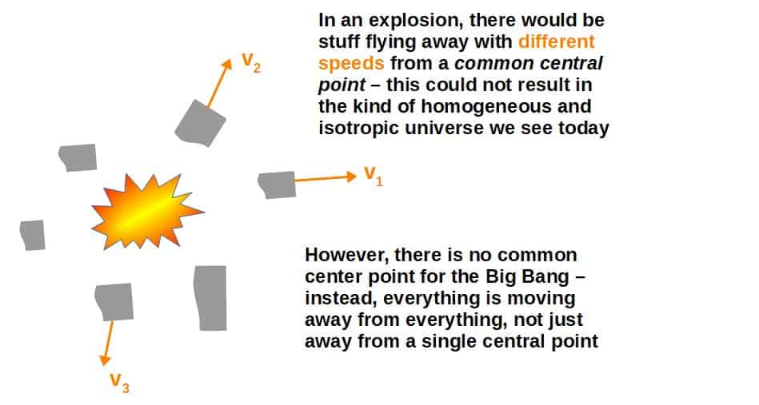
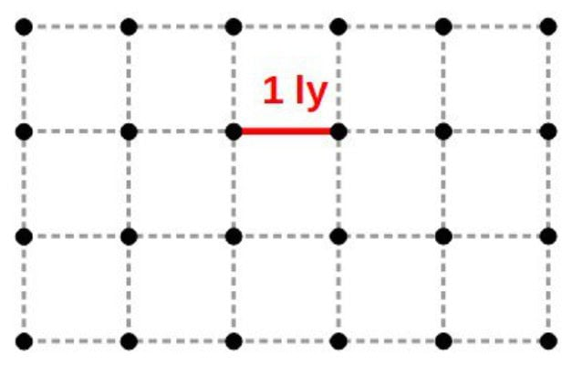
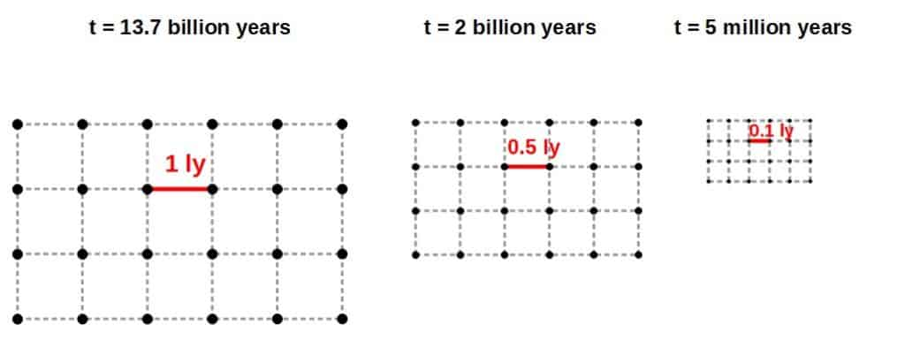
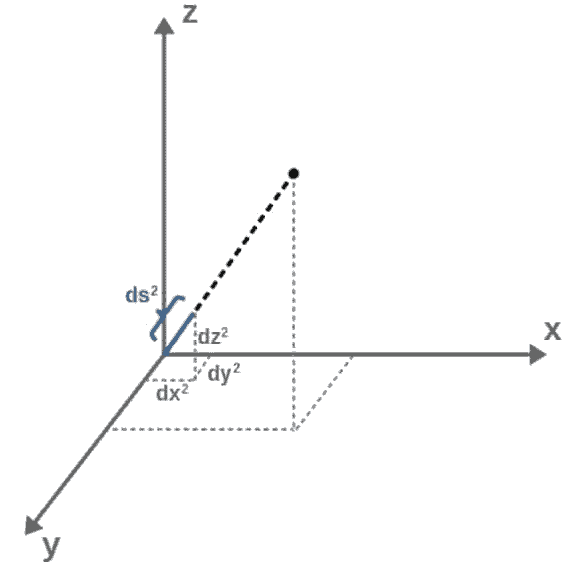

# Did The Big Bang Happen Everywhere At Once? The Physics Explained

> The Big Bang was not an explosion into space — it was an expansion of space itself.

*Originally published at [profoundphysics.com](https://profoundphysics.com/did-the-big-bang-happen-everywhere-at-once/).*

---

Physicists often think that our universe came about from something known as the Big Bang and it is said that the Big Bang happened everywhere simultaneously. But did the Big Bang actually happen everywhere at once?

**The Big Bang did happen everywhere at once. This is because in the beginning, all distances between separate points in the universe were zero and at the moment of the Big Bang, these distances became non-zero and the universe began expanding. This happened to all separate points, everywhere at once.**

Now that the James Webb Space Telescope is operational, we can look further and further back in time and gather empirical evidence! But on paper, what do our current theories say really about the beginning?

In this article, we’ll discuss the **Big Bang model of the universe**, some aspects of it as well as the mathematics of the **Friedman-Robertson-Walker model**, our current best theoretical model describing the Big Bang and the expansion of the universe.

Finally, we’ll touch on the validity of the Big Bang theory and what might come next!

## Did The Big Bang Happen At a Single Point?

How most people usually think of the Big Bang is as some sort of explosion starting at a **single point**. However, did the Big Bang really happen at a single point?

**The Big Bang did not happen at any single point. This is because at the beginning, all distances in the universe were zero. Every point in the universe was therefore effectively in the same place, which means that the Big Bang did not happen at any particular point, it happened everywhere.**

Fundamentally, this mental image of the Big Bang as some kind of explosion or a big “bang” happening at one point is not really right because of two things based on experimental evidence; the **homogeneity** and **isotropy** of the universe.

We’ll talk more about what these mean later, but essentially, we see based on evidence (well, astronomers see) that the universe looks overwhelmingly the same everywhere at large scales.

This means that **the Big Bang could NOT have been an explosion**; explosions do not result in something that would look the same afterwards from everywhere.

In fact, the only thing that COULD result in something looking as homogeneous and isotropic as our universe is that the universe started from a configuration where **ALL points were packed together** and then this configuration began expanding the same way in all directions.

This is indeed the origin of the Big Bang model – it’s not an explosion, it is the expansion of the actual **distance scale of the universe** itself.

This is why everything looks so homogeneous and isotropic – since the expansion is happening equally in all directions, everything remains homogeneous and isotropic.

Now, the weird thing is that this expansion of the universe is not something expanding away from a “point” – instead, *everything is expanding away from everything*.

This is because our current models of the universe predict that what is expanding is the actual **scale of the universe** itself, NOT that all stuff would just be moving away from some central point.

What this means in our context is that we cannot think of the Big Bang as “happening at a point” – the Big Bang did not happen at any particular place, it happened **everywhere at the same time**!

This is simply because **at the Big Bang, all the distance scales of the universe were zero** and everything, all points in the universe were effectively packed into a single “thing” – all points were the same, so we cannot say that the Big Bang happened at any one of these points.

Now, our current theoretical models only *really* predict that the actual scale of the universe was smaller in the past and this is essentially done by “reversing” these models, by winding our mathematical models back in time.

If we do this to around 13.7 billion years back in time, we find that the models predict that the scale of the universe (all distances between all points) shrinks to zero.

This is the **current model of the Big Bang** – it is the point in time when all the distances between everything is zero. Effectively, the universe itself is “just a point”.

The right way to think about the Big Bang is that it is just the time when the scale of the universe shrinks to zero, BUT we do not actually know whether the distance scales really do go to zero or whether our current models break down somewhere before this.

Now, let’s see exactly how this happens through our current models predicted by **general relativity**. Looking at these models also helps us understand more deeply why the Big Bang did happen everywhere at once.

**Sidenote**: everything discussed about **general relativity** in this article is covered in a lot more detail in my article **[General Relativity For Dummies: An Intuitive Introduction](https://profoundphysics.com/general-relativity-for-dummies/)**. This is a good place to start learning general relativity if you’re not familiar with it yet, as the article covers the key ideas, including the **math of general relativity** as intuitively as possible.  
  
You may also find this article on **[how to learn general relativity on your own](https://profoundphysics.com/how-to-learn-general-relativity-a-step-by-step-guide/)** useful. In it, I cover the exact steps I recommend for **learning general relativity through self-study** as well as some of my favourite **resource recommendations**.

## Why The Big Bang Did Actually Happen Everywhere At Once

Whilst it is difficult to really know the right answer until we have a quantum theory of gravity, we can use the models that we currently have.

The model we’ll discuss in this article is the one that most people will have at least heard of, the **Big Bang model of the universe**.

It’s worth emphasizing, however, that this is just a *model* we use to describe the very beginning of our universe.

In other words, we do not *really* know what happened then – we were, of course, not around back then to see what really happened – all we have are our current **theoretical models** (and some experimental evidence too!).

However, the same model predicting the Big Bang also successfully describes things we currently see in the universe such as the **cosmic microwave background radiation** (CMBR) and the **expansion of the universe**, so it certainly does have a lot of merit.

We’ll take a more detailed look on the actual model itself soon, but first, it’s worthwhile to look at what it predicts in an intuitive manner.

In particular, we predict the Big Bang by “winding back in time” our current theoretical models and see what happens; these models turn out to predict that **our universe as a whole is expanding in scale** and the start of this expansion is essentially what we call the Big Bang.

So, what does this model say? The most simplified view would be to imagine the universe at a single “point” and that there was a “big bang” and suddenly the universe started expanding.

This mental image, however, isn’t quite an accurate description of what the model says.

A more accurate mental image to have is an **infinite grid of dots**. This layout of the dots can be anything you like but it helps to imagine something uniform (the dots have the same distance between each one).

These dots simply represent “points” within space (not spacetime). Effectively, this infinite grid of dots represents the **universe** – these dots could be galaxies on a large scale, for example.

Now choose a pair of dots and think of a line joining them and that the line is described by some number. We can interpret this number as the **distance between points in space** (distance between two galaxies, for example).

 

Here we have a grid with a 1 light-year separation between points. Note that technically, our model should have an infinite grid of points, but of course, I cannot draw an infinite number of points here.

How is this useful? Well, **the Big Bang model is the idea that as we go back in time, the numbers  
representing the distance between each point in the universe gets smaller and smaller**.

The grid still is infinite but each point is getting closer together. This means that at the beginning, effectively **all points were packed together**.

Physically, this means all stuff (matter, radiation, whatever) in the universe was already there at the moment of the Big Bang, it was just all packed together in an “infinitely dense” cluster.

Now, why would we come up with a model like this?

Well, from observation! When we look at the universe and in particular, at various galaxies, they are moving away from us at speeds proportional to their distance away from us (this is called Hubble’s law).

If instead of looking forward in time where everything is moving away from everything else, we look back in time, **everything must be getting closer**! Here lies the birth of the Big Bang model of the universe.

If we try and wind the clock back close to time t = 0, everything is getting closer and closer together. This means that the universe got denser and denser – the grid of points in your mind are getting closer and closer together but the grid is still infinite – weird but stay with me!

Once we reach “the beginning” (t = 0), the distance between each point shrinks down to zero (but the grid is still infinite). This is the **Big Bang singularity** you may have heard about!

From the viewpoint that each “distance label” reads zero, we can get a more intuitive answer to the question of whether the Big Bang really happened **everywhere at once** – it did, because all points were effectively the same.

As soon as we get above t = 0, for any number you can think of, t = 0.00001, t = 0.7, t = 100, each distance label becomes non-zero and increases from there.

As the time t gets larger, the Big Bang model tells us that each two points are getting further and further away from one another. This is the expansion of the universe that we hear about!

## The Big Bang Model of The Universe: A Detailed Explanation

Let’s try and get a grip on the actual Big Bang model itself in a more detailed sense! At the most fundamental level, the Big Bang model discusses how space and in particular, **spacetime**, evolves.

This takes place in the realm of **general relativity**, where space and time interweave into the concept of spacetime.

With this in mind, the Big Bang model is at its heart, a **theory of gravity** and is a solution to the famous **Einstein field equations**.

These are a set of equations whose solutions are gravitational systems such as models for how the gravity outside of a star acts, what the dynamics of a rotating black hole are, and even the evolution of the universe itself.

In case you’re interested in some **applications of general relativity**, you can check out [this article](https://profoundphysics.com/how-are-photons-affected-by-gravity-if-they-have-no-mass/), which covers how the Einstein field equations predict that a massless photon should be affected by gravity, leading to phenomena like the **deflection of light around a star**.

Anyway, the spirit of the Einstein field equations is wonderfully summarized as:

> “Spacetime tells matter how to move, matter tells spacetime how to bend.”

The Einstein field equations mathematically formalize this revolutionary idea as a somewhat simple looking equation:

$$G_{\mu\nu}=8\pi GT_{\mu\nu}$$

On the left hand side, everything to do with the **geometry and curvature of spacetime** is encoded in the symbol Gµν (called the Einstein tensor) and everything to do with **matter and energy** is wrapped up in Tµν (called the stress-energy tensor) and together they interact and interplay to produce gravity.

Now, the Big Bang model is one of these solutions to Einstein field equations – we generally get different solutions with different starting assumptions.

Since Einstein’s general relativity is a theory of gravity, so is the Big Bang model obtained from it too – the Big Bang model of the universe is a theory of gravity describing **how the universe itself evolves** due to the gravitational effects of all the matter and energy contained in the universe.

Now, there are two main assumptions that cosmologists make, based on observation, to obtain the current Big Bang model:

- **Isotropy**: this means that on large scales, the universe looks the same from all directions (and by large, we mean really really big, astronomical scales) – **there is no special direction to look from**.
- **Homogeneity**: this means that the universe is the same in every location (again, on very very large scales) – **there is no special location in the universe**.

These two assumptions together are called the **cosmological principle** and give us just enough information to solve the Einstein field equations and obtain the model describing the Big Bang and the expansion of the universe.

Now, what does this really solution look like? In general relativity, **the solutions to the Einstein field equations are metric tensors or line elements, describing distances in spacetime**.

I cover the physical as well as the intuitive geometric meaning behind metric tensors (as well as other tensors used in general relativity) in more detail in [this article](https://profoundphysics.com/general-relativity-for-dummies/).

Line elements are essentially generalizations of **Pythagoras’ theorem** that describes distances in a typical Euclidean space. Let’s briefly recall Pythagoras’ theorem:

$$a^2+b^2=c^2$$

These relate the three sides of a triangle, where c is the length of the hypotenuse – however, this formula does more than that.

If we imagine a as the difference in the x-coordinates of two points and b as the difference in the y-coordinates of these points, then this is secretly telling us that the **shortest distance** between those two points is the straight line, the hypotenuse c, connecting them.

We can generalize this to points in 3D where we would have a2+b2+c2=d2. Now the shortest distance between the two points is d and c is the difference in the z-coordinates of the two points.

If we talk about space, it is convenient to talk about very small (infinitesimal) distances and we would write:

$$ds^2=dx^2+dy^2+dz^2$$

You can think of dx as something like “a small difference in the x-coordinate”. This is what we call a “line element” – it tells us about the distance between two close-by points.

If we were to write a new line element,

$$ds^2=3^2\left(dx^2+dy^2+dz^2\right)$$

we would triple the distance between the points compared with our original ds2.

This idea of **changing distances between points** and **how the line element encodes them** will be key in understanding the Big Bang model!

Now, these line elements describe a space, but not a spacetime like we would want in general relativity – there’s no **time component**! We add this in like with spatial components but with a subtle change, like this:

$$ds^2=-dt^2+dx^2+dy^2+dz^2$$

Note; here, we are working with units in which c=1 (speed of light), which means that time and space have the same dimensions of length.

Time has a different sign in front of it! This is because time acts fundamentally differently compared with space – we can’t move freely through time like we can jump up and down or run side to side – this minus sign is the mathematical way to encode this.

This particular line element above describes something called **Minkowski spacetime** and is the simplest solution to the Einstein field equations as it is the immediate generalization of Pythagoras’ theorem to (flat) spacetime.

Minkowski spacetime is used to describe the laws of special relativity, leading to things like time dilation and length contraction. I cover this in more detail in my article **[Special Relativity For Dummies: An Intuitive Introduction](https://profoundphysics.com/special-relativity-for-dummies-an-intuitive-introduction/)**.

We’re now ready to think about the Big Bang!

The solution we will look at and which describes the Big Bang is called the **FLRW metric** and it stands for **Friedmann–Lemaître–Robertson–Walker metric**, named after the four people who independently derived it.

In this article, we’ll just briefly discuss the FLRW metric, but if you want a more detailed discussion, I recommend reading my **[Complete Guide To The Friedmann Equations](https://profoundphysics.com/the-friedmann-equations-explained-a-complete-guide/)**. It essentially covers everything from solving the Einstein field equations beginning from the cosmological principle to the expansion of the universe as predicted by Friedmann cosmology.

You’ll probably also find my [full article covering the metric tensor](https://profoundphysics.com/metric-tensor-a-complete-guide-with-examples/) useful, as the FLRW metric is just one example of the much more general class of objects called metric tensors.

This metric is the particular line element we get with the assumptions given earlier (isotropy and homogeneity) and it is the **most accurate model of our universe at cosmological scales**.

The FLRW metric can be expressed as a line element of the form:

$$ds^2=-dt^2+a^2\left(t\right)\left(dx^2+dy^2+dz^2\right)$$

From what we just covered, we can recognize that the time component looks pretty usual, there’s nothing different going on compared to the simple Minkowski spacetime we saw earlier.

The spatial components are where it gets interesting. We can see that these multiplied by some **prefactor a2(t) which is a function of time**.

Essentially, the spatial part of the FLRW line element represents the infinite grid of dots that changes scale we discussed earlier, but with the grid now in 3D space.

This is because based on what we saw earlier, we know that if we multiply the spacial parts of the line element (dx2+dy2+dz2) by something, this **scales the distance between all points in space**.

Well, here we see exactly that – this multiplicative factor a(t) in front of the spacial distance changes with time, which means that **the scale of the universe will also change with time**.

For this very reason, the function a(t) is called the **cosmic scale factor**.

We can find out the exact form of the scale factor by solving the Einstein field equations for any particular energy configuration in the universe – for example, in a **matter-dominated universe**, we would have the time dependence of the scale factor be:

$$a\left(t\right)\propto t^{\frac{2}{3}}$$

The important thing here is that **a(t) increases with time**.

Now, we’re specifically interested in what happened at the beginning – if we were to look at winding the time t back down to zero, we would find that a(t) gets smaller and smaller with a(0) = 0.

We now know how to interpret this! Looking only at the **spatial part of the FLRW line element**, ds2space= a2(t)(dx2+dy2+dz2), we know that the factor (dx2+dy2+dz2) just describes the distance between two points and that the scale factor a(t) changes this distance label between them.

As we look further and further back in time, the distance between any two points gets smaller and smaller. Eventually, **at the beginning, the distance between any two points reaches zero**!

The spacial part of the line element describing distances in the universe at time t = 0, is:

$$ds_{space}^2=a^2\left(0\right)\left(dx^2+dy^2+dz^2\right)=0\cdot\left(dx^2+dy^2+dz^2\right)=0$$

This is the mental image we had earlier, an infinite grid of points whose distance labels all go to zero.

If we increase t just a tiny bit to some t = t1 > 0, the spatial geometry is then described by:

$$ds_{space}^2=a^2\left(t_1\right)\left(dx^2+dy^2+dz^2\right)$$

If we go forward in time, a(t) is increasing and so does the distance between any two points – this is the **expansion of the universe** mentioned earlier!

We can now see exactly how the interpretation of the Big Bang happening everywhere at once comes about.

At the heart of the answer is the scale factor – **because the scale factor goes to zero and so do all the distances in the universe, the Big Bang must have happened at every point at the same time**.

As a final note, looking to the future, I noted earlier that the Big Bang model comes from the language of general relativity, which describes things involving large distances (and large energy scales).

On the other hand, **quantum theories** describe things at small distances (and small energy scales).

If we trace back to the Big Bang, we run into very very small (or zero) distances and very high energy scales – this begs the question of whether general relativity is still the right framework to use in this regime.

Most physicists do not actually think the universe was an actual, singular point at the Big Bang.

It is more commonly thought that the FLRW model of the Big Bang breaks down at the very tiniest of scales at the beginning of the universe and that there were some **unknown quantum effects** that took place when all distances were small enough.

This is because at very very tiny scales like the Big Bang, quantum effects can no longer be ignored and with high (energy) densities in this regime too, gravitational effects cannot be ignored either!

For this reason, we carefully refer to the Big Bang model as just that, a model. It is the most accurate model of the Big Bang we have at this point, but we do not really know whether it is the most accurate *possible* model (it likely isn’t).

With our current understanding, it’s impossible to fully predict what actually happened at the Big Bang. The best we can do is use our current models, which predict that the Big Bang indeed did happen everywhere at once.

The key to obtaining a more accurate description of what happened would be a **quantum theory of gravity** – a theory that combines the predictions made by general relativity with quantum effects.

There are already several candidates for a theory of quantum gravity, with the most well-known outside of academia being **string theory** and **loop quantum gravity**.

However, at this point, there isn’t much evidence to support either of these theories, so we do not know whether they are actually valid or not.

**Cameron Bunney**

I’m a third year PhD student at University of Nottingham, where I also studied my MMath. My main research focus is on curved spacetime QFT and the Unruh effect in analogue gravity systems. I have a soft spot for all kinds of math and physics, from number theory to mathematical biology and everything in between! Aside from research and recreational math, I enjoy playing piano and studying languages.

*This article has been co-authored by Cameron Bunney.*

---

*← [Back to the full archive](../index.html)*
