# General Relativity For Dummies: An Intuitive Introduction

> One of the most beautiful theories of nature ever invented — but often seen as obscure and inaccessible.

*Originally published at [profoundphysics.com](https://profoundphysics.com/general-relativity-for-dummies/).*

---

To me, the theory of general relativity is one of the most beautiful theories of nature ever invented, but it is often seen as one of those obscure topics that are not easily accessible to most people.

**As a brief introduction, general relativity is the most accurate theory of gravity so far, introduced by Albert Einstein in the early 1900s. General relativity explains gravity as a property of spacetime rather than a force, namely, as the curvature of spacetime, which is caused by matter and energy.**

Now, while the mathematical structure of general relativity is, without a doubt, a complicated mess to most beginners, understanding the theory itself and the physics behind it is actually quite simple. This is what we will explore in this article.

**From reading this article, you will learn**:

- **The underlying reasoning behind what general relativity is all about**; why we use tensors, how and why gravity has something to do with spacetime curvature as well as what the actual equations of general relativity really tell us in an intuitive sense.
- **How general relativity is used to model gravity**; we will look at the physical meaning behind all the complicated math, how they relate to gravity and also how the concepts of general relativity relate to the more usual Newtonian theory of gravity.

In a way, this article will work as an **in-depth overview of general relativity** and more importantly, it will give you the big picture and the important tools needed to learn more of whatever topic you find interesting.

Each subtopic will contain **practical examples** and **in-depth additional sections** for those who are interested in exploring the details and applications as well as how the math works.

These will not be necessary to understand the basics, however.

Also, while this article doesn’t necessarily require previous understanding of much of anything, it will help greatly to have some knowledge of special relativity.

For that, I’d recommend reading my **[introductory article on special relativity](https://profoundphysics.com/special-relativity-for-dummies-an-intuitive-introduction/)**.

I also recommend checking out my full **[Mathematics of General Relativity -course](https://courses.profoundphysics.com/p/mathematics-of-general-relativity)** if you’re interested in a dedicated learning experience to take your knowledge of general relativity to a deep level.

Table of Contents

Toggle

## Why Is General Relativity Important?

Before we get started on what general relativity actually is, there is an important aspect to be discussed: why should you even care about this topic?

Sure, you’ve clicked on this article, so you’re probably interested to learn more, but still; **what makes general relativity an important theory?**

Here is a list of a few of the most important applications of general relativity:

- **Newtonian gravity is incomplete and sometimes gives incorrect predictions, which general relativity describes correctly**: even in our solar system, Newton’s laws are incapable of predicting the orbits of planets precisely (generally, *planetary orbits are actually not ellipses*).

- **General relativity describes new phenomena, which the old Newtonian law of gravity could not predict**: examples of this are black holes (in principle, Newtonian gravity can predict they exist, but not describe them to the extent of GR) and gravitational waves (this is a totally unique phenomenon to GR).

- **General relativity is at the heart of most modern research in theoretical physics**: you’ve probably at some point heard about the whole “quantum gravity” thing, which arguably involves a lot of active research in general relativity. Other huge areas of research in GR are cosmology and astrophysics, which study topics like black holes, dark matter, dark energy, the Big Bang and even the structure of planets and stars.

Arguably, regardless of how practical you view general relativity as, to me it is just an incredibly beautiful theory that relates physics to geometry.

It is also fascinating that such a seemingly far-fetched theory can have such precise real-world predictions, as we’ll come to see.

## General Relativity In a Nutshell: A Quick Overview

Here, I will present a **quick overview of the whole theory of general relativity, which will lay down the most important ideas and help you see the big picture**.

After that, we will look into each of these things in much more detail.

Now, you may have heard the phrase “gravity is the curvature of spacetime” at some point.

This phrasing can, however, often make general relativity seem like some sort of very abstract, almost science fiction -like topic.

General relativity, at its heart, is the **generalization of the laws of physics to a universal (“covariant”) form**, which is exactly what the complicated mathematics of general relativity do (this is explained more later).

The beautiful thing is that the mathematics also happen to have a **geometric interpretation**, which correspond to the notion of “*spacetime being curved*“.

Whether you wish to view general relativity in this geometric way is totally up to you.

The fact is, however, that **the mathematics of general relativity give an accurate description of nature** regardless.

In this article, we will, however, look at general relativity through a *geometric lens*, because it gives nice intuitive meaning to everything.

Down below I’ve collected the key concepts of general relativity, but for now, don’t get too hung up on the mathematical details, rather **try to see the big picture**.

- In relativity (both special and general), everything is described by something called **spacetime**. To put it simply, this just means that **instead of thinking about time and the three spacial dimensions as separate things, we describe them by a four-dimensional spacetime**. You can read my [introduction to special relativity](https://profoundphysics.com/special-relativity-for-dummies-an-intuitive-introduction/) for more on this topic.

- **To describe something in spacetime, you need to have a coordinate system** (a time coordinate and spacial coordinates). Coordinate systems can be chosen freely, but **universal laws of physics should not depend on any particular coordinate system** (coordinate systems can still have a physical meaning, but a *law of nature* should be coordinate-independent because a law has to be the same for everyone). This is called the **principle of general covariance**.

- The laws of physics and gravity are described by **tensors** in general relativity. This is because **tensors are mathematical objects that do NOT depend on any particular choice of coordinates**, which means that they can be used to formulate physical laws in a universal way.

- The most important tensor in general relativity is the *metric tensor*. **The metric tensor describes how distances are measured in a given spacetime and** **it is used to turn specific coordinates you use** (the x’s in the equation below) **into physical distances in spacetime**.

- These distances (more accurately, the square of the distance) are, in their most general form, described by the following equation:

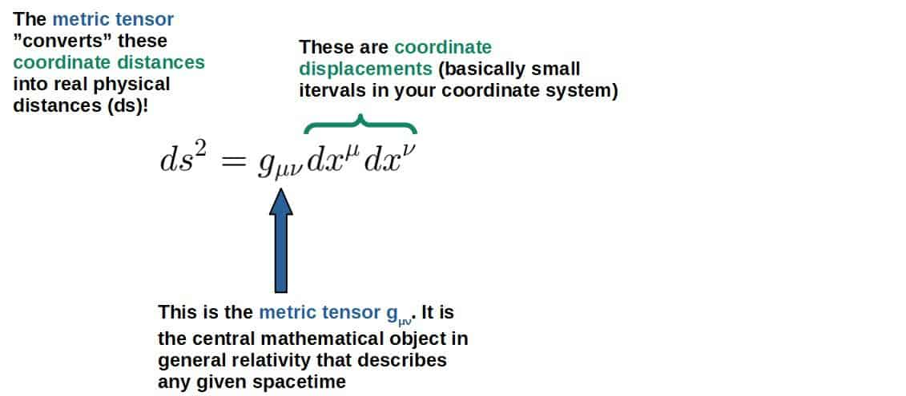

This ds2 is called “the line element of the metric gµν” and in general relativity, we typically represent a given spacetime by its line element, which has this form. At this point, I would highly recommend you read my [full guide on the metric tensor.](https://profoundphysics.com/metric-tensor-a-complete-guide-with-examples/)

- An important principle underlying general relativity is the **equivalence principle**, according to which gravity and acceleration are completely equivalent, except for one thing; **tidal forces**. Tidal forces are something that can only appear due to gravity and they turn out to be the key thing in **defining gravity in general relativity**.

- Tidal forces in general relativity are described by a tensor called the **Riemann tensor**. The Riemann tensor also has a nice geometric meaning as describing the curvature of a space, which gives rise to the following interpretation; **gravity corresponds to the curvature of spacetime**.

- **Objects under the influence of gravity move on geodesics through spacetime**. A geodesic is essentially just a straight line, along which an observer **does not experience any forces or acceleration**. Geodesics can be calculated from the **geodesic equation**:

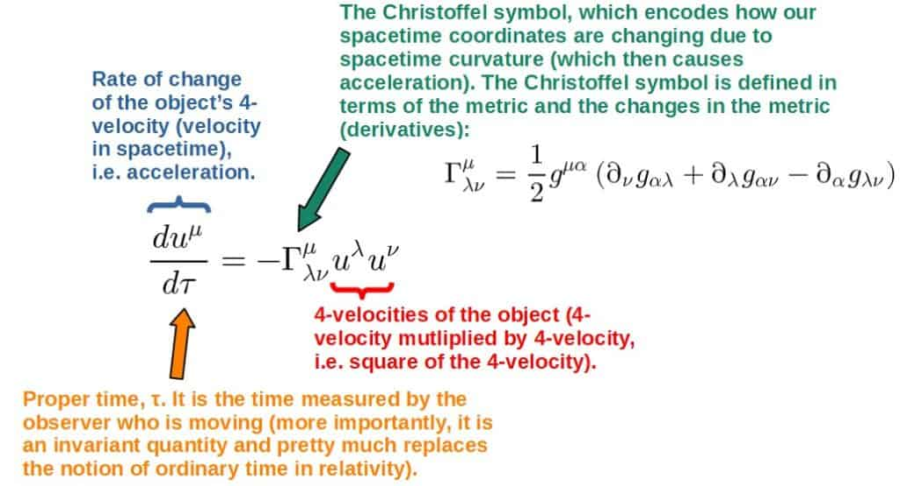

- This also describes how **gravity is not actually a force**. An object moves through spacetime in a straight line (geodesic), but if the spacetime is curved (gravity is present), this line will follow the curvature and may change direction (like if you were moving on the surface of a sphere, for example). This effect we call *gravity*. **So, gravity is not really a force, but rather a manifestation of the structure of spacetime.**

- Sources of gravity (spacetime curvature) are described by the **Einstein field equations**. These describe how things such as energy, momentum, pressure and stresses (i.e. the *energy-momentum tensor*) cause the curvature of spacetime:

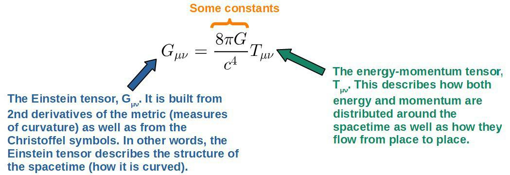

Now, all of this may be a little overwhelming at first, but it will become more clear later when we discuss everything in much more detail and see just how all of these “pieces” fit together.

**Quick tip**: If building a stronger mathematical foundation for general relativity is of interest to you, I think you would find my **[Mathematics of General Relativity: A Complete Course](https://courses.profoundphysics.com/p/mathematics-of-general-relativity)** (link to the course page) extremely useful.  
  
This course aims to give you all the **mathematical tools** you need to understand general relativity – and any of its applications. Inside the course, you’ll learn topics like tensor calculus in an **intuitive**, **beginner-friendly** and **highly practical** way that can be directly applied to understand general relativity.

## The Underlying Postulates of General Relativity

Every theory is always based on a few underlying principles or *postulates*, which pretty much lead to the specifics and the results of the theory. General relativity is no different.

Really there are two main postulates that general relativity is based on, which are the following:

- **The principle of general covariance**: this is mainly a mathematical assumption, yet it still does give some physical insights about how the laws of physics should behave. It also describes why the mathematical structure of general relativity happens to be what it is.
- **The equivalence principle**: essentially, this principle describes more of the physical assumptions that general relativity is based on and it can be thought of as a “physical restriction” to the principle of general covariance.

Combined, these two postulates provide the necessary underlying assumptions needed to build the framework of general relativity.

Down below, I’ll explain both of these in detail and as intuitively as possible.

To be fair though, there are a few more assumptions that need to be taken into account in order for general relativity to work the way it does (such as the assumption of a torsion-free connection).

These, however, are not necessarily considered as fundamental principles, but rather more technical assumptions, which we won’t get into too much here.

### The Principle of General Covariance

The first important postulate or underlying principle of general relativity is called the principle of general covariance.

To be fair, this principle is actually not unique at all to general relativity, it is actually used in pretty much all of physics.

**In short, the principle of general covariance states that laws of physics themselves should be independent of an observer’s motion, that is, they should have a covariant form. This means that a good law of physics should be built from mathematical quantities that are coordinate-independent, such as tensors.**

Now, sometimes this principle is sort of taken for granted, because it sounds obvious. Of course, we want the laws of physics to be the same for everyone.

But, it does have a lot of important consequences and this principle is kind of at the base of all of physics, so it should be made clear here.

**The word ‘covariant’ refers to a mathematical object whose components may change when you switch between different coordinates, but the object itself doesn’t**.

Covariant quantities have a universal meaning, regardless of how we choose to represent them (we’ll talk about what this means when we get to tensors later).

In some sense, the principle of general covariance is only a statement about how the laws of physics should mathematically look like.

It does, however, also have physical consequences.

For example, it pretty much forces us to represent laws, such as the Einstein field equations, by using tensors.

This results in gravity also being affected by momentum and energy flow instead of just mass (energy density) like Newton’s law of gravitation states.

We’ll see exactly how this happens later on.

### The Equivalence Principle

The second key postulate of general relativity is the principle of equivalence, which actually has several important consequences that are worth laying out here.

**In short, the equivalence principle is one of the key postulates general relativity is based on and it states that the gravitational acceleration is the same for all observers in a gravitational field. This leads to gravity not actually being a force, but a property of spacetime itself (spacetime curvature).**

Now, we already know from Newton’s law of gravity that all objects fall to the ground with the same acceleration (9.81 m/s2 on the surface of the Earth).

This is due to the fact that the mass of the object itself cancels from Newton’s equation of gravity (or as sometimes stated, the inertial mass is equal to the gravitational mass).

This leads to a few important ideas that are at the heart of the equivalence principle:

- Since all objects experience the same acceleration due to gravity, irrelevant of the shape or mass of the object, it means that **gravity acts very differently to other forces**; for example, the electric force will depend on the charge of the object itself, but gravity is the same for each object.

- This can then be interpreted as gravity actually being an *intrinsic property of spacetime itself*. This logic is fundamentally where the notion of **gravity being a geometric property of spacetime** (“gravity=spacetime curvature”) comes from.

- Another statement of the equivalence principle is the fact that **gravity cannot be distinguished from acceleration**. A typical example of this is that imagine you’re in a closed box. It is impossible for you to determine whether gravity is pulling you down, keeping your feet stuck to the ground or whether the box is accelerating upwards. Thus, **gravity and acceleration are equivalent** (hence the name equivalence principle).

- There is, however, one exception to the above statement; **tidal forces**. Tidal forces come from the fact that objects may get stretched in a gravitational field because their different parts experience a different force. In simple accelerated motion, there is no such effect.

- **Tidal forces turn out to be the key to defining gravity and spacetime curvature**. They give a way to determine whether there is a real gravitational field (the spacetime is actually curved) or whether an object seems to be accelerating due to some kind of weird choice of coordinate systems (such as curved coordinates).

- Therefore, the meaning of spacetime curvature is really as simple as this; **spacetime is curved if an object experiences real tidal forces and thus, there is a real, physical gravitational field present**.

The above definition also has another very important consequence called *metric compatibility*. This is explained down below.

What Is Metric Compatibility and Why Is It Important? (click to see more)

The statement of metric compatibility is really just one equation, but the underlying logic is much deeper than that. To explain this idea from a physical point of view, we’ll think of a little thought experiment related to tidal forces.

**What would happen if we were to look at an object over a very very small region (or as physicists usually call it, “locally”)?** Over this very small region, the effect of tidal forces are not noticeable and as we make the region even smaller (to become just a single point), *the tidal effects would not be detectable at all*.

This then corresponds to there being no curvature and no gravity at this singular point and therefore, **we can always approximate a small enough region in spacetime as being flat** (i.e. *the laws of special relativity apply*).

Now, this does not mean that the spacetime itself is not curved anymore; it still is, we’ve just approximated it as flat over a sufficiently small region (or a point).

If you move even slightly away from this point, the effects of curvature take place. Mathematically this corresponds to *the first derivatives of the metric being zero, but the second derivatives are never zero if the spacetime is really curved*.

Is this really true, though, that we can always approximate a small region as flat? The answer is yes and the best way for me to explain this is the following: look around you! You’re living on a globe, which is certainly not a flat geometry. Yet when you look around, the surface of the Earth appears flat to you.

This is because *the curvature of the Earth only becomes evident on a larger scale* (for example, if you were to travel straight ahead for long enough, you’d loop back around to where you started; therefore, the space is curved on a larger scale) and the same thing applies to spacetime curvature more generally as well.

We can therefore **approximate small enough regions of spacetime as flat even though the spacetime as a whole may be curved**.

Mathematically, this is described by the equation of metric compatibility, which states that the covariant derivative of the metric tensor is always zero (a covariant derivative is simply a generalization of the ordinary derivative that also works in curved spaces, which we’ll talk about later):

$$\nabla_{\lambda}g_{\mu\nu}=0$$

This may not say much to you, but it is a key property of the metric in general relativity. For now, you can just think of this equation as a **mathematical statement of “locally the laws of general relativity should reduce to those of special relativity”**.

Really, the metric compatibility equation comes from the assumption that over small enough regions (locally), the space can be approximated as flat and the laws of special relativity should apply.

This then means that **the metric will also locally reduce to the metric of special relativity** (i.e. the Minkowski metric, which is a constant; you can read more about it in my special relativity introduction [here](https://profoundphysics.com/special-relativity-for-dummies-an-intuitive-introduction/)). The derivative (or covariant derivative) of a constant is, as we know, simply zero, which gives the above equation.

The important thing about the above equation is that it is a *tensor equation*. As we’ll come to see, tensor equations are always true (that is, they always have a *covariant* form), in every coordinate system.

This then gives a very nice result; **the covariant derivative of the metric has to be zero everywhere**, not just at a small flat region. This is the essence of metric compatibility. It must always hold.

Now, the statement of metric compatibility may not be too important right now, but the importance of it will become clear once you actually start going deeper into general relativity and deriving the mathematics from first principles.

For example, the assumption of metric compatibility allows us to derive a specific form for the Christoffel symbols (defined in terms of the metric and its derivatives), which we would not otherwise get.

## The Mathematics of General Relativity Explained Intuitively

In this section, we’ll go over the important mathematical tools used in general relativity, such as the **metric tensor** and the **Christoffel symbols**.

We’ll also explore the **physical and geometric interpretations** of these.

It’s important, however, to realize that the focus of this article is not necessarily in the math, but rather what the math actually can tell us from a **physics point of view**.

For this reason, you do NOT have to pay much attention to mathematical details, such as some of the methods used to do tensor math, to understand this article.

### What Are Tensors and Why Are They Used In General Relativity?

Essentially, tensors are the main mathematical objects used in general relativity simply because they have some very useful **transformation properties**.

The key idea is that **a tensor is always the same in every coordinate system** (in a technical sense, we say that a tensor transforms covariantly).

First of all, what is a tensor anyway? **A tensor is simply a “collection of objects” (these objects are its tensor components) whose components transform in a nice way between coordinate changes**.

Now, a mathematician may say that this is not an accurate enough definition, but for us, this works just fine.

Mathematically, a tensor is usually represented by some letter that has **different indices** (they can be upstairs or downstairs indices).

**In general relativity, these indices are usually greek letters** and they run from 0 to 3, which correspond to the different **tensor components**.

These components can be nicely represented as a “table” as follows (more accurately, this is called the “matrix representation of a tensor”):

$$T_{\mu\nu}=\begin{pmatrix}T_{00}&T_{01}&T_{02}&T_{03}\\T_{10}&T_{11}&T_{12}&T_{13}\\T_{20}&T_{21}&T_{22}&T_{23}\\T_{30}&T_{31}&T_{32}&T_{33}\end{pmatrix}$$

These T’s here are the components of this tensor Tµν. For example, T01 is the component where µ=0 and ν=1.

For the context of general relativity and physics, here are some important facts about tensors:

- **A tensor is always the same in all coordinate systems** (i.e. tensors are coordinate-independent).
- **The components of a tensor may be different in different coordinates** (but the tensor as a whole isn’t, this property is called *covariance*). These components can, however, be mathematically compared in a fairly straightforward way.
- **An equation involving ONLY tensor quantities is the same in all coordinate systems**. Thus, the laws of physics should be these kinds of equations, in other words, tensor equations.
- **Vectors and scalars are mathematically also considered to be tensors**. Thus, they are also good for formulating the laws of general relativity.


Interestingly, the use of tensors and this property of covariance can even explain **why specifically a moving charge creates a magnetic field**. I discuss the physics behind this phenomenon in [this article](https://profoundphysics.com/why-do-moving-charges-create-a-magnetic-field/).

Now, the importance of tensors might not become clear before you actually start doing some calculations with them, so the bottom line for why tensors are used in general relativity goes as follows:

**Tensors are commonly used in general relativity because they are coordinate-independent or covariant quantities. Since laws of physics have to be the same for everyone (they should have a coordinate-independent form), this means that also the laws of general relativity should be formulated from tensors.**

This really comes down to the principle of **general covariance**, which was explained earlier.

Tensors allow us to formulate the mathematics of general relativity in a way that satisfies this principle.

Why Are Tensors Used in General Relativity, But Not in Newtonian Gravity?

Now, if tensors are needed for laws of physics, why does Newtonian gravity not use tensors? Technically, **Newtonian gravity and Newtonian mechanics DOES use tensors since it uses vectors and scalars, which are also tensors** (also, in Newtonian gravity, some “higher-rank” tensors like the tidal tensor, are sometimes used).

The problem, however, comes from the fact that **if relativistic effects are taken into account, ordinary Newtonian vector quantities (like forces and momentum) are not actually vectors, only vector components**.

In fact, even time, according to relativity, is not really a scalar but rather a vector component. You can read more about this in [this article](https://profoundphysics.com/is-time-a-vector/).

Thus, **valid laws of physics should not be made out of only specific vector components**, but should involve whole vectors. This is what special relativity fixes by introducing **four-vectors**.

These four-vectors, however, are not enough to describe something like gravity, which is where tensors come into play.

Also, **Newtonian gravity is not valid as a general law either**, since the Newtonian law of gravity only involves a randomly picked component (mass/energy density) of a tensor called the **energy-momentum tensor**. This will all be explained later.

This is the main reason why we need to, in fact, **generalize the usual Newtonian laws of gravity to a properly “covariant” form**, which can be done by using tensors: this is essentially what general relativity is all about.

Tensors, once you learn how to use them correctly, also **greatly simplify calculations and equations**.

Equations that would otherwise take up pages upon pages of very complicated formulas can be reduced to a simple and elegant form that can easily be worked with by using almost **high school level math**.

A very nice example of this is the **Einstein field equations**, which have a fairly nice and simple form when written using tensor notation. If you were to actually **fully write out the field equations**, they would look like a complete mess (you can see them fully written out on [this page](https://profoundphysics.com/einstein-field-equations-fully-written-out-what-do-they-look-like-expanded/)).

**Quick tip**: The use of this ***index notation*** is one of the many topics covered in great detail in my **[Mathematics of General Relativity: A Complete Course](https://courses.profoundphysics.com/p/mathematics-of-general-relativity)** (link to the course page). In case this is something you’d like to learn more about, I’d highly recommend checking it out!

## Metric Tensor: The “Fundamental Tensor” of General Relativity

Arguably the most important tensor in general relativity is the metric tensor, which I did mention earlier already. But what is the metric tensor actually and what is it used for?

**In short, the metric tensor is used to define lengths and other geometric properties of spacetime in general relativity. The metric generalizes these properties to any curved space, so it can be thought of as the “measuring rod of spacetime”. Physically, the metric plays the role of the gravitational potential.**

In some sense, the metric is only a mathematical tool since it cannot be measured directly.

This is just like the Newtonian gravitational potential cannot be measured, only the changes in it can; these changes, we call *gravitational forces*, however, it still has physical consequences.

Probably the most important use of the metric tensor in the context of general relativity is that it is used to **calculate distances in a curved spacetime by defining a line element of the metric**.

A line element can be simply thought of as a generalized Pythagorean theorem; it gives the square of a distance interval ds2.

```
Line element of the metric gµν:  
  

$$ds^2=g_{\mu\nu}dx^{\mu}dx^{\nu}$$
```

In the above formula (and throughout this article), we will be taking advantage of the **Einstein summation convention**.

This simply means that whenever there is an index repeated in both the upstairs and downstairs position, it is automatically summed over (from 0 to 3).

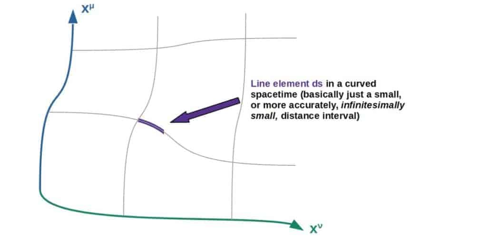

I’d recommend not getting hung up on these mathematical details.

I’ve written this article in such a way that you can understand the meaning of all the equations without knowing much about the math involved.

**Recommendation**: If you are interested in diving more into the mathematical details, you can read my **full guide to the metric tensor [here](https://profoundphysics.com/metric-tensor-a-complete-guide-with-examples/)**. I’ve also included some more details in the foldable example boxes below – these are completely optional, but highly recommended for a deeper understanding of the math.

How Does The Above Equation Generalize The Pythagorean Theorem? (click to see more)

Typically, the distance between two points (or the square of the distance) is found by using the **Pythagorean theorem**.

For example, in three-dimensional Cartesian coordinates, the distance from the origin to some point (x,y,z) would be:

$$s^2=x^2+y^2+z^2$$

The line element is then simply:

$$ds^2=dx^2+dy^2+dz^2$$

We could write this in a more compact way (where both i and j are summed over from 1 to 3):

$$ds^2=\delta_{ij}dx^idx^j$$

Now, what does this expression really mean? This symbol δij is the Kronecker delta, which is defined as 0 if i≠j and 1 if i=j. Or equivalently, we could write it as a matrix like this:

$$\delta_{ij}=\begin{pmatrix}1&0&0\\0&1&0\\0&0&1\end{pmatrix}$$

If you then write out the sum above:

$$ds^2=\delta_{ij}dx^idx^j=\delta_{11}dx^1dx^1+\delta_{12}dx^1dx^2+\delta_{13}dx^1dx^3+\delta_{21}dx^2dx^1+...+\delta_{33}dx^3dx^3$$

Note that these numbers are NOT exponents, they are simply indices that are placed in the upstairs position.

If we define these dx’s (our coordinates) as the usual Cartesian coordinates (dx1=x, dx2=y, dx3=z) and then insert all the components of the Kronecker delta (meaning δij=0 if i≠j and δij=1 if i=j), we recover the usual Pythagorean theorem:

$$ds^2=\delta_{ij}dx^idx^j=dx^2+dy^2+dz^2$$

The point here is that by using the Kronecker delta and these “coordinate displacements” dx’s and summing over them, we now have **a more compact and general way to express the Pythagorean theorem** i.e. the distance between two points.

It turns out that **the Pythagorean theorem does not work anymore if we have a curved space** (like we may have in general relativity). To generalize this to curved spaces also (for any possible space really) all we do is **replace the Kronecker delta with a metric** (the metric, of course, will depend on the space you’re in):

$$ds^2=g_{ij}dx^idx^j$$

In general relativity, the commonly used convention is that *spacetime* coordinates are represented by **Greek indices** instead of the ordinary Latin letters. These Greek indices always **run from 0 to 3** (in general relativity, at least) instead of 1 to 3 like we had earlier.

We then have a generalized form of the Pythagorean theorem that works also in a curved spacetime, which we call the **line element** of a metric:

$$ds^2=g_{\mu\nu}dx^{\mu}dx^{\nu}$$

The metric tensor also has an interesting geometric interpretation.

Fundamentally, **the metric is defined as the dot product between basis vectors**:

$$g_{\mu\nu}=\vec e_{\mu}\cdot \vec e_{\nu}$$

This definition is not a very practical one in physics, but it does tell you about what the metric geometrically represents.

What Are Basis Vectors? A Quick Explanation (click to see more)

Essentially, every coordinate system you can have also has a set of **basis vectors**.

These are kind of like the building blocks of a coordinate system, meaning that all other vectors, tensors and everything else can be built from these basis vectors.

The most typical example of basis vectors are the usual **Cartesian coordinate basis vectors î and ĵ** (where î is the basis vector in the x-direction and ĵ correspondingly in the y-direction).

Then any vector in the two-dimensional x,y -coordinate system can be expressed as a sum of its components and these basis vectors:

$$\vec{V}=V^x\overline{\text{i}}+V^y\overline{\text{j}}$$

A great explanation of basis vectors can be found from this video:

Generally, any coordinate system, even a curved one, has a set of basis vectors, which we denote by e’s. In a four-dimensional spacetime, **the basis vectors are denoted by e’s with Greek indices**, such as eµ (where µ corresponds to the spacetime directions 0,1,2 or 3 and eµ is then the basis vector in that direction).

So, all coordinate systems are built from basis vectors and in general relativity, these basis may or may not be constant, depending on whether a spacetime happens to be curved or not.

Still, any vector (even in curved coordinates) can be represented as a sum of its components and the basis vectors:

$$\vec{V}=V^{\mu}e_{\mu}$$

Here we are using the **Einstein summation convention**, which says that whenever you see a repeated index in both the upstairs and downstairs position, that index has to be summed over (generally from 0 to 3, if they’re Greek indices).

Let’s think about what the dot product really represents.

It essentially tells you **how much two vectors are aligned** or how much of the vectors are going in the same direction. I discuss this idea in great detail in the context of its physics in [this article on the physical meaning of the dot product](https://profoundphysics.com/dot-product-in-physics-what-is-the-physical-meaning-of-it/).

So, in other words, **the metric tensor really gives a measurement of how much the basis vectors align with each other**.

This is actually enough to define a notion of distance in any arbitrary coordinate system or spacetime, even a curved one.

Usually though, when we think of basis vectors, they are orthogonal to each other (they are at 90° angles to each other).

This definition really only works in “ordinary” space, which is not curved (Euclidian space) and more generally, **in a curved space, the basis vectors may be pointing in totally arbitrary directions**.

The metric tensor then simply gives a measure of **how the basis vectors are aligned**, which is enough to determine the geometry of the space itself.

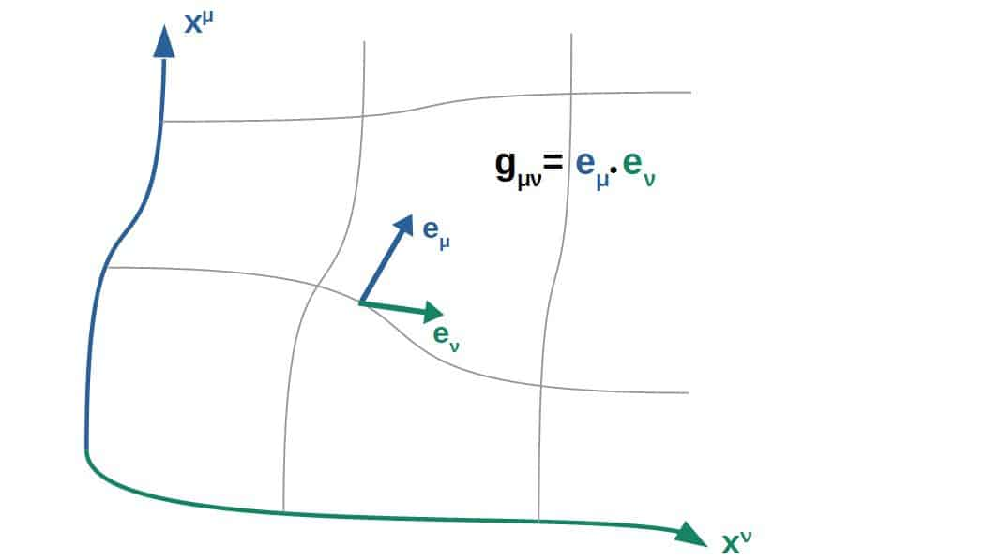

The metric tensor (in 4-dimensional spacetime) can be represented as a 4×4 (symmetric) matrix as shown down below.

Typically in general relativity, **the metric is written in terms of its line element**, ds2, by writing out the sum (see the formula from earlier). We’ll see how this works in practice later on.

$$g_{\mu\nu}=\begin{pmatrix}g_{00}&g_{01}&g_{02}&g_{03}\\g_{10}&g_{11}&g_{12}&g_{13}\\g_{20}&g_{21}&g_{22}&g_{23}\\g_{30}&g_{31}&g_{32}&g_{33}\end{pmatrix}$$

Components of the metric represented as a matrix (basically just a 4×4 “table”). Note that the metric is generally *symmetric*, meaning g01=g10, g21=g12 etc.

Practical Example: Metric Tensor and Line Element in Spherical Coordinates

For this example, we want to find out what the metric and its line element looks like when represented in spherical coordinates.

This, we will do in 3-dimensional space as purely a mathematical example, so there is no time coordinate, only the 3 spacial coordinates.

The way this is done is by using spherical coordinates (r,θ,φ), which are related to the usual x,y,z coordinates like this:

$$x=r\cos\varphi\sin\theta\\y=r\sin\varphi\sin\theta\\z=r\cos\theta$$

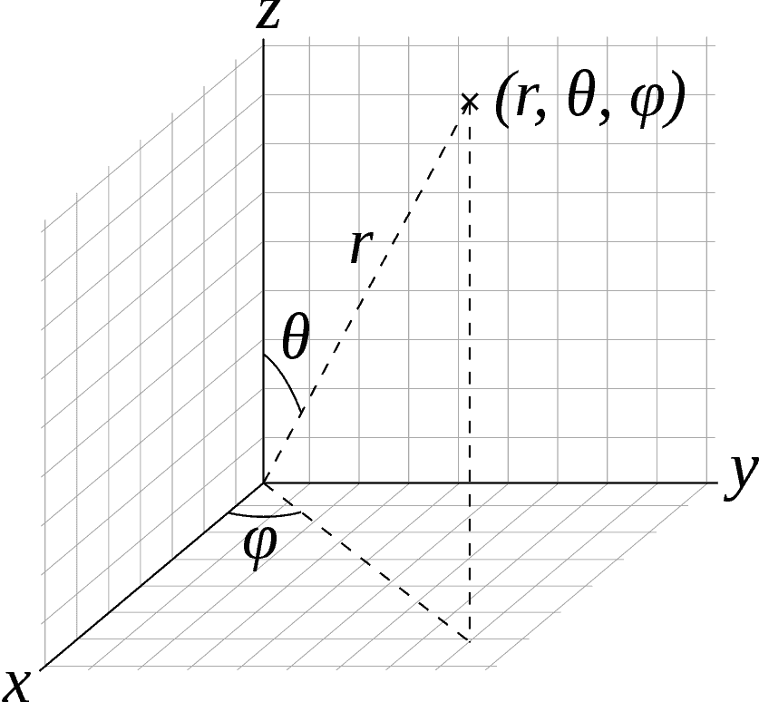

Image source: [Andeggs, Public domain, via Wikimedia Commons](https://commons.wikimedia.org/wiki/File:3D_Spherical.svg).

The metric in spherical coordinates written in its matrix form is as follows (in this example, it is a 3×3 matrix since we are only looking at the spacial components):

$$g_{mn}=\begin{pmatrix}1&0&0\\0&r^2&0\\0&0&r^2\sin^2\theta\end{pmatrix}$$

We want to, however, write the metric in its line element form, which we can do by simply using this formula:

$$ds^2=g_{mn}dx^mdx^n$$

By writing out the sum over both m and n here, we have (also note that these numbers in the coordinate displacements, dx’s, are NOT exponents, they are just indices put in the upstairs position. The 2 in the ds2, however, IS an exponent):

$$ds^2=g_{mn}dx^mdx^n=g_{11}dx^1dx^1+g_{12}dx^1dx^2+g_{13}dx^1dx^3+g_{21}dx^2dx^1+...+g_{33}dx^3dx^3$$

From the metric, we can see that all the off-diagonal elements are zero, so the only contributions to this sum come from the components which have m=n:

$$ds^2=g_{11}dx^1dx^1+g_{22}dx^2dx^2+g_{33}dx^3dx^3$$

If we now pick out these particular components of the metric and then define our coordinate displacements (dx’s) as the ones used in spherical coordinates, we get the line element in spherical coordinates to be:

$$g_{11}=1{,}\ g_{22}=r^2{,}\ g_{33}=r^2\sin^2\theta\\dx^1=dr{,}\ dx^2=d\theta{,}\ dx^3=d\varphi\\ds^2=g_{11}dx^1dx^1+g_{22}dx^2dx^2+g_{33}dx^3dx^3=1\cdot dr\cdot dr+r^2\cdot d\theta\cdot d\theta+r^2\sin^2\theta\cdot d\varphi\cdot d\varphi\\\Rightarrow\ \ ds^2=dr^2+r^2d\theta^2+r^2\sin^2\theta d\varphi^2$$

The metric tensor is also used to define things like **volume in curved spacetime**, but this is really not too important right now.

Also, you may now be asking; sure, the metric tensor seems important in general relativity, **but how do we actually find out what the metric is in a given spacetime**?

The answer to this is by **solving the Einstein field equations**, which we will look at later on.

```
If you're interested to learn how the metric tensor is actually for physical applications, I'd highly recommend reading this article. In there, I discuss how the metric is used to analyze time dilation near a black hole, which actually has an extremely interesting geometric interpretation.
```

## Christoffel Symbols & Their Geometric Meaning

The next important concept we’ll look at are the **Christoffel symbols**, which come up in the geodesic equation and in describing spacetime curvature (both which we will talk about in more detail later).

**Christoffel symbols are mathematical objects that describe how basis vectors change in a coordinate system. In general relativity, Christoffel symbols describe changes in the metric throughout spacetime and therefore, they describe the acceleration experienced by an observer in a gravitational field.**

There are essentially *two ways* to define the Christoffel symbols.

**The first definition is a more geometric definition as the derivatives of basis vectors**.

This helps to understand what exactly the Christoffel symbols tell us about the structure of a space itself (or more accurately, the structure of the coordinate system you happen to be using):

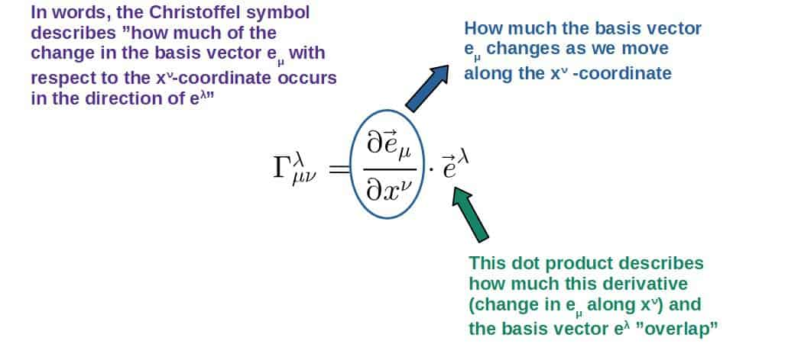

Down below, I’ve got a nice visual example of what these different Christoffel symbol components really represent.

The key point here is that **the Christoffel symbols encode information about how the basis vectors change throughout spacetime**.

This then is necessary to describe spacetime curvature (though to completely describe curvature, we’ll need a little bit more than just these Christoffel symbols).

What Do The Christoffel Symbol Components Geometrically Represent? (click to see more)

To see what exactly the geometric meaning of the different components of the Christoffel symbols are, we’ll do a simple example.

Let’s say we have some **arbitrarily curved coordinate system with the coordinate axes x1 and x2** (you can think of these as x and y if you wish; just note that coordinate axes don’t necessarily have to be perpendicular to each other) **with the basis vector in the x1-direction being labeled e1 and similarly, e2 is the basis vector in the x2-direction** (don’t pay any attention to whether the index is upstairs or downstairs; the purpose of this example is only to get some geometric intuition).

**Now we will move along the x1-axis and see how the basis vector e2 changes**. The change in a vector along a coordinate axis is simply the (partial) derivative with respect to that particular coordinate. Here’s what we have in a picture form:

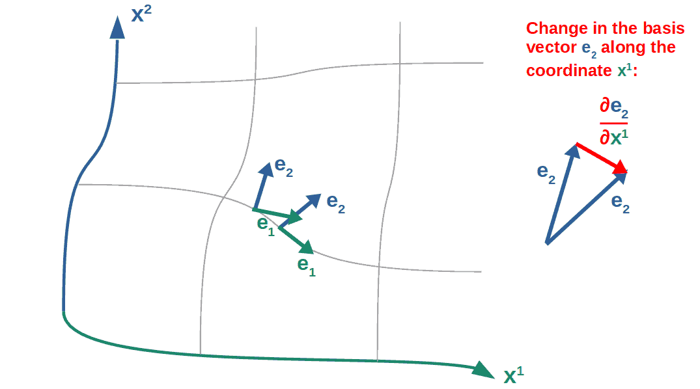

To avoid clutter, I’ve dropped the vector signs above these basis vectors.

This derivative vector (the red vector in the picture) can also **be divided into its components along the x1 and x2 axes**.

This is done by **taking the dot product of this red vector with the different basis vectors** (in general, any single component of a vector can be calculated like this; for example, the y-component of an ordinary velocity vector is the dot product of the total velocity vector with the unit vector in the y-direction). These are the components of the Christoffel symbols (again, don’t pay much attention to the upstairs and downstairs index placement):


In other words, **Christoffel symbols geometrically represent different components of the derivatives of basis vectors**. In general relativity, this is represented by greek indices (which run from 0 to 3) in spacetime as:

$$\Gamma_{\mu\nu}^{\lambda}=\frac{\partial\vec{e}_{\mu}}{\partial x^{\nu}}\cdot\vec{e}^{\lambda}$$

Now, **the second way of defining Christoffel symbols can be done by using the metric tensor** (this definition is much more useful in general relativity).

In other words, if we know the metric in a given spacetime, the Christoffel symbols can then be calculated by the formula given below.

```
Christoffel symbols in terms of the metric tensor:  
  

$$\Gamma_{\mu\nu}^{\lambda}=\frac{1}{2}g^{\lambda\alpha}\left(\partial_{\mu}g_{\alpha\nu}+\partial_{\nu}g_{\alpha\mu}-\partial_{\alpha}g_{\mu\nu}\right)$$
```

Practical Example: How To Calculate Christoffel Symbols From The Metric (click to see more)

For this example, we will calculate the Christoffel symbols in spherical coordinates by using the metric tensor represented in spherical coordinates, respectively, which we looked at earlier (we’re again looking at the metric in only 3 spacial coordinates and the convention is to use *latin indices for the spacial components* and *greek indices for spacetime components*; the calculation for spacetime components follows exactly the same process though):

$$g_{mn}=\begin{pmatrix}1&0&0\\0&r^2&0\\0&0&r^2\sin^2\theta\end{pmatrix}$$

The definition for the Christoffel symbols are then:

$$\Gamma_{mn}^k=\frac{1}{2}g^{ka}\left(\partial_mg_{an}+\partial_ng_{am}-\partial_ag_{mn}\right)$$

Here, the index a is being summed over since it is repeated in the lower and upstairs positions (remember the Einstein summation convention!).

Now, we know that all the off-diagonal elements of the metric are zero, so the only metric components are those that have the form g11, g22 or g33 (and likewise for the downstairs indices). Therefore, the only non-zero Christoffel symbols are those which have k=a, which there are three of:

$$\Gamma_{mn}^1=\frac{1}{2}g^{11}\left(\partial_mg_{1n}+\partial_ng_{1m}-\partial_1g_{mn}\right)\\\Gamma_{mn}^2=\frac{1}{2}g^{22}\left(\partial_mg_{2n}+\partial_ng_{2m}-\partial_2g_{mn}\right)\\\Gamma_{mn}^3=\frac{1}{2}g^{33}\left(\partial_mg_{3n}+\partial_ng_{3m}-\partial_3g_{mn}\right)$$

Before we can calculate the Christoffel symbols, we’ll need to take note of the fact that we’re now working in spherical coordinates (r,θ,φ), so the partial derivative operator will also be with respect to these coordinates:

$$\partial_m=\begin{pmatrix}\partial_r\\\partial_{\theta}\\\partial_{\varphi}\end{pmatrix}$$

With the index notation, ∂1 will correspond to ∂r, ∂2=∂θ and ∂3=∂φ.

Also, the metric with upstairs indices is called the inverse metric and its components are simply the inverses of the downstairs metric:

$$g^{mn}=\frac{1}{g_{mn}}=\begin{pmatrix}1&0&0\\0&\frac{1}{r^2}&0\\0&0&\frac{1}{r^2\sin^2\theta}\end{pmatrix}$$

For this example, there are a also few properties we can take advantage of: ALL metric components that are not of the form gmm or gmm (both the indices being the same) will be zero. Secondly, all the Christoffel symbols of the form Γ11 (both the lower indices are 1) will be zero since the metric component g11 is a constant and thus, its derivatives are all zero.

With these in mind, we can now calculate the Christoffel symbols. Let’s start with the ones having k=1:

$$\Gamma_{mn}^1=\frac{1}{2}g^{11}\left(\partial_mg_{1n}+\partial_ng_{1m}-\partial_1g_{mn}\right)$$

What you’ll find by plugging in some values for m and n (remember they can both go from 1 to 3) is that there are only two non-zero Christoffel symbols, which are the ones with m=n=2 and m=n=3:

$$\Gamma_{22}^1=\frac{1}{2}g^{11}\left(\partial_2g_{12}+\partial_2g_{12}-\partial_1g_{22}\right)=-\frac{1}{2}g^{11}\partial_1g_{22}\\\Gamma_{33}^1=\frac{1}{2}g^{11}\left(\partial_3g_{13}+\partial_3g_{13}-\partial_1g_{33}\right)=-\frac{1}{2}g^{11}\partial_1g_{33}$$

Then, plugging in the components for the metrics and the derivatives, we get (the values are g11=1, ∂1=∂r, g22=r2 and g33=r2sin2θ):

$$\Gamma_{33}^1=\frac{1}{2}g^{11}\left(\partial_3g_{13}+\partial_3g_{13}-\partial_1g_{33}\right)=-\frac{1}{2}g^{11}\partial_1g_{33}\\\Gamma_{33}^1=-\frac{1}{2}g^{11}\partial_1g_{33}=-\frac{1}{2}\cdot1\cdot\partial_rr^2\sin^2\theta=-r\sin^2\theta$$

All the other components of the Christoffel symbol Γ1mn are zero. We can collect these into a nice matrix representation:

$$\Gamma_{mn}^1=\begin{pmatrix}0&0&0\\0&-r&0\\0&0&-r\sin^2\theta\end{pmatrix}$$

Hopefully that was clear enough. I’d highly recommend going through with trying to calculate all of these yourself, it’s a fantastic exercise in using this somewhat abstract tensor notation.

Anyway, let’s now do the Christoffel symbols Γ2mn. What you’ll find here is that there are three components that are non-zero, which are:

$$\Gamma_{12}^2=\frac{1}{2}g^{22}\left(\partial_1g_{22}+\partial_2g_{21}-\partial_2g_{12}\right)=\frac{1}{2}g^{22}\partial_1g_{22}=\frac{1}{2}\cdot\frac{1}{r^2}\cdot\partial_rr^2=\frac{1}{r}$$

$$\Gamma_{21}^2=\frac{1}{2}g^{22}\left(\partial_2g_{21}+\partial_1g_{22}-\partial_2g_{21}\right)=\frac{1}{2}g^{22}\partial_1g_{22}=\frac{1}{r}\\\Gamma_{33}^2=\frac{1}{2}g^{22}\left(\partial_3g_{23}+\partial_3g_{23}-\partial_2g_{33}\right)=-\frac{1}{2}g^{22}\partial_2g_{33}=-\frac{1}{2}\cdot\frac{1}{r^2}\cdot\partial_{\theta}r^2\sin^2\theta=-\sin\theta\cos\theta$$

These we can also collect into a matrix (all the other ones except the ones above are zero):

$$\Gamma_{mn}^2=\begin{pmatrix}0&\frac{1}{r}&0\\\frac{1}{r}&0&0\\0&0&-\sin\theta\cos\theta\end{pmatrix}$$

The last ones are the Christoffel symbols Γ3mn, which there are four of (all the other ones are zero):

$$\Gamma_{13}^3=\frac{1}{2}g^{33}\left(\partial_1g_{33}+\partial_3g_{31}-\partial_3g_{13}\right)=\frac{1}{2}g^{33}\partial_1g_{33}=\frac{1}{2}\cdot\frac{1}{r^2\sin^2\theta}\cdot\partial_rr^2\sin^2\theta=\frac{1}{r}\\\Gamma_{23}^3=\frac{1}{2}g^{33}\left(\partial_2g_{33}+\partial_3g_{32}-\partial_3g_{23}\right)=\frac{1}{2}g^{33}\partial_2g_{33}=\frac{1}{2}\cdot\frac{1}{r^2\sin^2\theta}\cdot\partial_{\theta}r^2\sin^2\theta=\frac{\cos\theta}{\sin\theta}=\cot\theta\\\Gamma_{31}^3=\frac{1}{2}g^{33}\left(\partial_3g_{31}+\partial_1g_{33}-\partial_3g_{31}\right)=\frac{1}{2}g^{33}\partial_1g_{33}=\frac{1}{2}\cdot\frac{1}{r^2\sin^2\theta}\cdot\partial_rr^2\sin^2\theta=\frac{1}{r}\\\Gamma_{32}^3=\frac{1}{2}g^{33}\left(\partial_3g_{32}+\partial_2g_{33}-\partial_3g_{32}\right)=\frac{1}{2}g^{33}\partial_2g_{33}=\frac{1}{2}\cdot\frac{1}{r^2\sin^2\theta}\cdot\partial_{\theta}r^2\sin^2\theta=\frac{\cos\theta}{\sin\theta}=\cot\theta$$

These can also be put into a matrix form:

$$\Gamma_{mn}^3=\begin{pmatrix}0&0&\frac{1}{r}\\0&0&\cot\theta\\\frac{1}{r}&\cot\theta&0\end{pmatrix}$$

All in all, we then have all the Christoffel symbols in spherical coordinates:

$$\Gamma_{mn}^1=\begin{pmatrix}0&0&0\\0&-r&0\\0&0&-r\sin^2\theta\end{pmatrix}\\\Gamma_{mn}^2=\begin{pmatrix}0&\frac{1}{r}&0\\\frac{1}{r}&0&0\\0&0&-\sin\theta\cos\theta\end{pmatrix}\\\Gamma_{mn}^3=\begin{pmatrix}0&0&\frac{1}{r}\\0&0&\cot\theta\\\frac{1}{r}&\cot\theta&0\end{pmatrix}$$

```
If you're interested, I actually have a whole article discussing various properties of the Christoffel symbols, which you'll find here. In there, I go into much more detail on the geometry of the Christoffel symbols as well as how to calculate them in practice through a little-known but extremely powerful method.
```

Now, some people like to think of the Christoffel symbols only as mathematical tools that are used in calculations without any real physical meaning.

This may seem so because they are not actually tensors, that is, they are not properly covariant like we would want the laws of physics to be.

This, however, is not necessarily true and the **Christoffel symbols can actually be thought to have a physical meaning as well**.

### What Is The Physical Meaning of The Christoffel Symbols?

Christoffel symbols play a key role in the mathematics of general relativity, but do they have some kind of physical interpretation as well?

**Physically, Christoffel symbols can be interpreted as describing fictitious forces arising from a non-inertial reference frame. In general relativity, Christoffel symbols represent gravitational forces as they describe how the gravitational potential (metric) varies throughout spacetime causing objects to accelerate.**

To understand this a little better in the context of gravity, we need to first think of how a gravitational field is *defined* or how its effects can be measured in the first place.

**A gravitational field is described by the acceleration (or force) an object would experience if it were to be placed in the field**.

Now, Christoffel symbols, on the other hand, describe changes in basis vectors throughout a given coordinate system (as discussed earlier).

Physically, this actually corresponds to what are called **fictitious forces** (these are simply “forces” or acceleration effects that can only be observed in a specific frame of reference or coordinate system).

The interesting thing about this is that actually, **gravity is a “fictitious force” in general relativity**, which is caused by *spacetime itself* being curved in the presence of matter and energy.

Since the Christoffel symbols describe these “fictitious forces” (which are simply just the effect of a basis not being constant in some coordinate system), this means that **Christoffel symbols play the role of describing how objects accelerate in a curved spacetime**.

This indeed corresponds to the Christoffel symbols actually describing gravitational fields in general relativity. In fact, **Christoffel symbols *are* gravitational fields in general relativity**.

Now, why is this actually the case? In my opinion, the easiest way to see this is by comparing the definition of the **Christoffel symbols in terms of the metric tensor** to the definition of a *gravitational field in Newtonian physics*.

In Newtonian gravity, the gravitational field (i.e. gravitational acceleration at each point in the field) is represented by a **vector field g**. This g is defined as the *negative gradient of the gravitational potential*:

$$\vec{g}=-\vec{\nabla}\Phi=-\partial_x\Phi \vec e_x-\partial_y\Phi \vec e_y-\partial_z\Phi \vec e_z$$

Here, I’ve written out the gradient vector and the e’s denote the basis vectors in each direction (x,y,z).

Let’s now compare this to the definition of the Christoffel symbol in terms of the metric. The key idea here is to note that **the metric itself represents the gravitational potential in general relativity**.

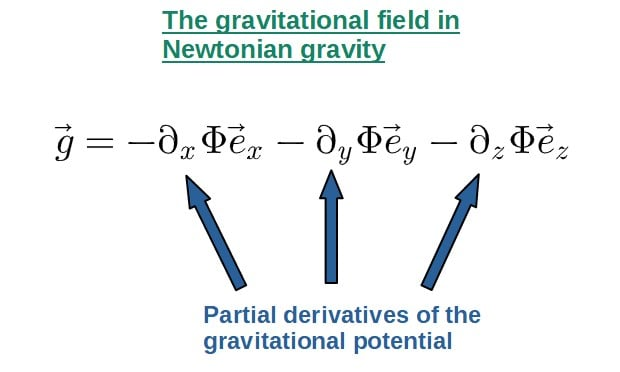

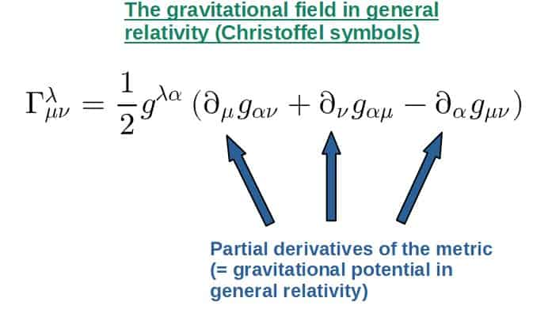

The link between the Christoffel symbols and the Newtonian gravitational field is the **weak-field limit**, in which the Christoffel symbols actually reduce pretty much exactly to the **Newtonian gravitational field**.

This can be seen nicely by looking at geodesics in the weak-field limit and the corresponding Christoffel symbols, which you can read more about in [this article](https://profoundphysics.com/christoffel-symbols-a-complete-guide-with-examples/).

Now, you may still be wondering; *if the Christoffel symbols are not tensors, how can they represent something physical*?

The answer is that **while the Christoffel symbols are not covariant quantities (tensors), they can still have a physical meaning**.

This idea is indeed quite puzzling, but essentially the answer is that **in general relativity, gravity itself is a coordinate-dependent phenomenon** (i.e. a “fictitious force”), but it still does have a physical meaning and so do the Christoffel symbols.

You’ll find more on this concept below.

How Can The Christoffel Symbols Represent Gravitational Fields Even Though They Aren't Tensors? (click to see more)

The important distinction is that “non-covariant” does not mean “non-physical”. We should not make the laws of physics from non-covariant quantities, but they can still have a physical meaning.

However, certain physical phenomena (in particular, *how those phenomena are observed*), can appear and be different in different coordinate systems (or in more physical terms, they can depend on who is observing them).

As an example, time in relativity is relative like you’ve probably heard, yet it still certainly has a “physical meaning”. It just doesn’t have a universal definition and different observers may observe it differently (this is true even in Newtonian physics).

The same goes for the Christoffel symbols. They can indeed represent a physical gravitational field, but we just have to keep in mind that **different observers may observe the gravitational field differently**.

Really this all comes down to the equivalence principle. Let’s say we were to observe a given gravitational field from a **freely-falling reference frame** (i.e. from an observer’s perspective who is just following a geodesic through spacetime).

You can think of this frame as simply the coordinate system, which someone falling freely towards the Earth, for example, would use (by free-fall, I’m referring to something being only influenced by gravity and no other forces).

Now, this observer in the freely-falling frame would actually **not observe a gravitational force at all** (if you’re just falling to the ground, you don’t *feel* any force acting on you; gravity is only felt through the effect of the normal force of the ground pushing you *against* gravity).

Thus, **in the *free-fall* coordinate system there would not even appear to be a gravitational field present**.

On the other hand, someone standing on the ground would certainly observe the person falling towards the Earth to be in accelerated motion and they would observe there being a gravitational field of some sort.

So, here we see a clear example of **gravity as a fictitious force** (a force caused by a particular reference frame). Namely, someone moving along a geodesic through spacetime would not observe a gravitational field, but someone else in some other coordinate system would observe the first observer being accelerated in a gravitational field.

The bottom line here is that **different observers may describe a gravitational field (Christoffel symbols) differently depending on the particular coordinate system they use**. The gravitational field is still a physical thing, it just does not have a universal meaning for everyone.

Now, there are actually universal effects of gravity that are NOT coordinate-dependent and these distinguish a gravitational field from just simple acceleration. These effects are called **tidal forces**.

In general relativity, **tidal forces are equated to the curvature of spacetime** and the curvature of a space is a coordinate-independent thing. Therefore, while a gravitational field (the Christoffel symbols) can vanish in some coordinate system, the curvature of spacetime (tidal forces) cannot.

These tidal effects of gravity are, in general relativity, described by different kinds of **curvature tensors** (such as the Riemann tensor) instead of just the Christoffel symbols.

Now, it’s worth noting that you shouldn’t take this idea too literally all of the time. In many cases, especially in *flat spacetimes,* the Christoffel symbols won’t necessarily represent anything to do with gravity.

In these cases, the Christoffel symbols will generally represent some kind of **fictitious forces** induced by a non-inertial coordinate system.

For example, in a *rotating* coordinate system (but in flat spacetime), the Christoffel symbols actually have the physical interpretation of the **centrifugal force and the Coriolis force**, but nothing to do with gravity.

It is only in **curved spacetime** that the Christoffel symbols MAY happen to have a nice interpretation of a gravitational force.

[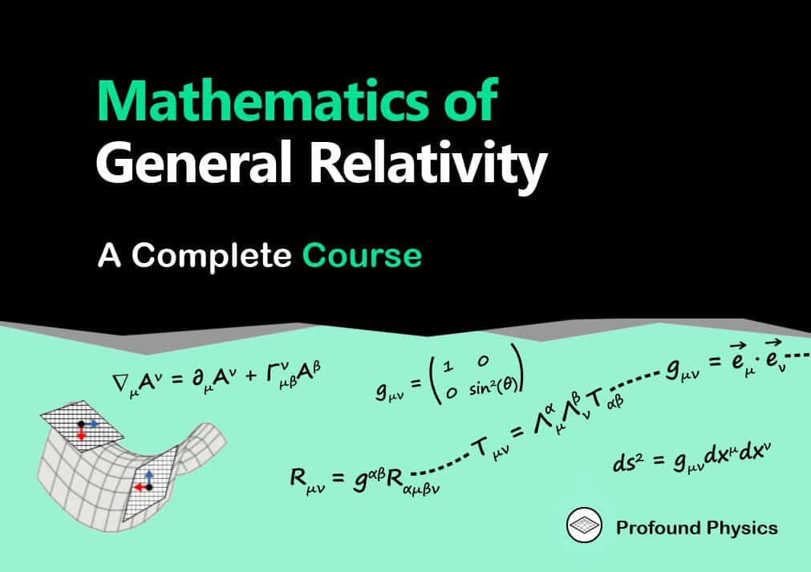](https://courses.profoundphysics.com/p/mathematics-of-general-relativity) 

My **Mathematics of General Relativity** -course will teach you all the math you need for a deep understanding of general relativity. You’ll find more information [here](https://courses.profoundphysics.com/p/mathematics-of-general-relativity).

### The Covariant Derivative

Pretty much all the known laws of physics are described by *differential equations*. Arguably then, derivatives and differentiating vectors and tensors is very important.

But do derivatives work differently in a curved spacetime or in curved coordinates?

The answer is yes, which has to do with the basis vectors changing from place to place (if you have some arbitrary curved coordinates, the basis vectors will be different at different points).

A derivative describes the change in a vector (or tensor) with respect to some coordinate.

In a curved coordinate system, apart from the components of the vector changing because they are functions of the coordinates, ***the coordinates themselves may change***.

To account for this, we use the so-called **covariant derivative, which is the generalization of an ordinary derivative that works in ANY coordinate system** (given that the coordinates are continuous).

```
Covariant derivative of a vector Aλ:  
  

$$\nabla_{\mu}A^{\lambda}=\partial_{\mu}A^{\lambda}+\Gamma_{\mu\nu}^{\lambda}A^{\nu}$$
```

In general relativity, since we are dealing with curved spacetime and curved coordinates, the ordinary derivative is not very useful since the coordinates themselves are changing.

The covariant derivative fixes that since it takes into account these coordinate changes as well.

Therefore, **we should use covariant derivatives if we’re dealing with curved spaces** (although there are some exceptions where ordinary derivatives work fine in curved spaces too).

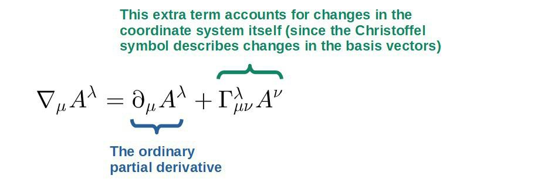

Where Does The Covariant Derivative Actually Come From? (click to see more)

Let’s look at taking a (partial) derivative of a vector A. Now, we know that a vector in Cartesian coordinates can be expressed as simply the sum of its components and the basis vectors:

$$\vec{A}=A^x\vec e_x+A^y\vec e_y+A^z\vec e_z$$

In general, any vector can be expressed like this in any coordinate system:

$$\vec{A}=A^{\lambda}\vec{e}_{\lambda}$$

Here, the index λ is being summed over (from 0 to 3 in spacetime, but this works for any number of dimensions) and the e’s represent the basis vectors.

Let’s now take the derivative of this with respect to some coordinate xµ (here the basis vectors may change, so we have to use the product rule):

$$\frac{\partial\vec{A}}{\partial x^{\mu}}=\frac{\partial}{\partial x^{\mu}}\left(A^{\lambda}\vec{e}_{\lambda}\right)=\vec{e}_{\lambda}\frac{\partial A^{\lambda}}{\partial x^{\mu}}+A^{\lambda}\frac{\partial\vec{e}_{\lambda}}{\partial x^{\mu}}$$

Let’s now think about the definition of the Christoffel symbols again in terms of the basis vectors:

$$\Gamma_{\mu\nu}^{\lambda}=\frac{\partial\vec{e}_{\mu}}{\partial x^{\nu}}\cdot\vec{e}^{\lambda}$$

Let’s multiply both sides by the basis vector eλ. You can think of the basis vectors eλ and eλ “cancelling” from the right-hand side since they are sort of like inverses of one another (in a very non-rigorous way). We then have:

$$\Gamma_{\mu\nu}^{\lambda}\vec{e}_{\lambda}=\frac{\partial\vec{e}_{\mu}}{\partial x^{\nu}}$$

Let’s switch around these indices a bit, so that they match with what we have in the above expression for the derivative:

$$\Gamma_{\mu\nu}^{\lambda}\vec{e}_{\lambda}=\frac{\partial\vec{e}_{\mu}}{\partial x^{\nu}}\ \ \Rightarrow\ \ \Gamma_{\lambda\mu}^{\nu}\vec{e}_{\nu}=\frac{\partial\vec{e}_{\lambda}}{\partial x^{\mu}}$$

Then, inserting this into the derivative expression, we get:

$$\frac{\partial\vec{A}}{\partial x^{\mu}}=\vec{e}_{\lambda}\frac{\partial A^{\lambda}}{\partial x^{\mu}}+A^{\lambda}\frac{\partial\vec{e}_{\lambda}}{\partial x^{\mu}}\ \ \ \ \parallel\frac{\partial\vec{e}_{\lambda}}{\partial x^{\mu}}=\Gamma_{\lambda\mu}^{\nu}\vec{e}_{\nu}\\\Rightarrow\ \ \frac{\partial\vec{A}}{\partial x^{\mu}}=\vec{e}_{\lambda}\frac{\partial A^{\lambda}}{\partial x^{\mu}}+A^{\lambda}\Gamma_{\lambda\mu}^{\nu}\vec{e}_{\nu}$$

Since both the indices ν and λ are being summed over, we’re free to change them to whatever we want (these are called “dummy” indices and you can label them as whatever you wish since they get summed over anyway). We will interchange the ν and λ -indices in the second term, which allows us to pull out the eλ‘s:

$$\frac{\partial\vec{A}}{\partial x^{\mu}}=\vec{e}_{\lambda}\frac{\partial A^{\lambda}}{\partial x^{\mu}}+A^{\lambda}\Gamma_{\lambda\mu}^{\nu}\vec{e}_{\nu}\ \ \left(\nu\leftrightarrow\lambda\right)\Rightarrow\ \ \frac{\partial\vec{A}}{\partial x^{\mu}}=\vec{e}_{\lambda}\frac{\partial A^{\lambda}}{\partial x^{\mu}}+A^{\nu}\Gamma_{\nu\mu}^{\lambda}\vec{e}_{\lambda}$$

$$\frac{\partial\vec{A}}{\partial x^{\mu}}=\vec{e}_{\lambda}\frac{\partial A^{\lambda}}{\partial x^{\mu}}+A^{\nu}\Gamma_{\nu\mu}^{\lambda}\vec{e}_{\lambda}=\left(\partial_{\mu}A^{\lambda}+\Gamma_{\nu\mu}^{\lambda}A^{\nu}\right)\vec{e}_{\lambda}$$

This thing in the parenthesis is defined as the covariant derivative:

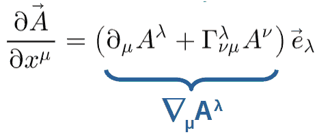

So, really the covariant derivative simply comes from the fact that the basis vectors are not constant in a curved spacetime.

In general relativity, the main use of the covariant derivative is that it’s a covariant version of the ordinary derivative (ordinary partial derivatives are NOT covariant in general).

This then means that it should replace ordinary derivatives when we’re dealing with curved spacetime.

In other words, to get properly covariant laws of physics, the process is really quite simple (most of the time); **you just replace all ordinary derivatives with covariant derivatives**.

A good example of using the covariant derivative to replace ordinary derivatives can be found down below.

Practical Example: Geodesic Equation From The Covariant Derivative (click to see more)

Now that we have the notion of a covariant derivative, let’s see how it can be used to describe the motion of objects in curved spacetime. In particular, we’ll see how the covariant derivative can be used to describe geodesics (which are discussed in more detail later in the article).

To do this, let’s consider the definition of a **directional derivative** (in simple Cartesian coordinates first):

$$\vec{v}\cdot\vec{\nabla}f=v^x\frac{\partial f}{\partial x}+v^y\frac{\partial f}{\partial y}+v^z\frac{\partial f}{\partial z}$$

This directional derivative tells you **the rate of change of the function f in the direction of the vector v**:

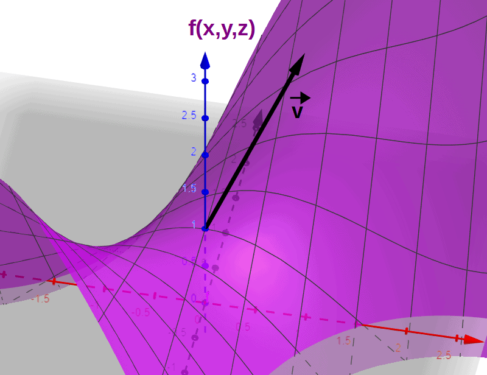

An important aspect of the directional derivative is that **if the directional derivative is zero, this means that the function f is constant in the direction of the vector v**.

Anyway, getting back to general relativity, we now wish to find a more general notion of the directional derivative that works in curved spacetime also. To do this, we simply replace the partial derivatives with covariant derivatives (also, we’ll look at this in four dimensions instead of three and use more general coordinates labeled 0,1,2,3 instead of the usual Cartesian coordinates):

$$v^x\frac{\partial f}{\partial x}+v^y\frac{\partial f}{\partial y}+v^z\frac{\partial f}{\partial z}\ \ \Rightarrow\ \ v^0\nabla_0f+v^1\nabla_1f+v^2\nabla_2f+v^3\nabla_3f$$

We can express this more compactly by using the Einstein summation rule (α is being summed over):

$$v^0\nabla_0f+v^1\nabla_1f+v^2\nabla_2f+v^3\nabla_3f=v^{\alpha}\nabla_{\alpha}f$$

This is a more general expression for the **directional derivative in curved spacetime**.

Relating this to physics, we’re interested in the rate of change of the 4-velocity of an object along the path that the object is travelling.

This means that we should take the **directional derivative of the 4-velocity in the direction of the 4-velocity** (intuitively, this just means that we’re looking at the rate of change of the 4-velocity in the direction of the 4-velocity itself, which means the direction of the object’s trajectory).

Now, a geodesic in general relativity is defined as a path in spacetime that follows the curvature of the spacetime itself (no external forces are present). This means that the change in 4-velocity is zero along the geodesic (physically, this is just the statement that “an observer does not experience any acceleration in free-fall”).

**The definition of a geodesic is then that the directional covariant derivative of the 4-velocity in the direction of the 4-velocity is zero**:

$$u^{\alpha}\nabla_{\alpha}u^{\mu}=0$$

Here, the u’s are denoting the 4-velocity, which has a time component (the 0-component, which is the velocity in the “time direction” i.e. how fast the object moves through time) and spacial components (the components 1 to 3, which represent the velocity in each spacial direction).

Now, we know the definition for the covariant derivative, so we can write this out in terms of the Christoffel symbols:

$$u^{\alpha}\nabla_{\alpha}u^{\mu}=u^{\alpha}\left(\partial_{\alpha}u^{\mu}+\Gamma_{\alpha\beta}^{\mu}u^{\beta}\right)=u^{\alpha}\partial_{\alpha}u^{\mu}+u^{\alpha}\Gamma_{\alpha\beta}^{\mu}u^{\beta}=0$$

Let’s now look at the first term here, which is uα∂αuµ. Let’s write out the uα -term (this is simply the 4-velocity, i.e. derivative of the spacetime coordinates with respect to proper time. You can read my [introduction to special relativity](https://profoundphysics.com/special-relativity-for-dummies-an-intuitive-introduction/) if you’re not familiar with this):

$$u^{\alpha}\partial_{\alpha}u^{\mu}=\frac{dx^{\alpha}}{d\tau}\frac{\partial u^{\mu}}{\partial x^{\alpha}}$$

This thing on the right-hand side is nothing but the derivative of the 4-velocity with respect to proper time. This is easier to see if we first take the derivative of the 4-velocity with respect to proper time by using the chain rule (we first differentiate the 4-velocity w.r.t the coordinates xα and then differentiate the coordinates w.r.t proper time; this is just basic chain rule from elementary calculus):

$$\frac{du^{\mu}}{d\tau}=\frac{dx^{\alpha}}{d\tau}\frac{\partial u^{\mu}}{\partial x^{\alpha}}$$

We can then write the term above by using this definition:

$$u^{\alpha}\partial_{\alpha}u^{\mu}=\frac{dx^{\alpha}}{d\tau}\frac{\partial u^{\mu}}{\partial x^{\alpha}}\ \ \ \ \left(\frac{dx^{\alpha}}{d\tau}\frac{\partial u^{\mu}}{\partial x^{\alpha}}=\frac{du^{\mu}}{d\tau}\right)\Rightarrow\ \ u^{\alpha}\partial_{\alpha}u^{\mu}=\frac{du^{\mu}}{d\tau}$$

The geodesic equation then, based on this, becomes:

$$u^{\alpha}\partial_{\alpha}u^{\mu}+u^{\alpha}\Gamma_{\alpha\beta}^{\mu}u^{\beta}=0\ \ \ \left(u^{\alpha}\partial_{\alpha}u^{\mu}=\frac{du^{\mu}}{d\tau}\right)\Rightarrow\ \ \frac{du^{\mu}}{d\tau}+u^{\alpha}\Gamma_{\alpha\beta}^{\mu}u^{\beta}=0$$

We then have the usual form of the geodesic equation (as shown earlier in the article) by just moving around a couple terms:

$$\frac{du^{\mu}}{d\tau}=-\Gamma_{\alpha\beta}^{\mu}u^{\alpha}u^{\beta}$$

Now, if you couldn’t follow the calculation in detail, that’s fine. The bottom line is really this; **a geodesic is defined as a spacetime trajectory along which the 4-velocity of an observer does not change (there is no acceleration in this observer’s reference frame)**.

Then, a mathematical formulation of this follows simply from the definition of the covariant derivative (or more accurately, a general form of the directional derivative). We will talk about geodesics in more detail later on.

## Curvature Tensors & How They Relate To Gravity in General Relativity

By now, it should be clear that **gravity is described by spacetime curvature in general relativity**.

The point of this section is to explain how spacetime curvature is actually described mathematically, which is by using different **curvature tensors**.

To give some insight into why the different curvature tensors have the form they have, it is important to understand that curvature fundamentally has to do with **second derivatives of the metric**.

The best way to intuitively think of this is by thinking of acceleration as the second derivative of position.

We already know that **gravity is closely related with acceleration**, so maybe gravity too has to do with second derivatives of something.

What makes this even more clear is that mathematically, the *curvature of a function* is also described by its second derivatives.

For example, the second derivative of a function f(x) being positive means that the function will “curve” upwards.

Now combine these with the notion of spacetime itself being described by a metric tensor.

This very strongly suggests that, indeed, spacetime curvature (and thus, gravity) should be described by **second derivatives of the metric**, which is what the different curvature tensors actually do include.

Down below, we will also take a look at **what exactly the different types of curvature tensors geometrically (and also physically) represent**, which should give some very interesting insights into these tensors.

We’ll also see how all of these will piece together to produce a beautiful theory of gravity.

**The most important tensors to describe spacetime curvature** are the following ones:

- **The Riemann tensor**: this tensor gives a complete description of any curved space and is really all that is needed to describe spacetime curvature completely. The Riemann tensor is built out of derivatives and products of Christoffel symbols (or written in terms of the metric, basically second derivatives and “squares” of the metric):

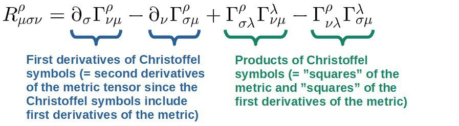

- **The Ricci tensor**: this tensor is built from the Riemann tensor, but it contains less information about the curvature. This tensor is, however, needed for general relativity and the Einstein field equations. Physically, the Ricci tensor describes how the *spacetime volume* of an object changes due to tidal forces (spacetime curvature). The Ricci tensor is mathematically defined as the *contracted Riemann tensor*:

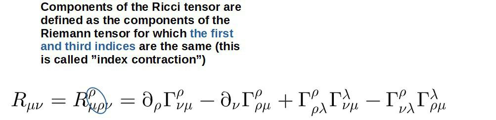

- **The Ricci scalar**: this tensor is actually a scalar (as the name may suggest), which is just a single number. Physically, the Ricci scalar describes the total change in the *spacetime volume* of an object (but does not give any information about the change in each direction specifically unlike the Ricci tensor). The Ricci scalar is the *contraction of the Ricci tensor*:

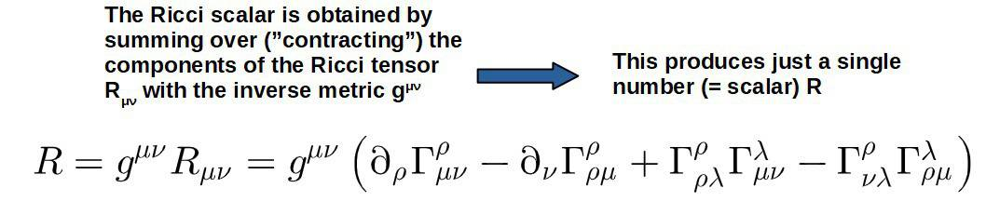

- **The Einstein Tensor**: this tensor shows up in the Einstein field equations and it is useful for simplifying the equations a little bit. The Einstein tensor does not have any particularly important physical meaning and in some sense, it is just a convenient simplification. The Einstein tensor is defined in terms of the Ricci tensor and the Ricci scalar:

$$G_{\mu\nu}=R_{\mu\nu}-\frac{1}{2}g_{\mu\nu}R$$

It’s worth noting that there are plenty more of these curvature tensors, such as the **Weyl tensor** and the **Kretschmann scalar** (which I’ll briefly explain later).

The tensors given above, however, are the most important ones for understanding the basics of general relativity.

### The Riemann & Ricci Tensors: What Do They Represent Geometrically and Physically?

The first and probably the most important tensor to describe the curvature of spacetime is the **Riemann curvature tensor**.

The Riemann tensor is enough to fully determine how any space is curved, but what does it actually represent geometrically?

**Geometrically, the Riemann tensor completely describes the curvature of any space and it represents how the components of a vector change due to curvature as it gets parallel transported around a loop. Physically, the Riemann tensor represents the effects of tidal forces due to gravity in general relativity.**

Visually, there is quite a nice way to see the geometric meaning of the Riemann tensor.

Imagine we have a vector that we move around some small loop in a curved spacetime (its length has to stay fixed, this is a fundamental physical requirement!).

Below I have a picture of this in two dimensions (since I can’t actually draw a four-dimensional spacetime).

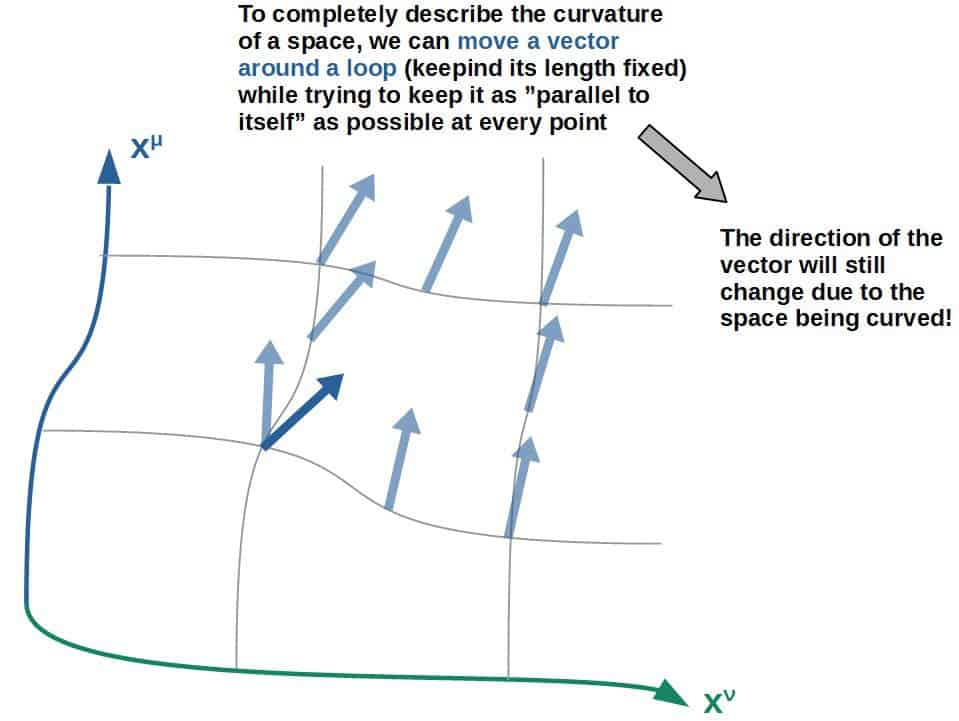

Technically, this spacetime is not really curved since it’s drawn on a *flat* two-dimensional computer screen. For the sake of intuition though, try to picture how this would look on a real curved surface (for example, a terrain with lots of hills and bumps).

**The Riemann curvature tensor then describes how the components of this vector change due to curvature** (this is, in fact, enough to fully describe the curvature of any space).

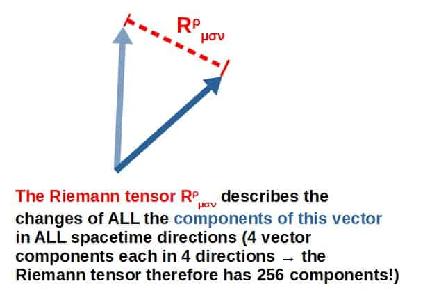

Down below you’ll find a more mathematical way to see where the Riemann tensor actually comes from, which should be enlightening.

Essentially, it is done by using covariant derivatives and a geometric method called **parallel transport**.

Also, physically the Riemann tensor corresponds to the **tidal tensor in Newtonian gravity**.

It is, in fact, the general relativistic equivalent of this tensor (this is explained in more detail later).

This means that **the physical content of the Riemann tensor is that it gives a complete description of tidal forces in general relativity**.

This relates right back to the beginning of this article, where we talked about tidal forces being the key to describing spacetime curvature.

Derivation of the Riemann Tensor From Parallel Transport (click to see more)

In ordinary vector mathematics, you’ve probably been taught that a vector can be moved around in space (while keeping its length and orientation fixed) and that it still remains the exact same vector.

For example, you could move a vector around a loop (in Euclidean space) and see that it, in fact, remains exactly in the same direction as you started with.

Another way to put it is that a vector will remain unchanged when *parallel transporting on flat spaces*. **On curved spaces, this is generally not true anymore.**

If you move a vector around a loop while keeping it parallel to itself at all times (this is called parallel transport), the vector will inevitably still change direction, because the space itself has some intrinsic curvature and everything has to move along the curvature of this space.

The way we can get a mathematical expression for this is by imagining we have some vector Aλ in some spacetime which may or may not be curved.

We then parallel transport it around a loop in two different ways (see the picture below): **first, we parallel transport it along the coordinate xν (path 1) and then along the other coordinate xµ (path 2)**. Then we do the same thing but in **opposite order** (so first along xµ, path 3 and then along xν, path 4).

Now, if we imagine this loop as being very very small (infinitesimally small, to be exact), then parallel transporting the vector will really correspond to **taking the covariant derivative with respect to that coordinate**.

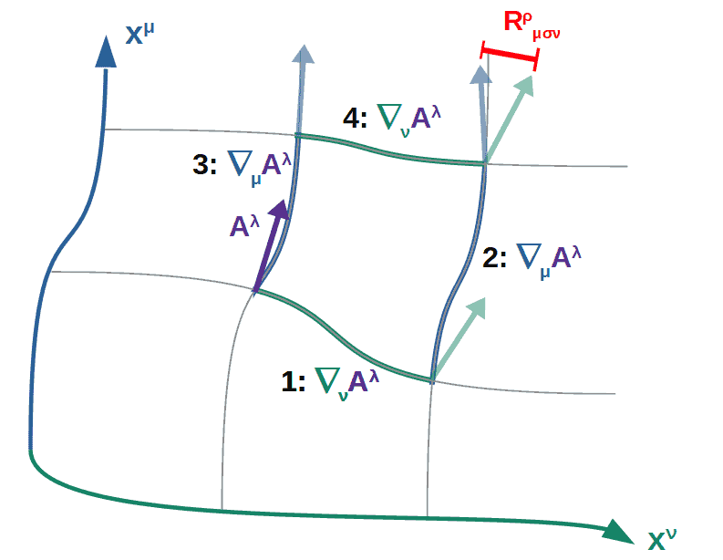

When we do this, we may or may not end up having the vector orient in the same direction by doing it both ways. In fact, **if the vector ends up pointing in a different direction when doing it along paths 1 and 2 than by along paths 3 and 4, then the space must indeed be curved** (since the vector will change its direction differently depending on how it’s moved around in the space).

So, the way we quantify this curvature is by first taking the covariant derivative of path 1 and then path 2 and seeing whether it is the same as the covariant derivative of path 3 and then 4 (see the picture above):

$$\nabla_{\nu}\nabla_{\mu}A^{\lambda}=\nabla_{\mu}\nabla_{\nu}A^{\lambda}\ \left(?\right)$$

Or moving everything to the left and factoring out the vector:

$$\left(\nabla_{\nu}\nabla_{\mu}-\nabla_{\mu}\nabla_{\nu}\right)A^{\lambda}=0\ \left(?\right)$$

Now, we know that **if the space IS flat, then the order of which path you parallel transport along first should not matter**. In other words, these double covariant derivatives should be equal and this difference should be zero:

$$\nabla_{\nu}\nabla_{\mu}-\nabla_{\mu}\nabla_{\nu}=0$$

I’ve now left out the vector Aλ since it obviously can’t be zero, so we don’t need it anymore in the above expression.

**If the space is NOT flat, then the order of which paths you take will matter** and this difference won’t be zero:

$$\nabla_{\nu}\nabla_{\mu}-\nabla_{\mu}\nabla_{\nu}\ne0$$

In other words, we now have a *quantity that is zero if the space is flat and non-zero if the space is curved*. This quantity is indeed the **Riemann tensor**:

$$R_{\mu\sigma\nu}^{\rho}=\nabla_{\nu}\nabla_{\mu}-\nabla_{\mu}\nabla_{\nu}$$

This expression may look a little weird since it has different indices on the left- and right-hand sides. This is because this expression doesn’t really make sense by itself since it’s the difference between derivatives and derivatives should always act on something. The indices will, however, work out to be just fine once you use this expression to act on a vector, for example, or write it out in terms of the Christoffel symbols.

If you were to write out all these covariant derivatives, you’d indeed get the same expression I showed earlier:

$$R_{\mu\sigma\nu}^{\rho}=\partial_{\sigma}\Gamma_{\mu\nu}^{\rho}-\partial_{\nu}\Gamma_{\mu\sigma}^{\rho}+\Gamma_{\sigma\lambda}^{\rho}\Gamma_{\mu\nu}^{\lambda}-\Gamma_{\nu\lambda}^{\rho}\Gamma_{\mu\sigma}^{\lambda}$$

The details here are not really important. The key thing here is that the Riemann tensor has a clear and intuitive geometric meaning in terms of parallel transporting a vector around two different paths and then comparing them. This gives a complete description of how the space may be curved.

The Ricci tensor and the Ricci scalar, on the other hand, have to do with changes in spacetime volume and they both have a very nice geometric interpretation.

**The geometric interpretation of the Ricci tensor is that it describes how much a volume between a group of geodesics changes in each direction due to curvature as one moves along these geodesics. The Ricci scalar describes the total volume change but doesn’t give information about any particular direction.**

In a very rudimentary sense, you can think of it like this; imagine you have a group of geodesics (essentially lines in spacetime).

These geodesics will then enclose some kind of volume in spacetime.

Geometrically, **the Ricci tensor then describes how much this spacetime volume changes as you move along these geodesics**.

The different components of the Ricci tensor correspond to the volume changes in **different spacetime directions**.

```
If you're interested, I actually have a whole article on the Ricci tensor where I discuss its geometric and physical meaning as well as some of its properties. I also include a bunch of examples of different Ricci tensors in different spacetimes.
```

Now, while I can’t really draw a proper four-dimensional spacetime, it’s still possible to visualize this in two dimensions, for example.

Imagine we have a two-dimensional spacetime with **two geodesics that enclose a volume between them** (practically it’s an area since we’re in two dimensions, but imagine it as a volume):

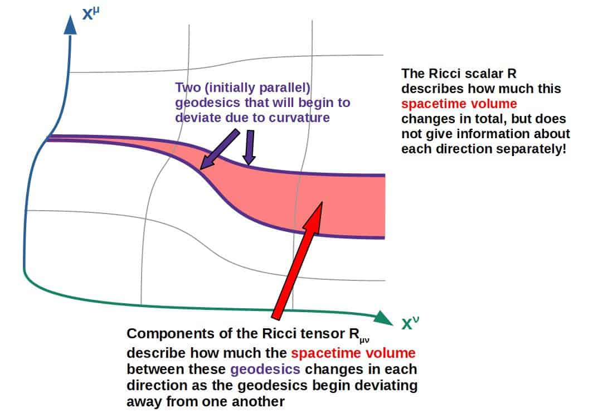

Now, the Ricci tensor is useful for describing curvature mathematically in general relativity, but does it also have a specific physical meaning?

**In short, the physical meaning of the Ricci tensor is that it describes how the spacetime volume of an object changes along a geodesic. Physically, the components of the Ricci tensor can be thought of as describing how much the spacetime volume of an object changes in each direction due to tidal forces.**

Let’s think of this in more detail. In particular, let’s think of a physical object with some well-defined volume (a ball for example).

In spacetime, *all the different parts of the object will follow their own geodesics through spacetime* (essentially, you can think of every atom of an object following its own spacetime geodesic).

Therefore, **if curvature is present, these geodesics may begin deviating from one another** and the spacetime volume between them will change.

Physically, this means that **the object will get stretched and squeezed** in different directions.

This squeezing and stretching, on the other hand, corresponds to the effect of **tidal forces**, which are simply the result of geodesic deviation (I’ll explain this in more detail later on).

So, **the physical description of the Ricci tensor is literally how much the volume of an object changes due to gravitational tidal forces**.

Also, note that the object gets deformed in *spacetime*, not just in the usual three-dimensional space, so the object will also get *stretched and squeezed in time*, which is called time dilation.

Similarly to the Ricci tensor, the Ricci scalar also has a clear physical meaning.

**The physical meaning of the Ricci scalar is that it describes how much the spacetime volume of an object moving along a geodesic changes due to tidal forces. Unlike the Ricci tensor, the Ricci scalar only describes the total change in volume, not the change in any particular direction in spacetime.**

## The Energy-Momentum Tensor

As you may know by now, gravity is described by spacetime curvature. But according to Newtonian physics, gravity is caused by mass, such as the mass of a planet.

So far, we have not talked about what actually causes gravity or the curvature of spacetime in general relativity.

The answer is a bit more complicated in general relativity than just mass.

**According to special relativity, mass is just another form of energy** (from E=mc2, which you can read more about in [this article](https://profoundphysics.com/special-relativity-for-dummies-an-intuitive-introduction/) like where this famous equation really comes from).

This then suggests that **gravity should really be caused by all types of energy** and not just this one special form of energy called mass.

Not only that, but it turns out that gravity is also caused by **energy fluxes** as well as **momentum fluxes**.

These are all describes by one mathematical object called the **energy-momentum tensor Tµν**.

The energy-momentum tensor tells us how **four-momentum flows through spacetime**.

Four-momentum in special relativity is a vector that combines both energy and momentum, which you can read about in [this special relativity article](https://profoundphysics.com/special-relativity-for-dummies-an-intuitive-introduction/) if you’re not familiar with the concept.

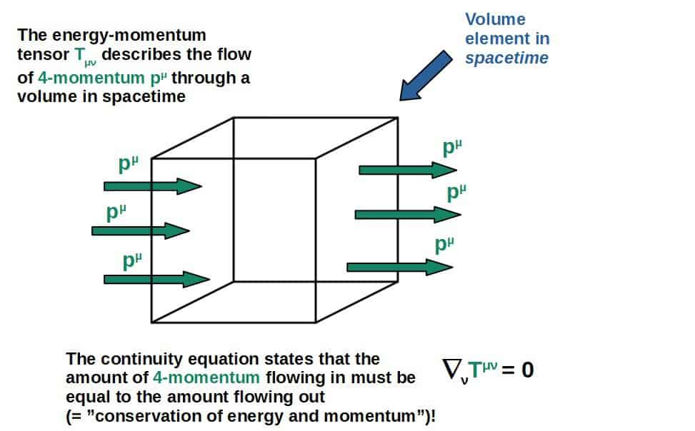

The continuity equation for the energy-momentum tensor, ∇νTµν=0 is the statement of energy and momentum conservation laws in general relativity.

The different components of the energy-momentum tensor therefore describe **how energy and momentum “flow through time”** (= energy and momentum density).

The energy-momentum tensor also describe **how they flow through space** (= energy flow, which is simply just momentum and momentum flow, which is closely related to forces like pressure and shear stress).

The components of the energy-momentum tensor can be nicely represented as a matrix:

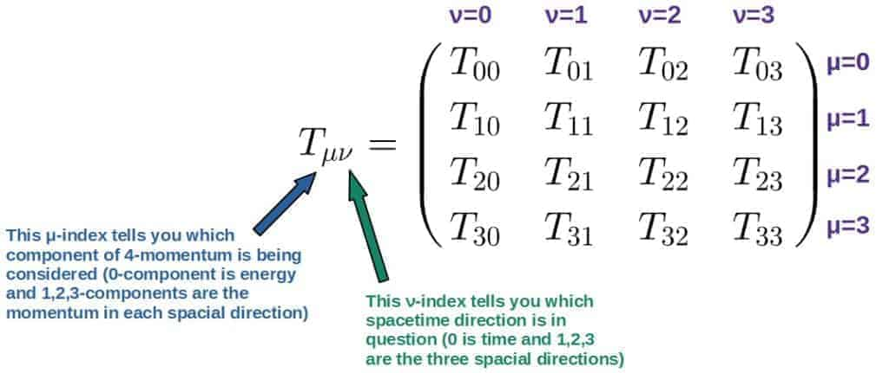 

Here, I’ve written the components by using the coordinates (t,x,y,z) instead of just (0,1,2,3) to make the meaning of these components easier to understand intuitively:

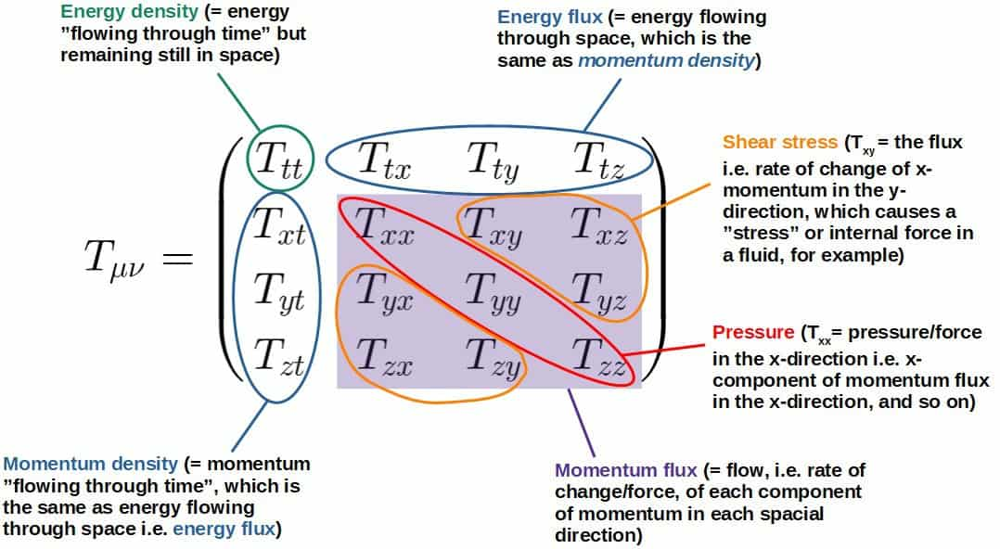

If you’re familiar with engineering mechanics, the purple part (the space-only components) is usually called the Cauchy stress tensor, which is used to study the elasticity of materials. In some sense, the energy-momentum tensor is just a relativistic extension of the Cauchy stress tensor.

Each of these components above can contribute to the curvature of spacetime (through the Einstein field equations) and thus, can cause gravity.

A noteworthy fact is that usually, the T00 -component (energy density, i.e. mass) is MUCH larger than any of the other components.

This may indeed be where **Newton’s observations of mass being the cause of gravity**, come from.

It simply wasn’t possible to deduce these other gravitational causes by just observing our solar system, so Newton did not include these in this gravitational law.

In most cases, these shear stress components will be zero (since it’s common to study objects that could be considered as “**perfect fluids**“, which don’t have any internal stresses).

The pressure components may sometimes play a role if we’re studying things like **stellar interiors** (the structure of stars, for example).

Practical Example: Energy-Momentum Tensor of a Perfect Fluid (click to see more)

**A very common source of energy-momentum (source of gravity) is a perfect fluid. Perfect fluids are those that have no internal pressures (shear stress) and no energy is flowing in or out of the fluid (energy fluxes are zero).**

Essentially, things like planets or stars are modeled as “perfect fluids”,which may seem weird to think of the Earth as a fluid, for example. Really, if you think about it, fluids and solids are not very different in the sense that they are both made of atoms and only differ by how much those atoms move due to heat.

Anyway, modeling a planet as a (spherical) perfect fluid is quite useful and it simply means that a planet is a fairly stable object since it doesn’t have shear stresses or weird energy fluxes.

Since perfect fluids do not have these stresses or energy fluxes, this means that **the shear stress components as well as the energy flux components are all zero**.

Moreover, **the pressure in a perfect fluid should be the same in all directions** (because otherwise the fluid would get deformed, which wouldn’t be very useful to model something like a planet).

This we can denote by just a single number p and so we have the pressure components as:

$$T_{11}=T_{22}=T_{33}=p$$

**A perfect fluid also has the same density everywhere**, so the energy density, T00, we can simply denote as ρ. The energy-momentum tensor is therefore in its matrix form:

$$T_{\mu\nu}=\begin{pmatrix}\rho&0&0&0\\0&p&0&0\\0&0&p&0\\0&0&0&p\end{pmatrix}$$

It’s also possible to derive an expression for this in terms of the four-velocity of the fluid, which you may see more commonly used:

$$T_{\mu\nu}=\left(\rho+\frac{p}{c^2}\right)u_{\mu}u_{\nu}+pg_{\mu\nu}$$

An incredibly important application of the perfect fluid energy-momentum tensor can be found in cosmology – in fact, the matter content of our universe on a large scale is described by this energy-momentum tensor.

In case you’re interested to learn more about this and for example, how this leads to the expansion of the universe, I recommend reading [this article on Friedmann cosmology and the Friedmann equations](https://profoundphysics.com/the-friedmann-equations-explained-a-complete-guide/).

If you’re interested in building a **stronger mathematical foundation for general relativity**, I highly recommend having a look at my **[Mathematics of General Relativity: A Complete Course](https://courses.profoundphysics.com/p/mathematics-of-general-relativity)**. This course aims to give you all the mathematical tools you need to understand general relativity at a deep level – and in the most **beginner-friendly way** possible.

## Geodesics & How Objects Move in Curved Spacetime

We are now ready to actually get to the interesting physics concepts of general relativity.

The key idea is the notion of **geodesics**, which are in their most simple sense, just **trajectories through spacetime**.

**Fundamentally, a geodesic is just a straight line. If you happen to be in a curved spacetime, however, straight lines will naturally follow the geometry of that spacetime, so the trajectory is not really straight even though it may appear so for an observer moving along that geodesic.**

The best way to intuitively understand this is by imagining you’re on a sphere (surface of the Earth, for example).

Now begin walking straight ahead without turning at any point.

Eventually, you’ll still end up where you started (you’ve looped around the whole sphere) even though you walked in a “straight line” all along.

Thus, **the effect of curvature will determine how a straight line trajectory actually looks like** (in this case, curvature of the sphere).

To you, it seemed as though you were heading on a straight line all along, but clearly if you went around the sphere, the trajectory was not really straight.

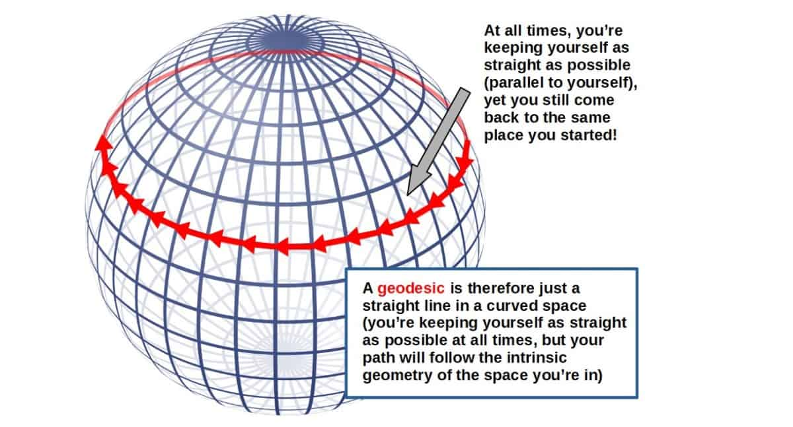

Now, how does all this relate to physics? The best way to understand this is to think about what a “straight trajectory” actually means physically.

According to Newton’s laws, **an object will always move in a straight line if it experiences no acceleration**.

But, because the “straight line” actually did not remain straight, does this mean that there is really an **acceleration**?

To understand this, we will look at **an object moving in curved spacetime that does not experience any acceleration**.

Mathematically, **no acceleration means that the velocity is a constant and its time derivative has to be zero**.

In relativity, this corresponds to the derivative of **four-velocity** (velocity in spacetime) with respect to **proper time** (the “universal” definition for time, which is invariant) being zero:

$$\frac{d\vec u}{d\tau}=0$$

Four-velocity is typically denoted by the letter u.

Now, any vector can be expressed as the sum of its components with the basis vectors (you may be familiar with this in typical Cartesian coordinates already).

So, we can say that the **four-velocity is simply uµeµ** (summing over µ from 0 to 3).

Here comes the important part; if spacetime is curved (which we’re interested in right now), **the basis vectors may not be constant**.

Therefore, we have to use the product rule:

$$\frac{d\left(u^{\mu}\vec{e}_{\mu}\right)}{d\tau}=0\ \ \ \Rightarrow\ \ \ \vec{e}_{\mu}\frac{du^{\mu}}{d\tau}+u^{\mu}\frac{d\vec{e}_{\mu}}{d\tau}=0$$

Here we have the derivative of a basis vector, which suggests that maybe this has something to do with Christoffel symbols.

Indeed, with a little bit of math, we can express this by using Christoffel symbols and we then end up with the **geodesic equation**.

```
The geodesic equation:  
  
$\frac{du^{\mu}}{d\tau}=-\Gamma_{\lambda\nu}^{\mu}u^{\lambda}u^{\nu}$
```

Now, what is the actual physical meaning of this? The left-hand side looks very much like an **acceleration term**, but what does the stuff on the right represent?

This stuff comes from the fact that our spacetime was assumed to be curved (the basis vectors may not be constant).

Because of this, an additional “**force term**” appears on the right-hand side, which causes an acceleration.

This seems weird, because we started by looking at an object that did not experience any acceleration.

We therefore see that **if an object is moving in curved spacetime, it will undergo an acceleration caused by the curvature itself, even if no forces are present**.

An important property is that **the object itself does not experience any acceleration**, but any outside observer would see the object accelerate.

This is a **key property of gravity** (the fact that you would not *feel* any acceleration if you’re just “free-falling” in a gravitational field, i.e. following a geodesic, but anyone looking at you would clearly see you accelerate).

This now has a clear explanation in terms of general relativity and spacetime curvature.

This is fundamentally **why gravity is NOT a force, but rather a property of spacetime itself**, namely the curvature of spacetime.

This also gives a clear definition for what geodesics are:

> A geodesic is a trajectory, along which an object does not experience any acceleration. All objects will naturally move along geodesics through spacetime and geodesics in curved spacetime are equivalent to motion under the influence of gravity.

There is actually another interpretation for what a geodesic is and it is that **a geodesic is the shortest distance between two points in spacetime**.

In flat spacetime, this is naturally just a straight line (corresponding to no gravity), but in curved spacetime, the shortest path is some curve which corresponds to **motion in a gravitational field**.

Geodesic As The Shortest Distance Between Two Spacetime Points (click to see more)

It turns out that there is actually a very elegant way of deriving the geodesic equation and it is **by defining a geodesic as the shortest distance between two points** (in spacetime).

A little warning, however; this method is going to require a little bit of previous knowledge about **Lagrangians** (and special relativity too) and some fairly intensive math.

Now, how do we do this? Let’s first of all think about what a distance in spacetime is.

A distance in spacetime is simply the **line element ds2**. More accurately, this gives the square of an infinitesimally small line element (that’s what the d here means).

To get a sensible and finite distance in spacetime, we should simply **integrate this line element**.

Now, to actually relate this to physics, rather than just looking at some random distance in spacetime, let’s look at the trajectory of a particle.

For this, we need its ***action*** or ***Lagrangian*** (you can read more about the concept of the Lagrangian in [this article](https://profoundphysics.com/lagrangian-mechanics-for-beginners/)).

**In special relativity, the action of a particle under no external forces** is (I explain this in my [introductory article on special relativity](https://profoundphysics.com/special-relativity-for-dummies-an-intuitive-introduction/)):

$$A=mc\int_{ }^{ }ds$$

This is usually written with a minus sign, but the minus sign does not really have any content, it is just a convention, which we’re going to forget right now.

This action integral from special relativity turns out to be valid also in general relativity if we just replace the line element ds with that used in general relativity. Let’s now write out the ds -line element and manipulate it a little bit:

$$ds=\sqrt{g_{\mu\nu}dx^{\mu}dx^{\nu}}=\sqrt{g_{\mu\nu}\frac{dx^{\mu}}{d\tau}\frac{dx^{\nu}}{d\tau}d\tau^2}=\sqrt{g_{\mu\nu}\frac{dx^{\mu}}{d\tau}\frac{dx^{\nu}}{d\tau}}d\tau$$

The action integral is then:

$$A=mc\int_{ }^{ }\sqrt{g_{\mu\nu}\frac{dx^{\mu}}{d\tau}\frac{dx^{\nu}}{d\tau}}d\tau$$

Now, here comes the key point; **if we wish for this to represent the shortest distance between two points, this integral should be *minimized***. This means that we should apply **the principle of least action** (which you can read more about in [this Lagrangian mechanics -article](https://profoundphysics.com/lagrangian-mechanics-for-beginners/)).

The principle of least action means that the “real” path of the particle, which has this action integral, is the one in which this action is minimized. Mathematically, this means that we *vary* (this we denote by a δ-symbol) this integral and **set this variation to zero**:

$$\delta A=mc\int_{ }^{ }\delta\sqrt{g_{\mu\nu}\frac{dx^{\mu}}{d\tau}\frac{dx^{\nu}}{d\tau}}d\tau=0$$

Now, to actually calculate this variation requires a fair bit of math that would take way too much space on this page. If you wish to see the details of this, I actually derive the geodesic equation in [this article](https://profoundphysics.com/how-are-photons-affected-by-gravity-if-they-have-no-mass/).

Whether you read the article linked above or not, here is what you’ll end up with:

$$\frac{d^2x^{\mu}}{d\tau^2}=-\frac{1}{2}g^{\mu\alpha}\left(\partial_{\lambda}g_{\alpha\nu}+\partial_{\nu}g_{\lambda\alpha}-\partial_{\alpha}g_{\lambda\nu}\right)\frac{dx^{\nu}}{d\tau}\frac{dx^{\lambda}}{d\tau}$$

This is indeed exactly the geodesic equation fully written out in terms of the metric and the dx -coordinate displacements!

Whether you actually followed all the mathematical steps explained in the video above, the point was really this; **the physical meaning of the geodesic equation is that it described a path of shortest distance between two spacetime points**.

Technically, this is not *always* true since mathematically this could also correspond to a path of maximum distance or a “stationary” path, but intuitively you can think of objects moving along geodesics in spacetime in a way that the **spacetime distance** should be as short as possible.

Now that we’ve established what geodesics are, let’s look at the geodesic equation in more detail:

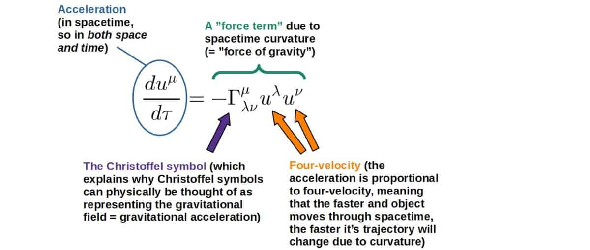

In a more practical sense, **the geodesic equation is essentially the law of motion in general relativity** (just like Newton’s second law, F=ma, is in Newtonian physics).

This can be quite easily seen if we express the force in Newton’s law as the **gradient of the gravitational potential** and **the ma -term as mdv/dt** (we can also multiply the geodesic equation by mass m on both sides):

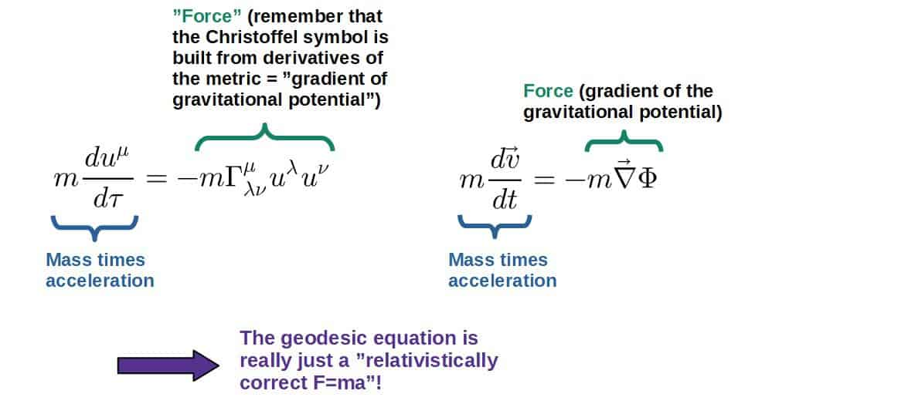

Also, the way you practically use the geodesic equation is absolutely equivalent to Newton’s law:

- The motion of any object under the influence of gravity is governed by the **geodesic equation in general relativity**, just like it is governed by **Newton’s second law in Newtonian physics**.
- In general relativity, you specify the metric tensor (gravitational potential) and **the geodesic equation tells you the trajectory of an object** (for example, the orbit of a planet). In Newtonian physics, you specify the gravitational potential and **Newton’s second law tells you the trajectory**.

You’ll find an example of how the geodesic equation is practically used down below.

Practical Example: Geodesics on a Sphere (click to see more)

For this example, we will consider a **particle that is allowed to move on the surface of a sphere**. This can be best done using spherical coordinates, r, θ and φ. In picture, these coordinates are as follows (also, note that we’re only looking at the spacial motion so we’re not considering the time component):


However, a sphere is characterized by a constant radius, so the particle’s r-coordinate is actually the same at all times and thus, can be treated as *not a coordinate*. Let’s call this constant radius R.

We therefore only have **two coordinates, x1=θ and x2=φ**.

**The components of the velocity will just be the time derivatives of these coordinates**, i.e. v1=dθ/dt and v2=dφ/dt (note that we’re not looking at relativistic spacetime motion right now, so we can use the **ordinary time t** and not proper time).

**The Christoffel symbols on a sphere** can be calculated to be (see [this link](https://profoundphysics.com/christoffel-symbols-a-complete-guide-with-examples/#Christoffel_Symbols_On_a_Sphere) for more details):

$$\Gamma_{ij}^1=\begin{pmatrix}0&0\\0&-\sin\theta\cos\theta\end{pmatrix}\\\Gamma_{ij}^2=\begin{pmatrix}0&\cot\theta\\\cot\theta&0\end{pmatrix}/latex]
<p class="has-small-font-size wp-block-paragraph">These Christoffel symbols are essentially the same as the ones in spherical coordinates we calculated earlier, but with the "slots" for the r-coordinate dropped out.</p>
<p class="wp-block-paragraph">The geodesic equation for this particle will then be (using ordinary velocity instead of the four-velocity and latin indices instead of greek ones):</p>
[latex display="true"]\frac{dv^i}{dt}=-\Gamma_{mn}^iv^mv^n$$

Let's look at these for each i-component. First, we have i=1 (and summing over m and n):

$$\frac{dv^1}{dt}=-\Gamma_{mn}^1v^mv^n=-\Gamma_{11}^1v^1v^1-\Gamma_{12}^1v^1v^2-...-\Gamma_{33}^1v^3v^3$$

Here, the only non-zero Christoffel symbol is Γ122 (just take a look at the matrices given above), so we have left:

$$\frac{dv^1}{dt}=-\Gamma_{22}^1v^2v^2$$

Now we just insert the velocity components and the Christoffel symbols (Γ122=-sinθcosθ, v1=dθ/dt and v2=dφ/dt):

$$\frac{d^2\theta}{dt^2}=\sin\theta\cos\theta\left(\frac{d\varphi}{dt}\right)^2$$

This is indeed the first equation of motion, namely the **equation of motion for the coordinate θ of this particle**. Next, we have the equation for i=2. The process here is exactly the same, but this time the non-zero Christoffel symbols are Γ212 and Γ221, so we have:

$$\frac{dv^2}{dt}=-\Gamma_{12}^2v^1v^2-\Gamma_{21}^2v^2v^1$$

We can then insert the Christoffel symbols and the velocities (Γ212=Γ221=cotθ and the velocities being the same ones as before). We then get:

$$\frac{d^2\varphi}{dt^2}=-2\cot\theta\frac{d\theta}{dt}\frac{d\varphi}{dt}$$

We now have the two **equations of motion for a particle on the surface of a sphere**:

$$\frac{d^2\theta}{dt^2}=\sin\theta\cos\theta\left(\frac{d\varphi}{dt}\right)^2\\\frac{d^2\varphi}{dt^2}=-2\cot\theta\frac{d\theta}{dt}\frac{d\varphi}{dt}$$

These equations indeed **completely govern the geodesic motion of this particle** (we have one equation for each coordinate). Granted, these are not easy at all to analytically solve for the coordinates, but the bottom line is that these were quite easy to obtain. All we needed is the metric (the coordinates as well, of course) and everything followed pretty much automatically.

Now, we can look at a **particular solution** to these equations - consider the coordinates of the particle being θ=π/2 and φ=ωt, where ω is a constant (corresponding to the angular frequency of the particle). This is actually a solution to the above geodesic equations, which we can see by plugging them in:

$$\frac{d^2\theta}{dt^2}=\sin\theta\cos\theta\left(\frac{d\varphi}{dt}\right)^2\ \ \Rightarrow\ \ 0=0$$

$$\frac{d^2\varphi}{dt^2}=-2\cot\theta\frac{d\theta}{dt}\frac{d\varphi}{dt}\ \ \Rightarrow\ \ 0=0$$

Since we get 0=0 from both of the equations, this means that the assumption we tried (θ=π/2 and φ=ωt) satisfies these geodesic equations and is indeed a **valid solution**.

Therefore, a path where the particle moves with constant angular velocity around the equator on the surface of the sphere (the equator is described by setting θ=π/2) is a geodesic.

Now, this is just one particular solution and there are many more. The general set of solutions to the above geodesic equations are called **great circles**.

Also, note that in this example, we did not look at motion under the influence of gravity. If we wanted to do that, we'd have to look at geodesics in *spacetime*, not just in space. This is what general relativity is all about - describing geodesics in spacetime in various different gravitational systems.

Geodesics describe pretty much everything that moves under the influence of gravity, including **massless photons or light**. In case you're wondering how light can possibly be affected by gravity and how the geodesic equation leads to **deflection of light near a star**, I recommend reading [this article](https://profoundphysics.com/how-are-photons-affected-by-gravity-if-they-have-no-mass/).

## Tidal Forces in General Relativity

The effects of **tidal forces** can be seen as the rise of sea levels caused by the Moon's gravity.

However, tidal forces are always present when an object is in a gravitational field and these may cause the object to get deformed.

Newtonian gravity explains this by the fact that **different parts of an object experience a different gravitational force** as described by Newton's law of gravity, F=GMm/r2.

General relativity, on the other hand, can explain the phenomenon of tides as well.

**Tides are explained in general relativity by the fact that different parts of an object each follow their own geodesics through spacetime. These geodesics may begin deviating from one another due to curvature (gravity), causing the object to deform, which can then be physically observed as tidal forces.**

In my opinion, this explanation is extremely elegant, but it can be a bit difficult to conceptualize.

The key idea is that **everything in spacetime moves along geodesics**.

If the spacetime is curved (gravity is present), these geodesics correspond to trajectories of objects under the influence of gravity.

Moreover, if everything in spacetime follows its own geodesic, it means that **different parts of an object will each have their own geodesic**.

Let's look at an example to visualize this; say we have a person named James, for example, who is in a gravitational field (in a curved spacetime).

In this gravitational field, both James' feet and upper body will each follow their own geodesic, which are determined by how the **spacetime is curved**..

Technically, each atom in James' body will have its own geodesic, but we'll look at this in a more macroscopic context.

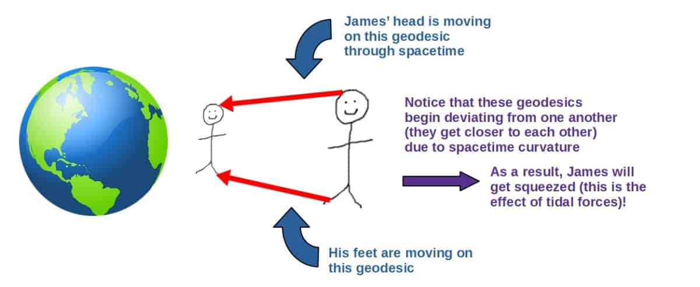

Mathematically, the effects of these tidal forces in general relativity are described by the **equation of geodesic deviation**.

This, as the name may suggest, describes **how two geodesics deviate from one another due to spacetime curvature**.

```
The equation of geodesic deviation:  
  

$$\frac{D^2\epsilon^{\mu}}{D\tau^2}=R_{\rho\lambda\nu}^{\mu}u^{\rho}u^{\lambda}\epsilon^{\nu}$$
```

Now, what do all these things mean? Let's dissect this equation and see what it really says:

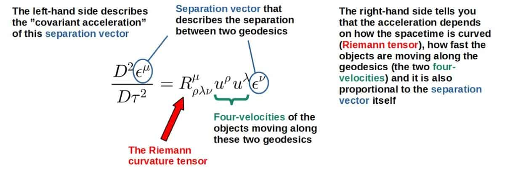

Visually, this separation vector describes **how two geodesics are separated** (each component of this vector tells you about each spacetime direction).

This length and direction of this vector may change as you move along these geodesics:

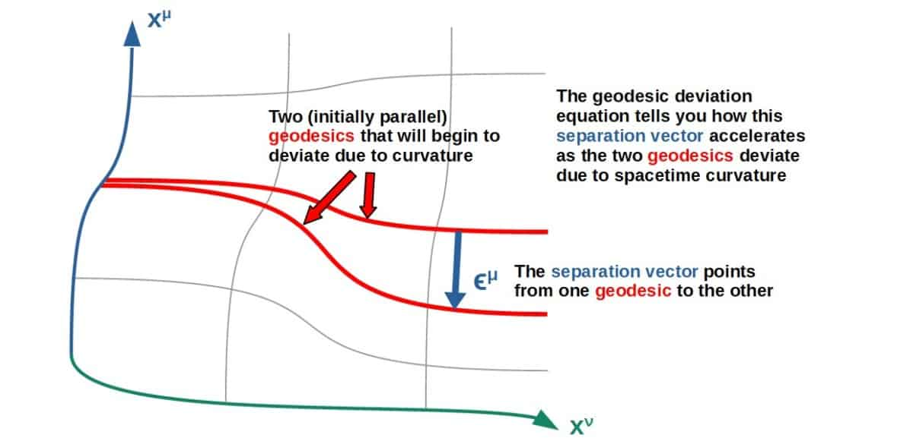

Interestingly, tidal forces are also described by a tensor in Newtonian gravity, but it does not give a relativistically valid description.

In fact, **the Riemann tensor turns out to be the relativistic extension of the Newtonian tidal tensor**.

Tidal Forces in Newtonian Gravity vs in General Relativity (click to see more)

Imagine you have two of whatever objects moving in a gravitational field. In Newtonian gravity, the separation between these is described by the following equation:

$$\frac{d^2s^i}{dt^2}=-R_j^is^j$$

Here, **s is the separation vector between these two objects and R is the Newtonian tidal tensor**, which characterizes tidal forces (here I've written this tensor with one upstairs and one downstairs index, but in Newtonian physics, the placement of indices generally doesn't matter).

The above equation in fact, **describes the effect of tidal forces according to Newtonian gravity**. You can quite clearly see the similarity of this to the **geodesic deviation equation**:

$$\frac{D^2\epsilon^{\mu}}{D\tau^2}=R_{\rho\lambda\nu}^{\mu}u^{\rho}u^{\lambda}\epsilon^{\nu}$$

This raises another question. Based on the similarity of these two equations, **does the Riemann tensor actually play the role of the tidal tensor in general relativity?** The answer is that it indeed does.

We can see this more clearly by writing out the definition of the tidal tensor:

$$R_j^i=\partial^i\partial_j\Phi$$

From this, we can see that the tidal tensor contains **second derivatives of the gravitational potential**. This is exactly the case also for the Riemann tensor, which, if fully written out, contains **second derivatives of the metric** (which is equivalent to the gravitational potential in general relativity)!

The analogy will become even more clear when we look at the **tidal tensor for a spherically symmetric object** like a planet and compare this to what we'd get from the Riemann tensor. The tidal tensor in this case (written as a matrix) is:

$$R_j^i=\begin{pmatrix}-\frac{2GM}{r^3}&0&0\\0&\frac{GM}{r^3}&0\\0&0&\frac{GM}{r^3}\end{pmatrix}$$

In Newtonian gravity, tidal forces vary as 1/r3 while the gravitational force varies as 1/r2 (as seen from Newton's universal law of gravity).

The simplest way to compare this to the Riemann tensor is by **constructing a scalar K from the Riemann tensor** (contracting it with itself, i.e. summing over every index):

$$K=R_{\rho\lambda\nu}^{\mu}R_{\mu}^{\rho\lambda\nu}$$

If the Riemann tensor describes tides, then it would make sense if **the square root of this scalar K were to describe something like the strength of tidal forces** (because this K is kind of like the "Riemann tensor squared"). So, we could say that:

$$F_{tidal}\propto\sqrt{K}$$

In general relativity, the gravitational field (spacetime curvature) of a spherically symmetric object, like a planet, is described by a metric called the **Schwarzschild metric**. If you work out the components of the Riemann tensor for this metric and then construct this scalar K from it, you'll get:

$$K=\frac{48G^2M^2}{c^4r^6}$$

Therefore, the strength of tidal forces for this metric describing a planet in general relativity would be something of the form:

$$F_{tidal}\propto\sqrt{K}=\frac{4\sqrt{3}GM}{c^2r^3}$$

This is indeed very similar to the Newtonian tidal forces.

Also, as a sidenote, this scalar K is called the **Kretschmann scalar** and it is often used to analyze **singularities** in different spacetimes (a physical singularity is a point in spacetime where tidal forces blow to infinity, i.e. become incredibly strong, such as at the center of a black hole).

An even better piece of evidence for why the Riemann tensor is the relativistic extension of the tidal tensor is that **the Riemann tensor reduces exactly to the tidal tensor in "weak" gravitational fields**.

This can be seen if we were to calculate the Riemann tensor in the so-called **weak-field limit** (which is just a fancy word for a situation where gravity is "not too strong" and the metric has a special form related to the Newtonian gravitational potential).

In this limit, the Ri0j0 -component of the Riemann tensor actually reduces to the following form:

$$R_{0j0}^i=\partial^i\partial_j\Phi$$

And this is exactly the definition of the tidal tensor! So, this then gives a clear physical meaning for the Riemann tensor; **it describes tidal forces in general relativity**.

Another important mathematical object related to tidal forces is the **Weyl tensor**.

The math regarding the Weyl tensor can get quite complicated, but essentially **the Weyl tensor describes how the shape of an object gets deformed due to tidal forces**.

In contrast, the Ricci tensor only describes the change in an object's volume (while not giving any information about changes in shape).

**The Weyl tensor, on the other hand, describes the changes in shape, but doesn't give any information about how the volume changes**.

In fact, **combined together, the Ricci tensor and the Weyl tensor give a complete description of tidal effects**.

Together they are equivalent to the Riemann tensor, in that they describe spacetime curvature and tides completely.

The usefulness of the Weyl tensor really comes in when studying **gravitational radiation**.

These can cause squeezing and stretching effects on gravitational wave detectors, for example (i.e. deform the shape of the detector).

## The Einstein Field Equations: What Actually Causes Spacetime Curvature?

We've pretty much covered the most important concepts of general relativity so far.

There is just one more question left; by now, you know how curvature is described and how it causes the effects of gravity, but **what causes spacetime curvature in the first place?**

The answer to this is simple; **the energy-momentum tensor**!

In other words, the energy-momentum tensor acts as a source of gravitational fields, which means that spacetime curvature can be caused by, not only mass, but **all types of energy and energy fluxes, momentum, pressure and different kinds of stresses**.

How exactly the energy-momentum tensor acts as a source is described by the somewhat famous **Einstein field equations**.

```
The Einstein field equations:  
  

$$G_{\mu\nu}=\frac{8\pi G}{c^4}T_{\mu\nu}$$

  
  
Note; if you want to see where exactly the Einstein field equations come from, you can check out this article, in which we derive the field equations step-by-step. You can also get the article as a PDF here.
```

At first sight, this equation may seem fairly simple. Don't be mistaken though, it is actually extremely difficult to solve in reality.

Moreover, this really represents multiple equations, since there is one for each combination of µ and ν (there is actually 10 independent equations in total contained in these field equations).

To get an idea of how complicated these field equations actually are, you can see them **fully written out in terms of the metric** (and its first and second derivatives) on [this page](https://profoundphysics.com/einstein-field-equations-fully-written-out-what-do-they-look-like-expanded/).

Now, **the left-hand side of the field equations contain the "curvature part" which is the Einstein tensor**.

Remember from earlier that the Einstein tensor is a combination of the Ricci tensor and Ricci scalar, which contain a lot of Christoffel symbol terms.

**The right-hand side is the energy-momentum tensor** (which may or may not have a complicated form, it depends on the problem).

It is also combined with some **constants** (G is the gravitational constant and c is the speed of light).

A Comparison of the Einstein Field Equations To Newton's Law of Gravity (click to see more)

As a reminder, in Newtonian gravity, there is also a field equation, which is knows as **Poisson's equation** (which is equivalent to Newton's universal law of gravity):

$$\nabla^2\Phi=4\pi G\rho$$

This is quite similar to the Einstein field equations, except the right-hand side contains only one component of the energy-momentum tensor, the energy density.

The left-hand side contains second derivatives of the gravitational potential, similar to the Einstein field equation, which has second derivatives of the metric. So, all in all, **the Einstein field equations can really be thought of as a relativistic generalization of Poisson's equation**.

Now, also I want you to notice a pattern with these "relativistic generalizations". Nearly everything in general relativity is in some way, **a generalization of a Newtonian law**.

**The geodesic equation is a "more general F=ma", the Riemann tensor is a more general tidal tensor and the Einstein field equations are a more general Poisson's equation.**

What Do These Constants In Einstein's Field Equations Mean? (click to see more)

These constants can be thought of as describing **how strongly spacetime will react to the presence of a source** (energy etc.). You could also think of these as telling you the ratio of gravitational forces to electric forces (G, a gravitational constant divided by c, an electromagnetic constant).

These constants work out to have the value:

$$\frac{8\pi G}{c^4}\approx2.1\cdot10^{-43}\ \frac{1}{N}$$

This in fact, shows exactly **why gravity is such a weak force**. Interestingly, in Newtonian physics, the gravitational force is of order (roughly) 1040 times weaker than the electrostatic force, which is quite similar to what the value of this constant says.

This also describes why Newton, for example, couldn't deduce the fact that also things like **momentum and energy flux cause gravity**. The numerical values for something like momentum is typically much much less than that of mass (i.e. energy density).

The gravitational effects of energy and momentum fluxes really become noticeable only in something like black holes (Newton, of course, couldn't observe black holes at the time he came up with his law of gravity).

This is most likely why Newton's law of gravity picks out **only a particular component of the Einstein field equations** (the T00 -component, **energy density i.e. mass**).

Now, where exactly do these constants come from? Couldn't we also have some other constants there in Einstein's field equations? The answer is that these constants have to be there so that **general relativity can be related to Newtonian gravity**.

We know that Newtonian gravity works quite well in many cases, so the more accurate theory, **general relativity, should reduce to simply Newtonian gravity** in the case where gravity is "not too strong" and objects are moving "relatively slowly" (this is called the *weak-field limit*).

This can only be done if we have these exact constants, 8πG/c4, in the Einstein field equations. In that case, Einstein's equation will reduce to the **Poisson equation**, which is the Newtonian equivalent of a gravitational field equation.

If you want to see how exactly these constants are found from the **weak-field limit**, this is done in my article on the full derivation of Einstein's field equations (which you'll find [here](https://profoundphysics.com/derivation-of-einstein-field-equations/), or in PDF form [here](https://profoundphysics.gumroad.com/l/einstein-field-equations)).

[](https://courses.profoundphysics.com/p/mathematics-of-general-relativity) 

My **Mathematics of General Relativity** -course will teach you all the math you need for a deep understanding of general relativity. You'll find more information [here](https://courses.profoundphysics.com/p/mathematics-of-general-relativity).

### What Are The Einstein Field Equations Used For?

At the most basic level, the Einstein field equations are just that, *equations*. But equations for what? **Equations for the metric**, of course!

The Einstein field equations describe how energy and momentum cause curvature and curvature itself is described by the different curvature tensors, which are really built from the metric.

In other words, **the Einstein field equations determine what the metric looks like for a given spacetime, depending on the energy content of that spacetime**.

To get the metric tensor, you have to then solve the field equations.

Now, the problem with this is that the field equations are a set of extremely complicated, *non-linear second order differential equations*, which in most cases, don't even have an exact solution.

You therefore have to either use a computer and *solve them numerically* or make some simplifications.

The most common simplifications and the solutions obtained from these are:

- **Vacuum solutions**: these describe a spacetime which contains no matter (Tµν=0), but the spacetime can still be curved. Examples of such solutions are the Schwarzschild metric (describing spacetime outside of a static, spherically symmetric object, like a planet) and the Kerr metric (which describes spacetime around a rotating object, such as a rotating black hole).

- **Weak-field solutions**: these describe a spacetime where gravity is "weak" (the metric only deviates slightly from the flat spacetime Minkowski metric, so it's of the form gµν=ηµν+hµν where hµν describes *small perturbations* in the metric). This type of formalism is also called **linearized gravity** and it is used to study gravitational waves as well as relate general relativity to Newtonian gravity.

- **Symmetric solutions**: these describe spacetimes that have a large degree of symmetry, making the field equations much much simpler. Examples of this include spherical symmetry (Schwarzschild metric) and homogeneity or isotropy (such as the Friedmann-Robertson-Walker metric, which describes things like the expansion of the universe).

So, in a nutshell, the process for solving a problem in general relativity usually goes more or less like this:

1. **Specify a set of symmetries or simplifications**, such as the ones given above. This should reduce the complexity of the Einstein field equations.
2. **Specify the energy and momentum distribution in your spacetime** (i.e. the energy-momentum tensor) if not done already in the previous step.
3. **Calculate the Einstein tensor by using the Einstein field equations and the simplifications you specified**. Note that you'll have to calculate the Riemann tensor first and from that, the Ricci tensor and scalar, which form the Einstein tensor.
4. **From the Einstein tensor, you can solve for the metric** (either numerically or analytically, if possible).
5. **Once you have the metric, you have a complete description of your given spacetime**. You can calculate pretty much anything you wish to (such as the four-velocities, four-momenta or geodesics of objects in that spacetime).

If you're interested, I have an [article](https://profoundphysics.com/why-time-slows-down-near-a-black-hole/) discussing **time dilation near a black hole**, which makes use of the Schwarzschild metric that can be used to describe a black hole. I also discuss some other metrics, such as the Kerr metric, which is also a solution to the Einstein field equations.

For another application, I suggest reading [this article](https://profoundphysics.com/black-hole-orbits/) on **orbits around black holes**, which covers how to use a so-called effective potential to intuitively visualize these black hole orbits. For more mathematical details on this concept, I recommend [this article](https://profoundphysics.com/can-light-orbit-a-black-hole-the-physics-explained/) on **orbits of light**.

Also, [this article](https://profoundphysics.com/the-friedmann-equations-explained-a-complete-guide/) on the **Friedmann equations** looks at how the Einstein field equations are used to derive arguably the two most important equations in cosmology and how these lead to predictions like the **expansion of the universe**.

### The Principle of Least Action in General Relativity

So far, I haven't really explained where exactly the Einstein field equation comes from and why it has the specific form it has.

This is what we'll do now and the best way to do this is by using the **principle of least action**, which is **one of the most fundamental concepts in all of physics**.

If you're not familiar with the principle of least action (technically, it's the principle of *stationary* action), I recommend reading **[my article on Lagrangian mechanics](https://profoundphysics.com/lagrangian-mechanics-for-beginners/)** (Lagrangian mechanics is a formulation of mechanics that uses this principle).

Essentially, the basic idea of how this principle is used in physics is this: pretty much all theories of physics each have their own **action integral**.

The action is usually found simply by trying out what works and what doesn't (typically, there are really only a few options since there are some fairly strict requirements as to how the action should look like).

Then, **the action has to be made stationary** (or *minimized*, as the name, principle of *least* action, suggests).

This is done mathematically by *varying* it and **setting this variation equal to zero**.

Now, what's the point of doing all this?

Well, **once you calculate the variation and set it equal to zero, you then have the fundamental equations for that given theory**.

In the case of general relativity, this leads to the **Einstein field equations** (which we otherwise couldn't derive from anything else, they would simply have to be assumed).

```
The Einstein-Hilbert action:  
  

$$A=\frac{c^4}{16\pi G}\int_{ }^{ }R\sqrt{-g}d^4x$$
```

The action that leads to the field equations is called the **Einstein-Hilbert action**.

This action is actually **the simplest possible action** we could construct that has all the properties we wish.

These properties include:

- **The action has to be an integral over four-dimensional spacetime**, d4x, since that's what we're interested in in general relativity.
- **The action should somehow involve curvature**, since we've determined that gravity has to do with curvature of spacetime (which is why the Ricci scalar R is there; it's the simplest possible curvature quantity we could have).
- **The action has to be an invariant quantity or simply a scalar/scalar function** (meaning it has to be a **scalar**, which is why there is this weird square root term; it turns out that, in *curved spacetime*, integrals over a spacetime volume, d4x, have to be multiplied by such a term involving the *determinant of the metric*, g, otherwise they would not be invariant).

Mathematically, **varying this and setting it to zero** (i.e. applying the principle of stationary action) means the following (the variation we denote by a δ-symbol, but it's really closely related to derivatives):

$$\delta A=\frac{c^4}{16\pi G}\delta\int_{ }^{ }R\sqrt{-g}d^4x=0$$

What you'll get as the end result, are exactly the **Einstein field equations**:

$$R_{\mu\nu}-\frac{1}{2}Rg_{\mu\nu}=0$$

These are the vacuum equations where Tµν=0; it's also possible to derive the full field equations by using this principle.

The mathematical steps to do this are quite complicated but if you're interested in seeing exactly how the field equations are derived from this action principle, this is indeed one of the two ways I derive them in my [article on the full derivation of Einstein's field equations](https://profoundphysics.com/derivation-of-einstein-field-equations/).

---

*← [Back to the full archive](../index.html)*
