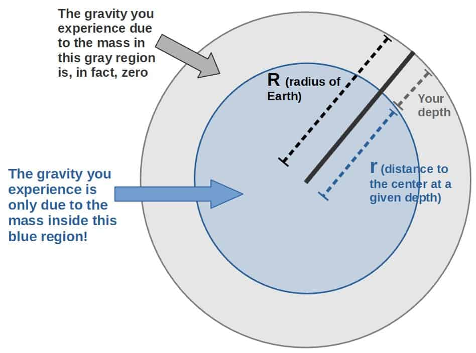
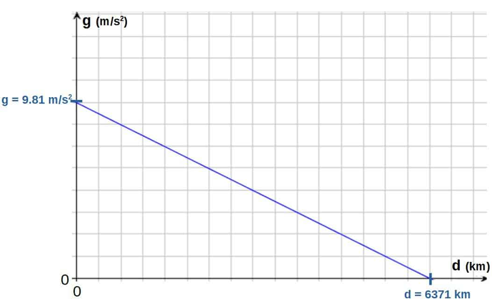
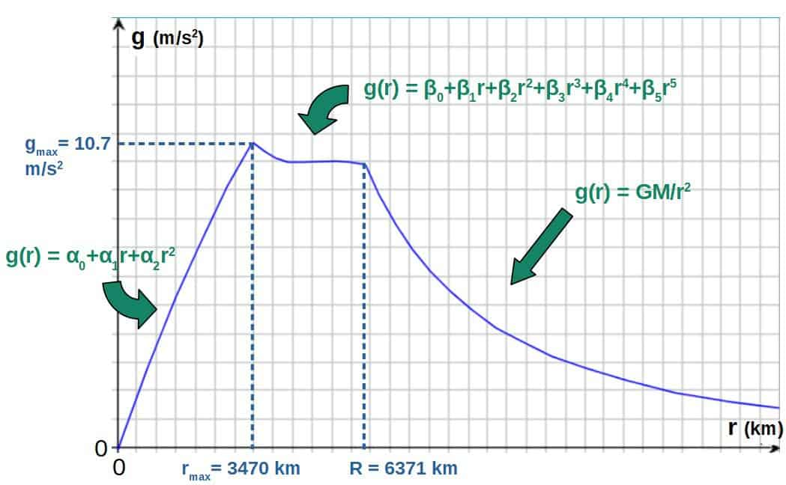
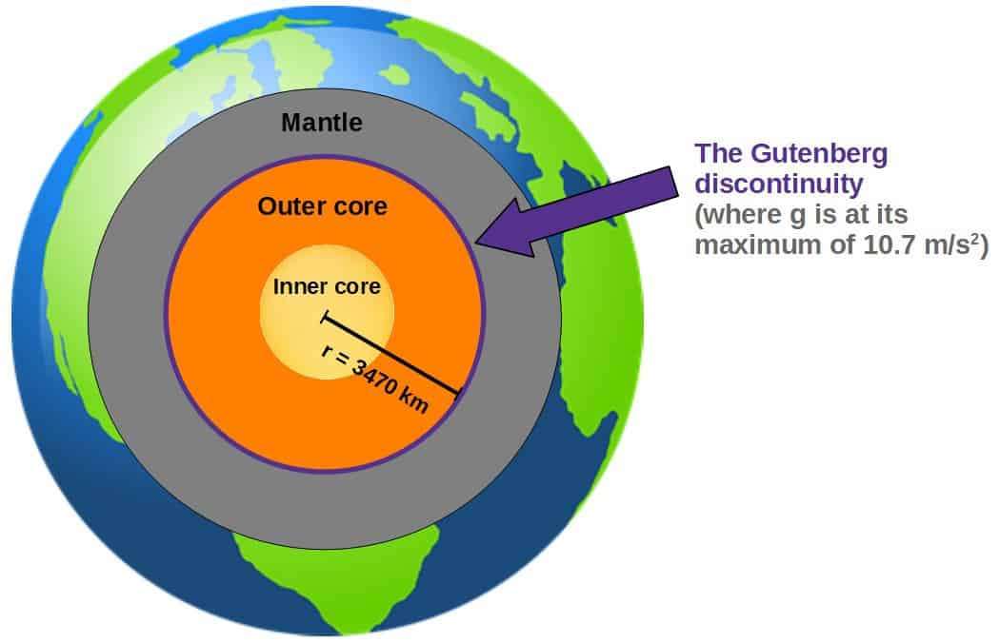

# How Does Gravity Work Underground? (An In-Depth Explanation)

> Below the Earth's surface, gravity actually decreases linearly with depth.

*Originally published at [profoundphysics.com](https://profoundphysics.com/gravity-underground/).*

---

Gravity is a force that pulls objects down and it is commonly known to be approximately constant on the surface of Earth. What would happen if you, however, dug a deep hole into the Earth? Would the gravity you experience change as you went underground and how would it change with depth?

**In short, gravity certainly exists underground, but it decreases as you go deeper. In an idealized case, gravity would decrease linearly with depth, however, a more realistic description of gravity underground is given by the PREM model, according to which gravity is at its strongest at the boundary of the outer core.**

In this article, we’ll take a look at how gravity can be modeled underground as well as how it actually changes as you go deeper. At the end, we’ll also talk about how going underground would practically affect the weight you feel (kind of similar to the idea that you’d feel lighter on the surface of the Moon).

Table of Contents

Toggle

## How Does Gravity Change With Depth? (Mathematical Models Included)

If you know a little bit about physics, at a glance you may think that the force of gravity would actually get larger as you go deeper underground (closer to the center of Earth). You may think this way if you just look at Newton’s law of gravity (which describes the gravitational force F an object of mass m would experience):

$$F=\frac{GMm}{r^2}$$

Here M is the mass of the Earth, G is the gravitational constant and r is the distance from Earth’s center.

For this case, it will be more useful to only look at the gravitational acceleration g and not the force itself (because the force depends on your mass too, which we don’t really care about right now). That we can get by the simple fact that F=ma (or F=mg, since the gravitational acceleration is denoted by g):

$$mg=\frac{GMm}{r^2}\ \ \Rightarrow\ \ g=\frac{GM}{r^2}$$

Based on this, if you make r (distance from the center of the Earth) smaller by going underground, gravity (gravitational acceleration) would get larger. **This is, however, not actually correct**.

The problem is that, actually, **the gravity you’d experience is only due to the mass of the Earth that is inside the given radius r** (picture below), not any of the mass outside this radius. This means that if you go underground, there is actually less mass pulling you down, but at the same time, the radius r is smaller. So, is the gravity therefore stronger or weaker?

The fact that the gravity caused by the mass outside this blue region is zero is fundamentally because the gravitational forces caused by that outside mass exactly cancel from every direction, which is a result of something called **Gauss’s law**.

Now, there are two mathematical models that we’ll take a look at in this article (don’t worry, I’ll explain these in detail soon):

- An idealized model, which only uses the *average density* of Earth (this formula is derived directly from Gauss’s law):

$$g\left(r\right)=\frac{4}{3}\pi G\rho r$$

- A more realistic model, which takes into account the fact that the density of Earth actually varies from place to place (this formula is based on the PREM model):

$$g\left(r\right)=\begin{cases}\sum_{n=0}^i\alpha_nr^n&{,}\ 0\le r<r_{\max}\\\sum_{n=0}^j\beta_nr^n&{,}\ r_{\max}\le r\le R\end{cases}$$

Here, the α’s and β’s are some suitable coefficients that fit the data given by the PREM model (you’ll find these coefficients later in the article).

The notable thing here for now is that both of these models describe the gravitational acceleration at a given (underground) distance r from the center of Earth (or if you wish to express it in terms of the depth underground d, just insert r=R-d).

The first formula increases linearly as you increase the distance r, but the second one actually changes as a polynomial with regards to r. Later, we’ll take a look at what each of these coefficients and symbols in the formula actually mean and the results should be quite surprising and interesting.

### Gravitational Acceleration Underground Using Gauss’s Law (Simple Formula)

The first formula we’ll look at is the following (the derivation of this can be found down below):

$$g\left(r\right)=\frac{4}{3}\pi G\rho r$$

The values in the formula are the following; **r is the distance from the center of Earth** (this works only for r<R), **G is the gravitational constant** (G=6.674×10-11 m3/(kg·s2)) and **ρ is the average density of Earth** (ρ=5510 kg/m3).

Derivation Using Gauss's Law For Gravity (click to see more)

If you want a quick and simple explanation using only Newton’s law of gravity, I’d recommend watching this video (I’ll be deriving the result using a more general law known as Gauss’s law, which is a little more complicated):

Luckily, deriving the formula given above is actually quite simple even by using Gauss’s law. All we do is use the following equation, which is known as **Gauss’s law for gravity** (there is also a similar law for electric and magnetic fields):

$$\oint\overrightarrow{g}\cdot d\overrightarrow{A}=-4\pi GM_{inside}$$

Here g is the strength of the gravitational field (i.e. the gravitational acceleration), G is the gravitational constant and this M means the mass *inside a certain region*.

Now, this formula may look complicated, but it really isn’t; all it tells us is that the gravitational flux through a **closed surface** (that’s what the left-hand side describes) is proportional to the mass inside that given closed surface (in this case, we’re interested particularly in a spherical “shell”, which basically means the surface of a sphere).

Intuitively, the gravitational flux through a closed surface is simply the amount of field lines going through that surface (the arrows in the picture going through this spherical surface):

(picture with caption: “Since we want to find the gravitational field *inside* the Earth at some radius r (less than Earth’s radius R), the mass inside this surface will be smaller than the total mass of the Earth).”)

Now, the calculation will actually be even simpler. We know that the surface of a sphere is given by A=4πr2 and at a given radius, the gravitational acceleration g should be constant, so really this whole surface integral thing will be simply gA=4πr2g (forgetting about the vector signs also). We then get from Gauss’s law:

$$4\pi r^2g=-4\pi GM_{inside}\ \ \Rightarrow\ \ g=-\frac{GM_{inside}}{r^2}$$

You may be wondering why we didn’t just use Newton’s law of gravitation, since the result is the same; the answer is that Gauss’s law is more general, while Newton’s law requires some assumptions about the source of gravity acting as a *point mass*.

Now, this is quite not what we want yet. The problem is that the mass inside is not just the total mass of the Earth, but rather it is a bit less. We can, however, make an approximation by using the average density of Earth and assuming that the Earth is a sphere. The mass inside will then be the density multiplied by the volume of Earth:

$$M_{inside}=\rho V$$

The volume enclosing this given mass is then just the volume of a sphere of the specific radius r, which is V=4⁄3πr3. We then have (also forget about the minus-sign, since we know that the gravitational acceleration is always radially inward):

$$g=\frac{GM_{inside}}{r^2}=\frac{G\rho V}{r^2}=\frac{G\rho\cdot\frac{4}{3}\pi r^3}{r^2}=\frac{4}{3}\pi G\rho r$$

Now, this formula is really only an estimate and it isn’t perfectly correct. The inaccuracies in the model mainly come from **two** simplifications that, in reality, are not really true:

1. It assumes that the Earth is perfectly spherical (shaped like a perfect ball), which is not quite correct (although not massively wrong either).
2. It uses the *average density* of Earth, but does not take into account the fact that the density is actually different at different layers of the Earth. For example, the density of the liquid outer core of the Earth is about 9900 kg/m3, while the density at the Earth’s surface (crust) is only around 2200 kg/m3 (source: a [USGS publication](https://pubs.usgs.gov/gip/interior/), which is based on data from D.L. Anderson’s book “Theory of the Earth”).

For our purposes, however, it may be useful to look at the above formula as a **function of depth from the Earth’s surface** (d) rather than the distance from the center (r). The distance r can be expressed as simply the radius of Earth (R) minus the depth (d), i.e. r=R-d.

From this, we get the gravitational acceleration as a function of depth:

$$g\left(d\right)=\frac{4}{3}\pi G\rho\left(R-d\right)$$

If we plug in all the values (R=6371 km and for the other values, see above), we can easily calculate the strength of gravity at different depths by using this function. Down below you’ll find a table of some values as well as a graph.

| Depth (km) | Gravitational acceleration g (m/s2) |
| --- | --- |
| 0 | 9.81 |
| 10 | 9.80 |
| 50 | 9.74 |
| 100 | 9.66 |
| 1000 | 8.27 |
| 3000 | 5.19 |
| 6371 (Earth’s radius) | 0 |

Gravitational acceleration g at different depths (measured from the surface of the Earth). Notice that at the depth of 6371 km (at the center of Earth), there is no gravity.

Gravitational acceleration as a function of depth (in an idealized case). Notice the linear decrease in gravity as depth increases.

This model, as stated above, is really only an idealization and once you take into account the variation in Earth’s density as well, the results change quite a bit and become a little more complicated. The results, however, are very interesting and that is what we’ll look at next.

### Gravitational Acceleration Underground According To The PREM model

For this, we will be using a much more realistic theory of the different layers of the Earth, which is called the **Preliminary Reference Earth Model** (PREM). This model aims to describe different aspects of Earth at the different layers of Earth or in other words, as a **function of radius**.

One set of data that this model describes is the **gravitational acceleration at any given radius** (for this article, I have used the data from a [1981 paper by A.M. Dziewonski and D.L. Anderson](https://lweb.cfa.harvard.edu/~lzeng/papers/PREM.pdf), which you’ll find the data in a nice downloadable format [here](http://ds.iris.edu/spud/earthmodel/9991844)).

What you’ll actually find is that there is a point below the Earth’s surface where gravity is at its maximum and that the gravitational acceleration actually varies as a **polynomial function of r** rather than a linear one as follows:

$$g\left(r\right)=\begin{cases}\sum_{n=0}^i\alpha_nr^n&{,}\ 0\le r<r_{\max}\\\sum_{n=0}^j\beta_nr^n&{,}\ r_{\max}\le r\le R\end{cases}$$

Now, if we fit in the data from the PREM model, we find that the function looks as follows (where this comes from is explained down below):

$$g\left(r\right)=\begin{cases}\alpha_0+\alpha_1r+\alpha_2r^2&{,}\ 0\le r<r_{\max}\\\beta_0+\beta_1r+\beta_2r^2+\beta_3r^3+\beta_4r^4+\beta_5r^5&{,}\ r_{\max}\le r\le R\end{cases}$$

Here, rmax is the value of r where the gravitational acceleration is at its strongest (about 3470 km) and R is the radius of the Earth (6371 km).

The coefficients are given in the table below:

| Coefficient | Numerical value |
| --- | --- |
| α0 | -1.942×10-2 |
| α1 | 3.853×10-3 |
| α2 | −2.22×10-7 |
| β0 | 16.82 |
| β1 | 3.114×10-3 |
| β2 | -4.059×10-6 |
| β3 | 1.149×10-9 |
| β4 | -1.278×10-13 |
| β5 | 4.894×10-18 |

For simplicity, I’ve left the units out (since each coefficient has different units); this can be done by simply defining that the value of r should be measured in km so that the output g will have the correct numerical value.

Where Does This Function Come From? (click to see more)

Essentially, the function given above isn’t derived from any particular law of physics like the one with Gauss’s law. **It is simply a function that fits the experimental data quite well**. In particular, I used the data according to the PREM model (you can download the data [here](http://ds.iris.edu/spud/earthmodel/9991844), if you wish).

For this, you can use whatever graphing software you’d like. Personally, I used LoggerPro (a free demo version of the software is found [here](https://www.vernier.com/downloads/logger-pro-demo/)) and it worked quite well for this. All you do is just copy the data, insert it into LoggerPro and fiddle around with it until you find some function that fits the data well.

What you’ll find is that the values of g follow a **quadratic polynomial** of the following form up to the certain maximum point (rmax=3470 km):

$$g\left(r\right)=\alpha_0+\alpha_1r+\alpha_2r^2\ {,}\ \ 0\le r<r_{\max}$$

The coefficients are found in the table given above.

After the maximum point, the gravitational acceleration actually varies quite weirdly with r up to the surface of Earth, but a **5th degree polynomial** actually fits the data quite well. This has the following form:

$$g\left(r\right)=\beta_0+\beta_1r+\beta_2r^2+\beta_3r^3+\beta_4r^4+\beta_5r^5\ {,}\ r_{\max}\le r\le R$$

After this (when r is larger than R, the radius of Earth), the gravitational acceleration will simply follow the usual Newtonian law of gravity:

$$g\left(r\right)=\frac{GM}{r^2}\ {,}\ r\ge R$$

All in all, we can combine the gravitational acceleration as a function of the radius into a nice piecewise function:

$$g\left(r\right)=\begin{cases}\sum_{n=0}^i\alpha_nr^n&{,}\ 0\le r<r_{\max}\\\sum_{n=0}^j\beta_nr^n&{,}\ r_{\max}\le r\le R\end{cases}$$

Here, the i and j are whatever values tend to fit the particular data you wish to use. For this case, they will be i=2 and j=5.

Now, the notable thing about the above function is that it is a polynomial with respect to r. In other words, it is not just a simple linear function, but it actually has a **maximum value at about 3470 km** (see the graph below).

This corresponds to a **gravitational acceleration of about 10.7 m/s2** (which is comparable to the gravity at the surface of Saturn!). For comparison, the gravitational acceleration at Earth’s surface is 9.81 m/s2.

Gravitational acceleration (g) as a function of the distance from Earth’s center (r) according to data from the Preliminary Reference Earth Model.

Now, you may ask; why does the gravitational acceleration actually vary like this? Why is it at its maximum at 3470 km from the center of Earth? The answer comes from looking at the **different densities of each layer of Earth**.

Now, if you actually think about what affects gravity, it is only the mass inside a certain volume (this is what Gauss’s law essentially tells us), which practically just means that density has to be taken into account as well (since there is more mass inside certain layers of Earth than inside others).

The most dense layers of Earth actually happen to be the outer and inner core. Not surprisingly, at the distance 3470 km from Earth’s center is actually the **boundary between the mantle and the outer core** (this boundary is called the *Gutenberg discontinuity*).

If you were standing at this boundary, the most dense layers of Earth (outer and inner core) would be right beneath your feet (see the picture below). You can then imagine how it makes sense that gravity is at its strongest right at this boundary.

Gravity peaks at the Gutenberg discontinuity (boundary between the mantle and outer core), which is about 2900 km underground or equivalently 3470 km as measured from Earth’s center.

If you go upwards from this boundary, gravity would get weaker as you approach the surface of Earth, which is due to the non-uniformly distributed mass of the Earth.

If you were to go deeper, there would be less of this really dense material (the outer and inner core) actually affecting the gravity you feel, so gravity should then get weaker also.

Thus, **the distance of 3470 km from Earth’s center is where gravity is at its strongest** (or equivalently, a depth of about 2900 km as measured from the Earth’s surface), which is exactly what the graph from the PREM model data tells us as well (see the graph from earlier).

## How Would Your Weight Change If You Went Underground (& Why)?

An interesting question regarding how gravity works underground is whether you’d actually weigh less underground.

There are two ways to look at this, which I’ll answer in this section:

- **Would your weight be different underground and how?** In other words, what number would a weight scale show underground compared to what it would show at the surface of Earth?
- **Would you feel lighter or heavier underground?** In other words, would there be a similar effect as, for example, there is on the moon where you could jump significantly higher.

### How Would Your Weight Be Different Underground?

**Weight** is essentially the measure of the gravitational force exerted on you by the Earth, in this case (notice that it is different from mass; if you wish, you can read more about the differences of these from [this Wikipedia article](https://en.wikipedia.org/wiki/Mass_versus_weight)).

Therefore, since the gravitational force (or gravitational acceleration, equivalently) is different underground, **your weight would indeed be different underground** as well.

In fact, **your weight would be the greatest at the boundary between the mantle and the outer core** (where the distance from the center of Earth is about 3470 km), where the gravitational acceleration is about 10.7 m/s2 (see earlier if you missed where this comes from).

Now, the interesting question is; how is your weight actually different? **Would a weight scale, for example, show a different number underground?**

The answer is that it indeed would. As an example, say your mass is 70 kg (measured with a weight scale at the surface).

Now say you’re at the point of maximum gravity (3470 km from the center). If you were to now measure your mass with the same scale, **it would show about 76 kg instead of 70 kg**. That’s an 8% difference!

How Is This Calculated? (click to see more)

Most typical scales are configured in such a way that they measure your mass by first measuring the gravitational force (by using a spring system of some sorts) and then dividing that by the **gravitational acceleration at the surface of Earth** (g = 9.81 m/s2).

Thus, the answer you’d get would depend on what the gravitational acceleration is.

As an example, the force on a 70 kg person as measured by a scale on the surface of the Earth would be (please note that the scale doesn’t actually measure the force by doing this kind of a calculation, since the mass isn’t known; instead it uses springs to measure the force, but we’re only interested in the numbers):

$$F=mg=70\ kg\cdot9.81\ \frac{m}{s^2}\approx687\ N$$

Then, the mass is calculated from this by dividing the force F with g:

$$m=\frac{F}{g}=\frac{687\ N}{9.81\ \frac{m}{s^2}}\approx70\ kg$$

Now, if you were at the point of maximum gravity (where gmax= 10.7 m/s2), the force measured by the scale would be:

$$F=mg_{\max}=70\ kg\cdot10.7\ \frac{m}{s^2}\approx749\ N$$

Then the mass shown by the scale would be this divided by g (9.81 m/s2):

$$m=\frac{F}{g}=\frac{749\ N}{9.81\ \frac{m}{s^2}}\approx76\ kg$$

More generally, the mass shown by a scale underground depends on the ratio between the gravitational acceleration underground at some depth and the gravitational acceleration on the surface of Earth.

The mass shown at some distance r from the center of Earth (or equivalently, at a depth d=R-r) can be calculated by the following formula:

$$m\left(r\right)=m\frac{g\left(r\right)}{g}$$

Here, m is the mass measured on the surface (i.e. the “normal” value for the mass), g(r) is the gravitational acceleration at the distance r from Earth’s center and g is the gravitational acceleration at the surface (g = 9.81 m/s2).

Now, this of course, does not mean that your mass would actually be different. The discrepancy here comes from the fact that **weight scales measure mass by measuring the gravitational force**, not directly mass itself.

The number you’d see will depend on the scale you use as well. Most electronic scales would indeed show this difference, but there are also scales which are not affected by differences in gravity (such as balancing scales).

Also, close to the center of Earth, your weight would be quite small and as you get closer and closer to the center, your weight would indeed go to zero. Thus, at the center of the Earth, you’d actually be **weightless**.

### Would You Actually Feel Heavier or Lighter Underground?

Another quite interesting question is whether you would actually *feel* heavier or lighter underground, below the surface of the Earth. The answer is that, **you would indeed feel different**.

First of all, what do I mean by the word “feel”? By this, I simply mean some measure of easy it would be to move around. For example the stronger the gravity, the harder it would be to lift your feet or jump up, so you’d feel much heavier.

Now, whether you’d feel heavier of lighter will, of course, depend on where you are underground. **If you are at the point of maximum gravity (at a distance of 3470 km from Earth’s center), you would feel heavier**.

At this depth, it would be more difficult to jump up, for example, and you’d fall back down a lot faster. This is simply due to the fact that you’re being pulled down by a stronger force of gravity.

If, on the other hand, **you are close to the center of the Earth where gravity is approximately zero, you would feel weightless** and you’d be able to float (just like you could if you were in space).

So, the bottom line is that, yes, your weight would be different underground. Whether it would be more or less than at the surface, will depend on what the gravitational acceleration at that particular depth is.

---

*← [Back to the full archive](../index.html)*
