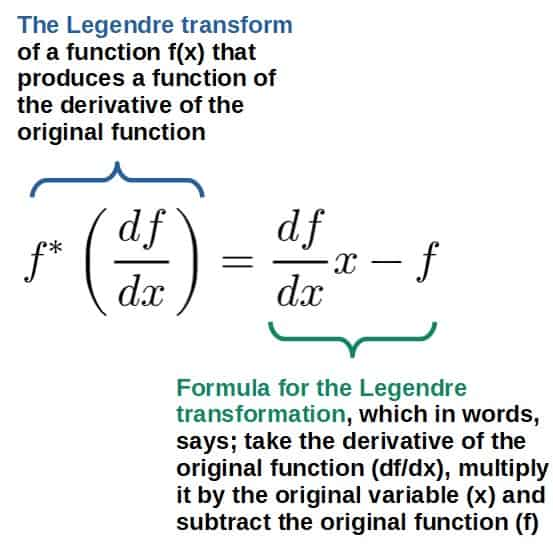
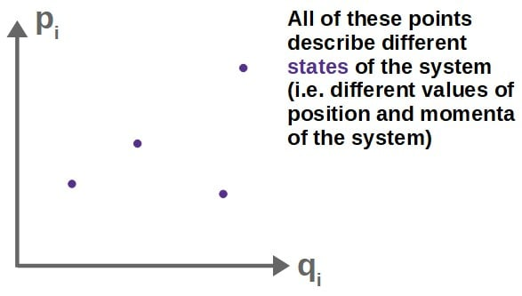
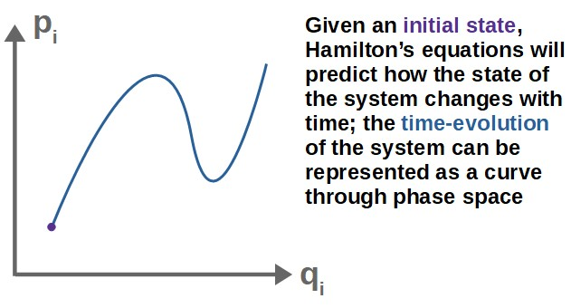
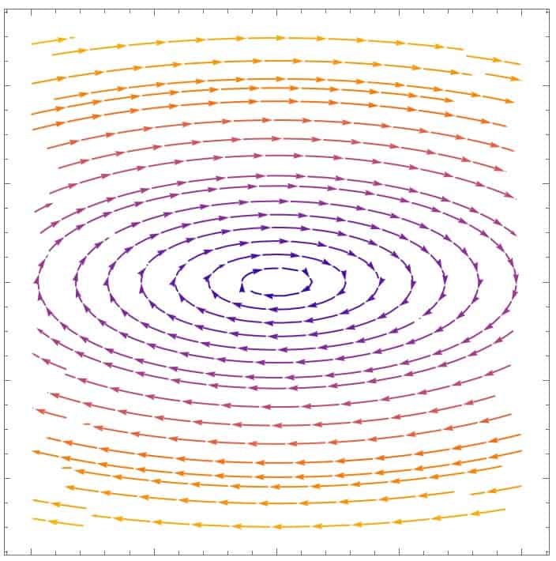
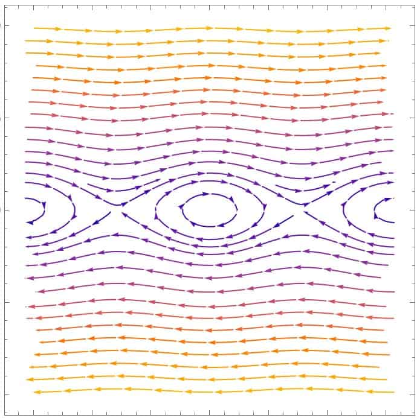
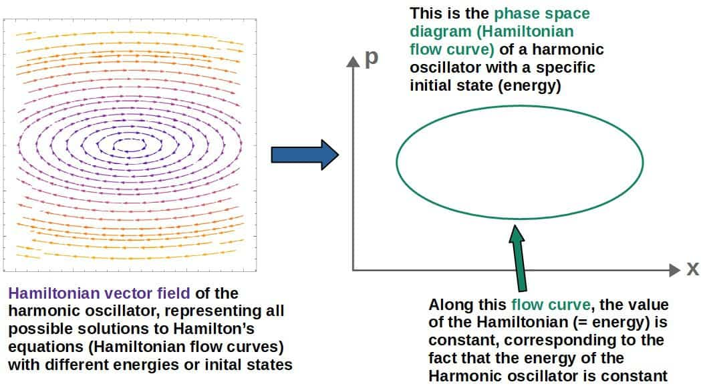
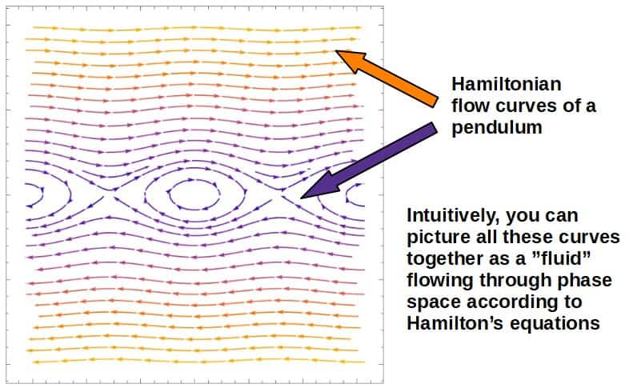
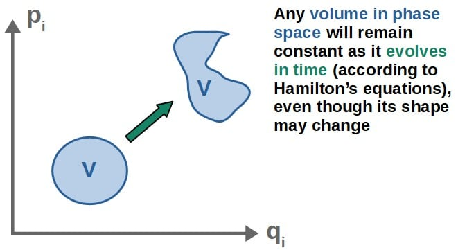

# Hamiltonian Mechanics For Dummies: An Intuitive Introduction

> The Hamiltonian is energy expressed in terms of momentum — and the equations that follow are beautiful.

*Originally published at [profoundphysics.com](https://profoundphysics.com/hamiltonian-mechanics-for-dummies/).*

---

In classical mechanics, there are quite many different formulations, which all have their unique purposes and advantages. One of these formulations is called **Hamiltonian mechanics**.

**As a general introduction, Hamiltonian mechanics is a formulation of classical mechanics in which the motion of a system is described through total energy by Hamilton’s equations of motion. Hamiltonian mechanics is based on the Lagrangian formulation and is also equivalent to Newtonian mechanics.**

Even though Newtonian, Lagrangian and Hamiltonian mechanics are all equivalent in principle, what really makes Hamiltonian mechanics unique is its **geometric interpretation** and the concept of **phase space**.

Hamiltonian mechanics also has its own advantages and applications in more advanced physics, such as in **quantum mechanics** and **quantum field theory**.

The context of this article is more about what Hamiltonian mechanics means in **classical mechanics**, although I will also give some insights about Hamiltonian mechanics and its significance to other areas in physics.

Hamiltonian mechanics does have a little bit to do with **Lagrangian mechanics**, so I’d recommend reading [this introductory article](https://profoundphysics.com/lagrangian-mechanics-for-beginners/) first if you don’t know anything about the Lagrangian formulation.

**Quick tip**: To build a deep understanding of Lagrangian mechanics (which you will need to really understand Hamiltonian mechanics), I’d also highly recommend checking out my book **[Lagrangian Mechanics For The Non-Physicist](https://profoundphysicscourses.com/lagrangian-mechanics-book/)** (link to the book page). The book is aimed to be a beginner-friendly and easy-to-understand read, but it will teach you **everything you need to know about Lagrangian mechanics and its applications** – regardless of your previous knowledge – with a focus on intuitive understanding and step-by-step examples.

Table of Contents

Toggle

## Why Do We Need Hamiltonian Mechanics?

Before we get started on the actual details of the **Hamiltonian formulation**, I think it’s important to make explicitly clear why exactly you would want to learn and even consider Hamiltonian mechanics.

In many cases, the importance of Hamiltonian mechanics is not quite obvious as it can be used to **solve mechanics problems just as well as Lagrangian mechanics** – so, what new does it really bring to the table?

The real importance and beauty of Hamiltonian mechanics comes from its **geometric structure**, which simply does not exist in the Lagrangian formulation.

In Hamiltonian mechanics, the way a system changes with time can be interpreted geometrically as a **flow in phase space** (which I’ll explain later) and this geometric notion has a lot of really deep consequences to the nature of physics in general.

There are also quite a lot of important applications and uses for Hamiltonian mechanics (which Newtonian or Lagrangian mechanics are not as well suited for), especially in other areas of physics.

Below, I’ve included a list of various **applications of the Hamiltonian formulation to other areas of physics**.

**Thermodynamics and statistical mechanics**:

- Statistical mechanics heavily relies on the notion of **phase space**, which is a central idea in Hamiltonian mechanics. Therefore, many concepts in statistical mechanics require Hamiltonian mechanics to be understood properly.
- An example of this is for understanding the relation between **conservative systems** and the **maximization of entropy**. For this, Hamiltonian mechanics provides some interesting insights, which we’ll look at later in this article.

**Perturbation theory and chaos**:

- In cases where the equations of motion for a system are **too complicated to solve analytically**, perturbation theory can be used to find **approximate solutions** and this is often easiest done using the Hamiltonian formalism.
- An example of this is for computing **relativistic corrections to planetary orbits**, such as the perihelion precession. This can be done using perturbation theory and the Hamiltonian formulation.
- Also, Hamiltonian mechanics, with the concept of phase space, lends itself really well for **chaos theory**, where we may want to analyze whether a complicated dynamical system is chaotic or not.

**Quantum mechanics and quantum field theory**:

- In quantum mechanics, the Hamiltonian of a classical system turns into the **Hamiltonian operator** for a quantum system and this is used to calculate the energy levels of various quantum systems through the **Schrödinger equation**.
- The Hamiltonian operator can be generalized to **quantum field theory** in a process known as **canonical quantization**, in which the Hamiltonian of a quantum field can be thought of as an “infinite number of quantum harmonic oscillators”.

**Special and general relativity**:

- The Hamiltonian formalism can be applied quite straightforwardly to define the notion of **energy in special relativity**. This can then be used to, for example, derive the famous formula **E=mc2** (which I show in [this article](https://profoundphysics.com/special-relativity-for-dummies-an-intuitive-introduction/)).
- In general relativity, the concept of **Hamiltonian flow** (which describes the time evolution of a system in phase space) can be applied to derive **geodesics**, which are paths of objects in *curved spacetime* under the influence of gravity.
- The Hamiltonian formulation can often be used to find **conserved quantities** much more easily than by using the Lagrangian formulation. An example of this is the derivation of **Carter’s constant** for motion around a black hole, which otherwise would be quite difficult to find if it wasn’t for the tools of Hamiltonian mechanics.

You’ll find more information specifically on how the Lagrangian and Hamiltonian formulations are applied in areas like quantum mechanics, relativity and quantum field theory in [this article](https://profoundphysics.com/lagrangian-vs-hamiltonian-mechanics/).

Hopefully I have now given you at least a little bit of motivation for why you would want to learn Hamiltonian mechanics.

As I said earlier, the real beauty and uniqueness of Hamiltonian mechanics comes from its **geometric nature** (which we’ll explore later in this article) that other formulations of classical mechanics just don’t really have.

That being said, we can now start discussing the basics of Hamiltonian mechanics.

## The Intuition Behind Hamiltonian Mechanics

Hamiltonian mechanics is all about describing the motion, or **time evolution**, of a system through its **energy**.

In fact, this is exactly what we do in Lagrangian mechanics as well where analyze the time evolution of a system by looking at at the **kinetic and potential energy of a system** (I recommend you read my [introduction to Lagrangian mechanics](https://profoundphysics.com/lagrangian-mechanics-for-beginners/) if this concept does not sound familiar).

Indeed, knowing the kinetic energy and potential energy at each point in time allows us to predict the **motion of the system**.

Consider, for example, the trajectory of a ball or some other object thrown in the air:

In Lagrangian mechanics, we use the **Lagrangian of a system** to essentially encode the kinetic and potential energies at each point in time. More precisely, the Lagrangian is the difference of the two, L=T-V.

In Hamiltonian mechanics, the same is done by using the **total energy of the system** (which conceptually you can think of as T+V, but we’ll develop a more general definition soon).

Now, isn’t the total energy supposed to be **conserved**, so it’s just a *constant*? How can it be used to predict the motion of a system then?

Well, surprisingly, this works exactly because of the fact that the total energy is conserved. This will become very clear as you read through this article.

In Hamiltonian mechanics, we usually look at **energy as a function of momentum and position** (I’ll explain why soon):

$$E\left(x{,}p\right)=\frac{p^2}{2m}+V\left(x\right)$$

This is the total energy for a particle moving in the x-direction with kinetic energy T=p2/2m (which is really just T=1/2mv2, but written in terms of momentum p).

To predict the motion of the system, well, the total energy stays constant but the kinetic and potential terms will vary throughout the trajectory of the particle.

We can therefore look at how both of these change individually and since the **total energy has to stay constant**, this allows us to relate the change in kinetic energy with the change in potential energy (as the sum of these two changes has to be zero).

Intuitively, the **changes in the kinetic and potential energies** can be obtained by “differentiating” the energy with respect to its variables, p and x (this works because p and x are treated as independent variables):

$$\frac{\partial E}{\partial x}=\frac{\partial V\left(x\right)}{\partial x}=F=-\frac{dp}{dt}$$

Here, I’ve used the fact that the derivative of the potential is just minus the force (if the force is conservative) and F=dp/dt (Newton’s second law).

$$\frac{\partial E}{\partial p}=\frac{1}{2m}\frac{\partial p}{\partial p}p^2=\frac{p}{m}=v$$

Here, p/m intuitively is just the velocity.

These are basically **Hamilton’s equations of motion**, with v=dx/dt (which we’ll look at in more detail and generality later):

$$\frac{dp}{dt}=-\frac{\partial E}{\partial x}$$
$$\frac{dx}{dt}=\frac{\partial E}{\partial p}$$

Now, Hamilton’s equations are more general than these and they are based on, not exactly the total energy in the usual sense, but a more general function (called the **Hamiltonian**) that usually does correspond to the total energy.

Then looking at the changes in the Hamiltonian, we can **predict the time evolution of a system from Hamilton’s equations, which tell us how the position and momentum change with time**.

Indeed, **position** and **momentum** are the *only* variables we need to know about in Hamiltonian mechanics. But why position and momentum, exactly? Why not, for example, position and velocity?

### Why Do We Use Position and Momentum In Hamiltonian Mechanics?

In Hamiltonian mechanics, we take the **total energy of a system** (or more generally, the Hamiltonian of the system) to be a **function of position and momentum**.

Hamilton’s equations of motion are then used to predict **how the position and momentum change with time**.

Now, the usefulness of this comes from the fact that, first of all, position and momentum are *all* we need to predict how any system changes with time.

Secondly, the use of momentum instead of something like velocity, really comes from how we define momentum more generally in Lagrangian mechanics.

You may recall from Lagrangian mechanics that the **generalized momentum** is defined in terms of the Lagrangian as:

$$p_i=\frac{\partial L}{\partial \dot q_i}$$

Indeed, this definition is very general since it works even for *fields* (to describe the “momentum density” of a classical or even a quantum field).

So, **we use momentum for the simple reason that it can be generalized more easily than something like velocity** (which becomes very apparent in quantum mechanics especially).

In fact, we’ll see that the (generalized) momentum is NOT always as simply related to the velocity as p=mv (meaning that in general, momentum and velocity aren’t always just related to each other by a simple factor of m), in which case we need this more general notion of momentum.

Also, the use of momentum instead of velocity turns out to be much more useful in **quantum mechanics**, since there is a deep relationship between momentum and position (**the Heisenberg uncertainty principle**).

Moreover, using momentum and position also allows us to construct a geometric way of looking at Hamiltonian mechanics with the use of **phase space**.

We will see that the geometry and the mathematics related to the idea of phase space are incredibly rich and beautiful and this generally only works when using momentum and position.

## The Hamiltonian: What Is It and Why Do We Need It?

Hamiltonian mechanics is based on the notion of constructing a **Hamiltonian** for a particular system, similarly to how a Lagrangian can be constructed for a system. But what exactly is the Hamiltonian?

**In short, the Hamiltonian is a function of the position and momenta of a system and it can be used to predict how the system evolves with time through Hamilton’s equations. In most cases, the Hamiltonian corresponds to the total energy of a system**.

Now, Hamiltonian mechanics is generally based on the principles of Lagrangian mechanics, so it is natural to look at how the Hamiltonian compares to the Lagrangian.

In many cases, the Hamiltonian will correspond exactly to the **total energy** of a system, which you can intuitively think of having the form T+V (T being kinetic energy and V potential energy).

Now, compare this to the Lagrangian that has the form of T-V. It might seem intuitive to then ask the question; are the two connected in any way?

The answer is yes, through something called a **Legendre transformation**.

However, we need to note a few things first. First, recall that **the Lagrangian is a function of the generalized positions and generalized velocities** (which are generalized coordinates, typically expressed as q’s):

$$L=L\left(q_i\ {,}\ \dot q_i\right)$$

In a similar fashion, **the Hamiltonian is a function of the generalized positions and generalized momenta**:

$$H=H\left(q_i\ {,}\ p_i\right)$$

So, Hamiltonian mechanics also preserves the use of **generalized coordinates**, which is one of the key advantages of Lagrangian mechanics over Newtonian mechanics (I have a full [article comparing Lagrangian and Newtonian mechanics](https://profoundphysics.com/lagrangian-vs-newtonian-mechanics-the-key-differences/) that explains this).

Now, what is the actual form of the Hamiltonian? Well, the **general form of the Hamiltonian** is defined as follows:

$$H=\sum_i^{ }\dot{q}_ip_i-L$$

You may wonder how this has anything to do with the energy. I will explain this soon.

So, the Hamiltonian is actually defined in terms of the Lagrangian, which comes from doing a **Legendre transformation of the Lagrangian**.

Moreover, in this form, the Hamiltonian is actually a function of the velocities even though I said it would be a function of position and momenta only. We’ll come back to this later in the article.

## Legendre Transformation Between The Lagrangian and The Hamiltonian

The **Legendre transformation** is a way to transform a function of some variable into a new function of a different variable, while still containing **all of the same information** as the original function.

Geometrically, this has to do with essentially encoding information about a function into its **tangent lines** at every point.

For our purposes, **the Legendre transformation allows us to change the Lagrangian that is a function of position and velocity into a new function, the Hamiltonian, that is a function of position and momentum**.

Mathematically, the Legendre transformation does the following; it takes a function f(x) and produces a new function f\*(df/dx), the Legendre transform of f, that is a function of the **derivative of the original function**.

The actual formula for the Legendre transformation is given by:

 

If you actually just start plugging in a function f(x) into this formula, you’ll get another function of x as a result, which sort of defeats the purpose of the Legendre transform; to obtain a function of a new variable. This is exactly the same “issue” we will encounter in Hamiltonian mechanics and I’ll show you how to work with that later.

In case you’re interested, I have a **full article on the Legendre transformation**, which you’ll find [here](https://profoundphysics.com/legendre-transformations-for-dummies-intuition-and-examples/). The article covers the intuition behind the Legendre transformation, its derivation as well as its importance in classical mechanics and thermodynamics.

When applying the Legendre transformation to the Lagrangian, we’re able to obtain a new function, that is now a function of **position and momenta**. This is exactly the Hamiltonian, which has the formula:

$$H\left(q_i{,}\ p_i\right)=\sum_i^{ }p_i\dot{q}_i-L$$

You’ll find the exact **derivation** of this below, but really, the important thing is that the **Hamiltonian is exactly the Legendre transform of the Lagrangian**. This explains why it has the particular form given above.

Derivation of The Hamiltonian From The Lagrangian

Our starting point for deriving the Hamiltonian is naturally going to be the Lagrangian. The nice thing is that, actually, we do not even need to know the specific form of the Lagrangian, all we need is to know which variables it is a function of.

These are, of course, the generalized position and velocity:

$$L=L\left(q_i{,}\ \dot q_i\right)$$

Our goal is to change the Lagrangian into some new function of the position and momenta. The way to do this is by a Legendre transformation, specifically on the velocity-variable (in other words, we can do a Legendre transformation on just one of the variables while keeping the other variable unchanged).

Now, by definition, if we were to do a Legendre transformation of the Lagrangian, we would get a function (L\*) of the position as well as the derivative of the Lagrangian with respect to the old variable, the velocity:

$$L\left(q_i{,}\ \dot{q}_i\right)\ \ \Rightarrow\ \ L^{\ast}\left(q_i{,}\ \frac{\partial L}{\partial\dot{q}_i}\right)$$

Since the Lagrangian is a multivariable function, we have to use a partial derivative here.

This is completely analogous to how the Legendre transformation of a function f(x) gives a new function of the derivative of the old function:

$$f\left(x\right)\ \ \Rightarrow\ \ f^{\ast}\left(\frac{df}{dx}\right)$$

Anyway, what is the actual form of this new function L\*?

For that, we use the Legendre transformation formula, which means taking the product of the new variable and the original variable (which would be the velocity and the partial derivative of the Lagrangian) and subtracting the original function (the Lagrangian):

$$L^{\ast}\left(q_i{,}\ \frac{\partial L}{\partial\dot{q}_i}\right)=\frac{\partial L}{\partial\dot{q}_i}\dot{q}_i-L$$

So far, we haven’t done any physics. We’ve really just performed a bunch of mathematical operations, but we can now make use of the definition of the generalized momentum, which is exactly this derivative of the Lagrangian:

$$p_i=\frac{\partial L}{\partial\dot{q}_i}$$

Inserting this into the formula for L\*, we get:

$$L^{\ast}\left(q_i{,}\ \frac{\partial L}{\partial\dot{q}_i}\right)=\frac{\partial L}{\partial\dot{q}_i}\dot{q}_i-L\ \ \Rightarrow\ \ L^{\ast}\left(q_i{,}\ p_i\right)=p_i\dot{q}_i-L$$

Now, if the system we’re describing with this contains multiple particles with different velocities and momenta, for example, we should really be summing over all of the velocities and momenta here:

$$L^{\ast}\left(q_i{,}\ p_i\right)=\sum_i^{ }p_i\dot{q}_i-L$$

This Legendre transform of the Lagrangian indeed has a special name and it’s exactly the Hamiltonian H:

$$H\left(q_i{,}\ p_i\right)=\sum_i^{ }p_i\dot{q}_i-L$$

This is also why Hamiltonian mechanics is technically based on Lagrangian mechanics and **to construct a Hamiltonian, you first need a Lagrangian**.

So, if you really think about it, the Hamiltonian is simply a **different and completely equivalent way** to contain all of the same information about a system as the Lagrangian does.

However, Hamiltonian mechanics and the Hamiltonian still give us a very *unique* perspective on classical mechanics as well as lots of useful and interesting results.

## Why Does the Hamiltonian Represent Total Energy?

Before we get to Hamilton’s equations, it’s important to address what the Hamiltonian really means in a physical perspective; **the total energy of a system**.

But why is this the case? Below I show you a simple example of how the Hamiltonian gives you the total energy of a system.

Why Does The Hamiltonian Represent Total Energy?

One of the simplest systems we could have is a point particle moving in some potential in one dimension and here I’ll demonstrate that the Hamiltonian of such a system indeed gives you the total energy of the system.

Now, the kinetic energy of a point particle in 1D is simply ½mv2 and the potential energy is some function V(x).

We can define our generalized coordinates to be x (as the position) and v (as the time derivative of the position):

$$q_i=x\ {,}\ \ \dot{q}_i=v$$

The Lagrangian for this system is then given by T-V, so simply $L=T-V=\frac{1}{2}mv^2-V\left(x\right)$. We can calculate the generalized momentum (which I’ll just call p since there is only one momentum coordinate or this system) from this Lagrangian:

$$p=\frac{\partial L}{\partial v}=mv$$

The Hamiltonian of this system is simply:

$$H=\sum_i^{ }p_i\dot{q}_i-L=mv\cdot v-\left(\frac{1}{2}mv^2-V\left(x\right)\right)$$

Note that we should technically express the Hamiltonian in terms of position and momenta, not velocity (which can be done by solving for the velocity in terms of momentum from the p=mv relation). However, for the purpose of this “demonstration”, it really doesn’t matter.

We can simplify this:

$$H=mv^2-\frac{1}{2}mv^2+V\left(x\right)=\frac{1}{2}mv^2+V\left(x\right)$$

Indeed this is exactly the total energy of the system (kinetic+potential)!

An additional reason why it makes sense to think of the Hamiltonian as the total energy is because the Hamiltonian is also conserved in particular cases. I discuss this more in [my article on Noether’s theorem](https://profoundphysics.com/noethers-theorem-a-complete-guide/).

Even though the example above is a fairly simple one, it’s worth noting that the general idea (that the Hamiltonian represents total energy) is usually true in much more complicated systems as well.

In fact, it works even in **special relativity**, where the Hamiltonian can be used to construct the total energy of a relativistic system and interestingly, the **famous formula E=mc2** (rest energy) pops out pretty much automatically. I show how this is done in my [introduction to special relativity](https://profoundphysics.com/special-relativity-for-dummies-an-intuitive-introduction/).

To me, it’s also quite beautiful that by transforming the Lagrangian in pretty much a purely mathematical way (the Legendre transformation), we somehow end up with something that has a very **physical meaning**, namely the Hamiltonian that represents energy.

## How To Actually Find The Hamiltonian of a System (Practical Steps)

Here’s a quick **step-by-step process** to actually find the Hamiltonian of a system:

1. **Construct the Lagrangian for the system through a set of generalized coordinates**.
2. **Find the generalized momenta from the Lagrangian**.
3. **Solve for the velocities in terms of the generalized momenta**.
4. **Insert the velocities in terms of momenta into the general form of the Hamiltonian**.
5. **Simplify. You should now have the Hamiltonian as a function of position and momenta**.

Down below, you’ll find examples of exactly how to do this in practice.

Now, the steps #3 and #4 are really important even though they may seem a little arbitrary.

However, it’s exactly these steps that allow us to **express the Hamiltonian completely as a function of position and momenta** instead of velocity.

This is generally what we want to do when constructing a Hamiltonian.

The formulas you’re going to need for these steps are the formulas for the **Lagrangian**, for the **generalized momenta** and for the **general form of the Hamiltonian**:

$$L=T-V\ {,}\ \ p_i=\frac{\partial L}{\partial\dot{q}_i}\ {,}\ \ H=\sum_i^{ }p_i\dot{q}_i-L$$

How To Find The Hamiltonian of a System (Practical Examples)

Let’s begin with a very simple example; a particle moving in the x-direction under some potential V(x). So, our generalized coordinate here will be the position x. The Lagrangian of this particle is then:

$$L=\frac{1}{2}m\dot{x}^2-V\left(x\right)$$

The $\dot{x}$ here is the velocity of the particle, since the x-direction is our only spatial dimension here.

We then calculate the generalized momenta of the system, which there is only one of (I’ll call this just p):

$$p=\frac{\partial L}{\partial\dot{x}}=m\dot x$$

Here’s the important step we have to do in order to get the Hamiltonian to be in the correct form; we solve for the velocity in terms of the momentum:

$$p=m\dot{x}\ \ \Rightarrow\ \ \dot{x}=\frac{p}{m}$$

We’ll then construct the Hamiltonian as:

$$H=\sum_i^{ }p_i\dot{q}_i-L=p\dot{x}-\frac{1}{2}m\dot{x}^2+V\left(x\right)$$

In order to get the Hamiltonian as a function of position and momenta, we insert the velocity in terms of the momentum we just solved for above into this:

$$H=p\dot{x}-\frac{1}{2}m\dot{x}^2+V\left(x\right)\ \ \Rightarrow\ \ H=p\frac{p}{m}-\frac{1}{2}m\left(\frac{p}{m}\right)^2+V\left(x\right)$$

We can simplify this to give:

$$H=\frac{p^2}{2m}+V\left(x\right)$$

This is the Hamiltonian of a particle in one dimension. This may look familiar to you; this is just the total energy (kinetic+potential) with the kinetic energy expressed in terms of momentum as this p2/2m -term.

Let’s do another example; the **simple pendulum**. In this example, the pendulum bob will have mass m and the length of the pendulum rod is l.

We can choose our generalized coordinate (only one is needed) to be the angle relative to the vertical axis, call this θ (which is a function of time). The Lagrangian for the pendulum is going to be:

$$L=\frac{1}{2}ml^2\dot{\theta}^2+mgl\cos\theta$$

A good explanation of where this comes from can be found from the video below:

Anyway, let’s now calculate the generalized momenta. For this pendulum, we only have one momenta since there is only one generalized coordinate and this will, of course, be the momentum associated with the θ-coordinate:

$$p_{\theta}=\frac{\partial L}{\partial\dot{\theta}}=ml^2\dot{\theta}$$

We now solve this, again, for the velocity in terms of the momentum:

$$p_{\theta}=ml^2\dot{\theta}\ \ \Rightarrow\ \ \dot{\theta}=\frac{p_{\theta}}{ml^2}$$

Let’s now construct the Hamiltonian:

$$H=\sum_i^{ }p_i\dot{q}_i-L=p_{\theta}\dot{\theta}-\left(\frac{1}{2}ml^2\dot{\theta}^2+mgl\cos\theta\right)$$

We now insert the velocity in terms of the momentum into this and simplify to get:

$$H=\frac{p_{\theta}^2}{2ml^2}-mgl\cos\theta$$

This is the Hamiltonian of a simple pendulum. Indeed, this is also the total energy of the pendulum, but it may not be too obvious just from looking at this.

Now, hopefully these examples illustrated the process of finding a Hamiltonian.

This method is going to work pretty much generally in all cases, with the only exceptions being cases where the generalized momenta are way too complicated to be able to solve for the velocity.

As mentioned earlier, if you’re looking to have a **deep understanding of Lagrangian mechanics**, my book **[Lagrangian Mechanics For The Non-Physicist](https://profoundphysicscourses.com/lagrangian-mechanics-book/)** (link to the book page) is the perfect starting point for you. The best part is that you’ll get to **learn everything from scratch** as the book gradually builds upon each topic to eventually cover things like **symmetries in physics** and **Noether’s theorem** – beginning all the way from basic Newtonian mechanics.

## Hamilton’s Equations of Motion

**Hamilton’s equations of motion** are generally **two first order differential equations** (they contain only first derivatives) and they are defined as follows:

$$\dot q_i=\frac{\partial H}{\partial p_i}$$
  
$$\dot{p}_i=-\frac{\partial H}{\partial q_i}$$

Hamilton’s equations work analogously to the Euler-Lagrange equation in Lagrangian mechanics, in the sense that you plug a particular Hamiltonian into them and you get **equations of motion that completely describe the system**.

Now, Hamilton’s equations describe **how the position and momenta of a system change with time** (that’s what you see on the left-hand side above) and these are determined completely by the **Hamiltonian** of that system.

In a sense, the Hamiltonian then describes the **time evolution** of a system. Indeed, this is exactly what it does in quantum mechanics as well as the **Hamiltonian operator** in the Schrödinger equation.

We will look at how these equations are used and what they mean soon, but first; where do Hamilton’s equations come from in the first place?

The simple answer is that they come from looking at **how the Hamiltonian itself changes**.

Intuitively, we can determine how a system changes with time just by looking at **how its energy changes**, or more accurately, how **each part of the energy** (kinetic and potential energies) is changing.

Since the Hamiltonian is taken to represent the energy of a system, we can determine the motion of the system simply by looking at **changes in the Hamiltonian**. You’ll see exactly how this is done below.

Derivation of Hamilton's Equations

Now, mathematically, the way to see how the Hamiltonian “changes”, we look at a small “variation” in the Hamiltonian, denoted by δH (this is the same mathematical procedure we do with the principle of least action).

This δH is basically just the “variational” version of a total derivative, at least it works in the same way; we take the partial derivatives of the Hamiltonian with respect to its variables (qi and pi) and then multiply by the change in these variables:

$$\delta H=\frac{\partial H}{\partial q_i}\delta q_i+\frac{\partial H}{\partial p_i}\delta p_i$$

This would be the general formula for the variation of any function that depends on the variables q and p.

By itself, we don’t really do much with this (however, keep this formula in mind), but we can now make use of the Legendre transform definition of the Hamiltonian, $H=\sum_i^{ }p_i\dot q_i-L$.

Since we’re interested in how this Hamiltonian changes, it’s enough to concentrate on only one “term” in this sum and this will give us everything we need. We’ll therefore drop this summation sign (purely for the sake of notational simplicity) and write $H=p_i\dot{q}_i-L$ instead.

Let’s calculate what the variation in the Hamiltonian would be according to this general form (we’ll then be able to equate this to the formula from above):

$$\delta H=\delta\left(p_i\dot{q}_i\right)-\delta L$$

On this first term, we use essentially the product rule for variations:

$$\delta\left(p_i\dot{q}_i\right)=\dot{q}_i\delta p_i+p_i\delta\dot{q}_i$$

On the second term, the Lagrangian is a function of the generalized position and velocity, so the variation in the Lagrangian will give us:

$$\delta L=\frac{\partial L}{\partial q_i}\delta q_i+\frac{\partial L}{\partial\dot{q}_i}\delta\dot{q}_i$$

Inserting both of these into the formula for δH above, we get:

$$\delta H=\delta\left(p_i\dot{q}_i\right)-\delta L=\dot{q}_i\delta p_i+p_i\delta\dot{q}_i-\frac{\partial L}{\partial q_i}\delta q_i-\frac{\partial L}{\partial\dot{q}_i}\delta\dot{q}_i$$

We can actually simplify this greatly by making use of the Euler-Lagrange equation. Let’s write it in the following form:

$$\frac{\partial L}{\partial q_i}=\frac{d}{dt}\frac{\partial L}{\partial\dot{q}_i}=\frac{d}{dt}p_i=\dot p_i$$

Here, we’ve made use of the fact that the partial derivative of the Lagrangian w.r.t velocity is the definition of the generalized momentum.

So, the derivative of the Lagrangian w.r.t position is just the time derivative of the momentum and the derivative of the Largangian w.r.t velocity, well, that’s just the definition of the momentum:

$$\frac{\partial L}{\partial q_i}=\dot{p}_i\ {,}\ \ \frac{\partial L}{\partial\dot{q}_i}=p_i$$

We can now insert these into our expression for δH to get:

$$\delta H=\dot{q}_i\delta p_i+p_i\delta\dot{q}_i-\frac{\partial L}{\partial q_i}\delta q_i-\frac{\partial L}{\partial\dot{q}_i}\delta\dot{q}_i\\=\dot{q}_i\delta p_i+p_i\delta\dot{q}_i-\dot p_i\delta q_i-p_i\delta\dot{q}_i$$

The last and second terms here cancel and we’re just left with:

$$\delta H=\dot{q}_i\delta p_i-\dot{p}_i\delta q_i$$

Now, recall the formula for the variation of the Hamiltonian we had earlier:

$$\delta H=\frac{\partial H}{\partial q_i}\delta q_i+\frac{\partial H}{\partial p_i}\delta p_i$$

By definition, these are both δH, so they must be equal. We will also move everything to one side and factor out the δqi and δpi:

$$\dot{q}_i\delta p_i-\dot{p}_i\delta q_i=\frac{\partial H}{\partial q_i}\delta q_i+\frac{\partial H}{\partial p_i}\delta p_i\\\Rightarrow\ \ \left(\frac{\partial H}{\partial q_i}+\dot{p}_i\right)\delta q_i+\left(\frac{\partial H}{\partial p_i}-\dot{q}_i\right)\delta p_i=0$$

In general, the only way for this expression to be zero is if both of these things inside the parentheses are equal to zero. We then get the two Hamilton’s equations of motion from these:

$$\dot{p}_i=-\frac{\partial H}{\partial q_i}\ {,}\ \ \dot{q}_i=\frac{\partial H}{\partial p_i}$$

Something that’s worth noting is that **Hamilton’s equations of motion are completely equivalent to Newton’s laws of motion as well as to the Euler-Lagrange equation**.

We can see this by doing a little “consistency check”. Let’s consider the Hamiltonian for a single particle in one dimension again:

$$H=\frac{p^2}{2m}+V\left(x\right)$$

Plugging this into Hamilton’s equations, we get (by defining the generalized coordinate here to be x and the generalized momentum as just p):

$$\dot{p}_i=-\frac{\partial H}{\partial q_i}\ \ \Rightarrow\ \ \dot{p}=-\frac{\partial V\left(x\right)}{\partial x}\\\dot{q}_i=\frac{\partial H}{\partial p_i}\ \ \Rightarrow\ \ \dot{x}=\frac{p}{m}$$

The first one here is simply **Newton’s second law**, F=ma (for a conservative force F=-∂V/∂x and ma=dp/dt) and the second one is just the **velocity**, expressed in terms of momentum.

So, Hamilton’s equations are indeed consistent with Newton’s laws.

Now, in general, **solutions to Hamilton’s equations give you the positions and momenta of a system as functions of time**, i.e. the “time evolution” of these quantities (this actually has an interesting geometric perspective, which we’ll get to soon).

You should also note that Hamilton’s equations are two *coupled* differential equations, meaning that generally, they both have to be solved simultaneously.

This can be seen even in the example above as both of the equations contain x as well as p.

Hamilton's Equations For a Pendulum

For this example, consider again the Hamiltonian for a simple pendulum we derived earlier:

$$H=\frac{p_{\theta}^2}{2ml^2}-mgl\cos\theta$$

Let’s look at what Hamilton’s equations give us for this Hamiltonian. With this Hamiltonian, we have one generalized coordinate (θ) and one generalized momentum (pθ).

We’ll begin with the equation for velocity (time derivative of the generalized coordinate θ):

$$\dot{q_i}=\frac{\partial H}{\partial p_i}\ \ \Rightarrow\ \ \dot{\theta}=\frac{\partial H}{\partial p_{\theta}}$$

Inserting the Hamiltonian, we get:

$$\dot{\theta}=\frac{\partial H}{\partial p_{\theta}}=\frac{p_{\theta}}{ml^2}$$

From the second Hamilton’s equation, we get the time derivative of the momentum pθ:

$$\dot p_i=-\frac{\partial H}{\partial q_i}\ \ \Rightarrow\ \ \dot{p}_{\theta}=-\frac{\partial H}{\partial\theta}$$

Inserting the Hamiltonian, we have:

$$\dot{p}_{\theta}=-\frac{\partial H}{\partial\theta}=mgl\frac{\partial}{\partial\theta}\cos\theta=-mgl\sin\theta$$

So, we’ve now got two first order coupled differential equations:

$$\dot{p}_{\theta}=-mgl\sin\theta\\\dot{\theta}=\frac{p_{\theta}}{ml^2}$$

Sometimes it’s useful to keep them in this form (particularly for numerical solutions or for visualizing the so-called Hamiltonian flow curves we will look at soon), but we could also turn these into a single second order differential equation (which is what the Euler-Lagrange equation would give us).

To do this, let’s solve the second equation for pθ:

$$\dot{\theta}=\frac{p_{\theta}}{ml^2}\ \ \Rightarrow\ \ p_{\theta}=ml^2\dot{\theta}$$

Now, take the time derivative of this:

$$\dot p_{\theta}=ml^2\ddot{\theta}$$

We can now insert this into the first equation of motion:

$$\dot{p}_{\theta}=-mgl\sin\theta\ \ \Rightarrow\ \ ml^2\ddot{\theta}=-mgl\sin\theta$$

Canceling out some stuff, we get:

$$\ddot{\theta}=-\frac{g}{l}\sin\theta$$

This is now a second order differential equation we could solve for θ(t) and in fact, this is exactly the equation of motion the Euler-Lagrange equation would have given us from the Lagrangian directly.

 

If you want to get a MUCH deeper understanding of Lagrangian mechanics, I’d recommend checking out my book **[Lagrangian Mechanics For The Non-Physicist](https://profoundphysicscourses.com/lagrangian-mechanics-book/)** (link to the book page). The book will teach you everything you need to know about Lagrangian mechanics – and more.

## Phase Space In Hamiltonian Mechanics, Intuitively

The real beauty and uniqueness of Hamiltonian mechanics, compared to other formulations of classical mechanics, comes from the concept of **phase space** and the geometry associated with it.

In physics, a common way to describe systems is by different kinds of *spaces*.

**Spaces are basically coordinate systems that have some important quantity about a system on each axis**.

However, these spaces often require more dimensions than just 2 or 3, meaning that mathematically, we would call them **manifolds**.

Examples of some different spaces are:

- **Physical space**: Newtonian mechanics describes the motion of a system always in physical 3D space.
- **Configuration space**: Lagrangian mechanics describes the state of a system in a higher dimensional configuration space by specifying all the generalized coordinates of the system at each point in time (the “configuration” of the system).

In Hamiltonian mechanics, on the other hand, we use **phase space**.

Phase space describes the state of a system by specifying all the **generalized coordinates and their associated generalized momenta at each point in time** (making it a 2N-dimensional manifold if there are N generalized coordinates).

So, each point in the phase space describes the **state of the system** at a specific point in time, as each point will have a certain value of position and momentum, and these two quantities are enough to completely describe a classical system.

 

This is a 2D visualization of phase space. In general, you would have one axis for each generalized coordinate and momenta (so, for a particle moving in 3D, you’d have 3 generalized coordinates and 3 different momenta, making it a 6D phase space).

Now, **Hamilton’s equations describe how the position and momentum change with time**, so they define the **time-evolution** of a system in phase space.

In other words, given a specific **initial state** of a system (an initial point in phase space), Hamilton’s equations predict where this point will move next in phase space.

As time passes, this initial state of the system will then trace out some kind of **curve through phase space**.

This curve represents the **solutions to Hamilton’s equations of motion** (the coordinates and momenta as functions of time).

 

Mathematically, this curve through phase space is a parametric curve with time as its curve parameter. In case you’re not familiar with this, I cover parametric curves in detail in my [vector calculus course](https://profoundphysics.com/vectorcalc/).

Now, the really nice thing about phase space and these “flow curves” representing the time evolution of a system is that it can be used to **visualize how a given system behaves** in a very intuitive way.

In general, this is because these curves through phase space behave exactly as if they represented the ***flow of a fluid*** (I’ll explain this in more detail soon) and most of us do have some kind of an intuitive feel for how a fluid will behave.

This makes it possible to very much “see” in quite a geometric and intuitive way how a system will evolve with time.

Now, even if the phase space of a system is higher-dimensional and we can’t exactly picture it in our heads, it’s still possible to describe the **time evolution** mathematically very similarly to the flow of a fluid.

This opens up a whole new interpretation of classical mechanics and it allows for a very deep and interesting geometric perspective on the time evolution of a system (more on this later).

### Hamiltonian Vector Fields & Flow Curves Intuitively

Curves through phase space describe the time evolution of a system.

These curves are called **Hamiltonian flow curves** and they are solutions to Hamilton’s equations of motion. Some properties of these Hamiltonian flow curves are:

- **The value of the Hamiltonian is constant along any Hamiltonian flow curve**. This represents the fact that energy (the Hamiltonian) is **conserved** as the system evolves in time.
- If we’re dealing with a system with **non-conservative forces**, it’s still possible to model the time evolution with these Hamiltonian flow curves; however, in these cases, the Hamiltonian does not have a constant value along the curve.
- **Each Hamiltonian flow curve is a parametric curve through phase space that is parameterized by time as its curve parameter**. This is because solutions to Hamilton’s equations describe the coordinates and momenta as functions of time.
- **Hamiltonian flow curves are always incompressible**. This is known as **Liouville’s theorem**, which we’ll discuss later.

Now, how do we actually describe these curves? How can we visualize them in phase space, for example?

The answer to this comes from the concept of a **Hamiltonian vector field**.

Now, the idea that a Hamiltonian vector field is based on is that **a differential equation can often be visualized as a vector field** (or a “slope field”) and the solutions to a differential equation are then **curves along the vector field**.

Based on this idea, we can essentially **construct a vector field in phase space from Hamilton’s equations** (a Hamiltonian vector field) and the **Hamiltonian flow curves** will then be curves along this vector field.

Now, how do you actually do this in practice? Well, the nice thing about phase space is that we can basically imagine “stuff” flowing in it like a **fluid**.

Therefore, we could construct a “velocity” field, which would describe the velocity of this “phase space fluid” at each point.

In ordinary fluid dynamics, the **velocity field of a fluid** (in 2D Cartesian coordinates) can be written as a vector field of the form:

$$\vec{v}=\frac{dx}{dt}\hat{x}+\frac{dy}{dt}\hat{y}$$

The components of a velocity field are essentially the time derivatives of the position in each direction. The $\hat{x}$ and $\hat{y}$ are unit basis vectors in both the coordinate directions.

We can apply this concept directly to the “fluid in phase space” with the only exception that instead of x and y, we would now have the **phase space variables**, qi and pi. So, the “velocity field” in phase space, called the **Hamiltonian vector field**, would then be:

$$\vec{H}=\frac{dq_i}{dt}\hat{q}_i+\frac{dp_i}{dt}\hat{p}_i=\dot{q}_i\hat{q}_i+\dot p_i\hat{p}_i$$

These time derivatives can also be written as partial derivatives of the Hamiltonian itself by using **Hamilton’s equations of motion**:

$$\dot{q}_i=\frac{\partial H}{\partial p_i}\ {,}\ \ \dot{p}_i=-\frac{\partial H}{\partial q_i}$$

A Hamiltonian vector field that respects Hamilton’s equations can then be expressed as:

$$\vec{H}=\frac{\partial H}{\partial p_i}\hat{q}_i-\frac{\partial H}{\partial q_i}\hat{p}_i$$

Now, how do we actually use this in practice?

Simply put, given a Hamiltonian, we calculate these partial derivatives and form the Hamiltonian vector field, which should be a function of one of our **generalized coordinates** and its associated **generalized momentum**.

Once we have this 2D Hamiltonian vector field, we can then **plot it in phase space** (with the axes being our generalized coordinate and generalized momentum), just like we would plot any other vector field.

Note that this idea really only works with one generalized coordinate and one momenta, as we would not be able to visualize phase space in higher dimensions. However, the general idea of the Hamiltonian vector field is valid in *any dimensions.*

Let’s look at a simple example; **the harmonic oscillator**. The Hamiltonian of a harmonic oscillator (oscillating in the x-direction) is given by:

$$H=\frac{p^2}{2m}+\frac{1}{2}kx^2$$

Our generalized coordinate here is x and the generalized momentum associated with it is just p. The m and k are just constants (m being the mass of the “bob” or whatever is oscillating and k the spring constant).

The Hamiltonian vector field produced by this Hamiltonian would be:

$$\vec{H}=\frac{\partial H}{\partial p}\hat{x}-\frac{\partial H}{\partial x}\hat{p}=\frac{p}{m}\hat{x}-kx\hat{p}$$

This is essentially a vector field in phase space that is a function of the variables x and p. If we plot this vector field, it looks as follows:

 

This is a phase space plot of the Hamiltonian vector field for the harmonic oscillator. On the horizontal axis, we have the position x and on the vertical axis, the momentum p.

These curves that follow the field arrows are exactly the **Hamiltonian flow curves that represent solutions to Hamilton’s equations**!

Another quite interesting example is the Hamiltonian vector field for a **simple pendulum** (using the Hamiltonian we derived earlier):

$$\vec{H}=\frac{p_{\theta}}{ml^2}\hat{\theta}-mgl\sin\theta\hat{p}_{\theta}$$

Plotting this vector field, we have:

 

This is a phase space plot with the coordinate θ on the horizontal axis and the momentum pθ on the vertical axis.

Interestingly, for small momenta pθ and small angle θ, the pendulum behaves *exactly* like a harmonic oscillator (the elliptical shape), but for large momenta and angle, the motion is drastically different.

### What Are Phase Space Diagrams?

A **phase space diagram** is simply just the phase space “plot” of a ***single* Hamiltonian flow curve**, or in other words, the phase space plot of a given system with a **specific energy** (value of the Hamiltonian).

These Hamiltonian flow curves describe the **time evolution of the system with different energies** (i.e. initial states, since the energy is a constant and is thus determined by the initial momentum and position).

A phase space diagram of a system then represents the *specific* flow curve corresponding to the particular **initial state** of that system.

For example, in the above harmonic oscillator example, the phase space diagrams look like *ellipses*:

In other words, the **Hamiltonian vector field and the Hamiltonian flow curves** along the vector field represent **all possible solutions to Hamilton’s equations** (describing the time evolution of the system).

A **phase space diagram**, on the other hand, represents **one specific solution** that is determined by a **specific initial state** or equivalently, an **initial energy** (which remains constant for a conservative system).

Now, in terms of how this relates to how a system actually, *physically* changes with time, the phase space diagram of the system is enough to describe this completely.

Essentially, a phase space diagram gives you the **coordinates and momenta of the system at each point in time** (as the diagram curve is really a parametric curve that is a function of time), which indeed is enough to determine *everything* needed about the time evolution of a system.

As an example, I’ve made a little animation below that shows you **how the harmonic oscillator traces out an ellipse in phase space as it oscillates** (under a spring force F=-kx that changes its direction).

In the animation, the “point” that circles around the ellipse represents the state of the system (position and momentum) at each point in time, which as you can see, changes as the system evolves in time. This is essentially what it means for the Hamiltonian flow curves to describe the time-evolution of a system and this really comes from the fact that these flow curves should be thought of as parametric curves.

Below, I also have some discussion on the **physical interpretations** of the phase space diagram of the harmonic oscillator (such as what the shape and area of this ellipse represent physically).

What Does The Shape of This Phase Space Diagram Represent Physically?

Now, you can kind of intuitively expect that the phase space diagram of something in harmonic motion would look like a circular shape.

However, let’s look a bit deeper into this.

In fact, for different values of the mass (m) and the spring constant (k), the shape of this ellipse will be different. So, how exactly do these constants relate to how this phase space diagram looks like?

In Cartesian coordinates, an ellipse (centered at the origin) is described by the following equation:

$$\frac{x^2}{a^2}+\frac{y^2}{b^2}=1$$

The special case of this with a=b would describe a perfect circle – just a sidenote. You can try to think about what kind of physical situation that would correspond to in the case of the harmonic oscillator below!

In phase space (with coordinates x and p), this ellipse would therefore be described by:

$$\frac{x^2}{a^2}+\frac{p^2}{b^2}=1$$

Now, what would these constants be for the harmonic oscillator? Well, we can see that by looking at the Hamiltonian of the harmonic oscillator (remember, the value of the Hamiltonian is constant in any given phase space diagram):

$$H=\frac{p^2}{2m}+\frac{1}{2}kx^2$$

Let’s now divide by H on both sides:

$$1=\frac{p^2}{2mH}+\frac{kx^2}{2H}$$

This is indeed exactly the equation for an ellipse. So, we can compare this with the general form of the ellipse equation and see that the constants should be:

$$a^2=2mH\ {,}\ \ b^2=\frac{2H}{k}$$

Now, this also gives us an interesting relation between the motion of a harmonic oscillator and the shape of its phase space diagram. To see this, we can compare the two constants a and b, which basically dictate describe the shape of the ellipse.

In particular, if a > b, then the ellipse has a kind of horizontally elongated shape and vice versa, a vertically elongated shape if b > a (reference: [Wolfram MathWorld](https://mathworld.wolfram.com/Ellipse.html)). Specifically, looking at the ratio of a and b, we would have:

$$\frac{a^2}{b^2}=\frac{2mH}{\frac{2H}{k}}=mk\ \ \Rightarrow\ \ \frac{a}{b}=\sqrt{mk}$$

We can also write this in the form:

$$\frac{a}{b}=\sqrt{mk}=\sqrt{m^2\frac{k}{m}}=m\sqrt{\frac{k}{m}}=m\omega$$

This square root thing here is the definition of the angular frequency (ω) of a harmonic oscillator.

So, this essentially tells us that the shape of the phase space diagram for the harmonic oscillator is closely related to the angular frequency.

Another, perhaps even more interesting thing can be found by looking at the area of the ellipse (which is given by the formula A=πab):

$$A=\pi ab=\pi\sqrt{2mH}\sqrt{\frac{2H}{k}}=\pi\sqrt{\frac{4H^2m}{k}}=2\pi H\sqrt{\frac{m}{k}}$$

Now, if you’re familiar with the harmonic oscillator, you probably know that the period of one oscillation is given by the formula:

$$T=2\pi\sqrt{\frac{m}{k}}$$

So, the area of this ellipse is then:

$$A=HT$$

Or expressed in another way, the period of the oscillations is can be expressed as the ratio of the area of the ellipse to its energy, which is a constant (the Hamiltonian):

$$T=\frac{A}{E}$$

All in all, these are just examples of how phase space diagrams really do encode basically everything about a system and how that system behaves.

It’s worth noting that even though these Hamiltonian vector fields and flow curves in phase space seem like very abstract concepts, they do indeed have numerous **practical applications** as well.

For example, the idea of Hamiltonian flow curves can be applied to **general relativity**, where the **geodesics of particles through curved spacetime** can be derived as Hamiltonian flow curves (curves of a constant value of the Hamiltonian) in phase space.

Another, more technology-based application can be seen in the study of **optics**, in which an important principle known as the **conservation of etendue** can actually be derived as a direct result of the phase space formulation of Hamiltonian mechanics.

### Noether’s Theorem In Phase Space

In case you’re familiar with Noether’s theorem (which is often covered in the context of Lagrangian mechanics), you may wonder whether Noether’s theorem can be formulated **in the context of Hamiltonian mechanics and phase space** as well.

It indeed can! I’ve actually dedicated an entire section of [my complete guide on Noether’s theorem](https://profoundphysics.com/noethers-theorem-a-complete-guide/) to exactly this topic. So, check it out from the link if you’re interested to learn more.

Next, we’ll dive deeper into the concept of phase space and time evolution of systems by looking at a very fundamental principle known as **Liouville’s theorem**.

## Liouville’s Theorem (And Its Applications)

**Liouville’s theorem** is a theorem that states something very fundamental about the nature of phase space; the phase space “flow” is always **incompressible**.

Now, what exactly do I mean by this? Well, we can essentially think of a **point in phase space** as kind of like a *fluid particle*.

Physically, this particle (point in phase space) would correspond to some **initial state of a system**. The particle will then move around in phase space as dictated by **Hamilton’s equations**.

Each particle will then trace out its own trajectory (determined by Hamilton’s equations) and these are the **Hamiltonian flow curves**.

Together, all of these “particles” can be thought of as forming a **fluid that flows through phase space**.

Again, I want to stress that this isn’t some *physical* fluid (even though it does act like one), only an abstract type of fluid that allows us to intuitively picture what is going on.

In reality, this “fluid” is just a **collection of initial states** evolving in time trough phase space.

Now, the reason that this analogy is so useful is because of one really important property that this “phase space fluid” has; **incompressibility**.

When we say a fluid is incompressible, it simply means that **any given volume of the fluid will stay constant as the fluid flows around**.

This volume in phase space physically just means a “group” of a bunch of states of a system (as each point in the volume describes some state with a specific value for q and p).

 

Here we’re picturing the “phase space volume” as basically a 2D area, but in reality, it’s going to be a higher-dimensional volume in a 2N-dimensional phase space.

This is known as **Liouville’s theorem**; **any volume in phase space remains constant if it evolves according to Hamilton’s equations**.

Why should this be true, however? Well, it can actually be proven quite easily by our fluid analogy.

From fluid dynamics, the basic requirement that a fluid be incompressible is that its velocity field is **divergence-free**. This can be applied directly to our “phase space fluid” (see below).

A Simple Proof of Liouville's Theorem

The condition that a fluid is incompressible, as stated above, is that its velocity vector field is divergence-free:

$$\vec{∇}\cdot\vec{v}=0$$

If you’re interested in what this and the divergence in general really mean geometrically, I cover this in detail in my online course **[Vector Calculus For Physics: A Complete Self-Study Course](https://profoundphysics.com/vectorcalc/)**, which I’d highly recommend checking out if you’re interested in building a deeper understanding of a lot of the more advanced mathematics used in physics.

Anyway, we can prove Liouville’s theorem essentially by calculating the divergence of the “velocity field” of the phase space fluid (which, as a reminder, is the Hamiltonian vector field) and seeing whether it is zero or not.

So, the Hamiltonian vector field is defined as follows:

$$\vec{H}=\frac{\partial H}{\partial p_i}\hat{q}_i-\frac{\partial H}{\partial q_i}\hat{p}_i$$

Note; it’s enough for us to prove this for just one set of momentum and position.

The divergence of any vector field in ordinary (2D) Cartesian coordinates is defined as follows:

$$\vec{∇}\cdot\vec{F}=\frac{\partial F_x}{\partial x}+\frac{\partial F_y}{\partial y}$$

So, essentially taking the divergence of a vector field just means taking the partial derivatives of its components with respect to the variables in the given space.

We can apply this to the Hamiltonian vector field (where the coordinates are now the phase space variables, qi and pi):

$$\vec{∇}\cdot\vec{H}=\frac{\partial}{\partial q_i}\frac{\partial H}{\partial p_i}+\frac{\partial}{\partial p_i}\left(-\frac{\partial H}{\partial q_i}\right)$$

The order in which we take a partial derivative generally doesn’t matter, so we can “switch” the partial derivatives in the second term, giving us:

$$\vec{∇}\cdot\vec{H}=\frac{\partial}{\partial q_i}\frac{\partial H}{\partial p_i}-\frac{\partial}{\partial q_i}\frac{\partial H}{\partial p_i}=0$$

So, the Hamiltonian vector field is indeed divergence-free, which is exactly the statement that the flow of the “phase space fluid” is incompressible.

There’s one more, quite an important point to discuss; why is Liouville’s theorem important at all?

It may just seem like a very random property of phase space, but it’s actually hugely important for understanding the **nature of classical mechanics**.

When we say the phase space fluid is incompressible (any volume will remain constant), this means that the “amount” of fluid flowing into any piece of volume *must be the same* as the fluid flowing out of this volume (otherwise the volume of the fluid would change).

This means that if we were to *reverse* the “fluid flow” (mathematically, we would “reverse” the time to go *backwards*, i.e. t⇒-t), we could retrieve **all the information** about the states of the system at an *earlier time.*

This implies **time-reversibility**, which is a fundamental property of classical mechanics.

Another interesting implication of Liouville’s theorem is for **probability distributions** of systems.

In a simple sense, a volume in phase space is directly related to the **probability of a system to be in a given state of position and momentum** (this is especially useful in statistical mechanics when dealing with a large number of particles, such as in a gas).

A consequence of the volume being constant (which is Liouville’s theorem) is that the probability distribution of a system will remain **constant with time**.

Now, for an **equilibrium system** (imagine a gas, for example) a probability distribution that is constant in time is *exactly* the probability distribution that **maximizes the entropy of the given system** (a proof of this can be found in [this paper](https://www.oulu.fi/tf/statfys/lecture_2006/notes2.pdf)).

This can be used to derive, for example, the **Boltzmann distribution in statistical mechanics** (which is exactly the probability distribution that maximizes the entropy).

However, even more importantly, Liouville’s theorem gives an extremely deep link between **Hamiltonian mechanics** and **why an isolated system** (i.e. a system whose energy is conserved) ***maximizes* its entropy** in an equilibrium state.

## Hamiltonian Mechanics Examples (Downloadable PDF)

Below, you’ll find some examples of using Hamiltonian mechanics to help you practice or just get some more feel for the concepts (it’s a free PDF, feel free to download it for yourself if you wish).

**[Get the free PDF here](https://profoundphysics.com/hamiltonian-mechanics-examples-free-pdf/)**.

The PDF covers, for example, finding the equations of motion for the Earth in a circular orbit around the Sun as well as proving that the angular momentum is conserved.

We also look at constructing the Hamiltonian for a double pendulum as well as proving an interesting property of the Lagrangian relating to energy conservation.

---

*← [Back to the full archive](../index.html)*
