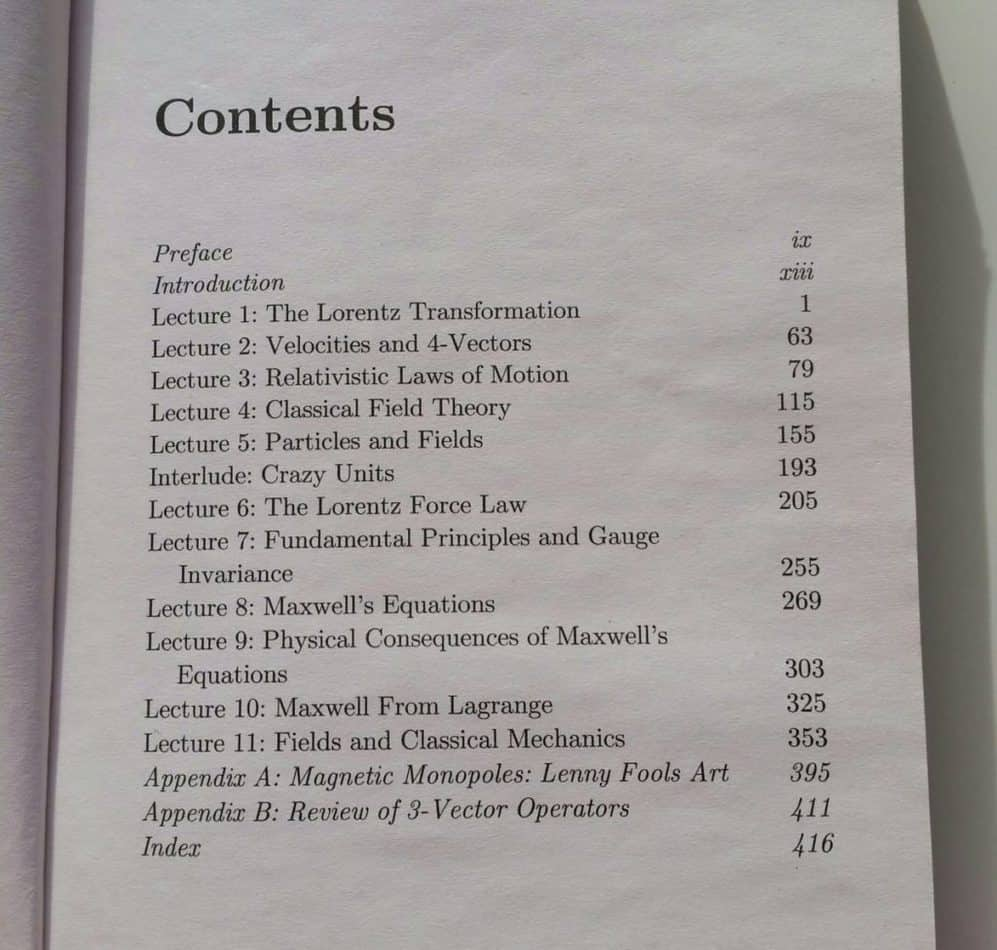
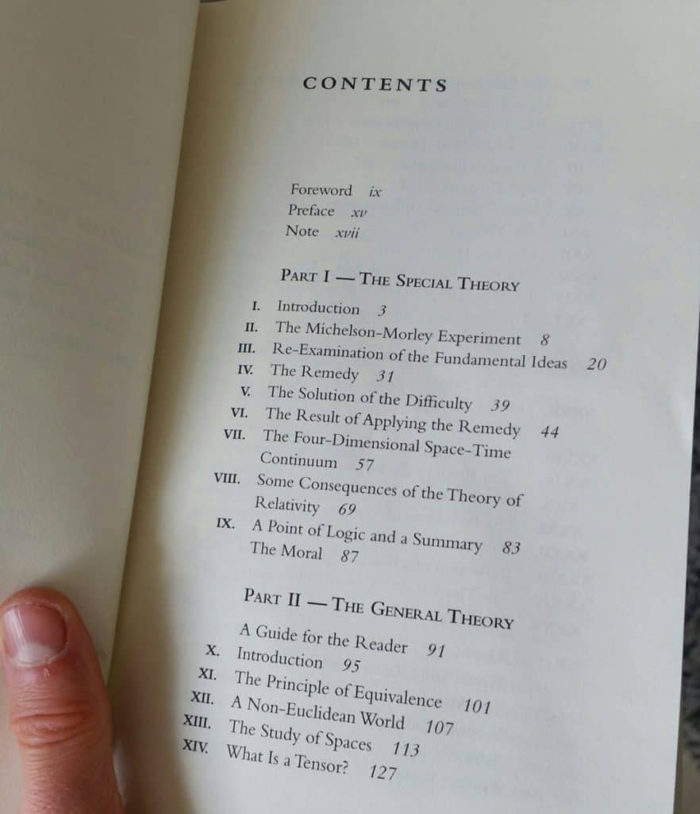
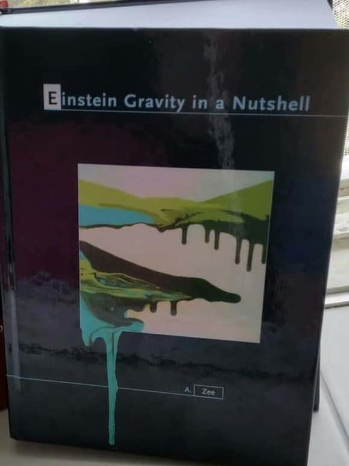

# How To Learn General Relativity: A Step-By-Step Guide

> A reading path through the math you actually need before you tackle curved spacetime.

*Originally published at [profoundphysics.com](https://profoundphysics.com/how-to-learn-general-relativity-a-step-by-step-guide/).*

---

I’ve noticed that there are a lot of people out there who are very interested in learning advanced physics, such as **special and general relativity**.

However, with the vast amount of information available, most people simply do not know where to start.

This article aims to fix that.

My goal is to give you a **complete step-by-step guide to learn both the special and general theories of relativity** without you having to do extensive research on which books to get and where to start.

Now, these steps and tips are aimed at people who perhaps **don’t have a technical background in physics or math** or who are **trying to learn relativity on their own** (without academic education).

So, if you’re just getting started on general and special relativity, the steps and tips given in this article should really benefit you (as long as you follow them, of course!).

Also, this guide will have a focus on learning **general relativity** specifically, because that’s the one people usually struggle with.

Of course, to learn general relativity, you should also know a bit about special relativity, so it will be covered too.

Table of Contents

Toggle

## What Are The Prerequisites For General Relativity?

First of all, it’s important to know what you’re in for when beginning to study general relativity (and special as well, but it’s much much easier).

In particular, the typical **prerequisites for general relativity** are:

- A basic understanding of special relativity
- Electromagnetism (optional, but helpful)
- Newtonian mechanics (optional, but helpful)
- A solid understanding of calculus and vectors
- Basics of linear algebra (optional, but helpful)
- Basics of tensors and differential geometry

Now, while you may be able to learn some of the basic concepts of general relativity without any prerequisites, to get a **deep understanding** and to actually be able to **apply the concepts**, you will most likely need all these given above.

**For special relativity, only calculus and vectors will do**, but things like electromagnetism and Newtonian mechanics will be very useful.

Down below, I’ve included all the steps you need to take to learn the above prerequisites and my recommended places and resources to learn them from.

## The 6 Steps To Learn Relativity On Your Own (& Best Resources)

Now, I’m definitely not a professional physicist, so I can’t teach you how to become one either.

What I can help you with are the **steps in learning the most important concepts of relativity on your own**, because that’s exactly what I’ve done myself.

The steps given below are either what I’ve done myself that have personally been beneficial to me or what I would do in case I was to **start learning relativity from scratch**.

Later in the article, I’ll also explain everything you need to know and **what to expect on your self-studying journey** as well as some of my best tips.

As a short summary, here are the steps and my #1 resource recommendations (down below, I cover each of the steps in more detail as well as give you some resource alternatives):

1. **Learn vector calculus and calculus-based physics**. My #1 resource recommendation for this would be my own [Advanced Math For Physics -course](https://courses.profoundphysics.com/p/advanced-math-for-physics-a-complete-self-study-course) (link to the course) that was created exactly for this purpose.
2. **Learn electromagnetism** (not absolutely necessary, but it’ll help). My resource recommendation would be [A Student’s Guide to Maxwell’s Equations by Dan Fleisch](https://amzn.to/2T4zAT1) (link to the book page).
3. **Learn the basics of special relativity**. My recommended resource for this is [The Theoretical Minimum: Special Relativity and Classical Field Theory by Leonard Susskind](https://amzn.to/3ovvnDm) (link to the book page).
4. **Study some tensor calculus and differential geometry**. For this, I’d recommend my own [Mathematics of General Relativity: A Complete Course](https://courses.profoundphysics.com/p/mathematics-of-general-relativity) (link to the course page). The course teaches you everything you need to know about tensor calculus and differential geometry.
5. **Build some intuition for general relativity**. I’d recommend reading [The Einstein Theory of Relativity by Lillian Lieber](https://amzn.to/3v5ySmv) (link to the book page).
6. **Study from a good general relativity textbook**. My #1 recommendation would be [Einstein Gravity in a Nutshell by A. Zee](https://amzn.to/3v4yAMR) (link to the book page).

### 1. Learn Vector Calculus and Calculus-Based Physics (For Beginners)

Both special and general relativity heavily rely on **vectors and vector calculus**.

So, to truly get a deep understanding of these, you should begin with actually learning these mathematical concepts.

Now, this is mostly going to be for **people who are just starting out**. If you have a high school or early university level knowledge of math and physics, you can probably skip this step.

However, it never hurts to brush up on these topics if you’ve forgotten some of them.

Anyway, why should you learn vectors and calculus? How are they actually used in relativity? Here are a few important applications:

- **In relativity, we model nature by something called spacetime** (which is basically a combination of space and time) and spacetime is mathematically represented by things called **four-vectors** (which are vectors, as the name may suggest).

- Also **physical quantities** (like momentum, velocity and forces) are modeled by four-vectors in special relativity. In general relativity, they may also be modeled by four-vectors, but also by **tensors** (which I’ll get to soon).

- As far as calculus goes, pretty much all of physics is modeled by **differential equations** (equations that involve calculus). This is also true for both special and general relativity.

- By studying **calculus-based physics and mechanics**, you’ll learn some very essential details and concepts on how physics is actually modeled mathematically.

Now, how much knowledge of these are you really going to need to understand relativity?

Essentially, **for special relativity, a fairly basic understanding is enough**.

This really means that if you had math and physics in high school and you actually remember the majority of these topics, you should be fine.

If you don’t know high school math or just don’t remember much about it, here are the resources I’d recommend:

- **[Advanced Math For Physics: A Complete Course](https://courses.profoundphysics.com/p/advanced-math-for-physics-a-complete-self-study-course)** (link to course page): this is **my #1 recommendation** to learn everything you need to know about **vector calculus** and specifically, the **applications of vector calculus to physics**.
- In fact, I created the online course originally for exactly this purpose; to give you the **perfect mathematical foundation for understanding tensors and general relativity**.
- The course will also give you a **workbook with tons of solved practice problems**, so that you’ll actually get to use the things you learn in practice.

To learn these essential vector calculus concepts, in my opinion, you’re not going to need much other than that.

### 2. Learn Electromagnetism (Optional)

This step is optional, but I felt like it should be included because it will very likely help you out a ton when studying relativity.

Here are a few reasons why:

- **Relativity, especially special relativity, is very closely related to electromagnetism**. In fact, Einstein actually first developed his theory of special relativity **based on some of the results of Maxwell’s electromagnetism**. For this reason, electromagnetism and electrodynamics work as a wonderful introduction to relativity.

- **Electricity and gravity surprisingly work very similarly**. For this reason, learning things like Maxwell’s equations and electromagnetic waves will be helpful for **general relativity** (which is a theory of gravity).

- Once you get to the more advanced topics, you’ll very often see **equations of electrodynamics formulated and used in a relativistic context**, both in special and general relativity. Because of this, learning the basics of electricity and magnetism is very useful.

- **Many of the mathematical tools you’ll learn from electrodynamics are used in relativity all the time**. Examples of this include vector and tensor calculus, symmetries, gauge theory and Lagrangians. So, learning these things in advance will make learning relativity much easier.

Now, if you wish to study electromagnetism before moving on to special relativity (again, it’s not required but helpful), then the best resources I’ve found are:

- **[A Student’s Guide to Maxwell’s Equations by Dan Fleisch](https://amzn.to/2T4zAT1)** (link to the book page): the Student’s Guide -book series is one of my favorites for beginners and those who wish to self-study. This one covers topics, such as **Maxwell’s equations and the wave equation**, which are helpful for special relativity. This book can easily be understood with basic vector calculus you learned in the previous steps.

- **[No-Nonsense Electrodynamics by Jakob Schwichtenberg](https://amzn.to/3wiYr3L)** (link to the book page): this book is great for two things; **it covers the basics like Maxwell’s equations and it also covers how special relativity and electromagnetism are linked**. I’d recommend reading this once you’re already somewhat familiar with special relativity, simply because the second half of the book may be a little difficult if you don’t have any previous knowledge of special relativity.

- As an additional bonus resource, my book **[Lagrangian Mechanics For The Non-Physicist](https://profoundphysicscourses.com/lagrangian-mechanics-book/)** (link to the book page) will be helpful for learning **classical mechanics** and **the Lagrangian formulation**, which is used quite often in special relativity and especially in general relativity.

### 3. Learn The Basics of Special Relativity

Some people may say that you don’t need to know special relativity before learning general relativity. I would personally disagree with this, however.

This is because special relativity will teach you the **many of the same concepts as general relativity**, but in a much easier way.

As an example, from special relativity, you’ll learn how to work with “relativistic versions” of the usual concepts like forces and momenta, but in a very similar manner to what you’re probably already used to from Newtonian mechanics.

If you were to begin with general relativity right away, alongside with you learning how to even use these new relativistic quantities you’d also have to know how to apply tools from general relativity, such as Christoffel symbols and covariant derivatives.

This would just make things way too confusing, at least for someone who is a beginner. It’s almost like learning to run without first learning to walk.

Anyway, my recommendation is that **you should study the basics of special relativity first, before learning general relativity**.

These basics really only include a few important concepts:

- **The postulates of special relativity** and *why* exactly they lead to the predictions of special relativity (time dilation, length contraction).

- **The concept of spacetime** (especially the idea of **Minkowski spacetime**).

- **Four-vectors** (basically, relativistic “spacetime vectors”), which are one of the key mathematical concepts of special (and general) relativity.

- **The dynamics of special relativity**, which includes things like *relativistic* energy, momentum, forces and how the motion of objects is modeled in special relativity.

Once you understand these concepts to and can apply them to some extent also, learning general relativity will come much easier. But where do you actually learn these concepts?

My **recommended resources for learning the basics of special relativity** are:

- **[The Theoretical Minimum: Special Relativity and Classical Field Theory by Leonard Susskind](https://amzn.to/3ovvnDm)** (link to the book page): the whole point of this book is to cover **the necessary basics** you *need* in order to move on to more advanced topics (hence the name Theoretical Minimum). It covers the **most important concepts of special relativity** and also how it relates to **electromagnetism** (which is where step #2 is useful).

- Alongside Susskind’s book, there are also free [video lectures](https://www.youtube.com/watch?v=toGH5BdgRZ4&list=PLD9DDFBDC338226CA) on Youtube that work as great supplements to the chapters covered in the book. The book is much more structured and comprehensive, but the lectures should provide some nice insights also (the lectures work best as summaries of the book chapters).

- Additionally, I’d also recommend going through my book **[Lagrangian Mechanics For The Non-Physicist](https://profoundphysicscourses.com/lagrangian-mechanics-book/)** (link to the book page), as it will teach you classical mechanics and Lagrangian dynamics, which will benefit you in both special and general relativity. This step is, however, optional.

In addition, you can also read my **[introductory article on special relativity](https://profoundphysics.com/special-relativity-for-dummies-an-intuitive-introduction/)** that covers some of the basics (though definitely not all the necessary concepts).

At this point, if you’ve gone through Susskind’s book on special relativity (which is quite a quick read despite it being around 400 pages long), you should have built **a decent understanding of special relativity**.

Table of contents in Susskind’s Theoretical Minimum -book on special relativity.

### 4. Move On To Tensor Calculus & Differential Geometry

Before actually moving on to general relativity, it will be helpful to get a little bit of an understanding of the math required for it.

Namely, this involves **tensors** and possibly some **differential geometry**.

In my opinion, you do not necessarily need to spend too much time on this step as the math will become more clear once you start to apply it to general relativity.

However, if you jump right away to general relativity before actually learning anything about tensors, it’s likely you’ll get confused very quickly.

Now, why are tensors and differential geometry important for general relativity? Here are a few reasons why:

- **Tensors are the building blocks of the math used in general relativity**. This is because tensors are “coordinate-independent” mathematical objects, which means that pretty much all fundamental laws of physics should be built out of them.

- **In general relativity, tensors often represent physical quantities**. An example of this is the energy-momentum tensor, which represents things like energy and momentum fluxes, pressure as well as stresses. These act as sources of a gravitational field.

- **In general relativity, gravity is described by spacetime curvature**. Curvature, on the other hand, is described by tensors, so **gravity is actually described by tensors**. An example is the Riemann tensor, which completely describes curvature and physically, it represents the effects of tidal forces.

- **The area of math that general relativity uses is called differential geometry**. Differential geometry uses calculus to describe geometric concepts such as curvature, which on the other hand, requires knowledge about tensors.

My **#1 recommendation for learning about tensors** is the following:

- **[Mathematics of General Relativity: A Complete Course](https://courses.profoundphysics.com/p/mathematics-of-general-relativity)** (link to the course page): **this is the only resource you’ll need to get a good understanding of tensors and all the necessary math for general relativity**. It teaches you all the prerequisites, the fundamentals and much more about tensors and how they are used in general relativity. There are also lots of **practice problems with solutions**.

Once you’ve gone through the course fully (and hopefully done the practice problems), you should have built up a sufficient understanding of vectors and tensors to really be able to dive deep into general relativity.

### 5. Build Some Intuition For General Relativity

At this point, if you’ve never heard of most of the concepts of general relativity (the metric, Christoffel symbols, geodesics etc.), then this step will be extremely helpful (and very fun also!).

What I’d recommend you do is **start with some intuitively more simple resources on general relativity**.

If you start with something like a proper general relativity textbook, you may get a little lost in the more technical stuff if you’ve never built the intuition for these concepts.

**If you can learn the intuitive concepts first and what they fundamentally mean**, you’ll be in a fantastic place to then learn all the technical details and advanced concepts.

Now, by intuitive I do not mean basic fluff like pop-science books.

What I mean are resources that focus on the physics first and foremost, but may still use some math (this is why step #4 is important).

The best resources I’ve found for developing some intuitive understanding of general relativity are:

- **[ScienceClic’s general relativity -playlist](https://www.youtube.com/watch?v=xodtfM1r9FA&list=PLu7cY2CPiRjVY-VaUZ69bXHZr5QslKbzo)** (link to Youtube): these are a series of 8 videos, which cover the basics of general relativity through some very nice visual animations. While you can probably go through all of the videos in one sitting, they will still provide some amazing insights into what all the math of general relativity actually means.

- **[The Einstein Theory of Relativity by Lillian Lieber](https://amzn.to/3v5ySmv)** (link to the book page): while this book is quite old (some of the notation may be a bit outdated), it is in my opinion, an absolutely wonderful hidden gem. It covers the math and physics of both general and special relativity in a very intuitive way. This book also has possibly the best explanations I’ve seen of the experimental evidence behind general relativity.

- **[Leonard Susskind’s general relativity -lectures](https://www.youtube.com/watch?v=JRZgW1YjCKk&list=PLpGHT1n4-mAvcXwzOIz3dHnGZaQP1LEib&index=10)** (link to Youtube): if Susskind’s teaching style resonated with you from the previous steps, I’d highly recommend these free lectures on Youtube. They are very intuitively simple to understand, but still use a fair bit of math.

Alternatively, you can also read **[my introduction to general relativity](https://profoundphysics.com/general-relativity-for-dummies/)**, which aims to cover the underlying ideas of general relativity in an intuitive way. The focus of this article is mainly on the physics, however, and not the math.

If you took the time to go through all the above resources, **you’ve likely built up the necessary intuition and the basics for general relativity** to really begin taking your knowledge to the next level.

Some of the topics included in Lillian Lieber’s book. Note that there is a lot more things as the table of contents continues to the next page.

Also, if you really want to test your understanding of tensor calculus and the basics of general relativity, check out [this article](https://profoundphysics.com/derivation-of-einstein-field-equations/) on the **derivation of Einstein’s field equations**.

If you’re able to understand the calculations and the reasoning behind each thing in that article, then you’re certainly ready to develop a really good understanding of general relativity (or you have already!).

### 6. Find a Good Textbook On General Relativity

At this point, if you’ve gone through all of the above steps, you can probably say that you have a decent understanding of general relativity. Now is the time to really take your knowledge to the next level!

For this step, I’d recommend the following:

- **Find one actual textbook to study through** (down below, I’ve got my recommendation). A good textbook will be much more comprehensive than the resources given in the last step.

- Once you’ve gone through the resources in the last step, you’ll be in a great place to understand many of the **applications of general relativity** also since you may have the basics down already. A comprehensive textbook will allow you to do this.

The **best textbook for self-studying general relativity** that I’d recommend is:

- **[Einstein Gravity in a Nutshell by A. Zee](https://amzn.to/3v4yAMR)** (link to the book page): **this book is my #1 recommendation** since it’s very thorough and it also doesn’t require as much mathematical rigor as many other textbooks do. Despite what the title might say, this book is NOT SHORT at all (it’s a whopping 800+ pages). It’s **extremely comprehensive** and it covers **almost everything you’d ever want to know about general relativity**.

Now, why exactly do I recommend this book in particular?

In my opinion, **Zee’s book is the best textbook for self-studying**, because it is more focused on the physics and therefore, probably better for people who just want to understand general relativity on a deep level without all of the, quite frankly, unnecessary mathematical jargon that most other textbooks have.

The language used in Zee’s book is also much more **relaxed** and it even contains a bit of **humor**, which I did enjoy while reading through it.

Zee also talks about how you should use this book for self-study in the preface and he gives some tips as to which chapters are important and which ones not so much.

 

My copy of Einstein Gravity in a Nutshell by A. Zee.

## What To Expect When Learning General Relativity On Your Own

Now that we’ve gone through the necessary steps to learning general relativity, there may still be some questions you’re wondering, such as *“how difficult will learning general relativity be?”* or *“how long will it take to learn these things?”*.

This is what I’ll answer next. Keep in mind that these are based on **my experience after actually self-studying general relativity myself**.

I cannot speak for everyone and I’m sure that other people will have different experiences, so these will only be rough outlines or **what you should at least be expecting**.

Your own experience may vary based on **the effort you put in** as well as **your previous knowledge and intelligence** (don’t get me wrong, intelligence is really not a huge part of this as I do believe that almost everyone can learn general relativity).

### Is General Relativity Hard To Understand?

The most common question pretty much everyone wanting to learn general relativity will have at some point is; is it actually hard? If so, how hard?

**General relativity is not necessarily hard to understand as the basics are quite simple. However, applying and using the equations of general relativity is hard. This is because the mathematics used in general relativity, such as tensor calculus, are usually very hard to understand for most people.**

Let me elaborate on this. **The basic physical concepts of general relativity are actually quite straightforward**. I could actually summarize them as follows:

- According to the equivalence principle, gravity and acceleration are equal to one another. The exception to this is tidal forces.

- Tides completely determine whether there is a gravitational field present or whether an object is simply accelerating without gravity.

- Tides therefore describe gravity completely. Mathematically, the effects of tides are described by the Riemann tensor.

- The Riemann tensor also has a geometric meaning of representing curvature. This is where the notion of “spacetime curvature=gravity” comes from.

- How a spacetime is curved, depends on the matter and energy in that spacetime. This is what the Einstein field equations describe.

- In curved spacetime (under the influence of gravity), everything moves along geodesics.

- Geodesics are paths along which an observer itself does not experience any acceleration (i.e. someone in gravitational “free-fall” cannot *feel* gravity pulling them down, but an outside observer does see them accelerating; this makes gravity much different to other forces).

That’s basically **general relativity in a few sentences** (these are all explained in much more detail in my [introduction to general relativity](https://profoundphysics.com/general-relativity-for-dummies/)).

Now, what’s so difficult about this really? The mathematics used to describe these concepts are.

In my opinion, **the most difficult thing about the math of general relativity is the tensor notation**.

While **tensors** are not necessarily difficult to understand and use, they certainly are very confusing when you first encounter them.

For example, take something like the Ricci tensor, a commonly used tensor in general relativity. It is denoted by Rµν.

In reality, this simple one-letter expression of this tensor means the following:

$$R_{\mu\nu}=g^{\sigma\lambda}g_{\rho\sigma}R_{\mu\lambda\nu}^{\rho}$$

Even this may look surprisingly simple, but it is not actually.

These certain indices implicitly mean we should sum over them (this is called Einstein’s summation convention, which is a common notational difficulty people encounter with tensor math):

$$R_{\mu\nu}=\sum_{\lambda=0}^3\sum_{\sigma=0}^3\sum_{\rho=0}^3g^{\sigma\lambda}g_{\rho\sigma}R_{\mu\lambda\nu}^{\rho}$$

Moreover, this R-thing with four indices is really a shorthand for a bunch more terms that, if fully written out, would probably take up a page of a book or something.

The point here is that **while the physical concepts of general relativity are not really that hard to understand, the mathematics are**.

It’s also no coincidence that it took Einstein years to develop the mathematics of general relativity.

And the hard thing about the mathematics, for most people at least, is going to be **the notation and all of the rules for using tensors** (which will certainly get a lot easier once you actually begin doing calculations with them and getting used to the notation).

Luckily, if you’re beginning to learn general relativity, **you certainly do not need to spend years building an academic background in math**.

**A good learning resource will get you there a lot faster**, which is what I’ve aimed to help you find through this article and the steps described earlier.

### How Long Does It Take To Learn General Relativity?

When you begin to learn a topic like general relativity that is mathematically quite demanding, you have to set an expectation that it will take somewhat of a long time to learn it all. But how long exactly?

**The basic physical concepts of general relativity can be learned in as little as 30 minutes. However, for most people, building a solid understanding and learning the mathematics required for general relativity will take somewhere between 3-12 months depending on their previous knowledge.**

The logic behind this is based on the steps I gave earlier. The rough time frame I estimated in the following way:

- **If you already know basic high school math and are confident in your ability to use it, you’re either going to start from learning special relativity, electromagnetism or classical mechanics** if you’re not familiar with it before.

- As a rough estimate, let’s say you read one book on classical mechanics and one book on electromagnetism before learning special relativity. This may take around 10 hours per book, which adds up to **20 hours**.

- Learning the necessary basics of special relativity will take probably **at least 30 hours** (assuming you read Susskind’s SR-book, watch his lecture series on Youtube and maybe do a few practice problems or Google some questions that may come up).

- For learning the basics of tensor calculus, assuming you follow the steps I gave earlier, this should take around **30-40 hours**.

- For the basics of general relativity, this may take **somewhere between 20-40 hours** depending on what resources you use (if you go through all the ones I recommended earlier, it should take about 30 hours).

- When you’re ready to get a proper textbook on general relativity, expect studying through the textbook to take **at least 40 hours, likely much longer** (assuming you take your time to learn all the concepts and also go through at least some of the practice problems).

- Adding up all these numbers, **the minimum time you should expect for learning general relativity is around 150 hours** (a little over 4 months at a pace of 1 hour per day).

- If you’re really starting from scratch and learning all the basic math needed (either from the resources suggested earlier or elsewhere) and doing practice problems as well, expect to add **another 40-100 hours** to these numbers (possibly a lot more, depending on your starting point).

The time it will take for you personally to learn general relativity may vary greatly from this minimum of 150 hour -estimate.

I assume it took me about this long, but **it may be faster for you if you already know a decent bit about physics**.

**It may also be much much longer if you need to learn all the necessary math and physics first** before moving on to special or general relativity.

However, this should not discourage you because really, everything you learn along the way is a positive even if it’s not general relativity right away.

Also, keep in mind that anything worth learning will take time and effort and the end reward will definitely be worth (I would know because I’ve done it) – general relativity really is an incredibly beautiful and rich theory once you understand it.

As a bottom line, **you should expect that building a solid understanding of general relativity will be in a timescale of months**.

Learning general relativity will, by no means, require being a student at university or college and you absolutely CAN learn the topic on your own.

You should, however, keep in mind that there is a reason why general relativity is usually taught at either a late undergraduate or even a graduate level at most universities and it is because **general relativity is certainly a demanding subject and it will take time and effort to learn it.**

---

*← [Back to the full archive](../index.html)*
