# Lagrangian Mechanics For Dummies: An Intuitive Introduction

> The reformulation of mechanics that doesn't need forces — only energies and constraints. The Lagrangian ℒ = T − V is the whole game.

*Originally published at [profoundphysics.com](https://profoundphysics.com/lagrangian-mechanics-for-beginners/).*

---

Often the most common approach to describing motion and dynamics is through **Newton’s laws**, however, there is a much more fundamental approach called **Lagrangian mechanics**. But what is Lagrangian mechanics, exactly?

**As a general introduction, Lagrangian mechanics is a formulation of classical mechanics that is based on the principle of stationary action and in which energies are used to describe motion. The equations of motion are then obtained by the Euler-Lagrange equation, which is the condition for the action being stationary.**

Lagrangian mechanics is practically based on **two** fundamental concepts, both of which extend to pretty much all areas of physics in some way.

The first one is called **the Lagrangian**, which is a sort of function that describes the **state of motion for a particle through kinetic and potential energy**.

The other important quantity is called **action**, which is used to define a path through space and time.

The important thing about the action is that it is required to be **stationary** in order to get the right equations of motion.

This is known as **the principle of stationary action**, which is one of the most fundamental principles throughout all of physics.

These will both be explained in great detail in this article.

**Quick tip**: In case you’d be interested in understanding Lagrangian mechanics and specifically its applications to modern physics, I highly recommend checking out the book **[Lagrangian Mechanics For The Non-Physicist](https://profoundphysicscourses.com/lagrangian-mechanics-book/)** (link to the book page). The book will take you from learning the **fundamentals** all the way to having an **advanced, deep understanding of Lagrangian mechanics** – and most importantly, being able to **apply what you learn** in areas like mechanics, electrodynamics, relativity and quantum field theory.

## The Intuition Behind Lagrangian Mechanics

To get started, let’s try to develop some intuition and reasoning behind what we’re going to be looking at in detail in this article.

For this, we’re going to rethink our notions of what motion really is in the most fundamental sense. Typically, we think of motion as being a result of different forces, which is practically what Newton’s laws are.

There is, however, nothing special about forces. Granted, they are intuitive and simple to understand, but after all, they are just one possible mathematical model to describe motion and dynamics.

Fundamentally though, ***motion is a description about changes***. Think about it. If a net force is acting on you, your position will change and this is how we measure velocity and acceleration.

Ultimately, dynamics and motion are **optimization processes**. When a ball rolls down a hill, its height (position) will decrease in some way, but its velocity, on the other hand, will increase as it rolls.

If you really begin to think about it, there are only **two quantities** that we need in order to fully describe the motion of any object; **its position and velocity at any given point**.

Once we know where an object is and which direction and how much velocity it has, we can fully predict where it will be at the next instant.

Now, the next question is, how can these two quantities be combined into a useful theory? The answer is actually simple; energy.

In fact, **the kinetic and potential energy of an object is all you need to know to fully predict where it will move next** (not taking into account friction, for now).

Take for example the trajectory of a projectile (such as a ball thrown in the air):

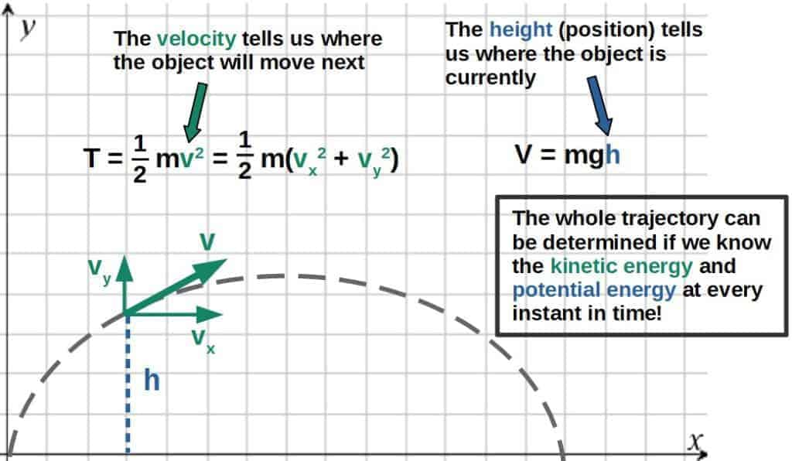

This is, in fact, the basis for Lagrangian mechanics. It is fundamentally a description of changes in energy. This is done through a quantity called the **action**.

> Lagrangian mechanics is fundamentally an optimization process of the kinetic and potential energies of objects and systems; this is how we predict their motion.

Now, the action is basically a quantity that describes a specific trajectory an object would take. So, **each trajectory through space and time has a different action associated with it**.

Since we established that motion could be described by energies, I’m going to invent a function L, which is a function of the kinetic and potential energies (we’ll specify later what this function is, but it is called the **Lagrangian**):

$$L=L\left(T{,}V\right)$$

T is commonly used to denote kinetic energy, while V is potential energy (sometimes it’s also denoted by U).

How could the action of a trajectory be defined in a useful way then? One option would be to sum over each of these “energy functions” (Lagrangians) over the entire trajectory.

This would also make intuitive sense. **If we know the kinetic and potential energy** (i.e. the value of this Lagrangian function) **at each point, we can determine the entire trajectory by simply adding all of them up**.

Now, in classical mechanics, energy is a continuous variable, which means that the action wouldn’t be a discrete sum, but rather an **integral over time** (the time it takes from the starting point to the end point of the trajectory).

The **action** is defined as an integral over time of the Lagrangian at each point of the trajectory:  
  
$$A=\int_{t_1}^{t_2}L\left(T{,}V\right)dt$$

Based on a lot of evidence, we’ve seen that physical objects and even fields, will always behave and move in such a way that **the action is minimized** (or more accurately, *stationary*).

In the context of Lagrangian mechanics, this means that the trajectory of an object will always be the one in which the action is stationary. This is called **the principle of stationary action**.

The most fascinating thing is that this principle is one of the most fundamental in all of physics, which all observed systems obey (even outside of classical mechanics too!).

Later in this article, I’ll explain more of the intuition behind the principle of stationary action as well as define it in a more mathematical way.

The useful thing in the context of classical mechanics is that **the principle of stationary action will uniquely define the trajectory a system will take**.

Ultimately, the problem will then boil down to simply finding the Lagrangian of the system, which gives an extremely useful method for problem solving in classical mechanics (I talk about this more in my article [Is Lagrangian Mechanics Useful?](https://profoundphysics.com/is-lagrangian-mechanics-useful-9-key-reasons-why-it-absolutely-is/)).

Now, one more thing; what actually is the Lagrangian? We haven’t defined it so far and the reason for this is that **the Lagrangian doesn’t have a general form**.

In classical mechanics, however, it has a well-defined form, but in other fields of physics, it may be different.

For now, I’m just going to tell you what the classical Lagrangian is (we’ll explore why this makes sense really soon).

The **Lagrangian** for classical mechanics is defined as the difference of the kinetic and potential energy of the object or system:  
  
$$L=T-V$$

Now, you may want to ask something like; why is this the Lagrangian? Why is it the difference of energies (T-V) and not the total energy (T+V), for example?

The answer is that, actually, both of them would work, but T+V is used in a formulation called **Hamiltonian mechanics** (you can read my introductory article [here](https://profoundphysics.com/hamiltonian-mechanics-for-dummies/) and a comparison of Lagrangian and Hamiltonian mechanics [here](https://profoundphysics.com/lagrangian-vs-hamiltonian-mechanics/)).

The answer above may still not explain why exactly T-V works. This we will explore next.

## What Is The Lagrangian And Why Is It T-V?

Earlier I explained some of the intuitive logic behind what Lagrangian mechanics is really based on. In this section, I want to look a bit closer specifically at what the Lagrangian (L=T-V) is.

In physics, there is always a certain optimization process in determining how physical objects and systems move.

In Lagrangian mechanics, this whole process is ultimately encoded in the **principle of stationary action** and it is expressed by the **Lagrangian L=T-V**.

But, you might ask, why is the Lagrangian T – V, exactly? Why is it not the sum of the kinetic and potential energy, for example?

First of all, **the Lagrangian is NOT the total energy of an object**, it is something entirely different.

The Lagrangian has very little to do with the total energy, it can rather be thought of as a ****state of motion** at any particular point in time, which is described by the kinetic and potential energies** (since they include information about both the velocity and position).

Now, there are basically two reasonable ways that you could describe the motion with these two quantities; you could try to describe the “state of motion” at each point by the total energy (T+V), or by the difference of the energies (T-V).

Potential energy, however, isn’t really something that describes motion by itself. It can be converted into other forms of energy (namely kinetic energy), but **potential energy itself does not describe motion, only the changes in potential energy do**.

This is why it makes sense to describe motion by **the difference of kinetic and potential energy, rather than the sum of the two**; it allows for a sensible trade-off between the kinetic and potential energies (i.e. they can convert into one another) because of the sign difference between them:

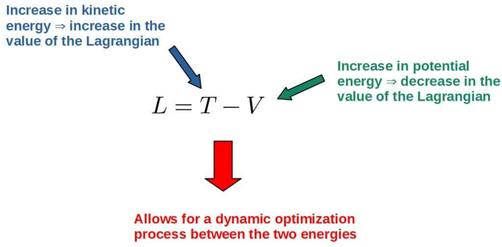

This kind of dynamic process happens even in **Newtonian mechanics**, in the good old **F=ma**. The similarities between this and Lagrangian mechanics can easily be seen if we express Newton’s second law in the form:

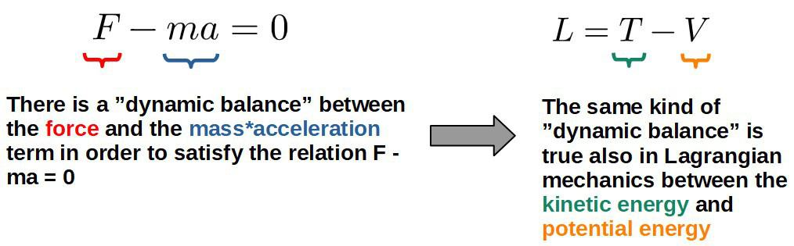

There is also another way to think about this and it is through the notion of **energy conservation**.

Since the total energy (T+V) is a conserved quantity, **it doesn’t change with time**. Thus, it isn’t particularly useful in describing motion (although it can be made work in a different way, such as is done in Hamiltonian mechanics).

**The difference in energies (T-V), on the other hand, is not a conserved quantity (meaning its values can change with time), so it makes for a much more useful tool for describing motion**.

An interesting way to visualize this is by plotting the values for T+V and T-V for a pendulum (T+V being the total energy, which is called the Hamiltonian, but that’s not important for now):

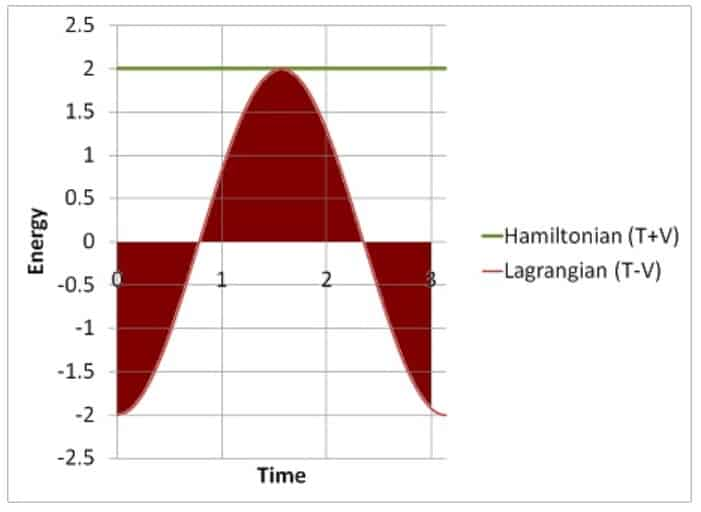

I’m going to give credit where credit is due; I found this graph on a Physics Stack Exchange post [here](https://physics.stackexchange.com/questions/9686/the-meaning-of-action).

This gives a beautiful way of visualizing how the Lagrangian actually encodes a lot of information about the motion of a system (in this case, for a pendulum), which makes it a lot more useful than the total energy for modeling the dynamics of physical systems.

Another reason for why the Lagrangian is the difference of kinetic and potential energy is simply because it gives the desirable results.

In more advanced theories of physics, Lagrangians are simply treated as **functions that generate equations of motion**. So, a Lagrangian is judged by the usefulness of what results it gives and there is nothing more to it.

In classical mechanics, **this particular Lagrangian, L = T – V, is precisely the Lagrangian that generates Newton’s second law, F = ma**.

Ultimately, this comes from how forces are defined in terms of potential energies (the minus sign in L=T-V is what generates the minus sign here, which we’ll see later in the article):

$$F=-\frac{dV}{dx}$$

To be fair, this Lagrangian of T-V is only really applicable to classical mechanics. For example, in special relativity the Lagrangian takes a different form, which you can read more about [here](https://profoundphysics.com/special-relativity-for-dummies-an-intuitive-introduction/#The_Principle_of_Least_Action_in_Special_Relativity).

## What Is The Principle of Stationary Action, Intuitively?

Earlier, I covered what the **action** is (a quantity that describes a particular path through space and time). Now I’d like to explore what the **principle of stationary action** actually means.

Later we’ll see how it it leads to the **Euler-Lagrange equations**, which are basically the equivalent to Newton’s second law, F=ma.

First of all, the action is defined as this **integral over time**, which can intuitively be obtained by “dividing” the trajectory into small pieces of the form Ldt (the value of the Lagrangian L over a tiny period of time dt; these Ldt-pieces essentially represent the action over a small interval dt of the trajectory).

The action of the full trajectory is then the sum of all these little pieces of Ldt, or more accurately, the integral of Ldt as follows (since time is a continuous variable, we have to use integration here):

$$A=\int_{t_1}^{t_2}L\ dt$$

Sometimes you’ll see the action denoted by the letter S.

> **The real physical trajectory an object or a system will always take is the one in which the action happens to be stationary; this is known as the principle of stationary action**.

Now, this might be a lot to digest at once, so let’s explore it a bit. Firstly, what does it even mean for something to be stationary?

The answer to this is actually very simple and you might even know it from basic high school math. **A stationary point for a function is simply a point at which the tangent line is horizontal (i.e. the derivative at this point is zero)**:

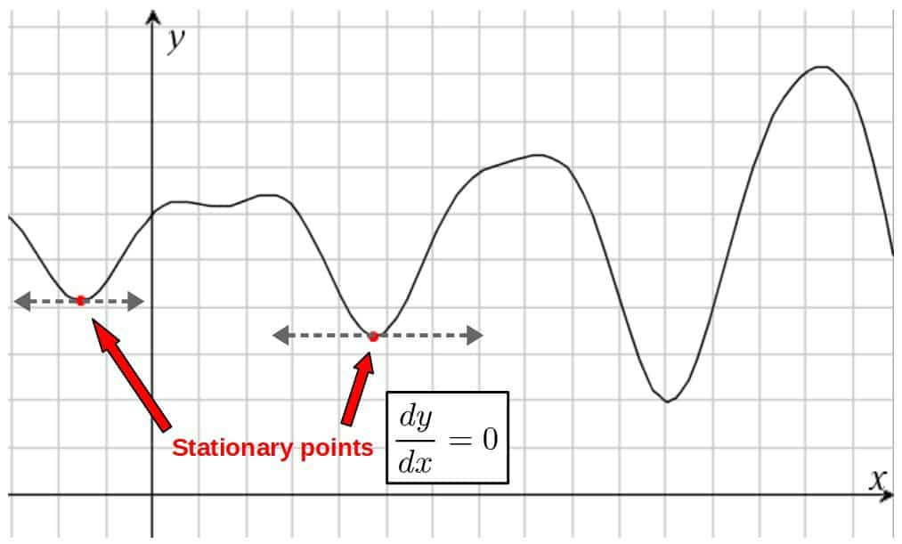

Now, the same idea of stationary points applies to the action as well, but with a little more math involved.

This is because the action is actually a **functional**, not just a function. If you want to know more about functionals and more generally, calculus of variations – which is the area of math Lagrangian mechanics is based on – you can check out [this article](https://profoundphysics.com/calculus-of-variations-for-beginners/).

The basic idea is that **a stationary point in the action is defined as the functional differential equal to zero** (denoted as δA=0). This basically just means that a slight variation (differential) in the action should be zero.

The **principle of stationary action** mathematically:  
  
$$\delta\int_{t_1}^{t_2}L\ dt=0$$

The path a system takes is then the path in which the action satisfies this equation.

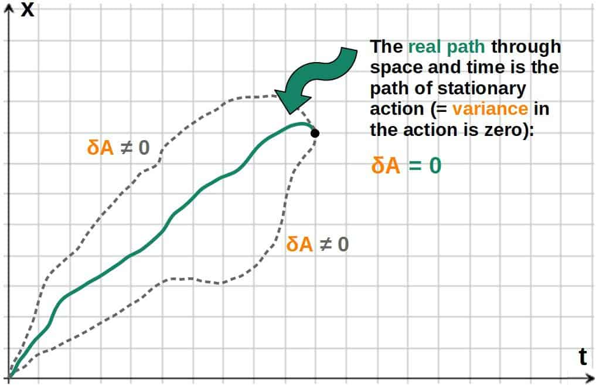

A functional differential essentially means varying the value of the action a little (infinitesimal) bit. The stationary points are then those at which a slight variance doesn’t actually affect the value of the action.

That is essentially the principle of stationary action explained as simply as possible.

Now, you may be thinking that this is interesting and all, but **why exactly should physical systems obey this principle**? Why should an object take the path of stationary action instead of some other path?

**Fundamentally, nobody actually knows the *real* answer to this**. It’s quite funny how the stationary action principle underlies pretty much all of modern physics, but nobody knows why it happens to be true.

The best I can give you here is some kind of motivation as to why it might make sense that the universe should follow such a principle.

To me, at least, it makes sense as to why the universe would want to (not that the universe would literally “want” anything, but I think you get the point) optimize stuff in such a way that something would be stationary.

You could think of it as **physical systems tending to evolve towards a state of equilibrium**, just like in thermodynamics systems always evolve in a way in which it reaches a state of thermal equilibrium.

The same kind of process could be thought of as applying to motion as well, but just as a much higher-level concept.

The particular trajectory that makes the action stationary could be thought of as sort of the **equilibrium state of the action**, because the action does not vary (i.e. it is at a stationary point or an equilibrium state).

Now, if this seems too abstract, the point here really is that **everything we can observe in the universe obeys the principle of stationary action**, so the most reasonable thing is to just take it as postulate and work with it.

Actually, the current understanding of the principle of stationary action is that it comes from a **classical approximation of quantum mechanics**. In quantum mechanics, we can think of particles taking *all possible paths, with all possible values of the action* (formally, this is captured in the so-called Feynman’s path integral formulation). The **most likely path** is then the one with a stationary value of the action – the classical path. This is something I discuss more in my full book **[Lagrangian Mechanics For The Non-Physicist](https://profoundphysicscourses.com/lagrangian-mechanics-book/)** (link to the book page).

## Intuition Behind The Euler-Lagrange Equation (+ Step-By-Step Derivation)

Now that we’ve established what the principle of stationary action is, the next thing is to figure out a practical way to actually use it.

To do this, let’s think about what the principle of stationary action means mathematically again:

$$\delta A=\delta\int_{t_1}^{t_2}L\ dt=0$$

This is really just an equation that should be solved and it is not too hard to do if you know a little bit of calculus (you’ll find the derivation down below).

Now, what you’ll get is that **in order for the action to be stationary, the Lagrangian should satisfy something known as the Euler-Lagrange equation**.

**Euler-Lagrange equation:**  
  
$$\frac{d}{dt}\frac{\partial L}{\partial \dot x}=\frac{\partial L}{\partial x}$$

The above equation is arguably *the most important equation you’ll need in Lagrangian mechanics*; it is essentially the Lagrangian version of **Newton’s second law**, as we’ll see later.

Derivation of the Euler-Lagrange Equation (click to see more)

This derivation is based on the concepts of variational calculus, which I have an entire article covering [here](https://profoundphysics.com/calculus-of-variations-for-beginners/).

Anyway, we need to first of all think about what the Lagrangian and the action are actually functions of.

Since the Lagrangian is T-V and the kinetic energy T is a function of velocity and potential energy V is a function of position, **the Lagrangian is then a function of velocity and position**:

$$L=L\left(x{,}\ \dot{x}\right)\ \ \ \ \ \ {,}\ \dot{x}=\frac{dx}{dt}$$

I’m going to sometimes denote the time derivative of something by putting a dot above it. This is a standard convention.

Let’s now look at what we get from the principle of stationary action, i.e. the **functional differential of the action** (which should be equal to zero). We can also move the δ-symbol inside the integral:

$$\int_{t_1}^{t_2}\delta L\left(x{,}\ \dot{x}\right)dt=0$$

Now, the rule for a **functional differential** is (basically taking the derivative of the function with respect to each of its variables and multiplying with the change in that variable):

$$\delta f\left(x{,}y\right)=\frac{\partial f\left(x{,}y\right)}{\partial x}\delta x+\frac{\partial f\left(x{,}y\right)}{\partial y}\delta y$$

This is basically the standard chain rule for derivatives, but this is the **total change** (differential) in a functional, not just with respect to a single variable.

Now just replace f(x,y) with the Lagrangian and we have the action as:

$$\int_{t_1}^{t_2}\delta L\left(x{,}\ \dot{x}\right)dt=\int_{t_1}^{t_2}\left(\frac{\partial L}{\partial x}\delta x+\frac{\partial L}{\partial\dot{x}}\delta\dot{x}\right)dt$$

Here, $\dot{x}=\frac{dx}{dt}$, so the second term can be written as:

$$\int_{t_1}^{t_2}\left(\frac{\partial L}{\partial x}\delta x+\frac{\partial L}{\partial\dot{x}}\delta\dot{x}\right)dt=\int_{t_1}^{t_2}\left(\frac{\partial L}{\partial x}\delta x+\frac{\partial L}{\partial\dot{x}}\frac{d}{dt}\delta x\right)dt$$

Let’s look at this second term closer. We know from the rule for a derivative of the **product of two functions** that:

$$\frac{d}{dt}\left(f\left(t\right)g\left(t\right)\right)=g\frac{df}{dt}+f\frac{dg}{dt}\ \ \ \Rightarrow\ \ \ \ f\frac{dg}{dt}=\frac{d}{dt}\left(fg\right)-g\frac{df}{dt}$$

From this formula, we can just replace f and g with:

$$f=\frac{\partial L}{\partial\dot{x}}\ \ {,}\ \ g=\delta x\ \ \ \ \Rightarrow\ \ \ \ \frac{\partial L}{\partial\dot{x}}\frac{d}{dt}\delta x=\frac{d}{dt}\left(\frac{\partial L}{\partial\dot{x}}\delta x\right)-\delta x\frac{d}{dt}\frac{\partial L}{\partial\dot{x}}$$

So, the action integral then becomes:

$$\int_{t_1}^{t_2}\left(\frac{\partial L}{\partial x}\delta x+\frac{d}{dt}\left(\frac{\partial L}{\partial\dot{x}}\delta x\right)-\delta x\frac{d}{dt}\frac{\partial L}{\partial\dot{x}}\right)dt$$

Now we can split the integral into two parts (since it’s just a sum):

$$\int_{t_1}^{t_2}\frac{d}{dt}\left(\frac{\partial L}{\partial\dot{x}}\delta x\right)dt+\int_{t_1}^{t_2}\left(\frac{\partial L}{\partial x}\delta x-\delta x\frac{d}{dt}\frac{\partial L}{\partial\dot{x}}\right)dt$$

In the first term, we’re taking the integral of a derivative so the dt’s basically “cancel” and it just becomes a substitution. We can also bring the δx outside the parentheses in the second term:

$$=\bigg/_{t_1}^{t_2}\left(\frac{\partial L}{\partial\dot{x}}\delta x\right)+\int{t_1}^{t_2}\delta x\left(\frac{\partial L}{\partial x}-\frac{d}{dt}\frac{\partial L}{\partial\dot{x}}\right)dt$$

Now, here comes a key little detail; **the start and end points of the path should be kept the same when we vary the path** (otherwise we basically couldn’t compare different paths and see which one has a stationary action).

What this means is that **the variance in the start and end points should equal zero** (i.e. the position x(t) at the start and end time t1 and t2):

$$\delta x\left(t_1\right)=0\ \ {,}\ \ \delta x\left(t_2\right)=0$$

If we now look at the first term in our formula, the first term will go to zero (since it has the terms δx(t1) and δx(t2) after we make the substitution):

$$\bigg/_{t_1}^{t_2}\left(\frac{\partial L}{\partial\dot{x}}\delta x\right)=0$$

We are then left with (the whole thing should also equal zero):

$$\int_{t_1}^{t_2}\delta x\left(\frac{\partial L}{\partial x}-\frac{d}{dt}\frac{\partial L}{\partial\dot{x}}\right)dt=0$$

Now, this integral can only be zero if whatever is inside the integral is also zero:

$$\frac{\partial L}{\partial x}-\frac{d}{dt}\frac{\partial L}{\partial\dot{x}}=0$$

$$\frac{d}{dt}\frac{\partial L}{\partial\dot{x}}=\frac{\partial L}{\partial x}$$

This, of course, is just the **Euler-Lagrange equation**.

Now, what is the Euler-Lagrange equation actually?

**In short, the Euler-Lagrange equation is a condition that the Lagrangian has to satisfy in order for the principle of stationary action to be true. It is essentially what generates the equations of motion of a system given a specific Lagrangian, just as Newton’s second law does for a given force**.

One important detail is that the Euler-Lagrange equation can actually be derived by only knowing that the **Lagrangian depends on position and velocity**, nothing more.

In other words, we do not need to know the specific form of the Lagrangian (T-V). **Any Lagrangian that is a function of position and velocity, has to satisfy the Euler-Lagrange equation** simply as a result of the stationary action principle.

So, the EL equation is actually very general, not just a result of some arbitrarily chosen Lagrangian (it is actually a very general equation used to calculate minima and maxima of functions in a field of math called **calculus of variations**).

The Lagrangian comes in if we wish to express motion in terms of kinetic and potential energy. This is where the T-V is necessary to describe motion as a dynamic process.

If we plug the Lagrangian (L=T-V) into the Euler-Lagrange equation, we get:

$$\frac{d}{dt}\frac{\partial\left(T-V\right)}{\partial \dot x}=\frac{\partial\left(T-V\right)}{\partial x}$$

Since the kinetic energy doesn’t depend on position and potential energy doesn’t depend on velocity ($\dot{x}$), we’re left with:

The minus sign here comes from the minus sign in the Lagrangian, L=T-V.

This is indeed exactly what I meant earlier with the concept of a **dynamic optimization process between the kinetic and potential energy** and it is precisely because of the minus sign right here, which comes from the form of the Lagrangian, T-V.

Let me explain. Because of the minus sign, you can think of the changes in potential energy kind of as *opposing the changes in kinetic energy*.

To me this makes perfect sense. Think of, for example, an object falling down in a gravitational field.

When the object falls, it is accelerating downwards and its kinetic energy will increase as it gains more velocity. On the other, hand its potential energy will decrease (based on the formula V=mgh) as it gets closer to the ground.

So, there is a clear dynamic process between the kinetic and potential energy, which allows us to describe motion using them! This is the beauty of Lagrangian mechanics; **everything is described simply by changes in energy**.

> Everything in Lagrangian mechanics is described as changes in the kinetic and potential energies and the dynamic relationship between these changes is given by the Euler-Lagrange equation.

Now, the really useful thing about the EL equation is that **it is what gives us the equations of motion of a system, if we know the kinetic and potential energy**. This is just like Newton’s second law gives us the equations of motion if we know each of the components of the forces.

There is actually a very close (and in my opinion, a very beautiful) connection between Newton’s equation, F=ma, and the Euler-Lagrange equation.

### How Does The Euler-Lagrange Equation Relate To Newton’s Second Law?

Firstly, we know that Newton’s second law can be expressed in terms of momentum like this:

$$F=ma=m\frac{dv}{dt}=\frac{dmv}{dt}=\frac{dp}{dt}$$

We’ve assumed the mass to be a constant, so it can be moved inside the derivative and then used the usual formula for momentum (p=mv).

Also, a key property of forces is that any **conservative force** can be expressed in terms of potential energy (as explained in [this article](https://profoundphysics.com/conservative-and-non-conservative-forces-what-are-the-differences/)):

$$F=-\frac{\partial V}{\partial x}$$

We can then express F=ma as:

$$\frac{dp}{dt}=-\frac{\partial V}{\partial x}$$

Let’s now compare this to the Euler-Lagrange equation and it will become obvious how similar they actually are:

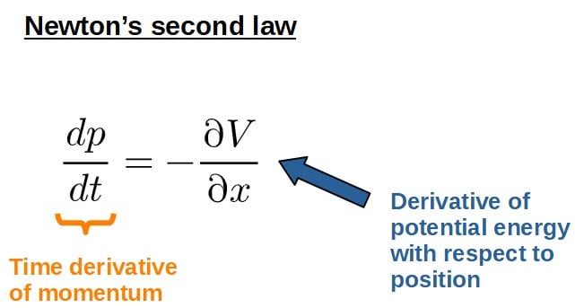

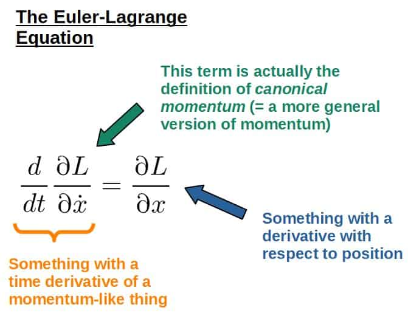

In fact, if you we’re to choose the kinetic energy as simply 1/2mv2, then the Euler-Lagrange equation would produce *exactly* F=ma.

Derivation of F=ma From The Euler-Lagrange Equation (click to see more)

To illustrate how F=ma can be derived as simply a consequence of Lagrangian mechanics, consider a Lagrangian of the form:

$$L=\frac{1}{2}m\dot x^2-V\left(x\right)$$

**In physics, the potential is usually just written in a general form**, because there are many different equations for the potential energy, but essentially they are all dependent on the position.

On the other hand, there is really only one equation for kinetic energy in classical mechanics and that is just ½mv2 (in this example, the velocity is simply the velocity in the x-direction).

Now, just plug the Lagrangian into the Euler-Lagrange equation and we get:

$$\frac{d}{dt}\frac{\partial}{\partial\dot{x}}\left(\frac{1}{2}m\dot{x}^2-V\left(x\right)\right)=\frac{\partial}{\partial x}\left(\frac{1}{2}m\dot{x}^2-V\left(x\right)\right)$$

Let’s move the constants outside the derivatives and write it like this:

$$\frac{d}{dt}\left(\frac{1}{2}m\frac{\partial}{\partial\dot{x}}\dot{x}^2-\frac{\partial}{\partial\dot{x}}V\left(x\right)\right)=\frac{1}{2}m\frac{\partial}{\partial x}\dot{x}^2-\frac{\partial}{\partial x}V\left(x\right)$$

When taking partial derivatives, the terms **without the variable we are differentiating with respect to**, simply go to 0 (the second term on the left hand side and the first term on the right):

$$\frac{d}{dt}\left(\frac{1}{2}m\cdot2\dot{x}-0\right)=0-\frac{\partial}{\partial x}V\left(x\right)$$

On the left side, the 1/2 and the 2 will cancel. We can also move the mass outside the derivative:

$$m\frac{d}{dt}\dot{x}=-\frac{\partial}{\partial x}V\left(x\right)$$

Now, that looks interesting. The left hand side is simply **mass times the time derivative of velocity** (= acceleration). The right side is just the force, so all in all this is nothing but **Newton’s second law**, $F=ma$.

Later in the article, I’ll also cover some practical examples of how exactly the Euler-Lagrange equation is used and why it’s useful (and not just Newtonian mechanics with more complicated extra steps).

## How To Solve Problems Using Lagrangian Mechanics (Step-By-Step Method)

Generally, to solve any problem in mechanics revolves around finding the **equations of motion** for a particular system of interest.

One of the main uses and advantages of Lagrangian mechanics is that there is a systematic method to derive equations of motion with very little effort (compared to something like using F=ma), even for very complicated systems.

Essentially, how you construct the Lagrangian (kinetic and potential energy terms) for a given system defines what kind of formulas you’ll derive from it. Generally, this will be in the form L=T-V.

Lagrangian mechanics is particularly useful for more complex systems, because all you need to do is define the kinetic and potential energies for each object in the system. The rest is then just applying the Euler-Lagrange equation.

The general step-by-step process for finding the equations of motion of a system goes more or less like this:

1. **Find a set of convenient coordinates (= *generalized coordinates*) for the specific problem.** These might be the usual Cartesian coordinates (x, y, z), but it is also possible to use coordinate systems such as spherical coordinates (r, θ, φ).
2. **Define the Lagrangian through the generalized coordinates**. For multiple objects in a system, the Lagrangian will be the sum of the difference between the kinetic and potential energies of each object:

$$L=\frac{1}{2}\sum_i^{ }m_iv_i^2-\sum_i^{ }V_i$$

It is usually easier to first define the Lagrangian in Cartesian coordinates and then transform to whatever generalized coordinates you’re using!

3. **Apply the Euler-Lagrange equations to the Lagrangian**. You’ll have one Euler-Lagrange equation for each coordinate you’ve chosen for the system.

4. **Simplify and solve the equations of motion**. At this point, you should have one second order differential equation for each coordinate you have.

Here, I’ve mentioned the use of **generalized coordinates**. These are one of the key advantages of Lagrangian mechanics which allow for such elegant and straightforward problem solving methods. I’ll explain everything about these later.

Practical Example: Projectile Motion With Lagrangian Mechanics (click to see more)

Projectile motion is the motion of an object under a gravitational field, like a ball thrown in the air where the ball will travel in a parabolic trajectory.

Here, I will go over the steps given above and show how they are used in practice.

**Step 1:** Find a set of convenient coordinates for the problem.

For this, we will simply choose the regular Cartesian coordinates (x and y). The coordinates and velocities are given by the picture:

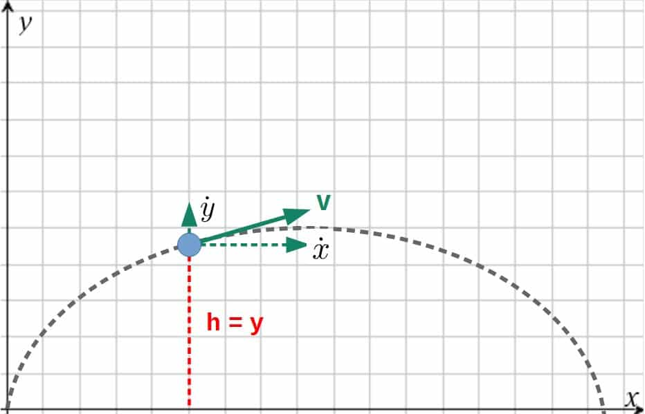

The x-component of velocity will be the time derivative of the x-coordinate, same for y. These are denoted by a dot, but it’s really just more compact notation for dx/dt and dy/dt.

**Step 2:** Define the Lagrangian.

For the Lagrangian, we simply need the kinetic and potential energies of this ball.

The kinetic energy is then the kinetic energy in the x-direction plus the kinetic energy in the y-direction. In other words:

$$T=\frac{1}{2}m\dot x^2+\frac{1}{2}m\dot y^2=\frac{1}{2}m\left(\dot x^2+\dot y^2\right)$$

The potential energy will just be the usual gravitational potential energy V=mgh. In this case, the height is simply the y-coordinate, so we have V=mgy. The Lagrangian for this ball thrown in the air is then simply T-V:

$$L=\frac{1}{2}m\left(\dot{x}^2+\dot{y}^2\right)-mgy$$

**Step 3:** Apply the Euler-Lagrange equations.

In this case, we will have **two Euler-Lagrange equations**, one for each of our two coordinates (x and y). The first one will be for the coordinate x:

$$\frac{d}{dt}\frac{\partial L}{\partial\dot{x}}=\frac{\partial L}{\partial x}$$

Plugging in the Lagrangian, we get:

$$\frac{d}{dt}\frac{\partial}{\partial\dot{x}}\left(\frac{1}{2}m\left(\dot{x}^2+\dot{y}^2\right)-mgy\right)=\frac{\partial}{\partial x}\left(\frac{1}{2}m\left(\dot{x}^2+\dot{y}^2\right)-mgy\right)$$

Since the Lagrangian doesn’t have any x’s in it, the right hand side goes to zero. On the left hand side, it does have an $\dot{x}$ and from that partial derivative, we get:

$$\frac{d}{dt}\left(\frac{1}{2}m\cdot2\dot{x}\right)=0\ \ \ \ \Rightarrow\ \ \ \frac{d}{dt}m\dot{x}=0$$

The mass here is just a constant, and by taking the time derivative of the velocity, we get the acceleration in the x-direction ($\ddot{x}$):

$$\ddot x=0$$

We’ve also divided out the mass here.

Now, for the y-coordinate, we get another Euler-Lagrange equation:

$$\frac{d}{dt}\frac{\partial L}{\partial\dot{y}}=\frac{\partial L}{\partial y}$$

Plugging in the Lagrangian and following pretty much the same process, we get (note that the Lagrangian has a y in it, so the right hand side is not zero anymore):

$$\frac{d}{dt}\frac{\partial}{\partial\dot{y}}\left(\frac{1}{2}m\left(\dot{x}^2+\dot{y}^2\right)-mgy\right)=\frac{\partial}{\partial y}\left(\frac{1}{2}m\left(\dot{x}^2+\dot{y}^2\right)-mgy\right)$$

$$\frac{d}{dt}\left(\frac{1}{2}m\cdot2\dot{y}\right)=\frac{\partial}{\partial y}\left(-mgy\right)$$

$$m\ddot{y}=-mg\ \ \ \Rightarrow\ \ \ \ \ddot y=-g$$

**Step 4:** Solve the equations of motion.

At this point, we have the equations of motion we need (notice that there are **two second order differential equations**, one for each of our coordinates):

$$\ddot x=0$$

$$\ddot{y}=-g$$

We can now integrate both of these twice with respect to time and get the coordinates as functions of time (the v0‘s here are the initial velocities in the x and y -directions):

$$x\left(t\right)=v_{x0}t$$

$$y\left(t\right)=v_{y0}t-\frac{1}{2}gt^2$$

These, of course, are the solutions to a projectile motion problem, which you may have seen before at some point.

It’s worth noting that there are also some restrictions for what kinds of problems you can solve using Lagrangian mechanics.

For example, **non-conservative forces cannot be directly derived from** **a Lagrangian** since they are not defined in terms of a potential energy.

An example of these are friction forces, like the viscous force in a fluid and for these kinds of non-conservative forces, it is usually easier to revert back to using **Newtonian mechanics** (this is explained in [this article](https://profoundphysics.com/lagrangian-vs-newtonian-mechanics-the-key-differences/)).

However, there are still ways of modifying Lagrangian mechanics in a way to include these forces, but they can’t directly come from the principle of least action.

[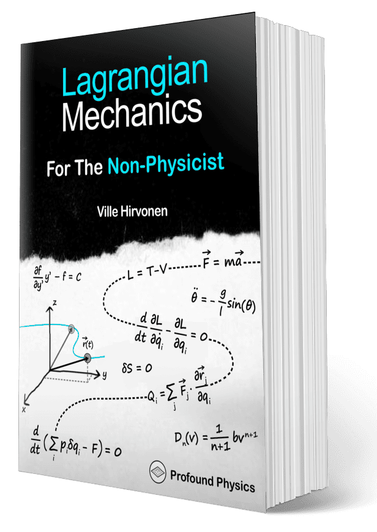](https://profoundphysicscourses.com/lagrangian-mechanics-book/) 

If you want to get a MUCH deeper understanding of Lagrangian mechanics, I’d recommend checking out my book **[Lagrangian Mechanics For The Non-Physicist](https://profoundphysicscourses.com/lagrangian-mechanics-book/)** (link to the book page). The book will teach you everything you need to know about Lagrangian mechanics – and more.

## More Examples of Using Lagrangian Mechanics!

It might not be clear yet how Lagrangian mechanics is actually used in more complicated situations. The best way to understand that is through examples, which you’ll find more of below.

### The Simple Pendulum

The simple pendulum is a system consisting of a mass at the end of a rigid rod that is allowed to swing in a plane under the influence of gravity. The length of the rod is L, the mass of the “pendulum bob” is m and the gravitational acceleration downwards is g (a constant).

Our goal here with Lagrangian mechanics is to **obtain the equations of motion for this system**.

There are many ways to do that – one would be by describing how the x- and y-coordinates of the bob change with time, but this is not necessarily the simplest way. The simplest way would be to use an angle, since that is enough to describe the position of the bob at all times.

Here’s the setup – we begin by placing the pendulum in an x,y -coordinate system such that the rod is attached to the origin. I’ll also denote the angle relative to the vertical (y-axis) as θ.

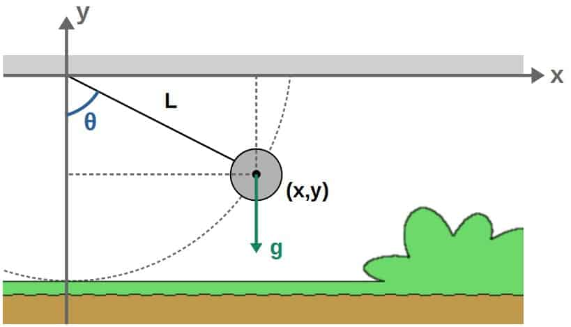

What we want to do is describe **how the angle θ changes with time** – so, it’s a function θ(t) here – by **constructing a Lagrangian** for this system and applying the **Euler-Lagrange equations**, just like we did previously in the case of a projectile. You’ll find out exactly how to do this below.

Full solution of the simple pendulum

The easiest way to begin is to first express the x- and y-coordinates of the pendulum bob in terms of the angle θ, as this will allow us to construct the Lagrangian very easily. The relations are shown below:

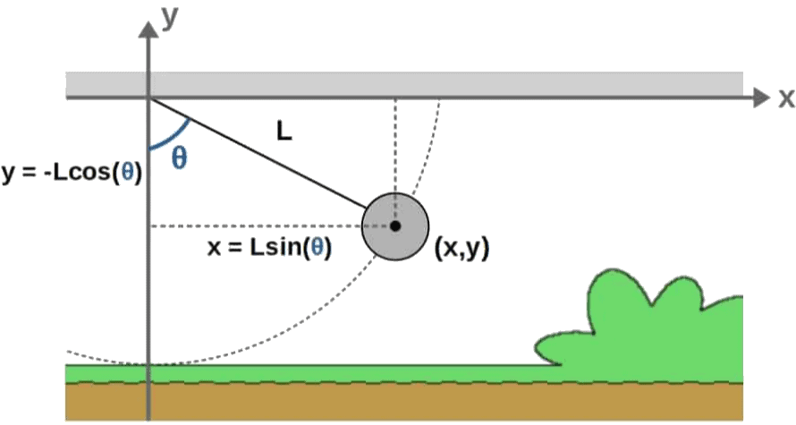 

Note that the y-coordinate is negative here since it’s measured below the x-axis.

Constructing the kinetic and potential energies – and the Lagrangian from those – from these relations is now quite simple. We know that the kinetic energy in Cartesian coordinates is given by:

$$T=\frac{1}{2}m\left(\dot{x}^2+\dot{y}^2\right)$$

All we do is take the time derivatives of the expressions above for x and y and plug them into here. So, let’s do that (note that we have to use the chain rule here since θ=θ(t) depends on time):

$$\dot{x}=\frac{d}{dt}\left(L\sin\theta\right)=L\dot{\theta}\cos\theta$$

$$\dot{y}=\frac{d}{dt}\left(-L\cos\theta\right)=L\dot{\theta}\sin\theta$$

These are the coordinate velocities in terms of the generalized coordinate θ. Plugging these into the kinetic energy formula, we have:

$$T=\frac{1}{2}m\left(\left(L\dot{\theta}\cos\theta\right)^2+\left(L\dot{\theta}\sin\theta\right)^2\right)=\frac{1}{2}mL^2\dot{\theta}^2\left(\cos^2\theta+\sin^2\theta\right)=\frac{1}{2}mL^2\dot{\theta}^2$$

Here, we’ve used the fact that cos2θ+sin2θ=1. This is the kinetic energy of the pendulum bob, expressed in terms of our generalized coordinate θ.

Now, the potential energy of the bob is simply the usual gravitational potential energy V=mgh. The height h here is just the y-coordinate of the bob, which is given by y=-Lcosθ. So, the potential energy is:

$$V=-mgL\cos\theta$$

We then have all the pieces we need to construct the Lagrangian for the pendulum bob:

$$L=T-V=\frac{1}{2}mL^2\dot{\theta}^2+mgL\cos\theta$$

This is the Lagrangian for this system in terms of our generalized coordinate θ. Since we have only one coordinate here, we also have just one Euler-Lagrange equation – an equation for the coordinate θ, of course:

$$\frac{d}{dt}\frac{\partial L}{\partial\dot{\theta}}-\frac{\partial L}{\partial\theta}=0$$

Plugging in the Lagrangian, we get:

$$\frac{d}{dt}\frac{\partial}{\partial\dot{\theta}}\left(\frac{1}{2}mL^2\dot{\theta}^2+mgL\cos\theta\right)-\frac{\partial}{\partial\theta}\left(\frac{1}{2}mL^2\dot{\theta}^2+mgL\cos\theta\right)=0$$

$$\Rightarrow\ \ \frac{d}{dt}\left(mL^2\dot{\theta}\right)-\left(-mgL\sin\theta\right)=0$$

$$\Rightarrow\ \ mL^2\ddot{\theta}+mgL\sin\theta=0$$

Here, the time derivative just adds another dot to $\dot{\theta}$.

Moving the sinθ-term to the right and dividing by mL2, we get the final equation of motion:

$$\ddot{\theta}=-\frac{g}{L}\sin\theta$$

This differential equation completely describes the motion of the pendulum over time. The goal, of course, would be to solve it to find θ(t) – but the problem is that it is not actually possible to solve this differential equation fully analytically.

However, this really isn’t a big deal. In fact, most equations of motions are not going to be solvable anyway. The point is to be able to find them, after which we could perform approximations to them, obtain solutions numerically or simulate the system using the equations of motion.

The goal of Lagrangian mechanics is to find these equations of motion as efficiently as possible. What happens after that is someone else’s problem – usually a computer’s.

### The Moving Inclined Plane

The moving inclined plane consists of a block of mass m that’s placed on an inclined ramp of mass of mass M. There is a gravitational acceleration of magnitude g downwards.

The plane is tilted by an angle α with respect to the ground, such that the block begins sliding down the ramp. The total length of the ramp is L. In addition, the ramp itself is allowed to move in the horizontal direction.

Our goal is to find out how both the block and the ramp begin moving as time passes – in other words, **find the equations of motion for the full system**.

We’ll begin by placing the system in a Cartesian coordinate system with the ramp being initially at the origin. For the coordinate we’re interested in describing, we’ll choose the **x-coordinate of the ramp** and the **displacement s of the block** measured from the top of the ramp:

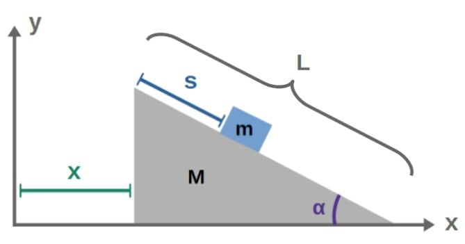

So, we want to find the equations of motion for the coordinates x and s as functions of time. You’ll find the full solution below.

Full solution of the moving inclined plane

Let’s begin by first finding the Cartesian coordinates of both the block and the ramp. The key here is that since the full system consists of both of these objects, the Lagrangian will also have contributions that describe the dynamics of both objects.

**For the ramp**, its Cartesian coordinates are simply just x, which is a function of time and also one of our generalized coordinates and y=0 at all times.

**For the block**, we can express its y-coordinate in terms of s as (L-s)sinα. Its x-coordinate, on the other hand, is the x-coordinate of the ramp (just x) *plus* the horizontal distance of the of the block to the left edge of the ramp, which we can express as scosα:

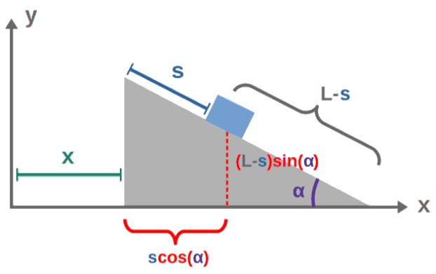

So, the Cartesian coordinates of the ramp and the block in terms of our generalized coordinates of interest (x and s) are:

$$x_r=x\ {,}\ \ y_r=0$$

$$x_b=x+s\cos\alpha\ {,}\ \ y_b=\left(L-s\right)\sin\alpha$$

We can get the velocity components by just differentiating both of these with respect to time:

$$\dot{x}_r=\dot{x}\ {,}\ \ \dot{y}_r=0$$

$$\dot{x}_b=\dot{x}+\dot{s}\cos\alpha\ {,}\ \ \dot{y}_b=-\dot{s}\sin\alpha$$

The kinetic energies of the ramp and the block are then:

$$T_r=\frac{1}{2}M\left(\dot{x}_r^2+\dot{y}_r^2\right)=\frac{1}{2}M\dot{x}^2$$

$$T_b=\frac{1}{2}m\left(\dot{x}_b^2+\dot{y}_b^2\right)=\frac{1}{2}m\left(\left(\dot{x}+\dot{s}\cos\alpha\right)^2+\left(-\dot{s}\sin\alpha\right)^2\right)\\=\frac{1}{2}m\left(\dot{x}^2+2\dot{x}\dot{s}\cos\alpha+\dot{s}^2\cos^2\alpha+\dot{s}^2\sin^2\alpha\right)\\=\frac{1}{2}m\left(\dot{x}^2+2\dot{x}\dot{s}\cos\alpha+\dot{s}^2\right)$$

The potential energy of the ramp is zero at all time. The potential energy of the block, on the other hand, is V=mgh. Here, h is the height of the block from the ground, so just yb. We can then express the potential energy as V=mgyb=mg(L-s)sinα.

The total Lagrangian of the system is then the sum of all of these kinetic and potential energies:

$$L=T_r+T_b-V=\frac{1}{2}M\dot{x}^2+\frac{1}{2}m\left(\dot{x}^2+2\dot{x}\dot{s}\cos\alpha+\dot{s}^2\right)-mg\left(L-s\right)\sin\alpha$$

$$\Rightarrow\ \ L=\frac{1}{2}\left(M+m\right)\dot{x}^2+\frac{1}{2}m\dot{s}^2+m\dot{x}\dot{s}\cos\alpha-mg\left(L-s\right)\sin\alpha$$

Since we have two generalized coordinates here, x and s, we will get two equations of motion from the Euler-Lagrange equations. First, for the x-coordinate, we find:

$$\frac{d}{dt}\frac{\partial L}{\partial\dot{x}}-\frac{\partial L}{\partial x}=0$$

$$\Rightarrow\ \ \frac{d}{dt}\left(\left(M+m\right)\dot{x}+m\dot{s}\cos\alpha\right)=0$$

$$\Rightarrow\ \ \left(M+m\right)\ddot{x}+m\ddot{s}\cos\alpha=0$$

$$\Rightarrow\ \ \ddot{x}=-\frac{m}{M+m}\ddot{s}\cos\alpha$$

For the s-coordinate, on the other hand, we get:

$$\frac{d}{dt}\frac{\partial L}{\partial\dot{s}}-\frac{\partial L}{\partial s}=0$$

$$\Rightarrow\ \ \frac{d}{dt}\left(m\dot{s}+m\dot{x}\cos\alpha\right)-mg\sin\alpha=0$$

$$\Rightarrow\ \ m\ddot{s}+m\ddot{x}\cos\alpha-mg\sin\alpha=0$$

$$\Rightarrow\ \ \ddot{s}=g\sin\alpha-\ddot{x}\cos\alpha$$

We now have two equations of motion that are *coupled*. In other words, this is a pair of equations, from which we would ideally like to isolate both coordinates. To do this, we can simply take the expression for x-double dot and insert it into the s-equation:

$$\ddot{s}=g\sin\alpha-\left(-\frac{m}{M+m}\ddot{s}\cos\alpha\right)\cos\alpha$$

$$\Rightarrow\ \ \ddot{s}=\frac{M+m}{M+m\left(1-\cos^2\alpha\right)}g\sin\alpha$$

We can still write 1-cos2α=sin2α here to get:

$$\ddot{s}=\frac{\left(M+m\right)g\sin\alpha}{M+m\sin^2\alpha}$$

Inserting this now into the x-equation from above, we find:

$$\ddot{x}=-\frac{m}{M+m}\left(\frac{\left(M+m\right)g\sin\alpha}{M+m\sin^2\alpha}\right)\cos\alpha=-\frac{mg\sin\alpha\cos\alpha}{M+m\sin^2\alpha}$$

We then have our final set of equations of motion, which describe the motion of the entire system:

$$\begin{cases}\ddot{x}=-\frac{mg\sin\alpha\cos\alpha}{M+m\sin^2\alpha}\\ \ddot{s}=\frac{\left(M+m\right)g\sin\alpha}{M+m\sin^2\alpha}\end{cases}$$

An important thing to note about both of these is that the right-hand sides are just constants, since m, M, g and α are all constant parameters. Therefore, solving these equations of motion is very simple – we just integrate both sides twice (we’ll also take the initial conditions to all be zero here):

$$\begin{cases}x\left(t\right)=-\frac{1}{2}\frac{mg\sin\alpha\cos\alpha}{M+m\sin^2\alpha}t^2\\s\left(t\right)=\frac{1}{2}\frac{\left(M+m\right)g\sin\alpha}{M+m\sin^2\alpha}t^2\end{cases}$$

Physically, we can see from these that as time t increases, the s-coordinate *increases* (the block begins sliding down the ramp and thus moves further in the positive s-direction) and at the same time, the x-coordinate *decreases* (the ramp begins sliding to the left).

We can understand this from the perspective of momentum conservation – if the system is initially at rest, the total momentum is zero. As gravity drags the block down the ramp, it gains a non-zero amount of momentum in the *positive* x-direction.

But for the total momentum of the system to be conserved (which it should), the ramp must therefore gain a non-zero amount of momentum in the *opposite* direction – it begins sliding in the *negative* x-direction. But, this is all just a simple physical explanation for what we can already predict from the equations of motion mathematically.

## Key Features of Lagrangian Mechanics

Next, we’ll take a look at some important aspects of Lagrangian mechanics that make it unique and powerful.

Everything discussed here is covered in MUCH more detail in my full Lagrangian mechanics -book, which you can find more about [here](https://profoundphysicscourses.com/lagrangian-mechanics-book/). There, we also look at some of the **issues with Newtonian mechanics** and how Lagrangian mechanics naturally fixes these.

### Generalized Coordinates

Usually, the Euler-Lagrange equation is written in terms of something called **generalized coordinates**, which are denoted by q’s (the i-index here simply represents how many coordinates you have; for example, with multiple different coordinates, you’d have one EL equation for q1, another for q2 and so on):

$$\frac{d}{dt}\frac{\partial L}{\partial\dot{q}_i}=\frac{\partial L}{\partial q_i}$$

But what exactly are these generalized coordinates? These are (as the name may suggest), more general types of coordinates, ones which allow for much more **freedom in our choice of coordinates** **and coordinate systems**.

See, in Lagrangian mechanics, we are not limited to any particular set of coordinates such as the typical x,y,z -coordinate system.

Instead, you could have, for example, some angle θ as your coordinate in a problem involving rotational motion.

The beautiful thing about Lagrangian mechanics is that the problem solving methods (discussed earlier) work *exactly* the same, **no matter what coordinates you wish to use**.

These generalized coordinates have some very useful advantages to the regular Cartesian coordinates (of course you can still use Cartesian coordinates, if you wish):

- **Generalized coordinates allow us to implicitly contain ALL information about how a system behaves** (for example, choosing polar coordinates (r and θ) for a pendulum would already include the fact that the pendulum moves in a circle; using only Cartesian coordinates, you’d have to impose certain *constraints* on the system).
- **The right choice of generalized coordinates can make a calculation extremely simple**.
- **Generalized coordinates can reduce the number of variables/equations needed to solve a specific problem** (as an example, choosing only an angle θ for a pendulum would be enough to find the equations of motion, while in Cartesian coordinates, you’d need both the x and y -coordinates).
- **Generalized coordinates allow different quantities to be expressed easily in a more general form** (generalized velocity, generalized momentum, generalized forces etc.).

I actually have a **full article discussing generalized coordinates in detail and how to use them** (as well as examples of this), which you’ll find [here.](https://profoundphysics.com/generalized-coordinates/) I highly recommend checking it out, as generalized coordinates are one of the most important parts of Lagrangian mechanics.

### Generalized Momentum

As you start using the Euler-Lagrange equation, there are clear patterns that start showing up.

The most interesting of these is one of the terms in the Euler-Lagrange equation, which always somehow happens to give a momentum-like quantity. This term is, in fact, the definition for ***generalized momentum***:

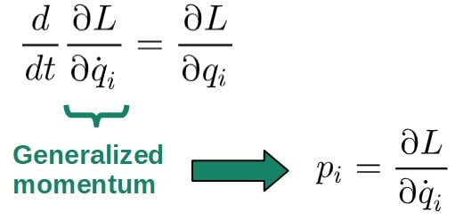

Generalized momentum is also sometimes called canonical momentum.

When you get into more advanced mechanics, regular momentum (also sometimes called **kinetic momentum**) is not going to be enough anymore.

Instead, we have this thing called **generalized momentum**, denoted by pi (i here represents the fact that each generalized momentum pi is always associated with a certain generalize coordinate qi in the system):

$$p_i=\frac{\partial L}{\partial\dot{q}_i}$$

What is this generalized momentum actually useful for, though? Well, the first reason is that **it allows us to quickly identify the different momenta in a system**, pretty much with the following statement:

> If the Lagrangian has a time derivative of some generalized coordinate qi, then there must exist a generalized momentum pi associated with the coordinate qi.

Down below I’ve included some examples of what these generalized momenta may look like and how they are obtained from the Lagrangian (note that this definition is valid *even outside of classical mechanics* too).

Examples of Generalized Momenta (click to see more)

The first example of generalized momentum is going to be a simple one. consider the following Lagrangian (this is the Lagrangian for a **free particle**, i.e. no potential energy term, moving in the x,y -plane):

$$L=\frac{1}{2}m\left(\dot x^2+\dot y^2\right)$$

Here we have two different generalized coordinates, x and y. For each of them, we have a generalized momentum:

$$p_x=\frac{\partial L}{\partial\dot{x}}=\frac{\partial}{\partial\dot{x}}\left(\frac{1}{2}m\left(\dot{x}^2+\dot{y}^2\right)\right)=m\dot x$$

$$p_y=\frac{\partial L}{\partial\dot{y}}=\frac{\partial}{\partial\dot{y}}\left(\frac{1}{2}m\left(\dot{x}^2+\dot{y}^2\right)\right)=m\dot{y}$$

There are, of course, the usual components of the momentum. Indeed, when the Lagrangian has a kinetic energy of the usual 1/2mv2 -form, the generalized momentum will have the simple form p=mv.

Now, consider the Lagrangian for a particle in **polar coordinates**:

$$L=\frac{1}{2}m\left(\dot{r}^2+r^2\dot{\theta}^2\right)$$

Here, we have the generalized coordinates r and θ, so we’ll have a generalized momentum for each of them:

$$p_r=\frac{\partial L}{\partial\dot{r}}=\frac{\partial}{\partial\dot{r}}\left(\frac{1}{2}m\left(\dot{r}^2+r^2\dot{\theta}^2\right)\right)=m\dot{r}$$

$$p_{\theta}=\frac{\partial L}{\partial\dot{\theta}}=\frac{\partial}{\partial\dot{\theta}}\left(\frac{1}{2}m\left(\dot{r}^2+r^2\dot{\theta}^2\right)\right)=mr^2\dot{\theta}$$

The first one (pr) is simply the ordinary momentum again (p=mv), since r is the position of the particle.

The second term (pθ) is more interesting; it is the **angular momentum**. Indeed, if you’re using polar coordinates, the generalized momentum associated with the coordinate θ will be the angular momentum.

Here, you might see how this generalized momentum is actually quite useful; it allows us to define the momentum in an extremely general way. If you’re not convinced yet, let’s do one more example, one that’s actually outside of classical mechanics.

Lagrangian mechanics can indeed be used in special relativity too, but the Lagrangian for that is not T-V, it rather looks something like this (this Lagrangian is explained in my **[introduction to special relativity](https://profoundphysics.com/special-relativity-for-dummies-an-intuitive-introduction/)**):

$$L=-mc^2\sqrt{1-\frac{\dot r^2}{c^2}}$$

The generalized momentum for this is:

$$p_r=\frac{\partial L}{\partial\dot{r}}=\frac{\partial}{\partial\dot{r}}\left(-mc^2\sqrt{1-\frac{\dot{r}^2}{c^2}}\right)=\frac{m\dot r}{\sqrt{1-\frac{\dot{r}^2}{c^2}}}$$

This, if you know anything about special relativity, is the usual formula for the momentum of a **relativistic particle** (i.e. one that’s traveling close to the speed of light).

Another particularly useful thing about the generalized momentum is that **it allows us to generalize the notion of momentum** to many different cases where the usual p=mv simply does not work anymore.

This I already showed an example of above, which allowed us to easily derive the formula for **relativistic momentum** (you’ll also find more about information about it in [this article](https://profoundphysics.com/special-relativity-for-dummies-an-intuitive-introduction/)).

### Generalized Forces

Just like these are generalized momenta, there are also things called **generalized forces**.

Now, these aren’t directly expressed through the Lagrangian, but they are expressed by using **generalized coordinates** – that’s the whole point of generalized coordinates; to express laws of motion using them.

The generalized forces are defined as (denoted by Q’s with the i-index being associated with the particular generalized coordinate qi):

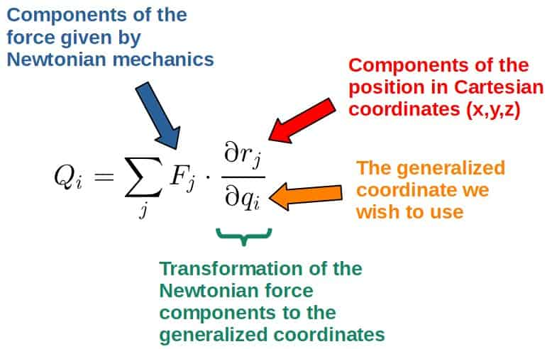

The generalized forces are really just the usual Newtonian forces, but transformed to generalized coordinates, which we wish to use in Lagrangian mechanics.

Now, this may seem a little abstract at the moment and you may also ask; why do we even need these generalized forces if Lagrangian mechanics is all about using energies?

Well, the answer is that we don’t – usually. Exceptions to this include incorporating **friction** and other velocity-dependent forces into Lagrangian mechanics.

For friction and non-conservative forces in general, we have to add them manually into the Euler-Lagrange equations as generalized forces (the generalized friction forces I’ll denote by Qif) like this:

$$\frac{d}{dt}\frac{\partial L}{\partial\dot{q}_i}=\frac{\partial L}{\partial q_i}+Q_i^f$$

Now, the way these friction forces are dealt with in Lagrangian mechanics is by using something something called a **dissipation function**, which essentially accounts for the energy “lost” from friction.

I explain everything about how to **incorporate friction into Lagrangian mechanics** and also show a bunch of useful examples in [this article](https://profoundphysics.com/friction-in-lagrangian-mechanics/).

Another useful application of generalized forces is for finding **constraint forces** (like tension or the normal force of a surface), which uses the **Lagrange multiplier method**. You can read more about it [here](https://profoundphysics.com/constraints-in-lagrangian-mechanics/).

Also, generalized forces actually allow for **another formulation of Lagrangian mechanics** (it’s practically just a different way to derive the Euler-Lagrange equation), which doesn’t use the principle of stationary action.

Instead, it uses something called the **principle of virtual work** and **d’Alembert’s principle** to basically derive Lagrangian mechanics.

The mathematics of this is a little more abstract and not really important for now, so I’ll just state that this formulation exists and leave it at that.

However, in case you want to find out more about **generalized forces, friction and non-conservative forces in Lagrangian mechanics**, I have an entire chapter covering exactly these topics in detail my book **[Lagrangian Mechanics For The Non-Physicist](https://profoundphysicscourses.com/lagrangian-mechanics-book/)** (link to the book page).

These are topics even many university courses on Lagrangian mechanics won’t cover, which is why I specifically wanted to include them in my course. So, check it out!

### Scalars vs Vectors

In the Lagrangian formulation of classical mechanics, everything is described by just the kinetic and potential energy and those can both be fit nicely into just one equation, the Lagrangian.

The usefulness of this becomes explicitly clear when comparing it to the formulas for different forces, where you just have a bunch of different stuff that at first sight, don’t even seem to be connected in any obvious way.

In Lagrangian mechanics, it’s different, because everything is clearly connected to just a few concepts; namely the concepts of **energy** and **action**, **the Lagrangian** and **the principle of stationary action**. These are then all brought together by **the Euler-Lagrange equation**.

Another nice thing about Lagrangian mechanics and the fact that we’re only using energies instead of forces, is the fact that **forces are vector quantities**, while **energies are scalar quantities**.

What this means, is that **forces always have a direction and a magnitude**, while **energies only have a magnitude** (in the elementary sense; in relativity, this won’t be enough as a definition).

This is a clear advantage of using energies instead of forces, because it just eliminates a lot of hassle, like having to break the forces down into their vector components or having to worry about calculating dot products of forces, angles between the vectors etc.

Also, vectors are quite a pain to deal with in so-called *curvilinear coordinates* (for example, the polar coordinate system that has curved coordinate lines). The nice thing is that Lagrangian mechanics naturally eliminates *all* the difficulties related to this.

## Why Do We Need Lagrangian Mechanics?

We’ve already talked quite a bit about the advantages of Lagrangian mechanics, but in case it’s not quite clear yet, here is a list of the most important aspects of Lagrangian mechanics that make it so useful:

- **Constraints**: Normally, when we want to constrain a system in some way – say, an object moving along a surface – we have to add in constraint forces that can be difficult to work with. Lagrangian mechanics eliminates all this by introducing **generalized coordinates**.
- **Curvilinear coordinates**: In coordinate systems where the basis vectors can change from point to point – polar coordinates, for example – describing motion using vectors is much more complicated. Lagrangian mechanics makes this very simple, since we only need to work with **scalars**.
- **Symmetries and conservation laws**: Lagrangian mechanics provides us a direct way to analyze symmetries of physical systems and identify conservation laws in them. This is called **Noether’s theorem**, which you can read more about [here](https://profoundphysics.com/noethers-theorem-a-complete-guide/).
- **Applications to modern physics**: Pretty much everything in Lagrangian mechanics carries over to all other areas of modern physics. This makes Lagrangian mechanics one of the most valuable tools in understanding and, well, doing modern physics in general.

## Lagrangian Mechanics In Modern Physics & Field Theory

Now, using Lagrangian mechanics to find equations of motion for different systems is interesting and all, but really the importance of this formulation isn’t given enough justice in the classical context.

The Lagrangian formulation is, in fact, **the cornerstone of a lot of modern physics** and it actually underlies almost every theory we know so far (this isn’t even an exaggeration).

The real reason for this is that the principle of stationary action just happens to apply to ***fields*** as well, so it forms the basis for most field theories.

On the other hand, almost all modern theories of physics are some sort of **field theories** (general relativity, quantum field theory, electromagnetism etc. are all field theories). This makes the action principle fundamental to pretty much everything.

Now, the Lagrangian formulation of field theory is really quite abstract and cannot be covered in detail here. In case you’d like to learn more about it, you can do so from my second book **Field Theory For The Non-Physicist**, found [here](https://www.amazon.com/dp/B0CN7HQWCM).

Let’s just go over the very basics here. Essentially, most of what we’ve talked about regarding Lagrangian mechanics in this article will apply to field theory as well in some form.

First, instead of there being a simple Lagrangian for fields, there is something called a **Lagrangian density** (denoted by a curly L). The Lagrangian density is **a function of the field and its first derivatives** (just like the ordinary Lagrangian is a function of position and velocity):

$$\mathscr{L}=\mathscr{L}\left(\phi{,}\ \partial_{\mu}\phi\right)$$

This ∂µ is called the 4-gradient (i.e. the relativistic equivalent to a regular gradient), which is simply a derivative w.r.t both space and time (since the field depends on both space and time).

The action for a field is then this Lagrangian density integrated, not over time, but over *spacetime* (this we denote as d4x). This action should also be stationary (i.e. δA=0):

$$\delta A=\delta\int_{ }^{ }\mathscr{L}\left(\phi{,}\ \partial_{\mu}\phi\right)d^4x=0$$

This is the principle of stationary action, but applied to a field.

The result of this condition gives the Euler-Lagrange equation for the field ϕ, which fully describes its dynamics. The field equation can then be solved to find out how the field behaves as a function of space and time.

Now, if this went over your head, don’t worry. The main point here is that the principle of stationary action is used all over modern physics.

Perhaps the most important application of the Lagrangian formulation of field theory is for quantum field theory. For example, maybe you’ve seen the famous **Standard Model Lagrangian** before, which describes our current understanding of particle physics:

$$\mathscr{L}=-\frac{1}{4}F_{\mu\nu}F^{\mu\nu}+i\bar{\psi}\gamma^{\mu}D_{\mu}\psi+h.c.+\bar{\psi}_iy_{ij}\psi_j\phi+h.c.+\left|D_{\mu}\phi\right|^2-V\left(\phi\right)$$

This is actually a really condensed version of the full Standard Model Lagrangian, which in its full form, looks quite nasty.

The point, however, is that this Lagrangian encodes the dynamics of a bunch of fields in the Standard Model (ψ and ϕ, the Dirac spinor field and the Higgs field, to name a couple) and can then be used to obtain the full dynamics of each field.

Another important modern physics -related application of Lagrangians comes from general relativity, where the *Einstein field equations* can be derived from something called the **Einstein-Hilbert action**. I actually present the full derivation in [this article](https://profoundphysics.com/derivation-of-einstein-field-equations/).

In case you’d like to understand the **Standard Model Lagrangian** and **quantum field theory** better, you should certainly check out my full book **[Field Theory For The Non-Physicist](https://www.amazon.com/dp/B0CN7HQWCM)** (link to the book page). The book is largely dedicated to the **Lagrangian description of field theories** – everything from why we use Lagrangians to how these Lagrangians are constructed and how they describe everything about fields and particles as well their properties and dynamics. Everything we discuss is then applied to understanding **quantum field theories**, **particle physics**, **relativity** and modern physics in general!

### Noether’s Theorem & Conservation Laws

A very important idea that’s closely related to Lagrangian mechanics is Noether’s theorem.

**Simply put, Noether’s theorem gives us a general way to derive conservation laws for any physical system. This is done by analyzing the symmetries in the system and can be mathematically formulated using the Lagrangian quite easily.**

Now, there is a lot that goes into defining what we mean by symmetries in physics as well as how exactly these relate to conservation laws, so we won’t go into more detail here.

To understand these ideas in detail, I’d recommend reading **[my complete guide on Noether’s theorem](https://profoundphysics.com/noethers-theorem-a-complete-guide/)**. It will teach you everything you need to know in a beginner-friendly way as well as show you lots of examples (and, you should now have the necessary prerequisites on Lagrangian mechanics to understand it!).

There is also an entire chapter on Noether’s theorem in my full book [Lagrangian Mechanics For The Non-Physicist](https://profoundphysicscourses.com/lagrangian-mechanics-book/), in case you would really like to take your understanding to the next level.

## Examples & Applications of Lagrangian Mechanics (Free PDF)

Below, you’ll find some examples that hopefully illustrate the applications of Lagrangian mechanics in practice (it’s a free PDF, feel free to download it for yourself).

**[Get the free PDF here](https://profoundphysics.com/lagrangian-mechanics-examples-applications-free-pdf/)**.

In the PDF, we’re going to look at for example, finding the Lagrangian and the equations of motion for systems like the simple pendulum and the spherical pendulum. We also analyze the behaviour of these systems.

However, the most interesting example covered is the Kepler problem using Lagrangian mechanics.

The Kepler problem is one of the most foundational physics problems, perhaps, of all time and it has to do with solving for the motion of two massive bodies (such as planets) orbiting each other under the influence of gravity.

## Where To Learn More About Lagrangian Mechanics? (Recommended Resources)

If this article was interesting and you wish to learn more about Lagrangian mechanics and the actual depths of this formulation, the next step to do is to look for other resources.

Now, before actually studying Lagrangian mechanics, it is worth noting that **Lagrangian mechanics is NOT easy**. This article only scratched the surface of what Lagrangian mechanics is really all about.

In the past, I used to just tell people that they can learn Lagrangian mechanics just from reading internet articles or watching Youtube videos on it. While this is possible for some people, I’ve come to realize that this is NOT the best way to go about it.

For most people, **they would actually be able to learn Lagrangian (and Hamiltonian) mechanics much faster and more deeply if they had a dedicated and complete resource for it**.

Of course, you’re free to pick any resource you want, but if you want my recommendation, then my new book, **[Lagrangian Mechanics For The Non-Physicist](https://profoundphysicscourses.com/lagrangian-mechanics-book/)** (link to the book page), is something you’ll absolutely love. This is the kind of book I personally would have wished to have when starting out learning physics.

The book will first cover basic **Newtonian mechanics** and also touch on some of the issues with Newton’s laws as a motivation for introducing Lagrangian mechanics. We then discuss **calculus of variations**, the area of math Lagrangian mechanics is based on.

After this, the following chapters dive deep into various aspects of Lagrangian mechanics like generalized coordinates, momenta and forces, velocity-dependent potentials, constrained dynamics, dissipation functions, symmetries, conservation laws as well as how to solve Lagrangian mechanics problems in the most efficient way.

 

If you want to get a MUCH deeper understanding of Lagrangian mechanics, I’d recommend checking out my book **[Lagrangian Mechanics For The Non-Physicist](https://profoundphysicscourses.com/lagrangian-mechanics-book/)** (link to the book page). The book will teach you everything you need to know about Lagrangian mechanics – and more.

I also have a “part two” of the Lagrangian mechanics book that is entirely dedicated to **field theory**. This book is called **[Field Theory For The Non-Physicist](https://www.amazon.com/dp/B0CN7HQWCM)** (link to its Amazon page) and it’s essentially a direct continuation of the Lagrangian mechanics book mentioned above.

We cover everything from why and how to construct relativistic field theories to the applications and physical predictions of these as well as how all of this allows us to describe many areas of modern physics (like the Standard Model and particle physics).

---

*← [Back to the full archive](../index.html)*
