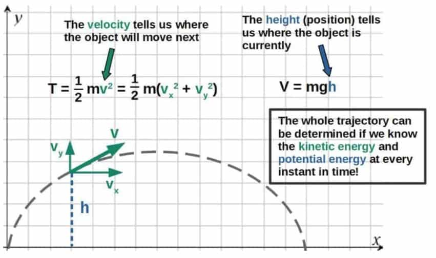
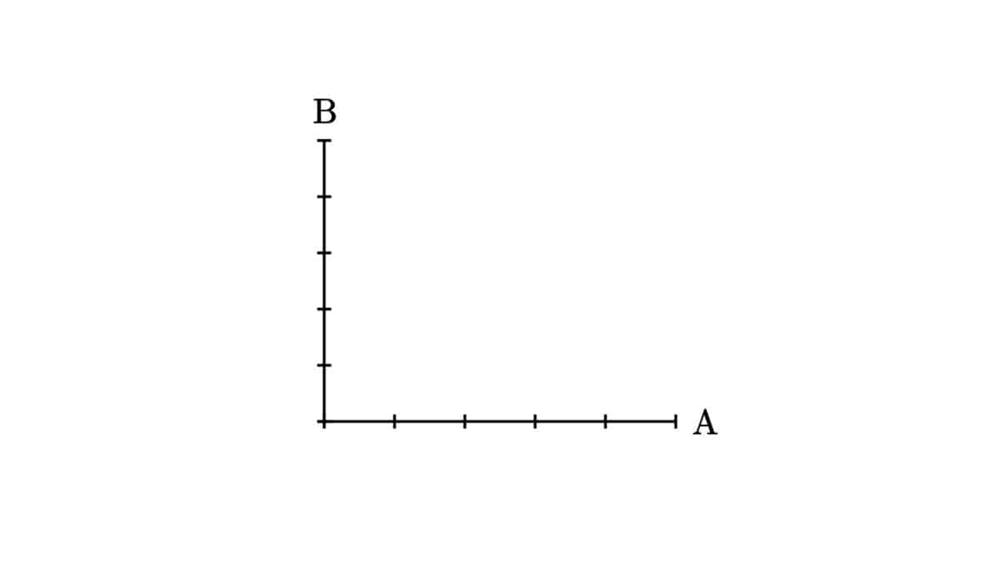
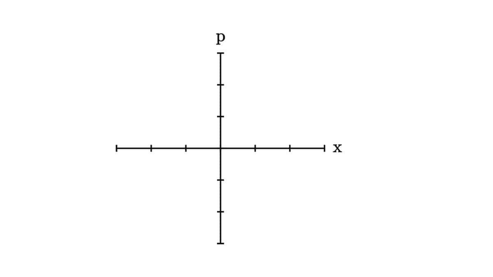

# Lagrangian vs Hamiltonian Mechanics: The Key Differences & Advantages

> The two most fundamental formulations of classical mechanics, side by side. Same physics, two pictures: configuration space vs phase space.

*Originally published at [profoundphysics.com](https://profoundphysics.com/lagrangian-vs-hamiltonian-mechanics/).*

---

Classical mechanics describes everything around us from cars and planes even to the motion of planets. There are multiple different formulations of classical mechanics, but the two most fundamental formulations, along with Newtonian mechanics, are **Lagrangian mechanics** and **Hamiltonian mechanics**.

In short, here is a comparison of the **key differences between Lagrangian and Hamiltonian mechanics**:

| Lagrangian mechanics | Hamiltonian mechanics |
| --- | --- |
| The fundamental object is the Lagrangian (difference of kinetic and potential energy) | The fundamental object is the Hamiltonian (sum of kinetic and potential energy) |
| Equations of motion are given by the Euler-Lagrange equation | Equations of motion are given by the Hamilton’s equations |
| Motion is described by position and velocity | Motion is described by position and momentum |
| Formulated in configuration space | Formulated in phase space |
| The Lagrangian is not a conserved quantity | The Hamiltonian is a conserved quantity (though not always) |
| More easily applied to relativistic theories | More easily applied to quantize classical theories |

A table of the most important differences between Lagrangian and Hamiltonian mechanics.

While there may seem to be a lot of differences between the two formulations of mechanics, they really are just different perspectives to describe the same phenomena – at the end of the day, they will both give the same results and predictions.

However, both of these formulations have their own advantages as well. This becomes more clear once we look at how the two formulations are used outside of classical mechanics (which we’ll talk about in this article).

Before we get started, in case you need a refresher on Lagrangian mechanics, you can read [this article](https://profoundphysics.com/lagrangian-mechanics-for-beginners/). You may also enjoy my **full book on Lagrangian mechanics** (found [here](https://profoundphysicscourses.com/lagrangian-mechanics-book/)) – it’s pretty much the only resource you’ll ever need on this topic.

There are also some things that work differently in Lagrangian and Hamiltonian mechanics that are not discussed in this article. An example of this is **Noether’s theorem** – if you want to learn more about how it works in both of these formulations, check out [this article](https://profoundphysics.com/noethers-theorem-a-complete-guide/).

## The Lagrangian vs The Hamiltonian

First of all, let’s discuss the most obvious difference between Lagrangian and Hamiltonian mechanics – the fundamental quantities used in the two formulations.

The key idea behind both of the formulations is that we can predict and describe the motion of any system only by its **energy**. In contrast, to describe motion using Newtonian mechanics, we use forces.

If we know the kinetic and potential energies of an object at all points in time, we can fully predict where the object will move next. In other words, we know the entire trajectory of the object. Take for example, the trajectory of a projectile (such as a ball thrown in the air):



This is the basis for both the Lagrangian and the Hamiltonian formulation – in both formulations, we describe how a system evolves in time by the energies of the system.

However, the way in which this is done in practice will be quite different in the two formulations.

In **Lagrangian mechanics**, the fundamental object is the **Lagrangian**. For a classical system, the Lagrangian is defined as the difference between kinetic energy (T) and potential energy (V):

$$L=T-V$$

Generally, the Lagrangian will be a **function of position and velocity**.

Now, the Lagrangian itself does not really have a physical meaning. It’s an object we define this way because it allows us to derive the equations of motion for a system from an **action principle**.

The basic idea behind an action principle is to essentially look at ALL possible trajectories an object would take through time and assign a quantity called **action** to each possible trajectory. We define the action of a trajectory by integrating over the Lagrangian at each point in time:

$$S=\int_{t_1}^{t_2}Ldt$$

The REAL trajectory (time evolution) of the system or object is then given by the particular trajectory that makes the action *stationary*. This is called the **principle of stationary action** (or sometimes, the principle of *least* action).

The key with this is that if we want the equations of motion obtained from this action principle to match what we would get from **Newton’s second law** (F=ma) – which they, of course, should – then we *have to* define the Lagrangian as L=T-V.

So, the Lagrangian is not some fundamental physical quantity but instead, it is something we *define*, because it leads to the correct predictions.

It’s also worth noting that the Lagrangian is NOT always T-V in other areas of physics (such as in special relativity). However, the same point still applies; a Lagrangian is always defined in a particular way that is consistent with an action principle.

In **Hamiltonian mechanics**, on the other hand, the fundamental object is the **Hamiltonian**. In its most general form, the Hamiltonian is defined as:

$$H=\sum_i^{ }p_i\dot{q}_i-L$$

Here, pi represents the generalized momentum and qi-dot is the time derivative of the generalized coordinates (basically, velocity).

The Hamiltonian, in contrast to the Lagrangian, is a **function of position and momentum**, but NOT of velocity. When calculating the Hamiltonian for a system, all the velocities *always* need to be expressed in terms of momenta.

This may seem insignificant (momentum is just mass times velocity, right?), but it is actually a crucial feature of Hamiltonian mechanics. This has to do with position and momentum being “conjugate quantities”, which we’ll discuss more later.

Also, as you may be able to see, the Hamiltonian is defined in terms of the Lagrangian (L). This actually comes from the fact that the Hamiltonian is defined as the **Legendre transform of the Lagrangian**.

The significance of this is that the Hamiltonian contains ALL the same information as the Lagrangian, but expressed in terms of different quantities. This comes from the properties of the Legendre transformation, which I discuss in detail in [this article](https://profoundphysics.com/legendre-transformations-for-dummies-intuition-and-examples/).

The interesting thing is that while the Lagrangian doesn’t have any direct physical meaning, the Hamiltonian does – the Hamiltonian represents the **total energy of a system**.

This is easier to see if you actually calculate the Hamiltonian for a particular system, in which case the Hamiltonian typically takes the form T+V.

```
Sidenote; The Hamiltonian does not always represent the total energy of a system. In particular, if the Lagrangian of a system explicitly depends on time, then the Hamiltonian of that system will not be conserved and does not represent the energy of the system, strictly speaking.

This can be understood from a useful mathematical result in calculus of variations called the Beltrami identity. In case you're interested, I cover the Beltrami identity and its relation to the Hamiltonian in the calculus of variations -section of my new book Lagrangian Mechanics For The Non-Physicist (link to the book page).
```

To recap the main point here, Lagrangian mechanics is based on an object called the **Lagrangian** (L=T-V), while Hamiltonian mechanic is based on an object called the **Hamiltonian** (which in most cases, has the form H=T+V).

The main difference between these is that the Lagrangian does not directly represent anything physical and is only defined through an action principle, while the Hamiltonian does have a physical meaning as the total energy of a system.

## Momentum vs Velocity

One of the key differences between the two formulations you may have seen already is the fact that Hamiltonian mechanics uses **position and momentum** to describe motion and Lagrangian mechanics mainly deals with **position and velocity**.

Earlier, I told you that the Hamiltonian should always be written in terms of momentum, NOT velocity.

So, **the Lagrangian is always a function of position and velocity, while the Hamiltonian is always a function of position and momentum instead**:

$$L=L\left(q_i{,}\dot{q}_i\right)\\H=H\left(q_i{,}p_i\right)$$

Okay, you might ask what the point of this is. Momentum and velocity are almost the same thing, right?

Well, not quite. Fundamentally, the definition of momentum is NOT p=mv, but actually the derivative of the Lagrangian with respect to the time derivatives of the coordinates:

$$p_i=\frac{\partial L}{\partial \dot q_i}$$

This quantity is called **generalized momentum** and it is how we fundamentally define all forms of momentum – both linear and angular momentum. I explain the concept of generalized momentum in much more depth in [this article](https://profoundphysics.com/lagrangian-mechanics-for-beginners/#Generalized_Momentum).

This generalized momentum is what you see in the definition of the Hamiltonian (presented earlier) and the velocities in the Hamiltonian should always be **replaced** by these generalized momenta. If you want to know how this is actually done in practice, I explain that in **[this article called Hamiltonian Mechanics For Dummies](https://profoundphysics.com/hamiltonian-mechanics-for-dummies/)**.

The simplest way to explain why we always write the Hamiltonian as a function of momentum but not velocity is because this is just the way Hamiltonian mechanics works.

This is because in Hamiltonian mechanics, the dynamics of a system are obtained from **Hamilton’s equations of motion**, which are defined in terms of partial derivatives of the Hamiltonian with respect to position and momentum (and not velocity):

$$\dot{p}_i=-\frac{\partial H}{\partial q_i}$$

$$\dot{q}_i=\frac{\partial H}{\partial p_i}$$

I also explain Hamilton’s equations in great detail in my article Hamiltonian Mechanics For Dummies (link is found above).

So, if you want to obtain any dynamics from the Hamiltonian of a system, it needs to be written in terms of momentum and not velocity in order for Hamilton’s equations to work.

Now, this might not be a very satisfactory answer – you might still wonder why Hamilton’s equations are defined this way. Why not just define them in terms of the velocity in the first place?

The deeper reason as to why we *have to* write the Hamiltonian as a function of momentum comes from the **Legendre transformation** – the Legendre transformation allows us to contain all the same information in the Hamiltonian as in the Lagrangian *only* if we express the Hamiltonian in terms of the **generalized momentum** (defined as the derivative of the Lagrangian shown earlier).

It’s worth noting that this is simply a mathematical result that is a direct consequence of how the Hamiltonian is defined as the Legendre transformation of the Lagrangian. Again, you can read more about it in [this article](https://profoundphysics.com/legendre-transformations-for-dummies-intuition-and-examples/).

So, to be mathematically consistent, we have to express the Hamiltonian in terms of momentum and position, while the Lagrangian is expressed as a function of velocity and position.

Now, there are also more physical reasons as to why momentum in the Hamiltonian formulation is more useful and actually quite a bit different from just velocity.

It’s true that in **classical mechanics**, momentum and velocity are often directly related to one another (usually as p=mv). However, this is not so simple in other areas of physics like **special relativity** or **quantum mechanics**.

The following are just a few reasons why we often use momentum instead of velocity in “more advanced” areas of physics:

- **Momentum is a conserved quantity, while velocity is generally not**. This often makes momentum much more useful in, for example, quantum mechanics or special relativity where the relationship between momentum and velocity is much different from p=mv (but momentum is still conserved).
- **For describing massless particles like photons, momentum is a much more useful concept than velocity**. This is because massless particles always move at a constant velocity, at the speed of light. However, the momentum of a massless particle doesn’t necessarily have to be constant.
- **Position and momentum are generally conjugate variables, while position and velocity are not**. This has significant importance in quantum mechanics, particularly because it means that the momentum and position operators do not *commute*. This then leads to things like the **Heisenberg uncertainty relation** between position and momentum.
- In quantum mechanics, we often describe things in terms of **waves**, not necessarily particles that are localized somewhere. This makes it difficult to generally define a notion of velocity, but the notion of momentum is still perfectly valid.

As you can perhaps tell from the above list, the concept of momentum is often much more useful than velocity in theories like quantum mechanics.

This also makes the **Hamiltonian formulation** much more natural for describing **quantum mechanics**. However, it’s worth noting that there is also a way to describe quantum mechanics using the Lagrangian formulation (this is called the **path integral formulation of quantum mechanics**).

The key point with all of this is that the distinction between using momentum as opposed to velocity is actually one of the biggest differences between Lagrangian and Hamiltonian mechanics.

Even though this seems like a very minor difference in the context of classical mechanics, it really does make a significant difference in other areas of physics.

[](https://profoundphysicscourses.com/lagrangian-mechanics-book/) 

If you want to get a MUCH deeper understanding of Lagrangian mechanics, I’d recommend checking out my book **[Lagrangian Mechanics For The Non-Physicist](https://profoundphysicscourses.com/lagrangian-mechanics-book/)** (link to the book page). The book will teach you everything you need to know about Lagrangian mechanics – and more.

## The Euler-Lagrange Equation vs Hamilton’s Equations

In **Lagrangian mechanics**, the equations of motion are obtained from something called the **Euler-Lagrange equation**.

All the details as well as a full derivation of the Euler-Lagrange equation can be found in [this article](https://profoundphysics.com/lagrangian-mechanics-for-beginners/).

Anyway, the Euler-Lagrange equation is inherently a **second order differential equation**, which means that it involves second derivatives. Here is the equation in its full glory:

$$\frac{\partial L}{\partial q_i}-\frac{d}{dt}\frac{\partial L}{\partial\dot q_i}=0$$

The way the Euler-Lagrange equation works is by first finding the Lagrangian (the L here, which we discussed earlier already.) for a specific system and then plugging it into the Euler-Lagrange equation.

This then gives you the **equations of motion** for the system (i.e. differential equations for all the coordinates).

We can also see here that we’re essentially differentiating the Lagrangian twice (first with respect to q-dot, the generalized velocity and then with respect to time).

This has the effect of producing *second derivatives* with respect to time, which is why we say the Euler-Lagrange equation is a second order differential equation.

The intuitive meaning of the Euler-Lagrange is that it is essentially a generalization of **Newton’s second law**, F=ma (which is also a second order differential equation). Again, I explain this in more detail in the article linked above.

On the other hand, the equations of motion in the **Hamiltonian formulation** are obtained from two different but similar-looking equations called **Hamilton’s equations**:

$$\dot{q}_i=\frac{\partial H}{\partial p_i}$$

$$\dot{p}_i=-\frac{\partial H}{\partial q_i}$$

Note; these dots here are used to denote time derivatives.

The intuitive meaning of these equations is that they tell you how both the positions and momenta in a system change with time – in other words, the **time evolution of the system**.

In particular, Hamilton’s equations describe the time evolution of a system in *phase space* (we’ll come back to this later in this article) and this time evolution is determined by the Hamiltonian of the system.

```
Sidenote: We can actually see a similar theme of the Hamiltonian determining the time evolution of a system in quantum mechanics, in which the time evolution of a quantum system is encoded into the Schrödinger equation.

In quantum mechanics, the Schrödinger equation tells you how the quantum state of any given system evolves in time, given the Hamiltonian operator of that system (the Hamiltonian operator can, in a sense, be thought of as the "quantized version" of the classical Hamiltonian). This is explained more later in this article.
```

If you want to know more about Hamilton’s equations, where they come from and how they are actually used, I explain all of that in [this article](https://profoundphysics.com/hamiltonian-mechanics-for-dummies/).

Now, both of Hamilton’s equations are just **first order differential equations** with respect to time, which becomes more clear if you actually plug a given Hamiltonian into these equations.

Here we see another key difference between Lagrangian and Hamiltonian mechanics – **in Lagrangian mechanics, equations of motion are given by one second order differential equation, while in Hamiltonian mechanics, equations of motion are given by two first order differential equations**.

Crucially, it doesn’t really matter whether you use the Euler-Lagrange equation or Hamilton’s equations as both of them will result in the same equations of motion. It depends on which you prefer using.

However, sometimes working with first order differential equations might be easier even if you have two separate equations, particularly, when solving them *numerically*. This is simply because first order DE’s are easier to integrate numerically.

The point is that it simply depends on the specific problem whether using one second order differential equation (the Euler-Lagrange equation) or two first order differential equations (Hamilton’s equations) is more beneficial.

**Quick tip**: To build a deep understanding of Lagrangian mechanics, I’d highly recommend checking out my book **[Lagrangian Mechanics For The Non-Physicist](https://profoundphysicscourses.com/lagrangian-mechanics-book/)** (link to the book page). This book will teach you **everything you need to know about Lagrangian mechanics and its applications** – regardless of your previous knowledge – with a focus on intuitive understanding and step-by-step examples.

## Phase Space vs Configuration Space

Lagrangian mechanics and Hamiltonian mechanics also differ from one another in the way they are represented. What I mean by this is that the two formulations represent a physical system in different *spaces*.

These spaces are often useful for visualizing the physical states as well as the dynamics of a given system. But first of all, what even is a *space*?

Well, anytime we want to describe a physical system, we have some set of parameters that specify the state of that system at all times. For example, these might be the Cartesian coordinates as well as the components of momenta of a particle.

The set of parameters that completely specify the state of a system them form a *space* of some sort. Generally, we’re not talking about any kind of physical space here, but rather an abstract “parameter space” that is often higher-dimensional.

Now, in the context of Lagrangian and Hamiltonian mechanics, these two formulations are both represented in different spaces:

- **Lagrangian mechanics is represented in configuration space**. The configuration space of a system consists of all the **generalized coordinates** describing the system (which defines the *configuration* of a mechanical system at each point in time).
- **Hamiltonian mechanics is represented in phase space**. The phase space of a system consists of all the **generalized coordinates** and **generalized momenta** describing the system (which, together define the *full state* of a mechanical system at each point in time).

Let’s first take a look at what these two spaces, configuration space and phase space, actually describe intuitively. After that, we’ll discuss more about how these give us different interpretations of Lagrangian and Hamiltonian mechanics.

Intuitively, we can think of both of these spaces as simply just **coordinate systems** with as many dimensions as is required to describe all the parameters of a particular physical system.

We’ll look at this intuitively through an example – consider the simple case of **two particles that are limited to move along a line**, meaning only in one dimension.

In addition, the horizontal line where the particles can move has two walls on each side, so that **the particles can only move within a length L** between the walls.

We’re not going to take into account the collisions of these particles, so just imagine them as some sort of “ghost particles” that can move through each other. Here’s what I mean:

Now, we add each of these **particles’ position coordinates in the configuration space as an axis**. Note that if we had more than one dimension at play, then we would have to have **an axis for each coordinate direction of each particle**.

But in this case, we only have **one dimension**, the horizontal direction, as well as **two particles**, so **two axes** is enough. **The configuration of the system then consists of both of the particles’ positions together**. This is how our configuration space looks like in this example:



Now, imagine the particles start moving along the line of length L. As they move from one of the boundaries to the other (from one side to the other), **we can track both of the particles’ position on the configuration space** and then get a representation for **all of the possible configurations** this system can have:

This yellow square in the video then represents all the possible **configurations**, meaning **all the possible ways you can have the two particles positioned on this line L**.

While this concept of configuration space and tracking the positions of things is useful in many cases, it really lacks to tell you anything about the motion of the particles. **Configuration space only gives you information about the positions**.

To better represent the actual dynamics of the system, we use **phase space**.

Phase space is simply a space in which, in addition to mapping an **object’s position**, we also map the **momentum** of the object at that particular position.

So, instead of a point representing only the position, in phase space a point represents **the position as well as momentum**. This defines the full “classical state” of the system.

Let me explain this through a simple example. Let’s now only consider the particle A from our earlier example. In this case, we only need **one axis to represent position and one for momentum**. This is what the **phase space of our system** looks like:



To make this example more interesting, let’s make the particle **accelerate up to the halfway point** and **decelerate the rest of the way** (by a constant force) as it moves along the line. Acceleration and deceleration of course mean that the momentum changes.

Let’s also choose **the halfway point of the line to be our origin in phase space** (this is a completely arbitrary choice though and doesn’t make any difference other than making the phase space look nice and symmetric). Now, as the particle moves, this is what happens:

This yellow rotated square here completely describes **the dynamics** of this simple system.

The important point here for our context here is that phase space is a more general concept that actually allows us to define the entire state as well as the **full time evolution** of a mechanical system.

This is because the configuration space of a system only describes the configuration of the system (essentially, the spacial position of all objects) at each point in time.

On the other hand, the phase space of a system describes both the spacial position as well as the momenta of all objects in the system. It turns out that knowing these two quantities at each point in time is enough to determine all the dynamics and the full time evolution of any classical system.

Because of this fact, Hamiltonian mechanics allows for an incredibly beautiful **geometric perspective of classical mechanics** – namely, we can describe the time evolution of a system geometrically as “curves in phase space”.

These “curves in phase space” are called **Hamiltonian flow curves** and they are generally solutions to Hamilton’s equations of motion.

These Hamiltonian flow curves allow us to essentially represent the time evolution of a physical system as a kind of “fluid flow” in phase space.

The properties of this “fluid flow” then correspond to physical properties of the system, such as conservation of energy or even the frequency of a periodic system. There are also some incredibly fascinating ways of linking the phase space properties of a system to its **entropy**.

In case you’re interested to learn more about **phase space** and its **geometric properties relating to Hamiltonian mechanics**, you can read more about this [here](https://profoundphysics.com/hamiltonian-mechanics-for-dummies/#Phase_Space_In_Hamiltonian_Mechanics_Intuitively).

On the other hand, Lagrangian mechanics does not have a similar geometric way of viewing the full time evolution of a system. This is simply because configuration space itself doesn’t tell you anything about the momenta (or velocities) in a system.

However, Lagrangian mechanics and configuration space allow for a more natural description of other things, such as **constraints**.

Constraints are used whenever we want to describe a system that can only behave in a very particular way (for example, a ball rolling on the ground requires constraints to describe it – the ball cannot fall through the ground, so we constrain its coordinates to reflect this).

In Lagrangian mechanics, we can interpret these constraints essentially as **constraining the configuration space of the system**. This means that the actual physical configuration of the system forms some kind of *sub-space* in the full, unconstrained configuration space.

Anyway, the main point with all of this is that because Lagrangian mechanics and Hamiltonian mechanics are formulated in different spaces, both the formulations naturally allow for different ways of interpreting the dynamics of classical systems. In the end, both still give the same physical predictions.

[](https://profoundphysicscourses.com/lagrangian-mechanics-book/) 

If you want to get a MUCH deeper understanding of Lagrangian mechanics, I’d recommend checking out my book **[Lagrangian Mechanics For The Non-Physicist](https://profoundphysicscourses.com/lagrangian-mechanics-book/)** (link to the book page). The book will teach you everything you need to know about Lagrangian mechanics – and more.

## Applications of Lagrangian Mechanics vs Hamiltonian Mechanics

The most significant difference between Lagrangian mechanics and Hamiltonian mechanics comes from how the two formulations are applied in **other areas of modern physics**, such as **relativity** or **quantum mechanics**.

In this section, we’ll explore the **most common applications of the Lagrangian and Hamiltonian formulations** that you’ll see in various other areas of physics. Of course there are more ways in which the two formulations are used but these are the most common uses, in my opinion.

Here’s just a brief summary of what we’ll touch on in more detail next:

- **Lagrangian mechanics is used more in relativistic theories to describe the dynamics of particles as well as in relativistic (both classical and quantum) field theories to describe the dynamics of fields**.
- **Hamiltonian mechanics is used more in ordinary non-relativistic quantum mechanics to describe the dynamics of particles as well as in a formulation of quantum field theory called *canonical quantization***.

It’s worth noting that everything we’ll discuss next is about what is *most commonly* done.

So, while both the Lagrangian and the Hamiltonian formulation CAN indeed be used in any theory and can be made work, in some areas of physics and in specific contexts, it is simply more convenient to use one over the other.

### Special & General Relativity

**General relativity** is the most accurate theory of **gravity** discovered so far.

In general relativity, gravity is thought of as a geometric phenomenon resulting from the **curvature of *spacetime***, which on the other hand, is caused by the presence of matter and energy.

In case you’re interested to learn more about this, I recommend reading my article **[General Relativity For Dummies: An Intuitive Introduction](https://profoundphysics.com/general-relativity-for-dummies/)**, which is essentially a super comprehensive, but easy-to-understand introduction to the theory of general relativity.

**Special relativity** is really just a special limit of general relativity (namely, the limit where there is zero gravity or “flat spacetime”), so everything we talk here about general relativity also applies to special relativity.

Now, the **Lagrangian formulation** is most commonly used in general relativity in a couple of different ways. In fact, it is used both to describe the **motion of particles in curved spacetime** as well as the **dynamics of the gravitational field itself**.

The motion of a particle in curved spacetime is described by the following Lagrangian:

$$L=mc\sqrt{g_{\mu\nu}\frac{dx^{\mu}}{dt}\frac{dx^{\nu}}{dt}}$$

This is essentially analogous to the Lagrangian of a classical free particle, L=1/2mv2. This is because in general relativity, particles moving in curved spacetime *are* actually free particles (gravity is not a force in general relativity!) and the effect of the curvature of spacetime on the particle’s motion is encoded in this object gµν, called the metric tensor. The dxµ/dt with µ=0,1,2,3 here are the coordinate velocities of the particle.

The dynamics of the particle are then obtained by calculating the **variation of the action** and setting it to zero (according to the principle of stationary action), just like we would do in classical Lagrangian mechanics. This leads to the so-called **geodesic equation**:

$$\frac{d^2x^{\lambda}}{dt^2}+\Gamma_{\mu\nu}^{\lambda}\frac{dx^{\mu}}{dt}\frac{dx^{\nu}}{dt}=0$$

The geodesic equation here gives the equations of motion for a free particle in curved spacetime. In fact, this geodesic equation is exactly the *Euler-Lagrange equation* for the particle (a second order differential equation). These objects Γλµν are called **Christoffel symbols** and they, in some sense, represent the gravitational forces acting on the particle (you can read more about the physical and intuitive meaning of these Christoffel symbols in [this article](https://profoundphysics.com/christoffel-symbols-a-complete-guide-with-examples/)).

That’s how the motion of particles is described relativistically using Lagrangian mechanics. But how about using **Hamiltonian mechanics**?

Now, when using Hamiltonian mechanics in general relativity, there is a small catch.

It turns out that using Hamiltonian mechanics in curved spacetime is much more complicated, which is why the Hamiltonian formulation is not so commonly used for that.

The main reason for this is that relativistically, the **components of momentum** have to satisfy the so-called **Einstein’s energy-momentum relation**, which in curved spacetime, can be written in terms of the four-momenta as gµνpµpµ=m2c2.

Essentially, this is an equation that relates the components of the momentum together in a particular way, making them not all independent of one another – this is a *constraint* on the momentum components.

When we then try to construct the Hamiltonian from these momenta (remember, the Hamiltonian should always be a function of position and momenta), we run into problems because of the fact that our generalized momenta are not necessarily independent.

This means that if we want to use the Hamiltonian formulation in general relativity, we inherently have to include **constraints** for the momenta in the Hamiltonian – usually by introducing a **Lagrange multiplier** – and this is more difficult to do than in the Lagrangian formulation (although, it is still possible).

In case you’re interested to learn more about **how constraints are used in the Lagrangian formulation**, I recommend checking out [this article](https://profoundphysics.com/constraints-in-lagrangian-mechanics/).

Now, this is why you don’t see Hamiltonian mechanics used so often in general relativity, especially in more “elementary” treatments of general relativity (although in more advanced contexts, Hamiltonians are still used in general relativity).

Another big reason why Lagrangian mechanics is often “preferred” in relativistic theories is because a Lagrangian can mathematically be written in a form that makes its **Lorentz invariance** very clear, while a Hamiltonian usually cannot (I explain Lorentz invariance more in [this article](https://profoundphysics.com/special-relativity-for-dummies-an-intuitive-introduction/)).

Lorentz invariance is essentially a requirement that a relativistically valid physical quantity has to obey.

The main issue with this is that if the Lorentz invariance of a given Hamiltonian is not clear right away – we would call this **manifestly Lorentz invariant** – you would have to manually check that the Hamiltonian indeed is Lorentz invariant in order to have a theory that is compatible with relativity.

On the other hand, a Lagrangian can quite easily be expressed in this manifestly Lorentz invariant form and essentially, this means that we can directly *see* that a given Lagrangian is Lorentz invariant just by looking at it.

So, because relativistic Hamiltonians cannot be written in a manifestly Lorentz invariance form, while Lagrangians can (again, this has to do with the fact that Hamiltonians have to be functions of momenta), for this particular reason, **physicists often prefer Lagrangians over Hamiltonians in relativistic theories**.

### Quantum Mechanics

In ordinary **quantum mechanics** (i.e. not relativistic quantum mechanics or quantum field theory), on the other hand, we will typically use the **Hamiltonian formulation**.

The reason for this is that the Hamiltonian can easily be generalized to be a *quantum operator* (called the Hamiltonian operator). The same, however, doesn’t work for the Lagrangian as easily.

In quantum mechanics, everything we can physically observe or measure about a quantum system is described by **operators**. The **Hamiltonian operator**, as you might guess, corresponds to the total energy of the system.

Most often, the Hamiltonian operator is a function of the **momentum and position operators**, written as the sum of kinetic and potential energy:

$$\hat{H}=\frac{\hat{p}^2}{2m}+\hat{V}\left(\hat{\vec{r}}\right)$$

In ordinary quantum mechanics, we often denote operators with a hat. An operator is essentially something that acts on a quantum state (which can be thought of as an “abstract vector”) and returns some other quantum state. We usually represent operators as matrices.

You may be able to see the similarity of this to the classical Hamiltonian. This is just the classical Hamiltonian, but with momentum and position replaced by their corresponding operators.

Indeed, this is one of the main reasons why the Hamiltonian is so commonly used in quantum mechanics – it allows us to easily **generalize a classical Hamiltonian to a quantum Hamiltonian**, simply by replacing the classical momenta and positions with their corresponding quantum operators.

It turns out that the Hamiltonian operator can also be used to predict the **full time evolution of a quantum system** (through the Schrödinger equation), so it is fundamentally important in quantum mechanics.

In general, this process of turning a classical system into a corresponding quantum system goes by the name of **quantization**. In the case of ordinary quantum mechanics (not quantum field theory), this is historically called ***first quantization***.

It just turns out that **the Hamiltonian is usually the easiest way to quantize a given theory**. This is the main reason why the Hamiltonian formulation is so commonly used in ordinary quantum mechanics.

On the other hand, the Lagrangian formulation can also be used to describe quantum mechanics, but this is much more difficult. This approach goes by the name of **Feynman’s path integral formulation**.

The path integral formulation actually allows for a very interesting interpretation of quantum mechanics where a quantum particle takes *all possible trajectories* through time and we can predict the probability for any given trajectory.

However, the problem is that actually doing calculations using the path integral approach in practice is mathematically quite demanding compared to the Hamiltonian approach discussed above. This is why the Hamiltonian is most often used especially in more “elementary” quantum mechanics.

### Classical & Quantum Field Theory

Lagrangian mechanics is most often used in theories that are formulated as so-called **field theories**, which can be either classical or quantum. Electromagnetism is an example of a **classical field theory**, while quantum electrodynamics is an example of a **quantum field theory**.

In field theories, the **Lagrangian** is used to describe the dynamics of a field through the field equations of the given theory, which are derived from the **principle of stationary action**.

The main reason why we usually use the Lagrangian formulation in field theories is because of **relativity**. Field theories are most often relativistic and Lagrangian mechanics is more suitable for describing relativistic theories.

As mentioned previously, the Lagrangian formulation is used more often in relativistic theories for one main reason – a Lagrangian can easily be expressed in a form that makes its **Lorentz invariance** clear (we call this *manifestly Lorentz invariant*), while a Hamiltonian cannot.

Another reason why Lagrangian mechanics is often preferred in field theories is because it’s often much easier to determine the **symmetries** of a given system from the Lagrangian rather than the Hamiltonian.

The symmetries of a system, on the other hand, give us the **conserved quantities** in the system (this goes by the name of *Noether’s theorem*).

Now, it’s worth noting that the Hamiltonian formulation is often used in introductory **quantum field theory** for similar reasons as it is used in introductory quantum mechanics – it allows for an easier way to go from a classical description to a quantum description.

The way this is typically done, without getting into the details too much, is to first start with a given classical field theory and find the corresponding classical Hamiltonian for the field.

The Hamiltonian and the field are then *quantized* (i.e. turned into quantum operators) by using so-called creation and annihilation operators. This process is called **second quantization** or **canonical quantization**.

With this canonical quantization procedure, we essentially **turn a classical field theory into a quantum field theory**. Again, this is easiest done by using the **Hamiltonian formulation** just like in ordinary quantum mechanics.

The problem arises when we also want the quantum field theory to be **relativistic** (which in fundamental theories, should be).

This is because the Hamiltonian is generally not *manifestly Lorentz invariant* as mentioned previously. On the other hand, the Lagrangian is.

The way to apply the Lagrangian in quantum field theories is again, by using **Feynman’s path integral approach** (just like in ordinary quantum mechanics) but now applied to a field instead of a single particle.

This approach is often preferred in **relativistic quantum field theory**, simply because the Lagrangian can be easily expressed in manifestly Lorentz invariant form.

With all this being said, I guess the key takeaway from this section would be the following:

> Lagrangian mechanics is naturally more suitable for applications in relativistic theories, whereas Hamiltonian mechanics naturally allows for a simpler way to go from a classical theory to a quantum theory (i.e. quantization).

As mentioned earlier, if you’re looking to have a **deep understanding of Lagrangian mechanics**, my book **[Lagrangian Mechanics For The Non-Physicist](https://profoundphysicscourses.com/lagrangian-mechanics-book/)** (link to the book page) is the perfect starting point for you. The best part is that you’ll get to **learn everything from scratch** as the book gradually builds upon each topic to eventually cover things like **symmetries in physics** and **Noether’s theorem** – beginning all the way from basic Newtonian mechanics.

---

*← [Back to the full archive](../index.html)*
