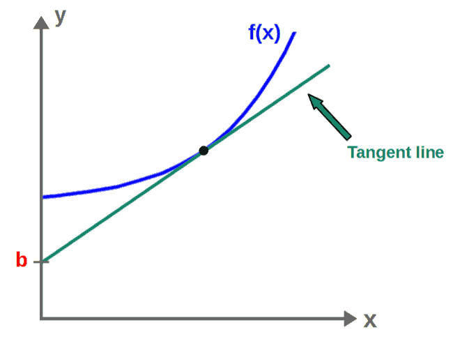
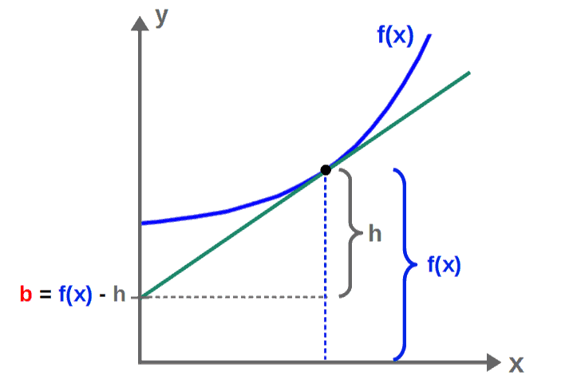
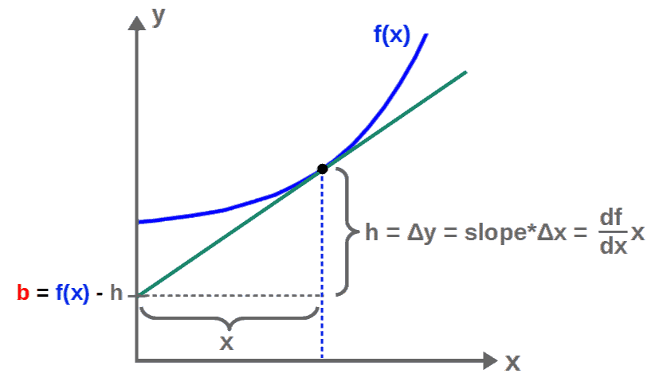

# Legendre Transformations For Dummies: Intuition & Examples

> Why the Lagrangian and the Hamiltonian are related by a Legendre transform — and what that means physically.

*Originally published at [profoundphysics.com](https://profoundphysics.com/legendre-transformations-for-dummies-intuition-and-examples/).*

---

If you’ve studied thermodynamics or Hamiltonian mechanics, you’ve probably encountered the Legendre transformation at some point. The Legendre transformation is often presented as just a mathematical tool, but why is it actually used?

**The Legendre transformation is used to transform a function to another function of a different variable that contains the same information as the original function. In physics, the Legendre transformation is used to switch between different thermodynamic variables or to convert a Lagrangian into a Hamiltonian.**

So, the Legendre transformation is really just a way to represent the information of a function in a different, sometimes more useful or more convenient, way.

In this article, we’ll go over exactly what the Legendre transformation means, the **geometry** behind it, how it is used in practice as well as some examples of how it can be applied to **physics**.

## Legendre Transformations Intuitively (+ Derivation)

Let’s begin by discussing what exactly the Legendre transformation does for a function of a single variable, f(x). This can be generalized quite easily once we actually understand what is going on.

Simply put, **the Legendre transformation takes a function, f(x), and transforms it to a new function f\* (the Legendre transform of f), which is now a function of the derivative of the original function, df/dx**:

$$f\left(x\right)\ \Rightarrow\ f^{\ast}\left(\frac{df}{dx}\right)$$

The actual value of this new function f\* is going to be the **y-interception point of the tangent line of f at any point**, b:

$$f^{\ast}\left(\frac{df}{dx}\right)=-b$$

By convention, we put a minus sign here, which really doesn’t make any difference.

This may *seem* very random and arbitrary, however, it’s far from it.

The reason for this is that generally speaking, we can reconstruct any function f(x), with some restriction, by **just knowing its tangent line at each point on its graph**.

You can intuitively understand why; if you were to plot the tangent lines of a function at every point, they would essentially trace out the graph of the function completely.

Describing the tangent line of a function, on the other hand, requires two pieces of information; the slope of the line at each point, given by the value of df/dx, and the y-interception of the line at each point, b.

Therefore, we can encode *all* the information of a function f(x) into just these two values and this is indeed *exactly* what the Legendre transformation does; **generates a new function from df/dx and b**.

The important thing about this is that the Legendre transformation of a function then contains exactly the same information as the original function, just “presented” in a different way. This is why it’s useful in the first place.

Now, the actual **formula for calculating the Legendre transformation of a function** is given by:

If you actually just start plugging in some function f(x) into this formula, you’ll get another function of x as a result, which sort of defeats the purpose of the Legendre transform; to obtain a function of a new variable. I’ll show you how to fix this “issue” soon (this also has some very interesting consequences in Hamiltonian mechanics, which I’ll talk about later).

Essentially, the thing on the right-hand side is just the *y-interception point of the tangent line*. You’ll find a step-by-step derivation as well as the geometry behind this below.

Derivation and Geometry of the Legendre Transformation

To derive the formula for the Legendre transformation, we need to essentially find the value of the y-interception point of the tangent line at each point on the graph of the original function.

We’re specifically interested in finding the value of this y-interception point b here. Now, the slope of this tangent line is just going to be the derivative of this function, slope=df/dx.

We can also do a little geometry here. The value of b here is just the difference of the value of the function as well as this “height” h in the following picture:

Now, what is the value of this “h”? Well, it’s just the change in the y-coordinate, Δy, of this tangent line between x=0 and the x-value of this point we’re interested in.

The Δy, on the other hand, is just the slope of the tangent line multiplied by the change in the x-coordinate, Δx, which is nothing but the x-coordinate of this point here.

So, this y-interception point, b, is then given by:

$$b=f-\frac{df}{dx}x$$

The Legendre transformation formula is then:

$$f^{\ast}\left(\frac{df}{dx}\right)=-b=\frac{df}{dx}x-f$$

## How To Calculate a Legendre Transformation (Step-By-Step)

The Legendre transformation of a function f(x) is calculated by the following steps:

1. **Define the function f(x) you want to take the Legendre transformation of**.
2. **Calculate p=df/dx.**
3. **Solve for x(p) from the equation p=df/dx**.
4. **Find f(p) by plugging x=x(p) into the original function f(x)**.
5. **Plug in all of the above results into the Legendre transformation formula f\*(p)=px(p)-f(p)**.

Note that we defined p=df/dx in the above steps simply as a shorthand notation.

Also, perhaps the most important steps given above are #3 and #4.

This is because these steps allow us to express the Legendre transformation f\* **completely in terms of the variable p** (or df/dx) instead of the variable x, which is pretty much the whole point of the transformation.

In short, the process of taking a Legendre transformation could be stated as simply as multiplying of the “old” variable (in this case x) with the “new” variable (in this case p=df/dx) and subtracting the “old” function (in this case f).

This way of stating it might be useful for understanding the Legendre transformation in the context of classical mechanics or thermodynamics.

Anyway, below you’ll find several **examples of how to actually calculate a Legendre transformation** before we look at some physics applications of it.

Examples: How To Calculate Legendre Transformations of Functions

Let’s begin with a simple function f(x)=x2. Following the steps given above, we first calculate p:

$$p=\frac{df}{dx}=2x$$

From this, we then solve for x(p):

$$p=2x\ \ \Rightarrow\ \ x\left(p\right)=\frac{p}{2}$$

Then f(p) can be obtained by just plugging this into f(x):

$$f\left(x\right)=x^2\ \ \Rightarrow\ \ f\left(p\right)=\left(\frac{p}{2}\right)^2=\frac{p^2}{4}$$

The Legendre transformation of f(x)=x2 is then given by:

$$f^{\ast}\left(p\right)=px\left(p\right)-f\left(p\right)=p\frac{p}{2}-\frac{p^2}{4}=\frac{p^2}{4}$$

Let’s do another example, this time for the function f(x)=ex. Again, following the steps, we first calculate p and solve for x(p):

$$p=\frac{df}{dx}=e^x\ \ \Rightarrow\ \ x\left(p\right)=\ln p$$

Then, we find f(p):

$$f\left(x\right)=e^x\ \ \Rightarrow\ \ f\left(p\right)=e^{\ln p}=p$$

The Legendre transformation of f(x)=ex is then:

$$f^{\ast}\left(p\right)=px\left(p\right)-f\left(p\right)=p\ln p-p=p\left(\ln p-1\right)$$

Hopefully you see the logic here. These Legendre transformations are not very difficult to calculate, given that we can easily invert the relation p=df/dx.

## Legendre Transformations In Classical Mechanics

Legendre transformations are often encountered in classical mechanics, but how exactly are they used for that?

**In classical mechanics, the Legendre transformation is used to transform the Lagrangian of a system to the Hamiltonian of a system, which represents total energy. Mathematically, this is done by changing variables from generalized velocities in the Lagrangian to generalized momenta.**

Now, the Lagrangian in classical mechanics is a function of (generalized) position and velocities, while the Hamiltonian is a function of position and momenta:

$$L=L\left(q{,}\ \dot{q}\right)\ {,}\ \ H=H\left(q{,}\ p\right)$$

The Hamiltonian is obtained from the Lagrangian by changing the velocity variable (q-dot) to the momentum variable, which is defined as:

$$p=\frac{\partial L}{\partial \dot q}$$

If you don’t know where this definition comes from, I’d highly recommend checking out my article **[Lagrangian Mechanics For Dummies: An Intuitive Introduction](https://profoundphysics.com/lagrangian-mechanics-for-beginners/)**.

Anyway, this variable switch can is done using the Legendre transformation on **one of the variables in the Lagrangian** (the velocity), completely analogously to how the Legendre transformation changed the variable x in f(x) to p=df/dx in f\*(p).

In other words, **the Hamiltonian is precisely the Legendre transformation of the Lagrangian**:

$$L\left(q{,}\ \dot{q}\right)\ \ \Rightarrow\ \ L^{\ast}\left(q{,}\ p\right)=H\left(q{,}\ p\right)\ {,}\ \ \ p=\frac{\partial L}{\partial\dot{q}}$$

Again, since we’re only doing the transformation for one of the variables in the Lagrangian, this is completely analogous to the single-variable case:

$$f\left(x\right)\ \ \Rightarrow\ \ f^{\ast}\left(p\right)\ {,}\ \ p=\frac{df}{dx}$$

If you’re interested in how exactly this Legendre transformation is done, you can check out [this article on Hamiltonian mechanics](https://profoundphysics.com/hamiltonian-mechanics-for-dummies/), which **derives the formula for the Hamiltonian by Legendre transforming the Lagrangian**.

The result from this is the formula (notice the similarity of this to the Legendre transformation formula in the single-variable case):

$$H\left(q_i{,}\ p_i\right)=\sum_i^{ }p_i\dot{q}_i-L$$

The calculation of this (link above) also highlights **how the Legendre transformation works for multivariable functions**; it’s exactly the same as for a single-variable function (apart from using a partial derivative) if we keep all the other variables the same except for one.

## Legendre Transformations In Thermodynamics

One of the most important and likely also the most common applications of the Legendre transformation is for thermodynamics.

**In thermodynamics, the Legendre transformation is used to transform the internal energy of a system into various potentials that are functions of different thermodynamic variables. This is often useful in cases where some thermodynamic variables can be physically controlled more easily than others.**

You’ll find an example of how this is done below.

The example also illustrates quite well the application of the Legendre transformation for multivariable functions.

Example: Enthalpy as The Legendre Transformation of Internal Energy

In certain thermodynamic systems, we may have for example, a gas with its entropy and volume changing. In this case, the internal energy (U) of the gas would be a function of the entropy (S) and the volume (V):

$$U=U\left(S{,}V\right)$$

We can perform a Legendre transformation to this by switching variables from the volume V to a new variable ∂U/∂V, while keeping the entropy fixed. In other words:

$$U\left(S{,}\ V\right)\ \ \Rightarrow\ \ U^{\ast}\left(S{,}\ \frac{\partial U}{\partial V}\right)$$

The formula for the Legendre transformation U\*, in this case, would be:

$$U^{\ast}\left(S{,}\ \frac{\partial U}{\partial V}\right)=\frac{\partial U}{\partial V}V-U$$

Notice that this is pretty much exactly the same as the single-variable Legendre transformation; product of the “new” and “old” variables minus the “old” function.

Now, if you’re familiar with thermodynamics, this partial derivative ∂U/∂V is defined as the negative of pressure P (if entropy stays fixed). So, we would then have:

$$U^{\ast}\left(S{,}\ P\right)=-PV-U$$

By definition, this is the negative of the enthalpy H as a function of entropy and pressure:

$$U^{\ast}\left(S{,}\ P\right)=-H\left(S{,}\ P\right)=PV+U$$

If you were to actually calculate this, you’d have to first find P=-∂U/∂V and use that to find V(S,P) as well as U(S,P) and then plug those into H=PV+U. This is exactly the same logic as we used in the single-variable case with the whole “finding x(p) from p=df/dx” -business.

It’s also worth noting that there also several other thermodynamic potential functions (such as the Gibbs and Helmholtz free energies G(T,P) and F(T,V)) that can be obtained as Legendre transformations of the internal energy as well, just for different variables.

If you’ve enjoyed the content covered in this article, you’ll *really* enjoy my **[Advanced Math For Physics: A Complete Self-Study Course](https://profoundphysicscourses.com/advanced-math/)** (link to the course homepage). It covers A LOT of the most important mathematical tools needed to really understand **advanced physics** through **lessons, visuals, step-by-step examples** as well as **practice problems**. The course is designed in a way that **anyone with basic high school level math** will be able to take it, even though most of the topics are WAY beyond high school level.

---

*← [Back to the full archive](../index.html)*
