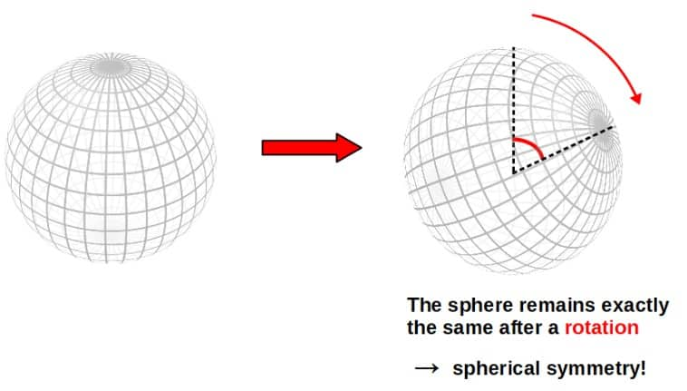
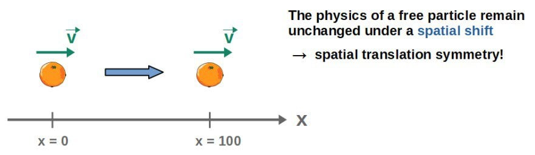
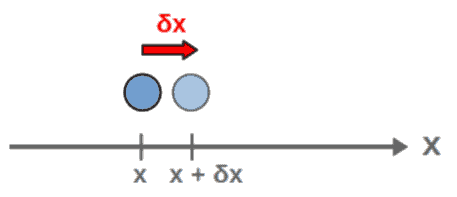
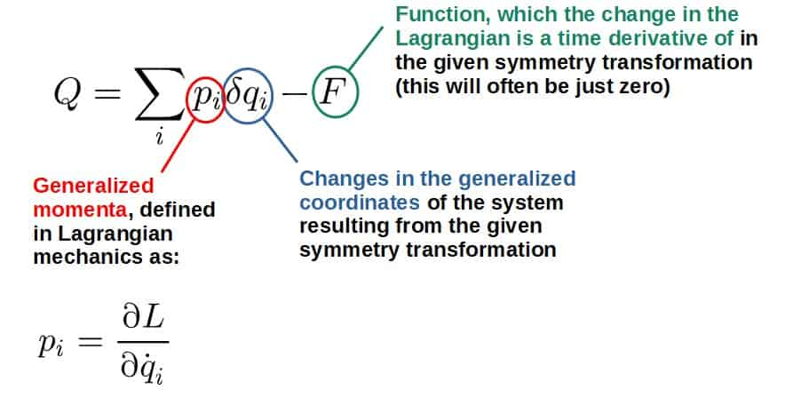
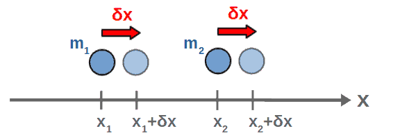
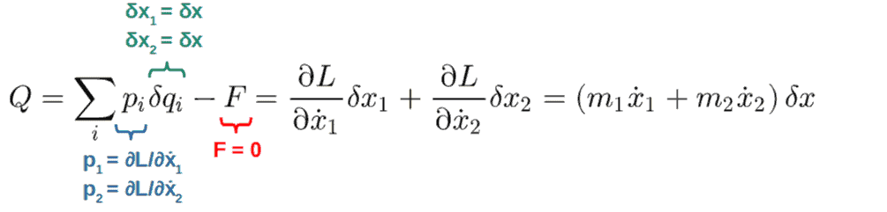
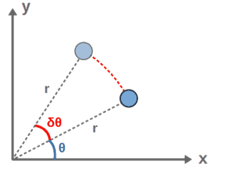
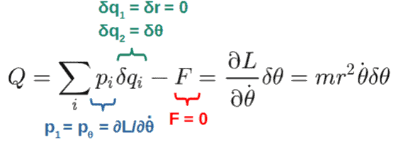
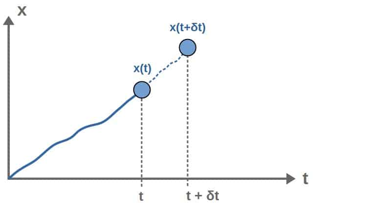
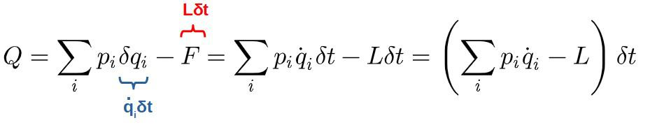

# Noether’s Theorem: A Complete Guide With Examples

> Often called the most important theorem in modern physics — symmetry $\Leftrightarrow$ conservation. The deepest reason energy, momentum, and charge are conserved.

*Originally published at [profoundphysics.com](https://profoundphysics.com/noethers-theorem-a-complete-guide/).*

---

Noether’s theorem, named after the German mathematician Emmy Noether, is often said to be one of the most important results in modern physics. But what is this theorem actually about?

**Noether’s theorem is the statement that for every continuous symmetry in a physical system, there exists a conservation law. A symmetry of a physical system, in the context of Noether’s theorem, means a transformation to the system that leaves its equations of motion unchanged.**

If this doesn’t tell you much yet, don’t worry. By reading this article, you’ll learn everything you need to understand Noether’s theorem.

In this article, we’ll explore why Noether’s theorem is important, what a symmetry actually means in physics and how to put everything in mathematical terms. At the end, we’ll also dive into some examples.

| Key Takeaways: |
| --- |
| Noether’s theorem can be described by both Lagrangian and Hamiltonian mechanics, which both have their own advantages. |
| In Lagrangian mechanics, a symmetry of a physical system is any transformation that changes the Lagrangian of the system only by an arbitrary time derivative:  $$\delta L=\frac{dF}{dt}$$  If a transformation satisfies this condition, it is a symmetry of the system and by Noether’s theorem, leads to a conservation law of the form:  $$\frac{d}{dt}\left(\sum_i^{ }p_i\delta q_i-F\right)=0$$ |
| In Hamiltonian mechanics, transformations are characterized by their generators – phase space functions Q. If the generator of a transformation has a vanishing Poisson bracket with the Hamiltonian, {H,Q}=0, the transformation is a symmetry and by Noether’s theorem, results in the generator of the symmetry transformation itself being conserved. |
| Examples of Noether’s theorem include spatial translation symmetry leading to conservation of linear momentum, rotational symmetry leading to conservation of angular momentum and time translation symmetry leading to conservation of energy. |
| Noether’s theorem can easily be formulated in field theories, both classical and quantum field, using Lagrangian mechanics. |

If you want to learn more about everything mentioned above, just keep reading!

Now, since Noether’s theorem is naturally formulated in the language of Lagrangian mechanics, it will definitely help if you have at least some understanding of what Lagrangian mechanics is about and how it works.

If you don’t, I’d recommend first reading my [complete introduction to Lagrangian mechanics](https://profoundphysics.com/lagrangian-mechanics-for-beginners/). That should give you everything you need to know about Lagrangian mechanics. You can also get my **full book on Lagrangian mechanics** (found [here](https://profoundphysicscourses.com/lagrangian-mechanics-book/)) if you’re really serious on learning it.

## Why Is Noether’s Theorem Important?

Before we dive into what Noether’s theorem actually is and how it works, it’s important to understand why we should even care about it in the first place.

In practical terms, here are just a few reasons why Noether’s theorem is so important:

- Noether’s tells us where fundamental conservation laws, such as conservation of momentum and energy, actually come from.
- Noether’s theorem also helps us find what symmetries a physical system has, given that we know a particular conservation law exists.
- Noether’s theorem provides a structured way of constructing new theories of physics – in practice, it provides a guiding light for building Lagrangians for different theories, given that we want a certain conservation law to be a part of the theory.
- Noether’s theorem gives us a straightforward and quantitative way to identify conserved quantities in practice from the Lagrangian of a system.

In simple terms, Noether’s theorem is a general statement about the **interplay between symmetries and conservation laws**.

Conservation laws, on the other hand, are a fundamental feature of all physical theories we know of. Therefore, Noether’s theorem is really a part of every theory in modern physics in some way.

Below is a table showing some of the conservation laws predicted by Noether’s theorem and which symmetry they correspond to.

| Symmetry | Conservation Law |
| --- | --- |
| Spatial translation symmetry | Conservation of linear momentum |
| Rotational symmetry | Conservation of angular momentum |
| Time translation symmetry | Conservation of energy |
| U(1) symmetry | Conservation of electric charge |

Examples of symmetries and the corresponding conservation laws, according to Noether’s theorem.

Okay, so, Noether’s theorem is important when trying to understand conservation laws in physics. but why are conservation laws so important in the first place?

Well, conservation laws are pretty much everything in physics – they dictate the structure of a physical theory, the behavior of particles and fields and also help us solve problems in practice.

If you’ve done physics problems in school, you might know that for example, invoking conservation of energy often gives a much easier way to solve a problem – it can give you an instant shortcut to the answer of the problem.

As a more advanced example, conservation laws also dictate how particles and quantum fields behave in quantum field theories – they tell us how particle scattering processes work and how particles and fields are just two sides of the same coin.

## Prerequisites For Noether’s Theorem

It’s worth mentioning that Noether’s theorem, in its full detail, is quite a sophisticated topic. To get a full, deep understanding of it, there are some topics you definitely have to have a solid understanding of first.

By reading this article, you will certainly be able to get a great understanding of what Noether’s theorem is about. However, I still want to give you the bigger picture of everything that goes behind understanding Noether’s theorem.

**The prerequisites for understanding Noether’s theorem fully** are outlined in the table below. I’ve also included some recommendations for where you can learn more about each topics, but of course, these are not the only good resources.

| Prerequisite | Description | Relation to Noether’s Theorem | Resource Recommendations |
| --- | --- | --- | --- |
| Lagrangian Mechanics | A formulation of classical mechanics, where the central idea is that all the dynamics of a system are described by a function called the Lagrangian, expressed in terms of generalized coordinates. | Noether’s theorem can be naturally described using Lagrangian mechanics. In particular, the symmetries in a system can be straightforwardly analyzed using the Lagrangian. This is also why Noether’s theorem is often first introduced in the context of Lagrangian mechanics. | **[Lagrangian Mechanics For The Non-Physicist](https://profoundphysicscourses.com/lagrangian-mechanics-book/)** (link to the book page) – this book will teach you Lagrangian mechanics in the context of applying it to modern physics and a key part of this is Noether’s theorem, which the course covers in detail. |
| Hamiltonian Mechanics | Another formulation of classical mechanics that ultimately gives the same predictions as Lagrangian mechanics. However, Hamiltonian mechanics is a bit more abstract and uses a somewhat different mathematical formalism, giving it some advantages over the Lagrangian formulation. | Noether’s theorem can also be described using Hamiltonian mechanics, although the formalism is slightly different. There are some unique perspectives on Noether’s theorem that can only be found in Hamiltonian mechanics. | **[Hamiltonian Mechanics For Dummies](https://profoundphysics.com/hamiltonian-mechanics-for-dummies/)** (link to the article) – a free internet article that provides a solid introduction to the fundamentals of Hamiltonian mechanics and gives you the big picture behind it. |
| Calculus of Variations | A field of mathematics that essentially generalizes ordinary calculus to more complicated situations. The key goal of calculus of variations is to optimize so-called functionals – this is the basic mathematical idea that Lagrangian mechanics is also based on. | Fundamentally, calculus of variations is the mathematical framework all of Noether’s theorem is based on. Deriving Noether’s theorem therefore requires a solid understanding of this area of math. | **[Advanced Math For Physics: A Complete Self-Study Course](https://profoundphysicscourses.com/advanced-math-for-physics-2/)** (link to the course page) – the goal of this course is to teach you the math you need to specifically understanding physics at a deep level. A key area covered in this course is exactly calculus of variations. |
| Group Theory | Group theory is the mathematical language for describing symmetries, specifically. Really, all modern theories of physics rely on the idea of symmetries and understanding group theory is a crucial part of understanding this aspect of physics. Group theory is the bridge between symmetries in physics and the mathematical tools needed to describe them. | Because Noether’s theorem is deeply based on the idea of symmetries, it’s only natural that group theory would be extremely important to fully understand it. Group theory is particularly important for applying Noether’s theorem in field theories (both classical and quantum). | **[Physics from Symmetry by Jakob Schwichtenberg](https://amzn.to/3WHYGnA)** (link to the book page) – an introductory book that covers group theory in a highly physics-focused way. The book also contains quite a lot of stuff on field theory and works as a great introduction to that too. |
| Field Theory | A branch of physics used to describe fields (an example being the electromagnetic field) and how they interact. Field theory is also what we use in quantum field theory – one of the most accurate theories in all of physics. | Noether’s theorem naturally generalizes to field theory and this allows us to analyze symmetries and conservation laws for fields. For example, the field theory version Noether’s theorem allows us to understand where the conservation of electric charge fundamentally comes from. | **[Field Theory For The Non-Physicist](https://www.amazon.com/dp/B0CN7HQWCM)** (link to the book page) – from this book, you’ll learn field theory on a very deep level, with the topics ranging from the very basics to advanced topics like field-particle interactions, gauge theory and even the Higgs mechanism. |

### Can Noether’s Theorem Be Explained Without Lagrangian Mechanics?

Lagrangian mechanics might be the most crucial part in understanding Noether’s theorem. However, is it really necessary?

In practice, Noether’s theorem is always used either in the context of Lagrangian mechanics or Hamiltonian mechanics.

These formulations are the natural language to understand Noether’s theorem in and they provide a way for us to make quantitative calculations regarding Noether’s theorem.

So yes, **Noether’s theorem can be completely explained without Lagrangian mechanics, by using Hamiltonian mechanics instead**.

In fact, Noether’s theorem actually does have some interesting features that only appear in the Hamiltonian formulation. We’ll look at these later in this article.

Technically, it is also possible to understand Noether’s theorem without ever mentioning Lagrangian or Hamiltonian mechanics – Noether’s theorem just says that for every symmetry, there exists a conservation law.

However, without Lagrangian mechanics or Hamiltonian mechanics, we cannot really do anything quantitative – we cannot precisely define a symmetry in relation to Noether’s theorem or find out exactly what conserved quantities we get from these symmetries.

So, for actually using Noether’s theorem in practice, we use either Lagrangian mechanics or Hamiltonian mechanics.

In my opinion, it’s a bit easier to first understand Noether’s theorem in the Lagrangian formulation, so that’s what we’ll do in this article. We will then look at Noether’s theorem in the Hamiltonian formulation later.

**Quick tip:** For building a deep understanding of everything related to Lagrangian mechanics and Noether’s theorem, I’d highly recommend checking out the book **[Lagrangian Mechanics For The Non-Physicist](https://profoundphysicscourses.com/lagrangian-mechanics-book/)** (link to the book description page). It will teach you everything you need to know through a simple, intuitive and practical approach.

### Defining Conservation Laws

Before we can get started, we need to make it clear what a conservation law even means in the first place.

Simply put, when we have a **conserved quantity** in a system, it means that the value of that quantity stays constant – it doesn’t change with time.

Mathematically, we say that if a quantity Q is conserved, its time derivative is zero:

$$\frac{dQ}{dt}=0$$

This defines a **conservation law** for the quantity Q.

In classical mechanics, we have three big conservation laws:

- **Conservation of linear momentum**, dp/dt=0.
- **Conservation of angular momentum**, dL/dt=0.
- **Conservation of energy**, dE/dt=0.

Now, where do these conservation law come from? Well, we can find the answer from Noether’s theorem! That is, in Lagrangian and Hamiltonian mechanics at least.

Newtonian mechanics is a bit different. These conservation laws are, in fact, already present in Newtonian mechanics and they are already built into Newton’s laws.

However, the crucial difference is that **Newtonian mechanics cannot explain where these conservation laws actually come from** – it only defines under which conditions such laws can exist (such as no net external force for momentum conservation).

Lagrangian mechanics and Noether’s theorem, on the other hand, give a fundamental reason for where conservation laws come from – they come from **symmetries**.

This is also the reason why Noether’s theorem is usually described in the Lagrangian formulation and not with Newton’s laws.

Now that we’ve got the definition of a conservation law under our belt, the next puzzle piece is going to be defining what we actually mean by symmetries in relation to Noether’s theorem.

## What Are Symmetries In Physics?

Symmetries are the central idea behind Noether’s theorem, however, personally when I first learnt about Noether’s theorem, it wasn’t clear to me what a symmetry means in physics, specifically.

**In physics, a symmetry of a physical system is any transformation that leaves a system physically unchanged and is mathematically defined as a transformation that only changes the Lagrangian up to a total time derivative. Examples include rotations of a system under a central force field.**

That’s pretty much the idea of a symmetry in physics condensed into a couple sentences.

However, this might not tell you much yet, so let’s go into a bit more detail.

The idea of symmetry in physics is a bit different than what you may intuitively picture a symmetry as (for example, a geometric object “looking” the same on both sides).

When we talk about symmetries of physical systems, we always mean *transformations* of the system. A transformation, intuitively, is something we can do to a system to change it in some way – for example, we could move a system in space by 5 meters to the right.

In most cases, a transformation will certainly change a physical system.

However, there are special cases where the system is physically unchanged by a specific transformation and these transformations are what we call symmetries of the system.

So, **a symmetry in physics is really a transformation of some kind** and always has to be associated with one.

We’ll put this into a more precise definition soon but first, let’s take a look at some examples for any of this to make sense.

### Examples of Symmetries

Perhaps the simplest example of a symmetry would be the rotation of a sphere. A rotation is a transformation of the sphere that leaves it completely unchanged – therefore, it is a symmetry of the sphere (we call this spherical symmetry).

 

Note that the coordinate grid I’ve drawn here should not be thought of as a part of the sphere itself. It’s just to make the illustration “look” nicer.

Now, this isn’t exactly a physical symmetry, because a sphere by itself isn’t a dynamical physical system. However, it should give you a nice intuitive picture of what we mean by a symmetry.

A more physically relevant example would be a spatial translation of a free particle (a particle that isn’t affected by any forces).

This is a symmetry of the single-particle system, since moving the particle in space by a constant amount does not actually change the physics of the particle in any way – since it’s a free particle, its motion will be exactly the same at all points in space and it makes no difference whether we look at the particle at x=0 or at x=100.

However, the crucial part here is that this is a free particle.

If there were forces present that vary from point to point in space, then moving the particle to a different location would certainly change its motion, since there would be a different force acting on the particle at the new location – spatial translations would not be a symmetry of the system anymore.

As we’ll see later, spatial translations being a symmetry of a system turn out to correspond to the conservation of linear momentum.

Before moving forward, here are a couple more examples of symmetries in physics:

- **Rotational symmetry**: The physics of a system remain invariant under rotations about some axis (or axes). According to Noether’s theorem, this turns out to correspond to the conservation of angular momentum.
- **Time translation symmetry**: Shifting a system forward in time leaves the physics of the system unchanged. In other words, the system behaves exactly the same whether we look at it right now, two hours later or at any other point in time. An example of where time translations are NOT a symmetry are systems where there is an external force that varies as a function of time. According to Noether’s theorem, this corresponds to the conservation of energy.

### How Do We Define Symmetries Mathematically?

The next question is, how do we put the idea of symmetry into a precise, mathematical definition?

Well, I’ll just tell you the answer first. Here it is:

Mathematically, a symmetry of a physical system is any transformation that only changes the Lagrangian of the system up to a total time derivative, that is:  
$$\delta L=\frac{dF}{dt}$$

Let’s try to understand where this definition comes from.

First, we need to think about what we even mean by the “physics of a system”. Well, it’s pretty simple – the physics of a system is captured by the **equations of motion** of the system.

Therefore, one way to define a symmetry would be a transformation that leaves the equations of motion of a system unchanged.

However, the most practical way to define a symmetry would be at the level of the **Lagrangian of a system** – as you may know from Lagrangian mechanics, all the dynamics of a system is captured by the Lagrangian.

If you don’t know what I’m talking about, I’d really recommend reading [this introduction to Lagrangian mechanics first](https://profoundphysics.com/lagrangian-mechanics-for-beginners/). If you want to go even deeper, you can also check out this full book on Lagrangian mechanics found [here](https://profoundphysicscourses.com/lagrangian-mechanics-book/).

Therefore, we could define a symmetry as a transformation that leaves the Lagrangian unchanged. However, that’s a bit too strict of a condition.

The reason for this is that **the Lagrangian of a system is not unique** – it never is. That’s because we can always add a total time derivative of some arbitrary function to it without changing the actual equations of motion at all.

Why can we add a total time derivative to the Lagrangian?

In general, it’s a well-known fact that the following two Lagrangians are equivalent – they describe the same system and lead to the exact same equations of motion:

$$L\ \ \Leftrightarrow\ \ L'=L+\frac{dF}{dt}$$

So, the Lagrangian of a system is not unique. But why is this?

The simple answer is because the Lagrangian is *not* the fundamental physical object describing a system, the action is. And, the action is defined as in integral over time of the Lagrangian.

Therefore, if we add a time derivative, dF/dt to the Lagrangian, it will only result in “boundary terms” in the action as follows:

$$S=\int_{t_1}^{t_2}Ldt\\\Rightarrow\ \ S'=\int_{t_1}^{t_2}\left(L+\frac{dF}{dt}\right)dt\\\Rightarrow\ \ S'=\int_{t_1}^{t_2}Ldt+\int_{t_1}^{t_2}\frac{dF}{dt}dt\\\Rightarrow\ \ S'=S+F\left(t_2\right)-F\left(t_1\right)$$

The important thing is that these boundary terms, F(t2) and F(t1) are constants – they are just the values of the arbitrary function F at the start and end points of the path.

Because these are constant, they have no effect on the equations of motion, the Euler-Lagrange equations – remember, the Euler-Lagrange equations are obtained as the paths of stationary action in Lagrangian mechanics and constant terms in the action have no effect on the stationary paths.

The bottom line is that we can always add a total time derivative to the Lagrangian of a system without changing any of the physics of the system at all. We must, therefore, also allow for this possibility in our definition of a symmetry.

Therefore, **any transformation that only has the effect of changing the Lagrangian of a system only up to a total time derivative will leave the equations of motion completely unchanged** – it’s a symmetry, that is!

So, that’s where the mathematical definition of a symmetry in Lagrangian mechanics comes from. The definition is slightly different in field theory (but similar). We’ll look at this later.

Before we move forward, it might be helpful to look at some simple examples to see how the process of identifying symmetries works in practice. You’ll find these below.

Some examples of transformations and symmetries

Let’s consider the simplest possible case first; a free particle in one dimension (the x-direction here). It is described by the following Lagrangian:

$$L=\frac{1}{2}m\dot{x}^2$$

The transformation we’ll consider is a spatial translation where we essentially move the particle in space by some small (constant) amount δx:

This transformation moves the particle from some arbitrary location x to a new location x+δx. It’s important to note that this shift δx is taken to be constant everywhere and also infinitesimal (we’ll talk more about why that is in the next section).

The velocity of the particle is originally dx/dt (x with a dot above it in the above Lagrangian) and after this translation, its new velocity is d(x+δx)/dt=dx/dt since δx is a constant, so d(δx)/dt=0.

We then have the variation in the particle’s coordinate as just δx and the variation in its velocity as d(δx)/dt=δ(dx/dt)=0. We now use these to calculate how the Lagrangian changes in this transformation. This is given by the multivariable chain rule as:

$$\delta L=\frac{\partial L}{\partial x}\delta x+\frac{\partial L}{\partial\dot{x}}\delta\dot{x}$$

Plugging in our Lagrangian (and noting that the second term is zero, since the change in the velocity is zero), we get:

$$\delta L=\frac{\partial}{\partial x}\left(\frac{1}{2}m\dot{x}^2\right)\delta x=0$$

What does this tell us? Well, it says that the Lagrangian does not change in this transformation – a spatial translation.

This means that a spatial translation is indeed a symmetry of this free particle system (remember our condition for a symmetry – δL=dF/dt – so, in this case, we’d have F=constant or F=0). As we’ll see soon, this turns out to correspond to the linear momentum of the particle being conserved, according to Noether’s theorem.

On the other hand, we could consider the same transformation (with δx and δ(dx/dt)=0) but instead for a Lagrangian of a particle under some position-dependent potential V(x):

$$L=\frac{1}{2}m\dot{x}^2-V\left(x\right)$$

The change in the Lagrangian in this transformation would now be:

$$\delta L=\frac{\partial L}{\partial x}\delta x+\frac{\partial L}{\partial\dot{x}}\delta\dot{x}=-\frac{\partial V\left(x\right)}{\partial x}\delta x$$

Since we cannot write this in the form δL=dF/dt, this is not a symmetry of the system anymore. So, the effect of a position-dependent potential – in other words, a force – is that spatial translations are not symmetries anymore. As we’ll see soon, this also means that the linear momentum in the system is not conserved, at least not in the general case.

Now, we’ll look at more examples soon, but for now, the point was to just show you how our above mathematical definition for a symmetry works in practice.

This also shows you quite nicely the general procedure in which we look at symmetries in Lagrangian mechanics; we specify a transformation, then calculate how the Lagrangian changes using the chain rule and determine whether we have a symmetry or not based on whether we can write the change as δL=dF/dt – our mathematical condition for a symmetry.

## Noether’s Theorem Mathematically

As mentioned earlier, Noether’s theorem states that for every symmetry in a physical system, there will be a corresponding conservation law.

With our above definition of a symmetry, we can now put this into precise mathematical terms. Here it is:

For every symmetry in a physical system, meaning a transformation that changes the Lagrangian of the system only by δL=dF/dt, there will be an associated conserved quantity of the form:  
$$Q=\sum_i^{ }p_i\delta q_i-F$$

This is **Noether’s theorem in Lagrangian mechanics** in a nutshell. It essentially includes everything you need to know about it.

Now, let’s unpack it. Noether’s theorem simply says that whenever we find a particular transformation to be a symmetry of a system – a symmetry as defined previously – then we find a conserved quantity Q of the form shown above.

The quantity Q here being conserved means that dQ/dt=0 (we’ll prove this soon). As far as the expression for the conserved quantity Q, here is what each of the terms mean:

So, the procedure in which Noether’s theorem results in conserved quantities is pretty simple:

1. We do a transformation and specify how each coordinate changes in this transformation. These are the δqi‘s.
2. Based on these, we calculate how the Lagrangian changes in this transformation simply using the chain rule of calculus.
3. If the Lagrangian changes by δL=dF/dt, the transformation is a symmetry of the system.
4. If step #3 is true, we are guaranteed to get a conserved quantity Q of the form shown above from Noether’s theorem.

That’s it. This is how Noether’s theorem works in the Lagrangian formulation.

Also, something that needs to be mentioned here is that Noether’s theorem deals with so-called **continuous symmetries**. These are symmetry transformations that can be built out of infinitesimally small transformations.

For example, we could perform any spatial translation by building it out of an arbitrarily large amount of infinitesimal translations, which means that spatial translations are generally continuous and Noether’s theorem is well-defined with them.

For now, everything mentioned here might sound pretty abstract, so looking at various examples should help make it more clear.

Before we get to those, however, we need to answer the question of where Noether’s theorem even comes from and also why the conserved quantity has the form of Q above.

### Step-By-Step Proof of Noether’s Theorem

Proving Noether’s theorem is actually quite simple, we just need the mathematical definition of a symmetry from earlier. This is why we spent all that time precisely defining what we mean by a symmetry earlier.

You’ll find the full proof of Noether’s theorem and the derivation of the conserved quantity Q down below.

Proof and derivation of Noether’s theorem

First, let’s just recall our mathematical condition for a symmetry – a transformation is a symmetry of a system, whenever the Lagrangian of the system only changes as (with F being an arbitrary function of the generalized coordinates, their time derivatives and time):

$$\delta L=\frac{dF}{dt}$$

We can calculate the left-hand side, δL, generally using the chain rule as:

$$\delta L=\sum_i^{ }\left(\frac{\partial L}{\partial q_i}\delta q_i+\frac{\partial L}{\partial\dot{q}_i}\delta\dot{q}_i\right)$$

This is a standard expression you’ll come across in calculus of variations, especially. If you’re not familiar with this, I’d recommend checking out [this introductory article on calculus of variations](https://profoundphysics.com/calculus-of-variations-for-beginners/).

We’ll now make use of some definitions. First, the generalized momentum pi is defined as:

$$p_i=\frac{\partial L}{\partial\dot{q}_i}$$

Secondly, the time derivative of the generalized momentum is given by the Euler-Lagrange equation as:

$$\dot{p}_i=\frac{\partial L}{\partial q_i}$$

These are exactly what we have in our expression for δL above. So using these, we get:

$$\delta L=\sum_i^{ }\left(\frac{\partial L}{\partial q_i}\delta q_i+\frac{\partial L}{\partial\dot{q}_i}\delta\dot{q}_i\right)=\sum_i^{ }\left(\dot{p}_i\delta q_i+p_i\delta\dot{q}_i\right)$$

If you now look at this for a while, you might notice that we can write the thing inside the parentheses as a total time derivative of the form:

$$\delta L=\sum_i^{ }\frac{d}{dt}\left(p_i\delta q_i\right)=\frac{d}{dt}\left(\sum_i^{ }p_i\delta q_i\right)$$

This is now the left-hand side of our symmetry condition, δL=dF/dt. Plugging this in and rearranging some terms, we find:

$$\delta L=\frac{dF}{dt}\\\Rightarrow\ \ \frac{d}{dt}\left(\sum_i^{ }p_i\delta q_i\right)=\frac{dF}{dt}\\\Rightarrow\ \ \frac{d}{dt}\left(\sum_i^{ }p_i\delta q_i-F\right)=0$$

Notice what we have here; we have the time derivative of something being equal to zero – that’s exactly what we defined as a conservation law earlier! The thing inside the parentheses, the quantity Q, is therefore a conserved quantity:

$$Q=\sum_i^{ }p_i\delta q_i-F$$

So, we’ve derived the expression for the conserved quantity resulting from Noether’s theorem, but also proven Noether’s theorem itself – what we found here is that given a symmetry transformation in a system, we will find a corresponding conservation law.

## Examples & Applications of Noether’s Theorem

In this section, we’ll dive into a bunch of **examples of using Noether’s theorem**. This should really help put it all together and actually show you how everything we’ve talked about works in practice.

The framework we will use for identifying conservation laws from Noether’s theorem goes more or less as follows:

1. **Specify a Lagrangian and some transformation you want to analyze for a given system**.
2. **Identify how each generalized coordinate and its time derivative changes due to this transformation**. This means finding the infinitesimal variations δqi and δq̇i for each coordinate.
3. **Using these variations, calculate how the Lagrangian changes as a result of this transformation**. This can be done using the general formula from calculus of variations (essentially just the chain rule):

$$\delta L=\sum_i^{ }\left(\frac{\partial L}{\partial q_i}\delta q_i+\frac{\partial L}{\partial\dot{q}_i}\delta\dot{q}_i\right)$$

4. **If the expression for δL you obtain can be written as a total time derivative of some function** (so δL=dF/dt), **then the transformation is a symmetry of the system**! Note that this condition also includes δL=0 if F=0 or F=constant.
5. **If step #5 is true, Noether’s theorem gives you a conserved quantity of the form**:

$$Q=\sum_i^{ }p_i\delta q_i-F$$

Here, pi=∂L/∂q̇i.

### Conservation of Linear & Angular Momentum

Our first example is to look at how Noether’s theorem gives rise to both the **conservation of linear momentum** and the **conservation of angular momentum**.

The nice thing is that we can tackle both of these at the same time, thanks to the concept of **generalized momentum** in Lagrangian mechanics.

Now, according to Noether’s theorem, the conservation of both linear and angular momentum are due to translation symmetry – **spatial translation symmetry** for linear momentum and **rotational symmetry** (or angular translation symmetry) for angular momentum.

The nice thing in Lagrangian mechanics is that both of these are encoded in the notion of generalized coordinates – a generalized coordinate can be both a spatial coordinate and an angle, so we can analyze both at the same time, simply by analyzing an arbitrary generalized coordinate qi.

A translation in this generalized coordinate qi simply means that we shift the coordinate by an infinitesimal amount δqi (note; this shift should be taken as a constant). So, this transformation is given by qi → qi+δqi.

Since the translation δqi is a constant (the same shift everywhere), the change in the time derivative of this coordinate will be dqi/dt → d(qi+δqi)/dt=dqi/dt+d(δqi)/dt=dqi/dt, in other words, the time derivative of the coordinate does not change in this transformation.

We can then characterize the transformation by the changes in our coordinates and its time derivative as δqi and δq̇i. The variation in the Lagrangian is then given by the chain rule from earlier as:

$$\delta L=\sum_i^{ }\left(\frac{\partial L}{\partial q_i}\delta q_i+\frac{\partial L}{\partial\dot{q}_i}\delta\dot{q}_i\right)=\sum_i^{ }\frac{\partial L}{\partial q_i}\delta q_i$$

Here comes the important part – if this transformation is to be a symmetry, we must have δL=0. The only way for this to be true is if the Lagrangian is independent of the particular coordinate qi we are doing the transformation to (because this would give ∂L/∂qi=0 and therefore δL=0).

What this tells us is that if the Lagrangian is independent of a given coordinate, then translations of this coordinate are symmetries of the system. We call these **cyclic coordinates**, but more on those soon.

Then, according to Noether’s theorem, we will find a conserved quantity of the form (in this case, F=0):

$$Q=\sum_i^{ }p_i\delta q_i-F=\sum_i^{ }p_i\delta q_i$$

Note that since the δqi‘s here are constant, they essentially play no role in this conservation law – the conserved quantity here is really just the pi‘s, since δqi‘s are constant anyway.

But what is this quantity? Well, it’s essentially the total generalized momentum in the system!

So, we’ve found that **translation symmetry in a given generalized coordinate results in the conservation of generalized momentum** (the sum of generalized momenta associated with every coordinate that has this symmetry).

If this coordinate that has a symmetry associated with it happens to be a spatial coordinate (essentially, a coordinate with units of distance), then we find the associated conserved generalized momentum to be the linear momentum in the system.

On the other hand, if this coordinate is an angular coordinate, then the conserved generalized momentum would be angular momentum instead.

Now, this may sound a bit abstract, so looking at a specific example of a particular Lagrangian might make it more clear. You’ll find an example of this below.

Examples of linear and angular momentum conservation using Noether’s theorem

As an example, let’s consider a system of two free particles of masses m1 and m2 in one dimension. The coordinates of the particles are x1 and x2. This system is described by the following Lagrangian:

$$L=\frac{1}{2}m_1\dot{x}_1^2+\frac{1}{2}m_2\dot{x}_2^2$$

Let’s now consider a transformation to the coordinates of both particles (with both particles being translated the same amount δx), so:

$$x_1\ \rightarrow\ x_1+\delta x\\x_2\ \rightarrow\ x_2+\delta x$$

This means that the changes in the first particle’s coordinates are δx1=δx2=δx and the changes in the velocities are zero (δẋ1=0 and δẋ2=0).

This transformation is a symmetry of the system, which we can immediately see because the Lagrangian does not depend on either of the coordinates x1 and x2 explicitly. This means that a transformation to these coordinates is trivially a symmetry. We could also verify this by calculating the change in the Lagrangian as:

$$\delta L=\sum_i^{ }\left(\frac{\partial L}{\partial q_i}\delta q_i+\frac{\partial L}{\partial\dot{q}_i}\delta\dot{q}_i\right)=\frac{\partial L}{\partial x_1}\delta x_1+\frac{\partial L}{\partial x_2}\delta x_2+\frac{\partial L}{\partial\dot{x}_1}\delta\dot{x}_1+\frac{\partial L}{\partial\dot{x}_2}\delta\dot{x}_2=0$$

The conserved quantity we find is then, according to Noether’s theorem:

This is just the total linear momentum in the system – the sum of the momenta of both particles. This shows that a spatial translation indeed results in the conservation of linear momentum.

But what about angular momentum?

We’ll analyze that in a different system – consider a single free particle of mass m in two dimensions. We can describe it in polar coordinates with the following Lagrangian:

$$L=\frac{1}{2}m\left(\dot{r}^2+r^2\dot{\theta}^2\right)$$

Let’s then consider a rotation of the particle’s position about the origin. We can describe this mathematically by the following transformation:

$$r\ \rightarrow\ r\\\theta\ \rightarrow\ \theta+\delta\theta$$

This rotates the position of the particle by an infinitesimal angle δθ, but leaves its radial distance unchanged:

Since the Lagrangian doesn’t depend on the coordinate θ, we immediately know that this transformation is a symmetry. We could also verify that by calculating the change in the Lagrangian as (here, δr=0 and so are the changes in the time derivatives of r and θ):

$$\delta L=\sum_i^{ }\left(\frac{\partial L}{\partial q_i}\delta q_i+\frac{\partial L}{\partial\dot{q}_i}\delta\dot{q}_i\right)=\frac{\partial L}{\partial r}\delta r+\frac{\partial L}{\partial\theta}\delta\theta+\frac{\partial L}{\partial\dot{r}}\delta\dot{r}+\frac{\partial L}{\partial\dot{\theta}}\delta\dot{\theta}=0$$

The conserved quantity from Noether’s theorem is then:

This conserved quantity is the angular momentum of the particle, expressed in polar coordinates. In particular, it’s the z-component of the angular momentum (which is also the only non-zero angular momentum component of the particle).

So, from this example, we can see that if the system has a symmetry associated with a rotation or translation in an angular coordinate, then the conserved quantity arising from Noether’s theorem will be a component of angular momentum.

The bottom line with everything discussed here is as follows:

- **Conservation of linear momentum** arises from Noether’s theorem whenever we have translation symmetry in a particular **spatial coordinate**.
- **Conservation of angular momentum** arises from Noether’s theorem whenever we have rotational symmetry (angular translation symmetry) in a particular **angular coordinate**.
- Combined together: **Conservation of *generalized* momentum** arises from Noether’s theorem whenever we translation symmetry in a particular ***generalized* coordinate**.

### Conservation of Energy

So far, we’ve looked at how symmetry associated with translations in the coordinates of a system lead to the conservation of momentum. Now, we’ll look at how symmetries associated with translations of a system in time – **time translations** – lead to the **conservation of energy**.

We’ll essentially answer the question of “how does a system change if we shift it forward in time?”.

When doing a time translation to, say a moving point particle, we would certainly expect its motion to change – if its coordinates are functions of time and we it move forward in time, the values of the coordinates will be different.

We can characterize a time translation mathematically by shifting the value of time t to t+δt. When doing this, the coordinates and their time derivatives in a general system change from qi(t) and q̇i(t) to qi(t+δt) and q̇i(t+δt).

Now, remember that δt here represents an infinitesimal change. For any really really small value of, say a variable b, we can approximate any function f(x+b) as:

$$f\left(x+b\right)\approx f\left(x\right)+\frac{df\left(x\right)}{dx}b$$

Applied to our coordinates and their time derivatives, we get:

$$q_i\left(t+\delta t\right)\approx q_i\left(t\right)+\frac{dq_i\left(t\right)}{dt}\delta t=q_i\left(t\right)+\dot{q}_i\left(t\right)\delta t\\\dot{q}_i\left(t+\delta t\right)\approx\dot{q}_i\left(t\right)+\frac{d\dot{q}_i\left(t\right)}{dt}\delta t=\dot{q}_i\left(t\right)+\ddot{q}_i \left(t\right)\delta t$$

So, we have the variations in the coordinates of the system and their time derivatives as δqi=q̇iδt and δq̇i=q̈iδt. With these, we can calculate how the Lagrangian changes (see below).

It turns out that we can do this completely generally – we don’t even have to specify a particular Lagrangian, so the result we get is completely general and applies for **all systems** (even ones outside of classical mechanics).

Calculating the variation in the Lagrangian

Using our variations δqi=q̇iδt and δq̇i=q̈iδt, we can now calculate the variation in the Lagrangian from the chain rule (note that we’re not specifying any particular Lagrangian – just some general Lagrangian L(qi,q̇i,t)):

$$\delta L=\sum_i^{ }\left(\frac{\partial L}{\partial q_i}\delta q_i+\frac{\partial L}{\partial\dot{q}_i}\delta\dot{q}_i\right)=\sum_i^{ }\left(\frac{\partial L}{\partial q_i}\dot{q}_i\delta t+\frac{\partial L}{\partial\dot{q}_i}\ddot{q}_i\delta t\right)$$

If you now look at this for a bit, you might notice that the thing inside the parentheses looks almost like the total time derivative of the Lagrangian, which would be given by:

$$\frac{dL}{dt}=\sum_i^{ }\left(\frac{\partial L}{\partial q_i}\dot{q}_i+\frac{\partial L}{\partial\dot{q}_i}\ddot{q}_i\right)+\frac{\partial L}{\partial t}$$

Using this, we can write the expression for δL as:

$$\delta L=\left(\frac{dL}{dt}-\frac{\partial L}{\partial t}\right)\delta t$$

Now, recall our condition for a symmetry: δL=dF/dt. In this case, there is no way for us to write the above expression as a total time derivative due to the partial derivative term here (∂L/∂t) – unless ∂L/∂t=0!

We can therefore see that if the Lagrangian of any system is independent of time explicitly – meaning that ∂L/∂t=0 – then time translations are a symmetry of that system.

Let’s make this assumption now. Doing so, we find that the variation in the Lagrangian is given by:

$$\delta L=\left(\frac{dL}{dt}-\frac{\partial L}{\partial t}\right)\delta t=\frac{d\left(L\delta t\right)}{dt}$$

This satisfies our condition for a symmetry – the change in the Lagrangian is at most a total time derivative, in this case of the function F=Lδt. Again, I want to stress the fact that this is only true when the Lagrangian does not explicitly depend on time – if it does, a time translation is not a symmetry.

So, we find the variation in the Lagrangian to be δL=d(Lδt)/dt, given that the Lagrangian does not explicitly depend on time. If this is satisfied, time translations are indeed a symmetry of our system.

Then, according to Noether’s theorem, we find a conserved quantity of the form:

What is this quantity? Well, if you’re familiar with Hamiltonian mechanics, you might recognize the thing inside the parentheses as the general expression for the **Hamiltonian** – a function representing the energy in a system.

In case you haven’t heard of Hamiltonian mechanics before and are wondering why this quantity is the energy, I recommend reading [this introduction to Hamiltonian mechanics](https://profoundphysics.com/hamiltonian-mechanics-for-dummies/). It should answer all your questions about this.

Anyway, here are the key takeaways we’ve now found:

- If the Lagrangian of any system does not explicitly depend on time, then time translations are a symmetry of the system.
- According to Noether’s theorem, if time translations are a symmetry of a system, the total energy – or the Hamiltonian – of the system is conserved.
- This is fundamentally where the conservation of energy comes from in physics – as a result of symmetry under time translations!

### Advanced Applications of Noether’s Theorem (Free PDF)

In case you’re interested, I have a free PDF (found below) that covers some **examples and applications of Noether’s theorem in modern physics**.

**[You’ll find the free PDF here](https://profoundphysics.com/applications-of-noethers-theorem-free-pdf/)**. Note that you’ll need to enter your email address to receive it to your email inbox.

The topics we look at in this PDF are:

- **Applications of Noether’s theorem to special relativity**: We’ll derive the formulas for relativistic energy and momentum directly from Noether’s theorem. Well also see how this automatically gives rise to the famous formula E=mc2.

- **Applications of Noether’s theorem to quantum mechanics**: We’ll formulate the Schrödinger equation – the central equation in quantum mechanics – in the language of Lagrangian mechanics and apply Noether’s theorem to it. In particular, we’ll see how a special kind of symmetry (called U(1) symmetry) leads to the conservation of probability in quantum mechanics.

### Cyclic Coordinates: A Special Case of Noether’s Theorem

You’ll often come across the notion of a *cyclic coordinate* in the context of Noether’s theorem. But what is a cyclic coordinate, exactly?

**A cyclic coordinate is any coordinate that does not explicitly appear in the Lagrangian. This means that partial derivatives of the Lagrangian with respect to a cyclic coordinate are zero. The importance of cyclic coordinates is that the momentum associated with a cyclic coordinate is conserved.**

In our previous example on linear and angular momentum conservation, we in fact, saw example of cyclic coordinates earlier.

For example, consider the following Lagrangian that describes a free particle of mass m in one dimension:

$$L=\frac{1}{2}m\dot{x}^2$$

Here, the coordinate x is a cyclic coordinate since it does not appear explicitly in this Lagrangian (it only appears through ẋ=dx/dt, but not by itself). Mathematically, this means that ∂L/∂x=0, which is pretty much the definition of a cyclic coordinate.

The important thing about cyclic coordinates for us is that **the existence of a cyclic coordinate always corresponds to a symmetry as well**.

This is because any transformation to a cyclic coordinate trivially does not change the Lagrangian at all (since the coordinate does not even appear in the Lagrangian), so it is, of course, a symmetry. This then means that the associated generalized momentum will be conserved.

This can be understood from Noether’s theorem by saying that if we have a cyclic coordinate, a transformation to that coordinate leaves the Lagrangian completely unchanged (so F=0 below) and Noether’s theorem then gives a conserved quantity associated with this symmetry as:

$$Q=\sum_i^{ }p_i\delta q_i-F=\sum_i^{ }p_i\delta q_i$$

Here, the qi‘s are now specifically the cyclic coordinates – for all cyclic coordinates in a system, we get one conserved generalized momentum component.

In our above example Lagrangian, the conserved generalized momentum would be (associated with a transformation δx to the cyclic coordinate x):

$$Q=p_x\delta x=\frac{\partial L}{\partial\dot{x}}\delta x=m\dot{x}\delta x$$

This is the momentum of the particle in the x-direction (also its total momentum). Note again that since δx is taken as a constant, it doesn’t play any role in this conserved quantity – the “real” conserved quantity here is px=mẋ.

Another example would be a Lagrangian for a particle of mass m, now in two dimensions (expressed in polar coordinates) and under a central potential V(r):

$$L=\frac{1}{2}m\left(\dot{r}^2+r^2\dot{\theta}^2\right)-V\left(r\right)$$

We can see that the coordinate θ is a cyclic coordinate here, meaning that the Lagrangian has a symmetry under transformations δθ. We are therefore guaranteed a conserved quantity from Noether’s theorem, namely the generalized momentum pθ:

$$Q=p_{\theta}\delta\theta=\frac{\partial L}{\partial\dot{\theta}}\delta\theta=mr^2\dot{\theta}\delta\theta$$

This is the angular momentum of the particle or more precisely, the z-component of the particle’s angular momentum (which is also its total angular momentum).

The key point with all of this discussion about cyclic coordinates can be summarized as follows:

*The generalized momentum pi associated with a cyclic coordinate qi is always conserved.*

The most useful thing about cyclic coordinates is that we can often deduce conservation laws just by *looking* at the Lagrangian of a system – if we see a cyclic coordinate, we are guaranteed a conserved quantity.

## Noether’s Theorem In Hamiltonian Mechanics

So far, we’ve only been discussing Noether’s theorem in the context of Lagrangian mechanics. But, Noether’s theorem can also be formulated in **Hamiltonian mechanics**, which we’ll look at next.

Formulating Noether’s theorem through Hamiltonian mechanics does actually lead to some pretty interesting results, however, it’s a little more abstract and does require a few preliminaries to be discussed first.

To understand this, you also need to be somewhat familiar with how Hamiltonian mechanics works. For this, I recommend reading [this article](https://profoundphysics.com/hamiltonian-mechanics-for-dummies/), which should give you everything you need.

### Preliminaries: Poisson Brackets & Canonical Transformations

Let’s briefly review how the Hamiltonian formulation works, so we’re on the same page here (well, we are anyway if you’re reading this, but I digress).

The central concept in Hamiltonian mechanics is the **Hamiltonian** – a function that represents the **total energy of a system** and also contains the dynamics of the system, just like the Lagrangian does. We define the Hamiltonian as:

$$H=\sum_i^{ }p_i\dot{q}_i-L$$

Here, L is the Lagrangian of the system, pi is the generalized momenta pi=∂L/∂q̇i and q̇i the time derivatives of the generalized coordinates, which should be expressed as a function of the momenta, so q̇i=q̇i(pi).

The important thing about the Hamiltonian is that **it is always a function of the coordinates and momenta (qi and pi) and not of the velocities (q̇i)**.

This is because the Hamiltonian is a function defined in *phase space*, the space of all coordinates and momenta. This is explained more in the article linked above.

The equations of motion for a system are obtained from the Hamiltonian of the system from **Hamilton’s equations**, given by:

$$\dot{q}_i=\frac{\partial H}{\partial p_i}$$

$$\dot{p}_i=-\frac{\partial H}{\partial q_i}$$

Hamilton’s equations define the time evolution of the phase space coordinates (q’s and p’s) of the system. Therefore, they fully describe how the system evolves in time.

Another important concept we need is more of a mathematical tool known as the **Poisson bracket**. It is a tool that can be applied to two functions and it gives us a bunch of phase space derivatives of the functions.

**Definition:** Poisson bracket of two phase space functions A(qi,pi) and B(qi,pi):  
$$\left\{A{,}B\right\}=\sum_i^{ }\left(\frac{\partial A}{\partial q_i}\frac{\partial B}{\partial p_i}-\frac{\partial A}{\partial p_i}\frac{\partial B}{\partial q_i}\right)$$

But why do we care about these Poisson brackets?

Well, one particularly useful thing about them is that if we define the second function here as the Hamiltonian (so B=H), then the Poisson bracket {A,H} describes the **time evolution** of A in phase space due to Hamilton’s equations q̇i=∂H/∂pi and ṗi=-∂H/∂qi:

$$\left\{A{,}H\right\}=\sum_i^{ }\left(\frac{\partial A}{\partial q_i}\frac{\partial H}{\partial p_i}-\frac{\partial A}{\partial p_i}\frac{\partial H}{\partial q_i}\right)\\=\sum_i^{ }\left(\frac{\partial A}{\partial q_i}\dot{q}_i+\frac{\partial A}{\partial p_i}\dot{p}_i\right)\\=\frac{dA}{dt}$$

The expression here in the third equality is just dA/dt given by the chain rule applied to A(qi,pi).

A very important property of the Poisson bracket, which we’ll use soon for Noether’s theorem, is the *anticommutativity* of the Poisson bracket. This means that we can swap the two arguments of the Poisson bracket at the cost of a minus sign (which can easily be seen from the above definition):

$$\left\{A{,}B\right\}=-\left\{B{,}A\right\}$$

The last important concept for us is the notion of **canonical transformations**.

Because everything in Hamiltonian mechanics takes place in phase space, the space of all coordinates (qi) and momenta (pi), the transformations we can do to a system also must place in phase space – so, all transformations in Hamiltonian mechanics transform the coordinates and momenta of a system.

Specifically, the relevant class of transformations for us are those that preserve Hamilton’s equations – these are called **canonical transformations**. We can define canonical transformations by how they change the coordinates and momenta in a system, in the most general form as:

$$\delta q_i=\frac{\partial Q}{\partial p_i}\delta\gamma$$

$$\delta p_i=-\frac{\partial Q}{\partial q_i}\delta\gamma$$

Previously, in Lagrangian mechanics, we defined transformations by specifying δqi and δq̇i – in Hamiltonian mechanics, we specify δqi and δpi instead, and the most general form to express these in are given above (for canonical transformations).

The function Q=Q(qi,pi) above is called a ***generator* of the transformation**, since its existence defines what the transformation is. There is also a reason why I’ve labeled it as Q, the same letter as the conserved quantity we found in Lagrangian mechanics (we’ll see why soon!).

Also, the δγ here is the infinitesimal parameter associated with the transformation (it could be, for example, δx or δθ like we had previously, depending on what the transformation is – δγ is just a more general way of writing it).

These concepts are essentially what we need to know to understand Noether’s theorem in Hamiltonian mechanics.

### Defining Symmetries

The first thing we need for Noether’s theorem is to define the concept of **symmetry in Hamiltonian mechanics**. Here it is:

In Hamiltonian mechanics, we define a symmetry of a system as a canonical transformation that leaves the Hamiltonian of the system unchanged. Mathematically, this means that a symmetry is defined by the condition $\delta H=0$.

In contrast, we defined a symmetry in Lagrangian mechanics by δL=dF/dt and this is allowed simply because the Lagrangian by itself is not physical, the action is.

However, the Hamiltonian is a physical quantity and therefore, it makes sense to consider symmetries as something that leave the Hamiltonian unchanged – by definition, a symmetry should leave all the physics unchanged.

Now, we can actually make this a lot simpler. Let’s first calculate the variation in the Hamiltonian by the chain rule (remember, the Hamiltonian is a function of the qi‘s and pi‘s):

$$\delta H=\sum_i^{ }\left(\frac{\partial H}{\partial q_i}\delta q_i+\frac{\partial H}{\partial p_i}\delta p_i\right)$$

We now make use of the fact that we’re considering **canonical transformations**, specifically, so we can insert the definitions δqi=(∂Q/∂pi)δγ and δpi=-(∂Q/∂qi)δγ:

$$\delta H=\sum_i^{ }\left(\frac{\partial H}{\partial q_i}\frac{\partial Q}{\partial p_i}\delta\gamma+\frac{\partial H}{\partial p_i}\left(-\frac{\partial Q}{\partial q_i}\delta\gamma\right)\right)=\sum_i^{ }\left(\frac{\partial H}{\partial q_i}\frac{\partial Q}{\partial p_i}-\frac{\partial H}{\partial p_i}\frac{\partial Q}{\partial q_i}\right)\delta\gamma$$

Can you see what the expression here inside the parentheses is? It’s the **Poisson bracket**, {H,Q}, so we find δH={H,Q}δγ.

Now, if this transformation is to be a symmetry, we should have δH=0. This therefore *defines* our **fundamental mathematical condition for a symmetry** as:

$$\left\{H{,}Q\right\}=0$$

So, if you want to check whether a particular transformation is a symmetry, you first find what the generator Q is and then compute its Poisson bracket with the Hamiltonian, {H,Q} – if this gives zero, you have a symmetry!

Okay, the next question that arises is; given that we have a symmetry, what is the associated **conserved quantity**, as per Noether’s theorem?

The truly remarkable answer we will soon see is that the conserved quantity is actually Q itself – the generator of the transformation!

In fact, **in the Hamiltonian formulation, each conserved quantity is the generator of the symmetry that produces its own conservation law – and each generator of a symmetry is a conserved quantity**.

Let’s see how this happens. The explanation is actually very simple and all we need for it is the anti-commutativity property of the Poisson bracket.

If we have a symmetry, in other words, if we have that {H,Q}=0, then we could simply swap the order of H and Q here at the cost of a minus sign. This would simply give us:

$$\left\{H{,}Q\right\}=-\left\{Q{,}H\right\}=0\ \ \Rightarrow\ \ \left\{Q{,}H\right\}=0$$

So, a symmetry defined by {H,Q}=0 also implies that {Q,H}=0, which is quite obvious based on the definition of the Poisson bracket. However, the incredibly useful thing about this is that {Q,H} *defines the time evolution* of the quantity Q:

$$\frac{dQ}{dt}=\left\{Q{,}H\right\}$$

Therefore, if a symmetry implies that {Q,H}=0, it also means that dQ/dt=0 – **the quantity Q is conserved**! This is Noether’s theorem in the Hamiltonian formulation.

**Quick tip:** If you want to learn Lagrangian mechanics and Noether’s theorem the way it should truly be taught – as a fundamental approach to modern physics – check out the book Lagrangian Mechanics For The Non-Physicist (found [here](https://profoundphysicscourses.com/lagrangian-mechanics-book/)). It will teach you everything you need to know with very little prerequisites.

### How Noether’s Theorem Works In The Hamiltonian Formulation

Let’s recap our findings by putting everything together into a more or less step-by-step framework for using Noether’s theorem in Hamiltonian mechanics:

1. Specify a given canonical transformation and its corresponding generator, Q=Q(qi,pi).
2. Calculate the Poisson bracket {H,Q} to check whether this transformation is a symmetry or not: namely, **if {H,Q}=0, then it is a symmetry**.
3. If the transformation is a symmetry (based on step #2), then the generator Q is conserved.

The nice thing about Noether’s theorem in the Hamiltonian formulation is that it also allows us to go the other way around – given that we know some quantity Q that’s conserved, we can easily find the associated symmetry transformation that generates this conservation law simply from the expressions:

$$\delta q_i=\frac{\partial Q}{\partial p_i}\delta\gamma$$

$$\delta p_i=-\frac{\partial Q}{\partial q_i}\delta\gamma$$

So, Hamiltonian mechanics gives us a very natural *two-way street* between symmetries and conservation laws – it allows us to **both identify conservation laws from symmetries, but also symmetries from conservation laws**.

For me, this is what really makes Noether’s theorem beautiful specifically in the context of Hamiltonian mechanics. It’s perhaps more abstract, yes, but it’s actually simpler when you get the hang of it.

Below, I’ve included some examples, which hopefully make everything seem more concrete.

Practical examples: linear momentum, angular momentum and energy conservation in the Hamiltonian formulation

Let’s try express the conservation laws for linear momentum, angular momentum and energy in the language of Hamiltonian mechanics.

Beginning with spatial translations for a simple Hamiltonian for a free particle:

$$H=\frac{p^2}{2m}$$

Now, a spatial translation in phase space essentially has the same form as the one we saw previously in Lagrangian mechanics:

$$\delta q=\delta x\\\delta p=0$$

What’s the generator of this transformation? Well, by our defining equations for a canonical transformation, δqi=(∂Q/∂pi)δγ and δpi=-(∂Q/∂qi)δγ, we see directly that we must have Q=p and δγ=δx.

So, the generator of this spatial translation is the momentum of the particle! Let’s now calculate the Poisson bracket {H,Q} to check whether the transformation generated by Q=p is a symmetry:

$$\left\{H{,}Q\right\}=\sum_i^{ }\left(\frac{\partial H}{\partial q_i}\frac{\partial Q}{\partial p_i}-\frac{\partial H}{\partial p_i}\frac{\partial Q}{\partial q_i}\right)\\=\frac{\partial H}{\partial x}\frac{\partial p}{\partial p}-\frac{\partial H}{\partial p}\frac{\partial p}{\partial x}=0$$

So, it is a symmetry, indeed! We are therefore guaranteed a conserved quantity by Noether’s theorem, namely the generator Q of this transformation. We therefore have dQ/dt=dp/dt=0 – nothing but the conservation of momentum.

Let’s do angular momentum and rotations next. Consider the following Hamiltonian, expressed in Cartesian coordinates:

$$H=\frac{p_x^2+p_y^2}{2m}+V\left(x^2+y^2\right)$$

This describes a particle of mass m in two dimensions, under a potential that only depends on the radial distance to the origin, x2+y2. Now, we’ll do a little guess here – we will guess that our generator Q is the z-component of angular momentum (which naturally should be conserved in rotations):

$$Q=L_z=xp_y-yp_x$$

The canonical transformation generated by this would then be (we have our coordinates as q1=x, q2=y and our momenta as p1=px, p2=py):

$$\delta x=\delta q_1=\frac{\partial Q}{\partial p_1}\delta\gamma=\frac{\partial L_z}{\partial p_x}\delta\gamma=-y\delta\gamma$$

$$\delta y=\delta q_2=\frac{\partial Q}{\partial p_2}\delta\gamma=\frac{\partial L_z}{\partial p_y}\delta\gamma=x\delta\gamma$$

$$\delta p_x=\delta p_1=-\frac{\partial Q}{\partial q_1}\delta\gamma=-\frac{\partial L_z}{\partial x}\delta\gamma=-p_y\delta\gamma$$

$$\delta p_y=\delta p_2=-\frac{\partial Q}{\partial q_2}\delta\gamma=-\frac{\partial L_z}{\partial y}\delta\gamma=p_x\delta\gamma$$

If you’ve seen these expressions before, you may recognize them as describing infinitesimal rotations in the xy-plane by an angle δγ – so, angular momentum is indeed the generator of rotations.

Let’s now check whether this is a symmetry by calculating the Poisson bracket {H,Q}:

$$\left\{H{,}Q\right\}=\sum_i^{ }\left(\frac{\partial H}{\partial q_i}\frac{\partial Q}{\partial p_i}-\frac{\partial H}{\partial p_i}\frac{\partial Q}{\partial q_i}\right)\\=\frac{\partial H}{\partial x}\frac{\partial L_z}{\partial p_x}-\frac{\partial H}{\partial p_x}\frac{\partial L_z}{\partial x}+\frac{\partial H}{\partial y}\frac{\partial L_z}{\partial p_y}-\frac{\partial H}{\partial p_y}\frac{\partial L_z}{\partial y}\\=-\frac{\partial V}{\partial x}y-\frac{p_x}{m}p_y+\frac{\partial V}{\partial y}x+\frac{p_y}{m}p_x\\=-\frac{\partial V}{\partial x}y+\frac{\partial V}{\partial y}x$$

If we do a change of variables by defining g=x2+y2, which is the argument of the potential here, these partial derivatives become by the chain rule:

$$\left\{H{,}Q\right\}=-\frac{dV}{dg}\frac{\partial g}{\partial x}y+\frac{dV}{dg}\frac{\partial g}{\partial y}x=\left(-2xy+2yx\right)\frac{dV}{dg}=0$$

So, indeed this is a symmetry! Noether’s theorem then tells us that the conserved quantity is the generator of this transformation, the z-component of angular momentum:

$$\frac{dL_z}{dt}=\frac{d}{dt}\left(xp_y-yp_x\right)=0$$

For last, let’s look at time translations and energy conservation. We’ll do this one slightly differently by deducing what the generator has to be instead of guessing. Now, we already saw previously that time translations in Lagrangian mechanics can be described generally by:

$$\delta q_i=\dot{q}_i\delta t\\\delta\dot{q}_i=\ddot{q}_i\delta t$$

We can write this in terms of our phase space variables by inserting one of Hamilton’s equations, q̇i=∂H/∂pi into the first one and replacing the variables in the second equation by ṗi:

$$\delta q_i=\frac{\partial H}{\partial p_i}\delta t\\\delta p_i=\dot{p}_i\delta t$$

Moreover, we can insert the other Hamilton’s equation ṗi=-∂H/∂qi into the second one to get:

$$\delta q_i=\frac{\partial H}{\partial p_i}\delta t$$

$$\delta p_i=-\frac{\partial H}{\partial q_i}\delta t$$

These now have exactly the form of canonical transformations (defined by δqi=(∂Q/∂pi)δγ and δpi=-(∂Q/∂qi)δγ), with δγ=δt and the generator Q=H. So, we see that the Hamiltonian is the generator of time translations.

But is this a symmetry? Well, it’s quite clear that it is, since by our definition of a symmetry, anything that has a zero Poisson bracket with the Hamiltonian is a symmetry generator.

Obviously, the Hamiltonian has a zero Poisson bracket with itself, simply from the definition of the Poisson bracket, which means that we find the Hamiltonian itself to be conserved:

$$\left\{H{,}H\right\}=0\ \ \Rightarrow\ \ \frac{dH}{dt}=0$$

This is nothing but energy conservation!

Fundamentally, we see from all of these examples that the symmetries resulting in each conservation law are still the same regardless of whether we use the Lagrangian or the Hamiltonian formulation to describe them. They are just two different approaches to describing the same thing, really.

### Applications To Quantum Mechanics

One of the really useful things about Noether’s theorem in the Hamiltonian formulation is that it can be directly applied to **quantum mechanics** (unlike the Lagrangian formulation).

If you’re familiar with quantum mechanics, you might know that the standard approach if often to take a Hamiltonian and make it a Hamiltonian *operator*, which then appears in the Schrödinger equation – the equation describing the dynamics of a quantum system.

This approach goes by the name of **canonical quantization**.

The central idea in going from a classical theory to a quantum theory through canonical quantization is to replace ordinary phase space functions by operators (denoted by hats), like $A\ \ \Rightarrow\ \ \hat{A}$.

Then, Poisson brackets describing the relation between two phase space functions are replaced by **commutators** between the corresponding operators (which describe their commutation relations):

$$\left\{A{,}B\right\}\ \ \Rightarrow\ \ \frac{1}{i\hbar}\left[\hat{A}{,}\hat{B}\right]$$

The useful thing about this approach is that it allows us to construct a quantum theory while preserving the structure of the corresponding classical theory. This then means that Noether’s theorem also works very similarly.

The simple idea is that the **time evolution of a quantum operator** is described by its commutator with the Hamiltonian (analogously to how the time evolution of a phase space function is described by its Poisson bracket with the Hamiltonian):

$$\frac{d\hat{A}}{dt}=\frac{1}{i\hbar}\left[\hat{A}{,}\hat{H}\right]$$

Therefore, if an operator **commutes with the Hamiltonian** (i.e. [A,H]=0), then the quantity described by that operator is conserved – just like in the classical version, if {H,A}={A,H}=0, then the quantity A is conserved.

This is basically just the statement of Noether’s theorem transferred over to ordinary quantum mechanics and the natural way to do so is through Hamiltonian mechanics.

The nice thing about this is that the following statements also carry over to quantum mechanics (which allow us to understand the relation between, for example, position and momentum much more deeply):

- Momentum is the generator of spatial translations.
- Angular momentum is the generator of rotations.
- Energy (or the Hamiltonian) is the generator of time translations.

## Noether’s Theorem In Field Theory

In this section, we’ll look at **how Noether’s theorem works in field theories**, which are essentially generalizations of ordinary particle mechanics.

In fact, the true power of Noether’s theorem comes exactly from its applications to field theories, since field theories are the way in which pretty much all modern theories of physics are described.

Here, we’ll only go over the basic outline of how Noether’s theorem works in field theory. If you want a more practical example, download [this free PDF](https://profoundphysics.com/applications-of-noethers-theorem-free-pdf/), which shows you an application of the field theory version of Noether’s theorem to quantum mechanics.

Now, the natural language to describe Noether’s theorem in field theory is **Lagrangian mechanics**. This is because Lagrangian mechanics fits much more naturally with special relativity, and field theories are relativistic theories.

### Preliminaries: Lagrangian Field Theory

In field theory, the key idea is to replace the generalized coordinates qi(t) from ordinary Lagrangian mechanics by a **field** ϕ(x,t), which is a function of two variables now – time *and* space.

So, the role that time has in ordinary Lagrangian mechanics as an *independent variable* is played by both space and time in field theory.

The time derivatives of the coordinates, q̇i(t), are then replaced by both **time and space derivatives of the field**, which we denote together as ∂µϕ (with the index µ=0 corresponding to ∂0ϕ=∂ϕ/∂t and the three spatial indices µ=1,2,3 similarly corresponding to the spatial derivatives, ∂1ϕ=∂ϕ/∂x and so on).

In field theory, the Lagrangian will also be different. In fact, we call it a **Lagrangian density**, ℒ, instead of an ordinary Lagrangian L.

The key to realize with the Lagrangian is that the energy of a field comes from it changing both in time and through space, so the Lagrangian density for a field depends on both time and space derivatives of the field:

$$\mathscr{L}=\mathscr{L}\left(\phi{,}\ \partial_{\mu}\phi\right)$$

The **action** for the field would then be an integral of this Lagrangian density over all of time and space (which we label together as d4x – an integral over four-dimensional spacetime):

$$S=\int_{ }^{ }\mathscr{L}\left(\phi{,}\ \partial_{\mu}\phi\right)d^4x$$

The field will also have an **equation of motion**, which is obtained by applying the action principle. This is the Euler-Lagrange equation for the field ϕ and it has the following form:

$$\partial_{\mu}\frac{\partial \mathscr{L}}{\partial\left(\partial_{\mu}\phi\right)}=\frac{\partial \mathscr{L}}{\partial\phi}$$

Here, we have an implicit sum over the index µ (from 0 to 3) on the left-hand side, since it appears as a repeated index in the same term. This is called the Einstein sum convention.

These are pretty much all the preliminaries we need. Everything mentioned here is very general and will apply to any kind of field we want to consider (even quantum fields).

### Symmetries & Conservation Laws In Field Theory

We’ll now look at how we define a **symmetry in field theory**. In fact, it’s very similar to ordinary Lagrangian mechanics.

In field theory, instead of demanding the variation of the Lagrangian be a total time derivative in a symmetry transformation, we demand that the variation be a “four-divergence” of some arbitrary function kµ, so:

$$\delta\mathscr{L}=\partial_{\mu}k^{\mu}$$

Here, we again have an implicit sum over the index ν, so the right-hand side really reads ∂µkµ=∂0k0+∂1k1+∂2k2+∂3k3.

That’s pretty much it. **This is how we define a symmetry in field theory** – any transformation on the field ϕ that changes its Lagrangian as shown above is a symmetry.

We can now derive the field theory version of Noether’s theorem from this by calculating the variation on the left-hand side due to varying the field ϕ as δϕ. The result is (see below for the full derivation):

$$j^{\mu}=\frac{\partial \mathscr{L}}{\partial\left(\partial_{\mu}\phi\right)}\delta\phi-k^{\mu}$$

This is a vector quantity (the components being labeled by the index µ) called a **conserved current** with four components, one for each value of the index µ.

This being conserved means that it satisfied a **continuity equation** of the form:

$$\partial_{\mu}j^{\mu}=0$$

This is essentially **Noether’s theorem in field theory**! If you want to see an example of actually using this, consider checking out my free PDF on the applications of Noether’s theorem (which also looks at field theory):

**[Get the free PDF here.](https://profoundphysics.com/applications-of-noethers-theorem-free-pdf/)**

You’ll also find the full derivation of the above conserved quantity down below.

Derivation of Noether’s theorem in field theory

The variation in the Lagrangian is given by the chain rule as follows:

$$\delta \mathscr{L}=\frac{\partial \mathscr{L}}{\partial\phi}\delta\phi+\frac{\partial \mathscr{L}}{\partial\left(\partial_{\mu}\phi\right)}\delta\left(\partial_{\mu}\phi\right)\\=\frac{\partial \mathscr{L}}{\partial\phi}\delta\phi+\frac{\partial \mathscr{L}}{\partial\left(\partial_{\mu}\phi\right)}\partial_{\mu}\left(\delta\phi\right)$$

We can write the second term here using the product rule as:

$$\frac{\partial \mathscr{L}}{\partial\left(\partial_{\mu}\phi\right)}\partial_{\mu}\left(\delta\phi\right)=\partial_{\mu}\left(\frac{\partial \mathscr{L}}{\partial\left(\partial_{\mu}\phi\right)}\delta\phi\right)-\partial_{\mu}\frac{\partial \mathscr{L}}{\partial\left(\partial_{\mu}\phi\right)}\delta\phi$$

The variation in the Lagrangian then becomes:

$$\delta \mathscr{L}=\left(\frac{\partial \mathscr{L}}{\partial\phi}\delta\phi-\partial_{\mu}\frac{\partial \mathscr{L}}{\partial\left(\partial_{\mu}\phi\right)}\right)\delta\phi+\partial_{\mu}\left(\frac{\partial \mathscr{L}}{\partial\left(\partial_{\mu}\phi\right)}\delta\phi\right)$$

Notice that the thing inside the first parentheses here is just the Euler-Lagrange equation for the field from above, meaning that this term goes to zero (given that the equations of motion are satisfied). We then have:

$$\delta \mathscr{L}=\partial_{\mu}\left(\frac{\partial \mathscr{L}}{\partial\left(\partial_{\mu}\phi\right)}\delta\phi\right)$$

Assuming now that the transformation characterized by δϕ is a symmetry, we’ll have:

$$\delta \mathscr{L}=\partial_{\mu}k^{\mu}\\\Rightarrow\ \ \partial_{\mu}\left(\frac{\partial \mathscr{L}}{\partial\left(\partial_{\mu}\phi\right)}\delta\phi\right)=\partial_{\mu}k^{\mu}\\\Rightarrow\ \ \partial_{\mu}\left(\frac{\partial \mathscr{L}}{\partial\left(\partial_{\mu}\phi\right)}\delta\phi-k^{\mu}\right)=0$$

This says that the “spacetime divergence” of some quantity is zero – it’s essentially the field theory equivalent of dQ/dt=0, which is exactly a conservation law! So, we find a conservation law (which is in the form of a continuity equation), ∂µjµ, where the quantity jµ – called the “conserved current” – is given by:

$$j^{\mu}=\frac{\partial \mathscr{L}}{\partial\left(\partial_{\mu}\phi\right)}\delta\phi-k^{\mu}$$

---

*← [Back to the full archive](../index.html)*
