# Special Relativity For Dummies: An Intuitive Introduction

> The universe doesn't work the way your intuition says it does — and that's the most interesting part.

*Originally published at [profoundphysics.com](https://profoundphysics.com/special-relativity-for-dummies-an-intuitive-introduction/).*

---

Relativity is usually seen as one of the more difficult fields in physics, but this does not necessarily have to be the case.

Personally, studying special relativity and seeing how everything in it falls into line with “ordinary” Newtonian physics has been one of the most fascinating things in my own physics journey.

****As an introduction, special relativity is the study of high velocities, those close to the speed of light. Special relativity is based on two fundamental principles; the constancy of the speed of light and the universality of the laws of physics, which lead to the ideas of spacetime and 4-vectors.****

In this article I plan on going over the fundamental principles of special relativity, both conceptually and intuitively, but also through the mathematics and equations behind the theory.

First, I’ll explain the basic concepts that special relativity is based on as intuitively as possible.

Later in the article, we’ll take a look at the relativistic laws of motion (and how they relate to Newtonian physics) and also consider a pretty interesting example of how they can be used.

Also, this article is structured in a way that you can choose whether you want to know all of the mathematical concepts or not; **the information itself in this article does not necessarily require you to understand all the mathematics**.

This article is meant to be a starting point on the fundamental principles of special relativity and relativistic dynamics and if you wish to learn more about special (and general) relativity, I have lots of helpful resources for that on this website.

For example, I have an introductory article called **[General Relativity For Dummies](https://profoundphysics.com/general-relativity-for-dummies/)**, which is one of the most comprehensive articles I’ve ever written. In there I discuss some of the physical and mathematical concepts general relativity is based on.

Anyway, let’s get started on special relativity.

## Intuition and Key Concepts Behind Special Relativity

To get started, we need to take a look at what the logic and principles behind special relativity actually is.

Now, special relativity is practically based on two principles known as the **postulates of special relativity**. These postulates are as follows:

1. The laws of physics must be the same in all inertial reference frames (this is also the case in ordinary Newtonian mechanics).
2. The speed of light (in a vacuum) is constant in all inertial reference frames.

To be fair, I don’t really like calling these postulates, but I’ll still use the word here in this article. The reason is that the word postulate is a little bit of an understatement about these principles.

Throughout the development of modern physics, these principles have really proven themselves over and over again to the point that they could be considered fundamental laws of nature.

Okay, now that that’s been said, I want to dive a bit deeper into what these postulates or laws actually say and what they intuitively mean.

### Reference Frames

First of all, what even is a reference frame (or an inertial one)? Well, simply put, **a reference frame means a coordinate system in which the motion and physical measurements of an observer are done**. That’s it.

Okay, to be fair, that might not explain the idea completely, but as an example, here’s what a reference frame might look like:

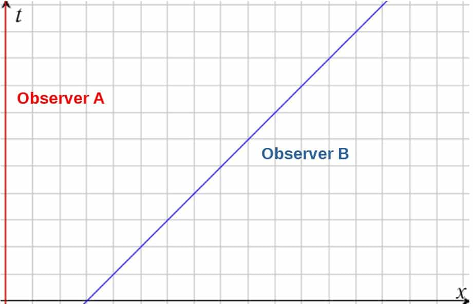

This coordinate system is taken to be the reference frame of observer A as it is at rest (vertical line). We could switch to the reference frame of observer B by rotating and stretching the coordinates in a way that B becomes a vertical line (notice that then the line A would not be at rest anymore; thus, B would observe A to be moving).

That’s the basic concept of a reference frame, although it’s worth noting that it is not always possible to represent these coordinate systems with simple graphs as there might be more than 3 dimensions.

Now, the next question is; what’s an inertial reference frame? **An inertial reference frame is simply a frame in which all objects are moving with constant velocity (no acceleration)**.

Special relativity mainly deals with inertial reference frames, however, a common misconception is that accelerating frames would require general relativity. This is simply not true.

While an accelerating frame is not inertial, it can still be analyzed with the tools of special relativity. There are certainly ways to deal with acceleration in special relativity, however, accelerating frames have to be treated a little differently.

**What special relativity does NOT deal with, is gravity** (i.e. frames with tidal forces and curved spacetime). Gravity is left for general relativity to deal with. In case you are interested, you can read more about this in my **[introductory article on general relativity](https://profoundphysics.com/general-relativity-for-dummies/)**.

Now, **the first postulate of special relativity states that the laws of physics must be the same (invariant) in all inertial frames**. To be fair, this isn’t specific to just relativity, it’s the case in pretty much all of physics.

This makes sense intuitively too, as the laws of physics should be something that are universal for everyone.

What makes this postulate worth stating, however, is that **the ordinary Newton’s laws, such as F=ma, are not actually invariant if we take into account the second postulate**.

This fact is really what motivates the formulation of special relativity and all of the relativistic laws of motion, which are constructed in a way that makes them the same in all inertial frames, but also takes into account the constancy of the speed of light. This, we’ll get to later.

It’s also worth noting that in this article about special relativity, whenever I’m talking about a reference frame, it’s referring to an inertial one unless I explicitly state that it is a non-inertial frame.

### The Constancy of The Speed of Light

**The second postulate of special relativity states that the speed of light in a vacuum has to be the same in all (inertial) reference frames**. This is an observational fact, which is also backed up by Maxwell’s theory of electromagnetism.

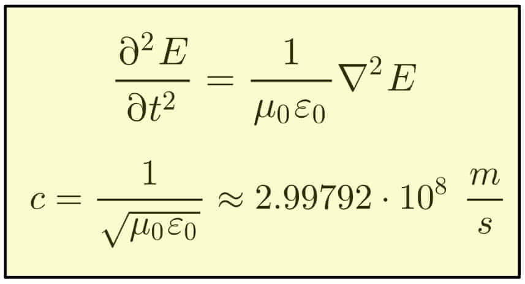

The speed of light is defined in terms of the properties of free space, which can be derived from Maxwell’s wave equations.

Actually, the constancy of the speed of light is not necessarily about the speed of light itself. For all it’s worth, the speed of light could be any number. That sounds odd, but let me explain.

The underlying principle here is actually the fact that there is a certain **speed limit in the universe, above which no information can travel at the speed of**.

Typically, when physics is thought of in the classical Newtonian way, physical interactions, such as forces (and more fundamentally, the flow of information) are considered to happen *instantaneously*.

The second postulate of special relativity (which is really a law of nature) prevents this kind of thing from happening. Every interaction, every event, the flow of every bit of information can only happen under a certain **speed threshold**.

Now, the reason that this is important is because this one single fact requires the Newtonian theories of physics not to be completely reinvented, but to be modified in quite significant ways.

Think about it intuitively. Every single physical phenomenon is fundamentally based on the interactions of particles.

Even the functions of your cells and your body are governed by the interactions of particles and thus, experience the effects of special relativity, such as time dilation, which we’ll get to.

Now, relativistically every interaction happens at a finite speed (under the speed of light c), which actually results in quite weird consequences when things start moving at different velocities.

In typical Newtonian mechanics, different observers moving at different speeds may measure the speed of light to be different, depending on their motion. This would have the implication that **there is no fundamental speed limit in the universe**.

But, we now know that this is not the case. If we wish to keep the speed limit of the universe, the speed of light constant (which we know has to be), we have to invent new ways to compare and transform between observers and reference frames.

This is where the unintuitive ideas of relativity come to play. We’ll have to completely switch up the way we think about time and space and to realize that even time itself is actually relative.

**Quick tip**: For building a **deep understanding of special relativity**, it’s almost required to have a strong mathematical foundation first (such as multivariable and vector calculus). For this, you may find my online course **[Advanced Math For Physics](https://courses.profoundphysics.com/p/advanced-math-for-physics-a-complete-self-study-course)** useful. The course aims to teach you both the **advanced mathematical tools** needed to understand special and general relativity as well as how these concepts are applied to physics in practice.   
  
You’ll get to learn everything from the **basics** all the way up to topics like **tensor calculus**, which forms the basis for understanding **general relativity**. You’ll also get workbooks with tons of **practice problems** to go along with the course material.

## The Concept of Spacetime: What Is It?

To keep the speed of light constant in all inertial frames, we’ll quickly run into problems, such as the addition of velocities, which we won’t get into the semantics of.

The point here is that what we call ordinary Galilean relativity (i.e. transforming and comparing reference frames according to ordinary Newtonian physics), can not be quite correct.

First, let’s think through how we would regularly describe space and time, and in particular, **ordinary distances or intervals**.

According to Newtonian physics and Galilean relativity, time is simply a numerical value that is always the same for everyone, no matter how observers are moving, for example (i.e. it is invariant).

Also, the distance or a spacial interval between two points always remains the same even if you switch between reference frames (this is also defined as an ordinary scalar).

Now, it turns out that in relativity, **neither of these statements is true**. This seems extremely unintuitive at first, but it is merely a result of the fact that the speed of light has to be the same in all frames.

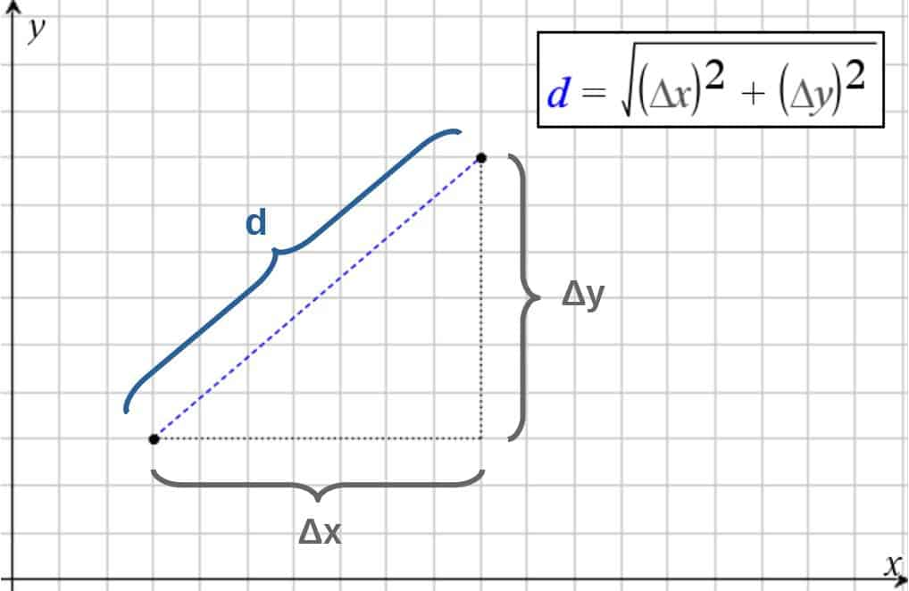

In Newtonian physics (Euclidean geometry), the spacial distance between two points is invariant and is given by the Pythagorean theorem.

According to relativity, time and space (or spacial distance) themselves actually can NOT be invariant quantities if we wish to have the speed of light as a universal constant. Instead, they are *relative*.

But what does the word “relative” actually mean? **Something being relative simply means that it is not the same for every observer, but instead depends on whose reference frame it is observed from**.

What this really means is that if time and space are both actually relative, they depend on **how the observer measuring them is moving**. The meaning of relativity is ultimately explained by something called **Lorentz transformations**, which we’ll come to soon.

Okay, now you might have some questions, such as; if both space and time are relative, isn’t everything then just dependent on who is observing? how does anything make any sense anymore?

Well, **in relativity, space and time by themselves are relative, but instead the combination of the two is not**. This combination is called *spacetime*.

Usually spacetime is viewed as **a four-dimensional entity** with the 3 spacial dimensions (x,y,z) and 1 time dimension (t), but it’s not really too important whether you define time as a dimension or not.

The important thing is that **space and time should be viewed as a combined thing, not as separate quantities and that they should be treated on an equal footing** (well, almost equal at least, since they do still have different units, but we’ll come back to this).

> *“The views of space and time which I wish to lay before you have sprung from the soil of experimental physics, and therein lies their strength. They are radical. Henceforth, space by itself, and time by itself, are doomed to fade away into mere shadows, and only a kind of union of the two will preserve an independent reality.”*
>
> – Hermann Minkowski

There is one more thing we need to quickly talk about, which is an event. **An event is simply a point in spacetime, which has both time and space coordinates** (t,x,y,z).

As an example, you reading this article is an event in spacetime; it has a **time coordinate** (say 5:30 pm, for example) and some kind of **spacial coordinates** (for example GPS coordinates on Earth).

### Spacetime Intervals

To be more concise, something that is the same for every observer (invariant quantity), is an **interval in spacetime**. Not an interval in time or space by itself, but in spacetime.

First, let’s think of an interval in regular Euclidean space again (ordinary Cartesian coordinate system with x,y and z coordinates). An interval (dS) there is given by the Pythagorean theorem like this:

$$\left(dS\right)^2=\left(dx\right)^2+\left(dy\right)^2+\left(dz\right)^2$$

The small letter d here simply denotes a small displacement or interval. This quantity dS is an invariant in Euclidean space, **but not in relativistic spacetime**.

Now, to define something that is invariant in spacetime, we need to consider a more general definition for an interval in any space, for that matter.

The Pythagorean theorem can, in fact, be generalized with a *metric tensor* in a way that works for any kind of space.

This even works for any curved spaces, but that’s another story which you can read more about in my [general relativity article](https://profoundphysics.com/general-relativity-for-dummies/).

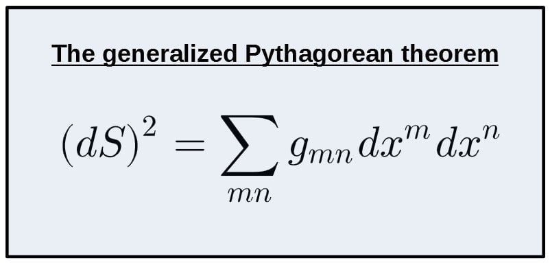

A generalized version of the Pythagorean theorem, which gives the square of an interval dS on any surface by using a metric tensor gmn. Note that the uppercase a and b are NOT exponents, they’re just indices.

Okay, the formula above might look a bit complicated, but it’s really not. Down below you’ll find a short explanation of, basically what the metric tensor is and how it’s used. This should hopefully clear things up a bit.

A Brief Explanation of the Metric Tensor (click to see more)

A metric tensor (without having to get into tensors too much) is simply an object or a function that **describes how distances are measured in a specific coordinate system or space**.

So, different kinds of coordinate systems may have differently defined metric tensors. For example, the metric tensor for a coordinate system in regular Cartesian coordinates (x,y,z) is as simple as this:

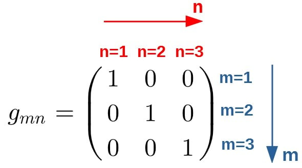

Metric tensors are often represented as matrices such as this. Here both m and n run from 1 to 3, forming a 3×3 matrix. In general, the metric could have any number of dimensions, but in this case it has 3.

We can easily check that this particular metric indeed gives back the good old Pythagorean theorem. All you do is simply sum together every possible combination of m and n like this:

$$\left(dS\right)^2=\sum_{mn}^{ }g_{mn}dx^mdx^n=g_{11}dx^1dx^1+g_{12}dx^1dx^2+g_{13}dx^1dx^3+...+g_{33}dx^3dx^3$$

Note that the metric here has the value 0 everywhere except on the diagonal, i.e. 1 if m and n are the same and 0 if they’re different. So, this reduces to:

$$\left(dS\right)^2=g_{11}dx^1dx^1+g_{22}dx^2dx^2+g_{33}dx^3dx^3$$

Now, we pick the values for these g’s from our metric tensor matrix (all of them are just 1). Also, since the dx’s have the same indices, they can be written as simply squares:

$$\left(dS\right)^2=1\cdot\left(dx^1\right)^2+1\cdot\left(dx^2\right)^2+1\cdot\left(dx^3\right)^2$$

This is clearly nothing but the Pythagorean theorem! Typically we define these x’s with x, y and z like this (it’s usually easier to just use the x’s, because then we won’t run out of letters in higher dimensions):

$$dx^1=dx\\dx^2=dy\\dx^3=dz$$

Now, let’s get back to spacetime intervals again. We’re going to use this generalization of the Pythagorean theorem, but with a different form of the metric tensor.

Firstly, we have to note that in spacetime, the indices of the metric tensor run **from 0 to 3** instead of 1 to 3. These indices are usually denoted by μ and ν instead of m and n.

The reason for the indices 0-3 is that **the 0-index is actually defined as the time component while indices 1-3 are the regular spacial coordinates** (x,y,z).

Anyway, just like the metric in Euclidian space produced the typical Pythagorean theorem, the metric tensor from special relativity (also called *Minkowski metric*) produces a spacetime invariant version of the Pythagorean theorem (don’t worry, this will become clear later on) called a **spacetime interval**:

$$\left(dS\right)^2=c^2\left(dt^2\right)-\left(dx^2\right)-\left(dy\right)^2-\left(dz\right)^2$$

The Metric Tensor of Special Relativity & The Spacetime Interval (click to see more)

The metric tensor in special relativity has a very special form and a special name; it is typically called the **Minkowski metric** (instead of gμν, it is denoted by ημν) and instead of having 1’s in it, it is defined as:

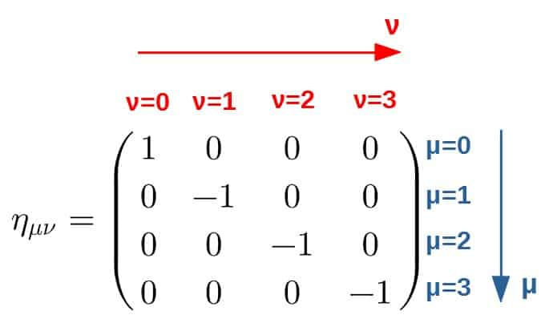

The Minkowski metric can also be defined as having the diagonal elements (-1, 1, 1, 1), which is completely equivalent to the above one.

It is possible to show that this particular metric indeed produces an **invariant spacetime interval**, which we’ll do when we get to the Lorentz transformations.

Now, the interval in spacetime is given by the generalized Pythagorean theorem like this (where both μ and ν run from 0 to 3):

$$\left(dS\right)^2=\sum_{\mu\nu}^{ }\eta_{\mu\nu}dx^{\mu}dx^{\nu}$$

Writing out the sum, we get:

$$\left(dS\right)^2=\eta_{00}dx^0dx^0+\eta_{01}dx^0dx^1+\eta_{02}dx^0dx^2+...+\eta_{33}dx^3dx^3\\\left(dS\right)^2=\eta_{00}\left(dx^0\right)^2+\eta_{01}dx^0dx^1+\eta_{02}dx^0dx^2+...+\eta_{33}\left(dx^3\right)^2$$

Again, the off-diagonal elements are 0 and we’re left with:

$$\left(dS\right)^2=\eta_{00}\left(dx^0\right)^2+\eta_{11}\left(dx^1\right)^2+\eta_{22}\left(dx^2\right)^2+\eta_{33}\left(dx^3\right)^2$$

Now, remember when I told you that the 0-index component refers to time? That’s not actually quite correct. The dx0 is actually defined as dx0=cdt.

The reason for this is that **the space and time parts both have to have the same units** and we can do this by having the speed of light there since it’s an invariant quantity also. Now dx0 also has units of distance.

Anyway, the dx’s in full spacetime are defined as $dx^0=cdt{,}\ dx^1=dx{,}\ dx^2=dy$ and $dx^3=dz$.

We can then replace the dx’s with these in our spacetime interval:

$$\left(dS\right)^2=\eta_{00}\left(cdt\right)^2+\eta_{11}\left(dx\right)^2+\eta_{22}\left(dy\right)^2+\eta_{33}\left(dz\right)^2$$

Then, we simply pick out the corresponding elements of the Minkowski metric for each of the components and end up with:

$$\left(dS\right)^2=1\cdot\left(cdt\right)^2+\left(-1\right)\cdot\left(dx\right)^2+\left(-1\right)\cdot\left(dy\right)^2+\left(-1\right)\cdot\left(dz\right)^2\\\left(dS\right)^2=c^2\left(dt\right)^2-\left(dx\right)^2-\left(dy\right)^2-\left(dz\right)^2$$

Later on, we’ll come to see that this **spacetime interval** is indeed an invariant quantity, which will prove to be very useful when deriving relativistic equations of motion (for example).

I’d also like to give a few words about something called **Einstein’s summation convention**, which you’ll find an explanation of down below; we’ll be using it throughout the article and it is one of the most useful notational tools in general relativity as well.

The Einstein Summation Convention (click to see more)

The Einstein summation convention, in its simplicity, basically just means that **whenever there is an object with a lower index multiplied by another object with the same index upstairs, the indices are automatically summed over**.

In the formula for a spacetime interval, you can see this being the case. By the summation convention, we could leave out this summation sign and the fact that there are these repeated upper-lower indices, tells you that it actually means a **sum over μ and ν**:

$$\left(dS\right)^2=\sum_{\mu\nu}^{ }\eta_{\mu\nu}dx^{\mu}dx^{\nu}=\eta_{\mu\nu}dx^{\mu}dx^{\nu}$$

Einstein’s summation convention is commonly used in relativity (especially general relativity) to make equations look much more nice and compact.

Now, I used the explicit summation sign earlier as it would make everything more clear, but in relativity (both special and general), the summation convention is extremely common and I’d really recommend getting used to it.

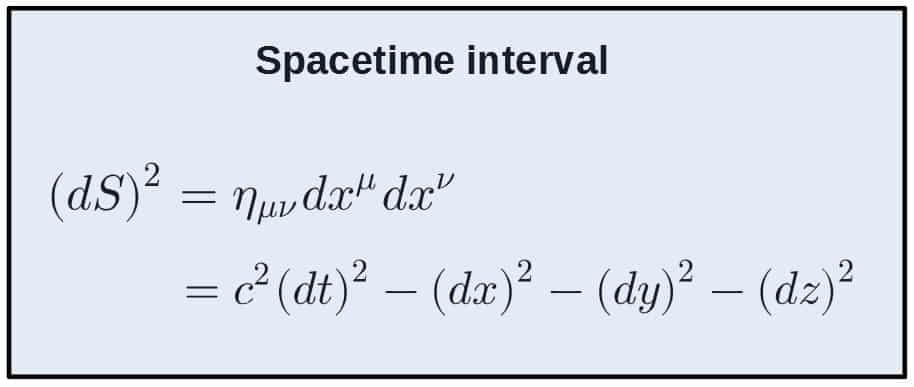

### Proper Time Intervals

I want to now come back to the concept of time again and in particular, find a more useful mathematical definition for it.

Now, time being a relative quantity in special relativity makes it not very useful in objectively analyzing motion or anything else either.

But, time is still an essential concept in physics, so surely we’ll need it in some form? For example, derivatives such as velocity (dx/dt) are taken with respect to time, which makes them relative quantities too, right?

The answer is yes. Ordinary time derivatives are not considered very useful in special relativity when objects are travelling at very high velocities, which means that we’re going to need a definition for time that is an **invariant quantity** (i.e. not dependent on the motion of an observer).

This is actually not too difficult to do. We know that **time can be expressed as distance divided by velocity** (t = x/v). So, we just need definitions of **both distance and velocity that are invariant**, and we should get a definition for an invariant time interval.

Well, we do know what those could be. A distance interval that is invariant is simply the **spacetime interval** and a velocity that is invariant is the **speed of light**! Could we use those?

Dividing the invariant spacetime interval and the invariant speed of light (their squares actually), we get a time interval that must also be invariant (denoted by dτ):

$$\frac{\left(dS\right)^2}{c^2}=\left(d\tau\right)^2$$

This guess indeed turns out to be correct (there are, however, more mathematical ways to show it, but this approach was more simple and intuitive in my opinion).

**The quantity dτ is called the proper time interval and it essentially plays the role of what ordinary time is used for in Newtonian mechanics**.

Now, you may be wondering if there’s any physical meaning for this ‘invariant time’ and indeed there is.

In a physical sense, **proper time is defined as the time that is always measured in an observer’s rest frame**.

This simply means that if an observer is moving, the proper time would be measured from the observer’s own perspective or reference frame (i.e. rest frame), which makes it an invariant quantity since it’s by definition always measured in a rest frame.

This is because **an observer is always at rest in his own reference frame** (think about it; you can’t be moving *relative to yourself*, so you’re always at rest when viewed from your own frame).

One of the more interesting applications of proper time is for **time dilation near a black hole’s event horizon**. I actually have an [article](https://profoundphysics.com/why-time-slows-down-near-a-black-hole/) on this exact topic, which you can understand quite well without much knowledge of general relativity.

Okay then, we can now obtain a more accurate, mathematical definition for this proper time interval simply by using the equation we deduced earlier:

$$\left(d\tau\right)^2=\frac{\left(dS^2\right)}{c^2}$$

Now, inserting the definition for a spacetime interval (we’re now using the summation convention as explained in the last section, so these repeated upper and lower indices μ and ν really mean a sum over them):

$$\left(d\tau\right)^2=\frac{1}{c^2}\eta_{\mu\nu}dx^{\mu}dx^{\nu}$$

$$d\tau=\frac{1}{c}\sqrt{\eta_{\mu\nu}dx^{\mu}dx^{\nu}}$$

Here it’s actually useful to take the square root.

Then, expanding this sum (I’ll leave it to you, it’s exactly the same process as earlier) we get:

$$d\tau=\frac{1}{c}\sqrt{c^2\left(dt\right)^2-\left(dx\right)^2-\left(dy\right)^2-\left(dz\right)^2}$$

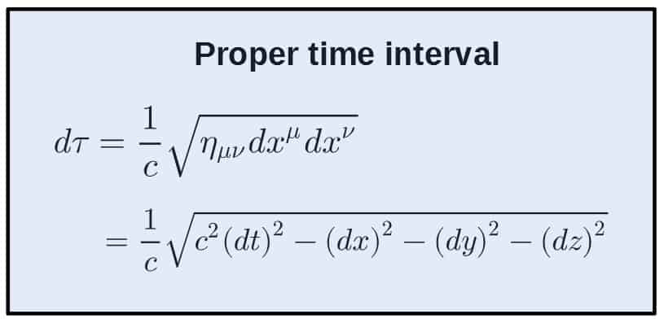

## Lorentz Transformations and Lorentz Invariance

Up to this point, I’ve mentioned the concept of **invariance** quite a bit, but not actually explained or defined it in detail. That’s what we’re going to do next.

The goal is to essentially be able to compare measured quantities in different reference frames, meaning **to transform from one frame to another** and if a quantity remains the same after this transformation, it is an **invariant**.

There is, however, a little catch. In special relativity (according to the **second postulate**), the speed of light should be a constant (invariant) regardless of which frame we’re looking at.

This means that **the speed of light should always remain constant when transforming between reference frames**. In ordinary Newtonian physics (i.e. Galilean transformations), this is NOT the case.

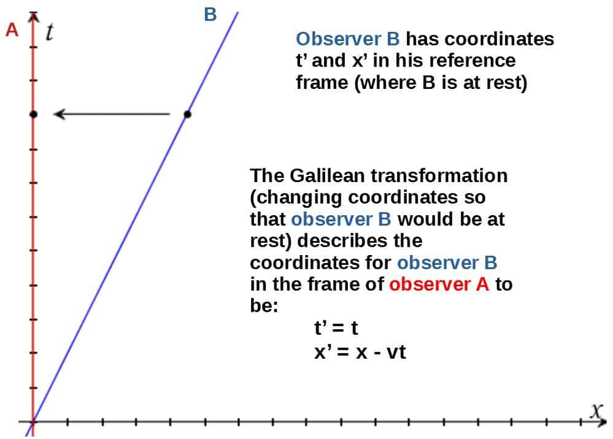

In ordinary Galilean transformations, all observers will describe time to be the same regardless of their motion and might observe the speed of light differently.

The transformation we are interested in in special relativity is called a **Lorentz transformation**.

**A Lorentz transformation is essentially defined as a transformation that always keeps the speed of light constant, which is where it differs from the Galilean transformations**. That’s basically it, nothing more complex.

Interestingly, Lorentz transformations can be used to explain **why specifically a moving charge creates a magnetic field around it**. If you want to learn more about why this happens, I discuss it in detail in [this article](https://profoundphysics.com/why-do-moving-charges-create-a-magnetic-field/). It’s an interesting read if you want to learn more about the **physical consequences** of special relativity.

Now, geometrically the Lorentz transformation can be thought of as a way to switch between coordinate systems so that the speed of light (i.e. a light ray) stays fixed. Here’s a quick animation I made showcasing this:

It’s worth noting that in special relativity, since we’re talking about spacetime instead of space and time separately, it makes more sense to have **graphs with x0 and x axes instead of t and x axes**.

Now, remember from earlier that x0 still represents the time component, but with a factor of c to give consistent units for a spacetime interval, namely x0=ct.

Okay, the first thing we’re going to do is to consider a scenario where an observer A is at rest (i.e. we are in his reference frame) and another observer B is moving with a velocity v relative to observer A.

This scenario can be represented in a coordinate system (observer A’s rest frame) like this (light rays are typically drawn at 45 degree angles, meaning that they have slopes of 1):

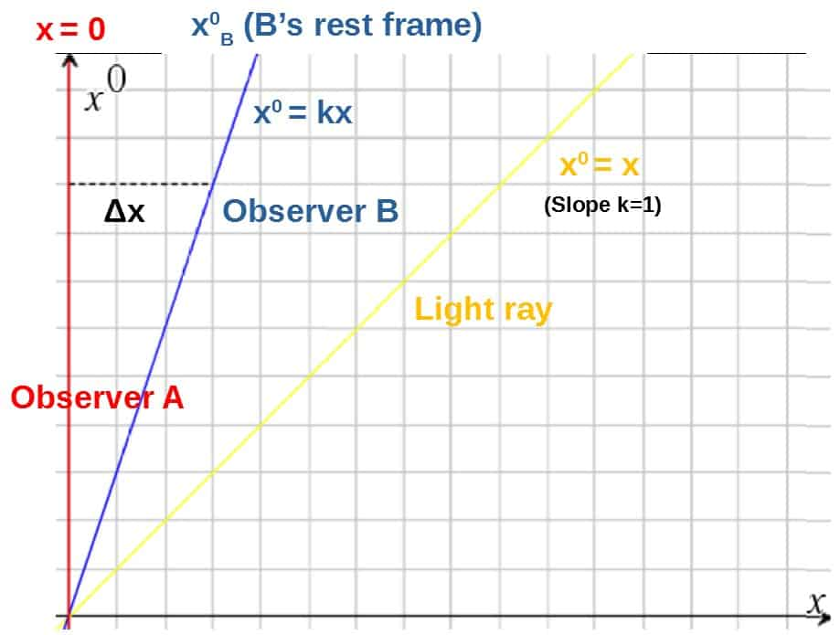

The motion of observer’s A and B can be described by equations for the lines (a line going through the origin has the form y=kx) in A’s rest frame according to the picture. Observer B has his own rest frame (described by coordinates x0B and xB), in which B himself is at rest (i.e. a vertical line).

The goal is to find out **how observer B would describe the coordinates of observer A**, i.e. transform from the rest frame of A to the rest frame of B (while keeping c constant, meaning that the yellow line remains completely unchanged).

Derivation of The Transformation Equations (click to see more)

The first thing we’ll do is find out what the x-coordinate of A would be in B’s frame (we’ll denote this by xB).

First of all, the **slope k** (change in vertical coordinate divided by the change in horizontal coordinate) of the blue line is (i.e. the line that A sees moving to the right) by using the fact that x0=ct:

$$k=\frac{\Delta x^0}{\Delta x}=\frac{\Delta ct}{\Delta x}=c\frac{\Delta t}{\Delta x}=c\frac{1}{v}=\frac{c}{v}$$

Now the equation for the blue line takes the form:

$$x^0=\frac{c}{v}x$$

Or solved for the x-coordinate of the blue line:

$$x=\frac{v}{c}x^0$$

We can now find Δx, which is simply **the difference of the x-coordinates between the blue line and the red line** (red line having the x-coordinate x=0):

$$\Delta x=\frac{v}{c}x^0-0=\frac{v}{c}x^0$$

Then, when we transform frames from A to B (i.e. shift the coordinates so that the blue line is set vertically), the x-coordinate that B would describe A to have (xB) is simply the difference of the x-coordinate of A (x) and the shift between the two lines (Δx):

$$x_B=x-\Delta x=x-\frac{v}{c}x^0$$

Keep this equation in mind as we’ll need it soon. Before we do, however, we have to also find the x0-coordinate that B would describe A to have.

Now the problem with this is that for this, we also need to calculate the shift or **difference between the x0-coordinates of these two lines** (Δx0). This, however, can not be deduced directly from the picture above.

We can luckily use a little trick which is to **reflect the blue line about the yellow line** (light ray). This gives us a simple way to get Δx0. This is basically what it looks like in the picture:

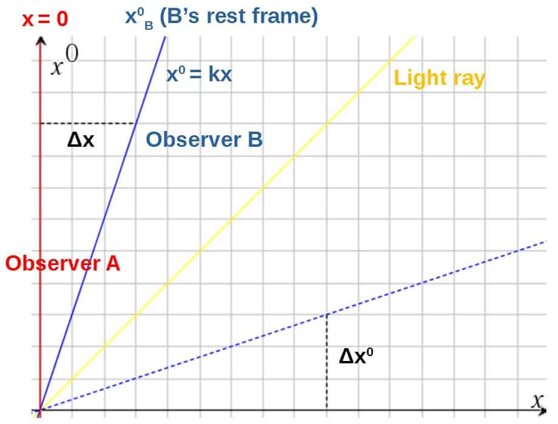

Angle between the blue line and the light ray remains the same when reflecting it about the light ray. Reflections of functions about the line y=x (light beam in this case) are more generally called *inverse functions*.

Now, reflecting a line in this symmetrical kind of way is actually the same thing as just **swapping the coordinate axes** like this (note that when swapping the axes, we also have to reflect the red line):

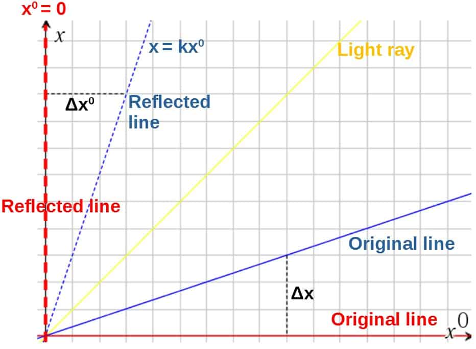

This indeed gives us what we need to get Δx0. First we just have to solve for x0 from the equation for the reflected blue line (and inserting k=c/v):

$$x=kx^0\\x^0=\frac{1}{k}x=\frac{v}{c}x$$

Then Δx0 is simply the **difference between the x0-coordinates of the reflected blue line and the reflected red line** (reflected red line having the x0-coordinate x0=0):

$$\Delta x^0=\frac{v}{c}x-0=\frac{v}{c}x$$

Now, this is indeed the same process that we already went through with the first transformation. The x0-coordinate that B would describe A to have (x0B) is simply:

$$x_B^0=x^0-\Delta x^0=x^0-\frac{v}{c}x$$

The mathematical formulas describing the transformations for both of the coordinates are as follows (notice the symmetry between them):

$$x_B=x-\frac{v}{c}x^0\\x_B^0=x^0-\frac{v}{c}x$$

But this is not actually quite correct yet. We don’t know if these equations are actually true for every transformation. Thus, more generally we multiply the equations by a **scaling factor** γ.

Now, **the scaling factor will generally depend on the relative velocity between the two frames we’re transforming between**. So, the scaling factor is a function of velocity, meaning that; γ=γ(v).

In fact, this scaling factor turns out to be necessary for the equations to work and it also has to be **the same for both of these transformation equations**.

This is fundamentally about the symmetrical scaling between space and time and the constancy of the speed of light.

Anyway, the **Lorentz transformation** equations then have the form:

$$x_B=\gamma\left(v\right)\left(x-\frac{v}{c}x^0\right)\\x_B^0=\gamma\left(v\right)\left(x^0-\frac{v}{c}x\right)$$

Now, what is γ(v) and how do we find it? I’ll just tell you that it is actually a very common thing often seen in relativity and it’s called the **Lorentz factor**. Next, we will derive what it actually is.

### The Lorentz Factor

First of all I’m going to replace xB and x0B by x’ and (x0)’ to denote any transformed reference frame, not just the B frame.

Now, there is a very deep principle in physics, which is that **there is no universal or preferred reference frame**, so each frame is equally valid.

Based on this, instead of asking how x’ would see x, we could equivalently ask how x sees x’.

If, say x is moving to the **left** according to x’, then according to x, x’ would be moving to the **right**. So, the two frames describe opposite directions for each other’s velocities.

So, in order to interchange between these frames, we only have to **change the sign before the velocity term**, which essentially means reversing the velocity:

$$x'=\gamma\left(x-\frac{v}{c}x^0\right)\ \Leftrightarrow\ x=\gamma\left(x'+\frac{v}{c}\left(x^0\right)'\right)$$

Now we essentially have two equations that form a system of equations, which we can solve for γ:

$$\begin{cases}x'=\gamma\left(x-\frac{v}{c}x^0\right)&\\x=\gamma\left(x'+\frac{v}{c}\left(x^0\right)'\right)&\end{cases}$$

What you’ll get is that the **Lorentz factor** γ is defined as:

$$\gamma=\frac{1}{\sqrt{1-\frac{v^2}{c^2}}}$$

Derivation of The Lorentz Factor (click to see more)

A pair of equations like the one above is actually very simple to solve. Simply just insert the expression for x’ into the equation for x to get:

$$x=\gamma\left(\gamma\left(x-\frac{v}{c}x^0\right)+\frac{v}{c}\left(x^0\right)'\right)$$

But we also know what (x0)’ is:

$$\left(x^0\right)'=\gamma\left(x^0-\frac{v}{c}x\right)$$

Inserting this into the above equation, we get:

$$x=\gamma\left(\gamma\left(x-\frac{v}{c}x^0\right)+\frac{v}{c}\gamma\left(x^0-\frac{v}{c}x\right)\right)$$

Now it’s only a matter of doing some simple algebra:

$$x=\gamma\left(\gamma\left(x-\frac{v}{c}x^0\right)+\frac{v}{c}\gamma\left(x^0-\frac{v}{c}x\right)\right)\\x=\gamma^2\left(x-\frac{v}{c}x^0\right)+\frac{v}{c}\gamma^2\left(x^0-\frac{v}{c}x\right)\\x=\gamma^2x-\gamma^2\frac{v}{c}x^0+\gamma^2\frac{v}{c}x^0-\frac{v^2}{c^2}x$$

We can clearly see that the x0-terms cancel out and we’re left with:

$$x=\gamma^2x-\frac{v^2}{c^2}x$$

Then, solving for γ:

$$\frac{x}{x-\frac{v^2}{c^2}x}=\gamma^2\ \ \ \ \Rightarrow\ \ \ \ \ \gamma=\frac{1}{\sqrt{1-\frac{v^2}{c^2}}}$$

And that is commonly known as the **Lorentz factor**.

Now there is just one more thing to do. Consider again the Lorentz transformation equations:

$$x'=\gamma\left(x-\frac{v}{c}x^0\right)\\\left(x^0\right)'=\gamma\left(x^0-\frac{v}{c}x\right)$$

We’ve been carrying around this x0 thing simply because it’s easier to deal with, but remember what it’s actually defined as; x0=ct. So, putting this in, we get:

$$x'=\gamma\left(x-\frac{v}{c}ct\right)\\\left(ct\right)'=\gamma\left(ct-\frac{v}{c}x\right)$$

These can be simplified to be (by cancelling some of the c’s):

$$x'=\gamma\left(x-vt\right)\\t'=\gamma\left(t-\frac{v}{c^2}x\right)$$

These two equations are the usual forms of the Lorentz transformations. But what do they actually mean and how do you even use them? That’s what we’ll consider next.

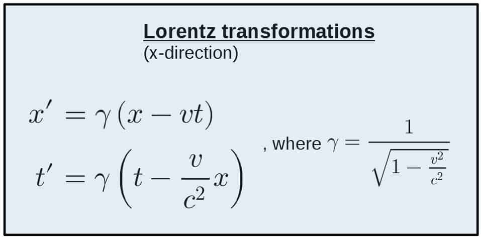

### Practical Example: Time Dilation Due to Lorentz Transformations

I want to quickly go over an example of how these Lorentz transformations are actually used since they seem a little bit abstract and this might give you a more concrete picture of what they essentially mean.

So, the example is this; we have two observers, James and Mary. Mary has been practicing running and she can now run at 90 % of the speed of light (okay, that was a joke, nobody can run that fast!).

The question is this: **James sees an event happening in spacetime which he describes to have the coordinates t=2 and x=3. What is the time coordinate Mary describes for the same event if she is travelling at 90 % of the speed of light?**

We’re going to describe James’s frame by x and Mary’s frame by x’, so essentially we’re trying to find **what the time coordinate for the point (2,3) would be if looked at from the x’ frame**.

Plotted in a t,x -graph, this is what it looks like (for the purpose of this example, we’re using the t-axis instead of the x0-axis):

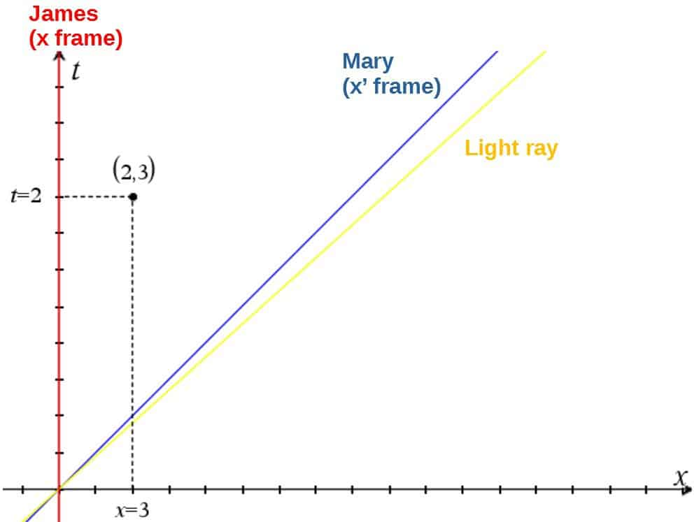

So, how do we find this point in the x’ frame? That’s easy, we just use the Lorentz transformations and transform from the x frame to the x’ frame.

Since we’re only interested in the t-coordinate, we only need the transformation equation for t’:

$$t'=\gamma\left(t-\frac{v}{c^2}x\right)\\\gamma=\frac{1}{\sqrt{1-\frac{v^2}{c^2}}}$$

Let’s first calculate the value for γ. Since Mary was travelling at 90 % of the speed of light (c), we can plug in v=0.9c:

$$\gamma=\frac{1}{\sqrt{1-\frac{\left(0.9c\right)^2}{c^2}}}=\frac{1}{\sqrt{1-\frac{0.81c^2}{c^2}}}=\frac{1}{\sqrt{1-0.81}}\approx2.3$$

Now, plugging in all the values in the t’ equation (t=2, x=3, v=0.9c, γ=2.3 and c=3×108), we get:

$$t'=\gamma\left(t-\frac{v}{c^2}x\right)=2.3\cdot\left(2-\frac{0.9c}{c^2}\cdot3\right)=2.3\cdot\left(2-\frac{0.9}{3\cdot10^8}\cdot3\right)\approx4.6$$

That’s actually interesting. We see that Mary would actually describe the same event with a different time coordinate, because she is moving. What James measured as 2 seconds, Mary measured as 4.6 seconds.

This is what it means for time to be relative; **different observers measure time differently depending on how they’re moving**. This effect is called *time dilation*.

### Lorentz Invariance

Now that we have an idea of the Lorentz transformations, it’s time to actually define what it really means for something to be invariant.

**An invariant quantity in special relativity means a quantity that remains the same after applying a Lorentz transformation**.

That’s a pretty simple concept, but it’s quite a deep one too. Since these Lorentz invariant quantities stay the same after Lorentz transformations, they are always the same for everyone in every reference frame.

This makes them the basis for formulating pretty much all of the fundamental laws of physics into a relativistic form.

Lorentz invariance also gives a deeper meaning and a concise definition for the first postulate of SR, which is that the laws of physics should be the same for everyone, i.e. **the laws of physics should be constructed from quantities that are Lorentz invariant**.

This is done through something called the **action principle**, which underlies pretty much all of physics, but we’ll get to it.

Now, earlier I said that a **spacetime interval** is an invariant quantity, which is proved down below.

Proof of the Invariance of a Spacetime Interval (click to see more)

To do this, we simply apply the Lorentz transformations. For this example, it’s enough to look at the spacetime interval in only one spacial and one time dimension:

$$S^2=c^2t^2-x^2$$

The goal is to find (S’)2 i.e. the transformed spacetime interval, which is:

$$\left(S'\right)^2=c^2\left(t'\right)^2-\left(x'\right)^2$$

Here we simply insert the Lorentz transformation equations for t’ and x’, which are:

$$t'=\gamma\left(t-\frac{v}{c^2}x\right)\\x'=\gamma\left(x-vt\right)$$

Inserting these, we get:

$$\left(S'\right)^2=c^2\left(t'\right)^2-\left(x'\right)^2=c^2\left(\gamma\left(t-\frac{v}{c^2}x\right)\right)^2-\left(\gamma\left(x-vt\right)\right)^2$$

Now we just manipulate this a little bit and see what happens:

$$\left(S'\right)^2=c^2\left(\gamma\left(t-\frac{v}{c^2}x\right)\right)^2-\left(\gamma\left(x-vt\right)\right)^2$$

$$\left(S'\right)^2=c^2\gamma^2\left(t-\frac{v}{c^2}x\right)^2-\gamma^2\left(x-vt\right)^2$$

Now multiply out all the squares and parentheses:

$$\left(S'\right)^2=c^2\gamma^2\left(t^2-2\frac{v}{c^2}xt+\frac{v^2}{c^4}x^2\right)-\gamma^2\left(x^2-2xvt+v^2t^2\right)$$

$$\left(S'\right)^2=c^2\gamma^2t^2-2c^2\gamma^2\frac{v}{c^2}xt+c^2\gamma^2\frac{v^2}{c^4}x^2-\gamma^2x^2+2\gamma^2xvt-\gamma^2v^2t^2$$

We can cancel out a bunch of speed of light to get:

$$\left(S'\right)^2=c^2\gamma^2t^2-2\gamma^2vxt+\gamma^2\frac{v^2}{c^2}x^2-\gamma^2x^2+2\gamma^2xvt-\gamma^2v^2t^2$$

Here the terms with 2’s in them cancel out and we’re left with:

$$\left(S'\right)^2=c^2\gamma^2t^2+\gamma^2\frac{v^2}{c^2}x^2-\gamma^2x^2-\gamma^2v^2t^2$$

From this, we can see that the first and last terms both have γ2t2 and the two other terms both have γ2x2. So, we can express this as:

$$\left(S'\right)^2=\gamma^2t^2\left(c^2-v^2\right)-\gamma^2x^2\left(1-\frac{v^2}{c^2}\right)$$

From the first term, we can actually pull out a c2 like this:

$$\left(S'\right)^2=c^2\gamma^2t^2\left(1-\frac{v^2}{c^2}\right)-\gamma^2x^2\left(1-\frac{v^2}{c^2}\right)$$

Now, let’s actually insert the definition for γ:

$$\left(S'\right)^2=c^2t^2\left(\frac{1}{\sqrt{1-\frac{v^2}{c^2}}}\right)^2\left(1-\frac{v^2}{c^2}\right)-x^2\left(\frac{1}{\sqrt{1-\frac{v^2}{c^2}}}\right)^2\left(1-\frac{v^2}{c^2}\right)$$

$$\left(S'\right)^2=c^2t^2\frac{1}{1-\frac{v^2}{c^2}}\left(1-\frac{v^2}{c^2}\right)-x^2\frac{1}{1-\frac{v^2}{c^2}}\left(1-\frac{v^2}{c^2}\right)$$

We can see that the terms in the denominator cancel out with the terms in the parentheses and we’re simply left with:

$$\left(S'\right)^2=c^2t^2-x^2$$

This is exactly what we had before even transforming. So, from this we conclude that $S^2=\left(S'\right)^2$.

The definition for something to be invariant is essentially that **it remains the same after a Lorentz transformation**. The spacetime interval is clearly an invariant quantity based on the proof above.

Now, if you remember the **connection between proper time and spacetime intervals** (τ2=S2/c2), we could simply divide both sides by c2 (since c is invariant also), which gives:

$$\frac{S^2}{c^2}=\frac{\left(S'\right)^2}{c^2}\\\tau^2=\left(\tau'\right)^2$$

So, we can say that **proper time is also an invariant quantity**. This gives a useful, invariant definition for time, which we’ll be using a lot later in the article.

Now, you could also derive this fact by simply using the Lorentz transformations on the proper time interval exactly like we did with the spacetime interval. You can try it as an exercise if you wish.

Later when we get to **four-vectors**, I’ll show you a simple way to construct Lorentz invariant quantities, which will become extremely useful.

### Spacetime and Proper Time Intervals Revisited

Now, with the definition of the Lorentz factor (γ) we derived earlier, we can actually find new expressions for **the proper time interval and the spacetime interval** (which will actually turn out to be useful later on).

We can quite easily derive a more compact looking expression for the spacetime interval *in terms of the Lorentz factor*:

$$dS=\frac{1}{\gamma}cdt$$

Derivation of This Formula (click to see more)

Okay, let’s consider the following form of the spacetime interval again:

$$\left(dS\right)^2=c^2\left(dt\right)^2-\left(dx\right)^2-\left(dy\right)^2-\left(dz\right)^2$$

Now, we’re going to do a little trick of pulling out the c2(dt)2 -term upfront like this:

$$\left(dS\right)^2=c^2\left(dt\right)^2\left(1-\frac{\left(dx\right)^2}{c^2\left(dt\right)^2}-\frac{\left(dy\right)^2}{c^2\left(dt\right)^2}-\frac{\left(dz\right)^2}{c^2\left(dt\right)^2}\right)$$

Or expressed like this:

$$\left(dS\right)^2=c^2\left(dt\right)^2\left(1-\frac{1}{c^2}\left(\left(\frac{dx}{dt}\right)^2+\left(\frac{dy}{dt}\right)^2+\left(\frac{dz}{dt}\right)^2\right)\right)$$

What are these terms with the dt’s actually? They’re simply velocities (i.e. derivative of position with respect to time)! For example, the x-component of velocity is dx/dt.

Together the sum of these squares of components is just the total velocity (given by the Pythagorean theorem):

$$\left(\frac{dx}{dt}\right)^2+\left(\frac{dy}{dt}\right)^2+\left(\frac{dz}{dt}\right)^2=v_x^2+v_y^2+v_z^2=v^2$$

So, the spacetime interval becomes:

$$\left(dS\right)^2=c^2\left(dt\right)^2\left(1-\frac{v^2}{c^2}\right)$$

Or taking the square root of both sides:

$$dS=cdt\sqrt{1-\frac{v^2}{c^2}}$$

This thing with the square root looks actually a lot like the Lorentz factor. Well, it is, in fact, just the inverse of the Lorentz factor. This can then be written as:

$$dS=\frac{1}{\gamma}cdt$$

Now, we can also find a similar expression for the proper time interval by the definition:

$$d\tau=\frac{dS}{c}=\frac{\frac{1}{\gamma}cdt}{c}=\frac{1}{\gamma}dt$$

This formula will prove to be useful later such as when interchanging between ordinary time derivatives and proper time derivatives, but we’ll get to it.

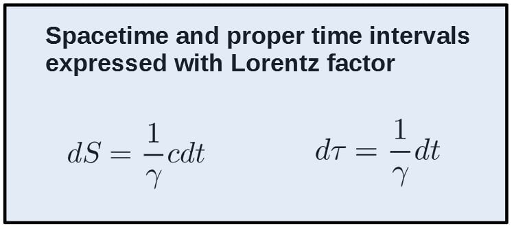

Also, note that the expression for proper time can also be rearranged to give a new meaning to the Lorentz factor, namely:

$$\gamma=\frac{dt}{d\tau}$$

This tells us that, actually, the Lorenz factor is simply a measure that compares the relative time to the proper time. For everyday low velocities (when γ ≈ 1), this tells us that the relative time and proper time are approximately the same:

$$\frac{dt}{d\tau}\approx1\\dt\approx d\tau$$

For velocities close to the speed of light, however, γ will become much larger than 1.

This means that **the relative time becomes much larger than the proper time** and thus, the time an outside observer would measure (relative time) for someone travelling close to the speed of light would appear to be passing slower (i.e. **time dilation**).

This exact phenomenon actually happens near a **black hole** (but not due to someone moving but rather due to the gravity of the black hole), which I discuss in great detail in [this article](https://profoundphysics.com/why-time-slows-down-near-a-black-hole/).

---

## Four-Vectors: The Mathematical Language of Special Relativity

Before we get started on any of the relativistic dynamics, we have to go over the concept of a 4-vector. Simply put, **a 4-vector is a vector with four components** (in relativity, it could be t, x, y and z), which means that it is a **4-dimensional vector**.

If we compare this to a regular 3-dimensional vector in Newtonian physics (which may have components x,y and z, for example), a 4-vector is the same except you add a time component to it.

Also, **4-vectors are defined as objects which transform according to the Lorentz transformations**, which makes them useful in relativity since this ensures that the speed of light is the same in every reference frame.

Now, the idea of a 4-vector sounds quite similar to the idea of spacetime and it indeed is.

Just like the position in ordinary space (with 3 spacial components) is described by a 3-dimensional position vector, **the position in spacetime is described by a position 4-vector** (4-position).

This means that a 4-position vector has components of t, x, y and z. Well, almost at least. The time component is actually defined as ct to have the same units as the spacial components.

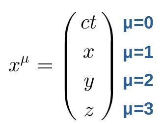

Components of the 4-position vector. The index μ goes from 0 to 3 and it describes the components from the top to the bottom.

Does this look somewhat familiar? It is exactly what we had earlier when discussing the spacetime intervals! Well, not quite. The spacetime interval is actually built out of these 4-position vectors. Let me explain.

At the very beginning, we defined an interval in spacetime to be (using the Einstein summation convention, which means that upper-lower index pairs are actually summation indices, so μ and ν are summed over here):

$$\left(dS\right)^2=\eta_{\mu\nu}dx^{\mu}dx^{\nu}$$

Now, these x-quantities are actually **4-position vectors** (the d simply denotes a small displacement or *interval*)! This means that **the spacetime interval is actually constructed as basically the squares of 4-position vectors multiplied by the Minkowski metric**.

We also proved that the spacetime interval (dS2) is an invariant quantity. Therefore, this quantity also has to be invariant:

$$\eta_{\mu\nu}dx^{\mu}dx^{\nu}=invariant$$

In general, quantities like this will always be invariant in special relativity. So, **an invariant can be constructed by multiplying a 4-vector by itself and by the Minkowski metric and summing over all the indices**.

This is a very general rule in special relativity, which we’ll come to use more later, but essentially any 4-vector (Aμ) can be made into an invariant in the same way:

$$\eta_{\mu\nu}A^{\mu}A^{\nu}=invariant$$

Now, if you actually write out this sum, you’ll get:

$$\eta_{\mu\nu}A^{\mu}A^{\nu}=\left(A^0\right)^2-\left(A^1\right)^2-\left(A^2\right)^2-\left(A^3\right)^2$$

This is exactly the same form as the spacetime interval equation has, but the form on the left-hand side of this is more compact, so that’s what we’ll usually use.

Well, actually, we don’t usually use that form either. There is an even more compact way to make invariant quantities, which is to **multiply a 4-vector by itself, but with a lower index**:

$$A_{\mu}A^{\mu}$$

Four-vectors with upper indices are generally called **contravariant four-vectors** and ones with lower indices are called **covariant four-vectors**.

Notice that this really means a sum over all of the values of μ. Now, what does it actually mean for the same 4-vector to have a lower index?

This is actually quite simple and I’ll just state the general rule; **to take an upper index to a lower index, simply multiply by the Minkowski metric**.

So, **we can change a 4-vector with an upper index (Aν) into one with a lower index (Aμ) by the Minkowski metric** (note that the index changes, because ν turns into a summation index when we multiply by the metric as it has a lower ν; *a general rule is that if an index is NOT summed over, then the same index has to appear on both sides of the equation*):

$$A_{\mu}=\eta_{\mu\nu}A^{\nu}$$

So, actually the equation from earlier really means this:

$$A_{\mu}A^{\mu}=\eta_{\mu\nu}A^{\nu}A^{\mu}$$

As you can see, this is exactly the way to make **an invariant** that I explained earlier (which is also seen in the spacetime interval formula). The left-hand side is just much more nice looking, so we will use that from now on. Just remember that fully written out, this actually means:

$$A_{\mu}A^{\mu}=\left(A^0\right)^2-\left(A^1\right)^2-\left(A^2\right)^2-\left(A^3\right)^2$$

Now, if all of this index stuff was somewhat abstract to you, that’s fine. It takes some time to get used to. But, we will use these ideas later, so if there is one thing to remember from this 4-vector section it is this rule:

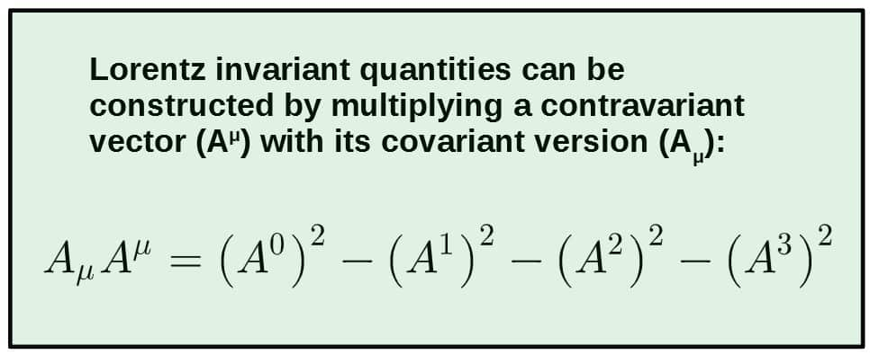

### The Four-Gradient Operator

I want to quickly go over something called a **4-gradient**. Now, in relativity, it is quite common to take **partial derivatives with respect to 4-position**, i.e. the operator:

$$\frac{\partial}{\partial x^{\mu}}$$

The components of this thing are as follows (notice that it is really a combination of time derivatives and spacial derivatives):

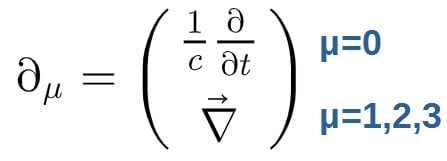

The 4-gradient has a lower index, because it means the derivative w.r.t 4-position, which has an upper index, but it is under the fraction bar, thus making the index a lower one. Well, it’s not a very mathematical way to think of it, but it works.

Components of the 4-Gradient (click to see more)

Now, let’s actually look at what the different values for µ give for this operator. First, µ=0 gives (remember the **components of the 4-position**):

$$\frac{\partial}{\partial x^0}=\frac{\partial}{\partial ct}=\frac{1}{c}\frac{\partial}{\partial t}$$

So, µ=0 is actually a time derivative. Next, let’s consider the spacial components (µ=1,2,3):

$$\begin{aligned}\frac{\partial}{\partial x^1}&=\frac{\partial}{\partial x}\\\frac{\partial}{\partial x^2}&=\frac{\partial}{\partial y}\\\frac{\partial}{\partial x^3}&=\frac{\partial}{\partial z}\end{aligned}$$

Now, if we put these spacial derivatives together, what do they give? It would mean the derivative of something with respect to each of the spacial directions (x,y,z). Well, that’s simply the ordinary **3-dimensional gradient**:

$$\vec{\nabla}=\frac{\partial}{\partial x}+\frac{\partial}{\partial y}+\frac{\partial}{\partial z}$$

We can then actually combine each of these into one quantity called **4-gradient**, which has the components (denoted by ∂µ):

For last, simply remember that **the 4-gradient is defined as a partial derivative with respect to 4-position**, which shows up quite a bit in relativity (the 4-gradient notation just makes it simply more compact):

$$\partial_{\mu}=\frac{\partial}{\partial x^{\mu}}$$

Also, this can be turned into a **contravariant derivative** (with an upper index) by simply **changing the sign of the spacial components** (this has to do with the minus-signs in the Minkowski metric that is used when changing indices):

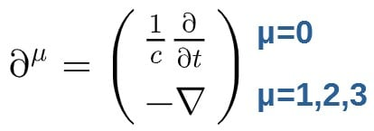

This contravariant form simply means the derivative with respect to the *covariant* (lower index) 4-position:

$$\partial^{\mu}=\frac{\partial}{\partial x_{\mu}}$$

## Relativistic Laws of Motion

Now, special relativity isn’t fundamentally about time dilation, length contraction, twin paradoxes or any of the weird phenomena associated with it, like it is sometimes presented.

It is rather about **redefining the fundamental laws of physics in terms of quantities that transform according to Lorentz transformations**  (i.e. the speed of light is kept constant!).

These Lorentz transforming quantities are the **four-vectors** and the fascinating thing is that there is a four-vector analogue for pretty much every Newtonian law of physics (for quantum mechanics too, actually).

Now, keep in mind that this does not include gravity as that is a part of general relativity. So, special relativity only deals with non-gravitational laws of physics and reference frames.

Okay then, we’re now ready to get into the real meat of special relativity.

### Four-Velocity

The first 4-vector quantity we’re going to talk about (after 4-position) is **4-velocity**. 4-velocity is typically denoted by uμ and it is essentially the relativistic version of ordinary velocity (v).

Now, ordinary Newtonian velocity is defined as the derivative of position with respect to time:

$$v=\frac{dx}{dt}$$

According to this, what could the relativistic 4-velocity be? That’s easy. It is **the derivative of 4-position with respect to not time, but actually proper time**:

$$u^{\mu}=\frac{dx^{\mu}}{d\tau}$$

Or we can actually use the definition for the proper time, which we derived in the “Spacetime and Proper Time Intervals Revisited” -section:

$$d\tau=\frac{1}{\gamma}dt$$

Then, expressing the 4-velocity by this, we get:

$$u^{\mu}=\frac{dx^{\mu}}{d\tau}=\frac{dx^{\mu}}{\frac{1}{\gamma}dt}=\gamma\frac{dx^{\mu}}{dt}$$

So in fact, **4-velocity can actually be expressed as a regular time derivative,** but we have to also multiply by the **Lorentz factor**.

Next, let’s consider the components of this 4-velocity. For this, we need to remind ourselves of the components of dxμ:

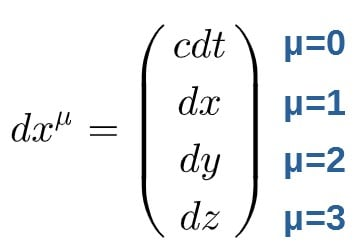

The first component of the 4-velocity is μ=0, which is:

$$u^0=\gamma\frac{dx^0}{dt}=\gamma\frac{cdt}{dt}=\gamma c$$

The other components (μ=1,2,3) are:

$$u^1=\gamma\frac{dx^1}{dt}=\gamma\frac{dx}{dt}=\gamma v_x$$

Notice that dx/dt is simply the x-component of the ordinary velocity v. Same goes for the other components.

$$u^2=\gamma\frac{dx^2}{dt}=\gamma\frac{dy}{dt}=\gamma v_y\\u^3=\gamma\frac{dx^3}{dt}=\gamma\frac{dz}{dt}=\gamma v_z$$

Now, it is typically useful to combine these **spacial components of the 4-velocity** into one term, which is simply γv.

We then have the components for uμ:

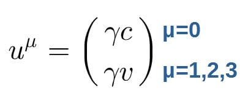

Now I want to look at one more thing for the 4-velocity. Remember earlier that we deduced that the 4-position could be expressed as an invariant like this (which was just the spacetime interval):

$$dx_{\mu}dx^{\mu}=\left(dS\right)^2$$

We could ask if there is a similar *invariant* form for the 4-velocity? The answer is that there indeed is! Let’s simply divide both sides by (dτ)2:

$$\frac{dx_{\mu}dx^{\mu}}{\left(d\tau\right)^2}=\frac{\left(dS\right)^2}{\left(d\tau\right)^2}$$

Or we could express it like this:

$$\frac{dx_{\mu}}{d\tau}\frac{dx^{\mu}}{d\tau}=\frac{\left(dS\right)^2}{\left(d\tau\right)^2}$$

What’s this left-hand side? It is nothing but the **contravariant and covariant forms of the 4-velocity** (derivative of 4-position w.r.t proper time).

The right-hand side is also familiar. It is simply c2 (from the relation (dτ)2 = (dS)2/c2). So, this becomes:

$$u_{\mu}u^{\mu}=c^2$$

Now, let’s write out this sum on the left-hand side (remember the summation convention!):

$$\left(u^0\right)^2-\left(u^1\right)^2-\left(u^2\right)^2-\left(u^3\right)^2=c^2\\\left(u^0\right)^2-\left(\left(u^1\right)^2+\left(u^2\right)^2+\left(u^3\right)^2\right)=c^2$$

Then, inserting all of the components of the 4-velocity:

$$\gamma^2c^2-\left(\gamma^2v_x^2+\gamma^2v_y^2+\gamma^2v_z^2\right)=c^2$$

Now, we can actually combine all of the spacial components here into just v2:

$$\gamma^2c^2-\gamma^2v^2=c^2\\\gamma^2\left(c^2-v^2\right)=c^2$$

This relation actually reduces to simply the definition of the Lorentz factor:

$$\gamma^2=\frac{c^2}{c^2-v^2}=\frac{c^2}{c^2\left(1-\frac{v^2}{c^2}\right)}=\frac{1}{1-\frac{v^2}{c^2}}\\\gamma=\frac{1}{\sqrt{1-\frac{v^2}{c^2}}}$$

The interesting thing is that actually, in general, each of the 4-vector quantities we’ll talk about will produce something interesting when we construct an invariant out of them just like we did here.

### The Principle of Least Action in Special Relativity

In this section, I’d like to go over **the principle of least action** in the context of special relativity as it has huge importance in formulating some of the relativistic laws of motion.

First of all, what is the principle of least action (or in short, the action principle)?

**The principle of least action is essentially a fundamental principle in physics, which states that physical objects follow trajectories through space and time in which a quantity called action is minimized** (or more accurately, stationary).

Now, this is all explained in my [introductory article](https://profoundphysics.com/lagrangian-mechanics-for-beginners/) on Lagrangian mechanics, so I’d recommend read that if you have absolutely no idea what I’m talking about here.

We’ll still, however, go over the **basic rules for the action principle** here. It’s worth noting that the action principle is based on Lagrangian mechanics, but it is actually much more fundamental than that.

In fact, one could say that pretty much all of the fundamental laws of physics are actually based on the action principle, which just goes to show that the action principle really is an extremely deep principle of nature.

Anyway, let’s quickly talk about what the quantity *action* really means. **Action is practically a quantity, which determines how objects move in space and time** (spacetime in special relativity).

Each trajectory an object could take has a value for the action associated with it. **The object will, according to experimental evidence too, always choose a trajectory in which the action is at a stationary point** (i.e. doesn’t vary with respect to that trajectory).

Now, **the action is defined as an integral over the trajectory**, i.e. basically a sum of each of the points of the trajectory:

$$A=a\int_{ }^{ }dS$$

The action is defined as an integral over a general trajectory (here denoted by dS, but it doesn’t necessarily have to stand for a spacetime interval). The small a stands for any constant.

Now, to get useful equations of motion from the action, it should be written in the form:

$$A=\int_{ }^{ }\mathscr{L}dt$$

The scripty L here stands for the Lagrangian, which is basically a function of the energies of the object at each point. Typically the Lagrangian has the form of *kinetic minus potential energy*, but this is not the case in relativity as this form is not Lorentz invariant.

There are essentially a few rules for the action principle, which are as follows:

1. The action should be an integral over the trajectory (multiplied by any constant).
2. The action has to have units of *energy multiplied by time*.
3. The action should be **Lorentz invariant**. This ensures that all the laws of physics derived from it will also be Lorentz invariant.
4. The action is required to be stationary (which allows us to use the **Euler-Lagrange equation**).

Now, let’s try to find an expression for the action that would satisfy all of these rules. First of all, what could the trajectory be if it has to be Lorentz invariant and also make sense relativistically (it should be a trajectory over both space and time)?

The answer should be fairly straightforward. The trajectory is of course a **spacetime interval** as it is certainly Lorentz invariant.

So, the action then takes the form (expressing the spacetime interval in terms of γ, which we derived earlier):

$$A=a\int_{ }^{ }dS=a\int_{ }^{ }\frac{1}{\gamma}cdt$$

Next, let’s look at the units of this. Currently, this has the units of velocity multiplied by time. The action should, however, have units of **energy multiplied by time** (i.e. units of mass times velocity squared multiplied by time).

Therefore, we need to find a constant that has units of *mass multiplied by velocity*. Well, mass of course is just a constant and pretty much the only option for a velocity that is a constant is the speed of light.

So, the constant a and the action should then be (we’re also adding a minus-sign for conventional purposes, however, it doesn’t have any real meaning):

$$a=-mc\ \ \ \Rightarrow\ \ \ A=-mc\int_{ }^{ }\frac{1}{\gamma}cdt=-mc^2\int_{ }^{ }\frac{1}{\gamma}dt$$

Now we’ll want to write the action in the form of **a Lagrangian integrated over time**, which will give us a relativistic Lagrangian that we can then use.

The Lagrangian can actually be seen directly from the action already:

$$A=\int_{ }^{ }\mathscr{L}dt\ \ \ \Rightarrow\ \ \ \mathscr{L}=-mc^2\frac{1}{\gamma}$$

And there we have it, **the relativistic Lagrangian** (not including potential energy, however). It’ll be useful to write out the Lorentz factor also:

$$\mathscr{L}=-mc^2\frac{1}{\frac{1}{\sqrt{1-\frac{v^2}{c^2}}}}\\\mathscr{L}=-mc^2\sqrt{1-\frac{v^2}{c^2}}$$

In the next section, we’ll use this Lagrangian to obtain some pretty useful stuff such as the formulas for **relativistic energy**.

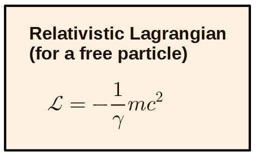

### Relativistic Energy (Total + Kinetic)

Next, we’ll want find expressions for energy in special relativity.

Now, when we’re typically analyzing energy in classical mechanics (and in many other areas of physics as well), the most reliable way is through **the Hamiltonian**.

This is explained much more in detail in my [article](https://profoundphysics.com/hamiltonian-mechanics-for-dummies/) on the basics of Hamiltonian mechanics, but essentially the rule of thumb is this; **the Hamiltonian of a system describes the energy of that particular system**.

Now, the most general form for the Hamiltonian function is (as explained in my Hamiltonian mechanics [article](https://profoundphysics.com/hamiltonian-mechanics-for-dummies/)):

$$H=\sum_i^{ }\frac{\partial \mathscr{L}}{\partial\dot{q}_i}\dot{q}_i-\mathscr{L}$$

The q’s with a dot here mean the time derivative of q (and q is the generalized position coordinate), i.e. *generalized velocity*. The summation over i means that we’re summing over each spacial dimension. The L is of course the Lagrangian that we defined earlier.

For our purposes here, we can define the generalized velocity as simply v and just look at the Hamiltonian in this form:

$$H=\frac{\partial \mathscr{L}}{\partial v}v-\mathscr{L}$$

Now, the Hamiltonian being the energy, we should be able to find an equation for the energy from this. In fact, this Hamiltonian is exactly equal to the energy:

$$E=\frac{\partial \mathscr{L}}{\partial v}v-\mathscr{L}$$

What you’ll get from this when inserting the Lagrangian from earlier is a formula for the **relativistic total energy**:

$$E=\gamma mc^2$$

Derivation of The Relativistic Energy Formula (click to see more)

$$E=\frac{\partial}{\partial v}\left(-mc^2\sqrt{1-\frac{v^2}{c^2}}\right)v-\left(-mc^2\sqrt{1-\frac{v^2}{c^2}}\right)$$

$$E=-mc^2\frac{\partial}{\partial v}\left(1-\frac{v^2}{c^2}\right)^{\frac{1}{2}}v+mc^2\sqrt{1-\frac{v^2}{c^2}}$$

Then, we just use the chain rule to take the derivative of this square root:

$$E=-mc^2\cdot\frac{1}{2}\left(1-\frac{v^2}{c^2}\right)^{-\frac{1}{2}}\cdot\left(-\frac{2v}{c^2}\right)v+mc^2\sqrt{1-\frac{v^2}{c^2}}$$

$$E=\frac{mv^2}{\sqrt{1-\frac{v^2}{c^2}}}+mc^2\sqrt{1-\frac{v^2}{c^2}}$$

$$E=\gamma mv^2+\frac{1}{\gamma}mc^2$$

This can actually be simplified even more. We can multiply and divide the second term by γ:

$$E=\gamma mv^2+\frac{1}{\gamma^2}\gamma mc^2$$

We can then insert 1/γ2 and see that some stuff cancels out:

$$E=\gamma mv^2+\left(1-\frac{v^2}{c^2}\right)\gamma mc^2\\E=\gamma mv^2+\gamma mc^2-\frac{v^2}{c^2}\gamma mc^2\\E=\gamma mv^2+\gamma mc^2-\gamma mv^2\\E=\gamma mc^2$$

Now, this formula may indeed look familiar, but let’s see how exactly. This can be done by something called a **Taylor series**.

**A Taylor series is essentially a way to approximate a function as a sum of infinitely many terms**. In the context of special relativity, we can use this to **expand the Lorentz factor as a Taylor series**.

The formula we use for this Taylor series is this:

$$f\left(x\right)=\sum_{n=0}^{\infty}\frac{d^nf\left(x\right)}{dx^n}\left(x=0\right)\frac{x^n}{n!}$$

This basically tells you to calculate derivatives of different order of the function, evaluate the derivatives at the point x=0 and then multiply by some stuff.

What you’ll get from this is a series that looks like this:

$$E=mc^2+\frac{1}{2}mv^2+\frac{3}{8}m\frac{v^4}{c^2}+\frac{5}{16}m\frac{v^6}{c^4}+...$$

Taylor Expansion For The Relativistic Energy (click to see more)

First of all, were going to define a variable **β=v/c** (to make things a little simpler), and so the Lorentz factor is then a function of β and takes the form:

$$\gamma\left(\beta\right)=\left(1-\beta^2\right)^{-\frac{1}{2}}$$

Then, the Taylor series formula for this is:

$$\gamma\left(\beta\right)=\sum_{n=0}^{\infty}\frac{d^n\gamma\left(\beta\right)}{d\beta^n}\left(\beta=0\right)\frac{\beta^n}{n!}$$

Let’s start by calculating the derivatives of γ at β=0. For example, the first derivative evaluated at β=0 gives:

$$\frac{d\gamma\left(\beta\right)}{d\beta}\left(\beta=0\right)=-\frac{1}{2}\left(1-\beta^2\right)^{-\frac{3}{2}}\cdot\left(-2\beta\right)=\beta\left(1-\beta^2\right)^{-\frac{3}{2}}=0\cdot\left(1-0\right)^{-\frac{3}{2}}=0$$

Now, you can do some of the higher order derivatives for yourself by using a calculator or by hand, whatever. This is essentially what you’ll get (for the first 6 derivatives):

$$\frac{d\gamma\left(\beta\right)}{d\beta}\left(\beta=0\right)=0\\\frac{d^2\gamma\left(\beta\right)}{d\beta^2}\left(\beta=0\right)=1\\\frac{d^3\gamma\left(\beta\right)}{d\beta^3}\left(\beta=0\right)=0\\\frac{d^4\gamma\left(\beta\right)}{d\beta^4}\left(\beta=0\right)=9\\\frac{d^5\gamma\left(\beta\right)}{d\beta^5}\left(\beta=0\right)=0\\\frac{d^6\gamma\left(\beta\right)}{d\beta^6}\left(\beta=0\right)=225$$

When taking these derivatives, there is a clear pattern here. The derivatives with **uneven order** (n=1,3,5…) are always 0, so we don’t have to worry about those terms.

Also, since the series starts at n=0, the 0th derivative is essentially just the function itself (γ) evaluated at the point β=0:

$$\gamma\left(\beta=0\right)=\left(1-0^2\right)^{-\frac{1}{2}}=1$$

So, putting it all together and expanding the sum (and ignoring the terms with n=1,3,5… since they go to zero), we get:

$$\gamma\left(\beta\right)=\sum_{n=0}^{\infty}\frac{d^n\gamma\left(\beta\right)}{d\beta^n}\left(\beta=0\right)\frac{\beta^n}{n!}\\=1\cdot\frac{\beta^0}{0!}+1\cdot\frac{\beta^2}{2!}+9\cdot\frac{\beta^4}{4!}+225\cdot\frac{\beta^6}{6!}+...$$

$$\gamma\left(\beta\right)=1+\frac{1}{2}\beta^2+\frac{3}{8}\beta^4+\frac{5}{16}\beta^6+...$$

Or putting back β=v/c:

$$\gamma\left(\beta\right)=1+\frac{1}{2}\frac{v^2}{c^2}+\frac{3}{8}\frac{v^4}{c^4}+\frac{5}{16}\frac{v^6}{c^6}+...$$

We can then write the relativistic energy in the following form:

$$\begin{aligned}E&=\gamma mc^2=mc^2\left(1+\frac{1}{2}\frac{v^2}{c^2}+\frac{3}{8}\frac{v^4}{c^4}+\frac{5}{16}\frac{v^6}{c^6}+...\right)\\E&=mc^2+\frac{1}{2}mc^2\frac{v^2}{c^2}+\frac{3}{8}mc^2\frac{v^4}{c^4}+\frac{5}{16}mc^2\frac{v^6}{c^6}+...\\E&=mc^2+\frac{1}{2}mv^2+\frac{3}{8}m\frac{v^4}{c^2}+\frac{5}{16}m\frac{v^6}{c^4}+...\end{aligned}$$

Okay, let’s look at the above series in more detail.

The first term is clearly some form of energy related to the mass of an object (also called **rest energy**). The other terms are energies related to the velocity, so they must be some sort of **kinetic energy** terms:

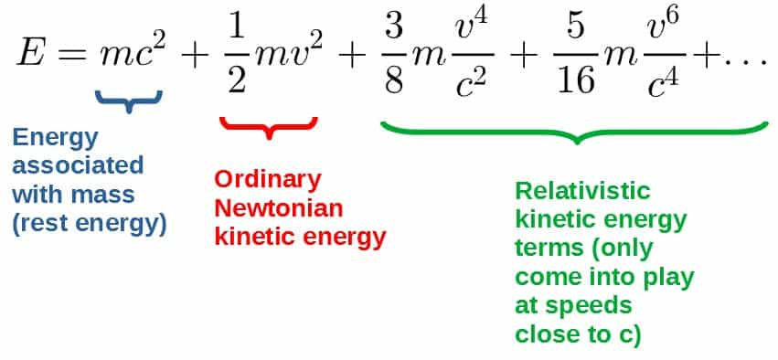

First of all, this equation tells us that an object has energy even if it is at rest and this energy is in the form of mass. So, **mass is actually just another form of energy**, which is a very important result of special relativity.

The second thing is that, actually, **the Newtonian equation for kinetic energy is only an approximation of the relativistic kinetic energy** and it only works at low velocities (velocities much slower than the speed of light).

This can be seen from the fact that if the velocities are slow compared to c, these terms with c’s in the denominator become essentially zero and the kinetic energy reduces to the ordinary ½mv2.

Now, it turns out that these relativistic “correction terms” to the kinetic energy only start becoming noticeable at around **10 % of the speed of light** (0.1c).

You can verify this yourself if you wish by simply plugging numbers in the relativistic formula and comparing the values to the Newtonian kinetic energy formula.

Now, from the above formula, we can actually find a nice equation for the **relativistic kinetic energy**. Let’s simply subtract mc2 from both sides:

$$E-mc^2=\frac{1}{2}mv^2+\frac{3}{8}m\frac{v^4}{c^2}+\frac{5}{16}m\frac{v^6}{c^4}+...$$

Now the right-hand side is simply just the kinetic energy. We can also plug back in E=γmc2, and we then have:

$$E_k=\gamma mc^2-mc^2\\E_k=mc^2\left(\gamma-1\right)$$

And that is the **relativistic formula for kinetic energy**. Next, we’ll look at the relativistic version of momentum and also how it relates to energy (it’ll also give us another way to derive E=mc2).

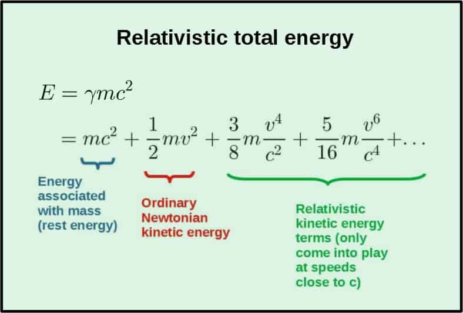

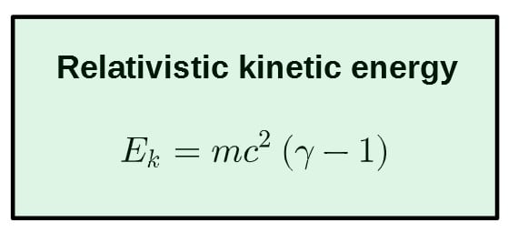

There is actually a way to derive the relativistic total energy formula (and relativistic momentum too) from something called **Noether’s theorem**, which you can read more about [here](https://profoundphysics.com/noethers-theorem-a-complete-guide/). The advantage of this approach is that it also proves the relativistic conservation laws for these automatically.

### Four-Momentum

Next, let’s consider something called 4-momentum. Essentially, **4-momentum is just the 4-vector (relativistic) analogue of the ordinary Newtonian momentum**.

Now, 4-momentum has huge importance in special relativity, as it actually gives a neat way to relate energy to momentum, which we’ll discover shortly.

First of all, in Newtonian mechanics, momentum is simply defined as mass multiplied by velocity, p=mv.

In special relativity, this is almost the case too, except that **4-momentum (pμ) is defined as mass multiplied by 4-velocity**, namely:

$$p^{\mu}=mu^{\mu}$$

Now, from this, we can look at what the components of the 4-momentum are. First of all, let’s consider the **spacial components** (μ=1,2,3):

$$p^1=mu^1\\p^2=mu^2\\p^3=mu^3$$

We can insert the spacial components of the 4-velocity into these, which are:

$$u^1=\gamma v_x\\u^2=\gamma v_y\\u^3=\gamma v_z$$

So, the **spacial components of the 4-momentum** are then:

$$p^1=\gamma mv_x\\p^2=\gamma mv_y\\p^3=\gamma mv_z$$

Typically, we combine the spacial components into just one term p (which is simply the ordinary **3-dimensional momentum**, except with the Lorentz factor to make it relativistically correct):

$$p=\gamma mv$$

Okay, now that we’ve got the spacial parts, let’s consider the **0-component of pμ** using the fact that u0=γc:

$$p^0=mu^0=\gamma mc$$

But what is γmc? It looks a lot like the relativistic energy, which we derived in the last section:

$$E=\gamma mc^2$$

In fact, γmc is simply the energy divided by the speed of light. So, the 0-component of the 4-momentum is actually:

$$p^0=\frac{E}{c}$$

So, all in all, we have the components of 4-momentum:

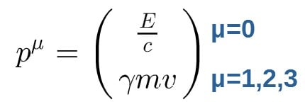

The next thing we want to do is to look at what happens if we construct **an invariant out of the 4-momentum**. Let’s start by using the invariant equation for the 4-velocity:

$$u_{\mu}u^{\mu}=c^2$$

Let’s multiply this by m2 on both sides:

$$m^2u_{\mu}u^{\mu}=m^2c^2$$

Or distributing the m’s like this:

$$mu_{\mu}mu^{\mu}=m^2c^2$$

Now, what are these terms on the left-hand side? They are just **the contravariant and covariant 4-momenta**:

$$p_{\mu}p^{\mu}=m^2c^2$$

Let’s then write out the sum on the left side, which gives:

$$\left(p^0\right)^2-\left(p^1\right)^2-\left(p^2\right)^2-\left(p^3\right)^2=m^2c^2$$

Now, we know that p1, p2 and p3 are simply the spacial components of momentum, which we can combine into one term p:

$$\left(p^0\right)^2-p^2=m^2c^2$$

Let’s now insert the component p0, which is E/c:

$$\left(\frac{E}{c}\right)^2-p^2=m^2c^2\\\frac{E^2}{c^2}=m^2c^2+p^2$$

Multiplying both sides by c2 and taking the square root, we get:

$$E^2=m^2c^4+p^2c^2\\E=\sqrt{m^2c^4+p^2c^2}$$

And this equation is known as the famous **energy-momentum relation**. Now, if the particle is at rest (i.e. p=0), the second term goes to zero and this reduces something very recognizable:

$$E=\sqrt{m^2c^4}\\E=mc^2$$

So, **the world-famous equation E=mc2 can actually be derived by multiplying together the contravariant and covariant versions of the 4-momentum**. How cool is that!

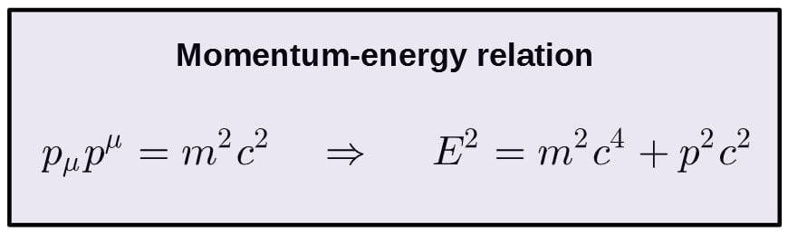

### Four-Forces + The Relativistic Work-Energy Theorem

Here I’m going to briefly go over the notion of 4-force, which is practically **the relativistic 4-vector form of the Newtonian concept of force**.

First of all, let’s think about how forces are defined in Newtonian physics. A regular 3-dimensional force is simply defined as the time derivative of momentum (i.e. Newton’s second law):

$$F=\frac{dp}{dt}=ma$$

Now, you might already guess what the **4-force (Fµ)** could be defined as. It is simply **the proper time derivative of 4-momentum** (or mass multiplied by 4-acceleration, but we’ll use the former definition):

$$F^{\mu}=\frac{dp^{\mu}}{d\tau}$$

By this definition, we can easily find the components of the 4-force. First, let’s look at the **spacial components** (µ=1,2,3). The associated 4-momentum components are (from the 4-momentum section):

$$p^1=\gamma mv_x=p_x\\p^2=\gamma mv_y=p_y\\p^3=\gamma mv_z=p_z$$

Now we just take the proper time derivative of these to get the 4-force components (we’ll want to express them as ordinary time derivatives though):

$$F^1=\frac{dp_x}{d\tau}=\gamma\frac{dp_x}{dt}\\F^2=\frac{dp_y}{d\tau}=\gamma\frac{dp_y}{dt}\\F^3=\frac{dp_z}{d\tau}=\gamma\frac{dp_z}{dt}$$

These ordinary time derivatives here are simply just **the Newtonian forces in each spacial direction** (for example, dpx/dt is simply Fx). We can just write all of these terms into one like this:

$$F=\gamma\frac{dp}{dt}$$

Now then, let’s look at the **0-component of the 4-force**. For this, we’ll need the 0-component of 4-momentum, which is:

$$p^0=\frac{E}{c}$$

The 0-component of 4-force is then just the proper time derivative of this:

$$F^0=\frac{dp^0}{d\tau}=\frac{1}{c}\frac{dE}{d\tau}=\frac{1}{c}\gamma\frac{dE}{dt}$$

Now, what is dE/dt (i.e. change of energy with respect to time) actually? It is simply **power**. So, **the 0-component of 4-force is power** (divided by the speed of light).

We then have all of the **components of the 4-force**:

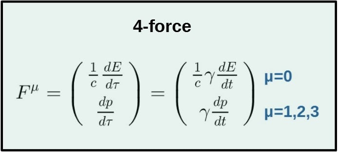

The next thing I want to consider is what happens if we **construct an invariant out of the 4-force**. To do this, let’s multiply together the **contravariant and covariant 4-forces** and write out the sum, which gives:

$$F_{\mu}F^{\mu}=\left(F^0\right)^2-\left(F^1\right)^2-\left(F^2\right)^2-\left(F^3\right)^2$$

Inserting the components, we get (and also combining F1, F2 and F3 into one term):

$$F_{\mu}F^{\mu}=\left(\frac{1}{c}\frac{dE}{d\tau}\right)^2-\left(\frac{dp}{d\tau}\right)^2\\F_{\mu}F^{\mu}=\frac{1}{c^2}\frac{\left(dE\right)^2}{\left(d\tau\right)^2}-\frac{\left(dp\right)^2}{\left(d\tau\right)^2}$$

Now let’s multiply both sides by (dτ)2 and by c2:

$$F_{\mu}F^{\mu}c^2\left(d\tau\right)^2=\left(dE\right)^2-c^2\left(dp\right)^2$$

Or the left-hand side written like this:

$$cF_{\mu}d\tau cF^{\mu}d\tau=\left(dE\right)^2-c^2\left(dp\right)^2$$

Let’s now look more closely at this cFµdτ -term, in particular what the different values for µ will give. First, if we set µ=0, this gives (inserting the F0-component):

$$cF^0d\tau=c\left(\frac{1}{c}\frac{dE}{d\tau}\right)d\tau=dE$$

Now, what is dE? The d here stands for a tiny change, so dE means some small change in energy. But what is the change in energy? It is simply the **work** done in the system to change its energy (dW). So, this then becomes:

$$cF^0d\tau=dW$$

Now, let’s set µ=1:

$$cF^1d\tau=c\left(\frac{dp_x}{d\tau}\right)d\tau=cdp_x$$

What is this thing then? It’s the change in the x-momentum (multiplied by c), but what’s the change in momentum defined as? It is **impulse**. So, this is simply the impulse in the x-direction (dIx) multiplied by c:

$$cF^1d\tau=cdI_x$$

The same goes for the y and z-directions too, which give cdIy and cdIz.

Now here comes the interesting part. We can actually combine these quantities into a new 4-vector called the **impulse-work 4-vector** or **4-impulse** (there doesn’t seem to be a widely accepted term for this quantity, but I’ll call it 4-impulse since it sounds quite cool and also descriptive!)

This 4-impulse (denoted by dWµ) thing is simply defined as:

$$dW^{\mu}=cF^{\mu}d\tau$$

It’s components are:

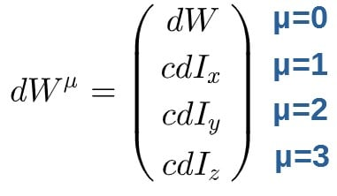

We can then write the equation from earlier with these 4-impulse vectors:

$$cF_{\mu}d\tau cF^{\mu}d\tau=\left(dE\right)^2-c^2\left(dp\right)^2\\dW_{\mu}dW^{\mu}=\left(dE\right)^2-c^2\left(dp\right)^2$$

Now, let’s look at this right-hand side of the equation. We clearly have something with *energy and momentum* and it has this invariant form (difference of squares). Let’s write it in this way, so it’s easier to see what this actually is:

$$\left(dE\right)^2-c^2\left(dp\right)^2=c^2\left(\frac{dE}{c}\right)^2-c^2\left(dp\right)^2$$

That’s quite interesting. It’s something with E/c as well as the momentum p. It is simply the **4-momentum**! Well, almost. It is a **small change in the 4-momentum (dpµ)** multiplied by c.

And more accurately, this right hand-side is **the invariant form of the small changes in 4-momentum** (contravariant and covariant multiplied together):

$$\left(dE\right)^2-c^2\left(dp\right)^2=cdp_{\mu}cdp^{\mu}=c^2dp_{\mu}dp^{\mu}$$

We can then write equation form earlier as:

$$dW_{\mu}dW^{\mu}=c^2dp_{\mu}dp^{\mu}$$

This equation is **the relativistic equivalent of the work-energy theorem**. Now, I don’t know what this equation is actually called, so I’m going to call it the **relativistic 4-impulse-momentum theorem**.

If you wanted to write the equation out in full detail, it would be like this:

$$\left(dW\right)^2-c^2\left(dI_x\right)^2-c^2\left(dI_y\right)^2-c^2\left(dI_z\right)^2=\left(dE\right)^2-c^2\left(dp_x\right)^2-c^2\left(dp_y\right)^2-c^2\left(dp_z\right)^2$$

From this we can see that if the momentum doesn’t change this reduces to just dW=dE, which is the ordinary **work-energy theorem**.

Equivalently, if only the momentum changes, this becomes simply dI=dp (by combining all of the components into single terms), which is just the ordinary **impulse-momentum theorem**.

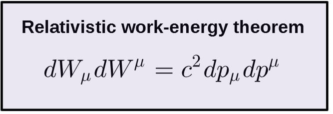

### Practical Example: Relativistic Lorentz Force Law

Now, I’ve been talking a lot about formulating different laws of physics into a relativistically correct form, but so far, we’ve only gone over the basic concepts.

Here, I would like to show how the ordinary Newtonian laws of physics could be formulated into their relativistic versions, by going over an actual practical example.

We’re going to discuss briefly a relativistic force law that is equivalent to the ordinary **Lorentz force law**, which is a force that is produced by **electric and magnetic fields**.

Classically, the Lorentz force is given by the equation (where q is the charge of the particle affected by the force, v is its velocity, E and B are the electric and magnetic fields):

$$F=qE+qv\times B$$

Now, this equation can not be quite correct when taking special relativity into account. The reason for this is that **the ordinary velocity, the electric field and the magnetic field are actually all relative**.

Therefore, this form of the force law is also relative, which doesn’t make for a good law of physics. Now, a relativistically invariant form for this law can actually be derived from the **relativistic action principle**, which we discussed earlier.

Before, we consider the relativistic Lorentz force law, however, I’ll have to introduce something called **vector potential** and **scalar potential**. First of all, we know that magnetic and electric fields are vector quantities, i.e. they are **vector fields**.

**Vector fields, in general, are derived from quantities known as vector potentials and scalar potentials**. Thus, electric and magnetic fields are actually derived from vector and scalar potentials.

Now, the odd thing is that vector and scalar potentials are actually not unique in the sense that you can always change their value but still get the same answer.

The reason for this is that **electric and magnetic fields are defined in terms of changes (derivatives) of these scalar and vector potentials**, not in terms of exact values of them.

Therefore, the values of the scalar and vector potential are not by themselves important, only the changes in them.

Mathematically, **the electric field is defined in terms of a scalar potential called electric potential (φ) and a vector potential called magnetic vector potential (A)**:

$$\vec{E}=-\nabla\varphi-\frac{\partial\vec{A}}{\partial t}=-\frac{\partial\varphi}{\partial x}-\frac{\partial\varphi}{\partial y}-\frac{\partial\varphi}{\partial z}-\frac{\partial\vec{A}}{\partial t}$$

**The magnetic field, on the other hand, is defined as the curl of the magnetic vector potential (A)**:

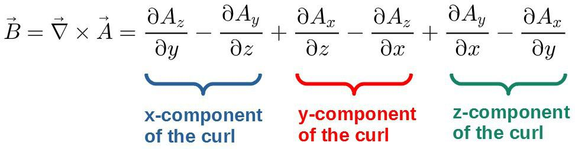

Okay, the reason I wanted to discuss these is that we’ll need these definitions soon and it is worthwhile to explicitly state them.

Now, let’s get back to relativity. In special relativity, quantities are commonly combined into 4-vector quantities and in fact, the same goes for the electric and magnetic potentials as well.

**The electric potential and the magnetic vector potential can be combined into a single 4-vector quantity called the electromagnetic 4-potential**. It is denoted by Aµ and it has the components:

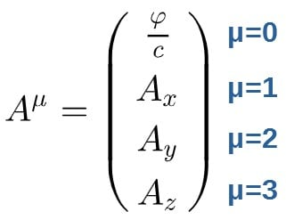

Here, φ stands for the electric potential, c for the speed of light and the A’s for the components of the magnetic vector potential.

Now, I won’t actually derive the following equation here right now as it would probably require a whole article by itself. Instead, I’ll tell you what the relativistic Lorentz force law is and we’ll go over what it actually means.

The **relativistic equivalent for the Lorentz force law** is:

$$F^{\mu}=qu_{\nu}F^{\mu\nu}$$

It looks quite simple, doesn’t it, but what are all these things here?

Well, first of all, **Fµ is of course the 4-force** as you’d probably expect. **The q here is simply the electric charge** (a constant) of the object we’re considering and **uν is the 4-velocity** (its covariant form, we’ll come to this shortly).

Now, Fµν here is something called the **electromagnetic field tensor** (not to be confused with 4-force, which is denoted by F with only one index).

This field tensor is basically a collection of objects, which are all of the components of the electric and magnetic fields. So, **the electromagnetic field tensor is an object that describes every component of both the electric and magnetic fields** (i.e. the electromagnetic field).

Both of the indices µ and ν go from 0 to 3, just like we’re used to in relativity. So, this tensor really has *16 different components* (although 4 of them are actually zero, but we’ll come to it soon).

Now, this tensor is really **a function of the 4-gradient of the electromagnetic 4-potential**. This is how it is mathematically defined:

$$F^{\mu\nu}=\partial^{\mu}A^{\nu}-\partial^{\nu}A^{\mu}$$

I’ll just quickly remind you of the components of the *4-potential* as well as the *4-gradient* (we’re interested in the contravariant form of the 4-gradient, which had negative space components):

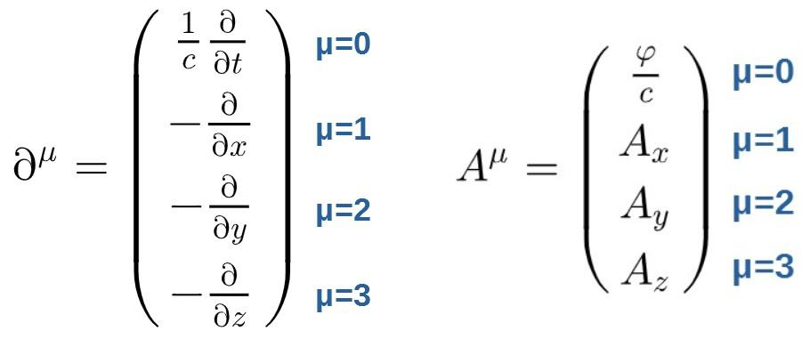

Okay then, let’s actually take a look at the components of the electromagnetic field tensor. First, we’ll set µ=0 and run over ν=1,2,3. This is what you’ll get for the first one (µ=0 and ν=1):

$$F^{01}=\partial^0A^1-\partial^1A^0=\frac{1}{c}\frac{\partial}{\partial t}A_x-\left(-\frac{\partial}{\partial x}\frac{\varphi}{c}\right)=\frac{1}{c}\frac{\partial A_x}{\partial t}+\frac{1}{c}\frac{\partial\varphi}{\partial x}$$

Now let’s express it in this form:

$$F^{01}=-\frac{1}{c}\left(-\frac{\partial A_x}{\partial t}-\frac{\partial\varphi}{\partial x}\right)$$

But what is this thing involving a time derivative of the magnetic vector potential and a space derivative of the electric potential? This thing in the brackets is simply the **x-component of the electric field** (go back to the definition for the electric field shown earlier).

Then this component of the EM field tensor becomes the **negative x-component of the electric field divided by the speed of light**:

$$F^{01}=-\frac{E_x}{c}$$

The same also goes for the two other values of ν (ν=2 and ν=3), we just get the y- and z-components of the electric field:

$$F^{02}=\frac{1}{c}\frac{\partial A_y}{\partial t}+\frac{1}{c}\frac{\partial\varphi}{\partial y}=-\frac{E_y}{c}\\F^{03}=\frac{1}{c}\frac{\partial A_z}{\partial t}+\frac{1}{c}\frac{\partial\varphi}{\partial z}=-\frac{E_z}{c}$$

Now, if you interchange the order of µ and ν (i.e. set ν=0 and let µ go from 1 to 3), you’ll get the same thing but with an *opposite sign*:

$$F^{10}=-\frac{1}{c}\frac{\partial\varphi}{\partial x}-\frac{1}{c}\frac{\partial A_x}{\partial t}=\frac{E_x}{c}\\F^{20}=-\frac{1}{c}\frac{\partial\varphi}{\partial y}-\frac{1}{c}\frac{\partial A_y}{\partial t}=\frac{E_y}{c}\\F^{30}=-\frac{1}{c}\frac{\partial\varphi}{\partial z}-\frac{1}{c}\frac{\partial A_z}{\partial t}=\frac{E_z}{c}$$

It’s also worth noting that each of the components of the EM tensor where µ=ν are simply zero, which is easy to see from its definition.

Next, let’s look at what happens if we have both of the indices as **spacial indices** (i.e. µ=1,2,3 and ν=1,2,3). First, for µ=1 and ν=2, we have:

$$F^{12}=-\frac{\partial A_y}{\partial x}-\left(-\frac{\partial A_x}{\partial y}\right)=-\left(\frac{\partial A_y}{\partial x}-\frac{\partial A_x}{\partial y}\right)$$

Now, go back and look at the picture from earlier, which had the components of the magnetic field. This thing inside the parentheses is simply the **z-component of the curl of the vector potential, which is the z-component of the magnetic field**.

So, this component of the EM tensor is simply the negative z-component of the magnetic field:

$$F^{12}=-B_z$$

The same story goes for the other cases where both µ and ν are spacial indices (1,2,3). You get **components of the magnetic field, but with different signs**. If you wish, you can calculate the rest of the components by yourself.

All of these components of the EM tensor can in fact be collected into a 4×4 matrix. All in all, we then have **the electromagnetic field tensor** in its full relativistic glory:

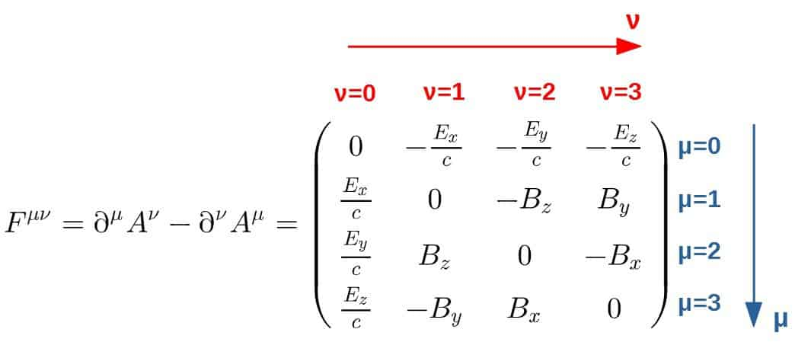

Now, let’s get back to the Lorentz force law now that we have the basic idea of the EM tensor. The relativistic Lorentz force equation was:

$$F^{\mu}=qu_{\nu}F^{\mu\nu}$$

The 4-velocity uν here is a covariant 4-vector. Earlier we discussed only the contravariant version of the 4-velocity, but to change into a covariant, you use the Minkowski metric, which in effect simply just changes the sign of the spacial components.

So, uν is defined as:

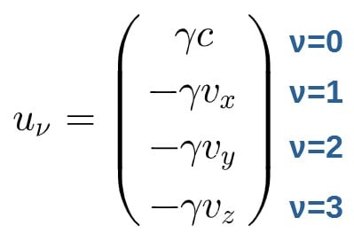

Okay then, let’s first consider the spacial components of the Lorentz force (µ=1,2,3). Remember that ν is simply a **summation index** in the Lorentz force equation (based on the Einstein summation convention).

So, let’s first set µ=1 and sum over all the values of ν:

$$F^1=qu_0F^{10}+qu_1F^{11}+qu_2F^{12}+qu_3F^{13}$$

Let’s now insert all of the components for the 4-force, the 4-velocity and the EM tensor:

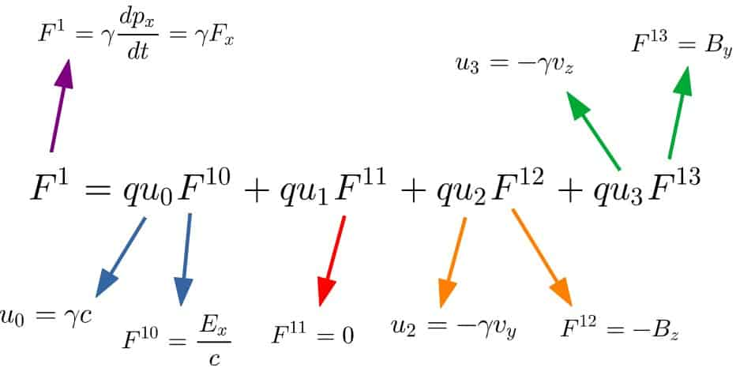

$$\gamma F_x=q\gamma c\frac{E_x}{c}+0+q\left(-\gamma v_y\right)\left(-B_z\right)+q\left(-\gamma v_z\right)B_y$$

We can simplify this and divide both sides by γ:

$$F_x=qE_x+qv_yB_z-qv_zB_y$$

If you’ve ever seen the components of the Lorentz force, this is indeed the correct **x-component** for the force that a particle with charge q would experience in an electromagnetic field.

For the other spacial values of µ (µ=1,2), you simply get the y- and z-components of the force. I’m not going to go over those in detail, since it’s exactly the same process as above, but this is what you’ll get:

$$F_y=qE_y-qv_xB_z+qv_zB_x\\F_z=qE_z+qv_xB_y-qv_yB_x$$

Now, the more surprising result will be the 0-component of this force (when we set µ=0). Let’s write out this sum:

$$F^0=qu_0F^{00}+qu_1F^{01}+qu_2F^{02}+qu_3F^{03}$$

Here the only thing we have to remember is that the 0-component of the force was actually:

$$F^0=\frac{1}{c}\gamma\frac{dE}{dt}$$

From here, it’s only a matter of inserting all of the components. Doing that, we get:

$$\frac{1}{c}\gamma\frac{dE}{dt}=0+q\gamma v_x\frac{E_x}{c}+q\gamma v_y\frac{E_y}{c}+q\gamma v_z\frac{E_z}{c}$$

We can simplify this by multiplying by c and dividing by γ:

$$\frac{dE}{dt}=qv_xE_x+qv_yE_y+qv_zE_z$$

Now, remember that the components of v here are simply the ordinary velocities (time derivatives of x, y and z):

$$v_x=\frac{dx}{dt}\\v_y=\frac{dy}{dt}\\v_z=\frac{dz}{dt}$$

We can then write the equation with these:

$$\frac{dE}{dt}=q\frac{dx}{dt}E_x+q\frac{dy}{dt}E_y+q\frac{dz}{dt}E_z$$

Then, simply multiply both sides by dt and we end up with:

$$dE=qE_xdx+qE_ydy+qE_zdz$$

Now, what is dE, an infinitesimal change in the energy again? It is simply the work done, dW:

$$dW=qE_xdx+qE_ydy+qE_zdz$$

This equation is indeed **the work done by the electric field**. If you want it in a more recognizable form, you can combine all of the components of the electric field into just one term (E) as well as combine all of the components of the spacial displacements into one term (dr):

$$dW=qE\cdot dr$$

Then, we simply integrate both sides and get:

$$\int_{ }^{ }dW=\int_{ }^{ }qE\cdot dr\\W=q\int_{ }^{ }E\cdot dr$$

And this is indeed the standard equation for the work done by an electric field. As you can see, this doesn’t include any magnetic field components, which is because **magnetic fields don’t do any work**.

Anyway, the fascinating thing about this is that once again, the relativistic formulation and 4-vectors give us a neat way to combine things, both the work equation and the different components of the Lorentz force, into one simple equation, **the relativistic Lorentz force law**.

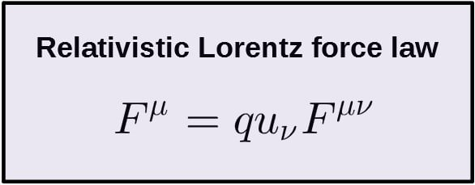

---

## Summary

I realize this article turned out quite long, so I made a short video summary to highlight most of the key points we covered. You can watch it below:

Now, something I also want to address is that there are certainly also some things that I left out on purpose in this article, since there just wasn’t enough room to cover everything.

For example, I did not discuss things like the energies and momenta for massless particles like photons. The reason I didn’t is because I actually have a whole article on this topic, which can be found [here](https://profoundphysics.com/if-photons-have-no-mass-how-can-they-have-momentum/).

If you’re looking to study more of special relativity or any related topic, I’d highly recommend checking out the **[Profound Physics course platform](https://courses.profoundphysics.com/)**, where you’ll find full courses on various topics, ranging everywhere in between beginner-focused to more advanced.

---

*← [Back to the full archive](../index.html)*
