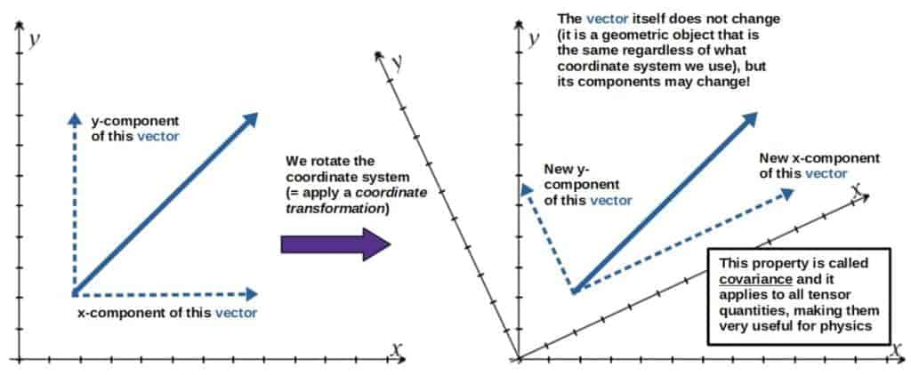
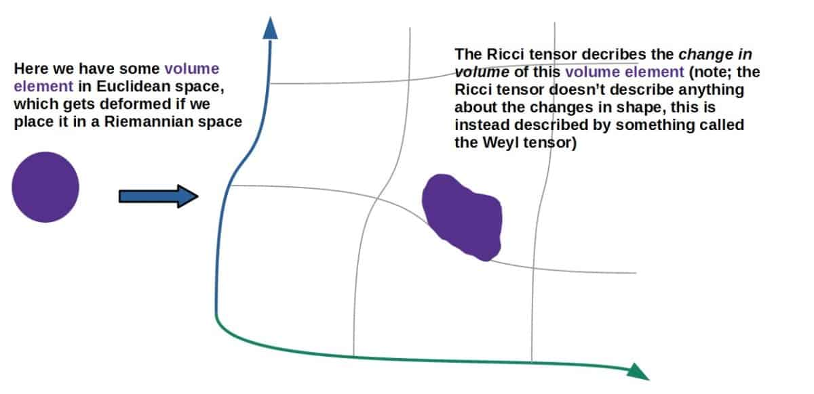
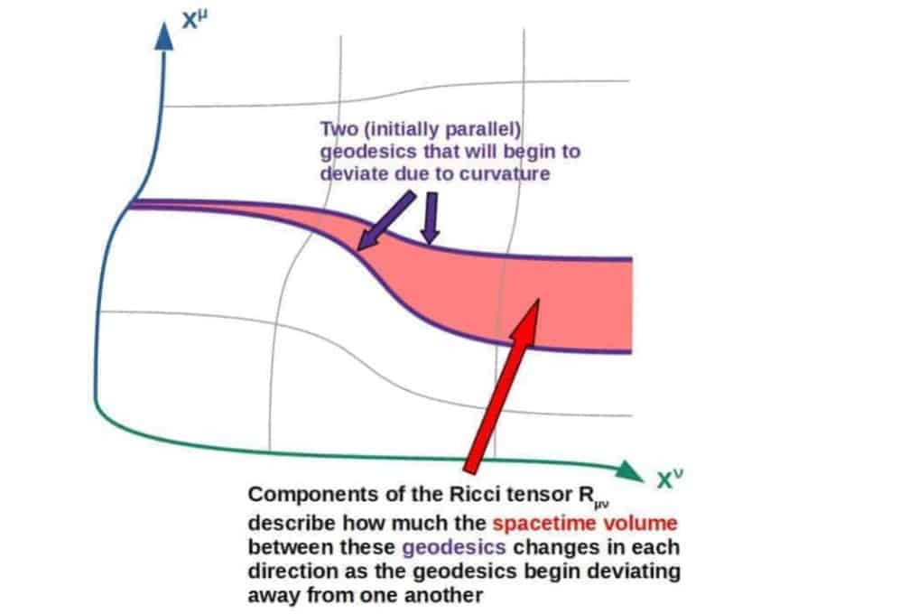
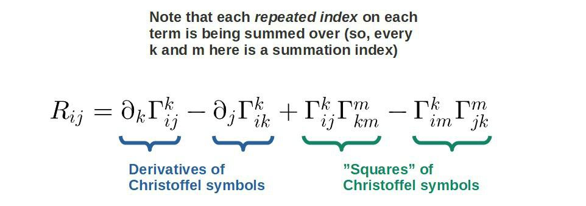
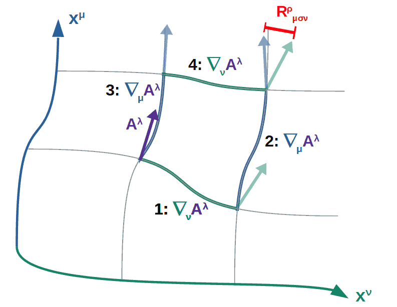

# The Ricci Tensor: A Complete Guide With Examples

> An important object in differential geometry that also shows up a lot in general relativity.

*Originally published at [profoundphysics.com](https://profoundphysics.com/the-ricci-tensor/).*

---

The Ricci tensor is an important mathematical object used in differential geometry that also shows up a lot in the general theory of relativity, among other things. But what does it actually represent?

**The Ricci tensor represents how a volume in a curved space differs from a volume in Euclidean space. In particular, the Ricci tensor measures how a volume between geodesics changes due to curvature. In general relativity, the Ricci tensor represents volume changes due to gravitational tides.**

Now, what does all of the above stuff actually mean? In this article I’ll be going over exactly that. We’ll also be looking at some properties of the Ricci tensor as well as practical examples of some commonly used Ricci tensors.

In case you’d want an **ad-free PDF version of this article** (an my other general relativity articles), you’ll find it [here](https://courses.profoundphysics.com/p/general-relativity-bundle), available as part of my full General Relativity Bundle.

## What Are Tensors, Intuitively?

Essentially, tensors are mathematical objects that are used in many areas of physics (in general relativity, for example, because they have some very useful **transformation properties**) and also in many areas of mathematics (for example, differential geometry).

The key property of tensors is that **a tensor is always the same in every coordinate system** (in a technical sense, we say that a tensor transforms covariantly).

First of all, what is a tensor anyway? **A tensor is simply a “collection of objects” (these objects are its tensor components) whose components transform in a nice, predictable way between coordinate changes, while the tensor itself remains unchanged**.

A nice intuitive way to understand this is by looking at how a vector behaves under coordinate changes (a vector is, in fact, a tensor of “rank 1”):

Mathematically, the transformation law of the components of a tensor is as follows:

$$T'_{ij}=\frac{\partial x^m}{\partial x'^i}\frac{\partial x^n}{\partial x'^j}T_{mn}$$

Note that this is the transformation law for a tensor that has two downstairs indices. A different tensor generally follows the same pattern (there is one of these partial derivatives of the coordinates -terms for each index).

In fact, this often works as the *definition* of a tensor. So, **we can simply define a tensor as any mathematical object whose components transform by the transformation law given above**.

Now, a mathematician might say that the definition of a tensor is something more like “a multilinear map from vectors and dual vectors to real numbers”.

If you really want to be accurate and are interested in abstract mathematics, then sure, this definition would be more precise. However, for physics and most physical applications, the definition of a tensor through its transformation properties is perfectly good.

A tensor is typically represented by its components, which we simply write as either downstairs or upstairs indices. These different indices correspond to the different **tensor components**.

**In general relativity, these indices are usually Greek letters** and they run from 0 to 3 (the 0-component corresponds to time, while 1, 2 and 3 corresponds to the three spacial directions). **In mathematics, it’s typical to use Latin indices**, such as i and j.

These tensor components can be nicely represented as a “table” as follows (more accurately, this is called the “matrix representation of a tensor” and it really only works for a two-index tensor, such as the Ricci tensor):

$$T_{\mu\nu}=\begin{pmatrix}T_{00}&T_{01}&T_{02}&T_{03}\\T_{10}&T_{11}&T_{12}&T_{13}\\T_{20}&T_{21}&T_{22}&T_{23}\\T_{30}&T_{31}&T_{32}&T_{33}\end{pmatrix}$$

These T’s here are the components of this tensor Tµν. For example, T01 is the component where µ=0 and ν=1.

Now, enough about the general properties of tensors. What we’re really interested in is the **Ricci tensor**. The Ricci tensor is a tensor (as you may have guessed by now) with two indices, denoted as Rij (if you’re talking about general relativity, these indices would be Greek letters).

Now, sure, the Ricci tensor is a tensor, but what does it actually represent? Luckily, there is a pretty nice **geometric interpretation** of the Ricci tensor, which we’ll talk about next.

**Quick tip**: For building a deep understanding of tensor mathematics, I’d highly recommend a good, dedicated resource on the topic. For this, I think you would find my **[Mathematics of General Relativity: A Complete Course](https://courses.profoundphysics.com/p/mathematics-of-general-relativity)** (link to the course page) a very good beginner-friendly choice. The course will guide you through **everything you need to know about tensor calculus** from the very ground up. There are also tons of practice problems and physics examples included.

## Geometric Interpretation of The Ricci Tensor

The Ricci tensor is one of the central mathematical objects in the field of **differential geometry**. This, of course, relates the Ricci tensor directly to geometry in some way. So, what then is the geometric interpretation of the Ricci tensor?

**The geometric interpretation of the Ricci tensor is that it describes how much a volume element would differ in curved space compared to Euclidean or flat space. Different components of the Ricci tensor describe how the volume element evolves as one moves along a geodesic in any given direction.**

By curved space, I’m essentially referring to a Riemannian manifold, which to put it simply, is just a space in which the basis vectors may vary from place to place (and the geometry of that space is described by a metric tensor).

A nice way to visualize what the Ricci tensor describes is by taking some “volume element” in Euclidean space (this is simply your original Cartesian coordinate system, for example) and imagine placing it in a Riemannian space.

The Ricci tensor would then, in some sense, tell you **how much the volume of this volume element changes**.

 

I’m aware that this picture is a little bit “sketchy”, so don’t take it too literally. It should simply give you the basic idea of what the Ricci tensor does.

There is a very nice way to actually see **why the Ricci tensor describes these volume changes**, which is by looking at small differences in the metric of a Riemannian space compared to the metric of a Euclidean space.

**Recommendation**: If you’re not familiar with the metric before, definitely check out my [full article](https://profoundphysics.com/metric-tensor-a-complete-guide-with-examples/) covering everything you need to know about it. You’ll learn about both the geometry behind the metric as well as its uses in general relativity.

This idea can then be extended to volume elements also, and you’ll, in fact, find the Ricci tensor appearing here. The proof can be found below.

Mathematical Proof: Why The Ricci Tensor Describes Volume Changes

The first thing we’ll do is consider expanding the metric (the metric *along a geodesic*, to be exact).

The first term will be just the Euclidean metric (Kronecker delta), but if the space is curved, there will be higher order terms containing the coordinates (x’s) and the Riemann tensor (a four-index tensor R, which describes the curvature of the space completely):

$$g_{ij}=\delta_{ij}+\frac{1}{3}R_{ikmj}x^kx^m+...$$

Now, let’s take the natural logarithm on both sides (you’ll see why soon):

$$\ln\left(g_{ij}\right)=\ln\left(\delta_{ij}+\frac{1}{3}R_{ikmj}x^kx^m+...\right)$$

This is useful, since it allows us to expand the natural logarithm as a Taylor series:

$$\ln\left(1+x\right)=x+...\ \ \Rightarrow\ \ \ln\left(g_{ij}\right)=\frac{1}{3}R_{ikmj}x^kx^m+...$$

A useful property of the Riemann tensor is that its last two indices can be exchanged with the cost of a minus sign (this form of the Riemann tensor is needed later), meaning that $R_{ikmj}=-R_{ikjm}$. We then have:

$$\ln\left(g_{ij}\right)=-\frac{1}{3}R_{ikjm}x^kx^m+...$$

Now, let’s take the trace on both sides. In the language of tensor calculus, **the trace of the Riemann tensor is defined as the Ricci tensor**, Rkm (if you want to be technical, the trace of the Riemann tensor is obtained by “contracting” the first and third indices, i and j in this case, with the metric). From this, we get the Ricci tensor on the right-hand side:

$$Tr\ln\left(g_{ij}\right)=-\frac{1}{3}R_{km}x^kx^m+...$$

We’ll now make use of a nice result from linear algebra, which is that **the trace of the logarithm of something is the logarithm of the determinant of the something** (this is why we wanted to take the logarithm of the metric in the first place!). In our case, this would be:

$$Tr\ln\left(g_{ij}\right)=\ln\left(\left|g\right|\right)\ \ \Rightarrow\ \ \left|g\right|=e^{Tr\ln\left(g_{ij}\right)}$$

Then, we’ll use the Taylor expansion of ex here to expand this exponential as $e^x=1+x+…$:

$$\left|g\right|=e^{Tr\ln\left(g_{ij}\right)}=1+Tr\ln\left(g_{ij}\right)+...=1-\frac{1}{3}R_{km}x^kx^m$$

We then need to do only one last thing. Let’s take the square root of this determinant of the metric. This will be useful because we can again expand the square root of 1+something as a Taylor series of the form $\sqrt{1+x}=1+\frac{1}{2}x+…$.

If we do this, the Taylor expansion for the square root of the determinant will give us:

$$\sqrt{\left|g\right|}=\sqrt{1-\frac{1}{3}R_{km}x^kx^m+...}=1-\frac{1}{6}R_{km}x^kx^m+...$$

Now, the reason we did all these steps is because the volume element in a Riemannian space actually has this square root term:

$$dV_R=\sqrt{\left|g\right|}dx^1dx^2dx^3...dx^n$$

The product of these dx’s here is simply the ordinary volume element (the volume element in Euclidean space; for example, in a 3D -Cartesian coordinate system, a volume element would simply be dV=dxdydz). We’ll denote this **Euclidean volume element** by dV:

$$dV=dx^1dx^2dx^3...dx^n\ \ \Rightarrow\ \ dV_R=\sqrt{\left|g\right|}dV$$

We can then insert our formula for this square root thing and we get:

$$dV_R=\left(1-\frac{1}{6}R_{km}x^kx^m+...\right)dV$$

This is indeed exactly why the Ricci tensor (Rkm) describes the difference in a Euclidean volume element (dV) compared to a Riemannian volume element (dVR).

Now, this thing in the parentheses only has one “expansion term” here, so if you were to include higher order terms (meaning terms which contain third, fourth etc. powers of the coordinates x; this here only has second powers) here, you’d find terms which have *covariant derivatives* of the Ricci tensor.

## Physical Meaning of The Ricci Tensor

Now, the Ricci tensor is useful for describing curvature mathematically, but does it also have a specific physical meaning?

**The physical meaning of the Ricci tensor is that it describes how much the spacetime volume of an object changes due to gravitational tides in general relativity. This is because geometrically, the Ricci tensor describes volume changes due to curvature and spacetime curvature is equated to tidal forces.**

First of all, to understand all this, let’s think of how the Ricci tensor actually encodes information about changes in *spacetime* volume.

**In general relativity, all objects move through spacetime along geodesics** (a geodesic, in a simple sense, is just the “shortest distance between two spacetime points”).

I explain geodesics and really all the important points about general relativity in my [introductory article on general relativity](https://profoundphysics.com/general-relativity-for-dummies/).

Now imagine you have two different geodesics (that start parallel to each other).

If the spacetime is curved (in general relativity, this means that there is gravity present), these geodesics may begin deviating from one another.

These geodesics will also, at all times, enclose some kind of volume in spacetime between them.

Geometrically, **the Ricci tensor then describes how much this spacetime volume changes as you move along these geodesics**. This is actually what we already talked about earlier.

 

Here we have a two-dimensional spacetime (since I can’t really draw a four-dimensional spacetime, but the basic idea is still the same) with two geodesics that enclose a volume between them (practically it’s an area since we’re in two dimensions, but you can imagine it as a volume).

Let’s now think of the physical implications of this. In particular, let’s think of a physical object with some well-defined volume (a ball for example).

In spacetime, *all the different parts of the object will follow their own geodesics through spacetime* (essentially, you can think of every atom of an object following its own spacetime geodesic).

Therefore, **if curvature is present, these geodesics may begin deviating from one another** and the spacetime volume between them will change.

Physically, this means that **the object will get stretched and squeezed** in different directions.

This squeezing and stretching, on the other hand, corresponds to the effect of **tidal forces**, which are simply the result of geodesic deviation (tidal forces and geodesic deviation is explained in more detail in my [general relativity article](https://profoundphysics.com/general-relativity-for-dummies/)).

So, **the physical description of the Ricci tensor is how much the spacetime volume of an object changes due to gravitational tidal forces**.

Also, note that the object gets deformed in *spacetime*, not just in the usual three-dimensional space, so, in fact, the object will also get *stretched or squeezed in time*. This effect is called gravitational time dilation.

As a sidenote, I have an [article](https://profoundphysics.com/why-time-slows-down-near-a-black-hole/) discussing **gravitational time dilation near a black hole**. The interesting thing about it is that there is actually a subtle *geometric explanation* of gravitational time dilation that ties really nicely with all the other geometric concepts used in general relativity.

**Recommendation**: In case this section involving general relativity seemed intriguing to you, you may also find my **[complete guide on learning general relativity on your own](https://profoundphysics.com/how-to-learn-general-relativity-a-step-by-step-guide/)** interesting. In there, I give some of my recommended resources for self-studying as well as what to expect.

## Ricci Tensor In Terms of Christoffel Symbols

Now that we’ve talked about what the Ricci tensor represents, it’s time to discuss some of its properties. In particular, how is the Ricci tensor defined?

Essentially, **the Ricci tensor is defined in terms of mathematical objects called Christoffel symbols in the following way**:

These Christoffel symbols are defined in terms of the metric tensor of a given space and its derivatives:

$$\Gamma_{ij}^k=\frac{1}{2}g^{km}\left(\partial_jg_{mi}+\partial_ig_{mj}-\partial_mg_{ij}\right)$$

**Recommendation**: I actually have a whole article discussing the **Christoffel symbols** and their meaning, which you’ll find [here](https://profoundphysics.com/christoffel-symbols-a-complete-guide-with-examples/). In there, I go into much more detail on the **geometric and physical interpretations** of the Christoffel symbols as well as how to **calculate them in practice** through a little-known but extremely powerful method.

Now, since the Ricci tensor is built out of the Christoffel symbols (which, on the other hand, is built out of the metric), this means that the Ricci tensor is actually comprised of **products of the metric tensor, products of derivatives of the metric and also second derivatives of the metric**.

In principle, you could write down the Ricci tensor completely in terms of the metric only, but this would give you a horrendously complicated formula.

If you want to get a sense of what this looks like, you can check out [this page](https://profoundphysics.com/einstein-field-equations-fully-written-out-what-do-they-look-like-expanded/) which has the **Einstein field equations fully written out in terms of the metric**. I also have an entire article on **deriving the Einstein field equations** in two different ways (which you’ll find [here](https://profoundphysics.com/derivation-of-einstein-field-equations/)) and actually, both of these derivations rely on the properties of the Ricci tensor.

The much more practical approach is to first calculate the Christoffel symbols through the metric and then based on the properties of the C-symbols, try to simplify the form of the Ricci tensor.

We’ll talk about this and how to calculate the Ricci tensor (as well as some examples) later in the article.

 

My **Mathematics of General Relativity** -course will teach you all the math you need for a deep understanding of general relativity. You’ll find more information [here](https://courses.profoundphysics.com/p/mathematics-of-general-relativity).

### An Intuitive Derivation of The Ricci Tensor

Now, you may wonder why exactly the Ricci tensor is defined in terms of the Christoffel symbols in the way given above. This form can actually be derived by first deriving a tensor called the **Riemann tensor** and then constructing the Ricci tensor out of that.

However, to derive this will require a decent bit of tensor calculus knowledge, so if you’re not familiar with it, you may want to skip the derivation given below.

Derivation of the Ricci Tensor From Parallel Transport (click to see more)

Note; part of this derivation has been taken from my article [“General Relativity For Dummies”](https://profoundphysics.com/general-relativity-for-dummies/), so that’s why I’m using spacetime indices here.

In ordinary vector mathematics, you’ve probably been taught that a vector can be moved around in space (while keeping its length and orientation fixed) and that it still remains the exact same vector.

For example, you could move a vector around a loop (in Euclidean space) and see that it, in fact, remains pointed in exactly the same direction as you started with.

Another way to put it is that a vector will remain unchanged when *parallel transporting on flat spaces*. **On curved spaces, this is generally not true anymore.**

If you move a vector around a loop while keeping it parallel to itself at all times (this is called parallel transport), the vector will inevitably still change direction if the space itself has some intrinsic curvature and everything has to move along the curvature of this space.

The way we can get a mathematical expression for this is by imagining we have some vector Aλ in some spacetime which may or may not be curved.

We then parallel transport it around a loop in two different ways (see the picture below): **first, we parallel transport it along the coordinate xν (path 1) and then along the other coordinate xµ (path 2)**. Then we do the same thing but in **the opposite order** (so first along xµ, path 3, and then along xν, path 4) and compare the difference in the vector.

Now, if we imagine this loop as being very very small (infinitesimally small, to be exact), then parallel transporting the vector will really correspond to **taking the covariant derivative with respect to that coordinate** (covariant derivative instead of a partial derivative, because we’re looking to build a *tensor quantity*).

Here, this object Rρµσν denotes the difference in this vector after parallel transporting it two different ways (note that it should be zero if the space is flat). It’s a four-index tensor for reasons you’ll see shortly.

When we do this, we may or may not end up having the vector orient in the same direction by doing it both ways. In fact, **if the vector ends up pointing in a different direction when doing it along paths 1 and 2 than by along paths 3 and 4, then the space must indeed be curved** (since the vector will change its direction differently depending on how it’s moved around in the space).

So, the way we quantify this curvature is by first taking the covariant derivative of path 1 and then path 2 and seeing whether it is the same as the covariant derivative of path 3 and then 4 (see the picture above):

$$\nabla_{\nu}\nabla_{\mu}A^{\lambda}=\nabla_{\mu}\nabla_{\nu}A^{\lambda}\ \left(?\right)$$

Or moving everything to the left and factoring out the vector:

$$\left(\nabla_{\nu}\nabla_{\mu}-\nabla_{\mu}\nabla_{\nu}\right)A^{\lambda}=0\ \left(?\right)$$

Now, we know that **if the space IS flat, then the order of which path you parallel transport along first should not matter**. In other words, these double covariant derivatives should be equal and this difference should be zero:

$$\nabla_{\nu}\nabla_{\mu}-\nabla_{\mu}\nabla_{\nu}=0$$

I’ve now left out the vector Aλ since it obviously can’t be zero, so we don’t need it anymore in the above expression.

**If the space is NOT flat, then the order of which paths you take will matter** and this difference won’t be zero:

$$\nabla_{\nu}\nabla_{\mu}-\nabla_{\mu}\nabla_{\nu}\ne0$$

In other words, we now have a *quantity that is zero if the space is flat and non-zero if the space is curved*. The next thing to do is write it out by using the **definition of the covariant derivative**:

$$\nabla_{\mu}=\partial_{\mu}+\Gamma_{\mu\nu}^{\lambda}$$

This expression may look a little weird since it has different indices on the left- and right-hand sides. This is because the expression doesn’t really make sense by itself since it’s actually an operator, which should always act on something (for example, the covariant derivative acting on a vector would read ∇µAλ=∂µAλ+ΓλµνAν, which has perfectly valid indices).

What you’ll end up with is a four-index tensor object, denoted by Rρµσν:

$$R_{\mu\sigma\nu}^{\rho}=\partial_{\sigma}\Gamma_{\mu\nu}^{\rho}-\partial_{\nu}\Gamma_{\mu\sigma}^{\rho}+\Gamma_{\sigma\lambda}^{\rho}\Gamma_{\mu\nu}^{\lambda}-\Gamma_{\nu\lambda}^{\rho}\Gamma_{\mu\sigma}^{\lambda}$$

This quantity is called the **Riemann tensor** and it basically gives a complete measure of curvature in any space (if the space has a metric, that is).

The Ricci tensor is mathematically defined as the *contraction* of this Riemann tensor. For this Riemann tensor to be contracted, we have to first lower its upstairs index and this is done by summing it with the metric as follows:

$$R_{\rho\mu\sigma\nu}=g_{\rho\alpha}R_{\mu\sigma\nu}^{\alpha}$$

Here, the α is a summation index.

To get the Ricci tensor, we then multiply it by the inverse metric and sum over the first and third indices (meaning we multiply it by the inverse metric, which has upstairs indices that are the same as the first and third on the Riemann tensor; what we’re left with is a two-index object and this is called index contraction):

$$R_{\mu\nu}=g^{\rho\sigma}R_{\rho\mu\sigma\nu}$$

If you now insert the Christoffel symbol definition of the Riemann tensor with appropriate indices, you’ll get:

$$R_{\mu\nu}=\partial_{\rho}\Gamma_{\mu\nu}^{\rho}-\partial_{\nu}\Gamma_{\mu\rho}^{\rho}+\Gamma_{\rho\lambda}^{\rho}\Gamma_{\mu\nu}^{\lambda}-\Gamma_{\nu\lambda}^{\rho}\Gamma_{\mu\rho}^{\lambda}$$

And this is exactly the Ricci tensor in terms of Christoffel symbols.

## Ricci Tensor Symmetries

The Ricci tensor has an important symmetry, which is that **you can interchange its two indices freely**:

$$R_{\mu\nu}=R_{\nu\mu}$$

Note; I’m using spacetime indices here, simply because I think they look cooler. Using Greek as opposed to Latin indices, however, makes no difference.

Fundamentally, this symmetry comes from the fact that the Christoffel symbols which the Ricci tensor is built out of are *by definition* symmetric. This is because Riemannian geometry (and general relativity) are known as **torsion-free** theories.

### Why Is The Ricci Tensor Symmetric? (A Simple Proof)

Now, **the symmetry of the Ricci tensor comes from the fact that in Riemannian geometry, an object known as the *torsion tensor* is zero** (this is the assumption of a “torsion-free connection”):

$$T_{\mu\nu}^{\lambda}=\Gamma_{\mu\nu}^{\lambda}-\Gamma_{\nu\mu}^{\lambda}=0$$

This, on the other hand, implies that **the Christoffel symbols have to be symmetric on the two lower indices**:

$$\Gamma_{\mu\nu}^{\lambda}=\Gamma_{\nu\mu}^{\lambda}$$

Also, **the metric tensor itself is *by assumption* symmetric** (this is more or less a convention, but a useful one).

Interestingly, there are also physical theories in which torsion is not necessarily zero. A great example of this is **Einstein-Cartan theory**, which describes spin inside matter in the context of curved spacetime by allowing the torsion tensor to be non-zero inside matter. In Einstein-Cartan theory, the Ricci tensor is also not symmetric.

The two above facts are actually enough to prove that the Ricci tensor is indeed symmetric. You’ll find a simple proof of this below.

Proof of The Symmetry of The Ricci Tensor

To prove that the Ricci tensor is symmetric only really requires us to prove that **each of its terms are symmetric** (what I mean by symmetry here, just to make it explicitly clear, is that the Ricci tensor remains the same if we interchange its indices, in this case, µ and ν):

$$R_{\mu\nu}=\partial_{\rho}\Gamma_{\mu\nu}^{\rho}-\partial_{\nu}\Gamma_{\mu\rho}^{\rho}+\Gamma_{\rho\lambda}^{\rho}\Gamma_{\mu\nu}^{\lambda}-\Gamma_{\nu\lambda}^{\rho}\Gamma_{\mu\rho}^{\lambda}$$

**The first term and third terms are clearly symmetric**. This is because the Christoffel symbols are symmetric under the interchange of µ and ν.

Now, the symmetry of the second and fourth term is not necessarily obvious. The second term is easy to prove by using the fact that a Christoffel symbol with the upstairs and one downstairs index equal has the simple form:

$$\Gamma_{\mu\rho}^{\rho}=\frac{1}{2}\partial_{\mu}\ln\left|g\right|$$

You can find a proof of this, for example [here](https://physics.stackexchange.com/questions/309535/a-helpful-proof-in-contracting-the-christoffel-symbol).

Therefore, the second term is:

$$\partial_{\nu}\Gamma_{\mu\rho}^{\rho}=\frac{1}{2}\partial_{\mu}\partial_{\nu}\ln\left|g\right|$$

This is clearly symmetric under exchanging µ and ν, since the order of partial differentiation doesn’t matter (meaning that ∂µ= ∂ν).

The symmetry of the last term we can prove by using the definition of the Christoffel symbols in terms of the metric and then writing out this C-symbol product:

$$\Gamma_{\nu\lambda}^{\rho}\Gamma_{\mu\rho}^{\lambda}=\frac{1}{2}g^{\rho\alpha}\left(\partial_{\lambda}g_{\alpha\nu}+\partial_{\nu}g_{\alpha\lambda}-\partial_{\alpha}g_{\nu\lambda}\right)\cdot\frac{1}{2}g^{\lambda\beta}\left(\partial_{\rho}g_{\beta\mu}+\partial_{\mu}g_{\beta\rho}-\partial_{\beta}g_{\mu\rho}\right)$$

This can actually be simplified greatly. In the first parentheses, since α and λ are both summation indices, we might as well just swap them in the third term inside the first parentheses.

Now, since the metric is symmetric, we can then additionally swap, in the same term, the placement of ν, which means that the first and third term are actually equal now and thus, cancel out (since they have opposite sign). Only the second term inside the first parentheses then survives.

The same thing can be repeated for the second parentheses and here also, only the second term survives. We’re then left with:

$$\Gamma_{\nu\lambda}^{\rho}\Gamma_{\mu\rho}^{\lambda}=\frac{1}{2}g^{\rho\alpha}\left(\partial_{\nu}g_{\alpha\lambda}\right)\cdot\frac{1}{2}g^{\lambda\beta}\left(\partial_{\mu}g_{\beta\rho}\right)=\frac{1}{4}g^{\rho\alpha}g^{\lambda\beta}\partial_{\nu}g_{\alpha\lambda}\partial_{\mu}g_{\beta\rho}$$

Here, since each of the indices on these metric tensors is a summation index, the only “free” indices are these µ and ν on the partial derivatives. Moreover, we see that interchanging the indices µ and ν only has the effect of swapping the partial derivatives and again, the order of partial differentiation doesn’t matter. Therefore, **this term is indeed symmetric as well**.

We’ve now shown that each of these terms in the Ricci tensor is indeed symmetric and therefore, the Ricci tensor itself is also symmetric in its indices.

## How To Calculate The Ricci Tensor (Step-By-Step)

In this section, I’ll go over some of the more practical stuff in regards to actually calculating the Ricci tensor for different situations. What the Ricci tensor looks like in any given space is ultimately determined by what the metric is in that given space.

The general steps for **calculating the Ricci tensor** are as follows:

1. **Specify a metric tensor** (either in matrix form or the line element of the metric).
2. **Calculate the Christoffel symbols from the metric**.
3. **Calculate the components of the Ricci tensor from the Christoffel symbols**.
4. **Special case**: in general relativity, if the Ricci scalar for a given spacetime is zero, it’s possible to calculate the Ricci tensor directly from the energy-momentum tensor (without the Christoffel symbols).

Now, even though generally, the Ricci tensor has quite a complicated form, once you’ve specified a given metric and the Christoffel symbols in terms of that metric, the complexity of the Ricci tensor can usually be simplified a lot.

Also, there is an ***extremely efficient*** (and to my surprise, not very commonly used) method to calculate the Christoffel symbols, which can save you a lot of time in many computations. I discuss the method in [this article](https://profoundphysics.com/christoffel-symbols-a-complete-guide-with-examples/).

### Calculating Ricci Tensor From The Metric

Calculating the Ricci tensor from a given metric essentially follows the exact steps specified above. Down below I’ve included a bunch of **examples of different Ricci tensors** and the calculations of these all follow exactly the steps given above.

Also, for the special case mentioned in the above steps, you can find an example down below for the **Reissner-Nordström metric** (which describes charged black holes in general relativity).

The real beauty of this special case is that if the Ricci scalar happens to be zero, then the **Einstein field equations** of general relativity essentially reduce to just an equation for the Ricci tensor:

$$R_{\mu\nu}-\frac{1}{2}Rg_{\mu\nu}=\frac{8\pi G}{c^4}T_{\mu\nu}\ \ \Rightarrow\ \ R_{\mu\nu}=\frac{8\pi G}{c^4}T_{\mu\nu}$$

This is particularly useful because it allows us to essentially **skip the whole process of calculating the Christoffel symbols**. All we have to specify is the energy-momentum tensor, which usually has a fairly simple form.

## Examples of Ricci Tensors

Below I’ve collected some of the most commonly used Ricci tensors as well as where they come from. Keep in mind that the point of this article is not to derive these, so I haven’t included the explicit calculations here.

But, of course, you can do them yourself if you really wish to with the help of all the information, formulas and instructions found earlier in this article.

You can also find a **comprehensive list of different Christoffel** symbols for various metrics in [this article](https://profoundphysics.com/christoffel-symbols-a-complete-guide-with-examples/).

### Ricci Tensor In Flat Space

The first particularly simple example is the Ricci tensor in flat space. In flat space, the Ricci tensor is zero:

$$R_{\mu\nu}=0$$

Moreover, a tensor being equal to zero means that each of its components has to be zero, so in matrix form, this says:

$$R_{\mu\nu}=\begin{pmatrix}0&0&0&0\\0&0&0&0\\0&0&0&0\\0&0&0&0\end{pmatrix}$$

Now, a key point here is that the Ricci tensor being zero technically does not imply that the space has to be completely flat. It only has to be what is called **Ricci-flat** (which is defined as Rµν=0).

It is true that a flat space does also have Rµν=0, however, it is not a sufficient condition. If the Riemann tensor, on the other hand, is zero, then the space is definitely flat.

### Ricci Tensor of a Sphere

This example is the Ricci tensor on the surface of a 3-dimensional sphere.

Now, since the surface itself is basically a 2-dimensional space, the metric and the Ricci tensor are therefore both 2×2-matrices (this is enough to specify the space on the surface). The surface is sometimes called a 2-sphere, which really just means the surface of a 3D sphere.

Now, the surface of this sphere is defined by the fact that the distance (radius r) from the center is a constant. The two coordinates needed to specify a point on the surface are two angles, θ and φ.

The line element on this sphere (the 2-sphere) has the form:

$$ds^2=r^2d\theta^2+r^2\sin^2\theta d\phi^2$$

The metric can then be written as a 2×2-matrix:

$$g_{ij}=\begin{pmatrix}r^2&0\\0&r^2\sin^2\theta\end{pmatrix}$$

Note that these latin indices (i and j) are typically used to refer to spacial components only, while greek indices refer to spacetime components (this example, of course, does not involve time at all).

The Christoffel symbols calculated from this metric are then:

$$\Gamma_{ij}^1=\begin{pmatrix}0&0\\0&-\sin\theta\cos\theta\end{pmatrix}\\\Gamma_{ij}^2=\begin{pmatrix}0&\cot\theta\\\cot\theta&0\end{pmatrix}$$

The Ricci tensor then takes on a very simple explicit form:

$$R_{ij}=\frac{g_{ij}}{r^2}$$

Since the metric has two components, the Ricci tensor does as well. We can collect these components into a nice 2×2-matrix (just calculate the components from the above form by plugging in the metric):

$$R_{ij}=\begin{pmatrix}1&0\\0&\sin^2\theta\end{pmatrix}$$

### Ricci Tensor For The Schwarzschild Metric

The Schwarzschild metric is a solution of Einstein’s field equations in a vacuum. In particular, it described the **spacetime around a spherically symmetric mass**.

Now, since it is a vacuum solution, the energy-momentum tensor on the right-hand side of Einstein’s equations is zero (you can read [my introductory general relativity article](https://profoundphysics.com/general-relativity-for-dummies/) for more on the Einstein field equations). This then actually corresponds to the Ricci tensor being zero as well:

$$R_{\mu\nu}=0$$

So, a particularly nice condition for a vacuum is that Rµν=0. This, of course, doesn’t mean that the spacetime is flat (since the Riemann tensor isn’t zero in this case), so there is definitely gravity present in the Schwarzschild spacetime.

Another example of a vacuum Ricci tensor (Rµν=0) is the **Ricci tensor for the Kerr metric**. This describes the spacetime and gravity outside a **rotating spherically symmetric mass** (instead of the Schwarzschild solution, which only describes a stationary mass).

### Ricci Tensor For The Robertson-Walker (FRW) Metric

The Robertson-Walker metric (usually just called the FRW metric) describes what is called a maximally symmetric spacetime (one that is both homogeneous and isotropic).

This metric can, for example, describe our universe on a large scale and it, in fact, predicts the expansion of the universe.

I discuss the FRW metric, its associated Friedmann equations and their predictions (such as the expansion of the universe) more in [this article](https://profoundphysics.com/the-friedmann-equations-explained-a-complete-guide/).

The line element for this metric is:

$$ds^2=-dt^2+\frac{a^2\left(t\right)}{1-kr^2}dr^2+a^2\left(t\right)r^2d\theta^2+a^2\left(t\right)r^2\sin^2\theta d\phi^2$$

Here, k is a curvature parameter that can take on the values -1, 0 or 1, depending on the geometry of the spacetime (to describe a flat universe, k=0, for example). The a(t)-parameter is called the scale factor and it is a function of time that holds information about the expansion of the universe (or whatever space this metric happens to be describing).

This metric has the matrix form:

$$g_{\mu\nu}=\begin{pmatrix}-1&0&0&0\\0&\frac{a^2}{1-kr^2}&0&0\\0&0&a^2r^2&0\\0&0&0&a^2r^2\sin^2\theta\end{pmatrix}$$

For this metric, there are 19 Christoffel symbols in total (which are not all independent). These can be written as four different matrices with the upper index labeling which of the four matrices we’re talking about:

$$\Gamma_{\mu\nu}^0=\begin{pmatrix}0&0&0&0\\0&\frac{a\dot{a}}{c\left(1-kr^2\right)}&0&0\\0&0&\frac{1}{c}a\dot{a}r^2&0\\0&0&0&\frac{1}{c}a\dot{a}r^2\sin^2\theta\end{pmatrix}$$

Here, $dot{a}$ denotes $da/dt$ (a being a function of time) and c is the speed of light.

$$\Gamma_{\mu\nu}^1=\begin{pmatrix}0&\frac{\dot{a}}{ca}&0&0\\\frac{\dot{a}}{ca}&\frac{kr}{1-kr^2}&0&0\\0&0&-r\left(1-kr^2\right)&0\\0&0&0&-r\sin^2\theta\left(1-kr^2\right)\end{pmatrix}\\\Gamma_{\mu\nu}^2=\begin{pmatrix}0&0&\frac{\dot{a}}{ca}&0\\0&0&\frac{1}{r}&0\\\frac{\dot{a}}{ca}&\frac{1}{r}&0&0\\0&0&0&-\sin\theta\cos\theta\end{pmatrix}\\\Gamma_{\mu\nu}^3=\begin{pmatrix}0&0&0&\frac{\dot{a}}{ca}\\0&0&0&\frac{1}{r}\\0&0&0&\cot\theta\\\frac{\dot{a}}{ca}&\frac{1}{r}&\cot\theta&0\end{pmatrix}$$

The Ricci tensor for this metric has four components, with the time component being:

$$R_{00}=-\frac{3}{c^2}\frac{\ddot a}{a}$$

Here, a with two dots means the second time derivative of a(t), d2a/dt2 (“acceleration”).

The space components are given by:

$$R_{ij}=\left(a\ddot a+2\dot a^2+2kc^2\right)\frac{g_{ij}}{a^2}$$

We can collect all of these into a 4×4-matrix:

$$R_{\mu\nu}=\begin{pmatrix}-\frac{3}{c^2}\frac{\ddot a}{a}&0&0&0\\0&\frac{a\ddot a+2\dot a^2+kc^2}{1-kr^2}&0&0\\0&0&\left(a\ddot a+2\dot a^2+kc^2\right)r^2&0\\0&0&0&\left(a\ddot a+2\dot a^2+kc^2\right)r^2\sin^2\theta\end{pmatrix}$$

### Ricci Tensor For The Reissner-Nordström Metric

An interesting and more complicated black hole metric is the Reissner-Nordström metric. This describes a charged (but non-rotating) black hole or whatever other spherically symmetric mass. This spacetime is basically identical to the Schwarzschild spacetime, except that the black hole is now charged.

The metric is given in matrix form by:

$$g_{\mu\nu}=\begin{pmatrix}-\left(1-\frac{r_s}{r}+\frac{r_Q^2}{r^2}\right)&0&0&0\\0&\frac{1}{1-\frac{r_s}{r}+\frac{r_Q^2}{r^2}}&0&0\\0&0&r^2&0\\0&0&0&r^2\sin^2\theta\end{pmatrix}$$

The two parameters here are given by:

$$r_Q^2=\frac{Q^2G}{4\pi\varepsilon_0c^4}\ \ \ \&\ \ \ \ r_s=\frac{2GM}{c^2}$$

Here, Q and M are the charge and mass of the black hole, c is the speed of light, G is the gravitational constant and ε0 is the electric constant (also called vacuum permittivity).

Since the black hole is charged, there is an electric field around it and therefore, the energy-momentum tensor is not zero. This means that the right-hand side of the Einstein field equations is not zero and so, the Ricci tensor is not zero either.

In fact, it can be shown that the Ricci scalar for this metric is zero, so the Einstein equations have the form:

$$R_{\mu\nu}=8\pi GT_{\mu\nu}$$

From this, it’s possible to directly calculate the Ricci tensor without even needing any of the Christoffel symbols. The energy-momentum tensor (for an electromagnetic field) is given in terms of the EM field tensor Fµν:

$$T_{\mu\nu}=\frac{1}{\mu_0}\left(F_{\mu\beta}F_{\nu\alpha}g^{\alpha\beta}-\frac{1}{4}g_{\mu\nu}F_{\alpha\beta}F^{\alpha\beta}\right)$$

For a Reissner-Nordström black hole, it only has one component of the EM tensor, namely a radial electric field:

$$E=\frac{Q}{4\pi\varepsilon_0r^2}$$

This electric field corresponds to the 01-component of the EM tensor. If we take this to be the only component of the EM tensor, then the energy-momentum tensor has the form:

$$T_{\mu\nu}=\frac{1}{\mu_0}\left(F_{\mu0}F_{\nu0}g^{00}+F_{\mu1}F_{\nu1}g^{11}\right)+\frac{Q^2c^2}{32\pi^2\varepsilon_0r^4}g_{\mu\nu}$$

When you plug this into the Einstein field equations, you’ll find that the Ricci tensor actually takes on quite a simple form:

$$R_{\mu\nu}=\mp\frac{r_Q^2}{r^4}g_{\mu\nu}$$

The notation here may seem a bit awkward, but this is only because the Ricci tensor has a different signature than the metric for the R00 and R11 -components. Namely, these first two components have a minus sign and the last two (R22 and R33) have a plus sign. This minus-plus sign in there is just to indicate this fact.

Explicitly, you could write them as:

$$R_{00}=-\frac{r_Q^2}{r^4}g_{00}\ {,}\ R_{11}=-\frac{r_Q^2}{r^4}g_{11}\ {,}\ R_{22}=\frac{r_Q^2}{r^4}g_{22}\ {,}\ R_{33}=\frac{r_Q^2}{r^4}g_{33}$$

Anyway, plugging in the metric into these and simplifying a bit, we can express the Ricci tensor as a 4×4-matrix, as usual:

$$R_{\mu\nu}=\begin{pmatrix}\frac{r_Q^2}{r^4}-\frac{r_Q^2r_s}{r^5}+\frac{r_Q^4}{r^6}&0&0&0\\0&\frac{r_Q^2}{r^3r_s-r^4-r^2r_Q^2}&0&0\\0&0&\frac{r_Q^2}{r^2}&0\\0&0&0&\frac{r_Q^2}{r^2}\sin^2\theta\end{pmatrix}$$

**Quick tip**: If building a stronger mathematical foundation for general relativity is of interest to you, I think you would find my **[Mathematics of General Relativity: A Complete Course](https://courses.profoundphysics.com/p/mathematics-of-general-relativity)** (link to the course page) extremely useful.  
  
This course aims to give you all the **mathematical tools** you need to understand general relativity – and any of its applications. Inside the course, you’ll learn topics like tensor calculus in an **intuitive**, **beginner-friendly** and **highly practical** way that can be directly applied to understand general relativity.

---

*← [Back to the full archive](../index.html)*
