# Why Do Moving Charges Create a Magnetic Field? The Physics Explained

> Special relativity plus Coulomb's law is the whole answer. Length contraction does the rest.

*Originally published at [profoundphysics.com](https://profoundphysics.com/why-do-moving-charges-create-a-magnetic-field/).*

---

When I first learned electromagnetism, I was taught that magnetic fields are always created by **moving charges**, but it was never quite clear to me why moving charged particles specifically create a magnetic field?

**Moving charged particles create a magnetic field because there is relative motion between the charge and someone observing the charge. Due to this relative motion, the charged particle appears to create a magnetic field around it, which is explained by special relativity and the electromagnetic field tensor**.

In this article, I’ll explain all of this in great detail as intuitively as possible.

We will be looking at how **special relativity** and the notion of the **electromagnetic tensor field** explain how moving charges create magnetic fields.

We will also discuss some common misconceptions related to this phenomenon (which there are a lot of out there) so that you’re *actually* left with correct information.

By reading this article, you’ll come away with a deep understanding of some of the most fundamental aspects related to electromagnetism.

However, before we get into special relativity and all that, let’s go over exactly **what happens when a charge is moving** and how this phenomenon of magnetic field creation comes about in the first place.

Since this article is going to discuss some topics from special relativity, you may also find my article **[Special Relativity For Dummies](https://profoundphysics.com/special-relativity-for-dummies-an-intuitive-introduction/)** useful as it covers a lot of the stuff discussed here.

Table of Contents

Toggle

## Does a Moving Charge Produce Both an Electric and a Magnetic Field?

It’s often said that if a particle is charged, it produces an electric field and a moving charge produces a magnetic field. So, does a moving charged particle then produce both of these fields?

**A moving charged particle produces both an electric and a magnetic field. This is because a charged particle will always produce an electric field, but if the particle is also moving, it will produce a magnetic field in addition to its electric field**.

Mathematically, the electric field produced by a moving charge is exactly the same as the field by a stationary charge (at least for reasonably slow velocities and no acceleration).

In other words, the electric field at a point only depends on the **inverse square of the distance** (r) to the charge:

$$\vec{E}\left(r\right)=\frac{q}{4\pi\varepsilon_0r^2}\hat{r}$$

The r with a hat here is a unit vector that points from the charge to the direction in which the field is measured at.

However, in addition to an electric field, **a magnetic field is also produced if the charge is moving**.

This magnetic field also depends on the **inverse square of the distance** (r) to the charge as well as on the **velocity of the charge** (v):

$$\vec{B}\left(r\right)=\frac{q\mu_0}{4\pi}\frac{\vec{v}\times\hat{r}}{r^2}$$

If this formula doesn’t look familiar to you, don’t worry; the mathematical details are not too important here.

The point here is that this magnetic field (due to the cross product) is always **perpendicular to both the direction in which the charge is moving as well as to the direction of the electric field**:

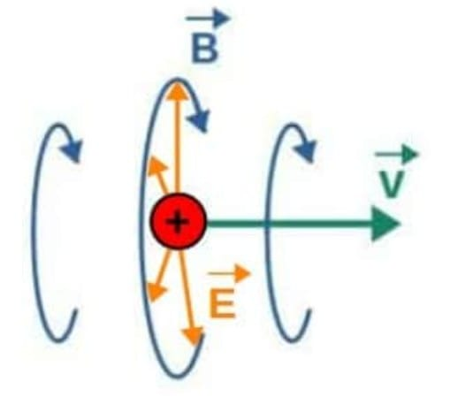

The formula given above also indicates that **a magnetic field is only produced if the charge is moving**. But, you could ask whether it’s possible for a *stationary* charge to also produce a magnetic field.

**Quick tip**: In my opinion, one of the most important topics you need to master to really understand **advanced electrodynamics** – like what is covered in this article – is **vector calculus**.  
  
This, among other reasons, is why I created my own online course **[Advanced Math For Physics](https://courses.profoundphysics.com/p/advanced-math-for-physics-a-complete-self-study-course)** (link to the course page), which aims to give you all of the **fundamental tools** you need to understand topics like **advanced electrodynamics** – and much more. Inside the course, you’ll also get to discover how all the math you learn can be directly applied to physics through **intuitive step-by-step examples** as well as a workbook with tons of **practice problems**.

### Can a Stationary Charge Produce a Magnetic Field?

**A stationary charge does not produce a magnetic field, only a moving charge does. This is due to the fact that for a stationary charge, its electromagnetic field only consists of an electric field and not a magnetic field. This can be understood from the properties of the electromagnetic field tensor.**

The key thing here is that according to classical electrodynamics, a magnetic field can be produced by either of two phenomena:

- **Moving electric charges**, such as a current in a wire or just a single moving charged particle.
- **Changing electric fields**, such as in the case of an electromagnetic wave (which does not require a source charge to propagate).

In the case of a stationary charge, neither of these phenomena occur, so **a stationary charge does not produce a magnetic field**.

Now, in principle a magnetic field can also be created by the intrinsic spin of a charged particle, but this is an entirely different phenomena that requires quantum mechanics to be properly described.

Before we look at exactly why a magnetic field is only produced by a moving charge, I want to highlight the key point here; **if a charge appears stationary, no magnetic field is produced and if a charge appears to be moving, a magnetic field is produced**.

To understand exactly what I mean here by the word “appears”, we need to look at special relativity and **Lorentz transformations**.

## How Special Relativity Explains The Magnetic Field of a Moving Charge

According to special relativity, an electric field in one reference frame might **appear as a magnetic field in another reference frame** (although there is also quite a bit of subtlety under this statement).

Now, to understand this and in particular, how exactly this relates to why magnetic fields are only produced by moving charges, we need to discuss the notions of **Lorentz transformations** and **reference frames**.

### Lorentz Transformations: An Intuitive Explanation

When we compare measurements or physical phenomena between different observers that may be **moving relative to each other**, it’s quite clear that things like spacial coordinates might be measured differently.

This is simply because differently moving observers always describe measurements from their own **reference frame**, which you can think of as a coordinate system (with space and time axes) attached to that observer.

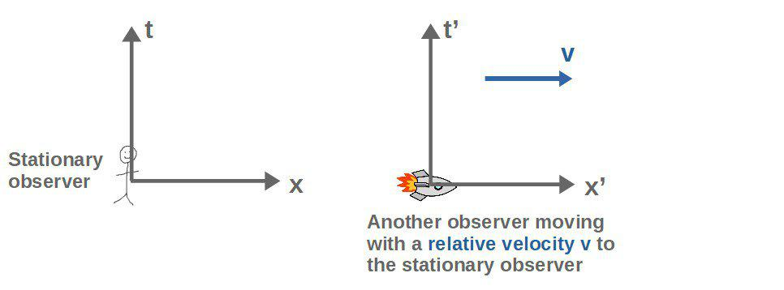

In **ordinary Newtonian physics**, the coordinates measured in one reference frame are related to the coordinates in another reference frame moving with a relative velocity to the first one by so-called **Galilean transformations** (in one dimension):

$$x'=x-vt$$

$$t'=t$$

All these say is that an observer moving with velocity v will measure any x-coordinate as having a value of “vt” (velocity times time) less than the stationary observer and that they both measure time as being the exact same.

Visually, doing a Galilean transformation corresponds to just “sliding” the time axis such that the values stay the same:

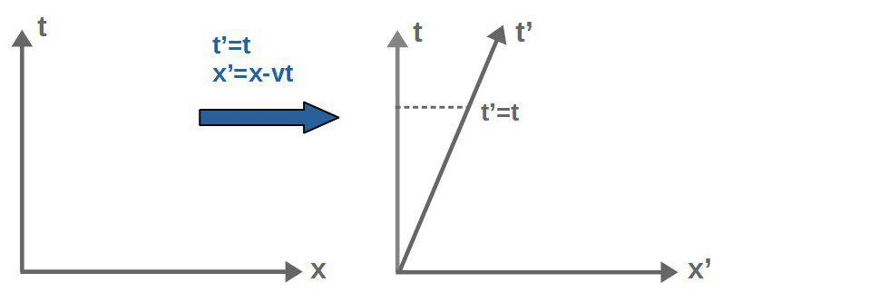

In special relativity, however, things are vastly different. Instead of Galilean transformations, we have **Lorentz transformations**, which look quite a bit more complicated:

$$x'=\gamma\left(x-vt\right)$$

$$t'=\gamma\left(t-\frac{v}{c^2}x\right){,}\ \ \gamma=\frac{1}{\sqrt{1-\frac{v^2}{c^2}}}$$

These can be visualized as some kind of stretch-rotations, in which the space and time axes mix together in a more complicated manner:

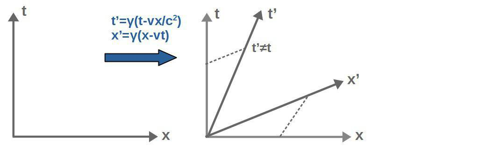

Now, **Lorentz transformations are ACTUALLY physically correct if special relativity is accounted for** and Galilean transformations are only approximately correct for slow velocities.

The reason for this really comes from the experimental evidence that the speed of light is always constant (Lorentz transformations ensure this). You can read more about this in my [introductory special relativity article](https://profoundphysics.com/special-relativity-for-dummies-an-intuitive-introduction/).

The important thing about Lorentz transformations is that **the time and space coordinates mix together**, which results in all sorts of relativistic phenomena like *time dilation* and *length contraction*.

However, the deeper reason behind this is that not only do space and time mix together in Lorentz transformations, **other physical quantities like energy and momentum also do**.

It turns out that it is exactly this effect that also explains **why magnetic fields only appear for moving charges**.

Moreover, since time and space can “mix” together in special relativity, it’s convenient to not describe them as separate things, but simply as different manifestations (components) of the same thing; **spacetime**.

A similar concept turns out to be true for the electric and magnetic fields as well.

Since they can “mix” together under Lorentz transformations, it’s better to think of both the electric and magnetic fields as just different components of the same thing; **the electromagnetic field**, which is described by a **tensor field**. I’ll explain how exactly this works later.

### How an Electric Field “Appears” as a Magnetic Field In Special Relativity

When we perform a Lorentz transformation from a stationary frame to a moving frame, **an electric field in the stationary frame will generally not be the same electric field in the moving frame**.

What’s even more interesting is that an electric field in the stationary frame might actually **“turn into” a magnetic field**, or into a mix of both an electric and a magnetic field, when looked at from the moving frame.

Now, the word “turn into” is not the best way to describe this, but more on that later in this article.

Physically, this means that if we have two observers, one that is stationary and one that is moving relative to the other one, **the stationary observer might see only an electric field, but the moving observer might see a magnetic field also**.

Let’s look at a little example to illustrate this. Say we have a stationary charged particle that produces an electric field only in the y-direction (and no magnetic field):

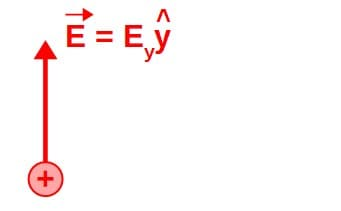 

This y-hat here is a unit vector in the y-direction.

If we then perform a Lorentz transformation in the x-direction (we look at the situation from the frame of someone moving along the x-axis), it turns out that a part of the original y-component of the electric field now appears as a magnetic field in the z-direction.

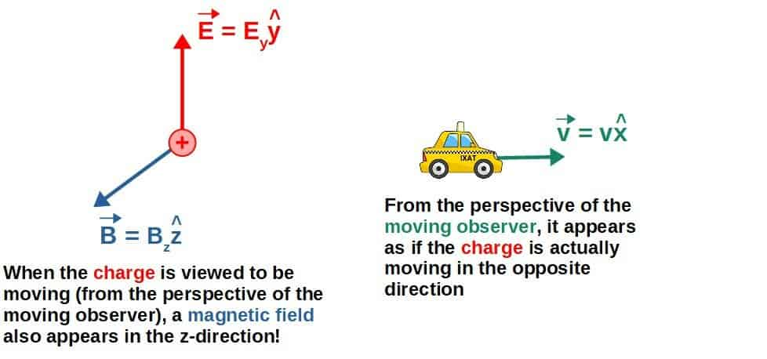

The exact formula for this “new” magnetic field is given by (you’ll find a derivation of this later when we discuss the electromagnetic field tensor):

$$\vec{B}'=-\frac{\gamma}{c^2}\vec{v}\times\vec{E}=-\frac{v}{c^2}\frac{E_y}{\sqrt{1-\frac{v^2}{c^2}}}\hat{z}$$

Here, Ey is the “original” y-component of the electric field, v is the velocity of the moving observer and c the speed of light (a constant).

More generally, this formula could be written as:

$$\vec{B}=\gamma\frac{\mu_0q}{4\pi}\frac{\vec{v}\times\hat{r}}{r^2}$$

In other words, **the magnetic field of a moving charged particle somehow comes from Lorentz transformations** (again, the exact derivation is done later in this article).

The important part about this is that the actual physics seen from the moving frame are not really any different than in the stationary frame, it’s just that the way the physical phenomena appear is different.

This is because even though there is a “new” magnetic field appearing in the moving frame, the “original” electric field also looks different from the moving frame, but **the total effect of the electromagnetic field is still the same**.

This can be understood by comparing, for example, the effects of the “new” and the “original” electromagnetic forces and seeing that they are still exactly the same in both frames (I’ll show this later as well).

**Note**: the formulas given above are examples of stuff you’re going to learn when studying vector calculus, which is pretty much the **basis for all of electromagnetism**. Therefore, if you’re interested to build a deeper understanding of electromagnetism, I recommend checking out my **[Advanced Math For Physics: A Complete Self-Study Course](https://profoundphysicscourses.com/advanced-math/)**. You’ll learn advanced things like how the **Helmholtz decomposition theorem** explains why **Maxwell’s equations** have exactly the form they do as well as many other interesting things.

The conclusion with all of this really is that **electric and magnetic fields are NOT fundamental objects** in the sense that what appears as an electric field for someone, might appear as a magnetic field for someone else.

However, the actual physics that everyone sees is still the same, it just happens to manifest itself in different ways for different observers.

Now, the real explanation behind all of this is that instead of looking at the electric and magnetic fields as somehow separate objects that just happen to turn into one another during Lorentz transformations, we should view them both as parts of one fundamental object, **the electromagnetic field**.

The electromagnetic field consists of both **electric** and **magnetic** “parts”, and these parts may be different when viewed from different frames, but the “total” electromagnetic field is still the same.

In other words, what in one frame appears to be a purely electric field, in another, moving frame appears as a “mix” of both electric and magnetic fields.

The key idea here is that **a magnetic field can appear for an observer in motion, but NOT for a stationary observer** (as we will see in more detail later).

This seems to also suggest that a magnetic field is the “part” of the electromagnetic field that appears **only for moving observers**.

By this, we can finally understand why a moving charge produces a magnetic field; **if a charge is stationary, it only produces an electric field, but when viewing the charge from a frame that is moving relative to the charge, a magnetic field is also produced**.

The key here is to realize that for an observer viewing the charged particle from a moving reference frame, it is *exactly* the same as **charge moving relative to the observer**.

Therefore, a magnetic field will only appear if there is a relative velocity between a charged particle and someone looking at the charge. In other words, **a magnetic field is only produced when a charged particle is moving**.

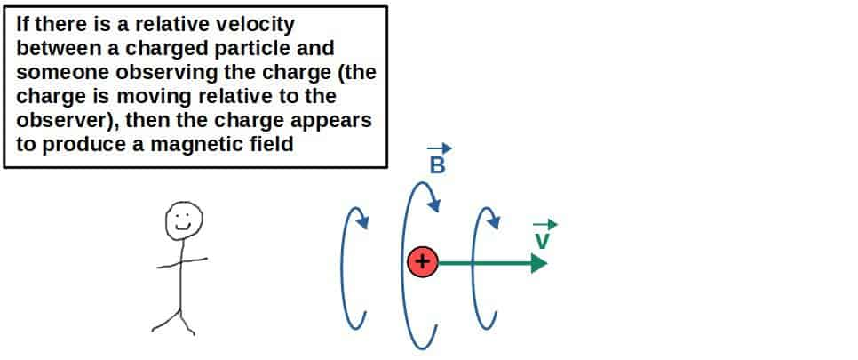

## Is The Magnetic Field By a Moving Charge Caused By Relativity?

If an electric field, according to special relativity, can “look” like a magnetic field for another observer, you may have the question of whether magnetism itself is actually caused by relativity.

**In short, magnetism is not caused by relativity. Magnetism is its own phenomenon that exists regardless of relativity. However, according to special relativity, different observers may disagree on whether a given electromagnetic phenomenon is a result of magnetism or electricity**.

If you’re ever come across discussion on the relation between special relativity and magnetism, you may have seen some weird example of how the electric field of a charged wire somehow “turns into” a magnetic field when viewed from a moving frame.

However, it’s a huge misconception to think that the magnetic field itself would be *caused by* the electric field.

In reality, **electricity does NOT cause magnetism**. These are two distinct phenomena that do not cause each other, but what special relativity tells you is that **two observers may disagree on whether a field “looks” electric or magnetic**.

It’s not a question of which one, an electric or a magnetic field, is more fundamental or which one “causes” the other. Rather, it’s a question of **how one observes these fields and how they appear in different frames**.

Really, you should think of both electric and magnetic fields both as parts of one fundamental field, the **electromagnetic field** (which we will discuss in detail soon) and depending on who is observing this field, it may look “more electric” or “more magnetic”.

So, if someone tells you that “magnetism is just electricity with relativity applied” or that “magnetism is caused by relativity”, just know that this is an oversimplification and not really true from a fundamental perspective.

Now, to really understand *why* a magnetic field is only produced when a charge is moving, we need to dive deeper into the actual structure of electromagnetic fields themselves and how relativity plays into this.

## The Correct Way To Think About Electromagnetic Fields

For most people, they start learning electromagnetism by thinking about electric and magnetic fields as two completely different objects (as two different vector fields, to be precise).

However, this isn’t really the best way to think about it if **special relativity** is accounted for.

**Instead of thinking about electric and magnetic fields as separate objects, we should think of them both as components of one fundamental object; the electromagnetic field**.

I’ll explain the mathematical details of the electromagnetic field soon, but it’s best we begin by an analogy.

Imagine the full electromagnetic field as kind of like an ocean; if we place a stationary charged particle there and let it oscillate up and down (while still sitting at the same point), it’ll create these radially outgoing circular waves.

You can kind of think of these as an electric field produced by the “stationary” charge:

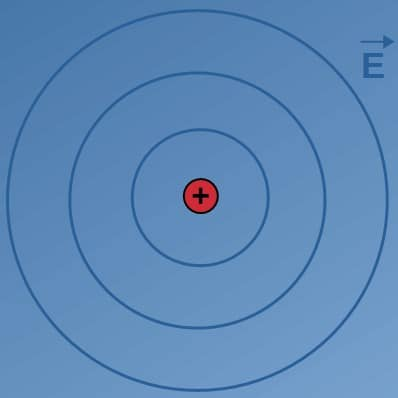

However, if the charge now starts **moving in some direction**, these “waves” tend to spread perpendicularly to its direction of motion (if you’ve ever seen a ship moving in the ocean, it creates this V-shaped wave pattern around it).

You could think of these as analogous to a **magnetic field produced by a moving charge**; they are only produced when the object is moving and they tend to occur perpendicularly to the direction of motion.

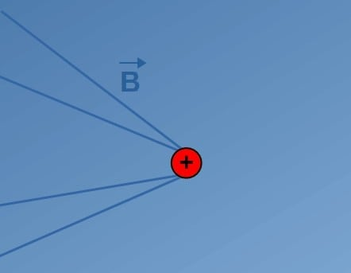

Now, of course, this “water wave” -analogy is by no means exactly what happens with electric and magnetic fields.

However, it illustrates the underlying idea here; **even though these water waves look different for stationary and moving observers, they are still “parts” of the underlying structure, which is the ocean itself**.

The waves just happen to manifest themselves differently when viewed from a moving frame, but they are still ocean waves.

Now, **the same idea should be applied to electric and magnetic fields as well**; the fundamental physical object here is the **electromagnetic field**, not the individual electric and magnetic fields.

These electric and magnetic fields just happen to manifest themselves in different ways when viewed from different frames (corresponding to different electric and magnetic field configurations), but **they are still parts of the electromagnetic field itself**.

So, to really understand this whole “relativistic electromagnetism” stuff, we have to get away from thinking of the electric and magnetic fields as separate things and instead just think of them as different manifestations of the fundamental “full” electromagnetic field.

In particular, **the magnetic field represents the components of the electromagnetic field that are observed when there is relative motion between frames**, which is precisely why a charged particle only seems to produce a magnetic field when it is moving.

## The Electromagnetic Field Tensor & Magnetic Field of a Moving Charge

We typically think of the electric and magnetic fields as **vector fields**, which “assign” a vector to each point in space.

However, when combined, the full **electromagnetic field** (which consists of both the electric and magnetic field at each point in space) is mathematically a **tensor field** that “assigns” a tensor to each point in space.

This electromagnetic field is described by the **electromagnetic field tensor**, which is the fundamental physical object in all of electromagnetism. You can think of it as **describing both the electric and magnetic fields at each point in space**.

Now, what is the electromagnetic field tensor really? Well, to answer this, we need to understand what a tensor is and for that, we need to note a couple things about vectors first.

First of all, if we view a vector from a different reference frame, **its components will generally be different, but the actual vector itself (its length and direction) won’t**.

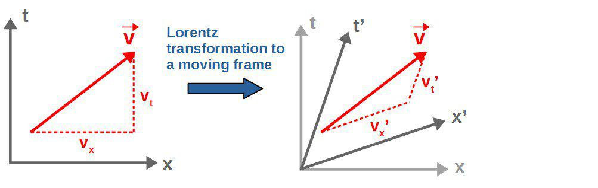 

Note: these vectors with a “time-component” (vt) and a “space-component” (vx) are called four-vectors, which can be thought of as *vectors in spacetime*. I discuss four-vectors in more detail in my introduction to special relativity found [here](https://profoundphysics.com/special-relativity-for-dummies-an-intuitive-introduction/).

This property is called ***covariance*** and it is one of the defining features of what a vector is.

In other words, **when performing a Lorentz transformation to a moving frame, the components of a vector will mix together** (but the actual vector will remain the same “arrow”).

The exact same thing happens to a **tensor** as well and this is indeed how a tensor is often defined in physics; **a tensor is a geometric object whose components may change under Lorentz transformations but the tensor itself (its geometric properties) remains the same**.

In fact, this property of tensors is pretty much the reason why tensors are used in **general relativity** as well. In case you’re interested, I explain this in more detail in my article **[General Relativity For Dummies](https://profoundphysics.com/general-relativity-for-dummies/)**.

It’s common to represent the components of a vector as a “list” or a column of stuff. In special relativity, we typically deal with **four-vectors**, which have both the usual “space components” as well as a “time component”:

$$v^{\mu}=\begin{pmatrix}v_t\\v_x\\v_y\\v_z\end{pmatrix}$$

The index µ here (which can take on the values 0,1,2,3) labels which of these four-vector components we’re talking about. For example, µ=0 would refer to vt and µ=3 to vz. This is a standard piece of notation used in special relativity.

By the way, this **index notation** for vectors you’re seeing above is something I cover in detail in my **[Vector Calculus For Physics](https://profoundphysicscourses.com/advanced-math/)** -course, so if you want to learn that better, check out the course! I also cover things like **coordinate transformations**, which Lorentz transformations are just one example of.

Similarly, a tensor (a 4×4-tensor in this case) is an object that can be represented as a “table” of stuff, which are its **tensor components**:

$$T^{\mu\nu}=\begin{pmatrix}T^{tt}&T^{tx}&T^{ty}&T^{tz}\\T^{xt}&T^{xx}&T^{xy}&T^{xz}\\T^{yt}&T^{yx}&T^{yy}&T^{yz}\\T^{zt}&T^{zx}&T^{zy}&T^{zz}\end{pmatrix}$$

Here again, both µ and ν run from 0 to 3, so for example, the component with µ=0 and ν=2 would represent T02=Tty.

Now, how does all of this relate to the electromagnetic field? Well, **the electromagnetic field is represented by the electromagnetic field tensor, which is a 4×4-tensor with the electric and magnetic fields as its components**:

$$F^{\mu\nu}=\begin{pmatrix}0&-\frac{E_x}{c}&-\frac{E_y}{c}&-\frac{E_z}{c}\\\frac{E_x}{c}&0&-B_z&B_y\\\frac{E_y}{c}&B_z&0&-B_x\\\frac{E_z}{c}&-B_y&B_x&0\end{pmatrix}$$

Here Ex, Ey and Ez are the components of the electric field, the B’s are the magnetic field components (whatever these happen to be for any given electromagnetic field configuration) and c is the speed of light, i.e. a constant. Moreover, this type of tensor (an *antisymmetric* tensor) has only 6 independent components, corresponding to the 3 electric field components and to the 3 magnetic field components.

This object is fundamentally what describes any electromagnetic field we observe.

Now, **the components of this field tensor can also mix under Lorentz transformations**, which is where we get to the “mixing” of the electric and magnetic fields mentioned earlier.

I’ll show how this happens mathematically very soon, but intuitively, when we do a Lorentz transformation (look at the electromagnetic field from a moving perspective), the components of this field tensor will be different and “mix” together.

Physically, this corresponds to the electric and magnetic fields getting “mixed” together, meaning that **from a moving frame, an electric field may appear as a magnetic field and vice versa**.

This is exactly the reason for why a magnetic field appears only when a charge is moving.

**An electromagnetic field that is seen as a purely electric field in a stationary frame, will appear partly as a magnetic field when viewed from a moving frame**.

However, this does NOT mean that magnetic fields are just “electric fields in a moving frame”.

Fundamentally, both electric and magnetic fields are **distinct physical fields** that are both components of the electromagnetic field and they are both their own objects.

It simply just happens that **a magnetic field is the part of the electromagnetic field that appears in a moving frame, NOT that the electric field itself somehow “turns into” a magnetic field when a charge is moving**.

Next, let’s look at how exactly these electromagnetic field components appear from Lorentz transformations mathematically.

### Lorentz Transformation of The Electromagnetic Field Tensor

The way magnetic fields mathematically appear in moving frames is by a **Lorentz transformation of the electromagnetic field tensor.**

In particular, when doing a **Lorentz transformation from a stationary charge’s frame into a frame where the charge now appears to be moving**, we get new components of the electromagnetic field tensor.

We call these the **magnetic field**, but from a fundamental perspective, these are really just components of the electromagnetic field.

Now, here we’ll look at the case of a **stationary charge configuration** that happens to create an **electric field in the y-direction**. So, initially we have an electric and a magnetic field of the form (here represented as these column vectors):

$$\vec{E}=\begin{pmatrix}0\\E_y\\0\end{pmatrix}\ {,}\ \ \vec{B}=\begin{pmatrix}0\\0\\0\end{pmatrix}$$

In other words, we have the “initial” electromagnetic field in the form of the **electromagnetic field tensor**:

$$F^{\mu\nu}=\begin{pmatrix}0&0&-\frac{E_y}{c}&0\\0&0&0&0\\\frac{E_y}{c}&0&0&0\\0&0&0&0\end{pmatrix}$$

For this example, we want to now perform a **Lorentz transformation in the x-direction**.

Physically, what this means is that we’re now looking at the situation from another observer’s perspective that is moving in the x-direction (with constant velocity).

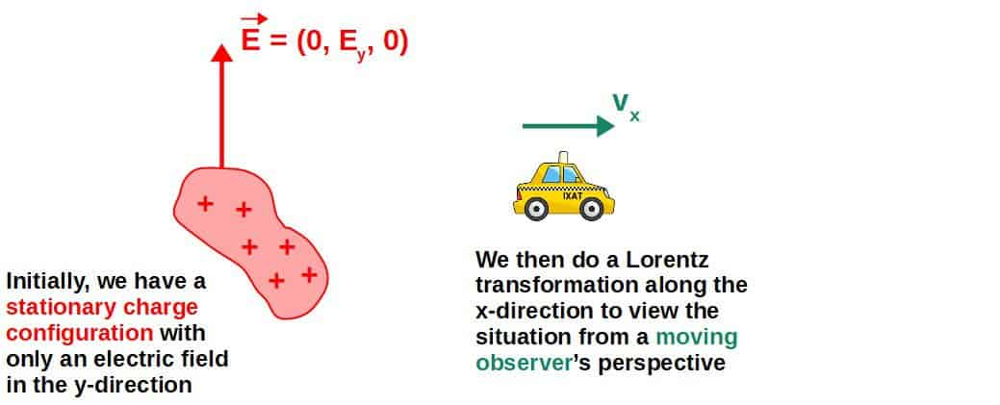

From the moving observer’s perspective, however, it turns out that there is now **also a magnetic field in the z-direction, in addition to the electric field in the y-direction** (which has a different value in the moving frame).

The key here is to realize that when viewed from the perspective of the other (moving) observer, **the charge configuration now looks like it is moving in the opposite direction**, while the observer appears stationary (when viewed from its own perspective, which is what the Lorentz transformation does).

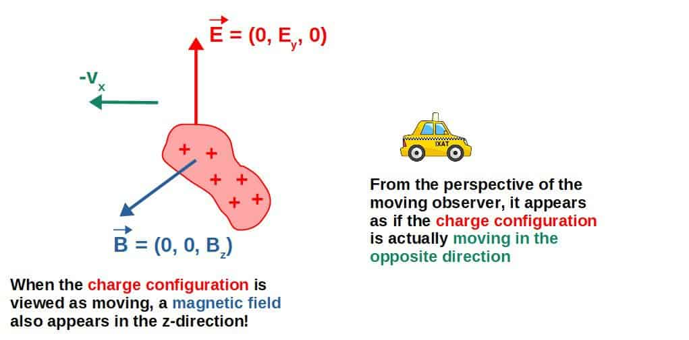

This “new” magnetic field as seen from the moving observer’s perspective (which is what the ‘-symbol represents here), mathematically, has the form:

$$\vec{B}'=\begin{pmatrix}0\\0\\-\frac{\gamma vE_y}{c^2}\end{pmatrix}$$

The derivation of this is found below.

The full **electromagnetic field tensor from the moving perspective** now appears to have the following form:

$$\left(F^{\mu\nu}\right)'=\begin{pmatrix}0&0&-\frac{\gamma E_y}{c}&0\\0&0&\frac{\gamma vE_y}{c^2}&0\\\frac{\gamma E_y}{c}&-\frac{\gamma vE_y}{c^2}&0&0\\0&0&0&0\end{pmatrix}$$

In other words, from the perspective of the moving observer (which now sees the charge configuration moving), the electromagnetic field of the charge configuration appears to have a **different electric field in the y-direction** as well as a **magnetic field in the z-direction**.

This is indeed exactly how a moving charge “creates” a magnetic field; **when viewed from a reference frame where the charge is moving, the electromagnetic field now appears to also have a magnetic component**.

Below I’ve included the full mathematical details of this Lorentz transformation discussed here for those of you who are interested.

I’ve also included some discussion of how the actual **physical consequences** of these two seemingly different electromagnetic field configurations are *actually the same*.

In other words, the physics related to the electromagnetic field is still the same, no matter which (inertial) reference frame the field is observed from.

Lorentz transformation of the EM-field mathematically & its physical consequences

A Lorentz transformation in the x-direction (i.e. into a moving observer’s frame) can be represented as a coordinate transformation matrix of the form:

$$\Lambda_{\alpha}^{\mu'}=\begin{pmatrix}\gamma&-\frac{\gamma v}{c}&0&0\\-\frac{\gamma v}{c}&\gamma&0&0\\0&0&1&0\\0&0&0&1\end{pmatrix}$$

Here, v is the velocity of the moving observer in the x-direction, c is the speed of light and γ is the Lorentz factor γ=(1-v2/c2)-1/2. These indices µ and α here (which both run from 0 to 3) just label the components of this matrix and the ‘-symbol represents the fact that this is a transformation to the “primed” coordinate frame of the moving observer.

In case this seems unfamiliar to you, I actually cover coordinate transformations, how they are practically used and everything we’re going to talk about here in my **[Advanced Math For Physics: A Complete Self-Study Course](https://courses.profoundphysics.com/p/advanced-math-for-physics-a-complete-self-study-course)** (click to check it out if you’re interested to learn more).

Anyway, the Lorentz transformation rule for the electromagnetic field tensor goes as follows:

$$\vec{B}=\gamma\frac{\mu_0q}{4\pi}\frac{\vec{v}\times\hat{r}}{r^2}$$

The α,β -indices here are just “dummy” indices, meaning that they should be summed over from 0 to 3. This “primed” field tensor here, (Fµν)’ is the electromagnetic field tensor (its components, to be precise) in the moving frame, while Fαβ represents the field components in the original, stationary frame.

Here, we need to firstly sum over these α- and β-indices from 0 to 3:

$$\left(F^{\mu\nu}\right)'=\Lambda_{\alpha}^{\mu'}\Lambda_{\beta}^{\nu'}F^{\alpha\beta}=\Lambda_0^{\mu'}\Lambda_0^{\nu'}F^{00}+\Lambda_1^{\mu'}\Lambda_0^{\nu'}F^{10}+...+\Lambda_3^{\mu'}\Lambda_3^{\nu'}F^{33}$$

The only non-zero terms here are the ones with µ=2, ν=0 (and also µ=0, ν=2) and µ=2, ν=1 (and also µ=1, ν=2). When µ=2 and ν=0, this sum reduces to just:

$$\left(F^{20}\right)'=\Lambda_2^{2'}\Lambda_0^{0'}F^{20}$$

Then, inserting all of the various components into this (Λ22′=1, Λ00′=γ and F20=Ey/c), we get:

$$\left(F^{20}\right)'=\Lambda_2^{2'}\Lambda_0^{0'}F^{20}=\frac{\gamma E_y}{c}$$

This is also the same as -(F02)’. Now, for the µ=2, ν=1 case, the sum reduces to:

$$\left(F^{21}\right)'=\Lambda_2^{2'}\Lambda_0^{1'}F^{20}$$

Inserting all the components into this (Λ22′=1, Λ10′=-γv/c and F20=Ey/c), we get:

$$\left(F^{21}\right)'=\Lambda_2^{2'}\Lambda_0^{1'}F^{20}=-\frac{\gamma vE_y}{c^2}$$

This is also the same as the -(F12)’ -component. We can then collect all the components of this “new” electromagnetic field tensor into:

$$\left(F^{\mu\nu}\right)'=\begin{pmatrix}0&0&-\frac{\gamma E_y}{c}&0\\0&0&\frac{\gamma vE_y}{c^2}&0\\\frac{\gamma E_y}{c}&-\frac{\gamma vE_y}{c^2}&0&0\\0&0&0&0\end{pmatrix}$$

This is the electromagnetic field as seen from the frame in which the charge appears to be moving. We can see that, while the “original” electric field only had a y-component (Ey), the “new” electric field from the moving frame also has a y-component, but it is now γEy instead of the original Ey.

Moreover, the electromagnetic field, as seen by the moving observer, now also has a z-component of the magnetic field (since this F21-slot generally represents Bz), which originally was zero. This z-component of the magnetic field is given by:

$$B_z'=-\frac{\gamma vE_y}{c^2}=-\frac{\gamma}{c^2}\left|\vec{v}\times\vec{E}\right|$$

This vEy-product can actually be written as the magnitude of the cross product between the velocity vector v=(v,0,0) and the “original” electric field vector E=(0,Ey,0). Anyway, this is just an additional detail and it just tells you that the “new” magnetic field points perpendicularly to the electric field as well as also to the velocity.

We can also write this formula as:

$$\vec{B}=\frac{\gamma}{c^2}\vec{v}\times\vec{E}$$

If you were to insert to this the electric field of a point charge, you’d get:

$$\vec{E}=\frac{q}{4\pi\varepsilon_0r^2}\hat{r}\ \ \Rightarrow\ \ \vec{B}=\gamma\mu_0\varepsilon_0\vec{v}\times\left(\frac{q}{4\pi\varepsilon_0r^2}\hat{r}\right)=\gamma\frac{\mu_0q}{4\pi}\frac{\vec{v}\times\hat{r}}{r^2}$$

Here I’ve also used the definition of the speed of light, c=1/√µ0ε0.

This is indeed the standard formula for the magnetic field of a moving charged particle (or slow velocities, γ≈1). It’s quite interesting to see it how it can be derived from special relativity like this.

The really interesting thing about all of this, however, is that the actual physics are still the same in both reference frames.

We can understand this by looking at how the electromagnetic forces resulting from these fields affect a charged particle in both of these fields.

In particular, let’s look at the change in the momentum of a particle (with charge q) caused by firstly, the original electromagnetic field. The force produced by the original field only consists of the electric force, given by:

$$\vec{F}=q\vec{E}=qE_y\hat y$$

The y-hat here is a unit vector in the y-direction.

So, when viewed from the stationary frame (with only a y-component of the electric field), the charged particle’s momentum would change (in a time Δt; for simplicity, we’re assuming the field to be constant with time) by the amount:

$$\Delta\vec{p}=\vec{F}\Delta t=qE_y\Delta t\hat y$$

However, when viewed from the moving frame (i.e. the frame where this same charged particle with charge q we’re analyzing would now appear to be moving in the *opposite* direction with velocity -v), there is now a different electric field and also a magnetic field.

The electromagnetic force acting on the charged particle, as seen from this frame, would now be:

$$\vec{F}'=q\left(\vec{E}'+\vec{v}'\times\vec{B}'\right)$$

These “primed” fields here are the electric and magnetic fields as seen from the moving frame and this “primed” velocity is the velocity that the charged particle q appears to have in the frame of the moving observer:

$$\vec{E}'=\begin{pmatrix}0\\\gamma E_y\\0\end{pmatrix}\ {,}\ \ \vec{B}'=\begin{pmatrix}0\\0\\-\frac{\gamma vE_y}{c^2}\end{pmatrix}\ {,}\ \ \vec{v}'=\begin{pmatrix}-v\\0\\0\end{pmatrix}$$

To better illustrate this whole situation, here’s a picture of what is going on:

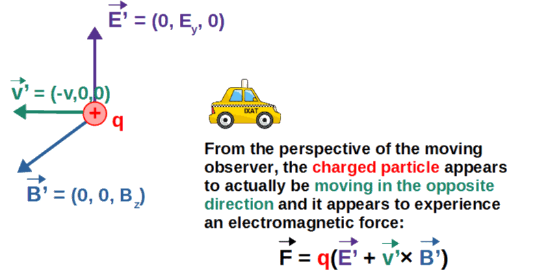

Anyway, if we insert all the vector components into the force, we get the following:

$$\vec{F}'=q\left(\gamma E_y\hat{y}-v\frac{\gamma vE_y}{c^2}\hat{y}\right)=q\gamma E_y\left(1-\frac{v^2}{c^2}\right)\hat{y}$$

This y-hat basis vector in the second term comes from cross product between v’ and B’.

However, this 1-v2/c2 term is just:

$$1-\frac{v^2}{c^2}=\left(\frac{1}{\left(1-\frac{v^2}{c^2}\right)^{-\frac{1}{2}}}\right)^2=\frac{1}{\gamma^2}$$

Reminder: the Lorentz factor is γ=(1-v2/c2)-1/2.

So, the electromagnetic force in the moving frame is then:

$$\vec{F}'=q\gamma E_y\left(1-\frac{v^2}{c^2}\right)\hat{y}=\frac{qE_y}{\gamma}\hat{y}$$

Now, here comes an important part; when looking at the charged particle q from the moving frame, its *time* also appears to be slowed down due to **time dilation** (I discuss time dilation more in [this article](https://profoundphysics.com/special-relativity-for-dummies-an-intuitive-introduction/)).

So, the moving observer actually sees the time passed for the charged particle as:

$$\Delta t'=\gamma\Delta t$$

Here, Δt is the time passed in the frame of the charged particle itself and Δt’ is the time passed as seen by the moving observer.

Therefore, the change in the charged particle’s momentum in a time Δt, *as seen from the frame o the moving observer*, would be:

$$\Delta\vec{p}'=\vec{F}'\Delta t'=\frac{qE_y}{\gamma}\hat{y}\gamma\Delta t=qE_y\Delta t\hat{y}$$

This is exactly the same as we had in the stationary frame! So, somehow all the “relativistic” effects between the moving and the stationary frame result in the exact same physical consequences for the charged particle.

In other words, the physical results of the electromagnetic field is the exact same from both frames, it just manifests itself in different ways for different observers (such as in the form of an electric field for one observer and a combination of electric and magnetic fields for another observer).

If learning advanced stuff like what is covered in this article if of interest to you, you might want to check out my course **[Advanced Math For Physics](https://courses.profoundphysics.com/p/advanced-math-for-physics-a-complete-self-study-course)** (link to the course page), which aims to give you all of the **fundamental tools** you need to understand topics like **advanced electrodynamics** – and much much more.  
  
Inside the course, you’ll get to discover how all the math you learn can be directly applied to physics through **intuitive step-by-step examples** as well as a workbook with tons of **practice problems**.

---

*← [Back to the full archive](../index.html)*
